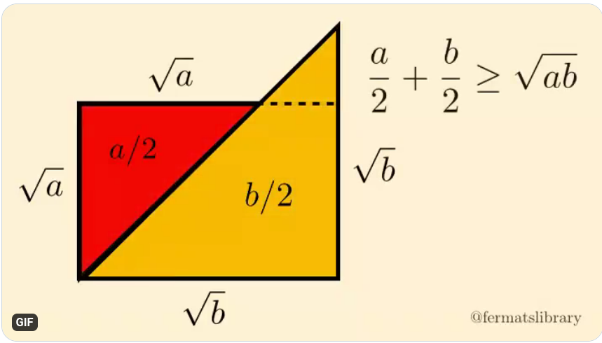
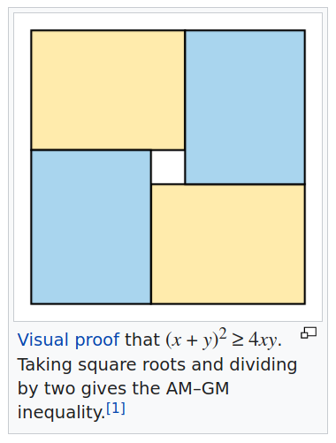

---
output:
  pdf_document: default
  html_document: default
---


# (APPENDIX) Appendix {-} 

# Math and linear algebra
<!--
# TODO Finish introductory part on linear algebra in appendix
# I think we need an introduction on inner products, linearty, vector na matrix norms,
# trigonometry, identities, and so on..
# labels: todo, help wanted, good first issue
-->

Take a look at [this](https://www.math.usm.edu/lambers/mat610/sum10/lecture2.pdf). 


<!-- ## Complex numbers -->
<!-- - $z\overline{z} = a^2 + b^2= |z|$ -->
<!-- - $\frac{1}{z} = \frac{\overline{z}}{\overline{z}z} $ -->
<!-- - Conjugation (reflection over "horizontal axis"): $z \mapsto \overline{z} = (a-ib) = e^{ix}$ -->

<!-- \begin{itemize} -->
<!--     \item Linarity:  -->
<!--     $$f(a+b) = f(a) + f(b)$$ -->
<!--     $$f(\alpha a) = \alpha f(a) $$ -->
<!-- maybe add this: \url{http://www-math.mit.edu/~djk/calculus_beginners/chapter03/section03.html} -->

<!-- \end{itemize} -->


```{definition, name="Inner product"}
A function $f: A \times B \mapsto \mathbb{C}$ is called an inner product $(a,b) \mapsto z$ if:

-  $(a,b+c) = (a,b)+(a,c)$ (and respectively for $(a+c,b)$ )
-  $(a,\alpha b) = \alpha (a,b)$

```


```{definition, name="Norm"}
A function $f : \mathbb{R}^d \mapsto \mathbb{R}$ is called a norm if:

- $\|x\| \geq 0 \forall x \in \mathbb{R}^{d}$, also $\|x\|=0$ iif $x=0$ (positive definiteness)
- $\|\alpha x\| = \alpha \|x\| \forall x \in \mathbb{R}^{d}$ and $\forall \alpha \in \mathbb{R}$ (positively homogeneous)
- $\|x\|-\|y\| \leq  \|x + y\| \leq \|x\| + \|y\|$ (triangle inequality).

```

The triangle inequality is basically the [subadditivity](https://en.wikipedia.org/wiki/Subadditivity) property of the norm. It is simople to see that norms are **not** linear operators. 


```{theorem, name="Cauchy(-Bunyakovsky)-Schwarz"}
$$|(x,y)| \leq \|x\| \|y\|$$
```
```{proof}
Note that by taking the square on both sides we get: $(x,y)^2 \leq (x,x)(y,y)$.
Substituting $(x,y)=\|x\| \|y\| cos(\theta)$, we get:
$$|\|x\|^2\|y\|^2 cos^2(\theta) | \leq (x,x)(y,y)$$
The inequality follows from noting that $|cos(\theta)|$ is always $\leq 1$.
```

```{remark}
It is simple to see - using Cauchy-Schwarz - that for a vector $x$ we have that:
$$\|x\|_1 \leq \sqrt{n} \|x\|_2 $$
```


<!-- \paragraph{Matrix norms} -->
<!-- \begin{itemize} -->
<!--     \item All properties of vector norms .. -->
<!-- \item Submultiplicativity -->
<!--     \item  -->
<!-- \end{itemize} -->

We will use the following matrix norms:

- $\|A\|_0$ as the number of non-zero elements of the matrix $A$,
- $\|A\|_1 = \max\limits_{1 \leq j \leq n} \sum_{i=0}^n |a_{ij}|$ is the maximum among the sum of the absolute value along the columns of the matrix,
- $\|A\|_2 = \|A\| = \sigma_1$ is the biggest singular value of the matrix,
- $\|A\|_\infty = \max\limits_{1 \leq i \leq m} \sum_{j=0}^n  |a_{ij}|$ is the maximum among the sum of the absolute values along the rows of the matrix,
- $\norm{A}_{\max}$ is the maximal element of the matrix in absolute value.
- $\norm{A}_F$ is the Frobenius norm of the matrix, defined as $\sqrt{\sum_{ij}a_{ij}^2}$

Note that for symmetric matrices, $\|A\|_\infty = \|A\|_1$.


<!-- from dequantization of qsfa -->
```{exercise, name="bound error on product of matrices"}
Suppose that $\|A - \overline{A}\|_F \leq \epsilon \|A\|_F$.
Bound $\|A^TA - \overline{A}^T\overline{A}\|_F\|$
```

<!-- ```{proof} -->
<!-- $$A^TA + \overline{A}^TA - \overline{A}^TA  - \overline{A}^T\overline{A}=$$ -->
<!-- $$( A^TA + \overline{A}^TA - \overline{A}^TA  - \overline{A}^T\overline{A}=$$ -->
<!-- ``` -->


```{definition, name="Distance"}
A function $f : \mathbb{R}^d \times \mathbb{R}^d \mapsto \mathbb{R}$ is called a distance if:

- $d(x,y) \geq 0$
- $d(x,y) = 0$ iif $x=y$
- $d(x,y)=d(y,x)$
- $d(x,z) \leq d(x,y) + d(y+z)$

```

#### Properties of the trace operator

- $Tr[A+B] = Tr[A] + Tr[B]$
- $Tr[A\otimes B] = Tr[A]Tr[B]$
- $Tr_1[A\otimes B] = Tr[A]B$
- $Tr[\ket{a}\bra{b}] = \braket{a|b}$
- $Tr[AB] = \langle A, B \rangle$

where inner product between matrices is basically defined pointwise as $\sum_{ij}a_{ij}b_{ij}$

```{exercise}
 Can you show that the last identity is true?
```

#### Properties of tensor product

Given two liner maps $V_1 : W_1 \mapsto V_1$ and $V_2 : W_2 \mapsto V_2$ we define the tensor product as the linear map:
$$V_1 \otimes V_2 : V_1 \otimes V_2 \mapsto W_1 \otimes W_2 $$

- $\alpha v \otimes w = v \otimes \alpha w = \alpha(v \otimes w)$
- $( v_1 + v_2) \otimes w = (v_1 \otimes w) + (v_2 \otimes w)$ (and the symmetric of it)
- $\ket{\psi_1}\bra{\phi_1} \otimes \ket{\psi_2}\bra{\phi_2} = \ket{\psi_1}\ket{\psi_2} \otimes \bra{\phi_1}\bra{\phi_2}$ <!-- improve, check.. -->

When a basis is decided for representing linear maps between vector spaces, the tensor product becomes the Kroeneker product. 


#### Useful inequalities 

```{r, amgm-images, fig.cap="AMGM inequality from wikipedia and twitter", echo=FALSE}



```

```{theorem, jense, name="Jensen inequality"}
Jensen inequality
```


```{theorem binomial-theorem, name="Binomial theorem"}
$$(a+b)^n = \sum_{k=0}^n {n \choose k} a^kb^{n-k}$$
```


## Linear algebra

<!-- 
# TODO Adjust citations and labels
-->


### Eigenvalues, eigenvectors and eigendecomposition of a matrix

Real matrices are important tools in Machine Learning as they allow to comfortably represent data and describe the operations to perform during an algorithm. Eigenvectors and eigenvalues are fundamental linear algebra concepts that provide important information about a matrix. 

```{definition, name="Eigenvalues and Eigenvectors (Section 6.1 page 289 from [@linearalgebragilbert] )"}
Let $A$ be a $\mathbb{R}^{n\times n}$ square matrix, $q \in \mathbb{R}^{n}$ a non-zero vector and $\lambda$ a scalar. If the following equation is satisfied
$$Aq = \lambda q,$$
then $q$ is said to be an eigenvector of matrix $A$ and $\lambda$ is its associated eigenvalue.
```

To have a geometric insight into what eigenvectors and eigenvalues are, we can think of any matrix as a linear transformation in the $\mathbb{R}^n$ space. Under this light, we can say that the eigenvectors of a matrix are those vectors of the space that, after the transformation, lie on their original direction and only get their magnitude scaled by a certain factor: the eigenvalue.

The eigenvalues reveal interesting properties of a matrix. For example, the trace of a matrix (i.e. the sum of the element along the main diagonal of a square matrix) is the sum of its eigenvalues
$$Tr[A] = \sum_i^{n}\lambda_i,$$
and its determinant is equal to the product of the eigenvalues (Section 6.1 page 294 from [@linearalgebragilbert])
$$det(A) = \prod_i^{n}\lambda_i.$$

Moreover, a matrix $A$ with  eigenvalues $\{\lambda_1, ..., \lambda_k\}$ has an inverse only if all the eigenvalues are not zero. The inverse has eigenvalues $\{\frac{1}{\lambda_1}, ..., \frac{1}{\lambda_k}\}$.

Generally, one eigenvalue can be associated with multiple eigenvectors. There might be a set of vectors $E(\lambda) \subseteq \mathbb{R}^n$ such that for all those vectors $q \in E(\lambda): Aq = \lambda q$. That is why for each eigenvalue we talk about an eigenspace. 

```{definition, eigenspace, name="Eigenspace (Definition 7.1.5 page 108 [@scappellato])"}
Let $A$ be a $\mathbb{R}^{n\times n}$ square matrix and $\lambda$ be an eigenvalue of $A$. The eigenspace of $A$ related to $\lambda$ is the space defined over the set of vectors $E(\lambda) = \{ x: Ax = \lambda x\}$.
```

For each eigenspace, through the Gram-Schmidt procedure, starting from linearly independent vectors it is possible to identify a set of orthogonal eigenvectors that constitute a basis for the space. The basis that spans the space where all the eigenvectors of a matrix lie is called eigenbasis.

```{definition, name="Eigenbasis"}
A basis for the space where all the eigenvectors of a matrix lie is called eigenbasis.
```

An important result is that vectors in different eigenspaces are linearly independent.

```{lemma, name="Linear independence of eigenvectors (Lemma 7.2.3 page 112 from [@scapellato]"}

The set of vectors obtained by the union of the bases of the eigenspaces of a matrix is linearly independent.
```
This means that if the sum of the dimensions of the eigenspaces $\sum_i dim(E(\lambda_i))$ equals $n$, it is possible to find $n$ eigenvectors of $A$ that form a basis for the $\mathbb{R}^n$ space. If that is the case, each vector that lies in $\mathbb{R}^n$ can be written as a linear combination of the eigenvectors of $A$.
Interestingly, matrices that have $n$ linearly independent eigenvectors can be decomposed in terms of their eigenvalues and eigenvectors.

```{theorem, name="Eigendecomposition or Diagonalization"}
\cite[Section 6.2 page 304]{linearalgebragilbert}
Let $A \in \mathbb{R}^{n \times n}$ be a square matrix with $n$ linearly independent eigenvectors. Then, it is possible to decompose the matrix as
$$A = Q\Lambda Q^{-1}.$$
Where $Q \in \mathbb{R}^{n\times n}$ is an square matrix and $\Lambda \in \mathbb{R}^{n\times n}$ is a diagonal matrix. In particular, each $i^{th}$ column of $Q$ is an eigenvector of $A$ and the $i^{th}$ entry of $\Lambda$ is its associated eigenvalue.
```

The matrices that can be eigendecomposed are also said diagonalizable, as in practice the theorem above states that such matrices are similar to diagonal matrices. Unfortunately, not all the square matrices have enough independent eigenvectors to be diagonalized. The Spectral Theorem provides us with a set of matrices that can always be eigendecomposed.

```{theorem, spectral-theorem, name="Spectral theorem"}
\cite[Spectral Theorem page 339]{linearalgebragilbert}
Every symmetric matrix is diagonalizable $A = Q\Lambda Q^{-1}$. Furthermore, its eigenvalues are real and it is possible to choose the columns of $Q$ so that it is an orthogonal matrix.
```
Recall that a matrix $Q$ is said to be orthogonal if $QQ^T=Q^TQ = \mathbb{I}$, therefore $Q^{-1} = Q^T$.
The Spectral theorem, together with the fact that matrices like $A^TA$ and $AA^T$ are symmetric, will come in handy in later discussions.

Being able to eigendecompose a matrix allows performing some computations faster than otherwise. Some examples of operations that gain speed-ups from the eigendecomposed representation are matrix inversion and matrix exponentiation. Indeed, if we have a matrix $A=Q\Lambda Q^{-1}$ its inverse can be computed as $A^{-1}=Q\Lambda^{-1}Q^{-1}$ 
where $\Lambda^{-1} = diag([\frac{1}{\lambda_1}, ... \frac{1}{\lambda_n}])$. It is easy to check that this matrix is the inverse of $A$:
$$AA^{-1} = (Q\Lambda Q^{-1})(Q\Lambda^{-1}Q^{-1}) = Q\Lambda\Lambda^{-1}Q^{-1} = QQ^{-1} = \mathbb{I}$$
$$A^{-1}A = (Q\Lambda^{-1}Q^{-1})(Q\Lambda Q^{-1}) = Q\Lambda^{-1}\Lambda Q^{-1} = QQ^{-1} = \mathbb{I}.$$
At the same time, the eigendecomposition of a matrix allows performing matrix exponentiation much faster than through the usual matrix multiplication. In fact, it is true that $A^p = Q\Lambda^pQ^{-1}$.
For instance,
$$A^3 = (Q\Lambda Q^{-1})(Q\Lambda Q^{-1})(Q\Lambda Q^{-1}) = Q\Lambda(Q^{-1}Q)\Lambda(Q^{-1}Q)\Lambda Q^{-1} = Q\Lambda\Lambda\Lambda Q^{-1} = Q\Lambda^3Q^{-1}.$$
Computing big matrix powers such as $A^{100}$, with its eigendecomposed representation, only takes two matrix multiplications instead of a hundred.

Traditionally, the computational effort of performing the eigendecomposition of a $\mathbb{R}^{n \times n}$ matrix is in the order of $O(n^3)$ and may become prohibitive for large matrices \cite{partridge1997fastpca}.


### Singular value decomposition
<!--
# TODO Adjust citations and labels
-->
Eigenvalues and eigenvectors can be computed only on square matrices. Moreover, not all matrices can be eigendecomposed. For this reason, we introduce the concepts of singular values and singular vectors, that are closely related to the ones of eigenvalues and eigenvectors, and offer a decomposition for all the kind of matrices.

```{theorem, svd, name="Singular Value Decomposition (Sections 7.1, 7.2 from [@linearalgebragilbert])"} 
\cite[Sections 7.1, 7.2]{linearalgebragilbert}
Any matrix $A \in \mathbb{R}^{n \times n}$ can be decomposed as
$$A = U\Sigma V^T$$
where $U \in \mathbb{R}^{n\times r}$ and $V \in \mathbb{R}^{m\times r}$ are orthogonal matrices and $\Sigma  \in \mathbb{R}^{r\times r}$ is a diagonal matrix. In particular, each $i^{th}$ column of $U$ and $V$ are respectively called left and right singular vectors of $A$ and the $i^{th}$ entry of $\Sigma$ is their associated singular value. Furthermore, $r$ is a natural number smaller then $m$ and $n$.
```

Another (equivaloent) definition of SVD is the following:
$$A=(U, U_0)\begin{pmatrix}
	\Sigma & 0 \\
	0 & 0
	\end{pmatrix} (V, V_0)^T.$$
The matrix $\Sigma$ is a diagonal matrix with $\Sigma_{ii}=\sigma_i$ being the singular values (which we assume to be sorted $\sigma_1 \geq \dots \geq \sigma_n$).

The matrices $(U, U_0)$ and $(V, V_0)$ are unitary matrices, which contain a basis for the column and the row space (respectively $U$ and $V$) and the left null-space and null-space (respectively $U_0$ and $V_0$). Oftentimes, it is simpler to define the SVD of a matrix by simply discarding the left and right null spaces, as $A=U\Sigma V^T$, where $U,V$ are orthogonal matrices and
$\Sigma \in \mathbb{R}^{r \times r}$ is a diagonal matrix with real elements, as we did in Theorem \@ref{thm:svd}.


Similarly to how eigenvalues and eigenvectors have been defined previously, for each pair of left-right singular vector, and the associated singular value, the following equation stands:
$$Av = \sigma u.$$

If we consider the Singular Value Decomposition (SVD) under a geometric perspective, we can see any linear transformation as the result of a rotation, a scaling, and another rotation. Indeed, if we compute the product between a matrix $A \in \mathbb{R}^{n\times m}$ and a vector $x \in \mathbb{R}^m$ 
$$Ax = U\Sigma V^Tx = (U(\Sigma (V^Tx))).$$
$U$ and $V^T$, being orthogonal matrices, only rotate the vector without changing its magnitude, while $\Sigma$, being a diagonal matrix, alters its length.


It is interesting to note that the singular values of $A$ - denoted as $\{\sigma_1,..., \sigma_r\}$ - are the square roots $\{\sqrt{\lambda_1},..., \sqrt{\lambda_r}\}$ of the eigenvalues of $AA^T$ (or $A^TA$) and that the left and right singular vectors of $A$ - denoted as $\{u_1, ..., u_r\}$ and $\{v_1, ..., v_r\}$ - are respectively the eigenvectors of $AA^T$ and $A^TA$.   

The fact that each matrix can be decomposed in terms of its singular vectors and singular values, as in the theorem above, makes the relationship between singular values - singular vectors of a matrix and eigenvalues - eigenvectors of its products with the transpose clearer:
$$AA^T = (U\Sigma V^T)(U\Sigma V^T)^T = U\Sigma V^TV\Sigma U^T = U\Sigma ^2U^T;$$
$$A^TA =
(U\Sigma V^T)^T(U\Sigma V^T) =
V\Sigma U^TU\Sigma V^T = V\Sigma ^2V^T.$$

Note that the matrices $AA^T$ and $A^TA$ are symmetric matrices and so, for the Spectral theorem, we can always find an eigendecomposition. Moreover, note that they have positive eigenvalues: being the square roots of real positive eigenvalues, the singular values of a real matrix are always real positive numbers.

As the left and right singular vectors are eigenvectors of symmetric matrices, they can be chosen to be orthogonal as well. In particular, the left singular vectors of a matrix span the row space of the matrix, and the right singular vectors span the column space.

```{definition, column_row_space, name="Column (row) Space (Definition 8.1 page 192 [@schlesinger])"} 
 \cite[Definition 8.1 page 192]{schlesinger} Let $A$ be a $\mathbb{R}^{n\times m}$ matrix. The column (row) space of $A$ is the space spanned by the column (row) vectors of $A$. Its dimension is equal to the number of linearly independent columns (rows) of $A$.
```

The number $r$ of singular values and singular vectors of a matrix is its rank.

```{definition, rank, name="Rank of a matrix (Definition 8.3, Proposition 8.4 page 193-194 from [@schlesinger]) "} 
The rank of a matrix is the number of linearly independent rows/columns of the matrix. If the matrix belongs to the $\mathbb{R}^{n\times m}$ space, the rank is less or equal than $min(n,m)$. A matrix is said to be full rank if its rank is equal to $min(n,m)$.
```


The dimension of the null-space is the number of linearly-dependent columns. For a rank $k$ matrix, the Moore-Penrose pseudo-inverse is defined as $\sum_{i}^k \frac{1}{\sigma_i}u_i v_i^T$. Another relevant property of SVD is that the nonzero singular values and the corresponding singular vectors are the nonzero eigenvalues and eigenvectors of the matrix
$\begin{pmatrix}
	0 & A \\
	A^T & 0
	\end{pmatrix}$:

$$ \begin{pmatrix}
	0 & A \\
	A^T & 0
	\end{pmatrix} \begin{pmatrix}
	u_i \\
	v_i
	\end{pmatrix} .
	= s_i \begin{pmatrix}
	u_i \\
	v_i
	\end{pmatrix}
	$$

With $s(A)$ or simply with $s$   we denote the sparsity, that is, the maximum number of non-zero elements of the rows. 


### Singular vectors for data representation
<!--
# TODO Adjust citations and labels
-->
Singular values and singular vectors provide important information about matrices and allow to speed up certain kind of calculations. Many data analysis algorithms, such as Principal Component Analysis, Correspondence Analysis, and Latent Semantic Analysis that will be further investigated in the following sections, are based on the singular value decomposition of a matrix.

To begin with, the SVD representation of a matrix allows us to better understand some matrix norms, like the spectral norm and the Frobenius norm.
```{definition, spectral_norm, name="$l_2$ (or Spectral) norm (Section 11.2 page 518, [@linearalgebragilbert])"}
 Let $A  \in \mathbb{R}^{n\times m}$ be a matrix. The $l_2$ norm of $A$ is defined as $||A ||_2 = max_{x }\frac{||A x ||}{||x ||}$.
```


It is pretty easy to see that 
$$||A ||_2 = \sigma_{max}$$
Where $\sigma_{max}$ is the greatest singular value of $A$. In particular, if we consider again the matrix $A =U \Sigma V ^T$ as a linear transformation, we see that $U$ and $V ^T$ only rotate vectors $||U x ||=||x ||$, $||V x ||=||x ||$ while $\Sigma$ changes their magnitude $||\Sigma x || \leq \sigma_{max}||x ||$. For this reason, the $l_2$ Norm of a matrix is also referred to as the Spectral Norm. During the rest of the work we will also use the notation $||A ||$ to refer to the Spectral Norm.

Another important matrix norm that benefits from SVD is the Frobenius norm, defined in the following way.
```{definition, name="Frobenius norm"}

 \cite[Section 11.2 page 518]{linearalgebragilbert} \label{Def:frobenius_norm} Let $A  \in \mathbb{R}^{n\times m}$ be a matrix. The Frobenius norm of $A$ is defined as $||A ||_F = \sqrt{\sum_i^n\sum_j^m a_{ij}^2}$.
```


It can be shown that also this norm is related to the singular values.
```{proposition}
\label{frobenius_singular_values} \label{Prop:frobenius_singular_values}
The Frobenius norm of a matrix $A  \in \mathbb{R}^{n\times m}$ is equal to the square root of the sum of squares of its singular values.
$$||A ||_F = \sqrt{\sum_i^r \sigma_{i}^2}$$
```


```{proof}
$$||A ||_F = \sqrt{\sum_i^n\sum_j^na_{ij}^2} = \sqrt{Tr[A A ^T]} = \sqrt{Tr[(U \Sigma V ^T)(U \Sigma V )^T]} =$$ $$\sqrt{Tr[U \Sigma V ^TV \Sigma U ^T]} = \sqrt{Tr[U \Sigma \Sigma U ^T]} = \sqrt{Tr[U \Sigma ^2U ^T]} = \sqrt{\sum_{i=1}^{n}\sigma^2}$$
From the cyclic property of the trace $Tr[A B ] = Tr[B A ]$ it follows that $Tr[U \Sigma ^2U ^T] = Tr[U ^TU \Sigma ^2] = Tr[\Sigma ^2]$, which is the sum of the squares of the singular values $\sum_{i=1}^{n}\sigma^2$.
```


Another interesting result about the SVD of a matrix is known as the Eckart–Young–Mirsky theorem. 
```{theorem, eckart-young-mirsky, name="Best F-Norm Low Rank Approximation"}
 \cite{eckart1936approximation}\cite{mirsky1960symmetric} \label{Theo:eckart-young-mirsky}
Let $A  \in \mathbb{R}^{n \times m}$ be a matrix of rank $r$ and singular value decomposition $A  = U \Sigma V ^T$. The matrix $A ^{(k)} = U ^{(k)}\Sigma ^{(k)}V ^{(k)T}$ of rank $k \leq r$, obtained by zeroing the smallest $r-k$ singular values of $A$, is the best rank-k approximation of $A$.
 Equivalently, $A _k = argmin_{B :rank(B )=k}(||A  - B  ||_F)$.
 Furthermore, $min_{B :rank(B )=k}(||A  - B  ||_F) = \sqrt{\sum_{i=k+1}^r{\sigma_i}}$.
```


To get a clearer understanding of this result, we could rewrite $A  = U \Sigma V ^T = \sum_i^r\sigma_iu _iv _i^T$ and notice that matrix $A$ is the sum of $r$ matrices $u _iv _i^T$ each scaled by a scalar $\sigma_i$. 

In practice, SVD decomposes matrix $A$ in matrices of rank one, ordered by importance according to the magnitude of the singular values: the smaller the $\sigma_i$, the smaller is the contribution that the rank-1 matrix gives to the reconstruction of $A$. 
When the smallest singular values are set to 0, we still reconstruct a big part of the original matrix, and in practical cases, we will see that matrices can be approximated with a relatively small number of singular values.


Unfortunately though, calculating the singular vectors and singular values of a matrix is a computationally intensive task. Indeed, for a matrix $A  \in \mathbb{R}^{n\times m}$ the cost of the exact SVD is $O\left( min(n^2m, nm^2) \right)$. Recently, there have been developed approximate methods that compute the Eckart-Young-Mirsky approximations of matrices in 
time $O(knm)$, where k is the rank of the output matrix \cite{partridge1997fastpca}, or in times that scale super-linearly on the desired rank and one dimension of the input matrix \cite{bhojanapalli2014tighter}.

### Trigonometry
Always have in mind the following Taylor expansion:

```{theorem}
$$e^{x} = \sum_{k=0}^\infty \frac{x^k}{k!}$$
```

From that, it is easy to derive that: 
$$e^{\pm ix}= cos (x) \pm i sin(x) $$
```{theorem, name="Nunzio's version of Euler's identity"}
For $\tau = 2\pi$,

$$e^{i\tau} = 1 $$
```

Because of this, we can rewrite $\sin$ and $\cos$ as:
$$\cos(x) = \frac{e^{ix} + e^{-ix}}{2}$$
$$\sin(x)= \frac{e^{ix} - e^{-ix}}{2i}$$


#### Useful equalities in trigonometry

$$sin(a)cos(b) =  \frac{1}{2}(sin(a+b)+sin(a-b) = 1/2(sin(a+b)-sin(b-a) )$$

```{exercise}
Derive an expression for $\cos(a+b)$.
```
```{proof}
Recall that $e^x = cos(x)+isin(x)$,
$$e^{A+B} = cos(a+b)+isin(a+b) = e^Ae^B = (cos(a)+isin(a))(cos(b)+isin(b))$$
$$cos(a+b)+isin(a+b) = cos(a)cos(b) + cos(a)+isin(b)+isin(a)cos(b) - sin(b)sin(a)$$
$$cos(a+b)+isin(a+b) = cos(a)cos(b) + cos(a)isin(b)+isin(a)cos(b) - sin(b)sin(a)$$
  From this, it follows
```

# Series

<!-- 
# TODO Finish section on series (geometric, telescopic, and so on.. )
# This should be a straight-to-the point section on series, with specific focus on CS.
# These series pops up very often in the analysis of algorithms so having them here is really helpful.
# Ask scinawa the notes he already have on this.
# labels: good first issue, help wanted
-->

<!-- The geometric series is a series with a constant ratio between successive terms. The term $r$ is called the *common ratio* and the term $a$ is the first element of the series.  -->

<!-- The sum of the geometric series is a power series for the function $f(x)=\frac{1}{1-x}$. In sum notation we can write $\frac{1}{1-x}=\sum_{n=0}^\infty x^n$.  -->

<!-- Note that this equal symbol is valid only under certain conditions, i.e. that $x$ is within the convergence ratio of the series expansion.  -->

<!-- ```{theorem} -->
<!-- \textcolor{red}{when $|x|\leq 1$?}. Let $|x|\leq 1$. Then,  -->
<!-- $$s= \sum_{k=0}^{n-1} ax^k = a\frac{1-x^{n}}{1-x} $$  -->
<!-- ``` -->

<!-- ```{proof} -->
<!-- \begin{itemize} -->
<!-- \item Start:  -->
<!--     $$s = a+ax+ax^2\dots ax^{n} $$ -->
<!--     \item Multiply by $x$ on both sides: -->
<!--     $$xs = ax+ax^2 \dots ax^{n+1} $$ -->
<!--     \item Subtract $xs$ from $s$: -->
<!--     $$s - xs = a- ax^n $$ -->
<!--     $$ s(1-x) = (a-ax^n) $$ -->
<!--     \item Conclude that: -->
<!--     $$ s = \frac{(a-ax^n)}{(1-x)} = a(\frac{1-x^n}{1-x})$$ -->
<!-- \end{itemize} -->
<!-- ``` -->

<!-- \textbf{Remark} -->
<!-- If $n \to \infty$ than $x^n = 0$ and ...  we have the most common version of  -->
<!-- $$\frac{1}{1-x} $$ -->

<!-- Also, TOADD: $\frac{1}{x-a} = ?$ -->

<!-- <!-- Perhaps include the beautiful image of wikipedia of the geometric series! --> 

<!-- So, if we wanted to find the Taylor series of $\frac{1}{x}$ we would only need to find some way of representing the new function via the old one. This can be done by changing $x$ to $(1-x)$ in the sum. So our new series is $\frac{1}{1-(1-x)}=\frac{1}{x}=\sum_{n=0}^\infty (1-x)^n$. -->


<!-- - $\frac{1}{x} = \sum_n^\infty (-1)^n (-1 + x)^n$ -->
<!-- - $\frac{1}{x-1} = -1 -x -x^2 -x^3 = \sum_n^\infty -x^n$ -->
<!-- - $\frac{1}{x+1} = 1 -x + x^2 - x^3 + x^4  =$ -->
<!-- - $\frac{1}{1-x} = \sum_n x^n$ -->
<!-- - $\frac{1}{1+x} = 1 - x + x^2 \dots = t\sum_n (-1)^n x^n$ -->


<!-- #### Telescopic series -->


# Probability

<!-- - Joint probability of two events $P(a \cap b) = P(a,b) = P(a|b|)P(a)$ -->
<!-- - Marginal probability $p(a) = \sum_b p(a,b) = \sum_b p(a|b)p(b)$ -->
<!-- - Union of two events $p(a \cup b)$ -->
<!-- - Sum rule -->
<!-- - Rule of total probability  -->
<!-- - Conditional probability -->
<!-- - Bayes' Theorem: $$ p(A=a | B=b) = \frac{p(A=a|B=b)}{p(B=b)} = \frac{p(A=a)p(B=b|A=a)}{\sum_{a'} p(A=a')p(B=b|A=a')}$$ -->


The union bound is used to show that the probability of union fo some finte or countable set of events is less than some value.

<span id="unionbound"> </span>

```{theorem, unionbound, name="Union bound"}
$\forall$ event $A_1 \dots A_n$
$$P(\cup_{i=1}^n A_i) \leq \sum_{i=1}^n P(A_i)$$
```


<!-- ```{proof} -->
<!-- It would be nice to have a proof by induction here, which is the standard proof for showing the union bound, based on the axioms of probability theory.  -->
<!-- ``` -->

```{exercise}
In Erdős–Rényi graphs $G(n,p)$, (that is, a graph with $n$ nodes with probability $p$ that each of the two nodes are connected). We define the event $B_n$ as the event where a graph $G(n,p)$ has at least one isolated node. Show that $P(B_n) \leq n(1-p)^{n-1}$.
```
```{proof}
Let $A_i, i\in[n]$ the event that node $i$ is isoldated. Its probability, from the definition of $G(n,p)$ is $(1-p)^{n-1}$, because there might be an edge with probability $p$ with other $n-1$ nods. From this, applying directly the union bonund we obtain an upper bound on the probability that there is at least one isoldated node is in the graph:
$$P(B_n) = P(\cup_{i=1}^n A_i) \leq \sum_i P(A_i) \leq nP(A_i) = n(1-p)^{n-1}$$
```

```{exercise}
Suppose we run 4 times a randomized algorithm, with success probability $1-\delta$. What is the probability that we never fail?
```

```{proof}
Let $f_i$ the event that we fail running our algorithm at time $i$.
We know that the failure probability $f_i$ is $\delta$ for all $i \in [4]$. Thanks to the union bound we can bound the probability that we fail at least once:
$P(\cup_i^k f_i ) \leq \sum_i^k \delta = 4\delta$.
It follows that the have 4 success in a row is *lower* bounded by $1-4\delta$.

Note that we could have also bypassed the union bound and compute this quantity analitically, as the probability of getting 4 success in a row would be $(1-\delta)^4$, which we can compute with the binomial theorem \@ref(binomial-theorem). 
```


<!-- Maybe we can be more precise in this exercise, by saying the interpretation of the values of difference between the analytic formula and the bound. Also we should say that the union bound might give "probabilities" bigger than one (i.e. if $\delta < 1/4$ in this case). Overall, I'm not satisfied with the level of clarity of this example, but i think it's nice to have. -->

<span id="variance"> </span>
```{definition, variance, name="Variance"}
\begin{align}
\operatorname{Var}(X) &= \operatorname{E}\left[(X - \operatorname{E}[X])^2\right] \\[4pt]
&= \operatorname{E}\left[X^2 - 2X\operatorname{E}[X] + \operatorname{E}[X]^2\right] \\[4pt]
&= \operatorname{E}\left[X^2\right] - 2\operatorname{E}[X]\operatorname{E}[X] + \operatorname{E}[X]^2 \\[4pt]
&= \operatorname{E}\left[X^2 \right] - \operatorname{E}[X]^2
\end{align}
```

```{exercise}
How can we express the variance as expectation of quantum states? What quantum algorithm might we run to estimate the variance of a random variable $M$?
  $$\braket{\psi|M^2|\psi} - (\braket{\psi|M|\psi})^2 $$
  Discuss.
```


```{definition, expofamily, name="Exponential Family [@murphy2012machine]"}
A probability density function or probability mass function $p(v|\nu)$ for $v = (v_1, \cdots, v_m) \in \mathcal{V}^m$, where $\mathcal{V} \subseteq \mathbb{R}$, is a $\sigma$-algebra over a set $X$ 	$\nu \in \mathbb{R}^p$ is said to be in the exponential family if it can be written as:
 $$p(v|\nu) := 	h(v)\exp \{ o(\nu)^TT(v) - A(\nu) \}$$
 where:

- $\nu \in \mathbb{R}^p$ is called the \emph{canonical or natural} parameter of the family,
- $o(\nu)$ is a function of $\nu$  (which often is just the identity function),
- $T(v)$  is the vector of sufficient statistics: a function that holds all the information the data $v$ holds with respect to the unknown parameters,
- $A(\nu)$ is the cumulant generating function, or log-partition function, which acts as a normalization factor,
- $h(v) > 0$ is the \emph{base measure} which is a non-informative prior and de-facto is scaling constant.

```


#### Bias-variance tradeoff
[Here](http://fourier.eng.hmc.edu/e176/lectures/probability/node9.html) is a nice reference to understand the bias-variance tradeoff


### Boosting probabilities with "median lemma" (or powering lemma )

In this section we discuss the following, widely known result in CS. It's used not only in writing algorithms, but also in complexity theory. 

```{lemma, powering-lemma, name="Powering lemma [@jerrum1986random]"} 
Let $\mathcal{A}$ be a quantum or classical algorithm which aims to estimate some quantity $\mu$, and whose output $\widetilde{\mu}$ satisfies $|\mu-\widetilde{\mu} |\leq \epsilon$ except with probability $\gamma$, for some fixed $\gamma \leq 1/2$. Then, for any $\gamma > 0$ it suffices to repeat $\mathcal{A}$ $O(\log 1/\delta)$ times and take the median to obtain an estimate which is accurate to within $\epsilon$ with probability at least $1-\delta$.
```


<!-- Suppose the following Lemma: -->
<!-- ```{theorem} -->
<!-- There exist an algorithm $A$ output $\overline{\mu}$ that estimates $\mu$ with probability $1/16$ with error $\epsilon m$. That is: -->
<!-- $$P[ |\mu - \overline{\mu} | \leq m \epsilon ] \geq \frac{1}{16}  $$ -->
<!-- ``` -->

<!-- Using the median trick, we can boost the probablity of success like this: -->
<!-- ```{theorem, name="[@betterupperboundSDP"} -->
<!-- There exist an algorithm $A'$ that estimates $\mu$ with probability $1-\delta$ with error $\epsilon m$. It is obtained by repeating $O(\log(1/\delta)$ the algorithm $A$.  -->
<!-- ``` -->

<!-- ``` -->
<!-- Let's pick the median of $K=O(\log(1/\delta)$ repetitions. Let's $F_i$ for $i \in [K]$ the output of previous algorithm. Let $z_K$ denote the median.  -->
<!-- $$Pr(|z_k - \mu| \geq \epsilon m) = Pr(z_k - \geq \epsilon m + \mu ) + Pr(z_k  \leq  \mu - \epsilon m )$$ -->

<!-- We can upper bound the first term as: \textcolor{red}{detail better why first passage} -->
<!-- \begin{align*} -->
<!--   (*) &\leq  \sum_{I \subseteq [K]: |I| \geq K/2} \prod_{i \in I} \mathrm{Pr}\big( (F)_i \geq \epsilon m + \mu \big) \\ -->
<!--       &\leq  (|\{I \subseteq [K]: |I| \geq K/2 \}| ) \left(\frac{1}{16}\right)^{K/2} \\ -->
<!--       &=  2^{K-1}\left(\frac{1}{4}\right)^K \\ -->
<!--       &\leq \frac{1}{2}\textcolor{red}{\left(\frac{1}{2}\right)^{\log_2(1/\delta)}} = \frac{1}{2} \delta. -->
<!-- \end{align*} -->
<!-- Analogously, one can show that $Pr\big( z_K \leq   - \epsilon m  + \mu \big) \leq \frac{1}{2} \delta$. Hence -->
<!-- \[\mathrm{Pr}\big(|z_K - \mu| \geq \epsilon m\big) \leq \delta. \] -->
<!-- ``` -->


## Distributions

<!-- ### Binomial -->
<!-- The binomial distribution with parameters n and p is the discrete probability distribution of the number of successes in a sequence of n independent experiments, each asking a ``yes and no'' question, and each with its own boolean-valued outcome: success/yes/true/one (with probability $p$) or failure/no/false/zero (with probability $q=1-p$). -->

<!-- The binomial distribution is frequently used to model the number of successes in a sample of size n drawn with replacement from a population of size N. If the sampling is carried out without replacement, the draws are not independent and so the resulting distribution is a hypergeometric distribution, not a binomial one. -->


<!-- ### Geometric  -->
<!-- When is the geometric distribution an appropriate model?\cite{wikipedia-geometric} -->
<!-- \begin{itemize} -->
<!-- \item     The phenomenon being modeled is a sequence of independent trials. -->
<!-- \item     There are only two possible outcomes for each trial, often designated success or failure. -->
<!-- \item The probability of success, p, is the same for every trial. -->
<!--     \end{itemize} -->

<!-- ### and many others! -->


## Inequalities and concentration inequalities

<!--
# TODO Formalize better inequalities
# can these inequalities be formalized better? some examples are needed, and it would be nice to have different formulations, or something that gives intuition
# labels: good first issue, help wanted
-->

```{theorem, bernoulli-inequality, name="Bernoulli inequality"}
$$(1+x)^r \leq 1+rx$$
```
The proof is made by induction on $r$, (and can be found all over the internet and in Wikipedia)


```{theorem, jensen, name="Jensen inequality"} 
Let $X$ be a random variable with $\mathbb{E}|X| \leq \infty$ and $g : \mathbb{R}\to \mathbb{R}$ a real continious convex function. Then
$$g(\mathbb{E}[X]) \leq \mathbb{E}[g(X)].$$

```

A [mnemonic trick](https://math.stackexchange.com/questions/2364116/how-to-remember-which-function-is-concave-and-which-one-is-convex) to remember the difference between convex and concave. Conv*EX* ends with *EX*, as the word *EX*ponential, [which is convex](https://math.stackexchange.com/questions/702241/how-to-prove-that-ex-is-convex). 


```{theorem, ljapunov, name="Ljapunov's inequality"}
For any real $0 \leq p \leq q$ and any real random variable, $\|X\|_p \leq \|X\|_q$.
```

```{theorem, holder, name="Hölder's inequality"}
Let $p,q>1$ that satisfy $\frac{1}{p} + \frac{1}{q} = 1$. If $\|X\|_p \leq \infty$ and $\|X\|_q$ then
$$\mathbb{E}[|XY|] \leq \|X\|_p \dot \|X\|_q.$$

```

```{theorem, minkowski, name="Minkowski's inequality"} 
Let $p>1$, $\|X\|_p \leq \infty$ and $\|Y\|_p \leq \infty$. Then:
$$\|X+Y\|_p \leq \|X\|_p + \|Y\|_p.$$
```

<!-- add cite to bristol's lecture notes on martingales --> 


<!-- 
# TODO Finish section on concentration inequalities
# I would like to have a proper part on these concentration inequalities.
# This is very important in computer science and in algorithms analysiss because the runtimes and the errors are
# bounded using tools like these.
# labels: good first issue, help wanted
-->

### Markov inequality 
The Markov inequality is an *upper bound for the probability that a non-negative function of a random variable*, that is greater than or equal to a positive constant. Especially in analysis, people refer to it as Chebyshev's inequality (sometimes, calling it the *first* Chebyshev inequality, while referring to the ["usual"](https://en.wikipedia.org/wiki/Chebyshev%27s_inequality) Chebyshev's inequality as the second Chebyshev inequality or Bienaym{\'e}'s inequality).

```{theorem, markov, name="Markov inequality"}
For all non-negative random variable, and $a > 0$,  we have that
$$Pr(X  \geq a) \leq \frac{E[X]}{a} $$
$$Pr(X  \geq aE[X]) \leq \frac{1}{a} $$
```

```{proof}
Observe that :
$$E[X] = P(X < a) \cdot E[X|X<a] +  P(X > a) \cdot E[X|X>a]$$
As both of these expected values are bigger than zero, (using the nonnegativity hypothesis) we have that
$$E[X] \geq P(X > a) \dot E[X|X>a] $$

Now is easy to observe that $E[X|X>a]$ is at least $a$, and by rearranging we obtain that:
$$ \frac{E[X]}{a} \geq P(X > a) $$

The second statement of the theorem follows from substitution, i.e. setting $b=aE[X]$ and using the previous statement. 
```

```{theorem, coro-markov, name="Corollary of Markov inequality"}
Let $f$ be a monotone increasing (or noll) function on a space $I$, and define the random variable on $Y$.
$$ P(Y \geq b) \leq \frac{E[f(Y)]}{f(b)} $$
```


### Chebyshev inequality
This inequality tells us about the probability of finding the random variable $X$ away from the mean $E[X]$ is bounded by the variance of $X$.

```{theorem, chebyshev, name="Chebyshev inequality"}
Let $X$ be a random variable with finite mean and variance, and $\epsilon > 0$. Then:
  $$Pr[|X - E[X]| \geq \epsilon]\leq \frac{\sigma^2}{\epsilon^2}$$

Moreover, if  $k = \epsilon /\sigma$ we can replace $\epsilon$ with $k\sigma$ and obtain:

 $$Pr[|X - E[X]| \geq k\sigma]  \leq \frac{1}{k^2}$$

```

<!-- # check if linearly smaller is correct/not confusing here-->
It is very useful to see what happen when we define a new random variable $Y$ as the sample mean of $X_1 \dots X_n$ other random variables (iid) indipendent and identically distributed: $Y= \frac{1}{n}\sum_i^n X_i$. The expected value of $Y$ is the same as the expected value of $X$, but the variance is now linearly smaller in the number of samples:

$$E[Y] = \frac{1}{n} \sum_i^n E[X]$$
$$Var[Y] = \frac{1}{n^2} \sum_i^n \text{Var}[X]$$

This allows us to obtain the following bound:

```{theorem, chebyshev-mean, name="Chebyshev inequality for sample mean"}
Let $Y= \frac{1}{n}\sum_i^n X_i$. Then,

$$Pr[|Y - E[Y]| \geq \epsilon]\leq \frac{\sigma^2}{n\epsilon^2}$$
```


### (Weak) Law of large numbers

```{theorem, wlln, name="(Weak) Law of large numbers"}
Let $X_1, X_2, \dots, X_n$ be i.i.d random variables with a finite expected value $X[X_i]=\mu \leq \infty$. Then, for any $\epsilon > 0$, we have that:

$$\lim_{n\to +\infty} P\left( |\overline{X} - \mu | \geq \epsilon   \right) = 0$$

```


### Chernoff bound
<!-- From [here](https://math.mit.edu/~goemans/18310S15/chernoff-notes.pdf) and [here](http://www.stat.cmu.edu/~arinaldo/Teaching/36709/S19/Scribed_Lectures/Jan29_Tudor.pdf). -->
<!-- https://polynomiallybounded.wordpress.com/2017/05/23/how-i-remember-the-chernoff-bound/ -->

<!-- We now consider a more restricted class of random variables, i.e. the case when our random variable is obtained as the sum of *indipendent* other random variables.  -->
<!-- Central limit theorem says that, as $n \to \infty$, the value $\frac{X-\mu}{\sigma}$ approaches the standard normal distribution $N(0,1)$. Hoewver, it does not tell any information on the rate of convergence. -->
<!-- <!-- (Expand more on this..) -->
<!-- Chernoff bound is useful because some random variable are not efficiently bounded from Markov and Chebyshev.  -->
<!-- Note: to apply the Chernoff bound we require our random variable to be a sum of *indipendent* random variables.  -->


<!-- https://www.probabilitycourse.com/chapter6/6_2_3_chernoff_bounds.php -->


```{theorem, chernoff-bound, name="Chernoff bound"}
Let $X=\sum_i^n X_i$ where $X_i =1$ with probability $p_i$ and $X_i=0$ with probability $(1-p_i)$, and all $X_i$ are independent. Let $\mu=E[X] = \sum_i^n p_i$. Then:

- *Upper tail*: $P(X \geq (1+\delta)\mu) \leq e^-\frac{\delta^2}{2+\delta}\mu$ for all $\delta > 0$
- *Lower tail*: $P(X \leq (1-\delta)\mu) \leq e^{\mu\delta^2/2}$ for all $0 \leq \delta \leq 1$


```

<!-- ```{theorem, chernoff-bound-multiplicative, name="Chernoff bound multiplicative form"} -->

<!-- ``` -->


<!-- *Trick:* if not all random variables are between $0$ and $1$, we can define $Y_i=X_i/max(X_i)$ -->
<!-- <!-- (Expand more on this..) -->

<!-- # ```{exercise} -->
<!-- # estimate number of
<!-- # ``` -->


### Hoeffding inequality

```{lemma, Hoeffding, name="Hoeffding inequality"}
	Let $X_1,\ldots,X_k$ be independent random variables bounded by the interval $[a, b]$. Define the empirical mean of these variables by $\overline{X} = \frac{1}{k} (X_1+\cdots+X_k)$, then
	$$
	Pr(|\overline{X} - \mathbb{E}[X]|\leq \epsilon) \geq 1-2
	\exp\left(-\frac{2k\epsilon^2}{b-a} \right).
	$$
	Consequently, if $k\geq (b-a)\epsilon^{-2}\log(2/\eta)$, then
	$\overline{X}$ provides an $\epsilon$-approximation of $\mathbb{E}[X]$
	with probability at least $1-\eta$.
```


# Polynomial approximations of useful functions

```{lemma, poly-approx-ln, name="Polynomial approximations of logarithm [@distributional]"}
		Let $\beta\in(0,1]$, $\eta\in(0,\frac{1}{2}]$ and $t\geq 1$. There exists a polynomial $\tilde{S}$ such that
		$\forall x\in [\beta,1]$, $|\tilde{S}(x)-\frac{\ln(1/x)}{2\ln(2/\beta)}|\leq\eta$,	and $\,\forall x\in[-1,1]\colon -1\leq\tilde{S}(x)=\tilde{S}(-x)\leq 1$. Moreover $\text{deg}(\tilde{S})=O({\frac{1}{\beta}\log (\frac{1}{\eta} )})$.
```


<!-- 
# TODO Add explaination on how to do the polynomial approximation of 1/x
# It mightbe cool to have the polynomial approximatoin used for ridge regression. Can we do it?
# labels: help wanted, enhancement
-->


# Error propagation and approximation

<!-- 
# TODO Finish notes on error propagation
# It would be very clarifying to understand the error propagation from the point of view of theoretical computer science.
# There are many places on the internet that discuss tihs, but from the point of view of physicists that needs to run an experiment.
# This is not really helpful sometimes, and require further "processing" to be understood and used in algorithms.
# Moreover, I have some notes to share (here in the repository, commented in the code) as I am half-way through this part.
# labels: todo, good first issue,
-->

This part is based on many different sources, like [@hogan2006combine], [@ku1966notes].

```{definition, absolute-error, name="Absolute error"}
$$|A - \overline{A} | = \epsilon_{Abs}$$
```


```{definition, relative-error, name="Relative error"}
$$\frac{| A - \overline{A}| }{A}  = \epsilon_R \text{ or equivalently}$$
$$ A(1-\epsilon_{R}) \leq  \overline{A} \leq A(1+\epsilon_{R})$$
```

Thus observe that:

- If (and only if) $|A| < 1$, then, $\epsilon_{Abs} \leq \epsilon_{R}$
- If (and only if) $|A| > 1$, then, $\epsilon_{Abs} \geq \epsilon_{R}$

We will study the relation between the two errors, often leveraging the idea of seeing what happen when we set $\epsilon_{Abs} = \epsilon_R A$.


Let's imagine an algorithm $\mathcal{A}$ that estimates a quantity $A$ in time $O(\text{poly}(\epsilon^{-1}))$. We would like to move from a relative to absolute precision, or vice versa. 

##### From absolute to relative precision

Suppose that we have an algorithm that in time $O(f(\frac{1}{\epsilon_{Abs}}))$ gives us $|A-\overline{A}  | \leq \epsilon_{Abs}$ for $\epsilon_{Abs} \in (0, 1]$ and we want a relative error $\epsilon_R > 0$:

- If $|A| < 1$, then we need to set $\epsilon_{Abs} = \epsilon_R A$. For this, we need to have a lower bound $\lambda^{-1}$ on $A$. If we have it, we can just set $\epsilon_{Abs} = \epsilon_R \lambda^{-1}$ and run our algorithm in time  $O(f(\frac{\lambda}{\epsilon_{Abs}}))$

- If $|A| > 1$, If we want a relative error $\epsilon_R$, then by running the algorithm with $\epsilon_{Abs}=\epsilon_R$ we have already a relative error bound, as $\frac{|A- \overline{A}|}{A} \leq |A- \overline{A}| \leq \epsilon_{Abs}$Note that we $\epsilon_{Abs}$ is meant to stay $\in (0,1]$ as it wouldn't make sense to have a runtime of $O(\frac{1}{\epsilon_{abs}})$ for $\epsilon_{abs} > 1$. 

<!-- TODO  -->
<!-- - Are there cases of algorithms with $\epsilon_{abs} > 1$? -->
<!-- - find examples! -->


##### From relative to absolute precision
If we have an algorithm that in time $O(f(\frac{1}{\epsilon_{R}}))$ gives us $|A-\overline{A}  | \leq A\epsilon_{R}$ and we want an absolute $\epsilon_{Abs}$:


<!-- - IF $A \leq 1$, $$|A- \overline{A} | \leq \epsilon_R A \Rightarrow |A- \overline{A} | \leq \epsilon_{R} $$ because absolute error is an upper bound of the relative error. So if we use an algorithm to get a relative error estimate $\epsilon_R$ we automatically have an absolute error estimate $\epsilon_{Abs} = \epsilon_R$. If we have a lower bound $\lambda$ on $A$, than we can set the error of the algorithm $\epsilon_R = \epsilon_{Abs}$, to get the absolute precision we require. In case we have a lower bound on $A$, and we don't need a significantly precise estimate of $A$, we can speedup the algorithm by requiring  less ``dependence'' on $\epsilon_R$. We want to find $\epsilon_R' \leq \epsilon_{Abs}/A$. As we don't have an estimate for $A$ yet, we need a lower bound for $A$.  \textcolor{red}{check if true that is lower!} -->


<!--         \emph{Example:} Amplitude estimation output a scalar $0 \leq \widetilde{p}\leq 1$ which equal some probability $p$, such that $|p-\widetilde{p}| \leq \epsilon p$ in time $O \left(\frac{1}{\epsilon p}\right)$. We have directly an absolute error of $\epsilon$ in this estimate (which we will rarely use, as we like to multiply this estimate ad make the error scale proportionately).  -->


<!-- -  IF $A > 1$,  -->
<!--         $$|A- \overline{A} | \leq \epsilon_R A $$ -->
<!--         we want   -->
<!--          $$|A- \overline{A} | \leq \epsilon_{Abs} \text{by setting  } \epsilon_R = \frac{\epsilon_{Abs}}{\overline{A}}$$  -->
<!--         By running algorithm $\mathcal{A}$ with error $\epsilon'=\frac{\epsilon}{A}$, i.e. we run it once with $\epsilon_R =1/4$ error, and than. -->
<!--         We run it again with the improved $\epsilon_R=\frac{1}{\lambda}$, and we have a runtime of $O( \text{f}(\frac{A}{\epsilon^{-1}}))$. -->

<!--         \emph{Example:} We use an algorithm that gives the log-determinant (of a  matrix with spectral norm smaller than 1) with relative error $\frac{1}{4}$, so $\log\det(1-\frac{1}{4}) \leq \overline{\log\det} \leq \log\det(1+\frac{1}{4}) \Rightarrow \frac{3}{4}\leq \frac{\overline{\log\det}}{\log\det} \leq \frac{5}{4}$. Now we run it with error $\epsilon'_R =  \frac{\epsilon_{Abs}}{4\overline{\log\det}}$.  -->
<!--         \textcolor{red}{maybe lo devo far correre anche all'inizio con $\epsilon=\epsilon_{abs}$ invece che 1/4?} -->
<!--     \end{itemize} -->

<!-- \textbf{Exercies} -->
<!-- This comes from \cite[trace estimation]{sanderthesis}\cite{van2020quantum} -->
<!-- $$|A-B| \leq \epsilon_1 $$ -->
<!-- $$|C-B| \leq \epsilon_2C $$ -->
<!-- Can you prove that:  -->
<!-- $$|C-A| \leq \epsilon_2(C+\epsilon_1) + \epsilon_1 $$ -->


### Propagation of error in functions of one variable

<!-- - https://chem.libretexts.org/Bookshelves/Analytical_Chemistry/Supplemental_Modules_(Analytical_Chemistry)/Quantifying_Nature/Significant_Digits/Propagation_of_Error -->
<!-- - https://foothill.edu/psme/daley/tutorials_files/10.%20Error%20Propagation.pdf -->
<!-- - math.jacobs-university.de/oliver/teaching/jacobs/fall2015/esm106/handouts/error-propagation.pdf -->
<!-- - and also \cite{hogan2006combine}. -->


<!-- In the following, $\Delta A$ is an absolute error.  -->

<!-- -  $A=\lambda B \Rightarrow \Delta A = |\lambda | \Delta B$ -->
<!-- -  $A = \lambda/B \Rightarrow  \Delta A =  |\lambda /B^2| \Delta B = (substitute) = |A/B|\Delta B $  -->
<!-- -  $A = \lambda B^\mu \Rightarrow \Delta A = |\mu \lambda B^{\mu^{-1}}|\Delta B = (substitute)= |\mu A /B | \Delta B$  -->
<!-- -  $A = \lambda e^{\mu B} \Rightarrow \Delta A = |\mu A| \Delta B$ (where is $\lambda$?)  -->
<!--     This because if  -->
<!--     $$A = \lambda e^{\mu B}$$ -->
<!--     The relative error is  -->
<!--     $$\frac{\Delta A }{A} = \frac{\lambda \mu e^{ \mu B} \Delta B }{\lambda e^{\mu B}} = |\mu|\Delta B$$ -->
<!--     so the absolute error follows from multiplying this quantity by $A$.  -->

<!-- -  $A = \kambda \ln (\mu B) \Rightarrow \Delta A = |\lambda/B|\Delta B$  -->


<!-- #### Propagation of error in function of more variables -->

<!-- ##### Linear combination of absolute error -->
<!-- Imagine we have a derived quantity based on some measures: -->
<!-- $$y = a+b+c $$ -->

<!-- We split this analysis in two cases: -->

<!-- If we don't have information on the nature of the error (i.e. we don't know the sign but only the magnitude. If $y = \sum_i (x_i + \epsilon_i)$, then  -->
<!-- $$ \delta y = \delta a+\delta b+\delta c $$ -->
<!-- $$ \delta y = \sum_i \left| \epsilon_i \right| = n\epsilon_{max} $$ -->

<!-- If we know that the error is Gaussian (i.e. maybe we have to prove something about mean and variance), and we can show than somehow they cancel each other, then: -->

<!-- $$\delta y=  \sqrt{\sum_i^n \epsilon_i^2} = \sqrt{n}\epsilon_{max}$$ -->

<!-- This often called the \emph{root mean squared error}. If these errors have a Gaussian distribution, than approx $68\%$ of the individual will lie between $y-\delta y$ and  $y+\delta y$ and $95\%$ of the individual will lie between $y-2\delta y$ and  $y+3\delta y$ -->


<!-- \subsection{Inverse of relative error \textcolor{blue}{[ok: - reread]} } -->
<!-- \begin{itemize} -->
<!--     \item $|A-\overline A | \leq \epsilon A$ -->
<!--     \end{itemize} -->
<!--      $$|\frac{1}{A} - \frac{1}{\overline{A}}| =| \frac{A(1+\epsilon) - A}{A^2(1+\epsilon)} | = |\frac{A\epsilon}{A^2(1+\epsilon)}| = \frac{\epsilon}{A}\frac{1}{(1+\epsilon)} \leq  \frac{\epsilon}{A}   $$ -->

<!-- \subsection{Inverse of absolute error} -->
<!-- \begin{itemize} -->
<!--     \item $|A-\overline A | \leq \epsilon $ -->
<!--     \end{itemize} -->

<!--     $$| \frac{1}{A} - \frac{1}{\overline{A}}| = | \frac{\overline{A} - A}{A\overline{A}} |  = |\frac{A + \epsilon - A}{A\overline{A}}|  = |\frac{\epsilon}{A(A+\epsilon)}| = |\frac{\epsilon}{A}  \frac{1}{\overline{A}} | $$ -->
<!--     \begin{itemize} -->
<!--         \item     If $A > 1$. Then:  -->
<!--         $$\leq | {\epsilon \over A\overline{A}}|  \leq |\frac{\epsilon}{A}| $$ -->
<!--         \item If $A \leq 1$. Then: -->
<!-- $$ \textcolor{red}{?} $$ -->
<!--     \end{itemize} -->

<!-- \textcolor{red}{check passages because they give the same result of relative error} -->


<!-- \subsection{Relative error of product of relative errors \textcolor{blue}{[ok: - reread]}} -->
<!-- \begin{itemize} -->
<!--     \item $|A-\overline A | \leq \epsilon_1 A$ -->
<!-- \item $|B-\overline B | \leq \epsilon_2 B$ -->
<!-- \end{itemize} -->

<!-- $$|AB - \overline{AB}| = |AB - AB(1+\epsilon_1)(1+\epsilon_2) | = $$ -->
<!-- $$|AB - AB + AB\epsilon_1 + AB\epsilon_2 +AB\epsilon_1\epsilon_2 | = AB(\epsilon_1+\epsilon_2)  $$ -->


<!-- \subsection{Relative error of product of absolute error \textcolor{blue}{[ok: - reread]}} -->
<!-- \begin{itemize} -->
<!--     \item $|A-\overline A | \leq \epsilon_1$ -->
<!-- \item $|B-\overline B | \leq \epsilon_2$ -->
<!-- \end{itemize} -->

<!-- $$\frac{|AB - \overline{AB}|}{AB} \leq ? $$  -->
<!-- $$|AB- (A+\epsilon_1)(B+\epsilon_2)| = | AB - AB-A\epsilon_2 -B\epsilon_1 - \epsilon_1\epsilon_2| = |-A\epsilon_2 - B\epsilon_1 + O(\epsilon_1 \epsilon_2) | \Rightarrow$$ -->
<!-- $$\frac{A\epsilon_2 + B\epsilon_1}{AB} = \frac{\epsilon_2}{B} + \frac{\epsilon_1}{A} $$  -->

<!-- \subsection{Ratio of absolute errors} -->
<!-- \begin{itemize} -->
<!--     \item $|A-\overline A | \leq \epsilon_1$ -->
<!-- \item $|B-\overline B | \leq \epsilon_2$ -->
<!-- \end{itemize} -->

<!-- $$ \frac{A/B - \overline{A}/\overline{B} }{A/B} $$ -->

<!-- \subsection{Ratio of relative errors \textcolor{blue}{[ok: - reread]}} -->
<!-- \begin{itemize} -->
<!--     \item $|A-\overline A | \leq A\epsilon_1$ -->
<!-- \item $|B-\overline B | \leq B\epsilon_2$ -->
<!-- \end{itemize} -->

<!-- $$\frac{\overline{A}}{\overline{B}} = \frac{A(1+\epsilon_1)}{B(1+\epsilon_2)} = \frac{A}{B} (1+\epsilon_1) \frac{1}{(1+\epsilon_2)} $$ -->

<!-- We use Taylor approx of $\frac{1}{(1+\epsilon_2)} = 1-\epsilon_2 + \epsilon_2^2 $. Therefore,  -->


<!-- $$ \frac{\overline{A}}{\overline{B}} = \frac{A}{B}(1+\epsilon_1)(1-\epsilon_2)  $$  -->
<!-- so -->
<!-- $$|\frac{A}{B} - \frac{\overline{A}}{\overline{B}}|  = \frac{A}{B}|(\epsilon_1+\epsilon_2)|  \leq \frac{A}{B}(\epsilon_1+\epsilon_2) $$ -->


This is a better formalization and proof.

```{theorem, ratio-relative-simple, name="[@sanderthesis] [@van2020quantum]"}
Let $0 \leq \theta \leq 1$ and let $\alpha, \beta, \tilde{\alpha}, \tilde{\beta}$ be positive real numbers, such that $|\alpha - \tilde{\alpha}| \leq \alpha\theta/3$, and  $|\beta - \tilde{\beta}| \leq \beta\theta/3$. Then:
$$\left|\frac{\alpha}{\beta} - \frac{\tilde{\alpha}}{\tilde{\beta}} \right| \leq \theta \frac{\alpha}{\beta}$$
```

```{proof}
$$\left|\frac{\alpha}{\beta} - \frac{\tilde{\alpha}}{\tilde{\beta}} \right|  = \left| \frac{\alpha\tilde{\beta}- \tilde{\alpha}\beta}{\beta\tilde{\beta}}  \right| = \left| \frac{\alpha\tilde{\beta}- \tilde{\alpha}\beta+\alpha\beta - \alpha\beta}{\beta\tilde{\beta}}  \right| =$$
$$\left|\frac{\alpha\beta-\tilde{\alpha}\beta}{\beta\tilde{\beta}} \right| + \alpha\left| \frac{\beta -\tilde{\beta}}{\beta\tilde{\beta}} \right| \leq$$

$$\left|\frac{\alpha -\tilde \alpha}{\tilde \beta} \right| + \frac{\alpha}{\tilde\beta}\theta/3$$
Using the hypotesis on $|\alpha-\widetilde{\alpha}|\leq \alpha \theta/3$,
$$\leq \left|\frac{1}{\tilde{\beta}} \right|\frac{\alpha\theta}{3} + \frac{\alpha}{\tilde\beta}\theta/3$$
Now we can use the fact that $\tilde \beta \geq \frac{2}{3}\beta$. This comes from the fact that if we have a relative error on $\beta$, we know that $|\tilde{\beta}| \leq \beta (1+\theta)$. In our case, $\beta(1-\frac{2}{3}\theta) \leq \tilde{\beta} \leq \theta (1+\frac{1}{3}\theta)$, so in the worst case, for $\theta=1$, we can simply see that $\tilde \beta \geq \frac{2}{3}\beta$. Now can put the lower bound on the denominator, and get:
$$\leq \left|\frac{\alpha\theta}{3\tilde{\beta}} \right| + \frac{\alpha}{\tilde\beta}\theta/3$$

```


We can have a more general version of the bound. 
```{lemma, ratio-relative-general, name="[@hamoudi2020quantum]"}
Let $\tilde a$ be an estimate of $a>0$ such that $\vert \tilde a- a \vert \leq \epsilon_a a$.
with $\epsilon_a \in (0,1)$.
Similarly, let $\tilde b$ be an estimate of $b>0$ and $\epsilon_b \in (0,1)$ such that
$\vert \tilde b - b \vert \leq \epsilon_b b$.
Then the ratio $a/b$ is estimated to relative error
$\left \vert \frac{\tilde a}{\tilde b} -  \frac{a}{b}  \right\vert \leq \left ( \frac{\epsilon_a + \epsilon_b}{1-\epsilon_b} \right) \frac{a}{b}$.
```

The proof comes directly from their work
```{proof}
Note that
$b -  \tilde{b} \leq \vert \tilde{b} - b\vert \leq \epsilon_b b$, so as we said before,
deduce $\frac{1}{ \tilde b} \leq \frac{1}{ b (1-\epsilon_b)}$.

Now we can combine the previous observation:
\begin{align}
\left| \frac{\tilde a}{\tilde b} -  \frac{a}{b}  \right| = &
  \left \vert \frac{\tilde a b - a \tilde b}{\tilde b b}  \right\vert = \left \vert \frac{\tilde a b - ab + ab - a \tilde b}{\tilde b b}  \right\vert = \left \vert \frac{\tilde a  - a}{\tilde b} + \frac{a}{\tilde b} \frac{b - \tilde b}{ b}  \right\vert   \\
\leq & \left \vert \frac{\tilde a  - a}{\tilde b} \right\vert+  \frac{a}{\tilde b}  \left \vert \frac{b - \tilde b}{ b}  \right\vert \leq \frac{\epsilon_a a + \epsilon_b a }{\tilde b}   \leq  \frac{a}{b}\frac{\epsilon_a +\epsilon_b}{ (1-\epsilon_b)}.
\end{align}


```


<!-- #### General case -->

<!-- ```{theorem, name="mean value theorem"} -->
<!-- $$|f(x)- f(y)| \leq c |x-y|$$ -->
<!-- ``` -->


<!-- - \url{https://math.stackexchange.com/questions/302177/proving-the-relative-error-of-division} -->
<!-- - \url{https://math.stackexchange.com/questions/1153476/how-to-show-the-relative-error-of-fracx-ay-a?rq=1} -->
<!-- - \url{https://math.stackexchange.com/questions/3000501/relative-error-of-division/3001050#3001050} -->


## Useful theorems around linear algebra

- [Gershgorin circle theorem](https://en.wikipedia.org/wiki/Gershgorin_circle_theorem)
- [Perron-Frobenius theorem](https://en.wikipedia.org/wiki/Perron%E2%80%93Frobenius_theorem)
- [Sherman-Morrison formula](https://en.wikipedia.org/wiki/Sherman%E2%80%93Morrison_formula)
-

# Contributions and  acknowledgements

These are my first lecture notes in Quantum Machine Learning (QML) and quantum algorithms. They spurred out from my old blog, back in 2016/2017. Then, they took a more concrete form out of my Ph.D. Thesis, and now are in this extended form with the hope to serve the future researchers in QML. I am not an expert in the broad field of "quantum computing", and these lecture notes are an attempt (while quite prolonged over time) of collecting useful knowledge for new researcher in quantum computing. While I strive to be as precise as the lecture notes of [Ronald de Wolf](https://homepages.cwi.nl/~rdewolf/qcnotes.pdf) and [Andrew Childs](https://www.cs.umd.edu/~amchilds/qa/qa.pdf), I know this work is still far from them. Please be indulgent, and help! For instance by signaling imprecisions, errors, and things that can be made more clear.


If you want to give me any feedback, feel free to write me at "scinawa - at - luongo - dot - pro". Or contact me on [Twitter](https://twitter.com/scinawa).

In sparse order, I would like to thank [Dong Ping Zhang](www.dongpingzhang.com), [Mehdi Mhalla](http://membres-lig.imag.fr/mhalla/) , [Simon Perdrix](https://members.loria.fr/SPerdrix/), [Tommaso Fontana](https://twitter.com/zommiommy), and [Nicola](https://www.linkedin.com/in/nvitucci/) [Vitucci](https://twitter.com/nvitucci) for the initial help with the previous version of this project, and the helpful words of encouragement.


The [contributors](https://github.com/Scinawa/quantumalgorithms.org/graphs/contributors) to the project are:

- Alessandro ['Scinawa'](https://twitter.com/scinawa) Luongo
- Armando ['ikiga1'](https://twitter.com/ikiga1) Bellante
- Patrick Rebentrost
- Yassine Hamoudi
- Martin Plávala
- Trong Duong

# License and citation

<p xmlns:dct="http://purl.org/dc/terms/" xmlns:cc="http://creativecommons.org/ns#" class="license-text">The website <a rel="cc:attributionURL" property="dct:title" href="https://quantumalgorithms.org">quantumalgorithms.org</a> by <a rel="cc:attributionURL dct:creator" property="cc:attributionName" href="https://luongo.pro">Alessandro Luongo</a> is licensed under <a rel="license" href="https://creativecommons.org/licenses/by-nc-sa/4.0">CC BY-NC-SA 4.0</a></p>

To cite this work:
```
  @misc{quantumalgorithms,
   title={Quantum algorithms for data analysis},
   author={Luongo, A. et al.},
   url={https://quantumalgorithms.org},
   year={2020}
  }
```


<!--
# TODO Add code to automatically add contributors in index.html
# There should be a javscript that adds an iframe or something
# with the list of contributors to quantumalgorithms.org
# labels: enhancement, todo
-->

The CSS style file comes from [here](https://m-clark.github.io/data-processing-and-visualization/).


# References
