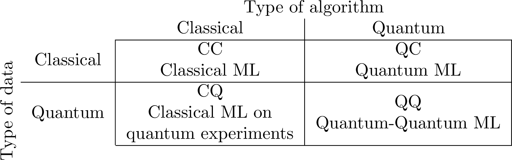

---
output:
  pdf_document: default
  html_document: default
header-includes:
    - \usepackage{subfig}
---

# Classical data in quantum computers {#chap:classical-data-quantum-computers}

```{r, echo=FALSE, fig.align = 'center', fig.width=10, fig.cap="This section is heavily work in progress. In this [TODO list](https://github.com/Scinawa/quantumalgorithms.org/issues/70) you can see the improvements of this Chapter in the following months."}
knitr::include_graphics("images/wip.png")
```

In this chapter we will discuss the problem of manipulating classical information (numbers, vectors, matrices, and functions) into our quantum computer. More precisely, after describing possible ways of storing information into quantum states, we discuss the problem of loading and retrieving data from quantum computer. In other words, we are just studying the I/O interface of our quantum computer.

We size the opportunity of discussing classical data in quantum computers to step back, and show you [all the possible combinations](https://indico.desy.de/event/26672/contributions/60982/attachments/39512/49045/qml_maria.pdf) of quantum and classical data and algorithms. This book is mostly interested in classical and quantum data processed by quantum computer. What is quantum data? ( Actually, no one knows, but it is often something that you hear at conferences. No.. I am kidding!) Quantum data is supposed to be quantum states that is generated by a generic quantum process, which could be another quantum circuit, a quantum channel (i.e. communication from quantum internet) or any density matrix that you receive from experiments.

```{r, echo=FALSE, fig.width=10, fig.cap="We can have four combinations between classica and quantum data, and classical and quantum computers. As you can imagine, in these pages we will focus on quantum algorithms on classical data, with some detours on quantum algorithms on quantum data. "}

```

## Representing data in quantum computers

We begin our journey into quantum algorithms by understanding how we can represent and store data as a quantum state. This problem is of paramount importance, because knowing what is the best way of encoding data in a quantum computer might pave the way for intuitions in solving our problems. On the contrary, using the wrong encoding might prevent you from reasoning about the right algorithm design, and obtaining the desired advantages in the implementation of your algorithm. As it has been well-said: *"In order to use the strengths of quantum mechanics without being confined by classical ideas of data encoding, finding "genuinely quantum" ways of representing and extracting information could become vital for the future of quantum machine learning".* [@schuld2015introduction]. There are two fundamental ways of encoding information in a quantum state: the *amplitude* encoding and the *binary* encoding. In amplitude encoding we store your data in the amplitudes of a quantum state, therefore we can encode $n$ real values (or better, some fixed point precision approximation of a real number) using $O(\lceil \log n\rceil )$ qubits. In the binary (or digital) encoding you store a bit in the state of a qubit. Each encoding allows to process the data in different ways, unlocking different possibilities. As tacit convention that is used in literature - and throughout this book - we often use Greek letters inside kets to represent generically quantum states $\ket{\psi}, \ket{\phi}, \ket{\varphi}$, etc..., and use Latin letters to represent quantum registers holding classical data interpreted as bitstrings. The precision that we can use for specifying the *amplitude* of a quantum state might be limited - in practice - by the precision of our quantum computer in manipulating quantum states (i.e. development in techniques in quantum metrology and sensing). Techniques that use a certain precision in the amplitude of a state might suffer of initial technical limitations of the hardware. The precision in the manipulation could be measured, for instance, by the fidelity, but discussing this subject is out of scope for this work.

### Numbers and quantum arithmetics {#sec:numbers}

Number can be stored as binary encoding: each bit of a number is encoded in the state of a single qubit. Let's start with the most simple scalar: an integer. Let $x \in \mathbb{N}$. To represent it on a quantum computer, we consider the binary expansion of $x$ as a list of $m$ bits, and we set the state of the $i$-th qubit as the value of the $i$-th bit of $x$:


\begin{equation}
\ket{x} = \bigotimes_{i=0}^{m} \ket{x_i}
\end{equation}

Eventually, we can use one more qubit for the sign. In most of the cases, we want to work also with non-integer numbers. Real numbers can be approximated with decimal numbers with a certain bits of precision. For this, we need a bit to store the sign, some bits to store the integer part, and some other bits to store the decimal part. This is more precisely stated in the following definition.

```{definition, fixed-point-encoding, name="Fixed-point encoding of real numbers[@rebentrost2021quantum]"}
Let $c_1,c_2$ be positive integers, and $a\in\{0,1\}^{c_1}$, $b \in \{0,1\}^{c_2}$, and $s \in \{0,1\}$ be bit strings. Define the rational number as:
\begin{equation}
    \mathcal{Q}(a,b,s):= 
    (-1)^s
    \left(2^{c_1-1}a_{c_1}+ \dots + 2a_2 + a_1 + \frac{1}{2}b_1 + \dots + \frac{1}{2^{c_2}}b_{c_2} \right) \in [-R,R],
\end{equation}
where $R := 2^{c_1}-2^{-c_2}$. If $c_1,c_2$ are clear from the context, we can use the shorthand notation for a number $z:=(a,b,s)$ and write  $\mathcal{Q}(z)$ instead of $\mathcal{Q}(a,b,s)$. Given an $n$-dimensional vector $v \in (\{0,1\}^{c_1} \times \{0,1\}^{c_2} \times \{0,1\})^n$
the notation $\mathcal{Q}(v)$ means an $n$-dimensional vector whose $j$-th component is $\mathcal{Q}(v_j)$, for $j \in[n]$. 
```

It might seem complicated, but it is really the (almost) only thing that a reasonable person might come up with when expressing numbers as (qu)bits with fixed-point precision. In most of the algorithms we implicitly assume this (or equivalent) models. Stating clearly how to express numbers on a quantum computer as fixed point precision is important: we want to work a model where we can represent numbers with enough precision so that numerical errors in the computation are negligible and will not impact the final output of our algorithm. The choice of values for $c_1$ and $c_2$ in the previous definition depends on the problem and algorithm. For the purposes of optimizing the quantum circuit, these constants can be changed dynamically in various steps of the computation (for instance, if at some point we need to work with numbers between $0$ and $1$ we can neglect the $c_1$ bits needed to represent the integer part of a number). While analyzing how error propagates and accumulates throughout the operations in the quantum circuit is essential to ensure a correct final result, this analysis is often done numerically (via simulations, which we will discuss in Chapter \@ref(chap:QML-on-real-data) ), or when implementing the algorithm on real hardware. In principle, we could also think of having [floating point](https://en.wikipedia.org/wiki/IEEE_754) representation of numbers in our quantum computer. However, it is believed that the circuital overhead in the computation is not worth the trouble.

When programming quantum algorithms, it is very common to use subroutines to perform arithmetic on numbers, and we will discuss these procedures in later sections of this work. We avoid the analysis of such details by using the quantum arithmetic model as in Definition \@ref{def:defQArith}. Recall that any Boolean circuit can be made reversible, and any reversible computation can be realized with a circuit involving negation and three-bit Toffoli gates. Such a circuit can be turned into a quantum circuit with single-qubit NOT gates and three-qubit Toffoli gates. Since most of the boolean circuits for arithmetic operations operate with a number of gates of $O(\text{poly}(c_1,c_2))$ this implies a number of quantum gates of $O(\text{poly}(c_1,c_2))$ for the corresponding quantum circuit.

```{definition, defQArith, name="Quantum arithmetic model"}
Given $c_1, c_2 \in \mathbb{N}$ specifying fixed-point precision numbers as in Definition  \@ref(def:fixed-point-encoding), we say we use a quantum arithmetic model of computation if the four arithmetic operations can be performed in constant time in a quantum computer.
```

Most often than not, quantum algorithms are not taking into account in the complexity of their algorithm the cost for performing operations described in their arithmetic model. In fact, they somehow don't even define a quantum arithmetic model, leaving that implicit. However, when estimating the resources needed to run an algorithm on a quantum computer, specifying these values become important. For a resource estimation for problems in quantum computational finance that takes into account the cost of arithmetic operations in fixed-point precision we refer to [@chakrabarti2021threshold].

<!-- TODO add pointer on section on quantum artihmetics -->

### Vectors and matrices {#subsec-stateprep-matrices}

Representing vectors and matrices in quantum computers is the best way to understand the amplitude encoding. We can represent a vector $x \in \mathbb{R}^{2^n}$ as the following quantum state:


\begin{equation}
\ket{x} = \frac{1}{{\left \lVert x \right \rVert}}\sum_{i=0}^{2^n-1}x_i\ket{i} = \|x\|^{-1}x
\end{equation}

To represent a vector of size $2^n$, for some integer $n$, we just need $n$ qubits: we encode each component of the classical vector in the amplitudes of a pure state. In fact, we are just building an object representing $\ell_2$-normalized version of the vector $x$. Note that, in the quantum state in the previous equation we are somehow "losing" the information on the norm of the vector $x$: however we will see how this is not a problem when we work with more than one vector. This idea can be generalized to matrices: let $X \in \mathbb{R}^{n \times d}$, a matrix of $n$ rows of length $d$. We will encode them using $\lceil log(d) \rceil +\lceil log(n) \rceil$ qubits. Let $x(i)$ be the $i$-th row of $X$.


\begin{equation}
\frac{1}{\sqrt{\sum_{i=1}^n {\left \lVert x(i) \right \rVert}^2 }} \sum_{i=1}^n {\left \lVert x(i) \right \rVert}\ket{i}\ket{x(i)}
  (\#eq:matrix-state1)
\end{equation}


\begin{equation}\frac{1}{\sqrt{\sum_{i,j=1}^{n,d} |X_{ij}|^2}} \sum_{i,j=1}^{n,d} X_{ij}\ket{i}\ket{j}
  (\#eq:matrix-state2)
\end{equation}


```{exercise}
Check that Equation \@ref(eq:matrix-state1) and \@ref(eq:matrix-state2) are in fact equivalent?
```

<!-- ### Other models -->

<!-- Another interesting model for encoding a graph is the following.  -->

<!-- A graph $G=(V,E)$ be encoded as a quantum state $\ket{G}$ such that: -->

<!-- $$K_G^V\ket{G} = \ket{G} \forall v \in V$$ where -->

<!-- $K_G^v = X_v\prod_{u \in N(v)}Z_u$, and $X_u$ and $Z_u$ are the Pauli -->

<!-- operators on $u$. To work in this model, take as many -->

<!-- qubits in state $\ket{+}$ as nodes in the graph, and apply controlled -->

<!-- $Z$ rotation between qubits representing adjacent nodes. There are some -->

<!-- algorithms that use this state as input. For a more detailed description, look at [@zhao2016fast], which also gives very nice algorithms that might be useful in graph problems. -->

## Access models {#sec:quantum-memory-models}

```{r, echo=FALSE, fig.width=6, fig.cap="", }
knitr::include_graphics("images/wip.png")
```

Now we focus on how to input classical data in quantum computers. As discussed in the Section \@ref(measuring-complexity) of the previous chapter, in quantum computing we often work in a **oracle model**, also called **black-box model** of quantum computation. This section is devoted to the formalization and implementation of some of the oracles that are commonly used to load classical data (numbers, vectors, matrices). The word "oracle", (a word referencing concepts in complexity theory), is used to imply that an application of the oracle has $O(1)$ cost, i.e. that at first sight, we do not care about the cost of implementing the oracle in our algorithm. A synonym of quantum oracle model is **quantum query model**, which stress the fact that we can use this oracle to perform queries. A query to an oracle is any unitary that performs the mapping:


\begin{equation}
\ket{i}\ket{0}\mapsto \ket{i}\ket{x_i},
(\#eq:querytooracle)
\end{equation}

where the $x_i$ could be a binary encoding or amplitude encoding of something. In the following image we have schematized two different kinds of access model that are commonly used in literature. In the first case we use a binary encoding (for numbers), in the second one we use an amplitude encoding (for vectors and matrices).

```{r, echo=FALSE, fig.width=6, fig.cap="This table describes different types of oracles. An oracle for numbers gives you quantum access to elements in a list of numbers. This oracle can be implemented in at least two ways: either with a QRAM, or with particular circuits. An oracle for getting amplitude encoding is usually called quantum sampling access, needs a quantum oracle for numbers to be implemented.", }
knitr::include_graphics("images/oracle-models.png")
```

An oracle for numbers gives you quantum access to elements in a list of numbers, as we describe in Section \@ref(sec:numbers). This oracle can be implemented in at least two ways: either with a QRAM (see Section \@ref(subsec:qram-model), or with particular circuits (see next Section \@ref(sec:accessmodel-circuits) ). An oracle for getting amplitude encoding, which is more and more often called quantum sampling access for reasons that will be evident later (see Section \@ref(subsec-stateprep-matrices) ) needs a quantum oracle for numbers to be implemented."

## Implementations

### Quantum memory models and the QRAM {#subsec:qram-model}

#### The QRAM
Along with a fully fledged quantum computer, it is often common to assume that we access to a quantum memory, i.e. a classical data structure that store classical information, but that is able to answer queries in quantum superposition. This model is commonly called the **QRAM model** (and is a kind of query model). There is a catch. As we will see in greater details soon, the task of building the data structure classically requires time that is linear (up to polylogarithmic factors) in the dimension of the data (this observation is better detailed in definition \@ref(def:QRAM-model) ). If we want to have quantum access to a dense matrix $M \in \mathbb{R}^{n \times d}$ the preprocessing time *mush* be at least $O(nd \log (nd))$, as we need to do some computation to create this data structure. To stress more the fact that we are linear in the effective number of elements contained in the matrix (which can often be sparse) can write that the runtime for the preprocessing is $O(\norm{A}_0\log(nd))$. The name QRAM is meant to evoke the way classical RAM works, by addressing the data in memory using a tree structure. Note that sometimes, QRAM goes under the name of QROM, as actually it is not something that can be written during the runtime of the quantum algorithm, but just queried, i.e. read. Furthermore, a QRAM is said to be *efficient* if can be updated by adding, deleting, or modifying an entry in polylogarithmic time w.r.t the size of the data it is storing. Using the following definition, we can better define the computational model we are working with. Remember that assuming to have access to a large QRAM in your algorithms is something that is often associated with more long-term quantum algorithms, so it is a good idea to limit as much as possible the dependence on QRAM on your quantum algorithms.

<!-- In the data structure one can write down the real entries $m_{ij}$ with some precision $\delta$ using $\log 1/\delta$ bits. -->

```{definition, qram, name="Quantum Random Access Memory [@giovannetti2008quantum]"}
A quantum random access memory is a device that stores indexed data $(i,x_i)$ for $i \in [n]$ and $x_i \in \R$ (eventually truncated with some bits of precision). It allows query in the form $\ket{i}\ket{0}\mapsto \ket{i}\ket{x_i}$, and has circuit depth $O(polylog(n))$.
```

We say that a dataset is efficiently loaded in the QRAM, if the size of the data structure is linear in the dimension and number of data points and the time to enter/update/delete an element is polylogarithmic in the dimension and number of data points. More formally, we have the following definition (the formalization is taken from [@kerenidis2017quantumsquares] but that's folklore knowledge in quantum algorithms).

```{definition, QRAM-model, name="QRAM model"}
An algorithm in the QRAM data structure model that processes a data-set of size $m$ has two steps:

 * A pre-processing step with complexity $\widetilde{O}(m)$ that constructs efficient QRAM data structures for storing the data.
 * A computational step where the quantum algorithm has access to the QRAM data structures constructed in step 1.

The complexity of the algorithm in this model is measured by the cost for step 2.
```

Equipped with this definition we will see how we can load all sorts of data in the quantum computer. For example, we can formalize what it means to have quantum query access to a vector $x \in \mathbb{R}^N$ stored in the QRAM.

```{definition, quantum-query-access-vector, name="Quantum query access to a vector stored in the QRAM"}
Given $x \in (\{0,1\}^m)^N$, we say that we have quantum query access to $x$ stored in the QRAM if we have access to a unitary operator $U_x$ such that $U_x\ket{i}\ket{b} = \ket{i}\ket{b \oplus x_i}$ for any bit string $b\in\{0,1\}^m$. One application of $U_x$ costs $O(1)$ operations.
```

Other common names for this oralce is "QRAM access", or we simply say that "$x$ is in the QRAM". Note that this definition is very similar to Definition \@ref(def:quantum-oracle-access). The difference is that in the case of most boolean functions we know how to build an efficient classical (and thus quantum) boolean circuit for calculating the function's value. If we have just a list of numbers, we need to resort to a particular hardware device, akin to a classical memory, which further allows query in superposition. Most importantly, when using this oracle in our algorithm, we consider the cost of a query to a data structure of size $N$ to be $O(polylog(N))$. We will see in Section \@ref(sec:qramarchitectures) how, even if the number of quantum gates is $N$, they can be arranged and managed in a way such that the depth and the execution time sill remains polylogarithmic.

#### The QRAG

Another gate that is standard (but less frequent) in literature is the Quantum Random Access Gate. This gate was introduced in the paper of [@ambainis2007quantumdistinctness]. Given a quantum state that holds a string $z$ of bits (or word of $m$ bits), this gate swaps an $m$-bit target register $\ket{b}$ with the $i$-th position of the string $z_i$.

```{definition, qrag, name="Quantum Random Access Gate"}
Given $x \in (\{0,1\}^m)^N$ we say that we have access to a quantum random access gate if we have a unitary operator $U_x$ such that $U_x \ket{i}\ket{b}\ket{x}= \ket{i}\ket{z_i}\ket{z_0,z_1,\dots,z_{i-1},b,z_{i+1}, \dots z_M}$. 
```

It is natural to ask if this model is more or less powerful than a QRAM model. It turns out that with a QRAG you can have a QRAM. This is the sketch of the proof. Set $b=0$ in the second quantum register, and adding another ancillary register, we have:

$$U_x \ket{i}\ket{0}\ket{0}\ket{x}= \ket{i}\ket{0}\ket{z_i}\ket{z_0,z_1,\dots,z_{i-1},b,z_{i+1}, \dots z_M}$$ now we copy with a CNOT the register $z_i$ in an ancilla register. $$\ket{i}\ket{0}\ket{z_i}\ket{z_0,z_1,\dots,z_{i-1},b,z_{i+1}, \dots z_M} \mapsto \ket{i}\ket{z_i}\ket{z_i}\ket{z_0,z_1,\dots,z_{i-1},b,z_{i+1}, \dots z_M}$$

and lastly we undo the query to the QRAG gate. 

### Circuits {#sec:accessmodel-circuits}

There are two cases when we can ease our requirements on having quantum access to a particular hardware device (the QRAM). If we have knowledge about the structure of the mapping, we can just build a circuit to perform $\ket{i}\ket{0}\mapsto \ket{i}\ket{x_i}$. We will see two cases. The first one is when we have an analytic formula for $x_i$, i.e. $x_i = f(i)$ for a function $f$ that we know. The second is when most of the $x_i$ are $0$, so we can leverage the sparsity to keep track of a limited amount of entries.

#### Functions

If we have a function that maps $x_i = f(i)$ we can create a circuit for getting query access to the list of $x_i$ on a quantum computer, as we briefly anticipated in Section \@ref(measuring-complexity). Before discussing how to use this idea for data, we will recap a few concepts in quantum computing, which are useful to put things into perspective. The idea of creating a quantum circuit from a classical boolean function is relatively simple and can be found in standard texts in quantum computation ([@NC02] or the this section on the Lecture notes of [Dave Bacon](https://courses.cs.washington.edu/courses/cse599d/06wi/lecturenotes6.pdf)). There is a simple theoretical trick that we can use to see that for any (potentially irreversible) boolean circuit there is a reversible version for it. This observation is used to show that non-reversible circuits are *not* more powerful than reversible circuits. To recall, a reversible boolean circuit is just bijection between domain and image of the function. Let $f : \{0,1\}^m \mapsto \{0,1\}^n$ be a boolean function (which we assume is surjective, i.e. the range of $f$ is the whole $\{0,1\}^n$). We can build a circuit $f' : \{0,1\}^{m+n} \mapsto \{0,1\}^{m+n}$ by adding some ancilla qubits, as it is a necessary condition for reversibility that the dimension of the domain matches the dimension of the range of the function. We define $f'$ as the function performing the mapping $(x, y) \mapsto (x, y \oplus f(x))$. It is simple to see by applying twice $f'$ that the function is reversible (check it!).

Now that we have shown that it is possible to obtain a reversible circuit from any classical circuit, we can ask: what is an (rather inefficient) way of getting a quantum circuit? Porting some code (or circuit) from two similar level of abstraction is often called *transpiling*. Again, this is quite straightforward (Section 1.4.1 [@NC02]). Every boolean circuit can be rewritten in any set of universal gates, and as we know, the NAND port is universal for classical computation. It is simple to see (check the exercise) that we can use a Toffoli gate to simulate a NAND gate, so this gives us a way to obtain a quantm circuit out of a boolean circuit made of NAND gates. With these two steps we described a way of obtaining a quantum circuit from any boolean function $f$.

```{exercise, name="Toffoli as NAND"}
Can you prove that a Toffoli gate, along with an ancilla qubit, can be used to obtain a quantum version of the NAND gate?
```

However, an application of the quantum circuit for $f$, will result in a garbage register of some unwanted qubits. To get rid of them we can use this trick:


\begin{equation}
\ket{x}\ket{0}\ket{0}\ket{0} \mapsto \ket{x}\ket{f(x)}\ket{k(f, x)}\ket{0}\mapsto \ket{x}\ket{f(x)}\ket{k(f, x)}\ket{f(x)} \mapsto \ket{x}\ket{f(x)}
\end{equation}

Let's explain what we did here. In the first step we apply the circuit that computes $f'$. In the second step we perform a controlled NOT operation (controlled on the third and targetting the fourth register), and in the last step we undo the application of $f'$, thus obtaining the state $\ket{x}\ket{f(x)}$ with no garbage register.

Importantly, the techniques described in the previous paragraph are far from being practical, and are only relvant didactically. The task of obtaining an efficient quantum circuit from a boolean function is called "oracle synthesis". Oracle synthesis is far from being a problem of only theoretical interest, and it has received a lot of attention in past years [@soeken2018epfl] [@schmitt2021boolean] [@shende2006synthesis]. Today software implementations can be easily found online in most of the quantum programming languages/library. For this problem we can consider different scenarios, as we might have access to the function in form of reversible Boolean functions, non-reversible Boolean function, or the description of a classical circuit. The problem of oracle syntheses is a particular case of quantum circuit synthesis (Table 2.2 of [@de2020methods] ) and is a domain of active ongoing research.

<!-- TODO better: can we expand the section with more technical results on quantum compilations?  -->

<!-- TODO better, what is a probabilitic classical circuit, cite more updated results on this -->

<!-- TODO better: explain before why there is a garbage register? because we are using quantum gates to build f'?  -->

Long story short, if we want to prove the runtime of a quantum algorithm in terms of gate complexity (and not only number of queries to an oracle computing $f$) we need to keep track of the gate complexity of the quantum circuits we use. For this we can use the following theorem.

```{theorem, name="[@buhrman2001time] version from [@bausch2021quantum]"}
For a probabilistic classical circuit with runtime $T(n)$ and space requirement $S(n)$ on an input of length $n$ there exists a quantum algorithm that runs in time $O(T(n)^{\log_2(3)}$ and requires $O(S(n)\log(T(n))$ qubits.
```

What if we want to use a quantum circuit to have quantum access to a vector of data? It turns out that we can do that, but the simplest circuit that we can come up with, has a depth that is linear in the length of the vector. This circuit (which sometimes goes under the name QROM [@hann2021resilience] or multiplexer, is as follow:

```{r, echo=FALSE, fig.width=3, fig.cap="This is the multiplexer circuit for the list of values x=[1,1,0,1]. Indeed, if we initialize the first two qubits with zeros, the output of the previous circuit will be a 1 in the third register, and so on.", }
knitr::include_graphics("images/multiplexer.png")
```

The idea of the circuit is the following: controlled on the index register being in the state $\ket{0}$, we write (using CNOTS) in the output register the value of our vector in position $x_0$, controlled in the index register being $\ket{1}$, we write on the output register the value of our vector in position $x_1$, etc.. This will result in a circuit with a depth that is linear in the length of the vector that we are accessing, however this circuit won't require any ancilla qubit. We will discuss more some hybrid architecture that allows a tradeoff between depth and ancilla qubits in Section \@ref(sec:qramarchitectures).

#### Sparse access model {#subsec:sparse-access-model}

The sparse access model is often used to work with matrices and graphs. Sparse matrices are very common in quantum computing and quantum physics, so it is important to formalize a quantum access for sparse matrices. This model is sometimes called in literature "sparse access" to a matrix, as sparsity is often the key to obtain an efficient circuit for encoding such structures without a QRAM. Of course, with a vector or a matrix stored in a QRAM, we can also have efficient (i.e. in time $O(\log(n))$ if the matrix is of size $n \times n$) query access to a matrix or a vector, even if they are not sparse. It is simple to see how we can generalize query access to a list or a vector to work with matrices by introducing another index register to the input of our oracle. For this reason, this sparse access is also called quite commonly "query access".

```{definition, oracle-access-adjacencymatrix, name="Query access to a matrix"}
Let $V \in \mathbb{R}^{n \times d}$. There is a data structure to store $V$, (where each entry is stored with some finite bits of precision) such that, a quantum algorithm with access to the data structure can perform $\ket{i}\ket{j}\ket{z} \to \ket{i}\ket{j}\ket{z \oplus v_{ij}}$ for $i \in [n], j \in [d]$.
```

A matrix can be accessed also with another oracle.

```{definition, oracle-access-adjacencylist,  name="Oracle access in adjacency list model"}
Let $V \in \mathbb{R}^{n \times d}$, there is an oracle that allows to perform the mappings:

- $\ket{i}\mapsto\ket{i}\ket{d(i)}$ where $d(i)$ is the number of non-zero entries in row $i$, for $i \in [n]$, and
- $\ket{i,l}\mapsto\ket{i,l,\nu(i,l)}$, where $\nu(i,l)$ is the $l$-th nonzero entry of the $i$-th row of $V$, for $l \leq d(i)$.

```

The previous definition is also called *adiacency array* model. The emphasis is on the word *array*, contrary to the adjacency list model in classical algorithms (where we usually need to go through all the list of adjacency nodes for a given node, while here we can query the list as an array, and thus use superposition) [@Durr2004].

It's important to recall that for Definition \@ref(def:oracle-access-adjacencymatrix) and \@ref(def:oracle-access-adjacencylist) we could use a QRAM, but we also expect **not** to use a QRAM, as there might be other efficient circuit for performing those mapping. For instance, when working with graphs (remember that a generic weighted and directed graph $G=(V,E)$ can be seen as its adjacency matrix $A\in \mathbb{R}^{|E| \times |E|}$), many algorithms call Definition \@ref(def:oracle-access-adjacencymatrix) **vertex-pair-query**, and the two mappings in Definition \@ref(def:oracle-access-adjacencylist) as **degree query** and **neighbor query**. When we have access to both queries, we call that **quantum general graph model** [@hamoudi2018quantum]. This is usually the case in all the literature for quantum algorithms for Hamiltonian simulation, graphs, or algorithms on sparse matrices.

The interested reader can watch [here](http://www.ipam.ucla.edu/abstract/?tid=17251&pcode=QL2022) how to create block-encodings from sparse access.

### Quantum sampling access {#q-sampling-access}

Let's suppose now that we want to have an oracle that can be used to create quantum states proportional to a set of vectors that we have. In other words, we are considering an amplitude encoding of vectors, as discussed in Section \@ref(subsec-stateprep-matrices). We can have two similar models, that we call both *quantum sampling access*. This name comes from the fact that measuring the output state can be interpreted as sampling from a probability distribution. Historically, it was first discussed the procedure to create quantum state proportional to (discretized) probability distribution, and then this idea was reused in the context of creating quantum states proportional to vectors (the generalization to matrices follows very simply). We treat first the case where we want to create quantum sampling access to rows of a matrix, as it is much simpler to understand.

#### Sampling access to vectors and matrices

Let's recall that for a matrix $X \in \mathbb{R}^{n \times d}$ (where we assume that $n$ and $d$ are powers of $2$, otherwise we can just consider the matrix padded with zeros) with rows $x_i$, want to create the state

\begin{equation}
\frac{1}{\sqrt{\sum_{i=1}^n {\left \lVert x_i \right \rVert}^2 }} \sum_{i=1}^n {\left \lVert x_i \right \rVert}\ket{i}\ket{x_i}
  (\#eq:matrix-state)
\end{equation}

We will do it using two mappings:


\begin{equation}
\ket{i}\mapsto \ket{i}\ket{x_i}
\end{equation}

\begin{equation}
\ket{0}\mapsto \ket{N_X}
\end{equation}

where $N_X$ is the vector of $\ell_2$ norms of the rows of the matrix $X$, i.e. $\ket{N_X}=\frac{1}{\|X\|_F} \sum_{i=0}^n \|x_i\| \ket{i}$. Note that these two quantum states are just amplitude encodings of vectors of size $d$ and a vector of size $n$. It is very simple to see that if we are given two unitaries performing these two mappings, we can obtain equation \@ref(eq:matrix-state) by applying the two unitaries sequentially:


\begin{equation}
\ket{0}\ket{0}\mapsto\ket{N_X}\ket{0}\mapsto \frac{1}{\|X\|_F} \sum_{i=1}^n {\left \lVert x_i \right \rVert}\ket{i}\ket{x_i}
\end{equation}

This reduces our problem to create an amplitude encoding of a given vector. In the PhD thesis of Prakash [@Prakash:EECS-2014-211] we can find the first procedure to efficiently create superpositions corresponding to vectors, and the generalization on how to do this for the rows of the matrices, i.e. encoding the values of the components of a matrix' row in the amplitudes of a quantum state. This this data structure, which sometimes could go under the name KP-trees [@rebentrost2018quantum], but is more and more often called **quantum sampling access**, assumes and extends definition \@ref(def:qram). Confusingly, in some papers both are called QRAM, and both rely on two (different) tree data structure for their construction. One is a hardware circuit arranged as a tree that allows to perform the mapping in \@ref(def:qram), the other is a classical data structure arranged as a tree that stores the partial norms of the rows of the matrix, which we will discuss now. We will use the following as definition, but this is actually a theorem. For the proof, we refer to [@Prakash:EECS-2014-211] and the appendix A of [@KP16], and the proof of Theorem 1 of [@CGJ18].

```{definition, KP-trees,  name="Quantum access to matrices using KP-trees - Quantum sampling access [@KP16]"}
Let $V \in \mathbb{R}^{n \times d}$, there is a data structure (sometimes called KP-trees) to store the rows of $V$ such that,

-  The time to insert, update or delete a single entry $v_{ij}$ is $O(\log^{2}(n))$.
- A quantum algorithm with access to the data structure can perform the following unitaries in time $O(\log^{2}n)$.
  - $\ket{i}\ket{0} \to \ket{i}\ket{v_{i}}  \forall i \in [n].$
  - $\ket{0} \to \sum_{i \in [n]} \norm{v_{i}}\ket{i}.$

```

The following exercise might be helpful to clarify the relation between quantum query access to a vector and quantum sampling access.

```{exercise}
Suppose you have quantum access to a vector $x = [x_1, \dots, x_N]$, where each $x_i \in [0,1]$. What is the cost of creating quantum sampling access to $x$, i.e. the cost of preparing the state $\frac{1}{Z}\sum_{i=1}^N x_i \ket{i}$. Hint: query the state in superposition and perform a controlled rotation. Can you improve the cost using amplitude amplification? What if $x_i \in [0, B]$ for a $B > 1$?
```

#### Sampling access to a probability distribution

We start with a very simple idea of state preparation, that can be traced back to two pages paper by Lov Grover and Terry Rudolph [@Grover2002]. There, the authors discussed how to efficiently create quantum states proportional to functions satisfying certain integrability condition. Let $p$ be an (efficiently integrable, in a sense that we will define more precisely very soon) probability distribution. We want to create the state


\begin{equation}
\ket{\psi} = \sum_{i\in \{0,1\}^n} \sqrt{p_i}\ket{i}
\end{equation}

where the value of $p_i$ is obtained from discretizing the distribution $p_i$. (the case when $p$ is discrete can be solved with the circuits described in the previous section). We discretize the sample space $\Omega$ (check Definition \@ref(def:measure-space) ) in $N$ intervals, so that we can identify the samples $\omega$ of our random variable with the set $[N]$.

##### The problem with Grover-Rudolph.

Creating quantum sample access to a probability distribution is a task often used to obtain quadratic speedups. A recent work [@herbert2021no] stressed the fact that the time to prepare the oracle used to create $\ket{\psi}$ might cancel the benefits of the speedup in term of query complexity. Mitigating this problem is currently active area of research.

Let's define $\mu$ as the mean of a probability distribution $p(x)$ and $\widehat{\mu}=\mathbb{E(x)}$ be an estimate of $\mu$. The error of choice for this kind of problem (which comes from applications that we will see in Section \@ref(chap:montecarlo) ) is called the Root Mean Square Error (RMSE):


\begin{equation}
\widehat{\epsilon} = \sqrt{\mathbb{E}(\widehat{\mu}- \mu)}
\end{equation}

<!-- ##### TODO Possible mitigations. -->

## Block encodings

In this section we discuss another kind of model for working with a matrix in a quantum computer. More precisely, we want to encode a matrix into a unitary (for which we have a quantum circuit). As it will become clear in the next chapters, being able to perform such encoding unlocks many possibilities in terms of new quantum algorithms.

```{definition, name="Block encodings"}
Let $A \in \mathbb{R}^{N \times N}$ be a square matrix for $N = 2^n$ for $n\in\mathbb{N}$, and let $\alpha \geq 1$. For $\epsilon > 0$, we say that a $(n+a)$-qubit unitary $U_A$ is a $(\alpha, a, \epsilon)$-block-encoding of $A$ if

$$\| A - \alpha ( \bra{0} \otimes I)U_A (\ket{0} \otimes I) \| \leq \epsilon$$

```

Note an important (but simple) thing. An $(\alpha, a, \epsilon)$-block encoding of $A$ is just a $(1, a, \epsilon)$-block-encoding of $A/\alpha$.

<!-- Often, we do not want to take into account the number of qubits $a$ we need to create the block-encoding (because these are expected to be negligible in some hardware implementation). Thus, it's possible to find in literature the definition of block-encoding using the notation $(\alpha, \epsilon)$ only. Moreover, some access models give us a $(\alpha, 0)$-block-encoding, so we might also refer to $U_A$ to a $\alpha$-block-encoding.  -->

We report this result from [@gilyen2019quantum].

```{definition, name="Block encoding from sparse access [@CGJ18]"}
Let $A \in \mathbb{C}^{2^w \times 2^w}$ be a matrix that is $s_r$-row-sparse and $s_c$-column-sparse, and each element of $A$ has abolute value at most $1$. Suppose that we have access to the following sparse access oracles acting on two $(w+1)$ qubit registers:

  $$O_r: \ket{i}\ket{k} \mapsto \ket{i}\ket{r_{ik}} \forall i \in [2^w] - 1, k \in [s_r], \text{and}$$

  $$O_c: \ket{l}\ket{j} \mapsto \ket{c_lj}\ket{j} \forall l \in [s_c], j \in [2^w]-1, \text{where}$$

$r_{ij}$ is the index of the $j$-th non-zero entry of the $i$-th row of $A$, or if there are less than $i$ non-zero entries, than it is $j+2^w$, and similarly $c_ij$ is the index for the $i$-th non-zero entry of the $j-th$ column of $A$, or if there are less than $j$ non-zero entries, than it is $i+2^w$. Additionally assume that we have access to an oracle $O_A$ that returns the entries of $A$ in binary description:
  $$O_A : \ket{i}\ket{j}\ket{0}^{\otimes b} \mapsto \ket{i}\ket{j}\ket{a_{ij}} \forall i,j \in [2^w]-1 \text{where}$$

  $a_{ij}$ is a $b$-bit description of the $ij$-matrix element of $A$. Then we can implement a $(\sqrt{s_rs_c}, w+3, \epsilon)$-block-encoding of $A$ with a single use of $O_r$, $O_c$, two uses of $O_A$ and additionally using $O(w + \log^{2.5(\frac{s_rs_c}{\epsilon})})$ one and two qubit gates while using $O(b,\log^{2.5}\frac{s_rs_c}{\epsilon})$ ancilla qubits.

```

The previous theorems can be read more simply as: "under reasonable assumptions (**quantum general graph model** for rows and for columns - see previous section), we can build $(\sqrt{s_rs_c}, w+3, \epsilon)$-block-encodings of matrices $A$ with circuit complexity of $O(\log^{2.5(\frac{s_rs_c}{\epsilon})})$ gates and constant queries to the oracles".

Now we turn our attention to another way of creating block-encodings, namely leveraging the quantum data structure that we discussed in Section \@ref(q-sampling-access). In the following, we use the shortcut notation to define the matrix $A^{(p)}$ to be a matrix where each entry $A^{(p)}_{ij} = (A_{ij})^p$.

```{definition, mu,  name="Possible parameterization of μ for the KP-trees"}
For $s_{p}(A) = \max_{i \in [n]} \sum_{j \in [d]} A_{ij}^{p}$, we chose $\mu_p(A)$ to be:
$$\mu_p(A)=\min_{p\in [0,1]} (\norm{A}_{F}, \sqrt{s_{2p}(A)s_{(1-2p)}(A^{T})}).$$
```

```{lemma, kp-block-encodings, name="Block encodings from quantum data structures [@CGJ18]"}
Let $A\in\mathbb{C}^{M\times N}$, and $\overline{A}\in\mathbb{C}^{(M+N)\times (M+N)}$ be the symmetrized matrix defined as
$$\overline{A}=\left[\begin{array}{cc}0 & A\\ A^\dagger & 0 \end{array}\right].$$


 - Fix $p\in [0,1]$. If $A\in\mathbb{C}^{M\times N}$, and $A^{(p)}$ and $(A^{(1-p)})^\dagger$ are both stored in quantum-accessible data structures with sufficient precision, then there exist unitaries $U_R$ and $U_L$ that can be implemented in time $O\left(polylog(MN/\epsilon)\right)$ such that
$U_R^\dagger U_L$ is a $(\mu_p(A),\lceil\log (N+M+1)\rceil,\epsilon)$-block-encoding of $\overline{A}$.

- On the other hand, if $A$ is stored in a quantum-accessible data structure with sufficient precision, then there exist unitaries $U_R$ and $U_L$ that can be implemented in time $O(polylog(MN)/\epsilon)$ such that $U_R^\dagger U_L$ is a $(\|A\|_F,\lceil\log(M+N)\rceil,\epsilon)$-block-encoding of $\overline{A}$.

```

The second point of the previous theorem is just our good old Definition \@ref(def:KP-trees).


<!-- Recently, the data structure has been extended to allow space for some improvements in the runtime of the algorithms [@kerenidis2017quantumsquares]. Let $A/\mu = P \circ Q$ a decomposition of the matrix $A$, where the norm of the rows of $P$ and the columns of $Q$ are at most $1$, and the symbol $\circ$ is the Hadamard product. In the original formulation, the factorization chosen corresponded to a choice of $\mu=\|A\|_F$.
It will become clear in the next sections how the value of $\mu(A)$ will become a factor in the runtime of our quantum algorithm, so having a small value of $\mu$ will directly leads to faster quantum algorithms.
In [@kerenidis2017quantumsquares], they provided such efficient factorization for various choices of $\mu$. In the following we explicitly define a class of functions $\mu$, parameterized by $p \in [0,1]$, that will prove to be very useful in governing the runtime of the quantum algorithms. -->

<!-- The original definition of QRAM, where $\mu(A)=\|A\|_F$ corresponds to the factorization $A/\|A\|_F = P \circ Q$ where we have $p_{ij} = \frac{a_{ij}}{\norm{a_i}}$ and $q_{ij}=\frac{\norm{a_i}}{\norm{A}_F}$. For the generalized choice of $\mu$ in definition @ref(def:mu), it is necessary to store two quantum accessible data structures, that respectively store the rows and the columns of a function of $A$. Instead of storing $a_{ij}$ (along with the sign, which is stored separately), we store $sgn(a_{ij})a_{ij}^p$ and $a^{1-p}_{ij}$. The different terms in the minimum in the definition of $\mu(A)$ correspond to different choices for the data structure for storing $A$.  Note that in the worst case, $\mu(A) \leq \norm{A}_{F} \leq \sqrt{d}$ as we assume that $\norm{A}=1$. Having a small value for $\mu(A)$ is very important, as this value will appear in the runtime of the quantum algorithms. In this thesis we always assume to have quantum access to matrices which are normalized such that $\norm{A} \leq 1$. -->

<!-- For details on how to use quantum access to this data structure and proving theorem @ref(def:KP-trees), the reader is referred to [@KP16] (Appendix) for the original proof, and [@kerenidis2017quantumsquares] (theorem 4.4) for details on the choices of $\mu(A)$. More explicit proofs for the creation of quantum states with choices of $\mu$ different than the Frobenius norm can be found in [@CGJ18] (Lemma 25) and  [@gilyen2019quantum]. -->

## Importance of quantum memory models

To grasp the importance of this model we have to discuss the bottlenecks of doing data analysis on massive datasets in current classical architectures. When the data that needs to be processed surpass the size of the available memory, the dataset can only be analyzed with algorithms whose runtime is almost linear with respect to the size of the dataset. Super-linear computations (like most algorithms based on linear-algebra, which are qubic in the worst case) are too expensive from a computational point of view, as the size of the data is too big to fit in live memory. Under this settings, quantum computers can offer significant advantages. In fact, the runtime of the whole process of performing a data analysis on a matrix $A$ using quantum computers is given by the time of the preprocessing and constructing quantum access to the data, plus the runtime of the quantum procedure. This means that the runtime of data analysis processing has a total computational complexity of $\tilde{O}(\norm{A}_0) + O(poly(f(A)), poly(1/\epsilon), poly(\log(mn)) )$, where $\epsilon$ the error in the approximation factor in the quantum randomized algorithm, and $f(A)$ represent some other function of the matrix that depends on properties of the data, but not on its size (for instance, $\kappa(A)$, the condition number of the matrix). This runtime represents an improvement compared to the runtime of the best classical algorithms in machine learning, which is $O(poly(\norm{A}_0) \times poly(f(A),1/\epsilon))$. As we saw, preparing quantum access to a matrix $A$ is computationally easy to implement, (it requires a single or few passes over the dataset, that we can do when we receive it, and it is can be made in parallel), and thus a quantum data analysis can be considerably faster than the classical one. Needless to say that even if the scaling of the quantum algorithm is sub-linear in the matrix size, if we consider the cost to build quantum access we "lose" the exponential gap between the classical and the quantum runtime. Nevertheless, the overall computational cost can still largely favor the quantum procedure. Moreover, the preprocessing can be made once, when the data is received.

<!-- For the choice of the data structure that leads to a value of $\mu$ equal to the Frobenius norm of the matrix under consideration, this can be done even on the fly, i.e. while receiving each of the rows of the matrix. For the choice of $\mu$ related to a $p$ norm, the construction of the data structure needs only a few passes over the dataset.  -->

The past few years saw a trend of works proposing "dequantizations" of quantum machine learning algorithms. These algorithms explored and sharpened the ingenious idea of Ewin Tang to leverage a classical data structure to perform importance sampling on input data to have classical algorithm with polylogarithmic runtimes in the size of the input. The consequence is that quantum algorithms have now (in the worst scenarios) at most a polynomial speedup compared to the classical dequantizations in the variables of interested (which, in machine larning problems is the size of the input matrix). Hoewver, these classical algorithms have much worsened dependece in other parameters (like condition number, Frobenius norm, rank, and so on) that will make them not advantageous in practice (i.e. they are slower than the fastest classical randomized algorithms [@arrazola2020quantum]). Having said that, even having a good old quadratic speedup is not something to be fussy about.

## QRAM architecures and noise resilience {#sec:qramarchitectures}

While building a QRAM is something that has nothing to deal with computer science at first sight, the reason why we discuss this subject here is twofold. First, we think it is a good idea to disseminate the knowledge on the state of the art of QRAM, as in the past few works spread (perhaps rightly) some skepticism on the feasibility of the QRAM.

Historically, we have two concrete proposed architectures for implementing a QRAM. The bucket brigade (BB), from [@giovannetti2008quantum], [@giovannetti2008architectures] and the Fanout architecture. In this document we will neglect to discuss much about the Fanout architecutre (Fig 1 and Fig 2 of [@giovannetti2008architectures] ), as it does not have many of the nice properties of the BB architecture, and thus will never be used in practice, and we will focus on the BB architecture. Hybrid architecture, interpolating between the multiplexer and the bucket-brigade architecture exists [@di2020fault], [@paler2020parallelizing], [@low2018trading], [@berry2019qubitization]. These architecture allow to move from a quantum circuit of log-depth with no ancilla qubits, to circuits with no ancilla qubits and linear depth (as we saw in Section \@ref(sec:accessmodel-circuits) with the multiplexer).

This unpretentious section is here for pinpointing a few keywords and give the reader just an intuition on how a BB QRAM works. The BB architecture (Fig 10 [@hann2019hardware], ) could be either implemented with qutrits or (as recently shown in [@hann2019hardware] ) with qubits. For now, we focus on the explanation with qutrits, as it's relatively simpler. In the QRAM terminology, we have an address register (which we previously call index register), and a bus register (which we previously called target register, which was just a empty $\ket{0}$ register).

The BB is a binary tree, where at the leaves we find the content of the memory. Each of the leaves is connected to a parent node. Each internal node (up to the root) is called a quantum router (Figure 1b of [@hann2019hardware]). Each router is a qutrit (i.e. a three level quantum system), which can be in state $\ket{0}$ (route left), $\ket{1}$ (route right), and $\ket{W}$ i.e. (wait). When we want to perform a query, we prepare and index register with the address of the memory cell that we want to query, and we set all the router registers to $\ket{W}$. Then, the first qubit of the address register is used to change the state of the root of the tree from $\ket{W}$ to either $\ket{0}$ or $\ket{1}$. Then, the second address register is routed left or right, conditioned on the state of the quantum router in the root. Then, the state of this router in the first layer is changed according to the value of the second qubit of the address register, from $\ket{W}$ to either $\ket{0}$ or $\ket{1}$. This process of changing the state of the routers and routing the qubits of the address register is repeated until the last layers of the tree. Now, all the qubits of the bus register are routed untill the chosen leaf, and the value of the memory is copied in the bus register. Note that, as the value of the target register is a classical value, to perform a copy is simply necessary to apply a CNOT gate (and thus we do not violate the no-cloning theorem).

We are left to study the impact of errors in our QRAM. Studying a realistic error model of the BB architecture has been a topic of research for long time. Among the first works, [@arunachalam2015robustness] gave initial, but rather pessimistic results, under a not-so-realistic error model, with some resource estimations that can be found in [@di2020fault]. More recently, a series of works by which (IMHO) culminated in [@hann2019hardware] and [@hann2021practicality] (accessible [here](https://www.proquest.com/openview/c5caf76bb490e4d3abbeca2cea16b450/1?pq-origsite=gscholar&cbl=18750&diss=y)) shed more light on the noise resilience of QRAM of the bucket brigate architecture. The results presented there are much more postive, and we report some of the conclusions here. As already discussed, the metric of choice to show how much a quantum procedure prepares a state close to another desired state is the fidelity $F$, with the infidelity defined as $1-F$. The infidelity of the bucket brigade, for an addressable memory of size $N$ (and thus with $\log N$ layers in the tree), where $\epsilon$ is the probability of an error per time step, and $T$ is the time required to perform a query, scales as:

\begin{equation}
1-F \approx \sum_{l=1}^{\log N} (2^{-l}) \epsilon T2^{l} = \epsilon T \log N
(\#eq:qramfidelity)
\end{equation}

```{exercise}
Can you recall from calcolus what is the value of $\sum_{l=1}^{\log N} l$
```

The time required to perform a query, owing to the tree structure of the BB is $T=O(\log N)$. This can be seen trivially from the fact that $T \approx \sum_{l=0}^{\log N -1 } l = \frac{1}{2}(\log N)(\log N +1)$, but can be decreased to $O(\log N)$ using simple tricks (Appendix A of [@hann2019hardware]). This leaves us with the sought-after scaling of the infidelity of $\widetilde{O}(\epsilon)$ where we are hiding in the asymptotic notation the terms that are polylogarithmic in $N$. The error that happen with probability $\epsilon$ can be modelled with Kraus operators makes this error analysis general and realistic (Appendix C [@hann2019hardware]), and is confirmed by simulations. For a proof of Equation \@ref(eq:qramfidelity) see Section 3 and Appendix D of [@hann2019hardware].

P.s. beware of "fake" QRAMs! There are some "random access quantum memories", which are memories for quantum data that do not allow to address the memory cells in superposition. For the sake of clarity, we won't discuss these results here.

## Working with classical probability distributions

We have 4 ways of working with classical probability distributions in a quantum computer:

-   Purified query access
-   Sample access
-   Query access to a frequency vector of a distribution
-   Drawing samples classically and perform some computation on a quantum computer

Let's start with a formal definition of the frequency vector model.

```{definition, query-access-frequency-vector, name="Quantum query access to a probability distribution in the frequency vector model"}
Let $p=(p_1, p_2, \dots p_n)$ be a probability distribution on $\{1, 2, \dots, n\}$, and let $n\geq S \in \mathbb{N}$ be such that there is a set of indices $S_i \subseteq [S]$ for which $p_i = \frac{\left|S_i\right|}{S}.$
We have quantum access to a probability distribution in the frequency vector model if there is an quantum oracle that, for $\forall s \in [S_i]$ performs the mapping $O_p \ket{s} \mapsto \ket{s}\ket{i}$.

```

## Retrieving data

In order to retrieve information from a quantum computer, we are going to use some efficient procedures that allow to reconstruct classically the information stored in a quantum state. These procedures can be thought of as ways of sampling from a pure state $\ket{x}$. The idea for an efficient quantum tomography is that we want to minimize the number of times that the sate $\ket{x}$ is created.

Most of the quantum algorithms discussed here will work with pure quantum states. We assume to have access to the unitary that creates the quantum state that we would like to retrieve, and that we have access to the unitary that creates the state (and that we can control it). Under these conditions, the process of performing tomography is greatly simplified. According to the different error guarantees that we require, we can chose among two procedures.

```{theorem, tomelle2, name="Vector state tomography with L2 guarantees [@KP18]"}
Given access to unitary $U$ such that $U\ket{0} = \ket{x}$ and its controlled version in time $T(U)$, there is a tomography algorithm with time complexity $O(T(U) \frac{ d \log d  }{\epsilon^{2}})$ that produces unit vector $\widetilde{x} \in \R^{d}$ such that $\norm{\widetilde{x}  - \ket{x} }_{2} \leq \epsilon$ with probability at least $(1-1/poly(d))$.
```

```{theorem, tomellinfinity, name="Vector state tomography with L∞ guarantees [@jonal2019convolutional]"}
Given access to unitary $U$ such that $U\ket{0} = \ket{x}$ and its controlled version in time $T(U)$, there is a tomography algorithm with time complexity $O(T(U) \frac{ \log d  }{\epsilon^{2}})$ that produces unit vector $\widetilde{x} \in \R^{d}$ such that $\norm{\widetilde{x}  - \ket{x} }_{\ell_\infty} \leq \epsilon$ with probability at least $(1-1/poly(d))$.
```

Note that in both kinds of tomography, dependence on the error in the denominator is quadratic, and this is because of the Hoeffding inequality, i.e. lemma \@ref(lem:Hoeffding). Another remark on the hypothesis of the algorithms for tomography is that they require a unitary $U$ such that $U\ket{0}\mapsto\ket{x}$ for the $\ket{x}$ in question. Oftentimes, due to the random error in the quantum subroutines used inside the algorithms, this state $\ket{x}$ might slightly change every time.

```{exercise}
Can you obtain $\ell_2$ tomography with error $\epsilon$ on a $d$ dimensional state if you have have only access to an algorithm that perform $\ell_\infty$ tomography with error $\epsilon^\ast$ on the same state? (I.e. what should you set the value of $\epsilon^{\ast}$?).
```

### Denisty matrices

Much of the current literature in quantum tomography is directed towards reconstructing a classical description of density matrices. This problem is considerably harder than reconstructing a pure state.

```{theorem, efficientquantumtomography,  name="Efficient quantum tomography [@o2016efficient]"}
An unknown rank-r mixed state $\rho \in \mathbb{C}^{d \times d}$ can be estimated to error $\epsilon$ in Frobenius distance using $n = O(d/\epsilon^2)$ copies, or to error $\epsilon$ in trace distance using $n=O(rd/\epsilon^2)$ copies.
```

Different techniques have been recently developed in [@zhang2020efficient]. There, the authors used the assumption on doing tomography on a state $\ket{x}$ that is in the row space of a rank $r$ matrix $A$ for which we have quantum access. They propose an algorithm to obtain the classical description of the coefficients $x_i$ in the base spanned by the rows $\{A_{i}\}_{i=0}^r$of $A$, so that $\ket{x} = \sum_i^r x_i \ket{A_i}$. This requires $\tilde O(poly(r))$ copies of the output states and $\tilde{O}(poly(r), \kappa^r)$ queries to input oracles. While this procedure has the benefit of not being linear in the output dimension of the final state, the high dependence on the rank might hide the advantages compared to the previous quantum tomography procedures. For completeness, the result is as follows.

```{theorem, tomography-trick, name="Improved quantum tomography [@zhang2020efficient]"}
For the state $\ket{v}$ lies in the row space of a matrix $A \in \R^{n \times d}$ with rank $r$ and condition number $\kappa(A)$, the classical form of $\ket{v}$ can be obtained by using $O(r^3\epsilon^2)$ queries to the state $\ket{v}$, $O(r^{11}\kappa^{5r}\epsilon^{-2}\log(1/\delta))$ queries to QRAM oracles of $A$ and $O(r^2)$ additional inner product operations between rows, such that the $\ell_2$ norm error is bounded in $\epsilon$ with probability at least $1-\delta$.
```
