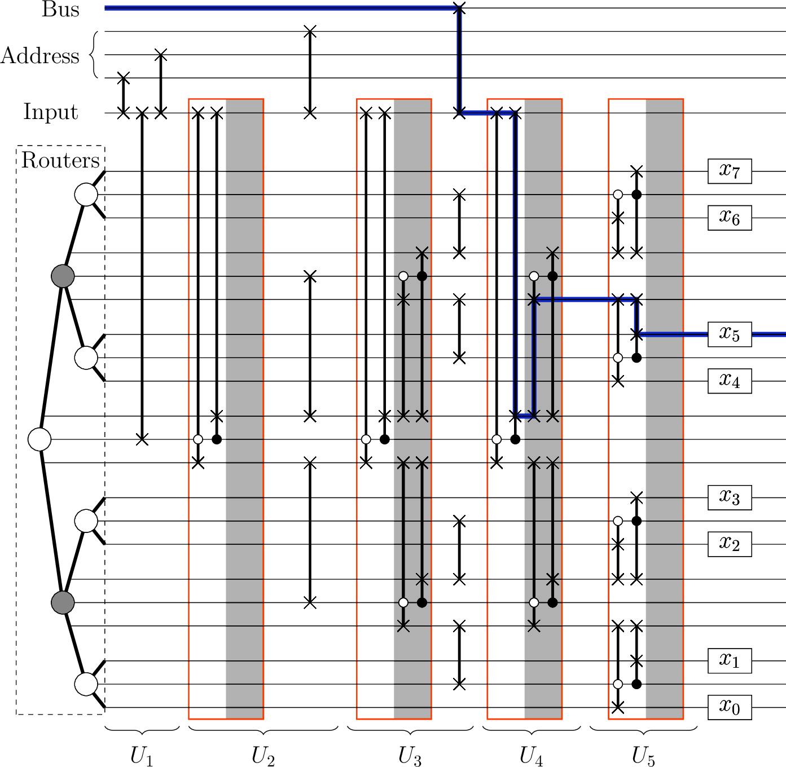
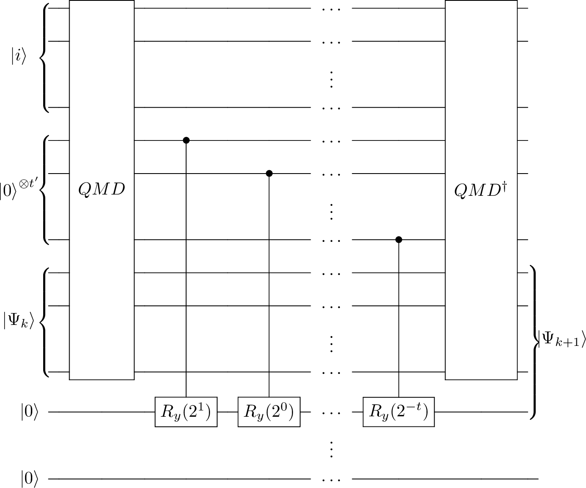

# Classical data and quantum computers {#chap-classical-data-quantum-computers}

<div style="text-align: right"> Contributors: Alessandro Luongo, Jun Hao Hue, Francesco Ghisoni, João F. Doriguello</div>

<div style="text-align: right"> Version: 0.7.1</div>


<div style="text-align: right"> [Pending updates](https://github.com/Scinawa/quantumalgorithms.org/issues/92) </div>
<br>


In this chapter discuss how to represent and load classically available data on a quantum computer. 
First, we describe how to represent data, which reduces to understanding the possible ways of storing information in quantum states. Then, we introduce the quantum memory model of computation, which is the model that we use to load data (which we assume to know classically) into a quantum computer. We finally look at the problem of retrieving data from a quantum computer, discussing the complexity of the problem. The main takeaway from this chapter is the understanding of the tools that are often used at the very start and very end of many quantum algorithms, which will set us up to understanding quantum algorithms in future chapters. This chapter can be tought as the study of the I/O interface of our quantum computer. 


## Representing data in quantum computers{#sec:representing-data}

We'll begin our journey into quantum algorithms by understanding how we can represent and store data as a quantum state. Data plays a key role and is at the heart of most modern algorithms and knowing the best way to encode it on a quantum computer might pave the way for intuitions in solving problems, an essential step towards quantum advantage (as noted also in [@schuld2015introduction]).

There are various ways to achieve this task. Some are borrowed from classical computation, such as the *binary* encoding, which consist in representing encoding boolean strings of length $n$ using $n$ qubits, while some leverage quantum properties, such as the *amplitude* encoding, which consits in representing vectors as linear combination of computational basis. We note that some of the presented schemes depend heavily on the accuracy of the available quantum computers in manipulating quantum states (i.e. developments in metrology and sensing). For example, techniques that rely on precise amplitudes of a state will be hindered by the current noisy hardware, or incour in high overhead of the quantum error correction. Considerations on the practical feasibility of an encoding technique are out of scope for this book.

### Binary encoding {#sec:binary-encoding}

The first method is a way to represent natural numbers on a quantum computer by using the binary expansion of the number to determine the state of a sequence of qubits. Each qubit is set to either the state $\ket{0}$ or $\ket{1}$, corresponding to each bit in the binary representation of the number. To represent a natural number $x \in \mathbb{N}$ on a quantum computer, we consider the binary expansion of $x$ as a list of $m$ bits, and we set the state of the $i^{th}$ qubit as the value of the $i^{th}$ bit of $x$:

\begin{equation}
\ket{x} = \bigotimes_{i=0}^{m} \ket{x_i}.
(\#eq:binary-encoding)
\end{equation}

When extending this definition to signed integers we can, for example, use an additional qubit to store the sign of $x \in \mathbb{Z}$. Another possibility, is to represent signed integer using $2$s complement. This is actually the representation of choice for classical and quantum arithmetic [@luongo2024measurement]. For real numbers we consider that, as on classical computers, $x \in \mathbb{R}$ can be approximated with binary representation up to a certain precision. As before, we need a bit to store the sign, some bits to store the integer part, and some bits to store the fractional part. This is more precisely stated in the following definition, which is a possible way to represent number with fixed precision.

(ref:rebentrost2021quantum) [@rebentrost2021quantum]

```{definition, fixed-point-encoding, name="Fixed-point encoding of real numbers (ref:rebentrost2021quantum)"}
Let $c_1,c_2$ be positive integers, and $a\in\{0,1\}^{c_1}$, $b \in \{0,1\}^{c_2}$, and $s \in \{0,1\}$ be bit strings. Define the rational number as
\begin{equation}
    \mathcal{Q}(a,b,s):= 
    (-1)^s
    \left(2^{c_1-1}a_{c_1}+ \dots + 2a_2 + a_1 + \frac{1}{2}b_1 + \dots + \frac{1}{2^{c_2}}b_{c_2} \right) \in [-R,R],
\end{equation}
where $R= 2^{c_1}-2^{-c_2}$.  
```

If $c_1,c_2$ are clear from the context, we use the shorthand notation for a number $z:=(a,b,s)$ and write  $\mathcal{Q}(z)$ instead of $\mathcal{Q}(a,b,s)$. Given an $n$-dimensional vector $v \in (\{0,1\}^{c_1} \times \{0,1\}^{c_2} \times \{0,1\})^n$
the notation $\mathcal{Q}(v)$ means an $n$-dimensional vector whose $j$-th component is $\mathcal{Q}(v_j)$, for $j \in[n]$.

We note that the choice of $c_1$ and $c_2$ in definition \@ref(def:fixed-point-encoding) depends both on the problem at hand and the implemented algorithm. For the purposes of optimizing a quantum circuit, these constants can be dynamically changed. For example, if at some point of a computation we are required to work with numbers between $0$ and $1$, then we can neglect the $c_1$ bits.

One of the utilities of having a definition to express numbers on a quantum computer to a fixed point precision is the analysis of numerical errors, which is essential to ensure the validity of the solution. This is often done numerically (via simulations, which we will discuss in Chapter \@ref(chap-QML-on-real-data) ), or during the implementation of the algorithm on real hardware. This binary encoding encompasses other kinds of encoding like $2$-complement encoding and a possible quantum implementation of [floating point](https://en.wikipedia.org/wiki/IEEE_754) representation. Howevever, we observe that the floating point encoding has a relatively high circuital overhead and, therefore, is not a common choice. A further layer of complexity arises in understanding how to treat arithmetic operations. This is addressed in the section below.

#### Arithmetic model {#sec:arithmetic-model}


The advantage of using a binary encoding is that we can use quantum circuits for arithmetic operations. 
As we will discuss more in depth in \@ref(sec:implementation-oracle-synthesis) any Boolean circuit can be made reversible, and any reversible circuit can be implemented using single-qubit NOT gates and three-qubit Toffoli gates. Since most of the classical Boolean circuits for arithmetic operations operate with a number of gates of $O(\text{poly}(c_1,c_2))$, this implies a number of quantum gates of $O(\text{poly}(c_1,c_2))$ for the corresponding quantum circuit. Extending the analogy with classical computation allows us to introduce the arithmetic model of computation for performing operations on binary encoded numbers in constant time.

(ref:optimalstoppingtime) [@optimalstoppingtime]

```{definition, defQArith, name="Quantum arithmetic model (ref:optimalstoppingtime)"}
Given $c_1, c_2 \in \mathbb{N}$ specifying fixed-point precision numbers as in Definition  \@ref(def:fixed-point-encoding), we say we use a quantum arithmetic model of computation if the four arithmetic operations can be performed in constant time in a quantum computer.
```

Beware that using Definition \@ref(def:fixed-point-encoding) is not the only possibile choice. For example, most of the non-modular and modular arithemtic circuits are expressed in 2s complement. For a comprehensive and optimized list of results about this topic, the interest reader can read [@luongo2024measurement]. As for the classical counterpart, a quantum algorithm's complexity does not take into account the cost of performing arithmetic operations, as the number of digits of precisions used to represents numbers is a constant, and does not depend on the input size.  However, when estimating the resources needed to run an algorithm on a quantum computer, specifying these values becomes important. For a good example of a complete resource analysis, including arithmetic operations in fixed-point precision, of common algorithms in quantum computational finance we refer to [@chakrabarti2021threshold].

### Amplitude encoding{#sec:amplitude-encoding}

Amplitude encoding is a way to represent a vector $x$ of size $n$ (where $n$ is a power of $2$) in the amplitudes of an $\log(n)$ qubit pure state. We can map a vector $x \in \mathbb{R}^{N}$ (or even $\in \mathbb{C}^{N}$) to the following quantum state:

\begin{equation}
\ket{x} = \frac{1}{{\left \lVert x \right \rVert}}\sum_{i=0}^{N-1}x_i\ket{i} = \|x\|^{-1}x,
(\#eq:amplitude-encoding)
\end{equation}

Sometimes, amplitude encoding is also known as *quantum sampling access*, as sampling from a quantum state we prepare can also be interpreted as sampling from a probability distribution. In fact, if the amplitude of a computational basis $\ket{i}$ is $\alpha_i$, then we sample $\ket{i}$ with probability $|\alpha_i|^2$. Observe from the state in the above equation we are actually representing an $\ell_2$-normalized version of the vector $x$. Therefore we have "lost" the information on the norm of the vector $x$. However we will see how this is not a problem when we work with more than one vector. This type of encoding can be generalized to matrices. Let $x(i)$ be the $i$-th row of $X \in \mathbb{R}^{n \times d}$, a matrix with $n$ rows and $d$ columns (here we take again $n$ and $d$ to be a power of $2$). Then we can encode $X$ with $\lceil log(d) \rceil +\lceil log(n) \rceil$ qubits as: 


\begin{equation}
\ket{X} = \frac{1}{\sqrt{\sum_{i=1}^n {\left \lVert x(i) \right \rVert}^2 }} \sum_{i=1}^n {\left \lVert x(i) \right \rVert}\ket{i}\ket{x(i)}
  (\#eq:matrix-state1)
\end{equation}


```{exercise}
Check that Equation \@ref(eq:matrix-state1) is equivalent to 
\begin{equation}
\ket{X} = \frac{1}{\sqrt{\sum_{i,j=1}^{n,d} |X_{ij}|^2}} \sum_{i,j=1}^{n,d} X_{ij}\ket{i}\ket{j},
  (\#eq:matrix-state2)
\end{equation}

```


From an algorithms perspective, amplitude encoding is useful because it requires a logarithmic number of qubits with respect to the vector size, which might seem to lead to an exponential saving in physical resources when compared to classical encoding techniques. However, a major drawback of amplitude encoding is that, in the worst case, for the majority of states, it requires a circuit of size $\Omega(N)$.

<!-- From an algorithms perspective, amplitude encoding is useful because it requires a logarithmic number of qubits with respect to the vector size, which might seem to lead to an exponential saving in physical resources when compared to classical encoding techniques. In addition, using amplitude encoding, it is easy to define a reshape function by shifting the qubits from the column index to the row index register. For example, consider reshaping a $2 \times 4$ matrix into a $4 \times 2$ matrix -->

<!-- \begin{equation} -->
<!--   \begin{pmatrix} -->
<!--     a & b & c & d\\ -->
<!--     e & f & g & h -->
<!--   \end{pmatrix}\rightarrow \begin{pmatrix} -->
<!--     a & b\\ -->
<!--     c & d\\ -->
<!--     e & f\\ -->
<!--     g & h -->
<!--   \end{pmatrix}\,. -->
<!-- \end{equation} -->
<!-- This can be done by shifting the qubit indices from the column indices to the row indices, i.e. -->
<!-- \begin{equation} -->
<!-- \begin{aligned} -->
<!--   {}& \ket{0} \left( a \ket{00} + b \ket{01} + c \ket{10} + d \ket{11} \right) + \ket{1} \left( e \ket{00} + f \ket{01} + g \ket{10} + h \ket{11} \right)\\ -->
<!--   \rightarrow{}& \ket{00} \left(a \ket{0} + b \ket{1}\right) + \ket{01} \left(c \ket{0} + d \ket{1}\right) + \ket{10} \left(e \ket{0} + f \ket{1}\right) + \ket{11} \left(g \ket{0} + h \ket{1} \right) \,. -->
<!-- \end{aligned} -->
<!-- \end{equation} -->
<!-- In general, we can reshape a matrix from size $2^m \times 2^n$ to $2^{m\pm j} \times 2^{n \mp j}$ by shifting $j$ qubits between the row and column indices. A reshape function is useful because it changes the singular values of the matrices while keeping the same matrix entries, which is useful for some applications. -->

<!-- Furthermore, amplitude encoding can also retain the Euclidean distance of the classical vector. For example, for two vectors $x = [x_0\, x_1]$ and $y = [y_0\, y_1]$, the distance between the vectors is $d(x,y) = (x_0 - y_0)^2 + (x_1 - y_1)^2$. Under amplitude encoding, we can have the same distance measure by defining -->
<!-- \begin{equation} -->
<!--   d_{\mathrm{amp}}(\ket{x}, \ket{y}) = (\bra{x} - \bra{y}) (\ket{x} - \ket{y}) \,, -->
<!-- \end{equation} -->
<!-- where $\ket{x} = x_0 \ket{0} + x_1 \ket{1}$ and $\ket{y} = y_0 \ket{0} + y_1 \ket{1}$. Therefore, amplitude encoding can have the same distance measure as the classical vectors. However, a major drawback of amplitude encoding is that, in the worst case, for the majority of states, it requires a circuit of size $\Omega(N)$. -->

<!-- TODO say about padding if the vector is not a power of two. What about complex numbers? There is a problem with a global phase, no? -->


### Block encoding {#sec:block-encoding}
Block encoding is another type of encoding for working with matrices on a quantum computer. More precisely, we want to encode a matrix into a unitary that has a circuit representation on a quantum computer. As it will become clear in the next chapters, being able to perform such encoding unlocks many possibilities in terms of new quantum algorithms.

```{definition, name="Block encoding of a matrix"}
Let $A \in \mathbb{R}^{N \times N}$ be a square matrix for $N = 2^n$ for $n\in\mathbb{N}$, and let $\alpha \geq 1$. For $\epsilon > 0$, we say that a $(n+a)$-qubit unitary $U_A$ is a $(\alpha, a, \epsilon)$-block encoding of $A$ if

\begin{equation}
  \| A - \alpha ( \bra{0}^{\otimes a} \otimes I) U_A (\ket{0}^{\otimes a} \otimes I) \|_2 \leq \epsilon
\end{equation}
```

It is useful to observe that an $(\alpha, a, \epsilon)$-block encoding of $A$ is just a $(1, a, \epsilon)$-block encoding of $A/\alpha$. Often, we do not want to take into account the number of qubits $a$ we need to create the block encoding because these are expected to be negligible. Therefore, some definitions of block encoding in the literature use the notation $(\alpha, \epsilon)$ or the notation $\alpha$-block encoding if the error is $0$. Note that the matrix $U_A \in \mathbb{R}^{(N+\kappa) \times (N+\kappa)}$ has the matrix $A$ encoded in the top-left part:

\begin{equation}
U_A = \begin{pmatrix}
A & . \\
. & .
\end{pmatrix}.
(\#eq:blockencoding)
\end{equation}

<!-- TODO we also said to remove other and just list other things, right? -->

### Angle encoding {#sec:angle-encoding}
Another way to encode vectors, as defined by [@schuld2021machine;@grant2018hierarchical;@cao2020cost], is with angle encoding, also known as qubit encoding [@larose2020robust]. This technique encodes information as angles of the Pauli rotations $R_x(\theta)$, $R_y(\theta)$, $R_z(\theta)$. Given a vector $x \in \mathbb{R}^n$, with all elements in the interval $[0,2\pi)$, the technique seeks to apply $R_{\alpha}^i(x_i)$, where $\alpha \in \{x,y,z \}$ and $i$ refers to the target qubit. The resulting state is said to be an angle encoding of $x$ and has a form given by

\begin{equation}
  \ket{x} = \prod_{i=1}^{n} R_{\alpha}^{i}(x_i)\ket{0}^{\otimes n} \,.
  (\#eq:angle-encoding)
\end{equation}

A more efficient form of angle encoding, called dense angle encoding [@larose2020robust], encodes odd entries as the rotation angle, and even entries as the phase difference between $\ket{0}$ and $\ket{1}$, i.e.,

\begin{equation}
  \ket{x} = \prod_{i=1}^{\lceil n/2 \rceil} R_{z}^{i}(x_{2i}) R_{y}^{i}(x_{2i-1})\ket{0}^{\otimes \lceil n/2 \rceil} \,.
\end{equation}

This shows that one can encode 2 vector entries in 1 qubit under angle encoding. This leads to the most general form of angle encoding [@larose2020robust;@perez2020data]

\begin{equation}
  \ket{x} = \prod_{i=1}^{\lceil n/2 \rceil} U^i(x_{2i-1}, x_{2i}) \ket{0}^{\otimes \lceil n/2 \rceil} \,,
\end{equation}
where $U^i$ is a general unitary operation, that depends on $x_{2i-1}$ and $x_{2i}$, acting on qubit $i$.

These techniques are useful because it uses resource efficiently specifically for NISQ architectures, which scales linearly with the number of qubits and the depth. One major drawback is that it is difficult to perform arithmetic operations on the resulting state, and to our knowledge there is no non-variational algorithms using this encoding yet.

An equivalent encoding scheme is the exponential encoding with the form [@shin2023exponential]

\begin{equation}
  \ket{x} = \prod_{i=0}^{n-1} \prod_{j=0}^{m-1} R_z^{mi+j+1}(\beta_{ij} x_i) \ket{0}^{\otimes mn} \,,
\end{equation}
where we repeat the angle encoding $m$ times for each $x_i$ with different weights $\beta_{ij}$. This might be useful in some applications, for example for quantum supervised learning.

<!--With respect to the binary encoding it utilizes less qubits but deeper circuits; whilst with respect to amplitude encoding angle encoding's linear qubit number scaling is worse than amplitude encoding's logarithmic scaling, but angle encoding requires less operations. On the other hand it is difficult to perform arithmetic operations on the resulting state, which is a major drawback of angle encoding.-->

### Graph encoding {#sec:graph-encoding}
A graph is as a tuple $G =(V,E)$, where $V$ are the vertices in the graph and $E$ are the edges, where $E \subseteq V \times V$. For graph encoding we require unidirected graphs in which if $( v_i, v_j ) \in E$ then $( v_j, v_i ) \in E$. Unidirected graphs can be either simple or multigraphs. A simple unidirected graph is one without self loops and at most a single edge connecting two vertices, whilst a unidirected multigraph can have self loops or multiple edges between two vertices. Graph encoding is possible for unidirected multigraphs with self loops but at most a single edge between two vertices.

A graph $G$ will be represented as an $N=|V|$ qubit pure quantum state $\ket{G}$ such that

\begin{equation}
  K_G^v\ket{G} = \ket{G}, \;\; \forall v \in V
  (\#eq:graph-encoding)
\end{equation}

where $K_G^v = \sigma_x^v\prod_{u \in N(v)}\sigma_z^u$, and $\sigma_x^u$ and $\sigma_z^u$ are the Pauli operators $\sigma_x$ and $\sigma_z$ applied to the $u^{th}$ qubit.

Given a graph $G$ with $V$ vertices and edges $E$, take $N=|V|$ qubits in the $\ket{0}^{\otimes N}$ state, apply $H^{\otimes N}$, producing the $\ket{+}^{\otimes N}$ state where $\ket{+} = \frac{\ket{0} + \ket{1}}{\sqrt{2}}$. Then apply a controlled $Z$ rotation between qubits connected by an edge in $E$. It is worth noting that 2 different graphs can produce the same graph state $\ket{G}$. In particular if a graph state $\ket{\tilde{G}}$ can be obtained from a graph state $\ket{G}$ by only applying local Clifford group operators, the 2 graphs are said to be LC-equivalent. The work by [@graph_encoding] has interesting application of this type of encoding. 

<!--#### Hypergraph encoding{#sec:graph-hypergraph}-->


### One-hot encoding{#sec:onehot-encoding}
Another possible way of encoding vectors as quantum states introduced by [@mathur2022medical] is **one-hot amplitude encoding**, also known as **unary amplitude encoding**, which encodes a normalized vector $x \in \mathbb{C}^n$ onto $n$ qubits. The vector values $x_i \in \mathbb{C}$ will be stored in the amplitudes of the states that form the $2^n$-dimensional canonical basis, i.e, the states with only one $1$ and the rest $0$s. This corresponds to preparing the state: 

\begin{equation}
\ket{x} = \frac{1}{||x||} \sum_{i=1}^n x_i \ket{e_i},
(\#eq:one-hot-encoding)
\end{equation}

where, for some integer $i$, the states $e_i$ take the form $e_i = 0^{i-1}10^{n-i}$. 

<!-- #### Exponential encoding{#sec:exponential-encoding} -->

## Quantum memory{#sec:quantum-memory}

Having seen possible ways to represent data on a quantum computer, we will now take the first step toward understanding how to create quantum states that are representing numbers using these encodings. The first step involves understanding quantum memory, which plays a key role in various quantum algorithms/problems such as: Grover’s search, solving the dihedral hidden subgroup problem, collision finding, phase estimation for quantum chemistry, pattern recognition, machine learning algorithms, cryptanalysis, and state preparation. 

To work with quantum memory we need to define a quantum memory model of computation, which enables us to accurately calculate the complexity of quantum algorithms. In this framework we divide a quantum computation into a data pre-processing step and a computational step. Quantum memory allows us to assume that the pre-processed data can be easily accessed (as in classical computers). In this model, since the pre-processing is negligible, and has to be performed only once, the complexity of a quantum algorithm is fully characterized by the computational step. This understanding formalizes a quantum computation in two distinct components: a quantum processing unit and a quantum memory device. Two notable examples of quantum memory devices are the quantum random access memory ($\QRAM$) and the quantum random access gates ($\mathsf{QRAG}$). It is important to note that having access to a quantum memory device is associated with fault tolerant quantum computers.

This section will first introduce the quantum memory model of computation (\@ref(sec:quantum-memory-model)). This will be followed by the formalization of a quantum computation in the memory model via a quantum processing unit ($\mathsf{QPU}$) and a quantum memory device ($\mathsf{QMD}$) (\@ref(sec:QPU-QMD)), where the $\QRAM$ and $\mathsf{QRAG}$ will be presented as possible implementation of the $\mathsf{QMD}$. 

<!--Finally the quantum random access memory($\QRAM$)(\@ref(sec:qram)) and the quantum random access to gates($\mathsf{QRAG}$)(\@ref(sec:qrag)) will be discussed.-->

<!--Before looking at quantum memory we'll give a quick recap of a (simplified) model of a classical computer. 

In general we can think of a classical computer as having: 

- a central processing unit (CPU) 
- a random Access Memory (RAM) that serves as a temporary storage medium for the CPU to quickly retrieve data;
- auxiliary permanent storage mediums. 
-->
<!--
A RAM is made of a memory array, an address/input register, and a target/bus/output register. Data is accessed or modified via address lines. When the CPU requires access to the memory, it sends the value from the address register down the address lines(called bus), and, depending on the read or write signal, the content of a memory cell is either copied into the target register or stored from the target register into the memory cell. 
The aim of this section is to understand how this process occurs on a quantum computer. In particular we will start by introducing the access model of computation which will help in understanding the importance of quantum memory models. Then we will look at the mathematical formalism required to define the different components of a quantum computer: the quantum processing unit(QPU), quantum memory device(QMD), the quantum random access to memory(QRAM) and the quantum random access to gates(QRAG).
-->

### The quantum model of computation with and without memory {#sec:quantum-memory-model}

As discussed in the Section \@ref(measuring-complexity) of the previous chapter, in quantum computing we often work in a oracle model, also called black-box model of quantum computation. This section is devoted to the formalization of this model of computation. The word “oracle”, (a word referencing concepts in complexity theory), is used to imply that an application of the oracle has $\mathcal{O}(1)$ cost, i.e. we do not care about the cost of implementing the oracle in our algorithm. A synonym of quantum oracle model is quantum query model, which stresses the fact that we can only use the oracle to perform queries. 

To appreciate the potential of quantum algorithms, it is important to understand the quantum memory model. This is because we want to compare quantum algorithms with classical algorithms. Understanding the quantum memory model makes sure that we  not favor any of the approaches, ensuring a fair evaluation of their performance across different computational models and memory architectures. Understanding classical memory is also important for classical algorithms. Memory limitations make the analysis of big datasets challenging. This limitation is exacerbated when the random-access memory is smaller than the dataset to analyze, as the bottleneck of computational time switch from being the number of operations to the time to move data from the disk to the memory. Hence, algorithms with super linear runtime (such as those based on linear algebra) become impractical for large input size.

As we will formalize later, the runtime for analyzing a dataset represented by a matrix $A \in \mathbb{R}^{n \times d}$ using a quantum computer is given by the time to preprocess the data (i.e., creating quantum accessible data structures) and the runtime of the quantum algorithm. Importantly, the pre-processing step needs to be done only once, allowing one to run (different) quantum algorithms on the same matrix. We can see this pre-processing step as a way of encoding and/or storing the data: once the matrix is pre-processed, we can always retrieve the matrix in the original representation (i.e. it is a loss less encoding).  This step bears some similarities with the process of loading the data from the disk in RAM Therefore, because the pre-processing step is analyzed differently from the runtime, when we work with a quantum algorithm that has quantum access to some classical data, we have the following model in mind. 
 
```{definition, costing-of-quantum-memory-model, name="Costing in the quantum memory model"}
An algorithm in the quantum memory model that processes a data-set of size $m$ has two steps:
 
 * A pre-processing step with complexity $\widetilde{O}(m)$ that constructs an efficient quantum access to the data 
 * A computational step where the algorithm has quantum access to the data structures constructed in step 1.
 
The complexity of the algorithm in this model is measured by the cost for step 2.
```

Let's consider an example. We will see that many of the quantum algorithms considered in this book have a computational complexity expressed (in number of operations of a certain kind) as some functions of the matrix and the problem. Consider a classical algorithm with a runtime of  $\widetilde{O} \left( \frac{\norm{A}_0\kappa(A)}{\epsilon^2}\log(1/\delta) \right)$ calls to the classical memory (and coincidentally, CPU operations).  Here $\epsilon$ is some approximation error in the quantity we are considering, $\kappa(A)$ is the condition number of the matrix, $\delta$ the failure probability. The quantum counterpart of this algorithm has a runtime of $O(\norm{A}_0)$ classical operation for pre-processing and 

\begin{equation}
\widetilde{O}(\text{poly}(f(A)), \text{poly}(\kappa(A)), \text{poly}(1/\epsilon), \text{poly}(\log(nd)), \text{poly}(\log(1/\delta)) )
(\#eq:example-of-runtime)
\end{equation}

queries to the quantum memory (and coincidentally, number of operations). Here,  $f(A)$ represents some size-independent function of the matrix that depends on the properties of $A$ which can be chosen to be $\|A\|_F$: the Frobenius norm of the matrix.  Importantly, note that in the runtime of the quantum algorithm there is no dependence on $\|A\|_0$. 

The first step, i.e., loading data (for example a matrix $A$) onto a quantum memory gives an additive price of $\widetilde{O}(\norm{A}_0)$, and is computationally easy to implement. In some cases this can be done on the fly, with only a single pass over the dataset,  for example while receiving each of the rows of the matrix. For more complex choices of $f(A)$, the construction of the data structure needs only a few (constant) numbers of passes over the dataset. As pre-processing the data is negligible, we expect quantum data analysis to be faster than classical data analysis. However, there is no need to employ quantum data analysis for small datasets if classical data analysis is sufficient.

In the quantum memory model, we assumed that the pre-processing step to be negligible in cost, and thereby claim that there is significant practical speedup when using quantum algorithms compared to classical algorithms. However, a proper comparison for practical applications needs to include the computational cost of the loading process, which may or may not remove the exponential gap between the classical and the quantum runtime. Nevertheless, even when the pre-processing step is included, we expect the overall computational cost to largely favor the quantum procedure. This analysis can be done only with a proper understanding of the quantum memory model.

Having a clear and deep understanding of the quantum memory model can help us understand the power and limitations of classical computers as well. The past few years saw a trend of works proposing "dequantizations" of quantum machine learning algorithms. These algorithms explored and sharpened some ideas [@tang2018quantum] to leverage a classical data structure to perform importance sampling on input data to have classical algorithm with polylogarithmic runtimes in the size of the input. This data structure is very similar to the one used in many quantum machine learning algorithms (see Section \@ref(sec:implementation-KPtrees)). As a result, many quantum algorithms which had an exponential separation with their classical counterpart now have at most a polynomial speedup compared to the classical algorithm. However, these classical algorithms have a worse dependence in other parameters (like condition number, Frobenius norm, rank, and so on) that will make them disadvantageous in practice (i.e., they are slower than the fastest classical randomized algorithms [@arrazola2020quantum]). With that said, having small polynomial speedup is not something to be critical about: even constant speedups matter a lot in practice! Overall, dequantizations and polynomial speedups highlight the importance of clearly understanding the techniques behind loading classical data in quantum computers.

### The quantum processing unit and quantum memory device {#sec:QPU-QMD}

In this section, we formally define a model of a quantum computer with quantum access to memory. We can intuitively understand this model by separating the available Hilbert space in two: a part dedicated to computing, the Quantum Processing Unit ($\mathsf{QPU}$) and a part dedicated to storing, the Quantum Memory Device ($\mathsf{QMD}$). 

The qubits which comprise the $\mathsf{QPU}$ are assigned to either an input register or a workspace register; whilst the qubits which comprise the $\mathsf{QMD}$ are assigned to either a ancillary register or a memory register. Two other registers, the address register and the target register, are shared by the $\mathsf{QPU}$ and $\mathsf{QMD}$ and allow for communication between the two Hilbert spaces. A depiction of the architecture of a $\mathsf{QPU}$ with access to a $\mathsf{QMD}$ can be seen in Figure \@ref(fig:quantum-architecture). Before defining a model of a quantum computer with quantum access to memory, we will first formally define a computation with only the quantum processing unit $\mathsf{QPU}$.

(ref:allcock2023quantum) [@allcock2023quantum]

```{definition, def-QPU, name="Quantum Processing Unit (ref:allcock2023quantum)"}
A Quantum Processing Unit($\mathsf{QPU}$) of size $m$ is defined as a tuple $(\mathtt{I}, \mathtt{W},\mathcal{G})$ consisting of

- an $m_{\mathtt{I}}$-qubit Hilbert space called \emph{input register} $\mathtt{I}$;
- an $(m-m_{\mathtt{I}})$-qubit Hilbert space called \emph{workspace} $\mathtt{W}$;
- a constant-size universal gate set $\mathcal{G}\subset\mathcal{U}(\mathbb{C}^{4\times 4})$.

The qubits in the workspace $\mathtt{W}$ are called ancillary qubits or simply ancillae. An input to the $\mathsf{QPU}$, or quantum circuit, is a tuple $(T,|\psi_{\mathtt{I}}\rangle,C_1,\dots,C_T)$ where $T\in\mathbb{N}$, $|\psi_{\mathtt{I}}\rangle\in\mathtt{I}$, and, for each $t\in\{1,\dots,T\}$, $C_t\in\mathcal{I}(\mathcal{G})$ is a set of instructions from a set $\mathcal{I}(\mathcal{G})$ of possible instructions. Starting from the state $|\psi_0\rangle := |\psi_\mathtt{I}\rangle|0\rangle_{\mathtt{W}}^{\otimes (m-m_\mathtt{I})}$, at each time step $t\in\{1,\dots, T\}$ we obtain the state $|\psi_t\rangle = C_t|\psi_{t-1}\rangle\in\mathtt{I}\otimes\mathtt{W}$. The instruction set $\mathcal{I}(\mathcal{G})\subset\mathcal{U}(\mathbb{C}^{2^m\times 2^m})$ consists of all $m$-qubit unitaries on $\mathtt{I}\otimes\mathtt{W}$ of the form

\begin{equation}
\prod_{i=1}^k (\mathsf{U}_i)_{\to I_i}
\end{equation}

for some $k\in\mathbb{N}$, $\mathsf{U}_1,\dots,\mathsf{U}_k\in\mathcal{G}$ and pair-wise disjoint non-repeating sequences $I_1,\dots,I_k\in[m]^{\leq 2}$ of at most $2$ elements. We say that $\sum_{i=1}^k |I_i|$ is the \emph{size} of the corresponding instruction. We say that $T$ is the \emph{depth} of the input to the $\mathsf{QPU}$, while its \emph{size} is the sum of the sizes of the instructions $C_1,\dots,C_T$.
```

Note that in this definition the circuit size differs from the standard notion of circuit size, which is the number of selected gates from $\mathcal{G}$, up to a factor of at most $2$. 


```{exercise, standardzied}
Can you explain why the circuit size differs from the standard notion of circuit size by up to a factor of at most $2$
```


Moreover, in this framework, the locations of the address and target registers are fixed. One could imagine a more general setting where the address and target registers are freely chosen from the workspace. This case can be handled by this model with minimal overhead, e.g. by performing $\ell$-$\mathsf{SWAP}$ gates to move the desired workspace qubits into the address or target register locations.

Adding access to a $\mathsf{QMD}$ changes how we define the model of computation. In practice, a call to the $\mathsf{QMD}$ sees the address register selecting a unitary from a set of unitaries $\mathcal{V}$ and applying it to both the target and memory register. It is important to stress that even though a call to the $\mathsf{QMD}$ might require gates from a universal gate set, the underlying quantum circuit implementing such a call is \emph{fixed}, i.e., does not change throughout the execution of a quantum algorithm by the $\mathsf{QPU}$, or even between different quantum algorithms. Below we find the full definition of a quantum computation of a $\mathsf{QPU}$ with access to a $\mathsf{QMD}$.

```{definition, QPUQMD, name="Quantum Processing Unit and Quantum Memory Device (ref:allcock2023quantum)"}
We consider a model of computation comprising a Quantum Processing Unit($\mathsf{QPU}$) of size $\poly\log(n)$ and a Quantum Memory Device ($\mathsf{QMD}$) of $n$ memory registers, where each register is of $\ell$-qubit size (for $n$ a power of $2$). A $\mathsf{QPU}$ and a $\mathsf{QMD}$ are collectively defined by a tuple $(\mathtt{I}, \mathtt{W}, \mathtt{A}, \mathtt{T}, \mathtt{Aux}, \mathtt{M}, \mathcal{G}, \mathsf{V})$ consisting of

- two $(\operatorname{poly}\log{n})$-qubit Hilbert spaces called \emph{input register} $\mathtt{I}$ and \emph{workspace} $\mathtt{W}$ owned solely by the $\mathsf{QPU}$;
- a $(\log{n})$-qubit Hilbert space called \emph{address register} $\mathtt{A}$ shared by both $\mathsf{QPU}$ and $\mathsf{QMD}$;
- an $\ell$-qubit Hilbert space called \emph{target register} $\mathtt{T}$ shared by both $\mathsf{QPU}$ and $\mathsf{QMD}$;
- a $(\poly{n})$-qubit Hilbert space called \emph{auxiliary register} $\mathtt{Aux}$  owned solely by the $\mathsf{QMD}$;
- an $n\ell$-qubit Hilbert space called \emph{memory} $\mathtt{M}$ comprising $n$ registers $\mathtt{M}_0, \ldots, \mathtt{M}_{n-1}$, each containing $\ell$ qubits, owned solely by the $\mathsf{QMD}$;
- a constant-size universal gate set $\mathcal{G}\subset\mathcal{U}(\mathbb{C}^{4\times 4})$;
-  a function $\mathsf{V} : [n] \to \mathcal{V}$, where $\mathcal{V}\subset \mathcal{U}(\mathbb{C}^{2^{2\ell}\times 2^{2\ell}})$ is a $O(1)$-size subset of $2\ell$-qubit gates.

The qubits in $\mathtt{W}$, $\mathtt{A}$, $\mathtt{T}$, and $\mathtt{Aux}$ are called ancillary qubits or simply ancillae. An input to the $\mathsf{QPU}$ with a $\mathsf{QMD}$, or quantum circuit, is a tuple $(T,|\psi_\mathtt{I}\rangle,|\psi_{\mathtt{M}}\rangle,C_1,\dots,C_T)$ where $T\in\mathbb{N}$, $|\psi_{\mathtt{I}}\rangle\in\mathtt{I}$, $|\psi_{\mathtt{M}}\rangle\in\mathtt{M}$, and, for each $t\in\{1,\dots,T\}$, $C_t\in\mathcal{I}(\mathcal{G},\mathsf{V})$ is an instruction from a set $\mathcal{I}(\mathcal{G},\mathsf{V})$ of possible instructions. The instruction set $\mathcal{I}(\mathcal{G},\mathsf{V})$ is the set $\mathcal{I}(\mathcal{G})$ acting on $\mathtt{I}\otimes\mathtt{W}\otimes\mathtt{A}\otimes\mathtt{T}$ augmented with the call-to-the-$\mathsf{QMD}$ instruction that implements the unitary

\begin{equation}
|i\rangle_{\mathtt{A}}|b\rangle_{\mathtt{T}}|x_i\rangle_{\mathtt{M}_i}|0\rangle^{\otimes \poly{n}}_{\mathtt{Aux}} \mapsto|i\rangle_{\mathtt{A}}\big(\mathsf{V}(i)|b\rangle_{\mathtt{T}}|x_i\rangle_{\mathtt{M}_i}\big)|0\rangle^{\otimes \poly{n}}_{\mathtt{Aux}}, \qquad \forall i\in[n],b,x_i\in\{0,1\}^\ell.
\end{equation}

Starting from $|\psi_0\rangle|0\rangle^{\otimes \poly{n}}_{\mathtt{Aux}}$, where $|\psi_0\rangle := |\psi_\mathtt{I}\rangle|0\rangle^{\otimes\poly\log{n}}_{\mathtt{W}}|0\rangle_{\mathtt{A}}^{\otimes \log{n}}|0\rangle_{\mathtt{T}}^{\otimes \ell}|\psi_\mathtt{M}\rangle$, at each time step $t\in\{1,\dots, T\}$ we obtain the state $|\psi_t\rangle|0\rangle^{\otimes \poly{n}}_{\mathtt{Aux}} = C_t(|\psi_{t-1}\rangle|0\rangle^{\otimes \poly{n}}_{\mathtt{Aux}})$, where $|\psi_t\rangle\in \mathtt{I}\otimes \mathtt{W}\otimes \mathtt{A}\otimes \mathtt{T}\otimes \mathtt{M}$.

```


```{r, quantum-architecture, echo=FALSE, out.width="50%", fig.cap="The architecture of a Quantum Processing Unit($\\mathsf{QPU}$) with access to a quantum memory device($\\mathsf{QMD}$). The $\\mathsf{QPU}$ is composed of a $\\poly \\log(n)$-qubit input register $\\mathtt{I}$ and workspace $\\mathtt{W}$. The $\\mathsf{QMD}$ is composed of an $nl$-qubit memory array $\\mathtt{M}$, composed of $n$ memory cells each of size $l$-qubits, and a $\\poly(n)$-qubit auxiliary register $\\mathtt{Aux}$. Two registers, the $\\log(n)$-qubit address register $\\mathtt{A}$ and an $l$-qubit target register $\\mathtt{T}$, are shared between the $\\mathsf{QPU}$ and the $\\mathsf{QMD}$."}

```

This model can be seen as a refined version of the one described in [@buhrman2022memory], where the authors divide the qubits of a quantum computer into work and memory qubits. Given $M$ memory qubits, their workspace consists of $O(\log M)$ qubits, of which the address and target qubits are always the first $\lceil\log M\rceil + 1$ qubits. However, address and target qubits are not considered to be shared by the $\mathsf{QMD}$, and there is no mention of ancillary qubits mediating a call to the $\mathsf{QMD}$. The inner structure of the $\mathsf{QMD}$ is abstracted away by assuming access to the unitary of a $\mathsf{QRAG}$ (see Definition \@ref(def:qrag) later). This model, in contrast, "opens" the quantum memory device, and allows for general fixed unitaries, including $\QRAM$ and $\mathsf{QRAG}$.

In addition, this model does not include measurements. These can easily be performed on the output state $\ket{\psi_T}$ if need be. Furthermore the position of the qubits is not fixed within the architecture, allowing for long-range interactions through, for example, multi-qubit entangling
gates. This feature is not always possible in physical the real world since some quantum devices, such as superconducting quantum computers, don't allow for long-range interactions between qubits. For a model of computation which take in consideration physically realistic device interactions we suggest the work by [@Beals_2013]. 

We stress the idea that call to the $\mathsf{QMD}$ is defined by the function $\mathsf{V}$ and quantum memory device is defined by the unitary that it implements. In many applications, one is interested in some form of reading a specific entry from the memory, which corresponds to the special cases where the $\mathsf{V}(i)$ unitaries are made of controlled single-qubit gates, and to which the traditional $\QRAM$ belongs.


#### The LAQCC model of quantum computation

We can also consider an alternative model of quantum computation to the one in Definition \@ref(def-QPU): the LAQCC model, which stands for Local Alternating Quantum Classical Computations. LAQCC is a hybrid quantum-classical computational framework [@buhrman2023state]. This model assumes quantum hardware with specific topology and connectivity, enabling the measurement of certain (but not necessarily all) qubits. The measurement results are then used to perform intermediate classical computations, which, in turn, control subsequent quantum circuits. This process can alternate between quantum and classical layers multiple times, allowing for iterative computation. The authors did not consider an explicit formulation of the quantum memory device. However, it is possible to perform amplitude encoding of a certain class of states in constant depth. Formally, it is defined as follows.

(ref:buhrman2023state) [@buhrman2023state]

```{definition, def-laqcc, name="Local Alternating Quantum Classical Computations (ref:buhrman2023state)"}
Let $\text{LAQCC}(\mathcal{Q}, \mathcal{C}, d)$ be the class of circuits such that:

- Every quantum layer implements a quantum circuit $Q \in \mathcal{Q}$ constrained to a grid topology;
- Every classical layer implements a classical circuit $C \in \mathcal{C}$;
- There are $d$ alternating layers of quantum and classical circuits;
- After every quantum circuit $Q$, a subset of the qubits is measured;
- The classical circuit receives input from the measurement outcomes of previous quantum layers;
- The classical circuit can control quantum operations in future layers.

The allowed gates in the quantum and classical layers are given by $\mathcal{Q}$ and $\mathcal{C}$, respectively. Furthermore, we require a circuit in $\text{LAQCC}(\mathcal{Q}, \mathcal{C}, d)$ to deterministically prepare a pure state on the all-zeroes initial state.
```


#### The QRAM{#sec:qram}
<!--Along with a fully fledged quantum computer, it is often common to assume that we have access to a quantum memory, i.e. a classical data structure that store classical information, but that is able to answer queries in quantum superposition. This model is commonly called the **QRAM model** (and is a kind of query model).
The name $\QRAM$ is meant to evoke the way classical RAM works, by addressing the data in memory using a tree structure. 
Note that sometimes, $\QRAM$ goes under the name of QROM, as actually it is not something that can be written during the runtime of the quantum algorithm, but just queried, i.e. read. 
Furthermore, a $\QRAM$ is said to be *efficient* if can be updated by adding, deleting, or modifying an entry in polylogarithmic time w.r.t the size of the data it is storing. 
Remember that assuming to have access to a large $\QRAM$ in your algorithms is something that is often associated with more long-term quantum algorithms, so it is a good idea to limit as much as possible the dependence on $\QRAM$ on your quantum algorithms.
There is a catch. As we will see in greater details soon, the task of building the data structure classically requires time that is linear (up to polylogarithmic factors) in the dimension of the data (this observation is better detailed in definition \@ref(def:QRAM-model) ). 
Using the following definition, we can better define the computational model we are working with.
-->
<!--```{definition, qram-informal, name="Quantum Random Access Memory - informal (ref:qram-informal)"}
A quantum random access memory is a device that stores indexed data $(i,x_i)$ for $i \in [n]$ and $x_i \in \R$ (eventually truncated with some bits of precision). It allows query in the form $\ket{i}\ket{0}\mapsto \ket{i}\ket{x_i}$, and has circuit depth $O(polylog(n))$.
```-->
A type of $\mathsf{QMD}$ of particular interest is the $\QRAM$, which is the quantum equivalent of a classical Random Access Memory (RAM), that stores classical or quantum data and allows for superposition-based queries. More specifically, a $\QRAM$ is a device comprising a memory register that stores data, an address register that points to the memory cells to be addressed, and a target register into which the content of the addressed memory cells is copied. If necessary, it also includes an auxiliary register supporting the overall operation, which is reset to its initial state at the end of the computation. Formally, we define it as:

```{definition, qram, name="Quantum Random Access Memory"}
Let $n\in\mathbb{N}$ be a power of $2$ and $f(i) = \mathsf{X}$ for all $i\in[n]$. A \emph{quantum random access memory} $\QRAM$ of memory size $n$ is a $\mathsf{QMD}$ with $\mathsf{V}(i) = \mathsf{C}_{\mathtt{M}_i}$-$\mathsf{X}_{\to\mathtt{T}}$. Equivalently, it is a $\mathsf{QMD}$ that maps

\begin{equation}
\ket{i}_{\mathtt{A}}\ket{b}_{\mathtt{T}}\ket{x_0,\dots,x_{n-1}}_{\mathtt{M}} \mapsto \ket{i}_{\mathtt{A}}(f(i)^{x_i}\ket{b}_{\mathtt{T}}) \ket{x_0,\dots,x_{n-1}}_{\mathtt{M}} \quad\quad \forall i\in[n], b,x_0,\dots,x_{n-1}\in\{0,1\}.
\end{equation}
```

A unitary performing a similar mapping often goes under the name of quantum read-only memory ($\mathsf{QROM}$) The difference with $\QRAM$ is that that this term stresses that they don't allow data to be added or modified. Oftentimes, the authors using this term are considering a circuit, as described in section \@ref(sec:multiplexer).


Instead assuming to have access to a $\QRAM$ requires a protocol for the pre-processing of the data and creation of a data structure in time which is asymptotically linear in the data size (as indicated by definition \@ref(def:quantum-memory-model)).

Equipped with definition \@ref(def:qram)) we can formalize what it means to have quantum query access, which is also referred to as $\QRAM$ access or as having "$x$ is in the $\QRAM$". We will formalize the case of having a vector $x \in (\{0,1\}^m)^N$ stored in the $\QRAM$.

```{definition, quantum-query-access-vector, name="Quantum query access to a vector stored in the QRAM"}
Given $x \in (\{0,1\}^m)^N$, we say that we have quantum query access to $x$ stored in the $\QRAM$ if we have access to a unitary operator $U_x$ such that $U_x\ket{i}\ket{b} = \ket{i}\ket{b \oplus x_i}$ for any bit string $b\in\{0,1\}^m$.
```

In practical terms when analyzing the complexity of a quantum algorithm with a $\QRAM$ we need to take in consideration three factors: the circuit size of the quantum algorithm as introduced in definition \@ref(def:QPU), the number of queries to the $\QRAM$ and the complexity each $\QRAM$ query. We emphasize that the complexity that arises due to a query to the $\QRAM$ is still an open question. Details of some possible implementations will be discussed in section \@ref(sec:implementations).

<!--and will thislast step is important since, in reality, understanding the complexity of an implementation of the QRAM is still an open field of research.

the implementation of a call to the $\QRAM$ requires, for a data structure of size $N$, a circuit depth of $O(polylog(N))$. Details of the implementation will be discussed in section \@ref(sec:implementations).-->

<!--
Note that this definition is very similar to Definition  \@ref(def:quantum-memory-model).

The difference is that in the case of most Boolean functions we know how to build an efficient classical (and thus quantum) Boolean circuit for calculating the function's value. 

If we have just a list of numbers, we need to resort to a particular hardware device, akin to a classical memory, which further allows query in superposition. 

Most importantly, when using this oracle in our algorithm, we consider the cost of a query to a data structure of size $N$ to be $O(polylog(N))$. We will see in Section  \@ref(sec:implementations) how, even if the number of quantum gates is $N$, they can be arranged and managed in a way such that the depth and the execution time still remains polylogarithmic.
-->


: Table for QRAM for $N=2^n$ memory elements of size $m$. 2 is [@giovannetti2008architectures], 4 is [@low2018trading], 5 and 6 are form [@allcock2023quantum], 8 is Lemma 10 from [@yuan2023optimal]. Gate count or depth with * is expressed in number of $T$ gates. Results expressed with + are in terms of Fan-Out gates of arity $O(n)$. TODO number 4 should have a parameter lambda for number of ancilla qubits?
 
|   | Method                  | Size                                 | Ancilla                              | Depth  | Comment           |
|---|-------------------------|--------------------------------------|--------------------------------------|--------|-------------------|
| 1 | Multiplexer             | O(nm)                                |                                      | O(nm)  |                   |
| 2 | Bucket Brigade          |                                      |                                      |        |                   |
| 3 | Fan-Out BB               |                                      |                                      |        | Uses Fan-Out gates |
| 4 | Trading                 | $O(n)$                               | $2n + 2$                             | $O(n)$ |                   |
| 5 | One-hot encoding Fan-Out | $6n\log{n} + O(n\log\log{n})$ $\:^+$ | $2n\log{n}\log\log{n} + O(n\log{n})$ | $O(1)$ |                   |
| 6 | One-hot encoding GT-gate| $6n\log{n} + O(n\log\log{n})$ $\:^+$ | $2n\log{n}\log\log{n} + O(n\log{n})$ | $O(1)$ |                   |
| 7 | Fourier                 |                                      |                                      |        |                   |
| 8 | Circuit                 | $O(N2^m)$                            | $\lambda$                            |        | $\lambda > Nm$    |


#### The QRAG{#sec:qrag}

Another type of quantum memory device is the quantum random access gate($\mathsf{QRAG}$). This quantum memory device was introduced in the paper of [@ambainis2007quantumdistinctness] and performs a $\mathsf{SWAP}$ gate between the target register and some portion of the memory register specified by the address register. The $\mathsf{QRAG}$ finds applications in quantum algorithms for element distinctness, collision finding and random walks on graphs. The formal definition is:

```{definition, qrag, name="Quantum Random Access Gate"}
Let $n\in\mathbb{N}$ be a power of $2$. A \emph{quantum random access gate} $\mathsf{QRAG}$ of memory size $n$ is a $\mathsf{QMD}$ with $\mathsf{V}(i) = \mathsf{SWAP}_{\mathtt{M}_i\leftrightarrow \mathtt{T}}$, $\forall i\in[n]$. Equivalently, it is a $\mathsf{QMD}$ that maps
  
\begin{equation}
  |i\rangle_{\mathtt{A}}|b\rangle_{\mathtt{T}}|x_0,\dots,x_{n-1}\rangle_{\mathtt{M}} \mapsto |i\rangle_{\mathtt{A}}|x_i\rangle_{\mathtt{T}} |x_0,\dots,x_{i-1},b,x_{i+1},\dots,x_{n-1}\rangle_{\mathtt{M}} \quad \forall i\in[n], b,x_0,\dots,x_{n-1}\in\{0,1\}.
\end{equation}
```

It turns out that the $\mathsf{QRAG}$ can be simulated with a $\QRAM$, but the $\QRAM$ can be simulated with the $\mathsf{QRAG}$ by requiring single qubit operations (which are not present in the model of computation of definition \@ref(def:QPUQMD)). We will present the proof for the simulation of the $\QRAM$ with a $\mathsf{QRAG}$ and leave the opposite proof as exercise. 

```{theorem, sim-qram-with-qrag, name="Simulating QRAM with QRAG."}
A query to a $\QRAM$ of memory size $n$ can be simualted using 2 queries to a $\mathsf{QRAG}$ of memory size $n$, 3 two-qubit gates, and $1$ workspace qubit. 
```

```{proof}
Start with the input $\ket{i}_{\mathtt{A}}\ket{0}_{\mathtt{Tmp}}\ket{b}_{\mathtt{T}}\ket{x_0,\dots,x_{n-1}}_{\mathtt{M}}$ by using an ancillary qubit $\mathtt{Tmp}$ for the workspace. Use the $\mathtt{SWAP}_{\mathtt{T} \leftrightarrow \mathtt{Tmp}}$ gate to obtain $\ket{i}_{\mathtt{A}}\ket{b}_{\mathtt{Tmp}}\ket{0}_{\mathtt{T}}\ket{x_0,\dots,x_{n-1}}_{\mathtt{M}}$. A query to the $\mathsf{QRAG}$ then leads to $\ket{i}_{\mathtt{A}}\ket{b}_{\mathtt{Tmp}}\ket{x_i}_{\mathtt{T}}\ket{x_0,\dots,x_{n-1}}_{\mathtt{M}}$. Use a $\mathtt{C}_{\mathtt{T}}$-$\mathtt{X}_{\rightarrow \mathtt{Tmp}}$ from register $\mathtt{T}$ to register $\mathtt{Tmp}$, and query again the $\mathsf{QRAG}$, followed by a $\mathtt{SWAP}_{\mathtt{T} \leftrightarrow \mathtt{Tmp}}$ gate, to obtain the desired state $\ket{i}_{\mathtt{A}}\ket{b \oplus x_i}_{\mathtt{T}}\ket{x_0,\dots,x_{n-1}}_{\mathtt{M}}$ after discarding the ancillary qubit.
```

```{exercise}
Assuming that single-qubit gates can be freely applied onto the memory register $\mathtt{M}$ of any $\QRAM$, then show that a $\mathsf{QRAG}$ of memory size $n$ can be simulated using $3$ queries to a $\QRAM$ of memory size $n$ and $2(n+1)$ Hadamard gates.
```


TODO make teheorem of the collowing comment.

<!-- \begin{theorem}[One-hot-encoding implementation of $\QRAG$] -->
<!--     \label{thr:qrag in qac0f} -->
<!--      For every $n \in \mathbb{N}$ a power of $2$, a $\mathsf{QRAG}$ of memory size $n$ can be implemented in $O(1)$-depth using -->
<!--      \begin{itemize} -->
<!--          \item either $2n\log{n}\log\log{n} + O(n\log{n})$ ancillae and $6n\log{n} + O(n\log\log{n})$ Fan-Out gates with arity $\leq n+1$, -->
<!--          \item or $3n\log{n} + O(n\log\log{n})$ ancillae and $9$ $\mathsf{GT}$ gates with arity $\leq n\log{n} + O(n\log\log{n})$. -->
<!--      \end{itemize} -->
<!-- \end{theorem} -->


#### Memory compression in sparse QRAG models{#sec:memory-compression}
Assuming that the data is sparse is a common assumption when developing quantum algorithms since it significantly simplifies computations. Applying it to compress quantum algorithms with access to a $\mathsf{QRAG}$ was first proposed by [@ambainis2007quantumdistinctness], elaborated further in [@jeffery2014frameworks], [@bernstein2013quantum], and finally formalized in [@buhrman2022memory]. 

Informally, a quantum algorithm is considered sparse if the number of queries to a $\mathsf{QRAG}$ of size $M$ are made with a small number of quantum states. More formally, we start by recalling that in a quantum computational model of definition \@ref(def:QPUQMD) we split the qubits in several registers including a $M$ qubit memory register and a $W$ qubit working register. If throughout the computation the queries to the $\mathsf{QRAG}$ are made using only a constant set of quantum states which have a maximum [Hamming weight](https://en.wikipedia.org/wiki/Hamming_weight)(which is the number of $1$'s in the bit string) of $m \lll M$, then the algorithm is said to be $m$-sparse. The trick to making this definition work is realizing that the $\mathtt{SWAP}$ gate can be used to exchange states between the working register and the states with low hamming weight of the target register. 

Confusingly, the authors of [@buhrman2022memory] decided to call a machine that works under this model as $\QRAM$: quantum random-access machine. The formal definition of an $m$-sparse quantum algorithm with a $\mathsf{QRAG}$ is the following:

(ref:buhrman2022memory) [@buhrman2022memory]

```{definition, sparseQRAGalgorithm, name="Sparse QRAG algorithm (ref:buhrman2022memory)"}
Let $\mathcal{C} = (n,T, W, M, C_1, \ldots, C_T)$ be a $\mathsf{QRAG}$ algorithm using time $T$, $W$ work qubits, and $M$ memory qubits. Then, we say that $C$ is $m$-sparse, for some $m \le M$, if at every time-step $t \in \{0, \ldots, T\}$ of the algorithm, the state of the memory qubits is supported on computational basis vectors of Hamming weight $\le m$. i.e., we always have

\begin{equation}
\ket{\psi_t} \in \text{span} \left(  \ket{u}\ket{v} \;\middle|\; u \in \{0,1\}^W, v \in \binom{[M]}{\le m} \right)
\end{equation}

In other words, if $\ket{\psi_t}$ is written in the computational basis:
\begin{equation}
\ket{\psi_t}=\sum_{u \in \{0,1\}^W} \sum_{v \in \{0,1\}^M} \alpha^{(t)}_{u,v} \cdot \underbrace{\ket{u}}_{\text{Work qubits}}\otimes \underbrace{\ket{v}}_{\text{Memory qubits}},
\end{equation}

then $\alpha^{(t)}_{u,v} = 0$ whenever $|v| > m$, where $|v|$ is the Hamming weight of $v$.
```   

Now that we have seen sparse $\mathsf{QRAG}$ algorithms, we can look at how memory compression is performed. In particular, any $m$-sparse quantum algorithm running in time $T$ and utilizing $M$ memory qubits can be simulated up to an additional error $\epsilon$ by a quantum algorithm running in time $O(T \log (\frac{T}{\epsilon})\log(M))$ using $O(m\log(M))$ qubits.

```{theorem, name="Memory compression for m-sparse QRAG algorithms (ref:buhrman2022memory)"}
Let $T$, $W$, $m < M = 2^\ell$ be natural numbers, with $M$ and $m$ both powers of $2$, and let $\epsilon \in [0, 1/2)$. Suppose we are given an $m$-sparse $\mathsf{QRAG}$ algorithm using time $T$, $W$ work qubits and $M$ memory qubits, that computes a Boolean relation $F$ with error $\epsilon$. 

Then we can construct a $\mathsf{QRAG}$ algorithm which computes $F$ with error $\epsilon' > \epsilon$, and runs in time $O(T \cdot \log(\frac{ T}{\epsilon' - \epsilon}) \cdot \gamma)$, using $W + O(\log M)$ work qubits and $O(m \log M)$ memory qubits. 
``` 


## Implementations{#sec:implementations}

In this section we'll be creating oracles that can perform the encodings that were presented in section \@ref(sec:representing-data). Of the presented oracles only 3 will make use of the quantum memory device introduced in definition \@ref(def:QPUQMD): the bucket brigade, KP-trees and the block encoding from data structure. It is interesting to note that these oracles actually aid each other. In fact, KP-trees rely on the existence of a $\mathsf{QMD}$ that can perform binary encoding and similarly block encoding from data structures requires the existence of a $\mathsf{QMD}$ that can perform amplitude encoding. The other oracles will either make use of specific properties of the input data, such as sparsity, or will encode a probability distribution as a quantum state. The key insight lies in the fact that all oracles, with or without $\mathsf{QMD}$, have a constant complexity which allows us to work in the quantum memory model of computation of definition \@ref(def:costing-of-quantum-memory-model). All the presented oracles with their interconnection can be seen in figure \@ref(fig:oracle-models), where the oracle which require a $\mathsf{QMD}$ have been indicated with a *.


```{r, oracle-models, echo=FALSE, fig.width=4, fig.cap="This figure shows the different types of data encoding techniques with the corresponding oracles. The vertical lines on the right hand side indicate (possible) dependencies between oracles."}

```

### Binary encoding{#sec:implementation-binary}

<!-- TODO MOVE ome authors are sometimes referred to this oracle as quantum random access classical memory ($\mathsf{C\text{-}QRAM}$ or $\mathsf{QRACM}$). For simplicity, we stick to the more usual $\QRAM$.  -->

In this section we are discussing implementations a unitary giving query access to a list of $m$-bits values. A possible way of reading this section is throught the lenses of finding the "best" gate decomposition of that unitary, which has the following form: 


\begin{equation}
    U = \sum_{i=0}^{N-1} \ket{i}\bra{i} \otimes U_i  = 
    \begin{bmatrix}
    U_0 &      &         & \\
        & U_1  &         &  \\
        &       & \ddots &  \\
        &       &        & U_{N-1}
\end{bmatrix},
(\#eq:unitary-visualization-binary-encoding)
\end{equation}


where $U_i\ket{0}=\ket{x_i}$ and $x_i \in \{0,1\}^m$. Importantly, when considering gate decompositions of this unitary, we are allowed to act in a larger space, as long as in the subspace of interested our application acts accoring to Eq.\@ref(eq:unitary-visualization-binary-encoding).


#### Oracle synthesis{#sec:implementation-oracle-synthesis}

As we briefly anticipated in Section \@ref(measuring-complexity), if we know a function that maps $x_i = f(i)$ we can create a circuit for getting query access to $x_i$. If our data is represented by the output of a function, we can consider these techniques for data loading. 
<!-- TODO does it makes sense this sentence? -->

The idea of creating a quantum circuit from a classical Boolean function is relatively simple and can be found in standard texts in quantum computation ([@NC02] or the this section on the Lecture notes of [Dave Bacon](https://courses.cs.washington.edu/courses/cse599d/06wi/lecturenotes6.pdf)). There is a simple theoretical trick that we can use to see that for any (potentially irreversible) Boolean circuit there is a reversible version for it. This observation is used to show that non-reversible circuits are *not* more powerful than reversible circuits. To recall, a reversible Boolean circuit is just bijection between domain and image of the function. Let $f : \{0,1\}^m \mapsto \{0,1\}^n$ be a Boolean function (which we assume is surjective, i.e. the range of $f$ is the whole $\{0,1\}^n$). We can build a circuit $f' : \{0,1\}^{m+n} \mapsto \{0,1\}^{m+n}$ by adding some ancilla qubits, as it is a necessary condition for reversibility that the dimension of the domain matches the dimension of the range of the function. We define $f'$ as the function performing the mapping $(x, y) \mapsto (x, y \oplus f(x))$. It is simple to see by applying twice $f'$ that the function is reversible (check it!).

Now that we have shown that it is possible to obtain a reversible circuits from any classical circuit, we can ask: what is an (rather inefficient) way of getting a quantum circuit? Porting some code (or circuit) from two similar level of abstraction is often called *transpiling*. Again, this is quite straightforward (Section 1.4.1 [@NC02]). Every Boolean circuit can be rewritten in any set of universal gates, and as we know, the NAND port is universal for classical computation. It is simple to see (check the exercise) that we can use a Toffoli gate to simulate a NAND gate, so this gives us a way to obtain a quantum circuit out of a Boolean circuit made of NAND gates. With these two steps we described a way of obtaining a quantum circuit from any Boolean function $f$.

```{exercise, name="Toffoli as NAND"}
Prove that a Toffoli gate, along with an ancilla qubit, can be used to obtain a quantum version of the NAND gate?
```

However, an application of the quantum circuit for $f$, will result in a garbage register of some unwanted qubits. To get rid of them we can use this trick:

\begin{equation}
\ket{x}\ket{0}\ket{0}\ket{0} \mapsto \ket{x}\ket{f(x)}\ket{k(f, x)}\ket{0}\mapsto \ket{x}\ket{f(x)}\ket{k(f, x)}\ket{f(x)} \mapsto \ket{x}\ket{f(x)}.
(\#eq:bennetstrick)
\end{equation}

Let's explain what we did here. In the first step we apply the circuit that computes $f'$. In the second step we perform a controlled NOT operation (controlled on the third and targeting the fourth register), and in the last step we undo the application of $f'$, thus obtaining the state $\ket{x}\ket{f(x)}$ with no garbage register.

Importantly, the idea of obtaining a quantum circuit from a classical reversible circuit is not practical, and is only relevant didactically. The task of obtaining an efficient quantum circuit from a Boolean function is called "oracle synthesis". Oracle synthesis is far from being a problem of only theoretical interest, and it has received a lot of attention in past years [@soeken2018epfl] [@schmitt2021boolean] [@shende2006synthesis]. Today software implementations can be easily found online in most of the quantum programming languages/library. For this problem we can consider different scenarios, as we might have access to the function in form of reversible Boolean functions, non-reversible Boolean function, or the description of a classical circuit. The problem of oracle syntheses is a particular case of quantum circuit synthesis (Table 2.2 of [@de2020methods] ) and is a domain of active ongoing research.

<!-- TODO better: can we expand the section with more technical results on quantum compilations?  -->

<!-- TODO better, what is a probabilistic classical circuit, cite more updated results on this -->

<!-- TODO better: explain before why there is a garbage register? because we are using quantum gates to build f'?  -->

If we want to prove the runtime of a quantum algorithm in terms of gate complexity (and not only number of queries to an oracle computing $f$) we need to keep track of the gate complexity of the quantum circuits we use. For this we can use the following theorem.

(ref:buhrman2001time) [@buhrman2001time]

(ref:bausch2021quantum) [@bausch2021quantum]

```{theorem, name="(ref:buhrman2001time) version from (ref:bausch2021quantum)"}
For a probabilistic classical circuit with runtime $T(n)$ and space requirement $S(n)$ on an input of length $n$ there exists a quantum algorithm that runs in time $O(T(n)^{\log_2(3)}$ and requires $O(S(n)\log(T(n))$ qubits.
```


#### Sparse access{#sec:implementation-sparse-access}
Sparse matrices are very common in quantum computing and quantum physics, so it is important to formalize a quantum access for sparse matrices. This model is sometimes called in literature "sparse access" to a matrix, as sparsity is often the key to obtain an efficient circuit for encoding such structures without a $\QRAM$. Of course, with a vector or a matrix stored in a $\QRAM$, we can also have efficient (i.e. in time $O(\log(n))$ if the matrix is of size $n \times n$) query access to a matrix or a vector, even if they are not sparse. It is simple to see how we can generalize query access to a list or a vector to work with matrices by introducing another index register to the input of our oracle. For this reason, this sparse access is also called quite commonly "query access".

```{definition, oracle-access-adjacencymatrix, name="Query access to a matrix"}
Let $V \in \mathbb{R}^{n \times d}$. There is a data structure to store $V$, (where each entry is stored with some finite bits of precision) such that, a quantum algorithm with access to the data structure can perform $\ket{i}\ket{j}\ket{z} \to \ket{i}\ket{j}\ket{z \oplus v_{ij}}$ for $i \in [n], j \in [d]$.
```

A matrix can be accessed also with another oracle.

```{definition, oracle-access-adjacencylist,  name="Oracle access in adjacency list model"}
Let $V \in \mathbb{R}^{n \times d}$, there is an oracle that allows to perform the mappings:

- $\ket{i}\mapsto\ket{i}\ket{d(i)}$ where $d(i)$ is the number of non-zero entries in row $i$, for $i \in [n]$, and
- $\ket{i,l}\mapsto\ket{i,l,\nu(i,l)}$, where $\nu(i,l)$ is the $l$-th nonzero entry of the $i$-th row of $V$, for $l \leq d(i)$.
```

The previous definition is also called *adjacency array* model. The emphasis is on the word *array*, contrary to the adjacency list model in classical algorithms (where we usually need to go through all the list of adjacency nodes for a given node, while here we can query the list as an array, and thus use superposition) [@Durr2004].

It is important to recall that for Definition \@ref(def:oracle-access-adjacencymatrix) and \@ref(def:oracle-access-adjacencylist) we could use a $\QRAM$, but we also expect **not** to use a $\QRAM$, as there might be other efficient circuit for performing those mapping. For instance, when working with graphs (remember that a generic weighted and directed graph $G=(V,E)$ can be seen as its adjacency matrix $A\in \mathbb{R}^{|V| \times |V|}$), many algorithms call Definition \@ref(def:oracle-access-adjacencymatrix) **vertex-pair-query**, and the two mappings in Definition \@ref(def:oracle-access-adjacencylist) as **degree query** and **neighbor query**. When we have access to both queries, we call that **quantum general graph model** [@hamoudi2018quantum]. This is usually the case in all the literature for quantum algorithms for Hamiltonian simulation, graphs, or algorithms on sparse matrices.


#### Circuits {#sec:implementation-circuits}
TODO 

What if we want to use a quantum circuit to have quantum access to a vector of data? In this section we are going to describe few circuits for the task, each showcasing different properties and trade-offs between depth and space. For example the simplest circuit that we can come up with, has a depth that is linear in the length of the vector. This kind of circuit is often used in literature, e.g. for computing functions using space-time trade-offs [@krishnakumar2022aq;@gidney2021factor]. This circuit (which sometimes goes under the name QROM, or circuit for table lookups [@hann2021resilience], or multiplexer, is simply a series of multi-control operations, each of which is writing (using $X$ gates) some binary string on the target register. Controlled on the index register being in the state $\ket{0}$, we write in the output register the value of our vector in position $x_0$, controlled in the index register being $\ket{1}$, we write on the output register the value of our vector in position $x_1$, etc.. This will result in a circuit with a depth that is linear in the length of the vector that we are accessing, however this circuit won't require any ancilla qubit. We will discuss more some hybrid architecture that allows a trade off between depth and ancilla qubits in Section \@ref(sec:qramarchitectures). The Toffoli count of this circuit can be improved in various ways [@babbush2018encoding;@zhu2024unified]. Importantly, the depth of this circuit depends on the number of oracle entries $N$, and in simple implementations depends also linearly in $m$. As an example, consider the following circuit.

```{r, multiplexer, echo=FALSE, fig.width=10, fig.cap="This is the example of a multiplexer circuit for the list of values x=[1,1,0,1]. Indeed, if we initialize the first two qubits with zeros, the output of the previous circuit will be a 1 in the third register, and so on."}
knitr::include_graphics("images/multiplexer.png")
```

The most general version of the circuit is the following, which includes some optimization.

```{r, multiplexer-babbush, echo=FALSE, fig.width=10, fig.cap="The implementation of the multiplexer of [@babbush2018encoding]. Importantly, only one $T$ gate is required to write in the target register a single memory entry. The memory entry is written using a Fan-Out gate (which can be decomposed into CNOT gates. Note that the depth of the circuit is linear in the number of memory entries.The angular lines in the gates are representing the so-called 'logical-AND', which is a CCNOT gate targeting an ancilla qubit starting in a particular state (ground state on which we apply a $T$ gate) and gets uncomputed using measurement-based uncomputation."}

```


<!-- TODO expand this section with a formal statement. -->

The bucket brigade  architecture (in short BB architecture) is another possible architecture. This protocol was originally developed to be implemented with qutrits [@giovannetti2008quantum] but recent work has shown it can be implemented with qubits as well [@hann2021resilience]. First, we will mention the idea with qutrits since it is more intuitive to understand. Again, using the terminology introduced in definition \@ref(def:QPUQMD), we'll have: an address register, a target register (which will be referred to as a bus register) and a memory register. The input will be a vector of binary numbers $X \in (\{0,1\}^m)^n$ and the aim is to load a specific entry $X_i \in \{0,1\}^m$ on the bus register.

The BB protocol will use the memory register in such a way that it has access to tree like structure. The tree saves the entries of $X$ in the leaves, which are referred to as memory cells. Each memory cell is connected to a parent node which form a set of intermediate nodes up until the root of the tree. Each intermediate node (up to the root) is called a quantum router (Figure 1b of [@hann2021resilience]) and is a qutrit (i.e., a three level quantum system), which can be in state $\ket{0}$ (route left), $\ket{1}$ (route right), and $\ket{W}$  (wait).

When we want to perform a query, we prepare the address register with the index of the memory cell that we want to reach and we set all the router registers to the $\ket{W}$ state. Conditioned on the first qubit of the address register, the root of the tree changes from $\ket{W}$ to either $\ket{0}$(left) or $\ket{1}$(right). This is followed by a similar operation which uses as control the second qubit of the address register to change the state of the next node in the tree to either $\ket{0}$ or $\ket{1}$. The process of changing the state of the routers is repeated until the last layers of the tree(i.e. the memory cell) is reached. Now, the memory register will be in the state of the binary number $X_i$. This can be copied to the bus register by simply applying a series of CNOT gates (and thus we do not violate the no-cloning theorem).

Studying an error model of the BB architecture is hard. An attempt was first made in [@arunachalam2015robustness] which gave initial, but rather pessimistic result. More recently, a series of developments in [@hann2021resilience] and [@hann2021practicality] (accessible [here](https://www.proquest.com/openview/c5caf76bb490e4d3abbeca2cea16b450/1?pq-origsite=gscholar&cbl=18750&diss=y)) have shone light on the noise resilience of the BB $\QRAM$. The results presented in these more recent works are much more positive. Some resource estimations can be found in [@di2020fault], which do not take into account the new developements in the study of the error.

The metric of choice to test whether a quantum procedure has faithfully recreated a desired state is the fidelity $F$, with the infidelity defined as $1-F$. Given a addressable memory of size $N$(i.e. $\log N$ layers in the binary tree) and a bucket brigade which requires $T$ time-steps with a probability of error per time step of $\epsilon$, the infidelity of the bucket brigade scales as:

\begin{equation}
1-F \approx \sum_{l=1}^{\log N} (2^{-l}) \epsilon T2^{l} = \epsilon T \log N,
(\#eq:qramfidelity)
\end{equation}

```{exercise}
Calculate $\sum_{l=1}^{\log N} l$
```

The time required to perform a query, owing to the tree structure of the BB, is $T=O(\log N)$. This can be seen trivially from the fact that $T \approx \sum_{l=0}^{\log N -1 } l = \frac{1}{2}(\log N)(\log N +1)$, but can be decreased to $O(\log N)$ (Appendix A of [@hann2021resilience]). This leaves us with the sought-after scaling of the infidelity of $\widetilde{O}(\epsilon)$ where we are hiding in the asymptotic notation the terms that are polylogarithmic in $N$. The error that happen with probability $\epsilon$ can be modeled with Kraus operators makes this error analysis general and realistic (Appendix C [@hann2021resilience]), and is confirmed by simulations. For a proof of Equation \@ref(eq:qramfidelity) see Section 3 and Appendix D of [@hann2021resilience].   

(ref:hann2021resilience) [@hann2021resilience]


```{r, bb-qram-image, echo=FALSE, fig.width=5, fig.cap="A possible implementation of the bucket-brigade QRAM in the circuit model, from [@hann2021resilience]"}

```


```{r, bb-qram-image-ccnot, echo=FALSE, fig.width=5, fig.cap="A possible implementation of the bucket-brigade QRAM in the circuit model, from [@doriguello2024practicality;@arunachalam2015robustness]. In every layer, before the parallel layer of Toffoli gates, a log-depth linear-size gadget is copying the index register. In this way, the Toffoli gates can be executed in parallel."}

```

```{exercise}
The last block of the circuit depicted in Figure \@ref(fig:bb-qram-image-ccnot) has linear depth in the number of memory elements, i.e. has exponential depth in the number of qubits in the index regsiter. Eventually using some ancilla qubits, can you create a gadget that writes to the output register in logarithmic depth?
```


(ref:doriguello2024practicality) [@doriguello2024practicality]


<!-- \begin{lemma}[Bucket-brigade $\QRAM$]\label{lem:qram_resources} -->
<!--     One bucket-brigade $\QRAM$ call of size $2^n$ and precision $\kappa$ requires (already including its uncomputation) $2^n - 2$ $\mathsf{Toffoli}$ gates, $2^{n+1} - n - 1$ dirty ancillae (plus $n+\kappa$ input/output qubits), and has $\mathsf{Toffoli}$-width of $2^{n-1}$, reaction depth of $2(n-1)$, and active volume of $(25 + 1.5\kappa + C_{|CCZ\rangle})2^n$. -->
<!-- \end{lemma} -->

<!-- TODO add the theorems of Joao for circuit complexity of QRAM -->

The following statement gives a resource estimation for a QRAM of logarithmic depth using the quantum architecture proposed in [@litinski2022active]. 

```{lemma, bb-qram-resources, name="Complexity of QRAM using  (ref:doriguello2024practicality)"}
One bucket-brigade $\QRAM$ call of size $2^n$ and precision $\kappa$ requires (already including its uncomputation) $2^n - 2$ $\mathsf{Toffoli}$ gates, $2^{n+1} - n - 1$ dirty ancillae (plus $n+\kappa$ input/output qubits), and has $\mathsf{Toffoli}$-width of $2^{n-1}$, reaction depth of $2(n-1)$, and active volume of $(25 + 1.5\kappa + C_{|CCZ\rangle})2^n$.
```

In the following, we report the resource count of some $\QRAM$ constructions using different techniques. 

```{theorem, qram-Fourier, name="Complexity of QRAM using Fourier analysis  (ref:allcock2023quantum)"}
Let $n\in\mathbb{N}$ be a power of $2$. A $\QRAM$ of memory size $n$ can be implemented in $O(1)$-depth using

  - either $\frac{1}{2}n^2\log{n} + O(n^2)$ ancillae and $2n^2 + O(n\log{n})$ Fan-Out gates with arity $\leq 1+n^2$,
  - or $2n^2$ ancillae and $2$ $\mathsf{GT}$ gates with arity $\leq \frac{1}{2}n^2\log{n} + O(n^2)$.
```


```{theorem, qram-one-hot-encoding, name="Complexity of QRAM using one-hot encoding ideas (ref:allcock2023quantum)"}
For every $n \in \mathbb{N}$ a power of $2$, a $\QRAM$ of memory size $n$ can be implemented in $O(1)$-depth using

 - either $2n\log{n}\log\log{n} + O(n\log{n})$ ancillae and $6n\log{n} + O(n\log\log{n})$ Fan-Out gates with arity $\leq n+1$,
  - or $3n\log{n} + O(n\log\log{n})$ ancillae and $6$ $\mathsf{GT}$ gates with arity $\leq n\log{n} + O(n\log\log{n})$.
```


```{theorem, qram-recursive-procedure, name="Complexity of QRAM using recursive tricks (ref:allcock2023quantum)"}
For every $n,d \in \mathbb{N}$, a $\QRAM$ of memory size $n$ can be performed in $O(d)$-depth~using

 -  either $O(n\log^{(d)}{n}\log^{(d+1)}{n})$ ancillae and $O(n\log^{(d)}{n})$ Fan-Out gates,
 - or $O(n\log^{(d)}{n})$ ancillae and $16d-10$ $\mathsf{GT}$ gates.
```


### Amplitude encoding{#sec:implementation-amplitude}

We now move our attention to amplitude encoding, which was first introduced in section \@ref(sec:amplitude-encoding). In amplitude encoding, we encode a vector of numbers in the amplitude of a quantum state. Implementing a quantum circuit for amplitude encoding can be seen as preparing a specific quantum states, for which we know the amplitudes. In other words, this is actually a *state preparation problem* in disguise, and we can use standard state preparation methods to perform amplitude encoding. However, note that amplitude encoding is a specific example of state preparation, when the amplitudes of the state are known classically or via an oracle. There are other state preparation problems that are not amplitude encoding, like ground state preparation, where the amplitudes of the quantum state is not known and only the Hamiltonian of the system is given. In the following, we briefly discuss the main techniques developed in the past decades for amplitude encoding.


What are the lower bounds for the size and depth complexity of circuits performing amplitude encoding? Since amplitude encoding can be seen as a quantum state preparation, without assuming any kind of oracle access, we have a lower bound of $\Omega\left(2^n\right)$ [@plesch2011quantum;@shende2004minimal]. For the depth, we have a long history of results. For example, there is a lower bound of $\Omega(\log n)$ that holds for some states (and hence puts a lower bound on algorithms performing generic state preparation ) using techniques from algebraic topology [@aharonov2018quantum]. Without ancilla qubits [@plesch2011quantum] proposed a bound of $\Omega(\frac{2^n}{n})$. The bound on the depth has been refined to a $\Omega(n)$, but only when having arbitrarily many ancilla qubits  [@zhang2021lowdepth]. The more accurate bound is of $\Omega\left( \max \{n ,\frac{4^n}{n+m} \} \right )$ (Theorem 3 of [@STY-asymptotically]), where $m$ is the number of ancilla qubits. The algorithms of [@yuan2023optimal], which we discuss later, saturates this bound.


We can also study the complexity of the problem in the oracle model. For example, if we assume an oracle access to $f : \{0,1\}^n \mapsto [0,1]$,  using amplitude amplification techniques on the state $\sum_x \ket{x}\left(f(x)\ket{0} + \sqrt{1-f(x)}\ket{1} \right)$, there is a quadratic improvement in the number of queries to the oracle, yielding $\widetilde{O}(\sqrt{N})$ complexity [@grover2000synthesis], where $N = 2^n$. This can be seen if we imagine a vector with only one entry with the value $1$, where the number of queries to amplify the subspace associated with the rightmost qubit scales with $\sqrt{N}$. Few years later, we find another work by [@Grover2002] which, under some mildly stronger assumptions improved the complexity of the algorithms for a very broad class of states. This algorithm is better discussed in Section \@ref(sec:implementation-grover-rudolph).


Alternatively, we can assume a direct oracle access to the amplitudes [@sanders2019black]. Under this assumption, we have access to an oracle storing the $i$th amplitude $\alpha_i$ with $n$ bits, (actually, they use a slightly different model, where the oracle for the amplitude $\alpha_i$ is $\ket{i}\ket{z}\mapsto \ket{i}\ket{z \oplus \alpha_i^{(n)}}$ where $\alpha_i^{(n)}=\lfloor 2^n\alpha_i \rfloor$). Ordinarily, the circuit involves the mapping $\ket{i}\ket{\alpha_i^{(n)}}\ket{0} \mapsto \ket{i}\ket{\alpha_i} \left(\sin(\theta_i)\ket{0} + \cos(\theta_i)\ket{1}\right)$, which requires control rotations and arithmetic circuits to compute the angles $\theta_i = \arcsin(\alpha_i/2^n)$. However, by substituting the arithmetic circuit by a comparator operator [@gidney2018halving;@cuccaro2004new;@luongo2024measurement], the circuit can be implemented either with $2n$ non-Clifford gates or $n$ non-Clifford gates and $n$ ancilla qubits. This scheme can even be extended to encode complex amplitudes in both Cartesian and polar forms, or apply to the root coefficient problem of real amplitudes, where we have an oracle access to the square of the amplitude $\alpha_i^2$ instead of $\alpha_i$. For positive or complex amplitudes, this algorithm involves $\frac{\pi}{4}\frac{\sqrt{N}}{\|\alpha\|_2}$ exact amplitude amplifications, so it has a runtime of $\frac{\pi}{4}\frac{t\sqrt{N}}{\|\alpha\|_2} + O(1)$ non-Clifford gates, where $t$ is the number of bits of precision used to specify an amplitude (the authors preferred to count the number of non-Clifford gates, as they are the most expesive one to implement in (most of) the error corrected architectures, and serves as a lower bound for the size complexity of a circuit. For the root coefficient problem, the runtime becomes $\frac{\pi}{4} \frac{n\sqrt{N}}{\|\alpha\|_1} + O\left(n \log \left(\frac{1}{\epsilon}\right)\right)$ non-Clifford gates. For certain sets of coefficients, this model can further be improved  to reduce the number of ancilla qubits needed per bits of precision from a linear dependence [@sanders2019black] to a log dependence (Table 2 of  [@bausch2022fast]). Also the work of [@mcardle2022quantum] works assuming an oracle returning the amplitudes of the state we want to build $\frac{1}{\mathcal{N}_f}\sum_{x=0}^{N-1}f(x)\ket{x}$ (where $\mathcal{N}_f$ is the usual normalization factor), and does not use arithmetic, and uses $O(\frac{n  d_\epsilon}{\mathcal{F}_{\widetilde{f}^{[N]}} })$ (where $\widetilde{f}^{[N]}$ is called "discretized $\ell_2$-norm filling-fraction", and $d_\epsilon$ is the degree of a polynomial approximation that depends on $\epsilon$, the approximation error in the quantum state ) and uses only $4$ ancilla qubits. 


Instead of treating the problem as a state preparation problem, we can also perform amplitude encoding using multivariable quantum signal processing (M-QSP) (See Chapter \@ref(chap:5)). The principle behind this method is to interpret the amplitude of a quantum state as a function of a multivariable polynomial [@mcardle2022quantum;@mori2024efficient;@rosenkranz2024quantum]. Particularly, using Linear Combination of Unitaries techniques, we can approximate the quantum state as a multivariable function by a truncated Fourier or Chebyshev series [@rosenkranz2024quantum]. The truncated Fourier series approximation requires $O(d^D + Dn \log d)$ two-qubit gates, while the truncated Chebyshev series approximation requires $O(d^D + Ddn \log n)$ two-qubit gates, where $D$ is the number of dimensions and $d$ is the degree of the polynomial used in the approximation. The number of qubits in both techniques scales as $O(Dn + D \log d)$. The exponential dependence in $D$ can further be improved by the following theorems.


(ref:mori2024efficient) [@mori2024efficient]

```{theorem, bivariate-sp,  name="Bivariate state preparation (ref:mori2024efficient)"}
Given a Fourier series $f$ of degree $(d_1, d_2)$ that can be constructed with M-QSP, we can prepare a quantum state $\ket{\psi_f}$ using $O((n_1d_1 + n_2d_2)/\mathcal{F}_f)$ gates, where $\mathcal{F}_f = \mathcal{N}_f/( \sqrt{N_1N_2}|f|_{max})$, $\mathcal{N}_f = \sqrt{\sum_{i,j} (f(x_1^{(i)}), f(x_2^{(j)}) )}$, whereas $n_1$ and $n_2$ are the number of bits used to specify the value of the variable $x_1$ and $x_2$, respectively. 
```
  
```{theorem, multivariate-sp,  name="Multivariate state preparation (ref:mori2024efficient)"}
Given a Fourier series $f$ of degree $(d_1, \dots, d_D)$ that can be constructed with multivariate quantum signal processing, we can prepare a quantum state $\ket{\psi_f}$ using $O(n d D/\mathcal{F}_f)$ gates, where $n=\max (n_1, \dots, n_D)$ and $d=\max (d_1, \dots, d_D)$
```


Meanwhile, if trade-offs are allowed for state preparation, we can further improve the complexity of the algorithm. For example, we can build a state over $n$ qubits with depth $\widetilde{O}\left(\frac{2^n}{m+n} +n\right)$ and size $\widetilde{O}\left(2^n \right)$ if we have $m$ available ancillas [@STY-asymptotically]. On the other hand, we can reduce the number of $T$-gates to $O(\frac{N}{\lambda} + \lambda \log \frac{N}{\epsilon}\log \frac{\log N}{\epsilon})$ if we allow a tunable number of $\lambda \frac{\log N}{\epsilon}$ dirty qubits [@low2018trading]. A dirty qubit is an auxiliary qubit that is left entangled with another register at the end of computation. It cannot be reused by subsequent computations without being disentangled, but can be uncomputed using measurement-based uncomputation tricks. 

<!-- Other works explored trade-offs for state preparation [@STY-asymptotically]. In particular in [@STY-asymptotically] they show how with $m$ available ancillas a state over $n$ qubits can be built using $\widetilde{m}\left(\frac{2^n}{m+n} +n\right)$ depth and size $\widetilde{m}\left(2^n \right)$. -->

<!-- * Mottonen: Transformation of quantum states using uniformly controlled rotations -->
<!--     * Discussed while talking -->


In addition to the algorithms [@STY-asymptotically;@rosenthal2021query], trade-offs can introduce additional circuits that can achieve the lower bound of the depth complexity. For example, using $O \left(2^n\right)$ ancilla qubits, we can perform amplitude encoding with circuit depth $\Theta \left( n \right)$, which further relaxes the connectivity requirements for M-QSP [@zhang2022quantum]. This technique also improves upon sparse state preparation, with a circuit depth $\Theta \left( \log k N \right)$, where $k$ is the sparsity. This represents an exponential improvement in circuit depth over previous works [@gleinig2021efficient;@de2022double]. This leads to a deterministic algorithm that achieves the lower bounds in circuit depth if we allow $m$ ancilla qubits, which is summarized in the following theorem.

<!-- The circuits of [@STY-asymptotically;@rosenthal2021query] are not the only ones that match the lower bounds on the depth. In [@zhang2022quantum] we find an algorithm with circuit depth $\Theta(n)$ and uses $O(2^n)$ ancilla qubits, and that further relaxes the connectivity requirements for QSP. Always in [@zhang2022quantum] we have circuits for sparse state preparation in $\Theta(\log kN)$, where $k$ is the sparsity, representing an exponential improvement compared to previous literature [@gleinig2021efficient;@de2022double]. These series of work culminated in the work of [@yuan2023optimal] which matched with a deterministic algorithm the lower bounds in all the regimes of $m$.  -->

(ref:yuan2023optimal) [@yuan2023optimal]


```{theorem, circuit-csp,  name="Circuit for controlled state preparation (Theorem 1 of (ref:yuan2023optimal)) "}
For any $k \in \mathbb{N}$ and quantum states $\{ \ket{\psi_i} | i \in \{0,1\}^k \}$ there is a circuit performing 
$$ \ket{i}\ket{0} \mapsto \ket{i}\ket{\psi_i},  \forall i \in \{0,1\}^k, $$
  which can be implemented by a circuit of depth $O(n + k + \frac{2^{n+k}}{n+k+m})$ and size $O(2^{n+k})$ with $m$ ancillary qubits. These bounds are optimal for any $m,k \geq 0$. 
```

```{theorem, circuit-sp,  name="Circuit for state preparation (Theorem 2 of (ref:yuan2023optimal)) "}
For any $m > 0$, any $n$-qubit quantum state $\ket{\psi_v}$ can be generated by a quantum circuit using single qubit gates and CNOT gates, of depth $O(n+ \frac{2^n}{n+m}$) and size $O(2^n)$ with $m$ ancillary qubits. These bounds are optimal for any $m \geq 0$. 
```


There are also other trade-off techniques that can be used, like probabilistic state preparation via measurements [@zhang2021lowdepth] or approximate state preparation problem [@zhang2024parallel]. However, these techniques are beyond the scope of this chapter and will not be discussed. Interested readers can refer to the respective articles. However, even if we allow intermediate measurements we have lower bounds on the T-count, which is reached by the algorithm of [@gosset2024quantum].

(ref:gosset2024quantum) [@gosset2024quantum]

```{theorem, optimal-t-count, name="Quantum state preparation with optimal T-count (ref:gosset2024quantum)"}
Any $n$-qubit state can be prepared up to error $\epsilon$ by a Clifford+T circuit starting with the all-zeroes state using 
$$O\left(\sqrt{2^n\log(1/\epsilon)}  + \log(1/\epsilon)\right)$$
$T$ gates and ancillas. Furthermore, no Clifford+T circuit (even with measurement and adaptivity) can use asymptotically fewer $T$-gates. 
```


In summary, there are many methods to perform amplitude encoding, each with different complexities through various trade-offs. In general, the data set that can be encoded using amplitude encoding lies under two main categories: (i) those discrete data that come from a vector or a matrix, or (ii) those that come from a discretized probability distribution. In literature, amplitude encoding of vectors or matrices is called state preparation via a KP-tree, while amplitude encoding of discretized probability distribution is called Grover-Rudolph (GR) state preparation [@Grover2002]. The main difference between the KP-tree method and the GR state preparation is that the KP-tree method requires a quantum memory to store some precomputed values in a data structure or a tree, while the GR state preparation does not require a quantum memory. In fact, GR state preparation is designed such that there are efficient circuits to implement the oracle in the quantum computer using \@ref(sec:implementation-oracle-synthesis).


<!--     * The usual GR, aka KP-trees with an oracle which does the integral -->
<!-- * https://arxiv.org/pdf/2205.00519 paring Arbitrary Continuous Functions in Quantum Registers With Logarithmic Complexity -->
<!--     * Very important sentence (verbatim) that we should have smh... "Unfortunately, a quantum circuit capable of producing an arbitrary quantum state necessitates exponential complexity in general [17], although recent works have shown that the exponential circuit depth cost can actually be made linear in exchange for utilizing an exponential number of ancillary qubits [18–20]." -->
<!--     * VERBATIM: Succinctly and informally stated, we prove that our approach has a constant query complexity (asymptotically in the number of qubits), and obtains a bounded error which can be made arbitrarily small. A remarkable feature of our approach is that the performance of our algorithm becomes asymptotically independent of the qubit count as we increase the number of qubits, and that we can reach this asymptotic independence exponentially quickly in the number of qubits -->


<!-- * A. Holmes and A. Matsuura, Efficient quantum circuits for accurate state preparation of smooth, differentiable functions, in 2020 IEEE International Conference on Quantum Computing and Engineering (QCE) (IEEE, 2020) pp. 169–179 -->


: Recap for the different methods proposed to implement amplitude encoding, together with the their gate count and ancilla complexity, along with the function type needed. This table is adapted from [@mori2024efficient],
 1 [@mori2024efficient], 2 [@Grover2002], 3  [@rattew2022preparing-arbitrary] 4 [@sanders2019black;@bausch2022fast] 5 [@moosa2023linear] 6 [@rosenkranz2024quantum] 7 [@shende2006synthesis] 8 [@STY-asymptotically] 9 [@gosset2024quantum]. Gate count or depth with * is expressed in number of $T$ gates. 
 
  
|   |    Method   |               Size                |     Ancilla     |  Depth              | Function type    |
|:-:|:-----------:|:---------------------------------------:|:---------------:|:-------------------:|:---:|
| 1 | M-SQP       | $O(\frac{ndD}{\mathcal{F}})$            | 1               |                     |           |
| 2 | GR          | $O(nT_{oracle})$                        | $O(t_{oracle})$ |  log                | Eff. int.    |
| 3 | Adiabatic   | $O(\frac{T_{oracle}}{\mathcal{F}^4})$   | $O(t_{oracle})$ |  -                  | Arb.    |
| 4 | Black-box   | $O(\frac{T_{oracle}}{\mathcal{F}})$     | $O(t_{oracle})$ |  -                  | Arb.    |
| 5 | FSL         | $O(d^D + Dn^2)$                         | 0               |  -                  | Arb.    |
| 6 | LCU-based   | $O(d^D + Dn\log d)$                     | $O(D \log d)$   |  -                  | Arb.    |
| 7 | Circuit     | $N\log\left(\frac{N}{\epsilon}\right)$* | $O(n)$          | $N\log\left(\frac{N}{\epsilon}\right)$*           | Arb.    |
| 8 | Circuit     |$N\log\left(\frac{N}{\epsilon}\right)$   |$O\left(n+\lambda \right)$     | $\frac{N}{n + \lambda}\log \left(\frac{N}{\epsilon}\right) + n\log\left(\frac{N}{\epsilon}\right)$ *       | Arb.      |
| 9 | Circuit     |$O\left(\sqrt{2^n\log(\frac{1}{\epsilon})}  + \log(\frac{1}{\epsilon})\right)$*   |$O\left(\sqrt{2^n\log(\frac{1}{\epsilon})}  + \log(1/\epsilon)\right)$     |?     | Arb.      |


By looking at different models of quantum computation, we find that state preparation can be performed in constant depth assuming unbounded Fan-Out circuits (Corollary 4.2) [@rosenthal2021query]. The key idea behind this work was to link state preparation to a DNF (disjunctive normal form) boolean formula, which is evaluated in the quantum algorithm. Compiling Fan-Out gates using CNOT gates, this leads to a circuit of depth $O(n)$ and $O(n2^n)$ ancillas. State preparation can also be studied under a different lens in complexity theory, leading to new interesting insights.
For example, people studied the complexity of generating quantum states [@rosenthal2021interactive;@metger2023stateqip]. For example, the states that can be generated by a (space-uniform) polynomial-sized quantum circuit, forms the class of $\mathsf{StatePSPACE}$. This class has been proven to be equivalent to $\mathsf{StateQIP}$ (the class of states that a polynomial-time quantum verifier can generate with interactions with a all-powerful and untrusted quantum prover), echoing the equivalence between the complexity classes $\mathsf{QIP}$ and $\mathsf{PSPACE}$.

There are many other works in state preparation, and we refer the interested reader to [@bergholm2005quantum;@plesch2011quantum;@araujo2021divide;@bausch2022fast;@rattew2022preparing-arbitrary;@plesch2011quantum;@rosenthal2021query;@zhang2022quantum;@bouland2023state;@rosenthal2023efficient;@gleinig2021efficient;@holmes2020efficient;@moosa2023linear;@zhao2021smooth]. Now we consider two very didactic and general models of quantum state preparation. The former is known as Grover-Rudolph state preparation [@Grover2002] whilst the latter is known as a state prepration via a precomputed data structure that is quantum accessible, called KP-tree. A difference between the Grover-Rudolph and the KP-tree method is that GR is assuming a query access to an oracle which does not need to be necessarily needs to be implemented with a quantum memory. While the KP-tree method assumes some precomputation of a data structure (a tree) which is specifically stored into the QRAM.  In fact, for the kinds of quantum states that GR was designed to create, there are efficient circuits for the implementing the oracle, that can be implemented in a quantum computer using Section\@ref(sec:implementation-oracle-synthesis). For both, the total depth of the circuit (considering the QMD as part of the quantum computer) is $O(\log^2(N))$, while the size of the circuit is $O(N\log N)$. 


Finally we note that in [@PrakashPhD] (Section 2.2.1), Prakash shows subroutines for generating $\ket{x}$ for a sparse $x$ in time $O(\sqrt{\|x\|_0})$. 

 In this model is it possible to prepare states with long-range entanglement with only constant quantum-depth and logarithmic classical depth. However, the authors do not generalize their algorithm for state preparation for any quantum state, but only for a restricted class of quantum states with constraints on the Hamming weights. 


#### Grover-Rudolph state preparation, its problems, and the solutions{#sec:implementation-grover-rudolph}
In [@Grover2002] the authors discussed how to efficiently create quantum states proportional to functions satisfying certain integrability condition, i.e. the function considered must be square-integrable. An example of functions with this properties are [log-concave probability distributions](https://sites.stat.washington.edu/jaw/RESEARCH/TALKS/Toulouse1-Mar-p1-small.pdf). Let $p(x)$ be a probability distribution over $\mathbb{R}$. We denote by $x_i^n$ is the points of the discretization over the domain, i.e $x_i^{(n)} = -w + 2w \frac{i}{2^n}$ for $i=0,\dots,2^n$, and $[-w,w]$ is the window of discretization, for a constant $w\in\mathbb{R}_+$. In this case, $n$ acts as the parameter that controls how coarse or fine is the discretization. Consider referencing the appendix for more informations about measure theory and probability distributions. We want to create the quantum state

\begin{equation}
    |\psi_n\rangle = \sum_{i=0}^{2^n-1}\sqrt{p^{(n)}_i}|i\rangle
  (\#eq:quantum-state-GR)
\end{equation}
with 

\begin{equation}
	p_i^{(n)} = \int_{x_i^{(n)}}^{x_{i+1}^{(n)}}p(x)\text{d}x.
(\#eq:definition-of-p)
\end{equation}

Actually, the probabilities $p_i^{(n)}$ will be normalized by $\int_{-w}^w p(x)\text{d}x$. This is equivalent to discretizing the sample space $\Omega$ in $N=2^n$ intervals with $N+1$ points, so that we can identify the samples $\omega$ of our discretized random variable with the elements of the set $[N]$. To create the state $\ket{\psi_n}$ we proceed recursiveliy in $n$, starting from initial state $\ket{0}$. To go from $\ket{\psi_m} = \sum_{i=0}^{2^m-1} \sqrt{p_i^{(m)}}\ket{i}$ to $\ket{\psi_{m+1}} = \sum_{i=0}^{2^{m+1}-1} \sqrt{p_i^{(m+1)}}\ket{i}$ we proceed by performing a query to an oracle that gives us an angle $\theta_i$, for $i \in [2^m]$, which is used to perform the following rotation:

\begin{equation}
\ket{i}\ket{\theta_i}\ket{0}\mapsto \ket{i}\ket{\theta_i}\left(\cos \theta_i\ket{0} + \sin \theta_i \ket{1}\right),
(\#eq:grover-rudolph-rotation)
\end{equation}

In this case, the value $\theta_i$ is defined as $\arccos \sqrt{f(i)}$, where the function $f : [2^m] \mapsto [0,1]$ is defined as:

\begin{equation}
f(i) = \frac{\int_{x^i_L}^{\frac{x_L^i+x^i_R}{2} } p(x)dx} {\int_{x^i_L}^{x^i_R} p(x)dx},
(\#eq:doubleintegral)
\end{equation}

The value of $f(i)$ is the probability that the $i$-th sample $x^i$ (which lies in the interval $[x^i_L, x^i_R]$) lines in the leftmost part of this interval (i.e. $[x^i_L, x^i_R+x^i_L/2]$). 
After the rotation, we undo the mapping that gives us the $\theta_i$. These operations resulted in the following state:

\begin{equation}
\sum_{i=0}^{2^m-1} \sqrt{p_i^{(m)}}\ket{i}\left(\cos \theta_i\ket{0} + \sin \theta_i \ket{1}\right) = \ket{\psi_{m+1}},
(\#eq:partial-state)
\end{equation}

Computing the mapping for the angles $\theta_i$ can be done efficiently only for square-integrable probability distributions, i.e. for probability distribution for which the integral in Equation \@ref(eq:grover-rudolph-rotation) can be approximated efficiently. Fortunately, this is the case for most of the probability distribution that we care about.


<!-- ##### The problem (and solutions) with Grover-Rudolph{#sec:implementation-problem-gr} -->
Creating quantum sample access to a probability distribution is a task often used to obtain quadratic speedups. A recent work [@herbert2021no] pointed out that in certain cases, the time needed to prepare the oracle used to create $\ket{\psi}$ might cancel the benefits of the speedup. This is the case when we don't have an analytical formulation for integrals of the form $\int_a^b p(x)dx$, and we need to resort to numerical methods.  

Often in quantum algorithms we want to estimate expected values of integrals of the form $\mathbb{E}[x] := \int_x x p(x) dx$ (e.g. see Chapter \@ref(chap-montecarlo)), Following a garbage-in-garbage-out argument, [@herbert2021no] was able to show that if we require a precision $\epsilon$ in $\mathbb{E}[x]$, we also need to require the same kind of precision for the state preparation of our quantum computer. In particular, in our quantum Monte Carlo algorithms we have to create a state $\ket{\psi}$ encoding a (discretized) version of $p(x)$ as $\ket{\psi}=\sum_{i=0}^{2^n-1} \sqrt{p(i)}\ket{i}$. 

Let's define $\mu$ as the mean of a probability distribution $p(x)$ and $\widehat{\mu}=\mathbb{E(x)}$ be an estimate of $\mu$. The error of choice for this kind of problem (which comes from applications that we will see in Section \@ref(chap-montecarlo) ) is called the Root Mean Square Error (RMSE), i.e. $\widehat{\epsilon} = \sqrt{\mathbb{E}((\widehat{\mu}- \mu)^2)}$.
The proof shows that an error of $\epsilon$ in the first rotation of the GR algorithm, due to an error in the computation of the first $f(i)$, would propagate in the final error of the expected value of $\mu$. To avoid this error, we should compute $f(i)$ with accuracy at least $\epsilon$. The best classical algorithms allows us to perform this step at a cost of $O(\frac{1}{\epsilon^2})$, thus canceling the benefits of a quadratic speedup. Mitigating this problem is currently active area of research.


However, if we restrict ourselves to considering loading probabilities from a Gaussian distributions, then we can retain the quadratic speedup of the GR algorithm. This is because when we create quantum sample access to the Gaussian distribution, we must compute integrals of the form

<!-- We must compute integrals of the form -->

\begin{align*}
	I_{i,m} \left( \sigma \right) = \int_{x_i^{(m)}}^{x_{i+1}^{(m)}}\frac{1}{\sigma\sqrt{\pi}}e^{-x^2/\sigma^2}\text{d}x = \int_{x_i^{(m)}/\sigma}^{x_{i+1}^{(m)}/\sigma}\frac{1}{\sqrt{\pi}}e^{-x^2}\text{d}x \,,
	  (\#eq:gaussian-integrals)
\end{align*}

where the second equality is obtained through the substitution $x \mapsto \frac{x}{\sigma}$ in the integral, $m = 1,\, \dots,\, n$ determines the size of the interval partition $\frac{1}{2^m}$, $i = 0,\, \dots,\, 2^m$ indexes the interval points, $\sigma$ is the standard deviation of the Gaussian distribution, and $w$ determines the end point of the integration, which is chosen such that the interval points $x_i^{(m)} = w\sigma \left( \frac{i}{2^{m-1}}-1\right)$ is linear in $\sigma$. By the choice of the interval points, $I_{i,m} \left(\sigma \right) = I_{i,m} \left( 1 \right)$. Therefore, there is only one set of integrals to be evaluated for all values of $\sigma$, and we can store the integrals classically to high precision. This iterative construction is thus effective, retaining the quadratic speedup benefits of the GR algorithm.

<!-- for $x_i^{(m)} = -w\sigma + 2w\sigma\frac{i}{2^m}$ with $i=0,\dots,2^m$ and $m=1,\dots,n$. But this is equivalent to computing $\int_{x_i^{(m)}}^{x_{i+1}^{(m)}}\frac{1}{\sqrt{\pi}}e^{-x^2}\text{d}x$ for $x_i^{(m)} = -w + 2w\frac{i}{2^m}$, i.e., for $\sigma=1$, which can be done beforehand with high precision and classically stored. The above iterative construction is thus efficient. -->

<!-- Part of the pre-computation can be avoided by using approximated expressions for the $f_m(i)$. As an example, in~\cite{kaneko2020quantum} it is proposed the simple Taylor approximation -->
<!-- % -->
<!-- \begin{align*} -->
<!--     \frac{\int_x^{x+\delta/2}e^{-u^2}\text{d}u}{\int_x^{x+\delta}e^{-u^2}\text{d}u} \approx \frac{1}{2} + \frac{1}{4}\delta x + \frac{1}{8}\delta^2 - \frac{1}{96}x(1+2x^2)\delta^3 + O(\delta^4) -->
<!-- \end{align*} -->
<!-- % -->
<!-- which could be used for small $\delta$, i.e., for large $m$. -->

<!-- \subsection*{Method 2: Numerical Integration} -->

<!-- The integrals $\int_{x}^{x + \delta/2}e^{-u^2}\text{d}u$ and $\int_{x}^{x + \delta}e^{-u^2}\text{d}u$ can be computed using, e.g.\ Simpson's rule. If one uses $N$ equally spaced points to discretize the interval $[x,x+\delta]$, then the estimation error $\varepsilon_\delta$ of $\int_{x}^{x + \delta}e^{-u^2}\text{d}u$ is bounded by~\cite[Eq.~(2.2.6)]{davis2007methods} -->
<!-- % -->
<!-- \begin{align*} -->
<!-- 	\varepsilon_\delta \leq \frac{\delta^5}{180N^4}\operatorname*{\max}_{u\in[x,x+\delta]}|\partial_u^4e^{-u^2}| = \frac{\delta^5}{180N^4}\operatorname*{\max}_{u\in[x,x+\delta]}|H_4(u)e^{-u^2}| \leq \frac{\delta^5e^{-x^2}}{180N^4}\operatorname*{\max}_{u\in[x,x+\delta]}|H_4(u)|, -->
<!-- \end{align*}  -->
<!-- % -->
<!-- where $H_4(u) = 16u^4 -48u^2 + 12$ is the Hermite polynomial (and similarly for $\int_{x}^{x + \delta/2}e^{-u^2}\text{d}u$ with $\delta/2$ instead of $\delta$). Call $g(\delta) := \int_{x}^{x + \delta}e^{-u^2}\text{d}u$. Then the estimation error of $g(\delta/2)/g(\delta)$ is -->
<!-- % -->
<!-- \begin{align*} -->
<!-- 	\varepsilon_{total} \leq \frac{g(\delta)\varepsilon_{\delta/2} + g(\delta/2)\varepsilon_{\delta}}{g(\delta)(g(\delta) - \varepsilon_{\delta})} \leq 2\left(\frac{\varepsilon_{\delta/2}}{g(\delta)} + \frac{g(\delta/2)\varepsilon_\delta}{g(\delta)^2}\right) \leq 2\frac{\varepsilon_{\delta/2} + \varepsilon_{\delta}}{g(\delta)} \leq 4\frac{\varepsilon_\delta}{\delta e^{-(x+\delta)^2}}, -->
<!-- \end{align*} -->
<!-- % -->
<!-- where we used that $\varepsilon_\delta \leq g(\delta)/2$ in the first inequality, $g(\delta/2)/g(\delta) \leq 1$ in the second, and $\int_x^{x+\delta}e^{-u^2}\text{d}u \geq \delta e^{-(x+\delta)^2}$ and $\varepsilon_{\delta/2} \leq \varepsilon_{\delta}$ in the final inequality. Hence -->
<!-- % -->
<!-- \begin{align*} -->
<!-- 	\varepsilon_{total} \leq \frac{\delta^4e^{(2x+\delta)\delta}}{45N^4}\operatorname*{\max}_{u\in[x,x+\delta]}|H_4(u)|. -->
<!-- \end{align*} -->
<!-- % -->
<!-- Notice that the error decays with $N^{-4}$. By taking a large $N$, $\varepsilon_{total}$ can be made sufficiently small. -->


#### KP-Trees{#sec:implementation-KPtrees}

We now move to discussing the most used technique to load classical data into a quantum computer using ampitude encoding. This technique is the same as the one in the previous section, with the difference that the oracle returning the angles for the controlled rotations are retrived by a quantum memory. In their PhD thesis, Prakash [@PrakashPhD] introduced the first procedure to efficiently perform the amplitude encoding of a matrix using a tree-like classical data structure. Given a matrix $V \in \mathbb{R}^{n \times d}$ the procedure precomputes a data structure with size scaling $\widetilde{O}(|V|_0)$ and where the time to update the tree with a new entry scales as $O(\text{poly} \log(nd))$. This technique was called "KP-trees" in [@rebentrost2018quantum], after the authors (Kerenidis and Prakash) used it in a quantum recommendation system [@KP16]. The proof will make use of the following lemma


```{lemma, cascade-controlled-rotations, name="Implementing Rotations with Cascades of Controlled Unitary Gates"}
Given: a register $\mathtt{A}$ composed of $t$ qubits with the binary encoding of the fixed-point representation of a number $\theta \in (0,2\pi]$, a target qubit $\mathtt{b}$, and a single qubit rotation parameterized by a single angle $\mathtt{R}(\theta) \in \mathbb{C}^{2 \times 2}$, then the unitary 
$$\mathtt{C}_{\mathtt{A}}\mathtt{R}_{\mapsto \mathtt{b}}(\theta) = \prod_{i = 0}^{t-1} \mathtt{C}_i \mathtt{R}_{\mapsto \mathtt{b}}\left( 2^{\lfloor\log_2(\theta)\rfloor-i} \right)$$
is equivalent to applying $\mathtt{R}(\theta)$ on the target qubit if the rotation holds the property $R(\theta_1 + \theta_2) = R(\theta_1)R(\theta_2)$.
```


```{proof}
For a number $\theta \in (0, 2\pi]$ on $t$ qubits, the fixed point representation will be of the form $\mathcal{Q}(a, b, 0):= \mathcal{Q}(z, 0)$, with $c_1 = \lfloor\log_2(\theta)\rfloor + 1$ and $c_2 = t - c_1$. \\
The application of $\mathtt{C}_{\mathtt{A}}\mathtt{R}_{\mapsto \mathtt{b}}(\theta)$ is equivalent to $t$ single qubit application of $\mathtt{R}(\theta)$ on the target qubit $\mathtt{b}$, with the identity on all other qubits, where the angles have to be adjusted.
%with parameters $z_i2^{\lfloor\log(\theta)\rfloor-i}$. 
In particular:
\begin{equation*}
    \prod_{i = 0}^{t-1} \mathtt{C}_i \mathtt{R}_{\mapsto \mathtt{b}}\left( 2^{\lfloor\log_2(\theta)\rfloor-i} \right) = \prod_{i = 0}^{t-1} \mathtt{R}_{\mapsto \mathtt{b}}\left( z_i 2^{\lfloor\log_2(\theta)\rfloor-i} \right)
\end{equation*}
where $z_i \in \{ 0,1 \}$ is the state of qubit $i$ and we have omitted the tensor product with the identity on all other qubits of register $\mathtt{A}$ for simplicity. Then:
\begin{equation*}
\prod_{i = 0}^{t-1} \mathtt{R}_{\mapsto \mathtt{b}}\left( z_i 2^{\lfloor\log_2(\theta)\rfloor-i} \right) = R_{\mapsto \mathtt{b}}\left( \sum_{i=0}^{t-1} z_i 2^{\lfloor\log_2(\theta)\rfloor-i} \right) = R_{\mapsto \mathtt{b}}(\theta),
\end{equation*}
where we have used that $R(\phi_1 + \phi_2) = R(\phi_1)R(\phi_2)$ and 
observing that 
$\sum\limits_{i=0}^{t-1} z_i2^{\lfloor\log(\theta)\rfloor-i}$ is 
the fixed-point encoding of $\theta$.\\
Since the proof only makes use of the fact that the parameterized gate
needs to have the property $R_n(\phi_1 + \phi_2) = R_n(\phi_1)R_n(\phi_2)$, 
we can easily extend it to the Phase gate $P$ and the y rotation gate $R_y$.
```


<!-- ```{exercise, cascadeofphases, name="Cascade of controlled phase rotations"} -->
<!-- Given a main register with the fixed-point encoding of some angle $\theta \in [0,2\pi]$ on $t$ qubits, then a cascade of phase rotations $P(\phi$)  -->
<!-- \begin{equation} -->
<!-- P(\phi) =  -->
<!-- \begin{pmatrix} -->
<!-- 1 & 0\\  -->
<!-- 0 & e^{i \phi} -->
<!-- \end{pmatrix} -->
<!-- \end{equation} -->
<!-- rotations controlled on the main register and directed on a target qubit with angles  $2^{\lfloor\log_2(\theta)\rfloor-i}$, where $i \in [0, t-1]$ indexes the qubits on the main register, approximates the application of $P(\theta)$. -->
<!-- ``` -->

```{exercise, compositionofrotations}
Prove that $\sigma_y(\theta + \phi) = \sigma_y(\theta)\sigma_y(\phi)$ for the $\sigma_y$ rotation given by
 
\begin{equation}
\sigma_y(\theta) = 
\begin{pmatrix}
\cos(\frac{\theta}{2})& -\sin(\frac{\theta}{2})\\ 
\sin(\frac{\theta}{2}) & \cos(\frac{\theta}{2})
\end{pmatrix}
\end{equation}

Prove the same property for the phase gate $P(\theta + \phi) = P(\theta)P(\phi)$ defined by 

\begin{equation}
P(\theta) = 
\begin{pmatrix}
1 & 0\\ 
0 & e^{i \theta}
\end{pmatrix}
\end{equation}
```


The original work developed a procedure to perform the amplitude encoding of a matrix $V \in \mathbb{R}^{n \times d}$ with KP-trees in 2 steps: a pre-processing step and circuit implementation. In the data pre-processing step, for each row $v_i \in \mathbb{R}^{n}$, which is composed of elements $v_{ij} \in \mathbb{R}$, a binary tree is created where the leaves contain the values $v_{ij}^2$ and the sign of $v_{ij}$. Each intermediate node contains the sum of the leaves of the sub tree rooted at that node. The circuit implementation makes use of the $\mathsf{QMD}$ to access the next layer of the desired tree $v_i$ until the leaves are reach. 

Here we'll present an optimized version of KP-trees for state preparation of complex matrices. In this version each tree is pruned such that it only saves the angles that are required for the state preparation rather than the partial norms, which halves the size of the memory. Furthermore, we clearly lay out the circuits for the implementation of the state preparation, which can be seen in \@ref(fig:KP-trees-ry). In addition the complex matrices are handled by storing the phase of each complex number. The circuit implementation of the phase makes use of a circuit as depicted in figures \@ref(fig:KP-trees-phase). 

<!--(ref:KP16) [@KP16] (ref:KP16)-->

```{theorem,KP-tree-state-preparation,name="Optimized KP-trees for complex vectors"}
Let $V \in \C^{n \times d}$, where we assume that $n$ and $d$ are powers of $2$, then there is a data structure to store the rows of $V$ such that:

 * The size of the data structure is $O(\|V\|_0 \log^2(nd))$.
 * The time to insert, update or delete a single entry $v_{ij}$ is $O(\log^{2}(nd))$.
 * A quantum algorithm that has quantum access to the data structure can perform the mapping $\tilde{U}: \ket{i}\ket{0} \rightarrow \ket{i}\ket{V_i}$ for $i \in [m]$, corresponding to the rows of the matrix currently stored in memory and the mapping $\tilde{V}: \ket{0}\ket{j} \rightarrow \ket{\tilde{V}}\ket{j}$, for $j \in [n]$, where $\tilde{V} \in \mathbb{R}^{m}$ has entries $\tilde{V}_i = ||V_i||$, in time $(2+t)\log(nd) + 2t$, where $t$ is the precision of the result.
```

```{proof}
The data structure is composed of $n+1$ binary trees, one for each row of the matrix, and an additional one for the vector of norms of the rows. For the $i^{th}$ row of $V$(i.e. $V_i$) we build the binary tree $B_i$. Given that that $d$ is a power of 2, there will be $\log(d)$ layers to a tree $B_i$. 

For an incoming element $j$ of the vector $V_i$ of the form $v_{ij}e^{i\theta_{ij}}$, the $j^{\text{th}}$ leaf of the $i^{th}$ tree will store the tuple $(v_{ij}^2, \theta_{ij})$. Once a leaf is updated, the internal nodes will also be updated such that an internal node $l$ will store the sum of the moduli $v_{ij}$ of the leaves of a sub tree rooted at $l$. This procedure continues until all the matrix is loaded. 

At the end of the procedure, we represent an internal node $l$ in the $i^{th}$ tree at depth $d$ as $B_{id}^{l}$. If $j_b$ represents the $b^{th}$ bit of $j$ then:

\begin{equation}
  B_{id}^{l} = \sum\limits_{\substack{j_1,...,j_d=l\\j_{d+1},...,j_{\log(n)} \in \{0,1\}}} v_{ij}^2,
\end{equation}

This implies that the first $d$ bits of $j$ written in binary are fixed to $l$, indicating that we are at depth $d$. This procedure requires $O (\log^2(nd))$ time. 

After the tree has been filled it will be pruned. The pruning involves changing the values in the internal nodes such that they store the angle required to perform the state preparation. This will allow to remove $v_{ij}^2$ from the leaves which will now only store the phases ${\theta_{ij}}$.

Given a node $B_{id}^{l}$, the pruned tree will have nodes given by: 

\begin{equation}
B_{i,d}^{' l} = 
  \begin{cases}
        2\arccos \left( \sqrt{\frac{B_{i,d+1}^{2l}}{B_{i,d}^{l}}}\right), & \text{if } d < \log(n)\\
        \theta_{i,\log(n)}^l, & \text{if } d=\log(n)
    \end{cases},
\end{equation}

The size of the data structure scales as $O(|V|_0\log^2(nd))$. 

Since the first $\log(n)-1$ layers are concerned with preparing the real amplitudes, $B_{i,k}^{' l} \in [0, \pi]$ for $k \in [\log(n)-1]$, whilst the last layer will be bounded by $B_{i,\log(n)}^{' l} \in [0, 2\pi]$. 
Each angle in the tree will be stored in its fixed-point representation. Since the first $\log(n)-1$ layers are concerned with preparing the real amplitudes, $B_{i,k}^{' l} \in [0, \pi]$ for $k \in [\log(n)-1]$ meaning their fixed-point representation $\mathcal{Q(z)}$ will have $c_1 = 1$ and $c_2 = t$ for some precision $t$. The last layer contains the phases which are bounded by $B_{i,\log(n)}^{' l} \in [0, 2\pi]$, meaning their fixed-point representation $\mathcal{Q(z)}$ will have $c_1 = 2$ and $c_2 = t-1$ for some precision $t$ . This means that for some precision $t$ the address register will require $t'=t+1$ qubits.

The circuit will require quantum access to the data structure $B_{i,d}^{'}$ as well as 3 registers: an index register $\ket{i}$ which contains $\lceil \log(i) \rceil$ qubits and the binary representation of $i$; a $t'$-qubit address(angle) register which will load the fixed-point representation of the angles up to a precision $t$; and the main register composed of $\log(n)$ qubits. 

A quantum query to the data structure will load from $B_{i}^{'}$ the fixed-point representation of the angle on the address register which will be followed by a cascade of controlled rotations, as seen in lemma \@ref(lem:Rotations), in order to produce the next layer of the data structure $B_{i}$. Given the first $k$ qubits of the register being in a state $\Psi_k$, then the action on the $k+1$ qubit be as follows: 

\begin{equation}
\ket{i}\ket{0}^{\otimes t'}\ket{\Psi_k}\ket{0} \xrightarrow{\text{QMD}}
\ket{i}\ket{B_{i,d}^{'}}\ket{\Psi_k}\ket{0}\xrightarrow{\sigma_y(B_{i,d}^{'})}
\ket{i}\ket{B_{i,d}^{'}}\ket{\Psi_k}\frac{1}{\sqrt{B_{i,d}^{l}}}\left(\sqrt{B_{i,d+1}^{2l}}\ket{0} + \sqrt{B_{i,d+1}^{2l+1}}\ket{1}\right),
\end{equation}

Where $\xrightarrow{\sigma_y(B_{i,k}^{'})}$ indicates a cascade of $\sigma_y$ rotations controlled on the address register and targeted on the $k+1$ qubit of the main register. 

Repeating this procedure for the first $n-1$ layers of the tree $B_i^{'}$ will leave the main register in the state $\ket{\Psi_{\log(n)}}$, i.e. the amplitude encoding of the moduli of the vector $V_i$. The addition of the phases will require a quantum query to the classical data structure to access the final layer of the binary tree. Following the query, a cascade of phase gates on the $\log(n)^{th}$ qubit is performed. This is followed by a $\sigma_x$ gate and then another cascade of phase rotations and finally another $\sigma_x$ gate. The $\sigma_x$ gate is required since the phase gates only acts on the state where the last bit is a $1$. The transformation will then be:  

\begin{equation}
\ket{i}\ket{0}^{\otimes t'}\ket{\Psi_{\log(n)}} \xrightarrow{\text{QMD}} 
\ket{i}\ket{B_{i,\log(n)}^{'}}\ket{\Psi_{\log(n)}}\xrightarrow{\text{CP}(B_{i,\log(n)}^{'})}
\ket{i}\ket{B_{i,\log(n)}^{'}}e^{i\theta_{il}}\ket{\Psi_{\log(n)}},
\end{equation}

Where $\theta_{il}$ is the phase saved in the leaf $l$. From this we can see that performing $\tilde{U}: \ket{i}\ket{0} \rightarrow \ket{i}\ket{V_i}$ for $i \in [m]$ requires $2\log(n) + 2$ queries to the classical data structure. In addition, a precision of $t$ will require at most $t'(\log(n) + 2)$ controlled rotations.

The final tree is for the implementation of $\tilde{V}: \ket{0}\ket{j} \rightarrow \ket{\tilde{V}}\ket{j}$, for $j \in [n]$. As before we construct the tree such the leaves store $||V_i||^2$ and an internal node $l$ stores the entries of the subtree rooted at $l$. It is important to note that in this case the node does not need to store the phases since we are interesting in the moduli of the rows, which halves the dimension of this tree. Following an analogous procedure of pruning, a circuit of controlled $\sigma_y$ rotations will grant the application of the unitary $\tilde{V}$ to the main register.
```

```{r, KP-trees-ry, echo=FALSE, fig.width=10, fig.cap="A section of the circuit for state preparation with pruned KP-trees. For a vector $V_i \\in \\mathbb{C}^{n}$ we require 3 register: an index register $\\ket{i}$; a $t$-qubit address register which will load the angles up to a precision $t$; and the main register composed of $\\log(n)$ qubits. At a intermediate step of the procedure the main register will hold a state which represents the $k$-th layer of the KP-tree $\\Psi_k$ and the aim of the circuit will be to prepare the $k+1$ layer of the tree, $\\Psi_{k+1}$. This starts with a quantum query to the data structure which loads the angles to the address register. This is followed by a cascade of controlled rotations and finally an inverse call to the data structure. Repeating this circuit $\\log(n)$ times produces the state $\\Psi_{\\log(n)}$ which is a vector which hold the moduli of the components of $V_i$. In total the circuit will have a depth of $t\\log(n)$ and will require $2\\log(n)$ queries to the data structure."}

```

```{r, KP-trees-phase, echo=FALSE, fig.width=10, fig.cap="The circuit that adds the phase in state preparation with pruned KP-trees. This starts with a quantum query to the data structure which loads the angles to the address register, which is followed by a cascade of phase rotation, a NOT gate and another cascade. The requirmenet of 2 cascades is that the controlled phase rotations only acts on the quantum states with a $1$ as the last bit. The application of this circuit produces the desired vector $V_i$."}

```

We now show an example of the state preparation with pruned KP-trees of a vector of size 4. Figure \@ref(fig:KP-trees-example) shows the difference between an original KP-tree and a pruned version, whilst \@ref(fig:example-circuit) shows the full circuit implementation to load the vector.

```{example}
As a worked example we will take a $4$ element vector for which we will construct a data structure and then, using a $\mathsf{QMD}$, we will load it into a quantum circuit. The vector is:

\begin{equation}
V^{T} = \left( 0.4e^{i\frac{\pi}{4}}, 0.4e^{i\frac{\pi}{12}} , 0.8e^{i\frac{\pi}{3}}, 0.2e^{i\frac{\pi}{6}} \right),
\end{equation}
  
In particular our aim is to produce the state:

\begin{equation}
  \ket{\phi} = 0.4e^{i\frac{\pi}{4}}\ket{00} + 0.4e^{i\frac{\pi}{12}}\ket{01} + 0.8e^{i\frac{\pi}{3}}\ket{10} + 0.2e^{i\frac{\pi}{6}}\ket{11},
\end{equation}
  
The first step is the construction of the data structure. Figure \@ref(fig:KP-trees-example) shows the initial tree and the pruned tree. The difference between the two is that the initial tree stores the partial norms of the entries, whilst the pruned tree stores the angles required to implement the partial norms as $\sigma_y$ rotations.  

Since we are working with a vector we will only have 1 qubit in the index register which will be set to the state $\ket{0}$. The angle will be stored with a precision of $t$ which we will assume is a large number. This will require the angle(address) register to be composed of $t$ qubits. Finally, since the vector has 4 elements, we will require 2 qubits in the main register. 

An initial call to the $\mathsf{QMD}$ will load the angle on the address register, this will be followed by a cascade of $\sigma_y$ rotations on the first qubit and an inverse call to the $\mathsf{QMD}$ to remove the angle from the address register. This will produce the state:

\begin{equation}
  \ket{0}\ket{0}^{\otimes t}\left( \sqrt{0.32}\ket{0} + \sqrt{0.68}\ket{1}\right)\ket{0},
\end{equation}
  
A similar process is done is the second step where in this case the call to the $\mathsf{QMD}$ is made using the index register and the first qubit and will access the second row of the pruned KP-tree. This will be followed by a similar cascade of $\sigma_y$ rotations on the second qubit of the main register and inverse call to the $\mathsf{QMD}$ to remove the angle from the address register. This will produce the state:

\begin{equation}
  \ket{0}\ket{0}^{\otimes t}\left(\sqrt{0.32}\ket{0} \left( \sqrt{\frac{0.16}{0.32}}\ket{0} + \sqrt{\frac{0.16}{0.32}}\ket{1} \right) +  \sqrt{0.68}\ket{1} \left( \sqrt{\frac{0.64}{0.68}}\ket{0} + \sqrt{\frac{0.2}{0.68}}\ket{1} \right)\right),
\end{equation}
  
\begin{equation}
  = \ket{0}\ket{0}^{\otimes t}\left(0.4\ket{00} + 0.4\ket{01} +  0.8\ket{10} + 0.2\ket{11}\right),
\end{equation}
  
Now we need to add the phases. As already seen, this will be done with a query to the $\mathsf{QMD}$ to access the final row of the pruned KP-tree, then a cascade of phase rotations $P$. This will produce the state:

\begin{equation}
  \ket{0}\ket{\theta}\left(0.4\ket{00} + 0.4e^{i\frac{\pi}{12}}\ket{01} +  0.8\ket{10} + 0.2e^{i\frac{\pi}{6}}\ket{11}\right),
\end{equation}
  
Where the state $\ket{\theta}$ is some superposition containing the binary representation of all the leaves of the pruned KP-tree. Because the nature of the phase gate, a $\sigma_x$ gate followed by another cascade of phase rotations is required to load the remaining phases. Finally, a $\sigma_x$ gate and a inverse query to the $\mathsf{QMD}$ will produce the desired state!

\begin{equation}
  \ket{0}\ket{0}^{\otimes t} \left(0.4e^{i\frac{\pi}{4}}\ket{00} + 0.4e^{i\frac{\pi}{12}}\ket{01} +  0.8e^{i\frac{\pi}{3}}\ket{10} + e^{i\frac{\pi}{6}}0.2\ket{11}\right),
\end{equation}

The full circuit for this can be seen in the figure \@ref(fig:example-circuit). 
```

<!--
\begin{figure}
     \centering 
     \includegraphics{images/Example_circuit.png}
     \caption{ 
     This is the multiplexer circuit for the list of values x=[1,1,0,1]. Indeed, if we initialize the first two qubits with zeros, the output of the previous circuit will be a 1 in the third register, and so on.} 
     \label{fig:examplecircuit} 
\end{figure} 
-->

```{r, KP-trees-example, echo=FALSE, fig.width=10, fig.cap="The original and pruned tree used for the example. The difference between the two is that the initial tree stores the partial norms of the vector entries, whilst the pruned tree only stores the angles required to implement the required $\\sigma_y$ and phase rotations."}

```

```{r, example-circuit, echo=FALSE, fig.width=10, fig.cap="The circuit to perform state preparation of the vector reported in the worked example. An initial call to the $\\mathsf{QMD}$ loads the angle on the address register, which is followed by a cascade of $\\sigma_y$ rotations on the first qubit and an inverse call to the $\\mathsf{QMD}$ to remove the angle from the address register. A similar process is done for the second step where the call to the $\\mathsf{QMD}$ is made using the index register and the first qubit and will access the first layer of the pruned KP-tree. This will be followed by a similar cascade of $\\sigma_y$ rotations on the second qubit of the main register and inverse call to the $\\mathsf{QMD}$. The final step requires adding the phases. This will be done with a query to the $\\mathsf{QMD}$ to access the final row of the pruned KP-tree, then a cascade of phase rotation $P$. Because the nature of the phase gate, a $\\sigma_x$ gate followed by another cascade of phase rotations is required to load the remaining phases. Finally, a $\\sigma_x$ gate and a inverse query to the $\\mathsf{QMD}$ will produce the amplitude encoding."}

```

The following exercise might be helpful to clarify the relation between quantum query access to a vector and quantum sampling access.

```{exercise}
Suppose you have quantum access to a vector $x = [x_1, \dots, x_N]$, where each $x_i \in [0,1]$. What is the cost of creating quantum sampling access to $x$, i.e. the cost of preparing the state $\frac{1}{Z}\sum_{i=1}^N x_i \ket{i}$. Hint: query the state in superposition and perform a controlled rotation. Can you improve the cost using amplitude amplification? What if $x_i \in [0, B]$ for a $B > 1$?
```

Lower bounds in query complexity can be used to prove that the worst case for performing state preparation with the technique used in the exercise (i.e. without KP-trees/quantum sampling access) are $O(\sqrt{N})$. 


### Block encoding {#sec:implementation-block-encoding}

We first turn our attention to creating block encodings from oracles doing amplitude encoding. In the following, we use the shortcut notation to define the matrix $A^{(p)}$ to be a matrix where each entry $A^{(p)}_{ij} = (A_{ij})^p$.

```{exercise, creationstatematrix}
Let $X \in \mathbb{R}^{n \times d}$. Suppose you have access to $U_R$ and $U_L$ defined as:
  
 -  $U_R\ket{i}\ket{0} = \ket{i}\ket{x_i} = \ket{i} \sum_{j} (x_i)_j \ket{j}$;
 -  $U_L\ket{0}\ket{i} = \ket{\widetilde{x}}\ket{i}$ where $\widetilde{x}$ is the vector of the norms of the rows of the matrix $x$. 

Using once $U_R$ and $U_L$, build a unitary $U_X$ that performs the mapping  $\ket{0} \mapsto \frac{1}{\|X\|_F}\sum_{i,j}x_{ij} \ket{i,j}$.
```


<!-- To solve Problem~\@ref(prob:block-encoding-from-quantum-state-preparation) we recall and restate~\cite[Lemma 5.3]{kerenidis2016quantum}. -->

```{theorem, creation-be-from,  name="Creation of state matrix"}
Assume to have the unitaries $U_L$ and $U_R$ for a matrix $X \in \mathbb{R}^{n \times n}$. Then $U_R^\dagger U_L$ is a $(\|X\|_F, 0)$-block encoding of $X$.
```

```{proof}
Define the matrix $P \in \mathbb{R}^{nm}$ by the column vectors $\ket{i}\ket{x_i}$ for $i \in [m]$, and the matrix $Q$ by $Q \in \mathbb{R}^{nn \times nn}$ defined by the column vectors $\ket{\overline{x}}\ket{i}$.
One can verify that
$$(P^\dagger Q)_{ij} = \braket{i, x_i|\overline{x}, j} = \frac{X_{ij}}{\|X\|_F}. $$
To conclude the proof, it suffices to recall the definition of block encoding:
  \[
  \|X -  \|X\|_F(\bra{0} \otimes I)U_R^\dagger U_L (\ket{0} \otimes I)  \| = \|X -  \|X\|_F P^\dagger Q  \|  = 0.
\]
```


```{definition, mu,  name="Possible parameterization of μ for the KP-trees"}
For $s_{p}(A) = \max_{i \in [n]} \sum_{j \in [d]} A_{ij}^{p}$, we chose $\mu_p(A)$ to be:

\begin{equation}
\mu_p(A)=\min_{p\in [0,1]} (\norm{A}_{F}, \sqrt{s_{2p}(A)s_{(1-2p)}(A^{T})}).
\end{equation}
```

(ref:CGJ18) [@CGJ18]

```{lemma, kp-block-encodings, name="Block encodings from quantum data structures (ref:CGJ18)"}
Let $A\in\mathbb{C}^{M\times N}$, and $\overline{A}\in\mathbb{C}^{(M+N)\times (M+N)}$ be the symmetrized matrix defined as:
  
\begin{equation}
\overline{A}=\left[\begin{array}{cc}0 & A\\ A^\dagger & 0 \end{array}\right].
\end{equation}

 - Fix $p\in [0,1]$. If $A\in\mathbb{C}^{M\times N}$, and $A^{(p)}$ and $(A^{(1-p)})^\dagger$ are both stored in quantum-accessible data structures with sufficient precision, then there exist unitaries $U_R$ and $U_L$ that can be implemented in time $O\left(polylog(MN/\epsilon)\right)$ such that
$U_R^\dagger U_L$ is a $(\mu_p(A),\lceil\log (N+M+1)\rceil,\epsilon)$-block encoding of $\overline{A}$.

- On the other hand, if $A$ is stored in a quantum-accessible data structure with sufficient precision, then there exist unitaries $U_R$ and $U_L$ that can be implemented in time $O(polylog(MN)/\epsilon)$ such that $U_R^\dagger U_L$ is a $(\|A\|_F,\lceil\log(M+N)\rceil,\epsilon)$-block encoding of $\overline{A}$.

```

The second point of the previous theorem is equivalent to what we saw in Section \@ref(sec:implementation-KPtrees).


#### Block encoding from sparse access
Using this we can then see how to perform a block encoding. We start by reporting this result from [@gilyen2019quantum].

(ref:gilyen2019quantum) [@gilyen2019quantum]

```{theorem, name="Block-Encoding from sparse access (ref:gilyen2019quantum)"}
Let $A \in \mathbb{C}^{2^w \times 2^w}$ be a matrix that is $s_r$-row-sparse and $s_c$-column-sparse, and each element of $A$ has absolute value at most $1$. Suppose that we have access to the following sparse access oracles acting on two $(w+1)$ qubit registers:

\begin{equation}
  O_r: \ket{i}\ket{k} \mapsto \ket{i}\ket{r_{ik}} \forall i \in [2^w] - 1, k \in [s_r], \text{and}
\end{equation}

\begin{equation}
  O_c: \ket{l}\ket{j} \mapsto \ket{c_lj}\ket{j} \forall l \in [s_c], j \in [2^w]-1, \text{where}
\end{equation}
  
$r_{ij}$ is the index of the $j$-th non-zero entry of the $i$-th row of $A$, or if there are less than $i$ non-zero entries, than it is $j+2^w$, and similarly $c_ij$ is the index for the $i$-th non-zero entry of the $j-th$ column of $A$, or if there are less than $j$ non-zero entries, than it is $i+2^w$. Additionally assume that we have access to an oracle $O_A$ that returns the entries of $A$ in binary description:
    
\begin{equation}
  O_A : \ket{i}\ket{j}\ket{0}^{\otimes b} \mapsto \ket{i}\ket{j}\ket{a_{ij}} \forall i,j \in [2^w]-1 \text{where}
\end{equation}

  $a_{ij}$ is a $b$-bit description of the $ij$-matrix element of $A$. Then we can implement a $(\sqrt{s_rs_c}, w+3, \epsilon)$-block encoding of $A$ with a single use of $O_r$, $O_c$, two uses of $O_A$ and additionally using $O(w + \log^{2.5}(\frac{s_rs_c}{\epsilon}))$ one and two qubit gates while using $O(b,\log^{2.5}\frac{s_rs_c}{\epsilon})$ ancilla qubits.

```

The previous theorems can be read more simply as: "under reasonable assumptions (**quantum general graph model** for rows and for columns - see previous section), we can build $(\sqrt{s_rs_c}, w+3, \epsilon)$-block encodings of matrices $A$ with circuit complexity of $O(\log^{2.5}(\frac{s_rs_c}{\epsilon}))$ gates and constant queries to the oracles".


<!-- Recently, the data structure has been extended to allow space for some improvements in the runtime of the algorithms [@kerenidis2017quantumsquares]. Let $A/\mu = P \circ Q$ a decomposition of the matrix $A$, where the norm of the rows of $P$ and the columns of $Q$ are at most $1$, and the symbol $\circ$ is the Hadamard product. In the original formulation, the factorization chosen corresponded to a choice of $\mu=\|A\|_F$.
It will become clear in the next sections how the value of $\mu(A)$ will become a factor in the runtime of our quantum algorithm, so having a small value of $\mu$ will directly lead to faster quantum algorithms.
In [@kerenidis2017quantumsquares], they provided such efficient factorization for various choices of $\mu$. In the following we explicitly define a class of functions $\mu$, parameterized by $p \in [0,1]$, that will prove to be very useful in governing the runtime of the quantum algorithms. -->

<!-- The original definition of $\QRAM$, where $\mu(A)=\|A\|_F$ corresponds to the factorization $A/\|A\|_F = P \circ Q$ where we have $p_{ij} = \frac{a_{ij}}{\norm{a_i}}$ and $q_{ij}=\frac{\norm{a_i}}{\norm{A}_F}$. For the generalized choice of $\mu$ in definition @ref(def:mu), it is necessary to store two quantum accessible data structures, that respectively store the rows and the columns of a function of $A$. Instead of storing $a_{ij}$ (along with the sign, which is stored separately), we store $sgn(a_{ij})a_{ij}^p$ and $a^{1-p}_{ij}$. The different terms in the minimum in the definition of $\mu(A)$ correspond to different choices for the data structure for storing $A$.  Note that in the worst case, $\mu(A) \leq \norm{A}_{F} \leq \sqrt{d}$ as we assume that $\norm{A}=1$. Having a small value for $\mu(A)$ is very important, as this value will appear in the runtime of the quantum algorithms. In this thesis we always assume to have quantum access to matrices which are normalized such that $\norm{A} \leq 1$. -->

<!-- For details on how to use quantum access to this data structure and proving theorem @ref(def:KP-trees), the reader is referred to [@KP16] (Appendix) for the original proof, and [@kerenidis2017quantumsquares] (theorem 4.4) for details on the choices of $\mu(A)$. More explicit proofs for the creation of quantum states with choices of $\mu$ different than the Frobenius norm can be found in [@CGJ18] (Lemma 25) and  [@gilyen2019quantum]. -->

The interested reader can read [@camps2024explicit,@yang2024quantum] to learn how to create block encodings from sparse access.


## Use case: working with classical probability distributions

We have $4$ ways of working with classical probability distributions in a quantum computer [@gur2021sublinear]:

-   Purified query access
-   Sample access
-   Query access to a frequency vector of a distribution
-   Drawing samples classically and perform some computation on a quantum computer

Let's start with a formal definition of the frequency vector model. This is a kind of query access, but since it is used only for probability distrubtions we decided to include it in this section. 

```{definition, query-access-frequency-vector, name="Quantum query access to a probability distribution in the frequency vector model"}
Let $p=(p_1, p_2, \dots p_n)$ be a probability distribution on $\{1, 2, \dots, n\}$, and let $n\geq S \in \mathbb{N}$ be such that there is a set of indices $S_i \subseteq [S]$ for which $p_i = \frac{\left|S_i\right|}{S}.$
We have quantum access to a probability distribution in the frequency vector model if there is an quantum oracle that, for $\forall s \in [S_i]$ performs the mapping $O_p \ket{s} \mapsto \ket{s}\ket{i}$.
```


```{exercise}
Given a matrix $M := \sum\limits_{j=0}^{n-1} a_{j}U_{j}$, which is a linear combination of unitary matrices $U_j$, consider the unitary transformation 

\begin{equation}
    U_M = (U_{\text{PREP}}^{\dagger} \otimes I) U_{\text{SEL}} ( U_{\text{PREP}} \otimes I)
\end{equation}

where $U_{\text{PREP}}\ket{0} = \ket{a} = \sum\limits_{j=0}^{n-1} a_{j}\ket{j}$ and $U_{\text{SEL}} = \sum\limits_{j=0}^{n-1} \ket{j}\bra{j} \otimes U_{j}$. Then show that $U_M$ is a block encoding of $M$:

\begin{equation}
   \left(\bra{0}\otimes I \right) U_M \left(\ket{0}\otimes I \right) = M = |a_j|^2 \sum\limits_{j=0}^{n-1} b_{j}U_{j}
\end{equation}

```


## Retrieving Data

In order to retrieve information from a quantum computer, we are going to use some efficient procedures that allow to reconstruct classically the information stored in a quantum state. These procedures can be thought of as ways of sampling from a pure state $\ket{x}$. The idea for an efficient quantum tomography is that we want to minimize the number of times that the state $\ket{x}$ is created.

Most of the quantum algorithms discussed here will work with pure quantum states. We assume to have access to the unitary that creates the quantum state that we would like to retrieve, and that we have access to the unitary that creates the state (and that we can control it). Under these conditions, the process of performing tomography is greatly simplified. According to the different error guarantees that we require, we can chose among two procedures.


(ref:KP18) [@KP18]

```{theorem, tomelle2, name="Vector state tomography with L2 guarantees (ref:KP18)"}
Given access to unitary $U$ such that $U\ket{0} = \ket{x}$ and its controlled version, there is a tomography algorithm with calls $U$ and its controlled version for $\frac{ d \log d  }{\epsilon^{2}})$ times, that produces a unit vector $\widetilde{x} \in \R^{d}$ such that $\norm{\widetilde{x}  - \ket{x} }_{2} \leq \epsilon$ with probability at least $(1-1/poly(d))$.
```


(ref:jonal2019convolutional) [@jonal2019convolutional]

```{theorem, tomellinfinity, name="Vector state tomography with L∞ guarantees (ref:jonal2019convolutional)"}
Given access to unitary $U$ such that $U\ket{0} = \ket{x}$ and its controlled version, there is a tomography algorithm with calls $U$ and its controlled version $\frac{ \log d  }{\epsilon^{2}})$ that produces a unit vector $\widetilde{x} \in \R^{d}$ such that $\norm{\widetilde{x}  - \ket{x} }_{\ell_\infty} \leq \epsilon$ with probability at least $(1-1/poly(d))$.
```

Note that in both kinds of tomography the dependence on the error in the denominator is quadratic, and this is because of the Hoeffding inequality. Another remark on the hypothesis of the algorithms for tomography is that they require a unitary $U$ such that $U\ket{0}\mapsto\ket{x}$ for the $\ket{x}$ in question. Often times, due to the random error in the quantum subroutines used inside the algorithms, this state $\ket{x}$ might slightly change every time.

```{exercise, fromellinftoell2}
Can you obtain $\ell_2$ tomography with error $\epsilon$ on a $d$ dimensional state if you have have only access to an algorithm that perform $\ell_\infty$ tomography with error $\epsilon^\ast$ on the same state? (I.e. what should you set the value of $\epsilon^{\ast}$?).
```


```{exercise, tomellep}
Consider Theorem \@ref(thm:tomelle2) and Theorem \@ref(thm:tomellinfinity). What is the sample complexity of a tomography algorithm returning error in norm $\ell_p$? In other words, find the sample complexity to return a vector such that $\norm{\widetilde{x}  - \ket{x} }_{\ell_p} \leq \epsilon$ with probability at least $(1-1/poly(d))$.
```


### Density matrices

Much of the current literature in quantum tomography is directed towards reconstructing a classical description of density matrices. This problem is considerably harder than reconstructing a pure state.

(ref:o2016efficient) [@o2016efficient]

```{theorem, efficientquantumtomography,  name="Efficient quantum tomography (ref:o2016efficient)"}
An unknown rank-r mixed state $\rho \in \mathbb{C}^{d \times d}$ can be estimated to error $\epsilon$ in Frobenius distance using $n = O(d/\epsilon^2)$ copies, or to error $\epsilon$ in trace distance using $n=O(rd/\epsilon^2)$ copies.
```

Different techniques have been recently developed in [@zhang2020efficient]. There, the authors used the assumption on doing tomography on a state $\ket{x}$ that is in the row space of a rank $r$ matrix $A$ for which we have quantum access. They propose an algorithm to obtain the classical description of the coefficients $x_i$ in the base spanned by the rows $\{A_{i}\}_{i=0}^r$of $A$, so that $\ket{x} = \sum_i^r x_i \ket{A_i}$. This requires $\tilde O(poly(r))$ copies of the output states and $\tilde{O}(poly(r), \kappa^r)$ queries to input oracles. While this procedure has the benefit of not being linear in the output dimension of the final state, the high dependence on the rank might hide the advantages compared to the previous quantum tomography procedures. For completeness, the result is as follows.

(ref:zhang2020efficient) [@zhang2020efficient]

```{theorem, tomography-trick, name="Improved quantum tomography (ref:zhang2020efficient)"}
For the state $\ket{v}$ lies in the row space of a matrix $A \in \R^{n \times d}$ with rank $r$ and condition number $\kappa(A)$, the classical form of $\ket{v}$ can be obtained by using $O(r^3\epsilon^2)$ queries to the state $\ket{v}$, $O(r^{11}\kappa^{5r}\epsilon^{-2}\log(1/\delta))$ queries to $\QRAM$ oracles of $A$ and $O(r^2)$ additional inner product operations between rows, such that the $\ell_2$ norm error is bounded in $\epsilon$ with probability at least $1-\delta$.
```


<!-- ### Quantum vs classical data {#sec:quantum-classical-data} -->
<!-- We start by understanding the different types of data we work with in quantum computation, classical and quantum. Despite these terms being commonly referred to in the literature, finding a mathematical defintion remains an open problem. Here we will present a medium centric definition. -->

<!-- <!--We will present the most commonly used definitions: the medium centric definition and the measurement centric definition.--> 

<!-- In the medium centric definition we distinguish quantum and classical data by the medium the quantum computer is interacting with to load the data. For example, if running a quantum algorithm requires communicating with a quantum memory which contains the binary representation of a number $x \in \mathbb{N}$, then we are dealing with quantum data. If the same binary representation of the number $x \in \mathbb{N}$ is saved on a classical memory and the quantum computer has to interact with said classical memory to load the data, then we are dealing with classical data. A key point of this definition is that the loading process of quantum data on a quantum computer can be ignored in the algorithm's complexity; which is not the case for classical data. It is worth noting that in this definition data being classical or quantum is not an intrinsic property of information, but rather dependent on how it is being stored in that moment. -->

<!-- <!--We will now turn to the measurement centric definition. Given a set of M quantum states $S = \{ \ket{\psi_1}, \ket{\psi_2}, ..., \ket{\psi_M} \}$, if $\langle \psi_i | \psi_j \rangle = 0 \; \forall \; \psi_i,\psi_j \in S$, then we say it is a classical dataset. -->

<!-- if there exists no local projector $\mathbb{P}$ with which we can identify with certainty all elements in the set, then the set is a quantum dataset. For example, the dataset $\{ \ket{+}, \ket{-} \}$ would be considered classical data since a measurement on the hadamard basis can identify the two values with certainty. This definition seeks to identify a dataset which contains quantum properties.  -->


<!-- $ \{ \frac{\ket{0} + \ket{1}}{\sqrt{2}}, \frac{\ket{0} - \ket{1}}{\sqrt{2}} \}$ -->

<!-- For the purpose of this chapter we will focus on the medium centric definition, i.e, we don't care to about the loading process for quantum data but we do for classical data.--> 

<!-- <!--Inverting the defintion, we can say that if there exists at least a projection with which we can identify with certainty all elements in the set, then the set is a classical dataset.-->  

<!-- <!--We describe quantum data as a set of quantum states generated by a generic quantum process. This could be: another quantum circuit, a quantum channel (i.e. communication from quantum internet) or any density matrix that you receive from experiments. When working with quantum data we don't need to worry about loading the data onto the qubits. Classical data refers to any number, vector of matrix that requires to be loaded onto the quantum computer before performing computation.-->  
