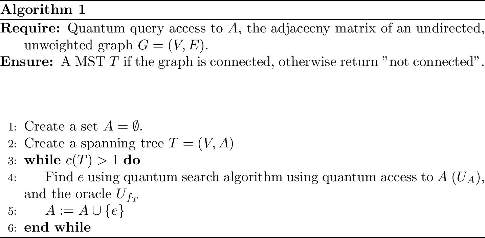

---
output:
  pdf_document: default
  html_document: default
---


# Quantum algorithms for graph problems 

Many real world problems can be modeled using graph theory which is the mathematical study of **graphs** that are constructed using nodes (sometimes called vertices), connected by edges.  

Several quantum algorithms are introduced by [@durr2006quantum] to solve problems in graph theory: MINIMUM SPANNING TREE, CONNECTIVITY, STRONG CONNECTIVITY, and SINGLE SOURCE SHORTEST PATH. Classically, these problems can be solved efficiently i.e. in polynomial number of queries. In this chapter, we will see how to decrease the query complexity of the algorithm by applying in a shrewd way amplitude amplification and related algorithms. 
More specifically, in the work of [@durr2006quantum], they used three different versions of the search algorithm. In particular, we state a slightly improved version here, with a quadratic improvement also in the runtime dependence on the probability of failure. 

```{theorem, grover-improved, name="Grover's search algorithm, version of [@buhrman1999bounds]"}
Let $N=2^n$ for $n>0$. 
Given quantum oracle access $O_x: \ket{i}\mapsto\ket{i}\ket{x_i}$ to a vector $x=(0,1)^{N}$ and access to an oracle $O_f \ket{x} = (-1)^{f(x)}\ket{x}$ for a function $f:(0,1)^{m} \mapsto (0,1)$, where $m$ is the element of the vector $x$ that is evaluated to $1$ (called marked elements), there is a quantum algorithm that succeed with probability greater than $1-\delta$ and finds the index of a marked element using $O_x$ only $O(\sqrt{N/m \log(1/\delta)})$ times. 
```

In fact, note that the "standard" version of bounding the probability of failure of a quantum or classical randomized algorithm consist in repeating the algorithm a certain number of time, and use the "powering lemma" \@ref(lem:powering-lemma). 

Further discussions of this subroutine can also be found in [@durr2006quantum] and also in [@dorn2008quantum]. 


The most famous problems in graph theory are the following: **Minimum Spanning Tree**, **Connectivity**, **Strong Connectivity** and **Single Sourced Shortest Path**, **Traveling salesman**, and many others. 

<!-- The problem of the minimum spanning tree problem is stated below.  -->

<!-- ```{definition, probminspantree, name="Minimum Spanning Tree"} -->
<!-- Given an undirected and weighted graph $G$ with $N$ vertices and its weighted matrix, we wish to find the edge set $E(G)$ of a minimum spanning tree of $G$ that has the smallest weight.  -->
<!-- ``` -->

<!-- Classically, this problem is solved Boruvka's algorithm [@de2019quantum, @bondy2008graphtheory]. This algorithm works because of a simple fact about connected graph as stated below. -->

<!-- ```{lemma, factingraphtheory, name="Fact in graph theory"} -->
<!-- Let $U ⊂ V$ be a set of vertices of a connected graph $G = (V,E)$ and let $e$ be a minimum weight edge of $(U × \bar U ∩ E$. Then there is a minimum spanning tree containing $e$. -->

<!-- ``` -->

<!-- ```{proof} -->
<!-- This proof requires to show there exists a spanning tree in graph $G$ such that it has minimum weight of all possible others. Firstly, the existence of a spanning tree in $G$ is clear because a connected graph automatically implies a spanning tree exists.  -->

<!-- We can prove the minimum weight edge $e$ is in the minimum spanning tree by contradiction. Assume that a minimum spanning tree does not contain $e$. This implies that $e$ must be connected to vertices that are not in $U$ so that $G$ is a disconnected graph. This is a contradiction because $G$ is already connected. Next, we need to show that there exists a minimum spanning tree contains the smallest weight. Assume all others edges in $G$ except $e$ has greater or equal weights. Because $e$ is the edge that has the minimal weight and a minimum spanning tree requires all vertices to be covered, there must be at least one spanning tree that uses $e$ as one of its edges. -->
<!-- ``` -->

<!-- ### The algorithm in the adjacency array model -->

<!-- ````{theorem, algo-mst, name="Quantum algorithm for minimum-spanning-tree"} -->
<!-- Assume to have query access to the adjacency matrix $M$ of an undirected graph $G=(V,E)$. Then the algorithm in \ref{fig:quantum-algo-mst} outputs the edge set of a minimum spanning tree of $G$ with probability at least $\frac{1}{4}. The algorithm uses $O(\sqrt{nm})$ in the array model and $O(n^{\frac{3}{2}})$ in the array model [@de2019quantum].  -->
<!-- ``` -->


<!-- ```{proof} -->

<!-- <!-- There are two inputs: the weighted matrix $\sum_{i = 0}^{i = 2m-1}\sum_{j = 0}^{j = N}{w_{ij}}$ and the list of outward edges of each vertex (the array model input) denoted as $e_{1} = {1, 2, ..., 2m-1}$. Recall we only encode the edges $2m -1$ times because each is encoded twice. In the paper, it applies two functions $f$ and $g$: --> 

<!-- <!-- $f(m) -> w_{m}$ (maps each edge to its corresponding weight)\\ --> 
<!-- <!-- $g(m) -> k $ (maps each edge to the spanning tree $T_{j}$ --> 

<!-- <!-- From the perspective of the initialization for Find Min, it means there will be two operators acting to form the initial state. Therefore, --> 

<!-- <!-- 1. Initialize:\\ --> 
<!-- <!-- $W|0> = \sum_{i = 0}^{2m-1}{|e_{i}, w_{i}>}$\\ --> 
<!-- <!-- $U|0> = \sum_{k = 1}^{N}|T_{j}>$ such that $|T_{j}>$ represents each spanning forest $T_{j}$\\ --> 

<!-- <!-- while: $i != N$ (it has not investigated all vertices of $G$) --> 

<!-- <!-- 2. Apply the Find Min subroutine using $\sum_{k = 1}^{N}|T_{j}>$ as input. Each iteration will find the smallest weighted edge for each vertex $i$ up until $N$ --> 

<!-- <!-- 3. Output the edge set $E$ of a minimum spanning tree --> 

<!-- <!-- ## How the Finding the Minimum subroutine is used in the Minimum Spanning Tree problem --> 

<!-- <!-- In the array model, suppose there are $m_{i}$ edges coming out for vertex $i$. For each increment of $l$, apply the operator $O_{i}$ from the oracle such that\\ --> 

<!-- <!-- $O_{i}|T_{j}> = \sum_{i = 1}^{k}{p_{i}|e_{i}>}$ where $p_{i}$ represents the probability amplitude such that $e_{i}$ is a minimum edge.  --> 

<!-- <!-- Apply "finding the minimum value algorithm" to find the smallest possible weighted edge $e_ij$ --> 

<!-- <!-- Interrupt the algorithm when it reaches $l = (l+2)c\sqrt{km}$ --> 


<!-- ``` -->


<!-- WHEN THE CODE OF LATEX WITH THE ALGORITHM IS READY AND COMPILED -->
<!-- ```{r, quantum-algo-mst, fig.cap="Algorithm for graph minimum spannig trees", echo=FALSE} -->
<!-- knitr::include_graphics("algpseudocode/quantum-mst") -->
<!-- ``` -->


<!-- WHEN THE CODE OF LATEX WITH THE ALGORITHM IS READY AND COMPILED -->
<!-- ```{r, quantum-algo-mst, fig.cap="Algorithm for graph minimum spannig trees", echo=FALSE} -->
<!-- knitr::include_graphics("algpseudocode/quantum-mst") -->
<!-- ``` -->


## Connectivity 

The problem of connectivity, as stated below as definition \@ref(def:problem-connectivity), is a special case of them minimum spanning tree problem such that all edges of $G$ carries equal weight.  

```{definition, problem-connectivity, name="GRAPH CONNECTIVITY problem"}
Given an undirected graph $G=(V,E)$, decide if $G$ is connected.
```


The following algorithm has first been proposed in [@durr2006quantum], and reelaborated in [@dorn2008quantum].


```{r, quantum-algo-connectivity, fig.cap="Algorithm for graph connectivity of undirected graph in the adjacecy model", echo=FALSE}

```


````{theorem, algo-connectivity, name="Quantum algorithm for graph conectivity (adjacency matrix model)"}
Assume that $U_A$ is a unitary that gives you query access to the adjacency matrix $M$ of an undirected graph $G=(V,E)$. Then, deciding if a graph is connected has an expected number of queries to $U_{A}$ of $O(n^{3/2})$. In particular, if the graph is connected, algorithm \@ref(fig:quantum-algo-connectivity) returns a spanning tree for $G$ with probability greater than $2/3$. 

```


```{proof}
The whole algorithm tries to build a spanning tree for the graph. If we succeed, then the graph is connected. The algorithm start by creating a data structure that holds $n$ different connected components, one for each vertex. Then, we construct a spanning tree by finding an edge that connects any two of the connected components. 

Initialize the algorithm with an empty edge set $A$ for the spanning tree $T=(V,A)$. We use theorem \@ref(thm:grover-improved) on the operator $U_A$ and the oracle $U_{f_T}$. As usual, $U_A$ is defined as $U_A : \ket{i,j,c} \mapsto \ket{i,j,c\oplus A_{ij}}$. We ecapsulate into the oracle $U_{f_T}$ the data structure that stores the connected components, so we can have a unitary implementing the function $f_T : E \mapsto \{0,1\}$:

$$ f_T(e) \begin{cases} 
      1 & \text{if } c(T \cup e) < c(T) \\
      0 & \text{otherwise}
      \end{cases}$$
Where $c(G)$ is the number of connected components of the graph $G$. It is basically a unitary that checks if a given edge has endpoints of 2 different connected component. Note that $U_{f_T}$ needs to compare a given edge with a whole list of edges that are currently in the list of connected components. Note that in order to work, this oracle should compare a given edge with the list of edges that are part of the spanning tree $T$. The spanning tree can grow up to size $O(n)$, so the depth of the oracle is at worst $O(n)$ (up to a polylogarithmic factors).


The runtime analysis is concluded by noting that we need to repeat the search procedure of theorem \@ref(thm:grover-improved) up to $n$ times (because when we obtain $n$ nodes in the MST we stop the algorithm). Suppose that the graph is connected. The main loop of the algorithm is repeated exactly $n-1$ times. Each search can be done in $O(\sqrt{n^2/k})$. where $k$ is the number of valid solutions to the search problem. These solutions correspond to the edges $e$ of $G$ that are connecting any two connected components. At the first iteration, we have at least $k=n-1$ solutions (i.e. any edge is a good solution), and the number decrease at each iteration. The number of queries is:
  
  $$\sum_{k=2}^n \sqrt{\frac{n^2}{(k-1)}}=O(n^{3/2})$$

  
If the graph is not connected, at some point we will not be able to find any new edges, and the procedure of theorem \@ref(thm:grover-improved) will fail (we can repeat this procedure a certain number of times to be sure that there are indeed no more valid edges, leveraging the powering lemma, i.e. lemma \@ref(lem:powering-lemma)).  

We need to set the failure probability of each run of theorem \@ref(thm:grover-improved). 
It is simple to check that if we want the probability of failure to be bounded by $2/3$ we need to se the probability of failure for a single run of the algorithm as $\delta \geq \frac{1}{3n}$. This is relatively simple to obatin from the union bound (see exercise \@ref(exr:example-algorithm-unionbound)).  

```

For the array model, we report the theorem of [@durr2006quantum]. 

````{theorem, algo-connectivity-array, name="Quantum algorithm for graph conectivity (array model)"}
Assume that $U_A$ is a unitary that gives you query access to the array model of an undirected graph $G=(V,E)$. Then, deciding if a graph is connected has an expected number of queries to $U_{M}$ of $O(n)$. In particular, algorithm \ref{fig:quantum-algo-connectivity} returns a spanning tree for $G$ if $G$ is connected, otherwise runs forever.
```


## Conclusions

A summary of the query complexities is stated below. 


Problem  | Adj. Matrix | Array 
------------- | ------------- | -------------
Minimum Spanning Tree  | $O(n^{3/2})$   | $O(\sqrt{nm})$
Connectivity  | $O(n^{3/2})$  | $O(n)$
Strong Connectivity  | $O(n^{3/2})$   | $\Omega(\sqrt{nm})$, $O(\sqrt{nmlog(n)})$
Single Sourced Shortest Path  |$\Omega(n^{3/2})$, $O(n^{3/2}log^{2}(n))$ | $\Omega(\sqrt{nm}log^{2}(n))$, $O(\sqrt{nm})$


<!-- # Extra -->

<!-- $sum(n/sqrt(k-1) = n + n/sqrt(2) + ... + n/sqrt(n-1)$ Because n and k must be positive numbers, we will have the following argument:$n + n/sqrt(2) + ... + n/sqrt(n-1) > 0$ -->
<!-- $nsqrt(n-1) + nsqrt(n-1)/sqrt(2) + ... + n > 0$ (multiply both sides by sqrt(n-1), this is valid because sqrt(n-1) > 0 )Now, notice the biggest term in this series is $nsqrt(n-1)$. In the big-oh notation type of proof, we only consider the largest term. We will then have the following argument:nsqrt(n-1) < nsqrt(n) = n^(3/2)Therefore, this series is in the order of $O(n^{3/2})$ -->