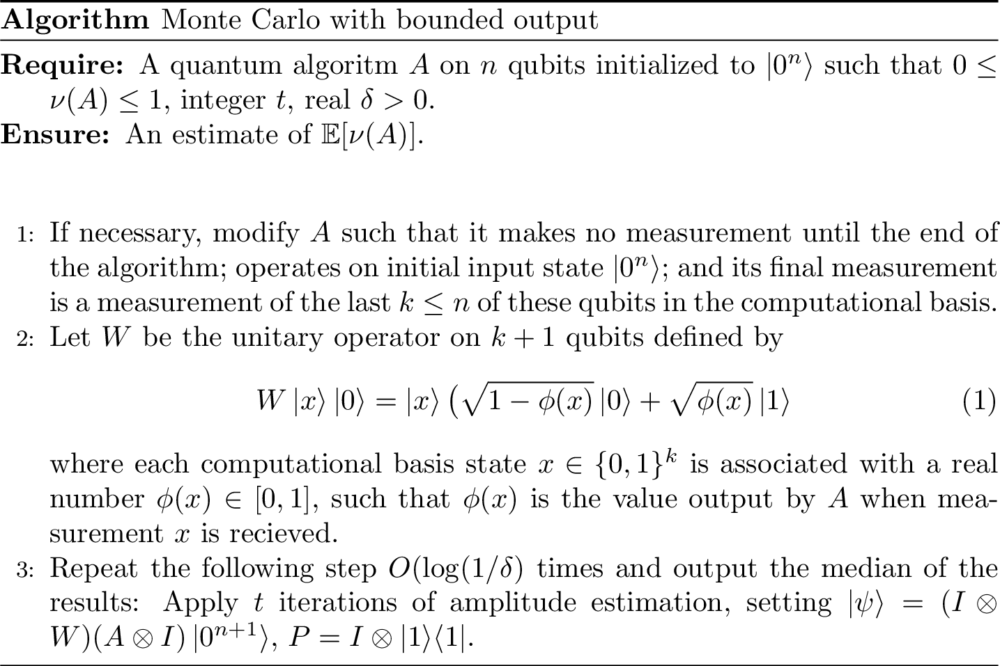
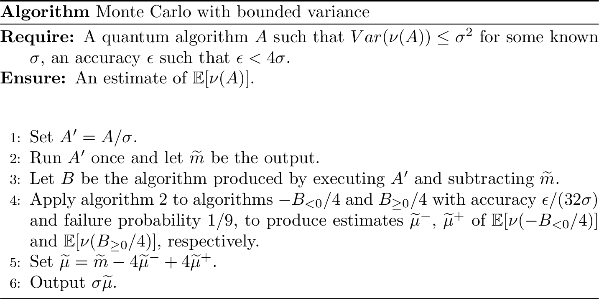

# Quantum algorithms for Monte Carlo {#chap-montecarlo}

<div style="text-align: right"> Contributors: Michele Vischi, Alessandro Luongo </div>
<br>

In this chapter we focus on how quantum computing speeds up classical Monte Carlo techniques. 
Monte Carlo methods are ubiquitous across science and find many broad applications such as 
the evaluation of integrals and many more specific applications such as the pricing of financial derivatives, the computation of distances among probability distributions and so on. 
The essence of Monte Carlo methods is to estimate some expected value of a function $f$ of one (or more) random variable $X$, $\mathbb{E}[f(X)]$.
As already discussed in chapter \@ref(chap-classical-data-quantum-computers), in the quantum setting, one needs a procedure to load data on quantum registers. In solving Monte Carlo problems, one needs access to the probability distributions pertaining to the random variables. In this chapter we will usually implicitly assume to have quantum query or oracle access to functions \@ref(def:quantum-oracle-access). We will try to state clearly whenever it is not the case or whenever we need more specific quantum access such as \@ref(def:KP-trees).

In the first part of the chapter we review the work done on the quantum speedup of Monte Carlo techniques found in this paper [@montanaro2015quantum]. Previous works (upon which [@montanaro2015quantum] is based) on the same topic can be found in [@brassard2011optimal], [@wocjan2009quantum] and [@heinrich2002quantum].
In reviewing the paper, we will focus on the most important conceptual steps, while also presenting the statements of the main theorems. 
In the second part of the chapter, we present some of the most appealing applications of Monte Carlo quantum speedup, such as option pricing [@rebentrost2018quantumfd] and the estimation of the total variation distance between probability distributions [@montanaro2015quantum]. 
Our main contributions are the statements of the theorems that allow for quantum speedup in both the option pricing and the total variation distance problems.

**Notation**
We recap the notation that we will be using in the following.
As already mentioned, the main goal of [Monte Carlo](https://www.youtube.com/watch?v=QNkfYM9qIO4) methods is to estimate the expected value $\mu$ of a randomized algorithm $A$. The idea is that we have a random variable $X$ taking values in a subset $\chi$ of $\mathbb{R}^d$, for some dimension $d$. The random variable $X$ has probability density $f$ and typically there is a function $\Phi: \chi \to \mathbb{R}_+$. Monte Carlo methods want to approximate:
\begin{equation}
    \mu = \mathbb{E}[\Phi(X)] = \int_{\chi}\Phi(x)f(x)dx
\end{equation}
They do so by producing an appropriate number $N$ of i.i.d. samples, each corresponding to an independent execution of $A$. The sample mean $\widetilde{\mu}$ is then used as an approximation of $\mu$.

We now give a general definition for the sample mean. We will use the symbol $\widetilde{\mu}$, which should not be confused with the above sample mean pertaining to the algorithm $A$.
In general, for some random variable $X_i$, for $i=1,\dots,N$ the sample mean is defined as [@MonteCarlonotes]:
\begin{equation}
    \widetilde{\mu}_N= \frac{1}{N}\sum_{i=1}^N X_i\, .
\end{equation}
The $\widetilde{\mu}_N$ is a linear combination of the random variables $X_i$, and so it is itself a random variable. In the language of statistics, the $\widetilde{\mu}_N$ is called an estimator.
Note that:

- we do not know how many samples $N$ we need to get a good estimate of $\mu$;
- even worse, we still don't know whether this procedure leads to a good estimate of $\mu$;
- if the estimate is good for some $N$ we don't know how much good it is.

  Two fundamental theorems in probability theory help the way out.
  The law of large numbers ensures that the sample mean $\widetilde{\mu}_N$ is a good approximation of $\mu$ for large enough $N$, while the central limit theorem states how close is $\widetilde{\mu}_N$ to $\mu$ for a given value of $N$.


```{theorem, law-large-numbers, name="Law of large numbers"}
Let $X_1,\dots,X_N$ be independent and identically distributed random variables. Assume that their expected value is finite and call it $\mu$.
Then, as $N$ tends to infinity:
\begin{equation}\label{media}
    \widetilde{\mu}_N = \frac{1}{N}\sum_{i=1}^N X_i \to \mu, \, (a.s),
\end{equation} 
which means that:
\begin{equation}
    P\left(\lim_{n\to\infty} \frac{1}{N}\sum_{k=1}^N X_k = \mu\right) = 1\, .
\end{equation}
```

Note that since all the $X_i$ random variables have expected value $\mu$ the expected value of the sample mean $\widetilde{\mu}_N$ is:
\begin{equation}
    \mathbb{E}[\widetilde{\mu}_N]=\frac{1}{N}\mathbb{E}[X_1+\dots+X_N] = \frac{1}{N}N\mu = \mu \, .
\end{equation}
When this happens we say that $\widetilde{\mu}_N$ is an unbiased estimator of $\mu$.
The law of large numbers tells us that $\widetilde{\mu}_N$ converges to $\mu$ for $N$ going to infinity. However in a computation we can not have $N$ going to infinity: we must choose a (eventually large but) finite $N$. How close is $\widetilde{\mu}_N$ to $\mu$ for a given value of $N$? The law of large numbers does not reply to that question [@MonteCarlonotes]. To get a first answer,  suppose that $X_i$ have finite variance and call it $\sigma^2$. The variance of the sample mean is then:
\begin{equation}
    var(\widetilde{\mu}_N) = \frac{1}{N^2} var(X_1+\dots+X_N) = \frac{1}{N^2}N\sigma^2 = \frac{\sigma^2}{N}\, .
\end{equation}
This shows that the difference of $\widetilde{\mu}_N$ from $\mu$ should be of order $\sigma/\sqrt{N}$ [@MonteCarlonotes]. 
The central limit theorem gives a more refined statement on the accuracy of the approximation [@MonteCarlonotes].

```{theorem, central-limit, name="Central limit theorem"} 
Let $X_i$ be a sequence of independent and identically distributed random variables, such that they have finite mean $\mu$ and finite variance $\sigma^2$. The random variable:
\begin{equation}
    \frac{1}{\sigma\sqrt{N}}\sum_{i=1}^N(X_i-\mu)
\end{equation}
converges in distribution to a standard normal random variable. This means that:
\begin{equation}
    \lim_{n\to\infty} P(a\le \frac{1}{\sigma\sqrt{N}}\sum_{k=1}^N(X_k-\mu) \le b) = \int_{a}^{b}\frac{1}{\sqrt{2\pi}}e^{-x^2/2}\, dx \, .
\end{equation}
```

The central limit theorem can be used to construct confidence intervals for our estimate $\widetilde{\mu}$, indeed the probability to estimate $\mu$ up to additive error $\epsilon$ is:
\begin{align}
    P(-\epsilon \le \widetilde{\mu}-\mu\le \epsilon) & = P\bigg(-\frac{\epsilon\sqrt{N}}{\sigma}\le \frac{(\widetilde{\mu}-\mu)\sqrt{N}}{\sigma}\le \frac{\epsilon\sqrt{N}}{\sigma} \bigg)\\&  \approx P(-\frac{\epsilon\sqrt{N}}{\sigma}\le Z \le \frac{\epsilon\sqrt{N}}{\sigma})\, ,
      (\#eq:cltconfidence)
\end{align}
where $Z$ is a standard normal random variable.
We can find values of $N$ such that the probability to have a good estimate $\widetilde{\mu}_N$ up to fixed additive error $\epsilon$ is almost 1. Usual values for this probability are $95\%$ or $99\%$. So for example if we want $P(-z_c\le Z \le z_c) = 0.99$ where $z_c = \epsilon\sqrt{N}/\sigma$ then $z_c =\epsilon\sqrt{N}/\sigma= 2.58$ because of the properties of the normal distribution. Estimating $\mu$ with additive error $\epsilon$ would require $N = 6.6564\, \sigma^2/\epsilon^2$ samples.

You can feel the power of Monte Carlo!! All of the above does not depend on the dimension of the sample space of the random variables $X_i$, but just on the number of repetitions $N$ and on the variance $\sigma^2$.

This is amazing at first sight but we want to make two remarks.
First note we don't know the value $\mu$ because we are trying to estimate it. How can we then know the value of $\sigma^2$, and use it to construct the confidence intervals?
To address this problem we use another estimator: the sample variance. It is defined as:
\begin{equation}
    s^2 = \frac{1}{N-1}\sum_{k=1}^N(X_i-\widetilde{\mu})^2
\end{equation}
where the prefactor is chosen in such a way so that $\mathbb{E}[s^2]=\sigma^2$, i.e. $s^2$ is an unbiased estimator.
One can prove that confidence intervals for $\mu$ can be built as above but with $\sigma$ replaced by $s$ [@MonteCarlonotes].

Second we highlight the main flaw of the Monte Carlo procedure. 
We saw that estimating $\mu$ up to additive error $\epsilon$ with $99\%$ success probability requires $n = O(\sigma^2/\epsilon^2)$ repetitions, independently on the dimension of the sample space. This is remarkable but not so efficient. It means that if we want to maintain the confidence at $99\%$ and we want to decrease the additive error $\epsilon$ by a factor of $10$ we need to increase the number of iteration by a factor of $10^2$.
Imagine if we want to estimate $\mu$ up to four digits. We would need to run $A$ more than $100$ million times [@montanaro2015quantum].


## Monte Carlo with quantum computing
Here is where quantum computing comes to help. The number of uses of $A$ can be reduced almost quadratically beyond the classical bound [@montanaro2015quantum]. The result is based on amplitude estimation.

We first show the quadratic advantage for an algorithm $A$ whose output is bounded between 0 and 1. This speedup will be smartly used to speedup more general classes of algorithms. This section is also meant to give insights on why quantum speedup happens in the first place.

Now we will make use of the notation introduced at the beginning of the chapter.
Without loss of generality, we assume that $A$ is a quantum algorithm operated on an $n$ qubit quantum register, whose initial state is the $\ket{0^{\otimes n}}$ state. We assume that $A$ makes no measurements until the end of the algorithm, when $k \leq n$ qubits are measured in the computational basis. The outcome of the measurement $x \in \{0,1\}^k$ is then plugged in a function $\Phi :\{0,1\}^k \to [0,1]$. We call $\nu(A)$ the random variable representing the output of $A$. Our aim is to find an estimate of $\mathbb{E}[\nu(A)]$. As usual, we also assume to have access to the inverse of the unitary part of the algorithm\footnote{This is needed to run amplitude estimation}, which we write as $A^{-1}$.

<!-- QUI ANCORA CASO GENERALE, QUINDI NON TRA 0 E 1.  -->

The algorithm $A$, as a classical randomized algorithm, is built in such a way that when we run it k times, we get some random $\Phi(x_1),\dots, \Phi(x_k)$ with probabilities $|\alpha_{x_i}|^2$ (for some, in general, complex $\alpha_{x_i}$).

<!-- $A\ket{0} = \sum_{i \in \Omega} \sqrt{p_i}\ket{i} =\sum_{i \in \{0,1\}^n}  \sqrt{p_i}\ket{i}$ -->

That is to say values of the random variable $\nu(A)$ are distributed according to the probabilities $p_x = |\alpha_x|^2$. We will see that with quantum computers, there is a smarter way to estimate $\mathbb{E}[\nu(A)]$, instead of repeatedly sampling from $A$? Using a quantum computer we can assume that $A$ is now a quantum algorithm (by taking the classical circuit, making it reversible, and then obtaining a quantum circuit for it). Then, we can use various tricks to encode the value of $\nu(A)$ in the amplitude of a quantum register, and then estimate it using amplitude estimation. 

## Bounded output

In this section we will show a direct application of the amplitude estimation theorem, and we will formulate everything using the notation found in [@montanaro2015quantum].
The procedure when the output of $A$ is bounded between $0$ and $1$ is the following. Instead of doing the measurement at the end of the circuit, we add an ancillary qubit and perform the unitary operation $W$ on $k+1$ qubits defined as follows:
\begin{equation}
    W|x\rangle|0\rangle = |x\rangle(\sqrt{1-\Phi(x)}|0\rangle+\sqrt{\Phi(x)}|1\rangle)
\end{equation}

<!-- SISTEMARE DA QUI -->
This is a controlled operation which in general requires to first encode $\Phi(x)$ in a register. This is done by performing $k$ subsequent controlled rotations for some specific angle on the $k+1$th qubit for each of the $k$ controlling qubits. Then it is easy to rotate back the $k$ register to $\ket{x}$ (more on this can be found in [@duan2020survey]).
<!-- A QUI. --> 

Assuming that we know how to do $W$, when $A$ is run with its final measurement replaced with operation $W$, we would formally end up in a state of the form:
\begin{equation}
    |\psi\rangle=(I \otimes W)(A\otimes I)|0^n\rangle|0\rangle=\sum_x \alpha_x|\psi_x\rangle|x\rangle(\sqrt{1-\Phi(x)}|0\rangle+\sqrt{\Phi(x)}|1\rangle)\, . (\#eq:psistate)
\end{equation}
Why is this state useful? 

When the sum over $x$ is developed, it turns out that $|\psi\rangle$ is such that it can be viewed as a superposition of two orthogonal states. A "good" state, $|\Psi_G\rangle$ which is a superposition of all the states in the expansion whose qubit sequence ends up with a $1$ (i.e. the ancilla qubit is in state $\ket{1}$ and a "bad" state $|\Psi_B\rangle$, which is a superposition of all the other states. Unfortunately there is no ugly state, otherwise we would have been screening a spaghetti western cult.
The good and bad states are orthogonal to each other and thus they can be viewed as spanning two orthogonal sub-spaces in the Hilbert space, which without fantasy we'll call good and bad sub-spaces.

Projecting $|\psi\rangle$ onto the good subspace is equivalent to find the amplitude of the good state, which for construction is the expected value of $\nu(A)$ (exaclty what we wanted!!). Indeed calling $P$ the projector onto the good subspace, which is in our case $P= I \otimes |1\rangle\langle 1|$, we have that:
\begin{equation}
\langle \psi|P|\psi\rangle = \sum_x |\alpha_x|^2\Phi(x) =\mathbb{E}[\nu(A)]\,.
\end{equation}

Notice that the bound on the output of $A$ between $0$ and $1$ and the form of the operation $W$ leads to a normalized state $|\psi\rangle$. This means that we can write:
\begin{equation}
    |\psi\rangle = \sin{\theta}|\Psi_G\rangle + \cos{\theta}|\Psi_B\rangle
    \end{equation}
for some angle $\theta$. We can restate our problem as follows: we want to estimate the amplitude squared of the good state, i.e. $\sin^2(\theta)$. Indeed we created a circuit that create a state where the expected value of $\nu(A)$ is now encoded in that amplitude of the quantum state, more specifically it is encoded in the probability of measuring $1$ in an ancilla qubit. The latter is estimated with amplitude estimation, see theorem \@ref(thm:thm-ampest-orig). This algorithm actually returns an estimate of the angle $\theta$ for which we can derive an estimate of $\sin^2(\theta)$, which in turns return the expectation of the random variable $\mathbb{E}[\nu(A)]$. 


Let's recap how to use this algorithm. Amplitude estimation takes as input a unitary operator on $n+1$ qubits such that:
\begin{equation}
    |\psi\rangle = \sqrt{1-a}|\Psi_B\rangle\ket{0} + \sqrt{a}|\Psi_G\rangle\ket{1}
    \end{equation}
The final qubit acts as a label to distinguish good states from bad states.

Then it applies for a number of times $t$ the following sequence of projections: first apply $V=I-2P$ where $P$ is some projector and then $U=2|\psi\rangle\langle\psi|-I$. The form of $P$ depends in general on the good state (in our case $P = I\otimes |1\rangle\langle 1|$). The projector $U$ could be seen as a reflection through $|\psi\rangle$ and $V$ as a reflection through the bad state $|\Psi_B\rangle$ in a plane spanned by the good and the bad states [@DeWolf]. The output of amplitude estimation is an estimate $\widetilde{a}$ of $a = \langle \psi|P|\psi\rangle = \sin^2(\theta)$.

$U$ can also be written as $AS_0A^{-1}$ where $S_0$ changes the phase from $+1$ to $-1$ of all the basis states but the $|0^n\rangle$ state. This is why before we required to have access to the inverse of $A$.
$V$ is instead the operation of changing the phase of all the basis states of the good sub-space from $+1$ to $-1$.
This operation is usually done by setting a target qubit to $1/\sqrt{2}(|0\rangle-|1\rangle)$ as we have:
\begin{equation}
    U_f |x\rangle1/\sqrt{2}\bigg(\frac{|0\rangle-|1\rangle}{\sqrt{2}}\bigg) = (-1)^{f(x)}|x\rangle\bigg(\frac{|0\rangle-|1\rangle}{\sqrt{2}}\bigg)
\end{equation}
for any function $f(x)$ with binary values $0$ or $1$. The target qubit will always be just one and applying $U_f$ is an eigenstate. So we can ignore its presence and consider $U_f$ as acting only on the first register.
<!-- A QUI  -->

<!-- %Monte Carlo methods approximate expectations of functions of random variables f(X). X is distributed according to some probability distribution p. If we calculate the expected value through the sample mean for a number of times and we compute the expected value of the result, we will get the expected value of f(X). -->
<!-- %The sample mean converges in probability to the expected value of f(X). Monte Carlo estimator are unbiased and consistent -->
<!-- ALE BETTER, CITATION MISSING..  -->

<!-- . The variance of the sample mean 1/n times the variance of f(X). The variance of f(X) is a constant. We need to assume that the variance is finite for the consistency property (Weak law of large number). -->

<!-- %The f(X) is a one dimensional quantity so the approximation is valid also for high dimensional X. -->

<!-- %Where to apply MonteCarlo: approximate the number pi.  -->

<!-- %Area of geometrical figures  -->

<!-- \textbf{Powering Lemma} -->
<!-- Let $M$ be a classical or quantum algorithm which aims to estimate some quantity $\mu$, and whose output $\widetilde{\mu}$ satisfies $|\mu-\widetilde{\mu}\le \epsilon$ except with probability $\gamma$, for some fixed $\gamma < 1/2$. Then, for any $\delta > 0$, it suffices to repeat $M$ $O(\log(1/\delta))$ times and take the median to obtain an estimate which is accurate to within $\epsilon$ with probability at least $1-\delta$. -->


<!-- BASTA CHE LO CITI... -->
<!-- \textbf{Amplitude Estimation} There is a quantum algorithm called amplitude estimation which takes as input one copy of a quantum state $|\psi\rangle$, a unitary transformation $U=2|\psi\rangle\langle\psi|-I$, a unitary transformation $V= I-2P$ for some projector $P$, and an integer $t$. The algorithm outputs $\widetilde{a}$, an estimate of $a = \langle \psi|P|\psi\rangle$, such that: -->
<!-- \begin{equation} -->
<!--     |\widetilde{a}-a|\le 2\pi \frac{\sqrt{a(1-a)}}{t}+\frac{\pi^2}{t^2} -->
<!-- \end{equation} -->
<!-- with probability at least $8/\pi^2$, using $U$ and $V$ $t$ times each. -->
<!-- The success probability $8/\pi^2$ is improved to $1-\delta$ for any $\delta>0$ using the powering lemma at the cost of an $O(\log(1/\delta)$ multiplicative factor. -->


We are then ready to state the quantum algorithm to estimate $\mathbb{E}[\nu(A)]$ when the output of $A$ is bounded between $0$ and $1$.
```{r, quantum-montecarlo-01, fig.cap="Quantum algorithm for Monte Carlo (bounded variables). A makes no measurement until the end of the algorithm and its final measurement is a measurement of the last k qubits in the computational basis.", echo=FALSE} 

```


Applying amplitude estimation together with the powering lemma \@ref(lem:powering-lemma), one can prove the following theorem valid for algorithm \@ref(fig:quantum-montecarlo-01).

```{theorem, quantumbounded01, name="Quantum Monte Carlo with bounded output"}
Let $|\psi\rangle$ as in Eq.\@ref(eq:psistate) and set $U=2|\psi\rangle\langle\psi|-I$. Algorithm in figure \@ref(fig:quantum-montecarlo-01) uses $O(\log(1/\delta))$ copies of $|\psi\rangle = A|0^n\rangle$, uses $U$ $O(t\log(1/\delta))$ times, and outputs an estimate $\widetilde{\mu}$ such that 
\begin{equation*}
|\widetilde{\mu}-\mathbb{E}[\nu(A)]|\leq C\bigg(\frac{\sqrt{\mathbb{E}[\nu(A)]}}{t}+\frac{1}{t^2}\bigg)
\end{equation*}
with probability at least $1-\delta$, where $C$ is a universal constant. In particular for any fixed $\delta>0$ and any $\epsilon$ such that $0\leq \epsilon \leq 1$, to produce an estimate $\widetilde{\mu}$ such that with probability at least $1-\delta$, $|\widetilde{\mu}-\mathbb{E}[\nu(A)]|\leq \epsilon\mathbb{E}[\nu(A)]$ it suffices to take $t=O(1/(\epsilon\sqrt{\mathbb{E}[\nu(A)]}))$. To achieve  $|\widetilde{\mu}-\mathbb{E}[\nu(A)]|\leq \epsilon$ with probability at least $1-\delta$ it suffices to take $t=O(1/\epsilon)$.
```

We already described the main idea to get quantum speedup: encode the expected value of $\nu(A)$ in a suitably defined amplitude of the quantum register and then estimate it. The error bound of theorem \@ref(thm:quantumbounded01) is the error bound of the amplitude estimation algorithm \@ref(thm:thm-ampest-orig). The same applies to the success probability which, in this \@ref(thm:thm-ampest-orig) formulation of the amplitude estimation theorem, is $8/\pi^2$. This can be improved to $1-\delta$ with the powering lemma \@ref(lem:powering-lemma). That is why, for example, $U$ is used $O(t\log(1/\delta))$ times: $t$ times by amplitude estimation which is repeated $\log(1/\delta)$ to apply the powering lemma. To get the absolute error to $\epsilon$ we just need to set $t=O(1/\epsilon)$, and to obtain a relative error we set $t=O(1/(\epsilon\sqrt{\mathbb{E}[\nu(A)]}))$. 


## Bounded $\ell_2$ norm

The algorithm described by theorem \@ref(thm:quantumbounded01) is limited by the requirement of having an output value bounded between $0$ and $1$. We want more. We want a quantum algorithm to compute the expected value of any random variable. We start by relaxing the requirement of having bounded output, and just requiring bounded $\ell_2$ norm.

To arrive at this result, the first step is to show quantum speedup for the class of algorithms whose output value is positive and has bounded $l_2$ norm. This means that there is a bound on $\|\nu(A)\|_2 = \sqrt{\mathbb{E}[\nu(A)^2]}$. 
The key idea is the following: given an algorithm $A$ belonging to this class, we consider its possible output value as the sum of numbers belonging to intervals of the type $[0,1)$, $[1,2)$, $[2,4)$, $[4,8)$ and so on. Notice that besides the first interval ($[0,1]$), all the others can be compactly written as $[2^{l-1},2^{l}]$ for $l=1,...,k$. If we divide all of these intervals by $2^l$ we would get $k$ intervals bounded between $0$ and $1$ (actually $1/2$ and $1$). In this way we can apply algorithm \@ref(thm:quantumbounded01) for the interval $[0,1]$ and for all these other $k$ intervals. If we multiply each of the $k$ estimates we get by $2^l$ (for $l=1,...,k$ ) and add them together with the estimate for the $[0,1]$ interval, we would get an estimate for $\mathbb{E}[\nu(A)]$.

You may have noticed that the index $l$ goes from $1$ to $k$ and wondered what is this $k$? If not, we wonder for you. Set for example $k=2$ and imagine that the expected value of the algorithm is $16$. Surely we can not obtain $16$ as a sum of three numbers in the intervals $[0,1]$, $[1,2]$, $[2,4]$. So how must $k$ be chosen? And even if $k$ is chosen properly, how we can be sure that what is left in this approximation is negligible? We will see in a moment that assuming a bound on the $l_2$ norm of $\nu(A)$ gives us a way to solve this problem elegantly.

Before going on, we introduce a useful notation. Given any algorithm $A$ we write as $A_{<x}$, $A_{x,y}$, $A_{\geq y}$ the algorithms defined by executing $A$ to produce a value $\nu(A)$ and:

 - $A_{<x}$: if $\nu(A)<x$, output $\nu(A)$ otherwise output 0;
 - $A_{x,y}$: if $x\leq\nu(A)<y$, output $\nu(A)$ otherwise output 0;
 - $A_{\geq y}$: if $\nu(A)\geq y$, output $\nu(A)$ otherwise output 0.

Moreover whenever we have an algorithm $A$ and a function $f:\mathbb{R}\to\mathbb{R}$, we write as $f(A)$ the algorithm produced by evaluating $\nu(A)$ and then computing $f(\nu(A))$.

We can now state the second quantum algorithm which estimates the mean value of $\nu(A)$ with bounded $\ell_2$ norm.

 
```{r, quantum-montecarlo-bounded-norm, fig.cap="Quantum algorithm for Monte Carlo (bounded l2 norm)", echo=FALSE}
knitr::include_graphics("algpseudocode/quantum-montecarlo-bounded-norm.png")
```

One can prove the following theorem.

::: {.theorem #quantum-monte-carlo-boundedl2 name="Quantum algorithms with bounded l2 norm"}
Let $|\psi\rangle$ as in Eq.\@ref(eq:psistate), $U = |\psi\rangle\langle \psi|-1$. Algorithm in figure \@ref(fig:quantum-montecarlo-bounded-norm) uses $O(\log(1/\epsilon)\log\log(1/\epsilon))$ copies of $|\psi\rangle$, uses $U$ $O((1/\epsilon)\log^{3/2}(1/\epsilon)\log\log(1/\epsilon))$ times, and estimates $\mathbb{E}[\nu(A)]$ up to additive error $\epsilon(||\nu(A)||+1)^2$ with probability at least $4/5$.
:::

We will give here a sketch of the proof for this theorem. The curious can check it on [@montanaro2015quantum]. The resource bounds follow from the resource bounds of algorithm \@ref(thm:quantumbounded01), multiplied by the number of times we use it. Indeed $\delta =\Omega(1/log(1/\epsilon))$ and we are using algorithm \@ref(thm:quantumbounded01) $O(\log(1/\epsilon))$ times. So the overall number of copies of $\ket{\psi}$ in all of the uses of algorithm \@ref(thm:quantumbounded01) is $O(\log(1/\epsilon)\log\log(1/\epsilon))$ and the total number of uses of $U$ is $O((1/\epsilon)\log^{3/2}(1/\epsilon)\log\log(1/\epsilon))$.

To estimate the total error (supposing that every use of algorithm in theorem \@ref(thm:quantumbounded01) succeed) we write:
\begin{equation}
\mathbb{E}[\nu(A)] = \mathbb[\nu(A_{0,1})]+\sum_{l=1}^k 2^l \mathbb{E}[\nu(A_{2^{l-1},2^l})/2^l]+\mathbb{E}[\nu(A_{\geq 2^k})]\, .
\end{equation}

Now substituting this expression in the one for the error and using the triangle inequality we have that:
\begin{equation}
|\widetilde{\mu}-\mathbb{E}[\nu(A)]|\leq |\widetilde{\mu}_0-\mathbb{E}[\nu(A_{0,1})]|+\sum_{l=1}^k 2^l|\widetilde{\mu}_l-\mathbb{E}[\nu(A_{2^{l-1},2^l})/2^l]|+\mathbb{E}[\nu(A_{\geq 2^k})]\, .
\end{equation}

You can see that the last term is a term that we did not estimate with \@ref(thm:quantumbounded01). This is exactly the leftover we were talking about some lines above. What the last equation says is that when choosing $k$ as in algorithm \@ref(fig:quantum-montecarlo-bounded-norm), this term is bounded by the $l_2$ norm squared of $\nu(A)$. Indeed denoting with $p(x)$ the probability that $A$ outputs $x$ we have that:
\begin{equation}
\mathbb{E}[\nu(A_{\geq 2^k})]= \sum_{x\geq 2^k}p(x)x \leq \frac{1}{2^k}\sum_x p(x)x^2 = \frac{\|\nu(A)\|^2}{2^k}, .
\end{equation}

Getting the error bound of theorem \@ref(thm:quantum-monte-carlo-boundedl2) is not really interesting from the conceptual point of view. It is just a matter of math and the usage of previous results. 
Indeed, using the error bound obtained for algorithm in theorem  \@ref(thm:quantumbounded01) for $|\widetilde{\mu}_0-\mathbb{E}[\nu(A_{0,1})]|$ and all the $|\widetilde{\mu}_l-\mathbb{E}[\nu(A_{2^{l-1},2^l})/2^l]|$, Cauchy-Schwartz, and other techqnieus ( refer to [@montanaro2015quantum] for the full calculations), one could finally write that:
\begin{equation}
|\widetilde{\mu}-\mathbb{E}[\nu(A)]|= \epsilon\bigg(\frac{C}{D}\bigg(1+\frac{5}{D}+2||\nu(A)||_2\bigg) +||\nu(A)||^2_2\bigg)
\end{equation}
which for a sufficiently large constant $D$ is upper bounded by $\epsilon(||\nu(A)||_2+1)^2$. Here $C$ another constant that comes from the error bound of algorithm of theorem \@ref(thm:quantumbounded01), wich in turns comes from the constant factors of amplitude estimation. 

Finally we comment on the success probability: it is at least $4/5$, when one uses the union bound, i.e. theorem \@ref(thm:unionbound) on the success probability of all the uses of theorem \@ref(thm:quantumbounded01). Note that we can exploit the powering lemma to increase this success probability up to $1-\delta$ for any $\delta$, by repeating this algorithm $O(\log(1/\delta)$ times and taking the median.


## Bounded variance
We are ready to demonstrate quantum speedup for the most general case: algorithms whose random output have bounded variance. In this case one obtains quantum speedup combining the classical Chebyeshev inequality and the use of quantum speedup of algorithm \@ref(fig:quantum-montecarlo-bounded-norm).
For clarity, we recall that the bound on the variance of $\nu(A)$ means that $Var(\nu(A))= \mathbb{E}[\left(\nu(A)-\mathbb{E}[\nu(A)]\right)^2]\leq \sigma^2$.

To get to our desired result, we will also need to scale and shift the random variables of interest.
Starting with a random variable $X$ distributed according to some distribution with mean $\mu_x$ and standard deviation $\sigma_x$, whenever we scale the random variable by a factor $\lambda$, we obtain a random variable $Z = \lambda X$ with a new distribution with mean $\mu_z=\lambda\mu_x$ and standard deviation $\sigma_z= \lambda\sigma_x$.
When we shift the random variable by a scalar $k$, we obtain a random variable $Z= X+k$ with a new distribution with mean $\mu_z=\mu_x+k$ and standard deviation $\sigma_z = \sigma_x$.

The first step of our algorithm is to run the algorithm $A'=A/\sigma$ obtained by scaling $A$ with $\lambda = 1/\sigma$. For what we said above $\nu(A')$ will be a random variable with mean and standard deviation bounded by $\mu' \leq \mu/\sigma$ and $\sigma' \leq 1$ respectively. Having a standard deviation of order unity means that the output $\widetilde{m}$ of a run of algorithm $A'$ is with high probability pretty close to the actual mean $\mu'$. This is because of Chebyeshev inequality, i.e. theorem  \@ref(thm:chebyshev):

\begin{equation}
P(|\nu(A')-\mu'|\geq 3) \leq \frac{1}{9}\, .
\end{equation}
Therefore we can assume with high confidence that $|\widetilde{m}-\mu'|\leq 3$.
The second step is to consider algorithm $B$, which is produced by executing $A'$ and shift it by subtracting $\widetilde{m}$. 
The random variable $\nu(B)$ has a bound on the $\ell_2$ norm. Indeed:
\begin{equation}
\begin{split}
||\nu(B)||_2 &= \mathbb{E}[\nu(B)^2]^{1/2}=\mathbb{E}[((\nu(A')-\mu')+(\mu'-\widetilde{m}))^2]^{1/2}\\
&\leq \mathbb{E}[(\nu(A')-\mu')^2]^{1/2}+\mathbb{E}[(\mu'-\widetilde{m})^2]^{1/2} = \sigma'+\mathbb{E}[(\mu'-\widetilde{m})^2]^{1/2}\leq 4 \\
\end{split}
\end{equation}
This bound can also be stated as $||\nu(B)/4||_2 \leq 1$.

This means that the expected value of $\nu(B)/4$ could be estimated with algorithm \@ref(fig:quantum-montecarlo-bounded-norm). Actually algorithm \@ref(fig:quantum-montecarlo-bounded-norm) also requires a positive $\nu(B)\geq 0$. We will estimate $\mathbb{E}[\nu(B_{\geq 0})/4]$ and $\mathbb{E}[\nu(-B_{< 0})/4]$ using algorithm \@ref(fig:quantum-montecarlo-bounded-norm) with accuracy $\epsilon/(32\sigma)$ and failure probability $1/9$. Notice that both $\nu(B_{\geq 0})/4$ and $\nu(-B_{\leq 0})/4$ are positive and the bound $||\nu(B)/4||_2\leq 1$ implies $||\nu(B_{<0})/4||_2\leq 1$ and $||\nu(B_{\geq 0})/4||_2\leq 1$.

```{r, quantum-montecarlo-bounded-var, fig.cap="Quantum algorithm for Monte Carlo with bounded variance (absolute error)", echo=FALSE}

```
This algorithm has a quadratic speedup over the classical Monte Carlo method.

```{theorem, quantum-monte-carlo-variance1, name="Quantum Monte Carlo with bounded variance - additive error"}
Let $|\psi\rangle$ as in Eq.\@ref(eq:psistate), $U=2|\psi\rangle\langle\psi|-I$. Algorithm \@ref(fig:quantum-montecarlo-bounded-var) uses $O(\log(\sigma/\epsilon)\log\log(\sigma/\epsilon))$ copies of $\ket{\psi}$, uses $U$ $O((\sigma/\epsilon)\log^{3/2}(\sigma/\epsilon)\log\log(\sigma/\epsilon))$ times and estimates $\mathbb{E}[\nu(A)]$ up to additive error $\epsilon$ with success probability at least $2/3$.
```

The additive error for this theorem is $\epsilon$ because we required accuracy $\epsilon/32\sigma$ for both uses of algorithm \@ref(fig:quantum-montecarlo-bounded-norm). Indeed, this implies that both the estimates we would get are accurate up to $(\epsilon/32\sigma)(||\nu(B_{\geq 0}/4)||_2+1)^2 \leq (\epsilon/32\sigma)(1+1)^2 = \epsilon/8\sigma$. Now we just multiply by a $4$ factor the estimates of $\mathbb{E}[\nu(B_{\geq 0})/4]$ and $\mathbb{E}[\nu(B_{< 0})/4]$ to get the estimates of $\mathbb{E}[\nu(B_{\geq 0})]$ and $\mathbb{E}[\nu(B_{< 0})]$. The error then gets $4\epsilon/8\sigma =\epsilon/2\sigma$. Combining these two errors, one has a total additive error for the estimate of $A'$ given by $\epsilon/\sigma$. Since $A=\sigma A'$ the error for $A$ is exactly $\epsilon = \sigma (\epsilon/\sigma)$.

The success probability is at least $2/3$ when using the union bound (theorem \@ref(thm:unionbound) ) on the success probability of the uses of algorithm \@ref(fig:quantum-montecarlo-bounded-norm) and the success probability for $\widetilde{m}$ to be close to $\mu'$. Also in this case we can exploit the powering lemma to increase this probability up to $1-\delta$ for any $\delta$ by repeating this algorithm $O(\log(1/\delta)$ times and take the median.

<!-- b -->
<!-- ```{theorem, quantum-monte-carlo-variance2, name=""} -->
<!-- Let $\ket{\psi} = A\ket{0^n}$, $U=2|\psi\rangle\langle\psi|-I$. Algorithm uses $O(B+log(1/\epsilon)\log\log(1/\epsilon))$ copies of $\ket{\psi}$, uses $U$ $O((B/\epsilon)\log^{3/2}(B/\epsilon)\log\log(B/\epsilon))$ times, and outputs an estimate $\widetilde{\mu}$ such that -->
<!-- \begin{equation} -->
<!-- P(|\widetilde{\mu}-\mathbb{E}[\nu(A)]|\geq \epsilon \mathbb{E}[\nu(A)])\leq 1/4. -->
<!-- \end{equation} -->
<!-- ``` -->
<!-- a -->

## Applications

We have developed some tools that show how Monte Carlo methods can run faster in a quantum computer than in a classical computer. As it happens for most of the algorithm found in this book, all of the above is an advantage at the level of the mathematical formulation of the algorithm and it is detached from the problem at hand. Indeed, Monte Carlo methods are used to compute the expectation value of a function of random variables. A little more effort is needed to formulate a specific problem that is currently solved by classical Monte Carlo methods and to exploit the quantum speedup. When a problem is identified, one need to adapt the general quantum algorithms that we described above to the peculiar form of the problem. As we have already highlighted, two main ingredients are required: the creation of a quantum state distributed according to the right probability distribution, and a query to an oracle function, what we called $\nu$, in order to perform amplitude estimation.

### Pricing of financial derivatives
A wide usage of Monte Carlo methods is devoted to the problem of pricing of financial derivatives. Through the financial market, buyers and sellers exchange so called financial market instruments. These can be divided into two species. The "underlying" such as stocks, bonds, commodities etc., and their "derivatives". These are usually claims that, for example, promise some payment in the future contingent on an underlying stock's behavior.
An example of a derivative is a contract agreeing to pay off the difference between a stock price and some agreed future price.
Given our ignorance on the dynamics of price of stocks, we can model it as a random process. This randomness filters through to the price of derivatives, they appear to be random too, so that a certain amount of risk seems to be involved when agreeing on some derivative. But still, math is a powerful tool and can suggest a way to cope with this randomness.
Sometimes math can give us nice analytic solutions, sometimes we need to use approximate solutions. Monte Carlo integration is such a technique for the pricing of financial derivatives.
<!--Financial derivatives, such as options, are contracts that are valid for a pre-determined period of time. Their value at the expiration date is called the payoff. The goal of option pricing is to estimate the option payoff at the expiration date in the future and then discount that value to determine its worth today. The discounted payoff is called the fair value and indicates the amount of money one should pay to enter the option contract today, making it worthwhile receiving the payoff value at the expiration date. The option payoff depends on one or more assets, that follow a stochastic process.--> 
We consider a stock driven by a single Brownian motion, and the European call option [@rebentrost2018quantumfd].
One of the simplest framework to model option pricing is the so called Black-Scholes-Merton (BSM) model. 
This model considers a single benchmark asset ("stock"), the price of which is driven by a Brownian motion. In addition, it assumes a risk-free investment into a bank account ("bond").

A Brownian motion $W_t$ is a stochastic process characterized by the following properties:
1) $W_0=0$;
2) $W_t$ is continuous;
3) $W_t$ has independent increments;
4) $W_t-W_s\sim N(0,t-s)$ for $t>s$.
Here $N(\mu,\sigma)$ is the normal distribution with mean $\mu$ and standard deviation $\sigma$. We denote by $\mathbb{P}$ the probability measure under which $W_t$ is a Brownian motion.

In modeling our problem, we have a genuine uncertainty on the evolution of the price of the asset over time, so we model it as a stochastic process, which depends on the value of a Brownian motion.
More formally the price dynamics is governed by a stochastic differential equation:
$$ dS_t = S_t\alpha\, dt+S_t\sigma\, dW_t $$ 
where $\alpha$ is called drift, $\sigma$ volatility and $dW_t$ is a Brownian increment. $\alpha$ dictates a deterministic rate of change of the stock price over time, while the volatility $\sigma$ indicates a stochastic variation of the price.
Indicating with $S_0$ the initial stock price, the formal solution of this equation is given by:
\begin{equation}
S_t = S_0 e^{\sigma\,W_t+(\alpha-\sigma^2/2)t} 
\end{equation}
which is to say, that the value of the stock price over time is a stochastic process built out of the Brownian process $W_t$. We called this solution formal, in the sense that in it infinitely many realizations are included: at every time the stock price takes a value that depends on the value of $W_t$, which is a random variable. This leads to infinitely many different trajectories of the price over time. Of course trying to take into account all the different trajectories becomes soon an intractable task.

Among the different derivatives we consider options. We take one of the simplest option: the European call option. This option gives the owner of the option the right to buy the stock at a fixed moment in time $T\geq 0$, the maturity date,for a pre-agreed strike price $K$.

A buyer is interested in the following problem: how can he know in advance if it is convenient to enter the contract? To answer this question, we need a method to price the option payoff. This is done by defining the payoff function. For the European call option it is defined as:
\begin{equation}
f(S_T)= \max\{0,S_T-K\}\, .
\end{equation}
It clearly depends on the stock price at the maturity date $T$ only. If the strike price $K$ is lower than the stock price $S_T$ at the maturity date, their difference is the amount of money one could earn, the payoff, by buying the stock today. The last statement is not exactly correct, it comes with a little subtlety. We have to take into account that also the bond evolves over time. In our model we will make the simpplyfing assumption that the bond price follows a deterministic equation:
\begin{equqtion}
dB_t = rB_t\,dt
\end{equation}
with a constant $r$. We can informally view this equation as a formulation of the fact that as the time passes, the value of money changes. If I have 1 euro/dollar/yen now, it will have a different value in the future. But the pricing of an option must be performed in the present, or the payoff, that clearly depends on the stock price at the future time $T$, should be discounted to its present value. One need to estimate the amount of money he/she could make by entering the contract \textbf{today}. 
The discount factor in this model is just $e^{-rT}$, the inverse of the growth factor for the value of money over time $e^{rT}$. This is clear by the above equation, as its solution is given by $B_T= e^{rT}B_0$. For this reason $r$ is also called interest rate.

We are almost done, but there is another subtlety. Indeed we require that pricing should be performed under a probability measure that shall not allow for arbitrage. One can show that this measure, usually denoted by $\mathbb{Q}$, is the one for which the drift of the stock price $\alpha$ is equal to the interest rate $r$. This may sound a little confusing, so instead of going into all the details of arbitrage, we will just comment on the main property that $\mathbb{Q}$ satisfies, as this is sufficient to get the main idea:
\begin{equation} 
S_0 = e^{-rT}\mathbb{E}_{\mathbb{Q}}[S_T] 
\end{equation}
This is usually referred to as the Martingale property: the expectation value (under $\mathbb{Q}$) of the stock price at time $T$ multiplied by the discount factor, is the present stock price $S_0$. This means that at any time, and on average (!!), the price of the stock can not increase (decrease) above (below) the market rate $r$. Or informally we might say that the expected value of the stock price, on average (!!), will not change over time, so that there is no chance for the buyer or seller of any option to earn money out of nothing.
The price dynamics under the arbitrage probability measure is described by:

\begin{equation}
dS_t = S_t r dt +S_t\sigma d\tilde{W}_t
\end{equation}

where $\tilde{W}_t$ is again a Brownian motion under the probability measure $\mathbb{Q}$. (One can define $\tilde{W}_t$ out of $W_t$ and show that it is a Brownian motion \textit{da verificare questa cosa!}).
The whole problem of option pricing is then the evaluation of the following quantity:

\begin{equation}
\Pi = e^{-rT}\mathbb{E}_{\mathbb{Q}}[f(S_T)] 
\end{equation}

This is the expected value of the option payoff discounted to its present value under the arbitrage free probability measure. The function $f(\dot)$ is now any generic payoff function for the given option. This is in essence the BSM model.
When $f(S_T)$ is the payoff function of the European call option that we saw above, one can find an analytical solution to $\Pi$. 
Notice that this can not always be true. For complicated payoff functions or more complex asset price dynamics, analytical methods are useless and one often resorts to Monte Carlo methods, because the task is to estimate an expected value of some function of random variables.
So what can be exactly different with respect to European option?
European options' payoff function depends on the asset price at a single future time $T$. Given another such payoff function, if it is nonlinear or there are different asset prices that are assumed to be correlated, one can not find an analytical solution.
Another complication enters when the option can be claimed at different times and not just at a single future time. American options, for example, allow the buyer to exercise the option at any point in time between the option start and the option maturity. These options are priced using Monte Carlo methods. When the pricing of an option requires Monte Carlo methods, we expect to use all of the quantum machinery developed above to solve this problem in the quantum realm, speeding up the computation.

#### European option pricing
We consider a stock driven by a single Brownian motion and the European option payoff function. Even if in this case $\Pi$ has an analytical solution, we will use this case to simplify the discussion and as a first representative example.
We can write:
\begin{equation}
\Pi = e^{-rT}\mathbb{E}_{\mathbb{Q}}[v(W_T)]
\end{equation}
where $W_T$ is the Brownian motion at time $T$ and $v(x)$ is derived from the payoff function $f(x)$ ($v(x)$ plays the role of $\nu$ in the previous sections). As we saw, $W_T$ is a Gaussian random variable $N(0,T)$ with zero mean and $T$ variance, and with probability density given by:
\begin{equation}
p_T(x) = \frac{1}{\sqrt{2\pi T}}e^{-\frac{x^2}{2T}}
\end{equation}
To use our quantum algorithms, we need to prepare a state which is a superposition with the square root of these probabilities at each value $x$, which are infinitely many. In real life, we will have a finite register of qubits and we can only prepare approximately this quantum state because we can only take a finite set of values $x_i$. To do so, we take the support of the density distribution from $]-\infty,+\infty[$ to $[-x_{max},x_{max}]$ and discretize this interval with $2^{n}$ points, where $n$ is the integer number of qubits. We can define the discretization points as $x_j:= -x_{max}+j\Delta x$, with $\Delta x= 2x_{max}/(2^n-1)$ and $j = 0,\dots, (2^n-1)$. We then define the probabilities $p_j= p_T(x_j)/C$ where the normalization $C = \sum_{j=0}^{2^n-1}p_{T}(x_j)$ is required so to have $2^n$ probabilities that sum up to 1. Through an oracle that gives us quantum sampling access \@ref(q-sampling-access) to the probability distribution, we can run a quantum circuit $G$ such that we can prepare:
\begin{equation}
G\ket{0^n} = \sum_{j=0}^{2^n-1}\sqrt{p_j}\ket{j}
\end{equation}
<!-- this algorithm runs in $O(n)$ steps, provided that there is a method to efficiently sample the integrals $\int_{a}^{b}p_{T}(x)dx$ for any $a,b$. This can be efficiently sampled for a Gaussian distribution associated with $W_T$.-->
Note that we are implicitly identifying $\ket{j}$ with $\ket{x_j}$, the circuit $G$ prepares the superposition state, and thus it plays the role of $A$ found in the previous sections.

Having the right superposition state, we need to compute the function and perform the controlled rotation. For the European call option, the payoff function is:
\begin{equation}
v_{euro}(x)=\max \{0,S_0 e^{\sigma x+(r-1/2\sigma^2)T}-K \}
\end{equation}
At the discretization points of the Brownian motion we set $v(j):=v_{euro}(x_j)$.
One can find a binary approximation to this function over $n$ bits, i.e. $\tilde{v}(j):\{0,1\}^n \to \{0,1\}^n$, because remember that now $j$ is a sequence of $n$ bits, and we need $\tilde{v}(j)$ to be encoded as a binary expansion in a quantum register, thus to be another sequence of bits. We can then implement the operation:
\begin{equation}
\ket{j}\ket{0^n}\to \ket{j}\ket{\tilde{v}(j)}
\end{equation}

thanks to an auxiliary register of $n$ qubits, initialized in the state $\ket{0^n}$. Using the arithmetic model \@ref(def:fixed-point-encoding), we can then apply the controlled rotation $W$ to a further ancillary qubit to end up with:
\begin{equation}
\ket{j}\ket{\tilde{v}(j)} \to \ket{j}\ket{\tilde{v}(j)}\bigg(\sqrt{1-\tilde{v}(j)}\ket{0}+\sqrt{\tilde{v}(j)}\ket{1}\bigg)
\end{equation}
Now we can inverse the circuit that got us from $\ket{j}\ket{0^n}$ to $\ket{j}\ket{\tilde{v}(j)}$ so that the auxiliary register goes back to $\ket{0^n}$ and we can omit it. Probably you have seen this in many other places, and you will use this fact again.

Note that now, since we discretized the probability distribution and we approximated the function to $\tilde{v}$, an estimate $\hat{\mu}$ of the option price is already characterized by an error $\nu$, that can be shown to be $O(2^{-n})$ [@rebentrost2018quantumfd]. This makes sense, as the more qubits we have, the better the approximation will be.

Everything is set up to apply theorem \@ref(thm:quantum-monte-carlo-variance1), except for the fact that we need to show that the payoff function have bounded variance. One can show that the European call option has bounded variance $\mathbb{V}_{\mathbb{Q}}[f(S_T)]\leq \lambda^2$, where $\lambda^2 = O(poly(S_0,e^{rT},e^{\sigma^2 T},K))$.
Thus we know that through theorem \@ref(thm:quantum-monte-carlo-variance1), using $O(\log(\lambda/\epsilon)\log\log(\lambda/\epsilon))$ copies of the state $\ket{\psi} = (\mathbb{I}\otimes W)(G\otimes\mathbb{I})\ket{0^n}\ket{0}$ and $O((\lambda/\epsilon)\log^{3/2}(\lambda/\epsilon)\log\log(\lambda/\epsilon))$ applications of $U = 2\ket{\psi}\bra{\psi}-I$ to provide an estimate for $\mu$ up to additive error $\epsilon$ with success probability at least $2/3$. As usual, the success probability can be increased to $1-\delta$ for any $\delta$ by taking $O(\log(1/\delta))$ repetitions \@ref(lem:powering-lemma).
The total error is then 
\begin{equation}
|\hat{\mu}-\mathbb{E}_{\mathbb{Q}}[f(S_T)]|\leq \epsilon+\nu 
\end{equation}

which takes into account the additive error $\epsilon$ from theorem \@ref(thm:quantum-monte-carlo-variance1) and the discretization error $\nu$. Discounting $\hat{\mu}$ then retrieves an estimation of the option price $\hat{\Pi}$ up to additive error $\nu+\epsilon$.

#### Asian option pricing

As we already pointed out, the European call option can be priced analytically in the BSM framework, and thus Monte Carlo methods are not required. 
Another type of option is the so called Asian option, whose payoff depends on the average asset price before the maturity date. The payoff function for an Asian call option is defined as:
\begin{equation}
f(A_T) = \max\{0,A_T-K\} 
\end{equation}
where $K$ is the strike price and $T$ is the maturity date. The definition of $A_T$ is not unique. Arithmetic mean Asian option value is defined via:
\begin{equation}
A_T^{arith} =\frac{1}{L}\sum_{l=1}^L S_{t_l} 
\end{equation}
while the geometric mean option value is defined via:
\begin{equation}
A_T^{geo} =\exp\frac{1}{L}\sum_{l=1}^L \log{S_{t_l}} 
\end{equation}
for predefined time points $0<t_1< \ldots <t_L\leq T$ with $L\geq 1$. Note that if you develop the summation in the geometric mean, and use the facts that $a\log{x}= \log{x^a}$ and $\exp{\log{x}}= x$, one retrives the more common definition of the geometric mean $A_T^{geo}= \bigg(\prod_{l=1}^L S_{t_l}\bigg)^{1/L}$.
We assume in the following that all adjacent time points are separated by the interval $\Delta t$, i.e. $t_{l+1}-t_{l} = \Delta t = T/L$ for all $l= 1,\dots,L-1$.
Analogously to the European option, we assume to have quantum sampling access \@ref(q-sampling-access) to a state that corresponds to the Gaussian distribution with variance $\Delta t$:

\begin{align}
\ket{p_{\Delta t}} = G\ket{0^m} = \sum_{j=0}^{2^m-1}\sqrt{p_{\Delta t}(x_j)}\ket{j}
\end{align}

where now $m$ is the number of discrete points over which one can define a value for the stock price.
The above state has $m$ qubits and it can be prepared thanks to suitable quantum sampling access \@ref(q-sampling-access).
With such a state we performed the first key step to apply Monte Carlo techniques in the quantum regime: we stored the right probability distribution in the amplitudes of the qubit register for a given time $t_i$. Indeed for a given $i$, the stock price is distributed according to a normal random variable with variance $\Delta t$. We want to prepare the product of such states for every $t_i$ with $i=1,\dots,L$. 
To do so, we use $L$ registers of $m$ qubits and prepare the state $\ket{p_{\Delta t}}$ in each register:
\begin{equation}
\ket{p} = \ket{p_{\Delta t}}\dots\ket{p_{\Delta t}}
\end{equation}
Next we define the operation:
\begin{equation}
\ket{j_1,\dots,j_L}\ket{0}\to \ket{j_1,\dots,j_L}\ket{A(S_{t_1}(x_{j_1}),\dots,S_{t_L}(x_{j_L}))}
\end{equation}
here $A(S_{t_1}(x_{j_1}),\dots,S_{t_L}(x_{j_L}))$ is the average stock price corresponding to the path $x_{j_1}, \dots x_{j_L}$.
If you wonder why to introduce such operation, consider a state $\ket{j_1,\dots,j_L}$. This is associated to the following stock price path: at time $t_1$ the stock price is $S_{t_1}(x_{j_1})$, at time $t_2$ the stock price is $S_{t_2}(x_{j_2})$ and so on (with their corresponding probabilities). To this stock price path is associated the corresponding average value $A(S_{t_1}(x_{j_1}),\dots,S_{t_L}(x_{j_L}))$.
In this way, when using such operation on the state $\ket{p}$ we will get a superposition in which the ancillary registers encode the averages associated to any possible stock price path. Since we want an estimate of the mean of these averages, we should be not surprised anymore.

To be able to apply such a transformation, each index $j$ is mapped to its corresponding point $x_j$ via $x_j = -x_{max}+j\Delta x$. Starting from the known $S_0$, we can compute the stock price at each time point by iteration:
\begin{equation}
S_{t_{l+1}}(x) = S_{t_l}e^{\sigma x+(r-\sigma^2/2)\Delta t}
\end{equation}
Notice that we embedded the values of $\sigma$ and $r$ in the circuit.
In this way we can get a state where the label $\ket{j_1,\dots,j_L}$ is associated to the corresponding stock price path 
\begin{equation}
\ket{j_1,\dots,j_L}\ket{S_{t_1}(x_{j_1}),\dots,S_{t_L}(x_{j_L})}
\end{equation}
Now the average can be computed in a sequential manner. What we mean is that we can implement the step:
\begin{equation}
\begin{split}
&\ket{j_1,\dots,j_L}\ket{S_{t_l}(x_{j_l})}\ket{A(S_{t_1}(x_{j_1}),\dots,S_{t_l}(x_{j_l}))}\to \\ &\ket{j_1,\dots,j_L}\ket{S_{t_{l+1}}(x_{j_{l+1}})}\ket{A(S_{t_1}(x_{j_1}),\dots,S_{t_{l+1}}(x_{j_{l+1}}))}
\end{split}
\end{equation}
these steps are repeated until the final time $t_L$ is reached and $A(S_{t_1}(x_{j_1}),\dots,S_{t_L}(x_{j_L}))$ is stored in a register of qubits. Then we just reverse the quantum operation in the ancillary registers storing the intermediate steps, so that ancillary registers go back to an all $\ket{0}$ product state.

Applying these operations to the product state prepared before one finally gets:
\begin{equation}
\sum_{j_1,\dots,j_L =0}^{2^m-1}\sqrt{p_{j_1,\dots,j_L}}\ket{j_1,\dots,j_L}\ket{A(S_{t_1}(x_{j_1}),\dots,S_{t_L}(x_{j_L}))} 
\end{equation}
where $\sqrt{p_{j_1,\dots,j_L}} =\sqrt{p_{\Delta t}(x_1)}\dots \sqrt{p_{\Delta t}(x_L)}$.
Now we can use append an ancillary qubit in $\ket{0}$ state and apply the controlled rotation encoding the value of the payoff function on the $\ket{1}$ subspace. Using theorem \@ref(thm:quantum-monte-carlo-variance1) on this state gives the expectation value that we want.

Notice that we are allowed to use theorem \@ref(thm:quantum-monte-carlo-variance1): Asian options have a bounded variance (the arithmetic mean upper bounds the geometric mean) and it is upper bounded by the expected maximum of the stock price $\max\{S_{t_1},\dots,S_{t_L}\}$. The variance of this maximum can be bounded. We thus get a quantum algorithms for the pricing of Asian option that needs $N$ queries for accuracy $\epsilon$, while, as we explained at the beginning of the chapter, classical Monte Carlo methods would need $N^2$ samples to get the same accuracy $\epsilon$.

Note that the algorithms that we presented to price European and Asian options have a running time that depends on a bound on the variance of this variables. Of course if the bound is tight, this means that we can have an optimal running time. As we will see there exist a quantum algorithm to estimate the expectation value of random variables that does not require to know beforehand a bound on the variance.


<!--### Trace distance 
Another application of the quantum speedup of classical Monte Carlo techniques is in the estimation of the total variation distance between probability distributions. In this problem, we are given two probability spaces $([n],\mathcal{F},p)$, $([n],\mathcal{F},q)$ and the ability to sample $n$ elements from two unknown probability distributions $p$ and $q$, and we would like to estimate their distance up to additive error $\epsilon$. Note that we consider probability distributions defined on sample spaces of the form $[n]$ where $n\in \mathbb{N}$. We will clarify this choice in a moment.
There exists a quantum algorithm solving this problem using $O(\sqrt{n}/\epsilon^8)$ samples [@bravyi2011quantum], while no classical algorithm can achieve sub-linear dependence on $n$. We refer the reader to [@bravyi2011quantum] for the proof. We want to show that by using the quantum mean estimation algorithm \@ref(thm:quantumbounded01), we obtain a quantum algorithm for estimating the total variation distance running in time $O(\sqrt{n}/\epsilon^{5/2})$, thus improving the running time of the algorithm in [@bravyi2011quantum] for small enough $\epsilon$.

To start, we need a definition of a distance between probability distributions.
The total variation distance is one, and it is usually defined as:
\begin{equation}
||p-q|| = \max\{|p(A)-q(A)|: A\subset [n]\}
\end{equation}
We recall that for a subset $A$ of the sample space $[n]$, $p(A)$ is defined as $p(A)=\sum_k p(k)$ such that $k\in A$. We can see that a way to calculate the total variation distance is to compute $|p(A)-q(A)|$ for every subset $A$ of $[n]$, and then compare the results. This gets exponentially large in $n$. However, the total variation distance can be shown to be equal to [@bravyi2011quantum]:
\begin{equation}
\frac{1}{2}||p-q||_1 = \frac{1}{2}\sum_{x\in [n]}|p(x)-q(x)|
\end{equation}
This reduces the required number of comparisons. Still, classically it is not possible to estimate $||p-q||$ using $O(n^{\alpha})$ samples with $\alpha < 1$. In the quantum setting the dependence on $n$ can be improved quadratically. 

Before proceeding, we want to motivate the choice of sample space $[n]$. This has to do with the formulation of the problem and the access that we can have to the unknown distributions $p$ and $q$ in the quantum setting.

Suppose that $p$ is some unknown distribution on an $n$-element set $[n]$ and let $s$ be a specified integer. We shall assume that $p$ is represented by an oracle $O_p :[s]\to [n]$ such that the probability $p_i$ of any element $i\in [n]$ is proportional to the number of elements in the pre-image of $i$, that is, the number of inputs $l \in[s]$ such that $O_p(l)=i$. One can sample from $p$ by querying the oracle $O_p$ on a random input $l\in[s]$ drawn from the uniform distribution.

More formally, let $D_n$ be the set of probabilities $p=(p_1,\dots,p_n)$ where each probability $p_i$ of any element $i\in[n]$ is a rational number. An oracle $O:[s]\to [n]$ generates a distribution $p\in D_n$ iff for all $i\in[n]$ the probability $p_i$ equals the fraction of inputs $l\in[s]$ such that $O(l)=i$:
\begin{equation}
p_i = \frac{1}{s}|\{l\in s : O(l) = i\}| 
\end{equation}
By definition any map $O:[s]\to [n]$ generates some distribution $p\in D_n$.
This is an oracle or query access (classical!!) to a probability distribution. In the quantum setting, given any classical oracle $O$ we can define a quantum oracle $\hat{O}$.
In the quantum setting we assume to have standard query oracle of definition:
\begin{equation}
\hat{O_p}\ket{s}\otimes \ket{0} =\ket{s}\otimes \ket{O_p(s)}
\end{equation}
This is the query or oracle access that we require on the probability distributions.
Then having query access to two probability distributions $p$ and $q$, one can show quantum speedup in the estimation of the total variation distance. The result is obtained with the following theorem proved in [@bravyi2011quantum].
```{theorem, quantum-vardist-Bravyi, name="Bravyi, Harrow and Hassidim theorem [@bravyi2011quantum] for total variational distance estimation"}
Assume to have quantum access to a frequency vector as in Oracle \ref(def:oracle-frequency) to two probability distributions $p$ and $q$. For $\epsilon,\delta >0$ there exists a quantum algorithm that estimates $1/2||p-q||_1$ up to additive error $\epsilon$, with success probability of $1-\delta$, using $O(\sqrt{n}/(\epsilon^8\delta^5))$ samples.
```

We can see that the number of required samples depends on the accuracy that we want for the estimation and on the success probability. The smaller the accuracy that we require, the more samples we need to use (the same reasoning applies to the success probability). We can improve the dependence of this algorithm on $\epsilon$ and $\delta$.

In particular by using theorem \@ref(thm:quantumbounded01), we can get an estimate for the mean output value of the following subroutine, which is the same used in [@bravyi2011quantum]:
<!-- # ```{r, subroutine-variational-distance, fig.cap="Subroutine to estimate the total variational distance between $p$ and $q$", echo=FALSE} -->
<!-- # knitr::include_graphics("algpseudocode/subroutine-variational-distance.png") -->
<!-- # ``` -->
<!--Why is this subroutine of any use for our purposes?
To answer that, first notice that if we have query access to $p$ and $q$, we also have query access to $r =1/2(p+q)$, as if we can sample $i$ from both $p$ and $q$ then by choosing randomly between these two options we can also sample $i$ from $r$ [@bravyi2011quantum].
Second, notice that if the estimates $\tilde{p}(x)$, $\tilde{q}(x)$ were precisely accurate, the expected output of the subroutine would be:
\begin{equation}
E := \sum_{x\in [n]}\bigg(\frac{p(x)+q(x)}{2}\bigg)\frac{|p(x)-q(x)|}{p(x)+q(x)} = \frac{1}{2}\sum_{x\in [n]}|p(x)-q(x)| = \frac{1}{2}||p-q||_1
\end{equation}
so that estimating the mean value $E$, gives an estimate for the total variation distance between $p$ and $q$. 
The subroutine has an output bounded between $0$ and $1$, and this suggests that we can use theorem \@ref(thm:quantumbounded01). Indeed by defining $d(x) = \frac{|p(x)-q(x)|}{p(x)+q(x)}$, this function has value in $0\leq d(x) \leq 1$ and thus
\begin{align}
& 0\leq \sum_{x\in [n]}\bigg(\frac{p(x)+q(x)}{2}\bigg)d(x) \leq \sum_{x\in [n]}\bigg(\frac{p(x)+q(x)}{2}\bigg)\\
&0\leq \frac{1}{2}\sum_{x\in [n]}p(x)+\sum_{x\in [n]}q(x)\leq 1
\end{align}


When $\tilde{p}(x)$ and $\tilde{q}(x)$ are not precisely accurate, we can give a bound of how far the expected output $\tilde{E}$ is from $E$.
\begin{equation}
|\tilde{E}-E| \leq \sum_{x, r(x)\leq \epsilon/n}r(x)\mathbb{E}[|\tilde{d}(x)-d(x)|]
\end{equation}
where $\tilde{d}(x)$ is the same as $d(x)$ with every quantity replaced by the approximate expression. Notice that $\tilde{d}(x)$ is a vector that represents a random variable. We can split the sample set $[n]$ into "small" and "large" parts according to whether $r(x)\leq \epsilon/n$. Then:
\begin{equation}
\begin{split}
&|\tilde{E}-E| \leq \sum_{x, r(x)\leq \epsilon/n}r(x)\mathbb{E}[|\tilde{d}(x)-d(x)|] +\sum_{x, r(x)\geq \epsilon/n}r(x)\mathbb{E}[|\tilde{d}(x)-d(x)|]\\
&|\tilde{E}-E| \leq \epsilon +\sum_{x, r(x)\geq \epsilon/n}r(x)\mathbb{E}[|\tilde{d}(x)-d(x)|]
\end{split}
\end{equation}
using again the fact that $0\leq d(x),\tilde{d}(x)\leq 1$. Using amplitude estimation, for any $\delta_1 >0$ we have:
\begin{equation}
|\tilde{p}(x)-p(x)|\leq 2\pi\frac{\sqrt{p(x)}}{t}+\frac{\pi^2}{t^2}
\end{equation}
except with probability at most $\delta_1$ and using $O(t \log(1/\delta_1))$ samples from $p$. If $t\geq 4\pi/(\eta\sqrt{p(x)+q(x)})$ for some $0\leq \eta \leq 1$, this implies that:
\begin{equation}
|\tilde{p}(x)-p(x)|\leq 2\pi\frac{\eta\sqrt{p(x)}\sqrt{p(x)+q(x)}}{4\pi}+\frac{\pi^2\eta^2(p(x)+q(x))}{16\pi^2} \leq \eta (p(x)+q(x))
\end{equation}
except with probability at most $\delta_1$. A similar claim holds for $|\tilde{q}(x)-q(x)|$.

By this result, we have that for any $x$ for which $t\geq 4\pi/(\eta\sqrt{p(x)+q(x)})$ we have that $|\tilde{d}(x)-d(x)|\leq 5\eta$.
We fix $t = 10\sqrt{2}\pi\sqrt{n}\epsilon^{-3/2}$. In this way for all $x$ such that $p(x)+q(x)\geq 2\epsilon/n$ or equivalently $\sqrt{n}/\sqrt{2}\epsilon^{-1/2}\geq 1/(p(x)+q(x)$, we have that $t= 10\sqrt{2}\pi\sqrt{n}\epsilon^{-3/2}\geq 4\pi/(\eta\sqrt{p(x)+q(x)})$ with $\eta = \epsilon/5$. In this way for all such $x$ we have that $|\tilde{d}(x)-d(x)|\leq \epsilon$ except with probability at most $2\delta_1$. This means that if we take the expected value of $\mathbb{E}[|\tilde{d}(x)-d(x)]$ for all $x$ such that $r(x)\geq \epsilon/n$ we have that:
\begin{equation} 
\mathbb{E}[|\tilde{d}(x)-d(x)]\leq 2\delta_1+(1-2\delta_1)\epsilon\leq 2\delta_1+\epsilon 
\end{equation}

Indeed the expected value of this quantity is lower than the probability that is bigger than $\epsilon$ which is $2\delta_1$ times the maximum value of $|\tilde{d}(x)-d(x)|$ which is $1$, and the probability of success $1-2\delta_1$ times $\epsilon$.
If one chooses $\delta_1 = \epsilon$ one has that:
\begin{equation}
|\tilde{E}-E|\leq \epsilon + 3\epsilon\sum_{x, r(x)\geq \epsilon/n}r(x)\leq 4\epsilon
\end{equation}
since $r(x)$ is a probability distribution and integrates to $1$ over the whole sample space.
Thus for any $\epsilon$ it suffices to use $O(\sqrt{n}\epsilon^{-3/2}\log(1/\epsilon))$ samples to achieve $|\tilde{E}-E|\leq \epsilon/2$ when we average over different runs of the subroutine. This is what is performed in [@bravyi2011quantum]. The total number of samples used through this procedure is the number of samples used for having enough precise $\tilde{p}(x)$ and $\tilde{q}(x)$ times the different runs of the subroutine consumed to get accuracy $\epsilon$. In [@bravyi2011quantum] the total number of samples is $O(\sqrt{n}/(\epsilon^8\delta^5))$.

However, we can be smarter. Since, as we observed previously, the output of the subroutine is bounded between $0$ and $1$ instead of running it multiple times and then take the average, we can use theorem \@ref(thm:quantumbounded01) with $O((1/\epsilon)\log{1/\delta})$ repetitions to estimate $E$ up to additive error $\epsilon/2$ with failure probability $\delta$.
We can state the above in the following theorem for the trace distance:
```{theorem, quantum-vardist-ashley, name="Quantum trace distance estimation with frequency vector"}
Assume to have quantum access to a frequency vector, as in Oracle \ref(def:oracle-frequency), to two probability distributions $p$ and $q$. For $\epsilon,\delta >0$ there is a quantum algorithm that estimates $1/2||p-q||_1$ up to additive error $\epsilon$, with success probability of $1-\delta$, using $O((\sqrt{n}/\epsilon^{5/2})\log(1/\epsilon)\log(1/\delta))$ samples.
```
The overall complexity is $O((\sqrt{n}/\epsilon^{5/2})\log(1/\epsilon)\log(1/\delta))$. For small enough $\epsilon$ and $\delta$ this is a substantial improvement on the $O(\sqrt{n}/(\epsilon^8\delta^5))$ complexity found in [@bravyi2011quantum].-->


