# QML on real datasets {#chap-QML-on-real-data}

In this chapter, we discuss how to have a better idea on the performance of our algorithms on real dataset. This is very important, as the runtime of the algorithms we discuss here depends on the characteristics of the dataset, which might scale badly by increasing the size of the dataset. It's our duty to see if this is the case. In the worst case, this might be due for each single dataset that we analyze. It this section we discuss two main approaches. We could either start by proving some properties of a dataset that we know is well-suitable to be analyzed by a certain algorithm. The idea is the following: if (quantum or classical) data analysis works well for a certain dataset, it might be because the
algorithms that exploits certain structure in the dataset possess. We can exploit this intuition to prove some properties of the dataset that are expected to be analyzed by that algorithm. For example, this is the case for section \@ref(qmeans-datasetassumption), where we exploit the "cloud" structure of dataset that we often cluster using k-means (or q-means).

Secondly, we might just verify experimentally that the scaling of these parameters is favourable (they are small, they don't grow by increasing the number of features and the number of samples, and so on..), and that the error introduced by the quantum procedures won't perturb the quality of the data anaysis (in fact we will see that some noise might help regularizing the model, improving the classification accuracy).

## Theoretical considerations

### Modelling well-clusterable datasets {#qmeans-datasetassumption}

In this section, we define a model for the dataset in order to provide a tight analysis on the running time of our clustering algorithm. Thanks to this assumption, we can provide tighter bounds for its running time. Recall that for q-means we consider that the dataset $V$ is normalized so that for all $i \in [N]$, we have $1 \leq \norm{v_{i}}$, and we define the parameter $\eta = \max_i{\norm{v_i}^2}$. We will also assume that the number $k$ is the "right" number of clusters, meaning that we assume each cluster has at least some $\Omega(N/k)$ data points.

We now introduce the notion of a *well-clusterable* dataset. The definition aims to capture some properties that we can expect from datasets that can be clustered efficiently using a k-means algorithm. This notion of a well-clusterable dataset shares some similarity with the assumptions made in [@drineas2002competitive], but there are also some differences specific to the clustering problem.


```{definition,  wcdataset, name="Well-clusterable dataset"}
A data matrix $V \in \R^{n\times d}$ with rows $v_{i} \in \R^{d}, i \in [n]$ is said to be well-clusterable if there exist constants $\xi, \beta>0$, $\lambda \in [0,1]$, $\eta \leq 1$, and cluster centroids $c_i$ for $i\in [k]$ such that:

- (separation of cluster centroids): $d(c_i, c_j) \geq \xi \quad \forall i,j \in[k]  $
- (proximity to cluster centroid): At least $\lambda n$ points $v_i$ in the dataset satisfy $d(v_i, c_{l(v_i)}) \leq \beta$ where $c_{l(v_i)}$ is the centroid nearest to $v_{i}$.
- (Intra-cluster smaller than inter-cluster square distances):
 The following inequality is satisfied $$4\sqrt{\eta} \sqrt{ \lambda \beta^{2} + (1-\lambda) 4\eta} \leq \xi^{2} - 2\sqrt{\eta} \beta.$$


```

Intuitively, the assumptions guarantee that most of the data can be easily assigned to one of $k$ clusters, since these points are close to the centroids, and the centroids are sufficiently far from each other. The exact inequality comes from the error analysis, but in spirit it says that $\xi^2$ should be bigger than a quantity that depends on $\beta$ and the maximum norm $\eta$.

 We now show that a well-clusterable dataset has a good rank-$k$ approximation where $k$ is the number of clusters. This result will later be used for giving tight upper bounds on the running time of the quantum algorithm for well-clusterable datasets. As we said, one can easily construct such datasets by picking $k$ well separated vectors to serve as cluster centers and then each point in the cluster is sampled from a Gaussian distribution with small variance centered on the centroid of the cluster.


```{lemma, low-rank}
Let $V_{k}$ be the optimal $k$-rank approximation for a well-clusterable data matrix $V$, then $\norm{V-V_{k}}_{F}^2  \leq (  \lambda \beta^2 +(1-\lambda)4\eta)\norm{V}^2_F$.
```

```{proof}
Let $W \in \R^{n\times d}$ be the matrix with row $w_{i} = c_{l(v_i)}$, where $c_{l(v_i)}$ is the centroid closest to $v_i$.
The matrix $W$ has rank at most $k$ as it has exactly $k$ distinct rows. As $V_k$ is the optimal
rank-$k$ approximation to $V$, we have $\norm{V-V_{k}}_{F}^{2} \leq \norm{V-W}_F^2$. It therefore suffices to upper bound $\norm{V-W}_F^2$.
Using the fact that $V$ is  well-clusterable, we have
    $$\norm{V-W}_F^2 = \sum_{ij} (v_{ij} - w_{ij})^2 = \sum_{i} d(v_i, c_{l(v_i)})^2 \leq \lambda n \beta^2 + (1-\lambda)n4\eta,$$
where we used Definition \@ref(def:wcdataset) to say that for a $\lambda n$ fraction of the
points $d(v_i, c_{l(v_i)})^2 \leq \beta^{2}$ and for the remaining points $d(v_i, c_{l(v_i)})^2 \leq 4\eta$.
Also, as all $v_{i}$ have norm at least $1$ we have $n \leq \norm{V}_F$, implying that
$\norm{V-V_k}^{2} \leq  \norm{V-W}_F^2 \leq ( \lambda \beta^2 +(1-\lambda)4\eta)\norm{V}_F^2$.
```


The running time of the quantum linear algebra routines for the data matrix $V$ in Theorem \@ref(thm:qla) depend on the parameters $\mu(V)$ and $\kappa(V)$. We establish bounds on both of these parameters using the fact that $V$ is well-clusterable

```{lemma, mu-of-well-clusterable}
Let $V$ be a well-clusterable data matrix, then $\mu(V):= \frac{\norm{V}_{F}}{\norm{V}} = O(\sqrt{k})$.
```

```{proof}
We show that when we rescale $V$ so that $\norm{V} = 1$, then we have $\norm{V}_{F}= O(\sqrt{k})$ for the rescaled matrix.
From the triangle inequality we have that
$\norm{V}_F \leq \norm{V-V_k}_F + \norm{V_k}_F$.
Using the fact that $\norm{V_k}_F^2 = \sum_{i \in [k]} \sigma_i^2 \leq k$ and lemma \@ref(lem:low-rank), we have,
$$\norm{V}_F \leq \sqrt{ (\lambda\beta^2+(1-\lambda)4\eta)} \norm{V}_F + \sqrt{k}$$
Rearranging, we have that
$\norm{V}_F \leq \frac{\sqrt{k}}{1-\sqrt{(\lambda\beta^2+(1-\lambda)4\eta)}} = O(\sqrt{k})$.
```


We next show that if we use a condition threshold $\kappa_\tau(V)$ instead of the true condition number $\kappa(V)$, that is we consider
the matrix $V_{\geq \tau} = \sum_{\sigma_{i} \geq \tau} \sigma_{i} u_{i} v_{i}^{T}$ by discarding the smaller singular values $\sigma_{i} < \tau$, the resulting matrix remains close to the original one, i.e. we have that $\norm{V - V_{\geq \tau}}_F$ is bounded.

```{lemma, kappa}
Let $V$ be a matrix with a rank-$k$ approximation given by $\norm{V- V_{k}}_{F}\leq \epsilon' \norm{V}_{F}$ and let $\tau = \frac{\epsilon_{\tau}}{\sqrt{k}}\norm{V}_F$, then $\norm{V- V_{\geq \tau}}_{F}\leq (\epsilon' + \epsilon_{\tau}) \norm{V}_{F}$.
```

```{proof}
Let $l$ be the smallest index such that $\sigma_{l} \geq \tau$, so that we have $\norm{V-V_{\geq \tau}}_F = \norm{V-V_l}_F$.
We split the argument into two cases depending on whether $l$ is smaller or greater than $k$.

-  If $l \geq k$ then $\norm{V-V_l}_F \leq \norm{V-V_k}_F \leq  \epsilon' \norm{V}_F$.
-  If $l < k$ then, $\norm{V-V_l}_F \leq \norm{V-V_k}_F + \norm{V_k-V_l}_F \leq  \epsilon' \norm{V}_F + \sqrt{\sum_{i=l+1}^k \sigma_i^2}$. As each $\sigma_{i} < \tau$ and the sum is over at most $k$ indices, we have the upper bound  $(\epsilon' + \epsilon_{\tau}) \norm{V}_F$.

```

The reason the notion of well-clusterable dataset was defined, was to be able to provide some strong guarantees for the clustering of most points in the dataset. Note that the clustering problem in the worst case is NP-hard and we only expect to have good results for datasets that have some good property. Intuitively, we should only expect $k$-means to work when the dataset can actually be clusterd in $k$ clusters. We show next that for a well-clusterable dataset $V$, there is a constant $\delta$ that can be computed in terms of the parameters in Definition \@ref(def:wcdataset) such that the $\delta$-$k$-means clusters correctly most of the data points.

```{lemma, distcentroid}
Let $V$ be a well-clusterable data matrix. Then, for at least $\lambda n$ data points $v_i$, we have
$$\min_{j\neq \ell(i)}(d^2(v_i,c_j)-d^2(v_i,c_{\ell(i)}))\geq \xi^2 - 2\sqrt{\eta}\beta$$
which implies that a $\delta$-$k$-means algorithm with any $\delta < \xi^2 - 2\sqrt{\eta}\beta$ will cluster these points correctly.
```

```{proof}
By Definition \@ref(def:wcdataset), we know that for a well-clusterable dataset $V$, we have that $d(v_i, c_{l(v_i)}) \leq \beta$ for at least $\lambda n$ data points and where $c_{l(v_{i})}$ is the centroid closest to $v_{i}$. Further, the distance between each pair of the $k$ centroids satisfies the bounds $2\sqrt{\eta} \geq d(c_i, c_j) \geq \xi$. By the triangle inequality, we have $d(v_i,c_j) \geq d(c_j,c_{\ell(i)})-d(v_i,c_{\ell(i)})$. Squaring both sides of the inequality and rearranging,
$$d^2(v_i,c_j) - d^2(v_i,c_{\ell(i)})\geq d^2(c_j,c_{\ell(i)})  - 2d(c_j,c_{\ell(i)})d(v_i,c_{\ell(i)}))$$
Substituting the bounds on the distances implied by the well-clusterability assumption, we obtain $d^2(v_i,c_j)-d^2(v_i,c_{\ell(i)}) \geq \xi^2 - 2\sqrt{\eta} \beta$. This implies that as long as we pick $\delta <  \xi^2 - 2\sqrt{\eta}\beta$, these points are assigned to the correct cluster, since all other centroids are more than $\delta$ further away than the correct centroid.
```


## Experiments
The experiments bypassed the construction of the quantum circuit and directly performed the noisy linear algebraic operations carried out by the quantum algorithm. The simulations are carried out on datasets that are considered the standard benchmark of new machine learning algorithms, inserting the same kind of errors that we expect to have in the real execution on the quantum hardware. In the experiments, we aim to study the robustness of data analysis to the noise introduced by the quantum algorithm, study the scaling of the runtime algorithm on real data and thus understand which datasets can be analyzed efficiently by quantum computers. The experiments are aimed at finding if the impact of noise in the quantum algorithms decreases significantly the accuracy in the data analysis, and if the impact of the error parameters in the runtime does prevent quantum speedups for large datasets.

### Datasets

#### MNIST
MNIST [@lecun1998mnist] is probably the most used dataset in image classification.
It is a collection of $60000$ training plus $10000$ testing images of $28 \times 28 = 784$ pixels.
Each image is a black and white handwritten digit between 0 and 9 and it is paired with a label that specifies the digit.
Since the images are black and white, they are represented as arrays of 784 values that encode the lightness of each pixel.
The dataset, excluding the labels, can be encoded in a matrix of size $70000 \times 784$.

#### Fashon-MNIST
Fashion MNIST [@xiao2017] is a recent dataset for benchmarking in image classification.
Like the MNIST, it is a collection of 70000 images composed of $28 \times 28 = 784$ pixels.
Each image represents a black and white fashion item among {T-shirt/top, Trouser, Pullover, Dress, Coat, Sandal, Shirt, Sneaker, Bag, Ankle boot}.
Each image is paired with a label that specifies the item represented in the image.
Since the images are black and white, they are represented as arrays of 784 values that encode the lightness of each pixel.
The dataset, excluding the labels, can be encoded in a matrix of size $70000 \times 784$.

#### CIFAR-10
CIFAR-10 [@krizhevsky2009learning] is another widely used dataset for benchmarking image classification.
It contains $60000$ colored images of $32 \times 32$ pixel, with the values for each of the 3 RGB colors.
Each image represents an object among {airplane, automobile, bird, cat, deer, dog, frog, horse, ship, truck} and is paired with the appropriate label.
When the images are reshaped to unroll the three channels in a single vector, the resulting size of the dataset is $60000 \times 3072$.

#### Research Paper
Research Paper [@researchpaper] is a dataset for text classification, available on Kaggle.
It contains 2507 titles of papers together with the labels of the venue where they have been published.
The labels are {WWW, INFOCOM, ISCAS, SIGGRAPH, VLDB}.
We pre-process the titles to compute a contingency table of $papers \times words$: the value of the $i^{th}-j^{th}$ cell is the number of times that the $j^{th}$ word is contained in the $i^{th}$ title.
We remove the English stop-words, the words that appear in only one document, and the words that appear in more than half the documents.
The result is a contingency table of size $2507 \times 2010$.

#### VoxForge Dataset

### q-means

<!-- We would like to assert the capability of the quantum algorithm to provide accurate classification results, by simulations on a number of datasets. However, since neither quantum simulators nor quantum computers large enough to test $q$-means are available currently, we tested the equivalent classical implementation of $\delta$-$k$-means. For implementing the $\delta$-$k$-means, we changed the assignment step of the $k$-means algorithm to select a random centroid among those that are $\delta$-close to the closest centroid and added $\delta/2$ error to the updated clusters. -->

<!-- We benchmarked our $q$-means algorithm on two datasets: a synthetic dataset of gaussian clusters, and the MNIST. To measure and compare the accuracy of our clustering algorithm, we ran the $k$-means and the $\delta$-$k$-means algorithms for different values of $\delta$ on a training dataset and then we compared the accuracy of the classification on a test set, containing data points on which the algorithms have not been trained, using a number of widely-used performance measures. -->


<!-- #### Gaussian clusters dataset -->
<!-- We describe numerical simulations of the $\delta$-$k$-means algorithm on a synthetic dataset made of several clusters formed by random gaussian distributions. These clusters are naturally well suited for clustering by construction, close to what we defined to be a well-clusterable dataset in Definition \@ref(def:wcdataset) of Section \@ref(datasetassumption). Doing so, we can start by comparing $k$-means and $\delta$-$k$-means algorithms on high accuracy results, even though this may not be the case on real-world datasets. Without loss of generality, we preprocessed the data so that the minimum norm in the dataset is $1$, in which case $\eta = 4$. This is why we defined $\eta$ as a maximum instead of the ratio of the maximum over the minimum which is really the interesting quantity. Note that the running time basically depends on the ratio $\eta/\delta$. -->

<!-- We present a simulation where $20.000$ points in a feature space of dimension $10$ form $4$ Gaussian clusters with standard deviation $2.5$, that we can see in Figure \ref{gaussian-cluster-1}.  The condition number of dataset is calculated to be $5.06$. We ran $k$-means and $\delta$-$k$-means for $7$ different values of $\delta$ to understand when the $\delta$-$k$-means becomes less accurate. -->


<!-- \begin{figure}  -->
<!-- \centering -->
<!-- \includegraphics[width=103mm, height=68mm] {gaussian}  -->
<!-- \captionsetup{justification=raggedright, margin=1cm} -->
<!-- \caption{Representation of $4$ Gaussian clusters of $10$ dimensions in a 3D space spanned by the first three PCA dimensions.}\label{gaussian-cluster-1} -->
<!-- \end{figure}  -->


<!-- In Figure \ref{results-gaussian-cluster-1} we can see that until $\eta/\delta = 3$ (for $\delta=1.2$), the $\delta$-$k$-means algorithm converges on this dataset. We can now make some remarks about the impact of $\delta$ on the efficiency. It seems natural that for small values of $\delta$ both algorithms are equivalent. For higher values of $\delta$, we observed a late start in the evolution of the accuracy, witnessing random assignments for points on the clusters' boundaries. However, the accuracy still reaches $100$\% in a few more steps. The increase in the number of steps is a tradeoff with the parameter $\eta/\delta$.  -->

<!-- \begin{figure}  [H]  -->
<!-- \centering -->
<!-- \includegraphics[width=102mm, height=68mm] {gaussianclustering}  -->
<!-- \captionsetup{justification=raggedright, margin=1cm} -->
<!-- \caption{Accuracy evolution during $k$-means and $\delta$-$k$-means on well-clusterable Gaussians for $5$ values of $\delta$. All versions converged to a 100\% accuracy in few steps.}\label{results-gaussian-cluster-1} -->
<!-- \end{figure}  -->


#### MNIST pre-processing
From this raw data we first performed some dimensionality reduction processing, then we normalized the data such that the minimum norm is one. Note that, if we were doing $q$-means with a quantum computer, we could use efficient quantum procedures equivalent to Linear Discriminant Analysis, such as [@KL18], or other quantum dimensionality reduction algorithms like [@lloyd2014quantum] [@cong2015quantum].

As preprocessing of the data, we first performed a Principal Component Analysis (PCA), retaining data projected in a subspace of dimension 40. After normalization, the value of $\eta$ was 8.25 (maximum norm of 2.87), and the condition number was 4.53. Figure \ref{mnist-results-1} represents the evolution of the accuracy during the $k$-means and $\delta$-$k$-means for $4$ different values of $\delta$. In this numerical experiment, we can see that for values of the parameter $\eta/\delta$ of order 20, both $k$-means and $\delta$-$k$-means reached a similar, yet low accuracy in the classification in the same number of steps. It is important to notice that the MNIST dataset, without other preprocessing than dimensionality reduction, is known not to be well-clusterable under the $k$-means algorithm.


<!-- \begin{figure} [H] -->
<!-- \centering -->
<!-- \includegraphics[width=101mm, height=69mm] {mnistpca1.png}  -->
<!-- \captionsetup{justification=raggedright, margin=0.5cm} -->
<!-- \caption{Accuracy evolution on the MNIST dataset under $k$-means and $\delta$-$k$-means for $4$ different values of $\delta$. Data has been preprocessed by a PCA to 40 dimensions. All versions converge in the same number of steps, with a drop in the accuracy while $\delta$ increases. The apparent difference in the number of steps until convergence is just due to the stopping condition for $k$-means and $\delta$-$k$-means.} \label{mnist-results-1}  -->
<!-- \end{figure}  -->


<!-- On top of the accuracy measure (ACC), the authors of q-menas also evaluated the performance of $q$-means against many other metrics, reported in Table \@ref(tablecomparison). More detailed information about these metrics can be found in [@scklearncompare], [@friedman2001elements]. We introduce a specific measure of error, the Root Mean Square Error of Centroids (RMSEC), which a direct comparison between the centroids predicted by the k-means algorithm and the ones predicted by the $\delta$-$k$-means. It is a way to know how far the centroids are predicted. Note that this metric can only be applied to the training set. For all these measures, except RMSEC, a bigger value is better. Our simulations show that $\delta$-$k$-means, and thus the $q$-means, even for values of $\delta$ (between $0.2-0.5$) achieves similar performance to $k$-means, and in most cases the difference is on the third decimal point. -->


Table: (\#tab:tablecomparison) A sample of results collected from the same experiments as in Figure \@ref(mnist-results-1). Different metrics are presented for the train set and the test set. ACC: accuracy. HOM: homogeneity. COMP: completeness. V-M: v-measure. AMI: adjusted mutual information. ARI: adjusted rand index. RMSEC: Root Mean Square Error of Centroids.

| Algo                                              | Dataset | ACC   | HOM   | COMP  | V-M   | AMI   | ARI   | RMSEC |
|---------------------------------------------------|---------|-------|-------|-------|-------|-------|-------|-------|
| k-means                                           | Train   | 0.582 | 0.488 | 0.523 | 0.505 | 0.389 | 0.488 | 0     |
|                                                   | Test    | 0.592 | 0.500 | 0.535 | 0.517 | 0.404 | 0.499 | -     |
| $\delta$-$k$-means, $\delta=0.2$                  | Train   | 0.580 | 0.488 | 0.523 | 0.505 | 0.387 | 0.488 | 0.009 |
|                                                   | Test    | 0.591 | 0.499 | 0.535 | 0.516 | 0.404 | 0.498 | -     |
| $\delta$-$k$-means, $\delta=0.3$                  | Train   | 0.577 | 0.481 | 0.517 | 0.498 | 0.379 | 0.481 | 0.019 |
|                                                   | Test    | 0.589 | 0.494 | 0.530 | 0.511 | 0.396 | 0.493 | -     |
| $\delta$-$k$-means, $\delta=0.4$                  | Train   | 0.573 | 0.464 | 0.526 | 0.493 | 0.377 | 0.464 | 0.020 |
|                                                   | Test    | 0.585 | 0.492 | 0.527 | 0.509 | 0.394 | 0.491 | -     |
| $\delta$-$k$-means, $\delta=0.5$                  | Train   | 0.573 | 0.459 | 0.522 | 0.488 | 0.371 | 0.459 | 0.034 |
|                                                   | Test    | 0.584 | 0.487 | 0.523 | 0.505 | 0.389 | 0.487 | -     |


<!-- \begin{table}[H] -->
<!-- \centering -->
<!-- \begin{tabular}{|c|c|c|c|c|c|c|c|c|} -->
<!-- \hline -->
<!-- Algo                                  & Dataset & ACC   & HOM   & COMP  & V-M   & AMI   & ARI   & RMSEC \\ \hline -->
<!-- \multirow{2}{*}{k-means}              & Train   & 0.582 & 0.488 & 0.523 & 0.505 & 0.389 & 0.488 & 0     \\ \cline{2-9} -->
<!--                                       & Test    & 0.592 & 0.500 & 0.535 & 0.517 & 0.404 & 0.499 & -     \\ \hline -->
<!-- \multirow{2}{*}{$\delta$-$k$-means, $\delta=0.2$} & Train   & 0.580 & 0.488 & 0.523 & 0.505 & 0.387 & 0.488 & 0.009 \\ \cline{2-9} -->
<!--                                       & Test    & 0.591 & 0.499 & 0.535 & 0.516 & 0.404 & 0.498 & -     \\ \hline -->
<!-- \multirow{2}{*}{$\delta$-$k$-means, $\delta=0.3$} & Train   & 0.577 & 0.481 & 0.517 & 0.498 & 0.379 & 0.481 & 0.019 \\ \cline{2-9} -->
<!--                                       & Test    & 0.589 & 0.494 & 0.530 & 0.511 & 0.396 & 0.493 & -     \\ \hline -->
<!-- \multirow{2}{*}{$\delta$-$k$-means, $\delta=0.4$} & Train   & 0.573 & 0.464 & 0.526 & 0.493 & 0.377 & 0.464 & 0.020 \\ \cline{2-9} -->
<!--                                       & Test    & 0.585 & 0.492 & 0.527 & 0.509 & 0.394 & 0.491 & -     \\ \hline -->
<!-- \multirow{2}{*}{$\delta$-$k$-means, $\delta=0.5$} & Train   & 0.573 & 0.459 & 0.522 & 0.488 & 0.371 & 0.459 & 0.034 \\ \cline{2-9} -->
<!--                                       & Test    & 0.584 & 0.487 & 0.523 & 0.505 & 0.389 & 0.487 & -     \\ \hline -->
<!-- \end{tabular} -->
<!-- \caption{A sample of results collected from the same experiments as in Figure \ref{mnist-results-1}. Different metrics are presented for the train set and the test set. ACC: accuracy. HOM: homogeneity. COMP: completeness. V-M: v-measure. AMI: adjusted mutual information. ARI: adjusted rand index. RMSEC: Root Mean Square Error of Centroids.} -->
<!-- \label{tablecomparison} -->
<!-- \end{table} -->


<!-- These experiments have been repeated several times and each of them presented a similar behavior despite the random initialization of the centroids. -->


<!-- ```{r, qmeans-pca, fig.cap="Classical Expectation-Maximization for Gaussian mixture models", echo=FALSE} -->
<!-- 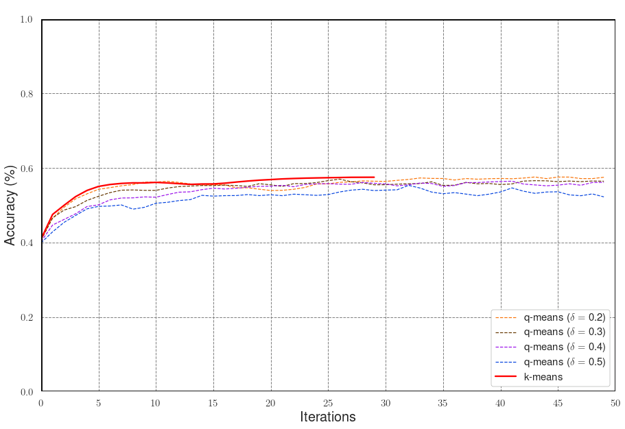 -->
<!-- 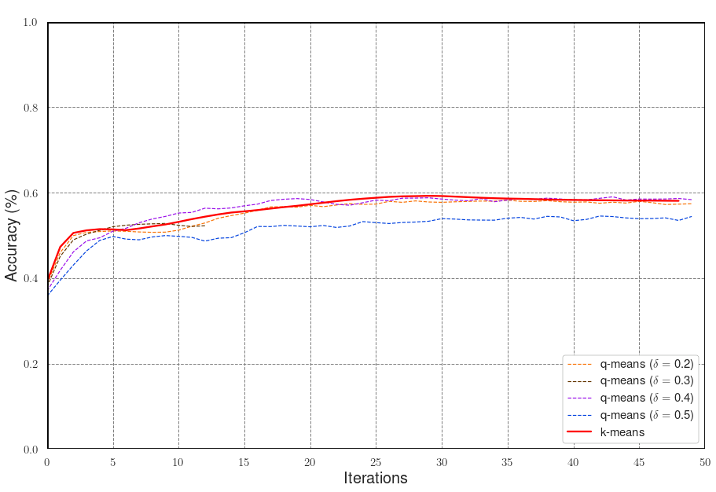 -->
<!-- 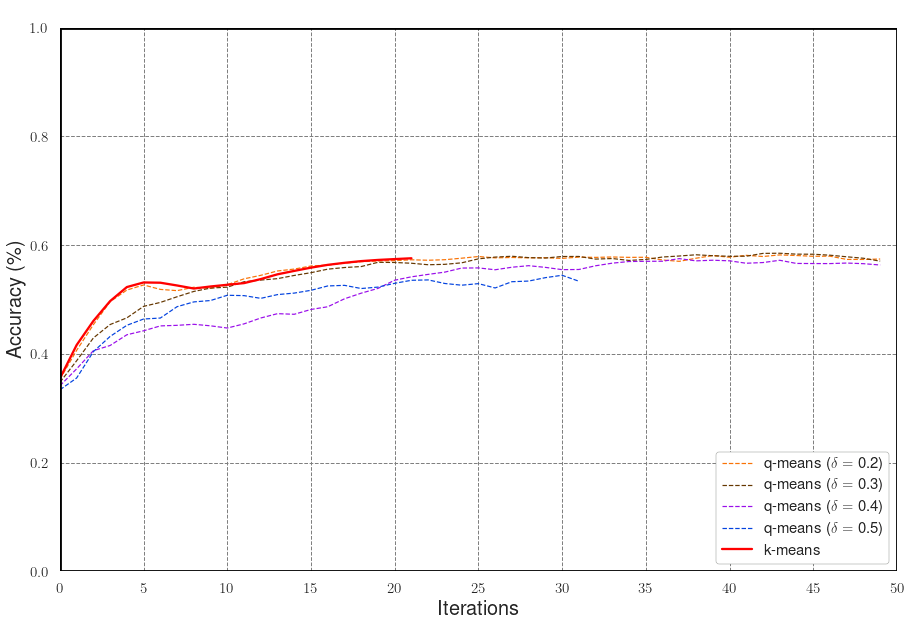 -->
<!-- ``` -->


<!-- \begin{figure}[htbp] -->
<!-- \centering -->
<!-- \begin{minipage}{0.3\textwidth} -->
<!--   \centering -->
<!-- \includegraphics[width=50mm, height=35mm]{mnistpca2} -->
<!-- \subcaption[second caption.]{}\label{fig:1a} -->
<!-- \end{minipage}% -->
<!-- \begin{minipage}{0.3\textwidth} -->
<!--   \centering -->
<!-- \includegraphics[width=50mm, height=35mm]{mnistpca3.png} -->
<!-- \subcaption[third caption.]{}\label{fig:1b} -->
<!-- \end{minipage} -->
<!-- \begin{minipage}{0.3\textwidth} -->
<!--   \centering -->
<!-- \includegraphics[width=50mm, height=35mm]{mnistpca4.png} -->
<!-- \subcaption[third caption.]{}\label{fig:1c} -->
<!-- \end{minipage} -->
<!-- \captionsetup{justification=raggedright, margin=1cm} -->
<!-- \caption{Three accuracy evolutions on the MNIST dataset under $k$-means and $\delta$-$k$-means for $4$ different values of $\delta$. Each different behavior is due to the random initialization of the centroids} \label{fig:1} -->
<!-- \end{figure} -->

<!-- Finally, we present a last experiment with the MNIST dataset with a different data preprocessing. In order to reach higher accuracy in the clustering, we replace the previous dimensionality reduction by a Linear Discriminant Analysis (LDA). Note that a LDA is a supervised process that uses the labels (here, the digits) to project points in a well chosen lower dimensional subspace. Thus this preprocessing cannot be applied in practice in unsupervised machine learning. However, for the sake of benchmarking, by doing so $k$-means is able to reach a 87\% accuracy, therefore it allows us to compare $k$-means and $\delta$-$k$-means on a real and almost well-clusterable dataset. In the following, the MNIST dataset is reduced to 9 dimensions. The results in Figure \ref{mnist-results-2} show that $\delta$-$k$-means converges to the same accuracy than $k$-means even for values of $\eta/\delta$ down to $16$. In some other cases, $\delta$-$k$-means shows a faster convergence, due to random fluctuations that can help escape faster from a temporary equilibrium of the clusters. -->

<!-- \begin{figure} [H] -->
<!-- \centering -->
<!-- \includegraphics[width=101mm, height=69mm] {mnistlda.png}  -->
<!-- \captionsetup{justification=raggedright, margin=0.5cm} -->
<!-- \caption{Accuracy evolution on the MNIST dataset under $k$-means and $\delta$-$k$-means for $4$ different values of $\delta$. Data has been preprocessed to 9 dimensions with a LDA reduction. All versions of  $\delta$-$k$-means converge to the same accuracy than $k$-means in the same number of steps.} \label{mnist-results-2}  -->
<!-- \end{figure}  -->

<!-- \begin{table}[H] -->
<!-- \centering -->
<!-- \begin{tabular}{|c|c|c|c|c|c|c|c|c|} -->
<!-- \hline -->
<!-- Algo                                   & Dataset & ACC   & HOM   & COMP  & V-M   & AMI   & ARI   & RMSEC \\ \hline -->
<!-- \multirow{2}{*}{k-means}               & Train   & 0.868 & 0.736 & 0.737 & 0.737 & 0.735 & 0.736 & 0     \\ \cline{2-9}  -->
<!--                                        & Test    & 0.891 & 0.772 & 0.773 & 0.773 & 0.776 & 0.771 & -     \\ \hline -->
<!-- \multirow{2}{*}{q-means, $\delta=0.2$} & Train   & 0.868 & 0.737 & 0.738 & 0.738 & 0.736 & 0.737 & 0.031 \\ \cline{2-9}  -->
<!--                                        & Test    & 0.891 & 0.774 & 0.775 & 0.775 & 0.777 & 0.774 & -     \\ \hline -->
<!-- \multirow{2}{*}{q-means, $\delta=0.3$} & Train   & 0.869 & 0.737 & 0.739 & 0.738 & 0.736 & 0.737 & 0.049 \\ \cline{2-9}  -->
<!--                                        & Test    & 0.890 & 0.772 & 0.774 & 0.773 & 0.775 & 0.772 & -     \\ \hline -->
<!-- \multirow{2}{*}{q-means, $\delta=0.4$} & Train   & 0.865 & 0.733 & 0.735 & 0.734 & 0.730 & 0.733 & 0.064  \\ \cline{2-9}  -->
<!--                                        & Test    & 0.889 & 0.770 & 0.771 & 0.770 & 0.773 & 0.769 & -     \\ \hline -->
<!-- \multirow{2}{*}{q-means, $\delta=0.5$} & Train   & 0.866 & 0.733 & 0.735 & 0.734 & 0.731 & 0.733 & 0.079 \\ \cline{2-9}  -->
<!--                                        & Test    & 0.884 & 0.764 & 0.766 & 0.765 & 0.764 & 0.764 & -     \\ \hline -->
<!-- \end{tabular} -->
<!-- \caption{A sample of results collected from the same experiments as in Figure \ref{mnist-results-2}. Different metrics are presented for the train set and the test set. ACC: accuracy. HOM: homogeneity. COMP: completeness. V-M: v-measure. AMI: adjusted mutual information. ARI: adjusted rand index. RMSEC: Root Mean Square Error of Centroids.}  -->
<!-- \label{tablecomparison} -->
<!-- \end{table} -->


<!-- The authors remarked that the values of $\eta/\delta$ in their experiment remained between 3 and 20. Moreover, the parameter $\eta$, which is the maximum square norm of the points, provides a worst case guarantee for the algorithm, while one can expect that the running time in practice will scale with the average square norm of the points. For the MNIST dataset after PCA, this value is 2.65 whereas $\eta = 8.3$. -->

<!-- In conclusion, the simulations show that the convergence of $\delta$-$k$-means is almost the same as the regular $k$-means algorithms for large enough values of $\delta$. This provides evidence that the $q$-means algorithm will have as good performance as the classical $k$-means, and its running time will be significantly lower for large datasets. -->


### QSFA

### QEM

In this section, we discuss again Quantum Expectation-Maximization algorithm, and we present the results of some experiments on real datasets to estimate its runtime. We will also show some bound on the value of the parameters that governs it, like $\kappa(\Sigma)$, $\kappa(V)$, $\mu(\Sigma)$, $\mu(V)$, $\delta_\theta$, and $\delta_\mu$, and we give heuristic for dealing with the condition number. As we already have done, we can put a threshold on the condition number of the matrices $\Sigma_j$, by discarding singular values which are smaller than a certain threshold. This might decrease the runtime of the algorithm without impacting its performances. This is indeed done often in classical machine learning models, since discarding the eigenvalues smaller than a certain threshold might even improve upon the metric under consideration (i.e. often the accuracy), by acting as a form of regularization (look at Section 6.5 of [@murphy2012machine]). This in practice is equivalent to limiting the eccentricity of the Gaussians. We can do similar considerations for putting a threshold on the condition number of the dataset $\kappa(V)$. Recall that the value of the condition number of the matrix $V$ is approximately  $1/\min( \{\theta_1,\cdots, \theta_k\}\cup \{ d_{st}(\mathcal{N}(\mu_i, \Sigma_i), \mathcal{N}(\mu_j, \Sigma_j)) | i\neq j \in [k] \})$, where $d_{st}$ is the statistical distance between two Gaussian distributions [@kalai2012disentangling]. We have some choice in picking the definition for $\mu$: in previous experiments it has been found that choosing the maximum $\ell_1$ norm of the rows of $V$ lead to values of $\mu(V)$ around $10$ for the MNIST dataset, as we saw on the experiments of QSFA, PCA and q-means. Because of the way $\mu$ is defined, its value will not increase significantly as we add vectors to the training set. In case the matrix $V$ can be clustered with high-enough accuracy by distance-based algorithms like k-means, it has been showed that the Frobenius norm of the matrix is proportional to $\sqrt{k}$, that is, the rank of the matrix depends on the number of different classes contained in the data. Given that EM is just a more powerful extension of k-means, we can rely on similar observations too. Usually, the number of features $d$ is much more than the number of components in the mixture, i.e. $d \gg k$, so we expect $d^2$ to dominate the $k^{3.5}$ term in the cost needed to estimate the mixing weights, thus making $T_\Sigma$ the leading term in the runtime. We expect this cost to be be mitigated by using $\ell_\infty$ form of tomography but we defer further experiment for future research.

As we said, the quantum running time saves the factor that depends on the number of samples and introduces a number of other parameters. Using our experimental results we can see that when the number of samples is large enough one can expect the quantum running time to be faster than the classical one.

   To estimate the runtime of the algorithm, we need to gauge the value of the parameters $\delta_\mu$ and $\delta_\theta$, such that they are small enough so that the likelihood is perturbed less than $\epsilon_\tau$, but big enough to have a fast algorithm. We have reasons to believe that on well-clusterable data, the value of these parameters will be large enough, such as not to impact dramatically the runtime. A quantum version of k-means algorithm has already been simulated on the MNIST dataset under similar assumptions [@kerenidis2019qmeans]. The experiment concluded that, for datasets that are expected to be clustered nicely by this kind of clustering algorithms, the value of the parameters $\delta_\mu$ did not decrease by increasing the number of samples nor the number of features. There, the value of $\delta_\mu$ (which in their case was called just $\delta$) has been kept between $0.2$ and $0.5$, while retaining a classification accuracy comparable to the classical k-means algorithm. We expect similar behaviour in the GMM case, namely that for large datasets the impact on the runtime of the errors $(\delta_\mu, \delta_\theta)$ does not cancel out the exponential gain in the dependence on the number of samples, and we discuss more about this in the next paragraph. The value of $\epsilon_\tau$ is usually (for instance in scikit-learn [@scikit-learn] ) chosen to be $10^{-3}$. We will see that the value of $\eta$ has always been 10 on average, with a maximum of 105 in the experiments.

<!--     \begin{table}[h] -->
<!--         \centering -->

<!--         \begin{tabular}{c|c|c|c|c|} -->
<!--         \cline{2-5} -->
<!--  & \multicolumn{2}{c|}{MAP}  & \multicolumn{2}{c|}{ML}   \\ \cline{2-5}  -->
<!--      & avg          & max        & avg         & max         \\ \hline -->
<!--         \multicolumn{1}{|c|}{$\norm{\Sigma}_2$}                & 0.22         & 2.45       & 1.31        & 3.44        \\ \hline -->
<!--         \multicolumn{1}{|c|}{$|\log \det(\Sigma)|$}                                 & 58.56        & 70.08      & 14.56       & 92.3        \\ \hline -->
<!--         \multicolumn{1}{|c|}{$\kappa^*(\Sigma)$} & 4.21         & 50         & 15.57       & 50          \\ \hline -->
<!--         \multicolumn{1}{|c|}{$\mu(\Sigma)$}                       & 3.82         & 4.35       & 2.54        & 3.67        \\ \hline -->
<!--         \multicolumn{1}{|c|}{$\mu(V)$}                                           & 2.14         & 2.79       & 2.14        & 2.79        \\ \hline -->
<!--         \multicolumn{1}{|c|}{$\kappa(V)$}                                        & 23.82        & 40.38      & 23.82       & 40.38       \\ \hline -->
<!--         \end{tabular} -->
<!--             \caption{We estimate some of the parameters of the VoxForge [@voxforge] dataset.  Each model is the result of the best of 3 different initializations of the EM algorithm. The first and the second rows are the maximum singular values of all the covariance matrices, and the absolute value of the log-determinant. The column $\kappa^*(\Sigma)$ shows the condition number after the smallest singular values have been discarded.}        \label{tab:results} -->

<!--         \end{table} -->


### QPCA
These experiment are extracted from [@bellante2022quantum]. This section shows several experiments on the MNIST, Fashion MNIST, CIFAR-10 and Research Papers datasets.
In all the experiments, the datasets have been shifted to row mean $0$ and normalized so that $\sigma_{max} \leq 1$.

##### Explained variance distribution
First, we explore the distribution of the factor score ratios in the MNIST, Fashion MNIST, CIFAR-10 and Research Papers datasets, showing that a small number of singular values is indeed able to explain a great amount of the variance of the data.
For all the four datasets, we compute the singular values and their factor score ratios and we plot them.
The results of Figure \@ref(fig:sv-distrib) show a rapid decrease of the factor score ratios in all the datasets, confirming the expectations.

```{r, sv-distrib, echo=FALSE, out.width="33%", fig.ncol=2, fig.show='hold', fig.cap="Explained variance distribution in datasets for machine learning. In order: MNIST, Fashion MNIST, CIFAR 10, Research Papers.", fig.subcap= c("MNIST.", "Fashion MNIST.", "CIFAR 10.", "Research Papers.")}
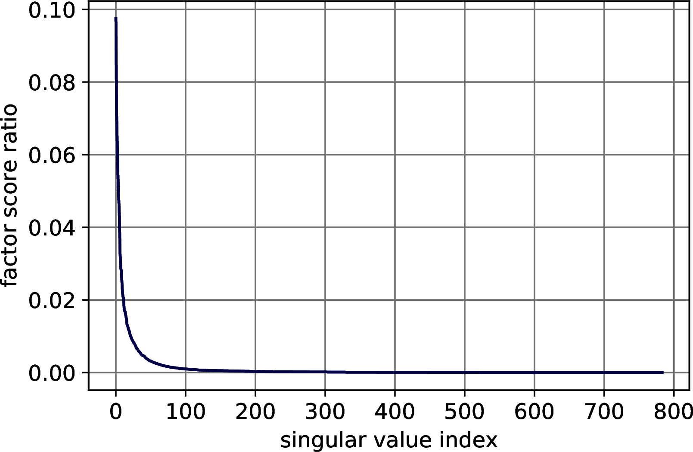
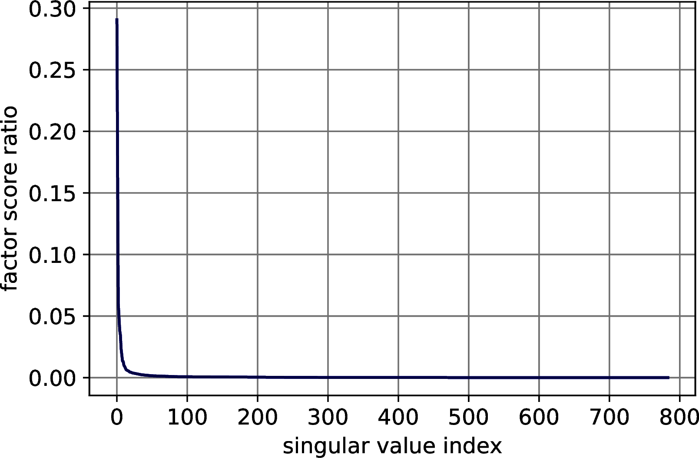
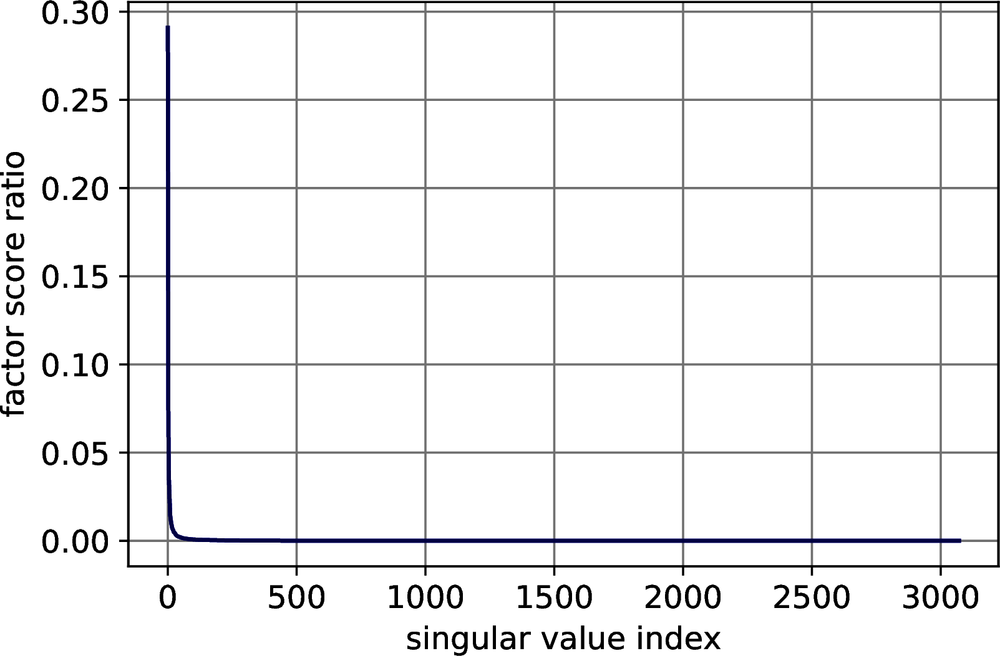
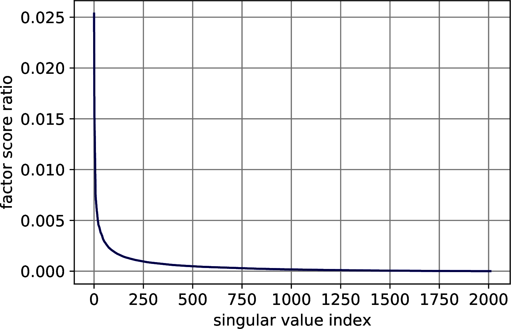
```

#### Image classification with quantum PCA
To provide the reader with a clearer view of the algorithms in Sections \@ref(sec:explainedvariance), \@ref(sec:qpca) and their use in machine learning, we provide experiments on quantum PCA for image classification.
We perform PCA on the three datasets for image classification (MNIST, Fashion MNIST and CIFAR 10) and classify them with a K-Nearest Neighbors.
First, we simulate the extraction of the singular values and the percentage of variance explained by the principal components (top $k$ factor score ratios' sum) using the procedure from Theorem \@ref(thm:factor-score-estimation).
Then, we study the error of the model extraction, using Lemma \@ref(lem:accuracyUSeVS), by introducing errors on the Frobenius norm of the representation to see how this affects the accuracy.


##### Estimating the number of principal components
We simulate Theorem \@ref(thm:factor-score-estimation) to decide the number of principal components needed to retain 0.85 of the total variance.
For each dataset, we classically compute the singular values with an exact classical algorithm and simulate the quantum state $\frac{1}{\sqrt{\sum_j^r \sigma_j^2}} \sum_i^r \sigma_i\ket{\sigma_i}$
to emulate the measurement process.
After initializing the random object with the correct probabilities, we measure it $\frac{1}{\gamma^2} = 1000$ times and estimate the factor score ratios with a frequentist approach (i.e., dividing the number of measurements of each outcome by the total number of measurements).
Measuring $1000$ times guarantees us an error of at most $\gamma=0.03$ on each factor score ratios.
To determine the number of principal components to retain, we sum the factor score ratios until the percentage of explained variance becomes greater than $0.85$.
We report the results of this experiments in Table \@ref(tab:principal-components).
We obtain good results for all the datasets, estimating no more than 3 extra principal components than needed.

Table: (\#tab:principal-components) Results of the estimation of the number of principal components to retain. The parameter $k$ is the number of components needed to retain at least $p=0.85$ of the total variance. $p$ is computed w.r.t. the estimated $k$.

| Parameter | MNIST| F-MNIST| CIFAR-10|
|:------------:|:-----------:|:------------:|:------------:|
| Estimated $k$ | 62 | 45| 55|
| Exact $k$ | 59 | 43| 55|
| Estimated $p$ | 0.8510 | 0.8510| 0.8510|
| Exact $p$ | 0.8580 | 0.8543| 0.8514|
| $\gamma$ | 0.0316 | 0.0316 | 0.0316|

The number of principal components can be further refined using Theorem \@ref(thm:check-explained-variance).
When we increase the percentage of variance to retain, the factor score ratios become smaller and the estimation worsens.
When the factor score ratios become too small to perform efficient sampling, it is possible to establish the threshold $\theta$ for the smaller singular value to retain using Theorems \@ref(thm:check-explained-variance) and \@ref(thm:explained-variance-binarysearch).
If one is interested in refining the exact number $k$ of principal components, rather than $\theta$, it is possible to obtain it using a combination of the algorithms from Theorems \@ref(thm:check-explained-variance), \@ref(thm:explained-variance-binarysearch) and the quantum counting algorithm [@brassard2002quantum] in time that scales with the square root of $k$.
Once that the number of principal components has been set, the next step is to use Theorem \@ref(thm:top-k-sv-extraction) to extract the top singular vectors.
To do so, we can retrieve the threshold $\theta$ from the previous step by checking the gap between the last singular value to retain and the first to exclude.

###### Studying the error in the data representation
We continue the experiment by checking how much error in the data representation a classifier can tolerate.
We compute the exact PCA's representation for the three datasets and a perform 10-fold Cross-validation error using a k-Nearest Neighbors with $7$ neighbors.
For each dataset we introduce error in the representation and check how the accuracy decreases.
To simulate the error, we perturb the exact representation by adding truncated Gaussian error (zero mean and unit variance, truncated on the interval $[\frac{-\xi}{\sqrt{nm}},\frac{\xi}{\sqrt{nm}}]$) to each component of the matrix.
The graph in Figure \@ref{fig:error-matrix} shows the distribution of the effective error on $2000$ approximation of a matrix $A$, such that $\|A - \overline{A}\| \leq 0.1$.
The distribution is still Gaussian, centered almost at the half of the bound.

```{r, error-matrix, echo=FALSE, out.width="50%", fig.cap="Introducing some error in the Frobenius norm of a matrix $A$. The error was introduced such that $\\|A - \\overline{A}\\| \\leq 0.01$. The figure shows the distribution of the error over $2000$ measurements."}
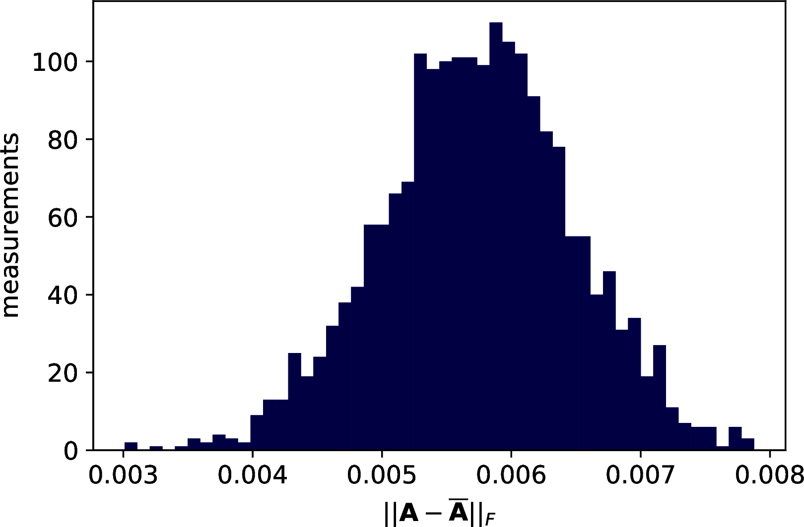
```

The results show a reasonable tolerance of the errors, we report them in two set of figures.
Figure \@ref(fig:class-bound) shows the drop of accuracy in classification as the error bound increases. Figure \@ref(fig:class-relative) shows the trend of the accuracy against the effective error of the approximation.

```{r, class-bound, echo=FALSE, out.width="33%", fig.ncol=3, fig.show='hold', fig.cap="Classification accuracy of $7$-Nearest Neighbor on three machine learning datasets after PCA's dimensionality reduction. The drop in accuracy is plotted with respect to the \\emph{bound} on the Frobenius norm of the difference between the exact data representation and its approximation. In order: MNIST, Fashion MNIST, CIFAR 10.", fig.subcap= c("MNIST.", "Fashion MNIST.", "CIFAR 10.")}
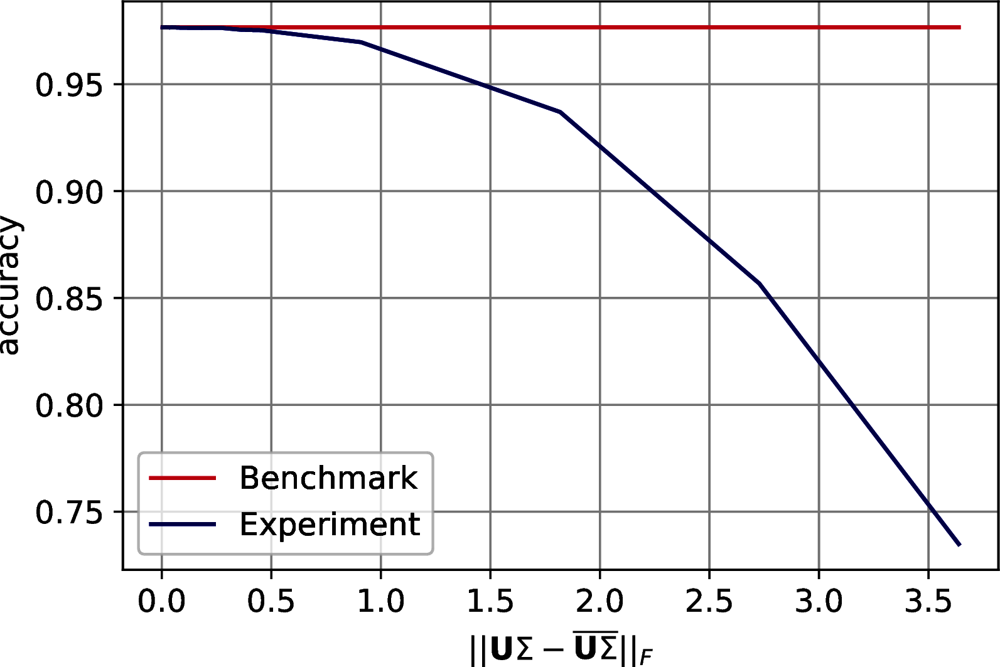
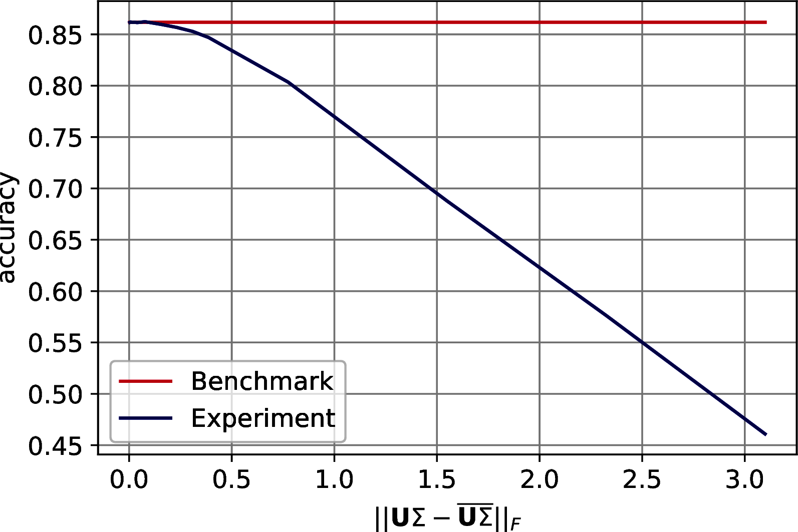
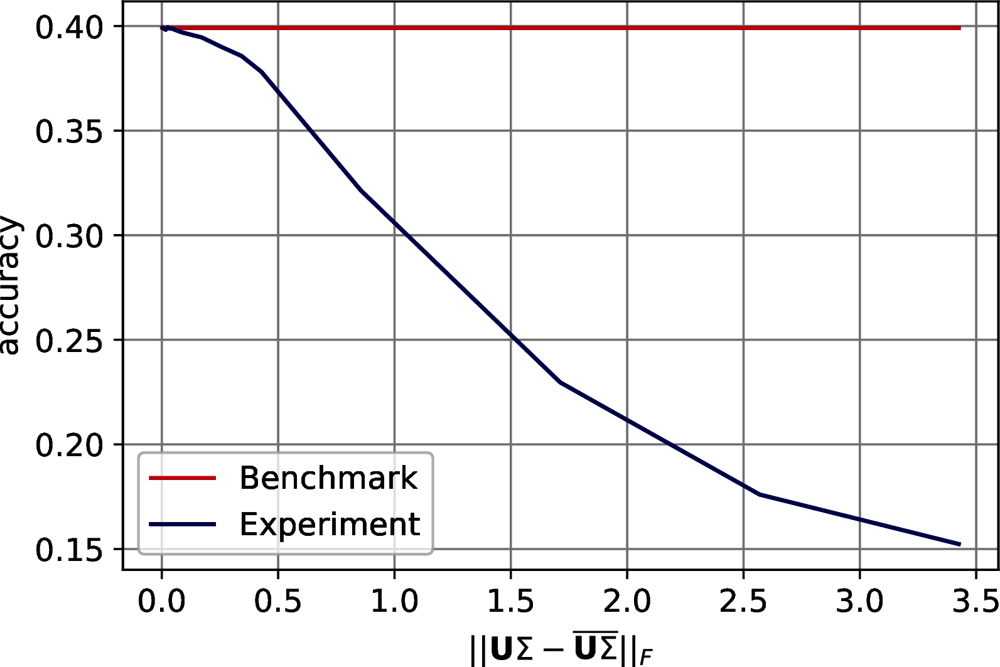
```

```{r, class-relative, echo=FALSE, out.width="33%", fig.ncol=3, fig.show='hold', fig.cap="Classification accuracy of $7$-Nearest Neighbor on three machine learning datasets after PCA's dimensionality reduction. The drop in accuracy is plotted with respect to the \\emph{effective} Frobenius norm of the difference between the exact data representation and its approximation. In order: MNIST, Fashion MNIST, CIFAR 10.", fig.subcap= c("MNIST.", "Fashion MNIST.", "CIFAR 10.")}
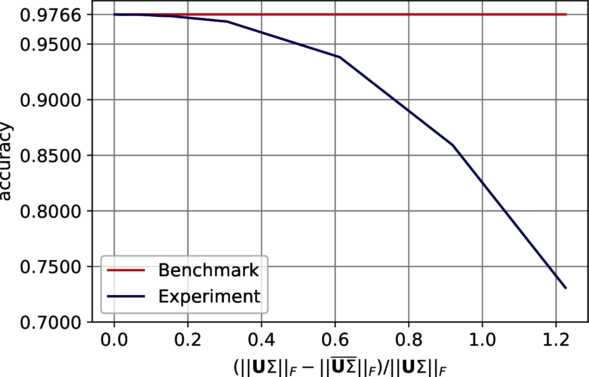

knitr::include_graphics("images/experiments/qpca/classificationrelative/CIFAR_Classification_Fnorm_relative.png")
```

##### Analyzing the run-time parameters {#sec:runtime-analysis}
As discussed in Section \@ref(sec:qpca), the model extraction's run-time is $\widetilde{O}\left(\left( \frac{1}{\gamma^2} + \frac{kz}{\theta\sqrt{p}\delta^2}\right)\frac{\mu(A)}{\epsilon}\right)$, where $A \in \R^{n\times m}$ is PCA's input matrix, $\mu(A)$ is a parameter bounded by $\min(\|A\|_F, \|A\|_\infty)$, $k$ is the number of principal components retained, $\theta$ is the value of the last singular value retained, $\gamma$ is the precision to estimate the factor score ratios, $\epsilon$ bounds the absolute error on the estimation of the singular values, $\delta$ bounds the $\ell_2$ norm of the distance between the singular vectors and their approximation, and $z$ is either $n$, $m$ depending on whether we extract the left singular vectors, to compute the classical representation, or the right ones, to retrieve the model and allow for further quantum/classical computation.
This run-time can be further lowered using Theorem \@ref(thm:explained-variance-binarysearch) if we are not interested in the factor score ratios.
The aim of this paragraph is to show how to determine the run-time parameters for a specific dataset.
We enrich the parameters of Table \@ref(tab:principal-components) with the ones in Table \@ref(tab:supp-parameters) and we discuss how to compute them.
From the previous paragraphs it should be clear how to determine $k$, $\theta$, $\gamma$ and $p$, and
it is worth noticing again that $1/\sqrt{p} \simeq 1$.
To bound $\mu(A)$ we have computed $\|A\|_F$ and $\|A\|_\infty$.
To compute the parameter $\epsilon$ we have considered two situations: we need to allow for a correct ordering of the singular values; we need to allow for a correct thresholding.
We refer to the first as the ordering $\epsilon$ and to the second as the thresholding $\epsilon$.
To compute the first one it is sufficient to check the smallest gap between the first $k$ singular values of the dataset.
For the last one, one should check the difference between the last retained singular value and the first that is excluded.
It follows that the thresholding $\epsilon$ is always smaller than the ordering $\epsilon$.
For sake of completeness, we have run experiments to check how the Coupon Collector's problem changes as $\epsilon$ increases.
Recall that in the proof of Theorem \@ref(thm:top-k_sv_extraction) we use that
$\frac{1}{\sqrt{\sum_{i}^k \frac{\sigma_i^2}{\overline{\sigma}_i^2}}}\sum_i^k\frac{\sigma_i}{\overline{\sigma}_i} \ket{u_i}\ket{v_i}\ket{\overline{\sigma}_i} \sim \frac{1}{\sqrt{k}}\sum_i^k \ket{u_i}\ket{v_i}\ket{\overline{\sigma}_i}$ to say that the number of measurements needed to observe all the singular values is $O(k\log(k))$, and this is true only if $\epsilon$ is small enough to let the singular values distribute uniformly.
We observe that the thresholding $\epsilon$ always satisfy the Coupon Collector's scaling, and we have plotted the results of our tests in Figure \@ref(fig:coupon-collector).

```{r, coupon-collector, echo=FALSE, out.width="33%", fig.ncol=3, fig.show='hold', fig.cap="Number of measurements needed to obtain all the $k$ singular values from the quantum state $\\frac{1}{\\sqrt{\\sum_i^r\\sigma_i^2}}\\sum_i^k \\frac{\\sigma_i}{\\overline{\\sigma}_i}\\ket{\\overline{\\sigma}_i}$, where $\\|\\sigma_i - \\overline{\\sigma}_i\\| \\leq \\epsilon$, as $\\epsilon$ increases. The benchmark line is $k\\log_{2.4}(k)$. In order: MNIST, Fashion MNIST, CIFAR 10.", fig.subcap= c("MNIST.", "Fashion MNIST.", "CIFAR 10.")}
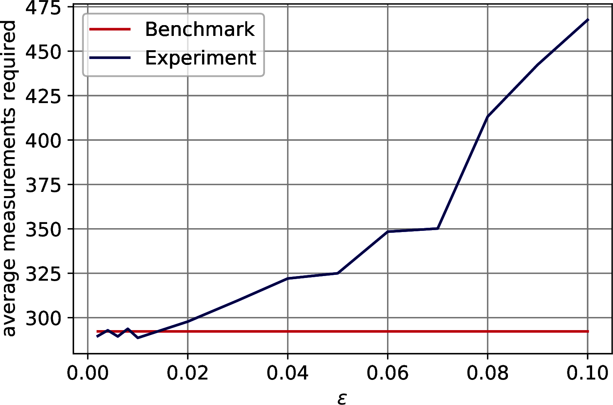
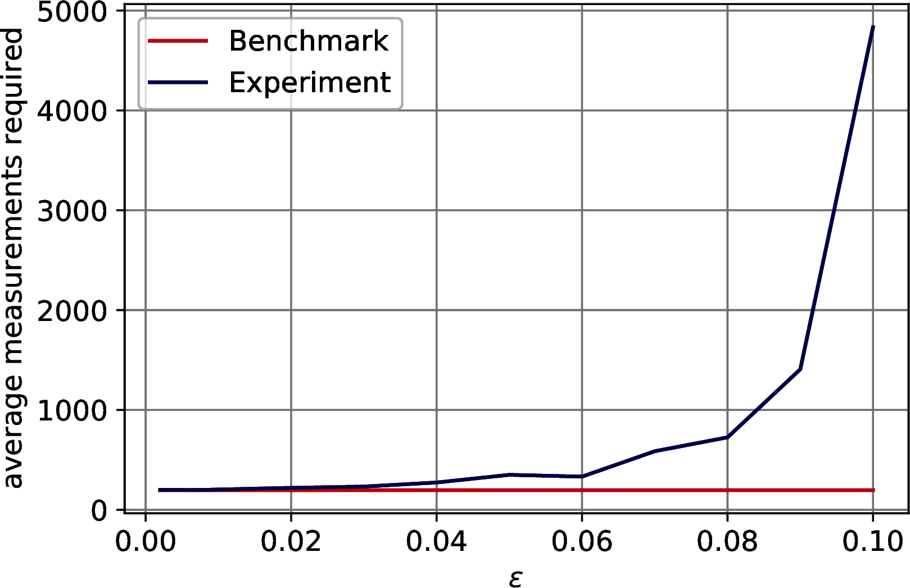
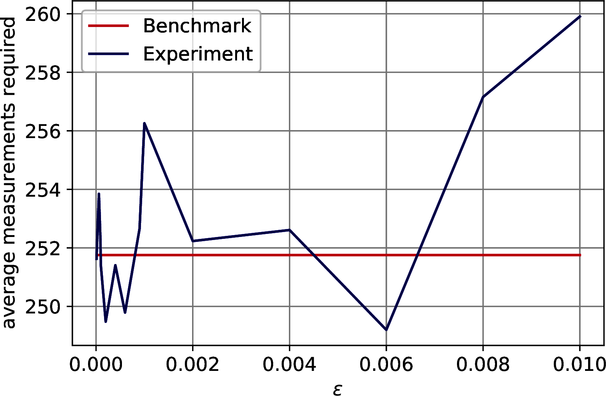
```

Furthermore, we have computed $\delta$ by using the fact that $\|A - \overline{A}\| \leq \sqrt{k}(\epsilon + \delta)$ (Lemma \@ref(lem:accuracyUSeVS)).
By inverting the equation and considering the thresholding $\epsilon$ we have computed an estimate for $\delta$.
In particular, we have fixed $\|A - \overline{A}\|$ to the biggest value in our experiments so that the accuracy doesn't drop more than $1\%$.

Since we have considered the values of the effective errors instead of the bounds, our estimates are pessimistic.

Table: (\#tab:supp-parameters) Run-time parameters.

| Parameter | MNIST | F-MNIST | CIFAR-10 |
|:------------:|:-----------:|:------------:|:------------:|
| Ordr. $\epsilon$ | 0.0003 | 0.0003| 0.0002|
| Thrs. $\epsilon$ | 0.0030 | 0.0009| 0.0006|
| $\|A\|_F$ | 3.2032 | 1.8551 | 1.8540|
| $\|A\|_\infty$ | 0.3730 | 0.3207 | 0.8710|
| $\theta$ | 0.1564 | 0.0776| 0.0746|
| $\delta$ | 0.1124 | 0.0106| 0.0340|

These results show that Theorem \@ref(thm:factor-score-estimation), \@ref(thm:check-explained-variance) and \@ref(thm:explained-variance-binarysearch) can already provide speed-ups on datasets as small as the MNIST.
Even though their speed-up is not exponential, they still run sub-linearly on the number of elements of the matrix even though all the elements are taken into account during the computation, offering a polynomial speed-up with respect to their traditional classical counterparts.
On the other hand, Theorem \@ref(thm:top-k-sv-extraction) requires bigger datasets.
On big low-rank datasets that maintain a good distribution of singular values, these algorithms are expected to show their full speed-up.
As a final remark, note that the parameters have similar orders of magnitude.

##### Projecting the quantum data in the new quantum feature space
To end with, we have tested the value of $\alpha$ (Definition \@ref(def:pca-representable), Lemma \@ref(lem:qpca-vector-repr)) for the MNIST dataset, fixing $\varepsilon=0$ and trying $p \in \{0.1,0.2,0.3,0.4,0.5,0.6,0.7,0.8,0.9\}$.
We have observed that $\alpha = 0.96 \pm 0.02$, confirming that the run-time of Corollary \@ref(cor:qpca-vector) can be assumed constant for the majority of the data points of a PCA-representable dataset.
