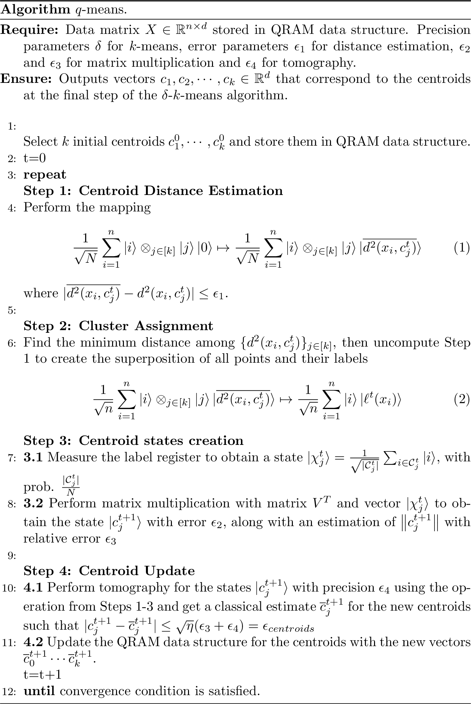

# q-means {#chap-q-means}

<div style="text-align: right"> Contributors: Alessandro Luongo - based on work [@kerenidis2019qmeans] </div>
<br>


In this section we detail a quantum algorithm for unsupervised learning, which can be seen as the quantum version of the well known k-means algorithm. This algorithm is one of the simplest, yet most commonly used clustering algorithms. We first introduce the classical algorithm, then propose a definition of the k-mean model that makes is robust to error in the model. Then, we explain how to derive a quantum version of the k-means algorithm and show its performance on experimental data.


## The k-means algorithm
The $k$-means algorithm was introduced in [@lloyd1982least], and is extensively used for unsupervised problems. The inputs to $k$-means algorithm are vectors $x_{i} \in \R^{d}$ for $i \in [n]$. These points must be partitioned in $k$ subsets according to a similarity measure,  which in k-means is the Euclidean distance between points. The output of the $k$-means algorithm is a list of $k$ cluster centers, which are called *centroids*. The algorithm starts by selecting $k$ initial centroids randomly or using efficient heuristics like the $k$-means++ [@arthur2007k]. It then alternates between two steps: (i) Each data point is assigned the label of the closest centroid. (ii) Each centroid is updated to be the average of the data points assigned to the corresponding cluster. These two steps are repeated until convergence, that is, until the change in the centroids during one iteration is sufficiently small.


More precisely, we are given a dataset $X$ of vectors $x_{i} \in \R^{d}$ for $i \in [n]$. At step $t$, we denote the $k$ clusters by the sets $C_j^t$ for $j \in [k]$, and each corresponding centroid by the vector $c_{j}^{t}$. At each iteration, the data points $x_i$ are assigned to a cluster $C_j^t$ such that $C_1^t \cup C_2^t \cdots \cup C_K^t = V$ and $C_i^t \cap C_l^t = \emptyset$ for $i \neq l$. Let $d(x_{i}, c_{j}^{t})$ be the Euclidean distance between vectors $x_{i}$ and $c_{j}^{t}$.  The first step of the algorithm assigns each $x_{i}$ a label $\ell(x_{i})^t$ corresponding to the closest centroid, that is
$$\ell(x_{i})^{t} = \text{argmin}_{j \in [k]}(d(x_{i}, c_{j}^{t})).$$ The centroids are then updated, $c_{j}^{t+1} = \frac{1}{ |C_{j}^t|} \sum_{i \in C_{j}^t } x_{i},$
so that the new centroid is the average of all points that have been assigned to the cluster in this iteration. We say that we have converged if for a small threshold $\tau$ (which might be data dependent) we have:
$$\frac{1}{k}\sum_{j=1}^{k}{d(c_{j}^{t},c_{j}^{t-1}}) \leqslant \tau.$$
The loss function that this algorithm aims to minimize is the RSS (residual sums of squares), the sum of the squared distances between points and the centroid of their cluster.
$$ \text{RSS} := \sum_{j \in [k]}\sum_{i\in C_j} d(c_j, x_i)^2$$
As the RSS decrease at each iteration of the $k$-means algorithm, the algorithm therefore converges to a local minimum for the RSS. The number of iterations $T$ for convergence depends on the data and the number of clusters.  A single iteration has complexity of $O(kn d)$ since the $n$ vectors of dimension $d$ have to be compared to each of the $k$ centroids. The centroids obtained at time $t$ are stored in the matrix $C^t \in \R^{k \times d}$, such that the $j^{th}$ row $c_{j}^{t}$ for $j\in [k]$ represents the centroid of the cluster $\mathcal{C}_j^t$.


From a computational complexity point of view, we recall that it is NP-hard to find a clustering that achieves the global  minimum for the RSS. There are classical clustering algorithms based on optimizing different loss functions, however the k-means algorithm uses the RSS as the objective function.
The algorithm can be super-polynomial in the worst case (the number of iterations is $2^{\omega(\sqrt{n})}$  [@arthur2006slow]),
but the number of iterations is usually small in practice. The $k$-means algorithm with a suitable heuristic like $k$-means++ ( described later on ) to initialize the centroids finds a clustering such that the value for the RSS objective function is within a multiplicative $O(\log n)$ factor of the minimum value [@arthur2007k].


### $\delta-$k-means

We now consider a $\delta$-robust version of the $k$-means in which we introduce some noise. The noise affects the algorithms in both of the steps of k-means: label assignment and centroid estimation.

- Let $c^{*}_i$ be the closest centroid to the data point $x_i$. Then, the set of possible labels $L_{\delta}(x_i)$ for $x_i$ is defined as follows:
$$L_{\delta}(x_i)  =  \{c_p  : | d^2(c^*_i, x_i ) - d^2(c_p, x_i) | \leq \delta \: \}$$
The assignment rule selects arbitrarily a cluster label from the set $L_{\delta}(x_i)$.
-  We add $\delta/2$ noise during the calculation of the centroid. Let $\mathcal{C}_j^{t+1}$ be the set of points which have been labeled by $j$ in the previous step. For $\delta$-k-means we pick a centroid $c^{t+1}_j $ with the property that:
$$\norm{ c^{t+1}_j - \frac{1}{|\mathcal{C}^{t+1}_j|}\sum_{x_i \in \mathcal{C}^{t+1}_j} x_i} < \frac{\delta}{2}.$$


One way to see this is to perturb the centroid with some noise.

Let us add two remarks on the $\delta$-$k$-means. First, for a dataset that is expected to have clusterable data, and for a small $\delta$, the number of vectors on the boundary that risk to be misclassified in each step, that is the vectors for which $|L_{\delta}(x_i)|>1$ is typically much smaller compared to the vectors that are close to a unique centroid. Second, we also increase by $\delta/2$  the convergence threshold from the $k$-means algorithm. All in all, $\delta$-$k$-means is able to find a clustering that is robust when the data points and the centroids are perturbed with some noise of magnitude $O(\delta)$.
As we will see in this work, $q$-means is the quantum equivalent of $\delta$-$k$-means.


## The $q$-means algorithm

The $q$-means algorithm is given as Algorithm \@ref(fig:q-means-algo). At a high level, it follows the same steps as the classical $k$-means algorithm (and the EM algorithm for GMM), where we now use quantum subroutines for distance estimation, finding the minimum value among a set of elements, matrix multiplication for obtaining the new centroids as quantum states, and efficient tomography. First, we pick some random initial points, using the quantum version of a classical techniques (like the $k$-means$++$ idea  [@arthur2007k], for which we give a quantum algorithm later ). Then, in Steps 1 and 2 all data points are assigned to a cluster. In Steps 3 and 4 we update the centroids of the clusters and retrieve the information classically. The process is repeated until convergence.


```{r, q-means-algo, fig.cap="The q-means algorithm", echo=FALSE}

```


### Step 1: Centroid distance estimation

The first step of the algorithm estimates the square distance between data points and clusters using a quantum procedure.

```{theorem, dist-centroids, name="Centroid Distance estimation"}
Let a data matrix $V \in \mathbb{R}^{n \times d}$ and a centroid matrix $C \in \mathbb{R}^{k \times d}$ be stored in QRAM, such that the following unitaries $\ket{i}\ket{0} \mapsto \ket{i}\ket{x_i}$, and $\ket{j}\ket{0} \mapsto \ket{j}\ket{c_j}$ can be performed in time $O(\log (nd))$ and the norms of the vectors are known.
For any $\Delta > 0$ and $\epsilon_1>0$, there exists a quantum algorithm that performs the mapping
$$\frac{1}{\sqrt{n}}\sum_{i=1}^{n}  \ket{i} \otimes_{j \in [k]} ( \ket{j}\ket{0}) \mapsto\ \frac{1}{\sqrt{n}}\sum_{i=1}^{n}  \ket{i} \otimes_{j \in [k]}(\ket{j}\ket{\overline{d^2(x_i,c_j)}}),$$
where $|\overline{d^{2}(x_i,c_j)}-d^{2}(x_i,c_j)| \leqslant  \epsilon_1$ with probability at least $1-2\Delta$, in time $\widetilde{O}\left(k \frac{ \eta}{\epsilon_1} \log(1/\Delta) \right)$ where $\eta=\max_{i}(\norm{x_i}^2)$.
```


The proof of the theorem follows rather straightforwardly from lemma \@ref(lem:innerproductestimation). In fact one just needs to apply the distance estimation procedure $k$ times. Note also that the norms of the centroids are always smaller than the maximum norm of a data point which gives us the factor $\eta.$


### Step 2: Cluster assignment
At the end of Step 1, we have coherently estimated the square distance between each point in the dataset and the $k$ centroids in separate registers. We can now select the index $j$ that corresponds to the centroid closest to the given data point, written as $\ell(x_{i}) = \text{argmin}_{j \in [k]}(d(x_{i}, c_{j}))$.
As taking the square of a number is a monotone function, we do not need to compute the square root of the distance in order to find $\ell(x_{i})$.

```{lemma, circuit-minimum, name="Circuit for finding the minimum of $k$ registers"}
Given $k$ different $\log p$-bit registers $\otimes_{j \in [k]} \ket{a_j}$, there is a quantum circuit $U_{min}$ that maps in time ${O}(k \log p)$
	$$(\otimes_{j \in [p]} \ket{a_j})\ket{0} \to (\otimes_{j \in [k]}\ket{a_j})\ket{\text{argmin}(a_j)}.$$
```

```{proof}
We append an additional register for the result that is initialized to $\ket{1}$. We then repeat the following operation for $2\leq j \leq k$, we compare registers $1$ and $j$, if the value in register $j$ is smaller we swap registers $1$ and $j$ and update the result register to $j$. The cost of the procedure is ${O}(k \log p)$.
```
The cost of finding the minimum is $\widetilde{O}(k)$ in step 2 of the $q$-means algorithm, while we also need to uncompute the distances by repeating Step 1.
Once we apply the minimum finding lemma \@ref(lem:circuit-minimum) and undo the computation we obtain the state
\begin{equation}
\ket{\psi^t} := \frac{1}{\sqrt{N}}\sum_{i=1}^{n} \ket{i} \ket{ \ell^t(x_{i})}.
  (\#eq:labels)
\end{equation}


### Step 3: Centroid state creation
The previous step gave us the state $\ket{\psi^t}= \frac{1}{\sqrt{N}}\sum_{i=1}^{n} \ket{i} \ket{ \ell^t(x_{i})}$.
The first register of this state stores the index of the data points while the second register stores the label for the data point in the current iteration.
Given these states, we need to find the new centroids  $\ket{c_j^{t+1}}$, which are the average of the data points having the same label.

Let $\chi_{j}^{t} \in \R^{N}$ be the characteristic vector for cluster $j \in [k]$ at iteration $t$ scaled to unit $\ell_{1}$ norm, that is $(\chi_{j}^{t})_{i} = \frac{1}{  |C_{j}^{t}|}$ if $i\in \mathcal{C}_{j}$ and $0$ if $i \not \in \mathcal{C}_{j}$. The creation of the quantum states corresponding to the centroids is based on the
following simple claim.


```{proposition}
Let $\chi_{j}^{t} \in \R^{N}$ be the scaled characteristic vector for $\mathcal{C}_{j}$ at iteration $t$ and $X \in\R^{n\times d}$ be the data matrix, then $c_{j}^{t+1} = X^{T} \chi_{j}^{t}$.
```
```{proof}
The $k$-means update rule for the centroids is given by $c_{j}^{t+1} = \frac{1}{ |C_{j}^{t}|} \sum_{i \in C_{j} } x_{i}$. As the columns of $X^{T}$ are the vectors $x_{i}$, this can be rewritten as
$c_{j}^{t+1} = X^{T} \chi_{j}^{t}$.
```


The above claim allows us to compute the updated centroids $c_{j}^{t+1}$ using quantum linear algebra operations.
In fact, the state $\ket{\psi^t}$ can be written as a weighted superposition of the characteristic vectors of the clusters.
\begin{align*}
   \ket{\psi^t} = \sum_{j=1}^{k}\sqrt{\frac{|C_{j}|}{N}} \left( \frac{1}{ \sqrt{ |C_{j}|} }  \sum_{i\in \mathcal{C}_j}\ket{i}\right)\ket{j} = \sum_{j=1}^{k}\sqrt{\frac{|C_{j}|}{N}}
  \ket{\chi_{j}^{t} } \ket{j}
\end{align*}

By measuring the last register, we can sample from the states $\ket{\chi_{j}^{t} }$ for $j \in [k]$, with probability proportional to the size of the cluster. We assume here that all $k$ clusters are non-vanishing, in other words they have size $\Omega(n/k)$.
Given the ability to create the states $\ket{\chi_{j}^{t} }$ and given that the matrix $V$ is stored in QRAM, we can now perform quantum matrix multiplication by $X^T$ to recover an approximation of the state $\ket{X^T\chi_{j}}=\ket{c_{j}^{t+1}}$ with error $\epsilon_2$, as stated in theorem \@ref(thm:qla). Note that the error $\epsilon_2$ only appears inside a logarithm. The same theorem allows us to get an estimate of the norm $\norm{X^T\chi_{j}^{t}}=\norm{c_{j}^{t+1}}$ with relative error $\epsilon_3$. For this, we also need an estimate of the size of each cluster, namely the norms $\norm{\chi_{j}}$. We already have this, since the measurements of the last register give us this estimate, and since the number of measurements made is large compared to $k$ (they depend on $d$), the error from this source is negligible compared to other errors.

 The running time of this step is derived from theorem \@ref(thm:qla) where the time to prepare the state $\ket{\chi_{j}^{t}}$ is the time of Steps 1 and 2. Note that we do not have to add an extra $k$ factor due to the sampling, since we can run the matrix multiplication procedures in parallel for all $j$ so that every time we measure a random $\ket{\chi_{j}^{t}}$ we perform one more step of the corresponding matrix multiplication. Assuming that all clusters have size $\Omega(N/k)$ we will have an extra factor of $O(\log k)$ in the running time by a standard coupon collector argument.  We set the error on the matrix multiplication to be $\epsilon_2 \ll \frac{{\epsilon_4}^2}{d\log d}$ as we need to call the unitary that builds $c^{t+1}_j$ for $O(\frac{d\log d}{{\epsilon_4}^2})$ times. We will see that this does not increase the runtime of the algorithm, as the dependence of the runtime for matrix multiplication is logarithmic in the error.


### Step 4: Centroid update

In Step 4, we need to go from quantum states corresponding to the centroids, to a classical description of the centroids in order to perform the update step. For this, we will apply the $\ell_2$ vector state tomography algorithm, i.e theorem \@ref(thm:tomelle2), on the states $\ket{c_{j}^{t+1}}$ that we create in Step 3.
Note that for each $j \in [k]$ we will need to invoke the unitary that creates the states $\ket{c_{j}^{t+1}}$ a total of $O(\frac{d \log d}{\epsilon_4^{2}})$ times for achieving $\norm{\ket{c_j} - \ket{\overline{c_j}}} < \epsilon_4$. Hence, for performing the tomography of all clusters, we will invoke the unitary $O(\frac{k (\log k) d(\log d)}{\epsilon_4^{2}})$ times where the $O(k\log k)$ term is the time to get a copy of each centroid state.

The vector state tomography gives us a classical estimate of the unit norm centroids within error $\epsilon_4$, that is $\norm{\ket{c_j} - \ket{\overline{c_j}}} < \epsilon_4$. Using the approximation of the norms $\norm{c_{j}}$ with relative error $\epsilon_3$ from Step 3, we can combine these estimates to recover the centroids as vectors. The analysis is described in the following proposition:

```{proposition, epsiloncentroid}
Let $\epsilon_4$ be the error we commit in estimating $\ket{c_j}$ such that $\norm{ \ket{c_j} - \ket{\overline{c_j}}} < \epsilon_4$, and $\epsilon_3$ the error we commit in the estimating the norms,  $|\norm{c_j} - \overline{\norm{c_j}}| \leq \epsilon_3 \norm{c_{j}}$. Then $\norm{\overline{c_j} - c_j} \leq \sqrt{\eta} (\epsilon_3 +  \epsilon_4) = \epsilon_{centroid}$.
```

```{proof}
We can rewrite $\norm{c_j - \overline{c_j}}$ as $\norm{ \norm{c_j}\ket{c_j} - \overline{\norm{c_j}}\ket{\overline{c_j}}}$. It follows from triangle inequality that:
$$\norm{\overline{\norm{c_j}}\ket{\overline{c_j}} - \norm{c_j}\ket{c_j}}  \leq \norm{\overline{\norm{c_j}}\ket{\overline{c_j}} -  \norm{c_j}\ket{\overline{c_j}}} + \norm{\norm{c_j}\ket{\overline{c_j}} -  \norm{c_j}\ket{c_j}}$$
We have the upper bound $\norm{c_{j}} \leq \sqrt{\eta}$.
Using the bounds for the error we have from tomography and norm estimation, we can upper bound the first term by $\sqrt{\eta} \epsilon_3$ and the second term by $\sqrt{\eta} \epsilon_4$. The claim follows.
```

#### Tomography on approximately pure states
Let us make a remark about the ability to use theorem \@ref(thm:tomelle2) to perform tomography in our case.
The updated centroids will be recovered in Step 4 using the vector state tomography algorithm in theorem \@ref(thm:tomelle2) on the composition of the unitary that prepares $\ket{\psi^{t}}$ and the unitary that multiplies the first register of $\ket{\psi^t}$ by the matrix $V^{T}$. The input of the tomography algorithm requires a unitary $U$ such that $U\ket{0} = \ket{x}$ for a fixed quantum state $\ket{x}$. However, the labels $\ell(x_{i})$ are not deterministic due to errors in distance estimation, hence the composed unitary $U$ as defined above therefore does not produce a fixed pure state $\ket{x}$. Nevertheless, two different runs of the same unitary returns a quantum state which we can think of a mixed state that is a good approximation of a pure state. (Remark that in this notes we never discussed nor defined mixed states, but it's simple to get an idea of what they are by searching online, or looking at [@NC02]$).

We therefore need a procedure that finds labels $\ell(x_{i})$ that are a deterministic function of $x_{i}$ and the centroids $c_{j}$ for $j \in [k]$. One solution is to change the update rule of the $\delta$-$k$-means algorithm to the following: Let $\ell(x_{i})= j$ if $\overline{d(x_{i}, c_{j})}   < \overline{d(x_{i}, c_{j'})} - 2\delta$ for $j' \neq j$ where we discard the points to which no label can be assigned. This assignment rule ensures that if the second register is measured and found to be in state $\ket{j}$, then the first register contains a uniform superposition of points from cluster $j$ that are $\delta$ far from the cluster boundary (and possibly a few points that are $\delta$ close to the cluster boundary). Note that this simulates exactly the $\delta$-$k$-means update rule while discarding some of the data points close to the cluster boundary. The $k$-means centroids are robust under such perturbations, so we expect this assignment rule to produce good results in practice.

A better solution is to use consistent phase estimation instead of the usual phase estimation for the distance estimation step , which can be found in \cite{ta2013inverting, A12}, and we briefly discussed in section \@ref(section:phaseestimation)
The distance estimates are generated by the phase estimation algorithm applied to a certain unitary in the amplitude estimation step. The usual phase estimation algorithm does not produce a deterministic answer and instead for each eigenvalue $\lambda$ outputs with high probability one of two possible estimates $\overline{\lambda}$ such that $|\lambda - \overline{\lambda}|\leq \epsilon$.
Instead, here as in some other applications we need the consistent phase estimation algorithm that with high probability outputs a deterministic estimate such that $|\lambda - \overline{\lambda}|\leq \epsilon$.

For what follows, we assume that indeed the state in Equation \@ref(eq:labels) is almost a pure state, meaning that when we repeat the procedure we get the same state with very high probability.


### Initialization of $q$-means++
Before running $k$-means, one usually chooses the first $k$ centroids by using the $k$-means++ technique from [@arthur2007k]. A first centroid is chosen uniformly at random and we compute its distance to all points of the dataset. Then we sample one point with a weighted probability distribution corresponding to their squared distance to the centroid. We repeat the previous step with this new point as centroid, until $k$ centroids have been chosen.

A quantum analogue, $q$-means++, can be implemented efficiently using the distance subroutine, Lemma \@ref(lem:innerproductestimation). Starting with a random index $i$ we compute the following state in time $\tilde{O}(\frac{\eta}{\epsilon_1})$:
$$\ket{i}\frac{1}{\sqrt{n}}\sum_{j=0}^{n-1}\ket{j}\ket{d(x_i,x_j)}$$
Where $x_i$ is the initial centroid. We can then convert the distance register as amplitudes using a controlled rotation after a simple arithmetic circuit.
$$\ket{i}\frac{1}{\sqrt{n}}\sum_{j=0}^{n-1}\ket{j}\ket{d(x_i,x_j)}\left(\frac{d(x_i,x_j)}{2\eta}\ket{0} + \beta\ket{1}\right)$$
Each distance has been normalized by $2\eta \geq max_{i,j}(d(x_i,x_j))$ to be a valid amplitude. After undoing the distance computation subroutine in the second register, we perform an amplitude amplification on $\ket{0}$. This creates the state
$$\ket{++}:=\frac{1}{Z}\sum_{j=0}^{n-1} d(x_i, x_j)\ket{j}$$
where $Z$ is the normalization factor $\sqrt{\sum_{j=0}^{n-1}d^2(x_i, x_j)}$. We can sample a value $j$ that will represent the next centroid chosen for iteration $t=0$. To create the state $\ket{++}$ we need to perform amplitude amplification, and repeat $O(1/\sqrt{P(0)})$ times the distance estimation procedure, with $P(0)$ being the probability of measuring $\ket{0}$. Since $P(0)=\frac{1}{n}\left(\sum \frac{d(x_i,x_j)}{2\eta} \right)^2$
$$\frac{1}{\sqrt{P(0)}} = \frac{2\eta}{\sqrt{\frac{1}{N}\left(\sum d^2(x_i,x_j) \right)^2}}\leq \frac{2\eta}{\sqrt{\frac{1}{N}\sum d^2(x_i,x_j) }}$$

In the end we repeat $k-1$ times this circuit, for a total time of $\tilde{O}(k\frac{4\eta^2}{\epsilon_1 \sqrt{\mathbb{E}(d^2(x_i,x_j))}})$. In order to be adapt this initialization subroutine with $\delta$-k-means algorithm, it suffice to pick $\epsilon_1 < \delta/2$.


## Analysis {#section:q-means-analysis}
We provide the theorem of the running time and accuracy of the $q$-means algorithm.


```{theorem, q-means, name="q-means iteration"}
For a data matrix $X \in \mathbb{R}^{n \times d}$ for which we have quantum access, and parameter $\delta >0$, the q-means algorithm with high probability outputs centroids consistent with the classical $\delta$-$k$-means algorithm, in time
$$\widetilde{O}\left(    k d \frac{\eta}{\delta^2}\kappa(X)(\mu(X) + k \frac{\eta}{\delta}) + k^2 \frac{\eta^{1.5}}{\delta^2} \kappa(V)\mu(V)
\right)$$
 per iteration.
```

We prove the theorem in the next two sections.

### Error analysis
In this section we determine the error parameters in the different steps of the quantum algorithm so that the quantum algorithm behaves the same as the classical $\delta$-$k$-means. More precisely, we will determine the values of the errors $\epsilon_1, \epsilon_2, \epsilon_3,\epsilon_4$ in terms of $\delta$. In this way, the cluster assignment of all data points made by the $q$-means algorithm is consistent with a classical run of the $\delta$-$k$-means algorithm, and also that the centroids computed by the $q$-means after each iteration are again consistent with centroids that can be returned by the $\delta$-$k$-means algorithm.

The cluster assignment in $q$-means happens in two steps. The first step estimates the square distances between all points and all centroids. The error in this procedure is of the form
$$|\overline{d^2(c_j,x_i)} - d^2(c_j,x_i) | < \epsilon_1.$$
for a point $x_i$ and a centroid $c_j$.

The second step finds the minimum of these distances without adding any error. For the $q$-means to output a cluster assignment consistent with the $\delta$-$k$-means algorithm, we require that:
$$\forall j \in [k], \quad | \overline{d^2(c_j,x_i) } - d^2(c_j,x_i)  | \leq \frac{\delta}{2}$$
which implies that no centroid with distance more than $\delta$ above the minimum distance can be chosen by the $q$-means algorithm as the label. Thus we need to take $\epsilon_1 < \delta/2$.

After the cluster assignment of the $q$-means (which happens in superposition), we update the clusters, by first performing a matrix multiplication to create the centroid states and estimate their norms, and then a tomography to get a classical description of the centroids.
The error in this part is $\epsilon_{centroids}$, as defined in Claim \@ref(prp:epsiloncentroid), namely:

$$\norm{\overline{c}_{j} - c_j} \leq \epsilon_{centroid}  = \sqrt{\eta} (\epsilon_3 + \epsilon_4).$$

Again, for ensuring that the $q$-means is consistent with the classical $\delta$-$k$-means algorithm we take
$\epsilon_3 < \frac{\delta}{4\sqrt{\eta}}$ and $\epsilon_4 < \frac{\delta}{4\sqrt{\eta}}$. Note also that we have ignored the error $\epsilon_2$ that we can easily deal with, since it only appears in a logarithmic factor in the runtime.


### Runtime analysis
As the classical algorithm, the runtime of $q$-means depends linearly on the number of iterations, so here we analyze the cost of a single step. The cost of tomography for the $k$ centroid vectors is $O(\frac{kd \log k \log d}{{\epsilon_4}^{2}})$ times the cost of preparation of a single centroid state $\ket{c_{j}^{t}}$.
A single copy of $\ket{c_{j}^{t}}$ is prepared applying the matrix multiplication by $V^{T}$ procedure on the state $\ket{\chi_{j}^{t}}$ obtained using square distance estimation. The time required for preparing a single copy of $\ket{c_{j}^{t}}$ is $O( \kappa(V) (\mu(V) + T_{\chi}) \log (1/\epsilon_{2}))$ by  theorem \@ref(thm:qla) where $T_{\chi}$ is the time for preparing $\ket{\chi_{j}^{t}}$.  The time $T_{\chi}$  is $\widetilde{O}\left(\frac{k\eta\log(\Delta^{-1})\log(n d)}{ \epsilon_1}\right)= \widetilde{O}(\frac{k\eta} { \epsilon_1} )$ by lemma \@ref(lem:innerproductestimation). The cost of norm estimation for $k$ different centroids is independent of the tomography cost and is $\widetilde{O}( \frac{k T_{\chi} \kappa(V) \mu(V) }{\epsilon_{3}} )$.
Combining together all these costs and suppressing all the logarithmic factors we have a total running time of:

\begin{equation}
 \widetilde{O} \left( kd \frac{1 }{ \epsilon_4^{2}}  \kappa(X) (  \mu(X) +  k \frac{\eta} { \epsilon_1} ) + k^{2} \frac{ \eta }{\epsilon_{3} \epsilon_{1} } \kappa(X) \mu(X) \right)
\end{equation}

The analysis in the previous section shows that we can take $\epsilon_1 = \delta/2$, $\epsilon_3 = \frac{\delta}{4\sqrt{\eta}}$ and $\epsilon_4 = \frac{\delta}{4\sqrt{\eta}}$.
Substituting these values in the above running time, it follows that the running time of the $q$-means algorithm is:
$$\widetilde{O} \left(  k d  \frac{\eta}{\delta^2} \kappa(V) \left( \mu(V) + k \frac{ \eta}{\delta} \right) + k^{2}\frac{ \eta^{1.5} }{ \delta^2} \kappa(V) \mu(V) \right).$$

This completes the proof of the theorem.


A few concluding remarks regarding the running time of $q$-means. For dataset where the number of points is much bigger compared to the other parameters, the running time for the $q$-means algorithm is an improvement compared to the classical $k$-means algorithm. For instance, for most problems in data analysis, $k$ is eventually small ($<100$). The number of features $d\leq n$ in most situations, and it can eventually be reduced by applying a quantum dimensionality reduction algorithm first (which have running time polylogarithmic in $d$). To sum up, $q$-means has the same output as the classical $\delta$-$k$-means algorithm (which approximates $k$-means), it conserves the same number of iterations, but has a running time only polylogarithmic in $n$, giving an exponential speedup with respect to the size of the dataset.

