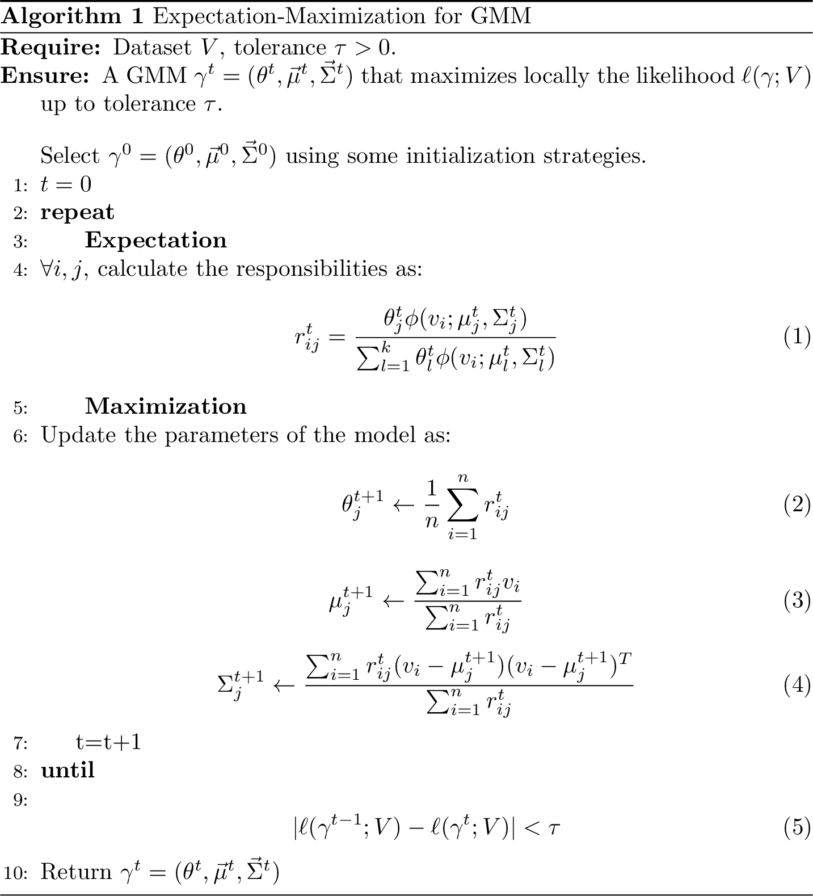
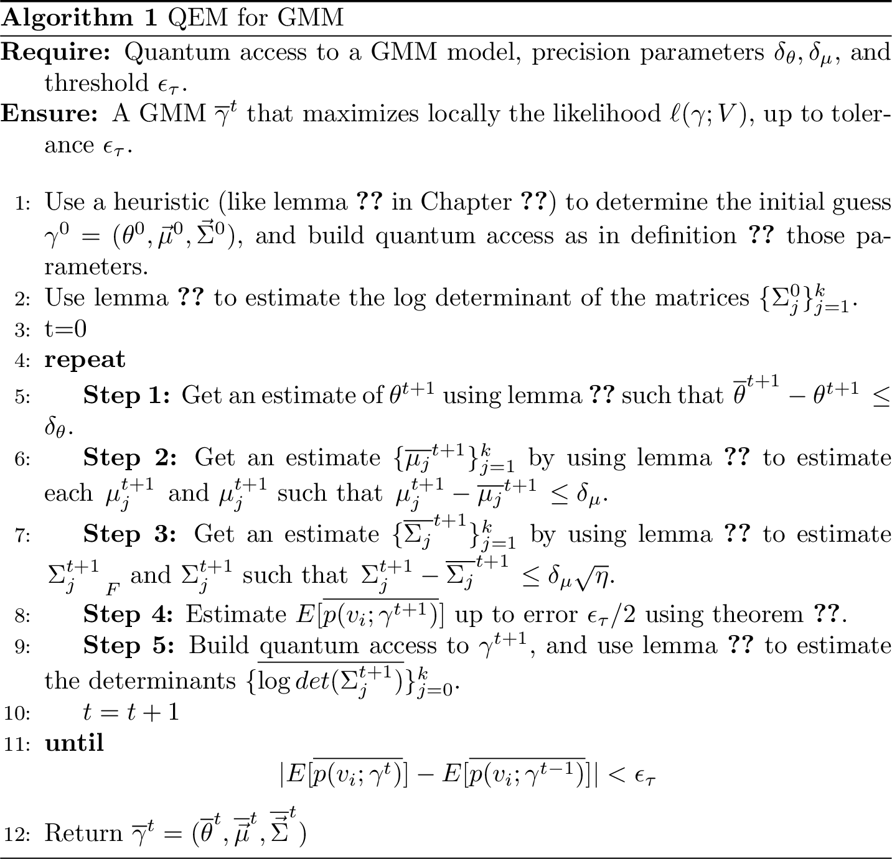

---
output:
  pdf_document: default
  html_document: default
---

# Quantum Expectation-Maximization {#chap:qem}

In this chapter we discuss the quantum version of Expectation-Maximization (EM). EM is an iterative algorithm that have been broadly used (and re-discovered) in many part of machine learning and statistics. As is common in machine learning literature, we introduce the Expectation-Maximization algorithm by using it to fit Gaussian mixture models (GMM). As the name hints, a Gaussian mixture model is a way of describing a probability density function as a combination of different Gaussian distributions. GMM, and in general all the mixture models, are a popular generative model in machine learning.


## Expectation-Maximization for Gaussian mixture models
The intuition behind mixture models is to model complicated distributions by using a group of simpler (usually [uni-modal](https://en.wikipedia.org/wiki/Unimodality)) distributions. In this setting, the purpose of the learning algorithm is to model the data by fitting the joint probability distribution which most likely have generated our samples. It might not be surprising thinking that, given a sufficiently large number of mixture components, it is possible to approximate any density defined in $\mathbb{R}^d$ [@murphy2012machine]. In this section we describe formally GMM, which is a popular mixture model used to solve unsupervised classification problems. Then we propose the first quantum algorithm to fit a GMM with a quantum computer. While there are many classical algorithms that can be used to fit a mixture of Gaussians (which we detail later), this quantum algorithm resemble as much as possible Expectation-Maximization: a iterative method to find (local) maxima of maximum likelihood and maximum a posteriori optimization problems, especially used in unsupervised settings. 

	
Recall that in the unsupervised case, we are given a training set of unlabeled vectors $v_1 \cdots v_n \in \mathbb{R}^d$ which we represent as rows of a matrix $V \in \mathbb{R}^{n \times d}$. 	Let $y_i \in [k]$ one of the $k$ possible labels for a point $v_i$. We posit that for a GMM the joint probability distribution of the data $p(v_i, y_i)=p(v_i | y_i)p(y_i)$, is defined as follow: $y_i \sim \text{Multinomial}(\theta)$ for $\theta \in \mathbb{R}^{k-1}$,  and $p(v_i|y_i = j) \sim \mathcal{N}(\mu_j, \Sigma_j)$. The $\theta_j$ are the *mixing weights*, i.e. the probabilities that $y_i = j$, and $\mathcal{N}(\mu_j, \Sigma_j)$ is the Gaussian distribution centered in $\mu_j \in \mathbb{R}^d$ with covariance matrix $\Sigma_j \in \mathbb{R}^{d \times d}$.

Note that the variables $y_i$ are unobserved, and thus are called *latent* variables. There is a simple interpretation for this model. We assume the data is created by first selecting an index $j \in [k]$ by sampling according to Multinomial($\theta)$, and then a vector $v_i$ is sampled from $\mathcal{N}(\mu_j, \Sigma_j)$. Fitting a GMM to a dataset reduces to finding an assignment for the parameters:

$$\gamma = (\theta, \vec{\mu}, \vec{\Sigma}) = (\theta, \mu_1, \cdots, \mu_k, \Sigma_1, \cdots, \Sigma_k)$$ 


<!-- \begin{equation} -->
<!-- \widehat{\gamma} = (\widehat \theta, \widehat{\vec{\mu}}, \widehat{\vec{\Sigma}} ) = (\widehat{\theta}, \widehat{\mu_1}, \cdots \widehat{\mu_k}, \widehat{\Sigma_1} \cdots \widehat{\Sigma_k} ) -->
<!-- \end{equation} -->

that best maximize the log-likelihood (defined in Section \@ref(chap:machinelearning)) for a given dataset. Note that while a $\mu_j$ represents a vector, we define $\vec{\mu}$ as the vector of vectors $\mu_j$, and the same goes for $\vec{\Sigma}$. We will now see how the log-likelihood is defined for a GMM. We use the letter $\phi$ to represent our *base distribution*, which in this case is the probability density function of a Gaussian $\mathcal{N}(\mu, \Sigma)$:
	\begin{equation}
		\phi(x|\mu, \Sigma) = \frac{1}{(2\pi)^{d/2} |\Sigma|^{1/2}}\exp\left(-\frac{1}{2}(x-\mu)^T\Sigma^{-1}(x-\mu)\right)
		(\#eq:gaussian)
	\end{equation}

With this formulation, a GMM is expressed as:
\begin{equation}
p(v) = \sum_{j=1}^k \theta_j \phi(v; \mu_j, \Sigma_j)
\end{equation}
where $\theta_j$ are the *mixing weights* of the multinomial distribution such
that $\sum_{j=1}^k \theta_j = 1$.	The probability for an observation $v_i$ to be assigned to the component $j$ is given by:

\begin{align}
r_{ij} = 	p(y_i = j | v_i ; \theta, \mu, \Sigma)  = \frac{\theta_j \phi(v_i; \mu_j, \Sigma_j )}{\sum_{l=1}^k \theta_l \phi(v_i; \mu_l, \Sigma_l)}. (\#eq:resp)
\end{align}

This value is called *responsibility*, and corresponds to the posterior probability of
the sample $i$ being assigned label $j$ by the current model.
More generally, for any base distribution in the mixture, the responsibility of the $i$-th vector in cluster $j$ can be written as [@murphy2012machine]:
\begin{equation}
	r_{ij} = \frac{p(y_i = j ; \gamma)p(v_i|y_i=j;\gamma) }{\sum_{j'=1}^k p(y_i = j' ; \gamma)p(v_i|y_i=j';\gamma)}
(\#eq:responsibility2)
\end{equation}


As anticipated, to find the best parameters of our generative model, we maximize the log-likelihood of the data. To conclude, for GMM, the likelihood is given by the following formula [@ng2012cs229]:

\begin{equation}
\ell(\gamma;V) = \ell(\theta, \vec \mu, \vec \Sigma;V) = \sum_{i=1}^n \log p(v_i\: ; \: \theta, \vec \mu, \vec \Sigma) = \sum_{i=1}^n \log \sum_{y_i = 1 }^k p(v_i|y_i\: ; \: \vec \mu, \vec  \Sigma)p(y_i;\theta) (\#eq:loglike)
\end{equation}

Alas, it is seldom possible to solve maximum likelihood estimation analytically	(i.e. by finding the zeroes of the derivatives of Equation \@ref(eq:loglike), and this is one of those cases. Expectation-Maximization is an iterative algorithm that solves numerically the optimization problem of ML estimation. To complicate things, the likelihood function for GMM is not convex, and thus we might find some local minima [@friedman2001elements]. Note that the algorithm used to fit GMM can return a local minimum which might be different than $\gamma^*$: the model that represents the global optimum of the likelihood function.

## Expectation-Maximization
The intuition behind EM is simple. If we were to know the latent variable $y_i$, then the log-likelihood for GMM would be:

\begin{equation}
\ell(\gamma;V) = \sum_{i=1}^n \log p(v_i \: |\: y_i; \vec \mu, \vec \Sigma) + \log p(y_i; \theta)
\end{equation}

This formula can be easily maximized with respect to the parameters $\theta, \vec{\mu}$,
and $\vec{\Sigma}$. In the Expectation step we calculate the missing variables $y_i$,
given a guess of the parameters $(\theta, \vec \mu, \vec \Sigma )$ of the model.
Then, in the Maximization step, we use the estimate of the latent variables
obtained in the Expectation step to update the estimate of the parameters.
While in the Expectation step we calculate a lower bound on the likelihood, in the Maximization step we maximize it. Since at each iteration the likelihood can
only increase, the algorithm is guaranteed to converge, albeit possibly to a local optimum
(see [@friedman2001elements] for the proof).
During the Expectation step all the responsibilities are
calculated, while in the Maximization step we update our estimate on the
parameters $\gamma^{t+1} = (\theta^{t+1}, \vec \mu^{t+1}, \vec \Sigma^{t+1} )$.

Again, note that the $\gamma^{t+1}$ might never converge to the global optimum $\gamma^* = \argmax_{\gamma} \ell (\gamma; V)$: since Equation \@ref(eq:loglike) is non-convex, any randomized algorithm can get stuck in local minima.


The stopping criterion for GMM is usually a threshold on the increment of the log-likelihood: if the log-likelihood changes less than a threshold between two iterations, then the algorithm stops. Notice that, since the value of the log-likelihood significantly depends on the amount of data points in the training sets, it is often preferable to adopt a scale-free stopping criterion, which does not depend on the number of samples. For instance, in the toolkit scikit-learn [@scikit-learn] the stopping criterion is given by a tolerance on the average increment of the log-probability, which is chosen to be smaller than a certain $\epsilon_\tau$, say $10^{-3}$. More precisely, the stopping criterion is $| \mathbb{E}[ \log p(v_i;\gamma^{t})] - \mathbb{E}[\log p(v_i;\gamma^{t+1})] | < \epsilon_\tau$ which we can estimate as $| \frac{1}{n}\sum_{i=1}^n \log p(v_i;\gamma^{t}) -\frac{1}{n}\sum_{i=1}^n \log p(v_i;\gamma^{t+1})| < \epsilon_\tau$.


```{r, classical-em, fig.cap="Classical Expectation-Maximization for Gaussian mixture models", echo=FALSE}

```


### Initialization strategies for EM {#sec:initialization} 
Unlike k-means clustering, choosing a good set of initial parameters for a mixture of Gaussian is by no means trivial, and in multivariate context is known that the solution is problem-dependent. There are plenty of proposed techniques, and here we describe a few of them. Fortunately, these initialization strategies can be directly translated into quantum subroutines without impacting the overall running time of the quantum algorithm.

The simplest technique is called *random EM*, and consists in selecting initial points at random from the dataset as centroids, and sample the dataset to estimate the covariance matrix of the data. Then these estimates are used as the starting configuration of the model, and we may repeat the random sampling until we get satisfactory results.


A more standard technique borrows directly the initialization strategy of k-means++,  proposed in [@arthur2007k], and extends it to make an initial guess for the covariance matrices and the mixing weights. The initial guess for the centroids is selected by sampling from a suitable, easy to calculate distribution. This heuristic works as following: Let $c_0$ be a randomly selected point of the dataset, as first centroid. The other $k-1$ centroids are selected by selecting a vector $v_i$ with probability proportional to $d^2(v_i, \mu_{l(v_i)})$, where $\mu_{l(v_i)}$ is the previously selected centroid that is the closest to $v_i$ in $\ell_2$ distance.
These centroids are then used as initial centroids for a round of k-means algorithm to obtain $\mu_1^0 \cdots \mu_j^0$. Then, the covariance matrices can be initialized as $\Sigma_j^0 := \frac{1}{|\mathcal{C}_j|} \sum_{i \in \mathcal{C}_j } (v_i - \mu_j)(v_i - \mu_j)^T$, where $\mathcal{C}_j$ is the set of samples in the training set that have been assigned to the cluster $j$ in the previous round of k-means. The mixing weights are estimated as $\mathcal{C}_j/{n}$. Eventually $\Sigma_j^0$ is regularized to be a PSD matrix.

There are other possible choices for parameter initialization in EM, for instance, based on *Hierarchical Agglomerative Clustering (HAC)* and the *CEM* algorithm. In CEM we run one step of EM, but with a so-called classification step between E and M. The classification step consists in a hard-clustering after computing the initial conditional probabilities (in the E step). The M step then calculates the initial guess of the parameters [@celeux1992classification]. In the small EM initialization method we run EM with a different choice of initial parameters using some of the previous strategies. The difference here is that we repeat the EM algorithm for a few numbers of iterations, and we keep iterating from the choice of parameters that returned the best partial results. For an overview and comparison of different initialization techniques, we refer to [@blomer2013simple] [@biernacki2003choosing].


#### Special cases of GMM 
What we presented in the previous section is the most general model of GMM. For simple datasets, it is common to assume some restrictions on the covariance matrices of the mixtures. The translation into a quantum version of the model should be straightforward. We distinguish between these cases:

- *Soft k-means*. This algorithm is often presented as a generalization of k-means, but it can actually be seen as special case of EM for GMM - albeit with a different assignment rule. In soft $k$-means, the assignment function is replaced by a softmax function with \emph{stiffness} parameter $\beta$. This $\beta$ represents the covariance of the clusters. It is assumed to be equal for all the clusters, and for all dimensions of the feature space. Gaussian Mixtures with constant covariance matrix (i.e. $\Sigma_j = \beta I$ for $\beta \in \mathbb{R}$) can be interpreted as a kind of soft or fuzzy version of k-means clustering. The probability of a point in the feature space being assigned to a certain cluster $j$ is:
$$r_{ij}=\frac{e^{-\beta \norm{x_i - \mu_i}^2}}{\sum_{l=1}^k e^{-\beta \norm{x_i - \mu_l}^2  }}$$
where $\beta>0$ is the stiffness parameter. This is the case where all the Gaussians have the same diagonal covariance matrix, which is uniform in all directions.
- *Spherical.* In this model, each component has its own covariance matrix, but the variance is uniform in all the directions, thus reducing the covariance matrix to a multiple of the identity matrix (i.e. $\Sigma_j = \sigma_j^2 I$ for $\sigma_j \in \mathbb{R}$).
- *Diagonal.* As the name suggests, in this special case the covariance matrix of the distributions is a diagonal matrix, but different Gaussians might have different diagonal covariance matrices.
- *Tied.* In this model, the Gaussians share the same covariance matrix, without having further restriction on the Gaussian.
- *Full.* This is the most general case, where each of the components of the mixture have a different, SDP, covariance matrix.


### Dataset assumptions in GMM {#dataset-assumption}
We make explicit an assumption on the dataset, namely that all elements of the mixture contribute proportionally to the total responsibility:

\begin{equation} 
\frac{\sum_{i=1}^n r_{ij}}{\sum_{i=1}^n r_{il}} = \Theta(1) \quad \forall j,l \in [k]  
(\#eq:assump)
\end{equation}

This is equivalent to assuming that $\theta_j/\theta_l = \Theta(1) \quad \forall j,l \in [k]$. This resembles the assumption of ``well-clusterability'' in q-means, which we saw in the previous chapter. 
The algorithm can be used even in cases where this assumption does not hold. In this case, the running time will include a factor as in Eq. \@ref(eq:assump) which for simplicity we have taken as constant in what follows. Note that classical algorithms would also find it difficult to fit the data in certain cases, for example when some of the clusters are very small. In fact, it is known (and not surprising) that if the statistical distance between the probability density function of two different Gaussian distributions is smaller than $1/2$, then we can not tell for a point $v$ from which Gaussian distribution it belongs to, even if we knew the parameters [@moitra2018algorithmic]. Only for convenience in the analysis, we also assume the dataset as being normalized such that the shortest vector has norm $1$ and define $\eta:=max_i \norm{v_i}^2$ to be the maximum norm squared of a vector in the dataset.


#### EM and other mixture models
Expectation-Maximization is widely used for fitting mixture models in machine learning [@murphy2012machine]. Most mixture models use a base distribution in the exponential family: Poisson [@church1995poisson] (when the observations are a mixture of random counts with a fixed rate of occurrences), Binomial and Multinomial (when the observations have 2 or multiple possible outcomes, like answers in a survey or a vote) and log-normal [@dexter1972packing], exponential (when samples have a latent variable that represents a failure of a certain kind, which is often modeled by the exponential distribution) [@ghitany1994exponential], Dirichlet multinomial [@yin2014dirichlet], and others.

Besides fitting mixture models based on the exponential family, the EM algorithm has several other applications. It has been used to fit mixtures of experts, mixtures of the student T distribution (which does not belong to  the exponential family, and can be fitted with EM using [@liu1995ml]) and for factor analysis, probit regression, and learning Hidden Markov Models [@murphy2012machine].


TODO check in the paper if these are the correct versions. 

```{theorem, name="Multivariate mean-value theorem [@rudin1964principles]"}
Let $U$ be an open set of $\mathbb{R}^d$. For a differentiable functions $f : U \mapsto \mathbb{R}$ it holds that  $\forall x,y \in U, \exists c$ such that  $f(x) - f(y) = \nabla f(c) \cdot (x-y)$.
```


```{proof}
Define $h : [0,1] \mapsto U$ where $h(t) = x+t(y-x)$. We can define a new function  $g(t) := f \circ h = f(x+t(y-x))$. Note that both functions are differentiable, and so its their composition. Therefore, we can compute the derivative of $g$ using the chain rule: $g'=(f \circ h)' = (f' \circ h)h'$. This gives:
	   $$g'(t) = (\nabla f(h(t)), h'(t)) = (f(x+t(y-a)), y-x)$$
	Because of the one-dimensional Mean Value theorem applied to $g'(t)$, we have that $\exists t_0$ such that $g(1) - g(0) = f(y) - f(x) = g'(t_0) = (f(x+t_0(y-x)), y-x)$. Setting $c=x +t_0(y-x)$, we have that $f(y) - f(x) = \nabla f(c) \cdot (y-x)$.
```


```{theorem, softmax, name="Componentwise *softmax* function is Lipschitz continuous"}
For $d>2$, let $\sigma_j : \R^d \mapsto (0,1)$ be the softmax function defined as $\sigma_j(v) = \frac{e^{v_j}}{\sum_{l=1}^de^{v_l}}$. Then $\sigma_j$ is Lipschitz continuous, with $K \leq \sqrt{2}$.
```

```{proof}
We need to find the $K$ such that for all $x,y \in \R^d$, we have that  $\norm{\sigma_j(y) - \sigma_j(x)} \leq K\norm{y-x}$. Observing that $\sigma_j$ is differentiable and that if we apply Cauchy-Schwarz to the statement of the mean-value-theorem we derive that $ \forall x,y \in U, \: \exists c$ such that  $\norm{f(x) - f(y)} \leq \norm{\nabla f(c)}_F \norm{x-y}$.
		So to show Lipschitz continuity it is enough to select $K \leq\norm{\nabla \sigma_j}_F^{*} = \max_{c \in \R^d} \norm{\nabla \sigma_j(c)}$.
The partial derivatives $\frac{d \sigma_j(v)}{d v_i}$ are $\sigma_j(v)(1-\sigma_j(v))$ if $i=j$ and $-\sigma_i(v)\sigma_j(v)$ otherwise.
So $\norm{\nabla \sigma_j}_F^2 = \sum_{i=1}^{d-1} (-\sigma(v)_i\sigma_j(v))^2 + \sigma_j(v)^2(1-\sigma_j(v))^2  \leq \sum_{i=1}^{d-1} \sigma(v)_i\sigma_j(v) + \sigma_j(v)(1-\sigma_j(v)) \leq \sigma_j(v) \sum_{i=0}^{d-1} \sigma_i(v) + 1 - \sigma_j(v) \leq 2\sigma_j(v) \leq 2$.
In our case we can deduce that:	$\norm{\sigma_j(y) - \sigma_j(x)} \leq \sqrt{2} \norm{y-x}$ so $K\leq \sqrt{2}$.

```


## Quantum Expectation-Maximization for GMM {#section:quantum gmm}
In this section, we present a quantum Expectation-Maximization algorithm to fit a GMM. The algorithm can also be adapted to fit other mixtures models where the probability distributions belong to the exponential family. As the GMM is both intuitive and one of the most widely used mixture models, our results are presented for the GMM case.

#### An approximate version of GMM
Here we define an approximate version of GMM, that we fit with QEM algorithm. The difference between this formalization and the original GMM is simple. Here we make explicit in the model the approximation error introduced during the iterations of the training algorithm.

```{definition, approxgmm, name="Approximate GMM"}
Let $\gamma^{t}=(\theta^{t}, \vec{\mu}^{t}, \vec{\Sigma}^{t}) = (\theta^{t}, \mu^{t}_1 \cdots \mu^{t}_k, \Sigma^{t}_1 \cdots \Sigma^{t}_k)$   a model fitted by the standard EM algorithm from $\gamma^{0}$ an initial guess of the parameters, i.e. $\gamma^{t}$ is the error-free model that standard EM would have returned after $t$ iterations. Starting from the same choice of initial parameters $\gamma^{0}$, fitting a GMM with the QEM algorithm with $\Delta=(\delta_\theta, \delta_\mu)$ means returning a model $\overline{\gamma}^{t} = (\overline{\theta}^{t}, \overline{\vec \mu}^{t}, \overline{\vec \Sigma}^{t})$ such that:

-  $\norm{\overline{\theta}^{t} - \theta^{t}} < \delta_\theta$,
-  $\norm{\overline{\mu_j}^{t} - \mu_j^{t}} < \delta_\mu$\: for all $j \in [k]$,
- $\norm{\overline{\Sigma_j}^{t} - \Sigma_j^{t}}  \leq \delta_\mu\sqrt{\eta}$ \: for all $j \in [k]$.

```

#### Quantum access to the mixture model
Here we explain how to load into a quantum computer a GMM and a dataset represented by a matrix $V$. This is needed for a quantum computer to be able to work with a machine learning model. The definition of quantum access to other kind of models is analogous. For ease of exposure, we define what does it means to have quantum access to a GMM and its dataset. This definition is basically an extension of theorem \@ref(def:KP-trees).

```{definition, quantumaccess-GMM, name="Quantum access to a GMM"}
We say that we have quantum access to a GMM of a dataset $V \in \R^{n\times d}$ and model parameters $\theta_j \in \mathbb{R}$, $\mu_{j} \in \R^{d}, \Sigma_{j} \in \R^{d\times d}$ for all $j\in [k]$  if we can perform in time  $O(\text{polylog}(d))$ the following mappings:

-  $\ket{j} \ket{0} \mapsto \ket{j}\ket{\mu_j}$,
- $\ket{j} \ket{i} \ket{0} \mapsto \ket{j} \ket{i}\ket{\sigma_i^j}$ for $i \in [d]$ where $\sigma_i^{j} $ is the $i$-th rows of $\Sigma_j \in \mathbb{R}^{d \times d}$,
- $\ket{i}\ket{0}\mapsto\ket{i}\ket{v_i}$ for all $i \in [n]$,
- $\ket{i}\ket{0}\ket{0}\mapsto\ket{i}\ket{\text{vec}[v_iv_i^T]} = \ket{i}\ket{v_i}\ket{v_i}$ for $i \in [n]$,
- $\ket{j} \ket{0}\mapsto \ket{j}\ket{\theta_j}$.

```


<!-- % %At the end of this section we describe a subroutine useful to evaluate the log-likelihood of a given model, and therefore can be used as test for the stopping criteria.  -->
<!-- % %We begin by defining what it means for a quantum computer to have access to a GMM.  -->


```{r, quantum-em, fig.cap="Classical Expectation-Maximization for Gaussian mixture models", echo=FALSE}

```


#### Quantum initialization strategies {#qheuristics}

For the initialization of $\gamma^0$ in the quantum algorithm we can use the same initialization strategies as in classical machine learning. For instance, we can use the classical **random EM** initialization strategy for QEM.

A quantum initialization strategy can also be given using the **k-means++** initializion strategy, which we discuss in Chapter \@ref(chap:q-means). It returns $k$ initial guesses for the centroids $c_1^0 \cdots c_k^0$ consistent with the classical algorithm in time $\left(k^2 \frac{2\eta^{1.5}}{\epsilon\sqrt{\mathbb{E}(d^2(v_i, v_j))}}\right)$, where $\mathbb{E}(d^2(v_i, v_j))$ is the average squared distance between two points of the dataset, and $\epsilon$ is the tolerance in the distance estimation. From there, we can perform a full round of q-means algorithm and get an estimate for $\mu_1^0 \cdots \mu_k^0$. With q-means and the new centroids store in the QRAM we can create the state
\begin{equation}
	\ket{\psi^0} := \frac{1}{\sqrt{n}}\sum_{i=1}^{n} \ket{i} \ket{ l(v_{i})}.(\#eq:new-labels)
	\end{equation}
Where $l(v_i)$ is the label of the closest centroid to the $i$-th point. By sampling $S \in O(d)$ points from this state we get two things. First, from the frequency $f_j$ of the second register we can have an guess of $\theta_j^0 \leftarrow |\mathcal{C}_j|/n \sim f_j/S$. Then, from the first register we can estimate $\Sigma_j^0 \leftarrow \frac{}{}\sum_{i\in S}(v_i - \mu_j^0)(v_i - \mu_j^0)^T$. Sampling $O(d)$ points and creating the state in Equation \@ref(eq:new-labels) takes time $\widetilde{O}(dk\eta)$ by theorem \@ref(lem:innerproductestimation) and the minimum finding procedure, i.e. lemma \@ref(lem:find-minimum-orig).

Techniques illustrated in [@miyahara2019expectation] can also be used to quantize the CEM algorithm which needs a hard-clustering step. Among the different possible approaches, the **random** and the **small EM** greatly benefit from a faster algorithm, as we can spend more time exploring the space of the parameters by starting from different initial seeds, and thus avoid local minima of the likelihood.


### Expectation
In this step of the quantum algorithm we are just showing how to compute efficiently the responsibilities as a quantum state. First, we compute the responsibilities in a quantum register, and then we show how to put them as amplitudes of a quantum state. At each iteration of Quantum Expectation-Maximization (specifically, in the Expectation step), we assume to have quantum access to the determinant of the covariance matrices. In the next Chapters we will also detail quantum algorithms for the problem of computing the log-determinant. From the error analysis we will see that the cost of comping the log-determinant of the covariance matrices (even with classical algorithms) is smaller than the cost of the other quantum step, we can discard the cost of computing the log-determinant in the analysis of the quantum algorithms. Thus, we do not explicitly write the time to compute the determinant from now on in the algorithm and when we say that we update $\Sigma$ we include an update on the estimate of $\log(\det(\Sigma))$ as well. Classical algorithms often depend linearly on $nnz(\Sigma) {|\log(\det(\Sigma))|}$, which can be upper bounded by $\widetilde{O}(d^2)$, where $d$ is the dimension of the covariance matrix. Note that it is often the case that GMM is run with diagonal covariance matrix, thus making the estimation of the determinant trivial.


```{lemma, gaussian, name="Quantum Gaussian Evaluation"}
Suppose we have  stored in the QRAM a matrix $V \in \mathbb{R}^{n \times d}$, the centroid $\mu \in \mathbb{R}^d$ and a SPD covariance matrix $\Sigma \in \mathbb{R}^{d \times d}$ of a multivariate Gaussian distribution $\phi(v | \mu, \Sigma)$, such that $\norm{\Sigma} \leq 1$. Also assume to have an absolute $\epsilon_1/2$ estimate for $\log(\det(\Sigma))$. Then for $\epsilon_1>0$, there exists a quantum algorithm that with probability $1-\gamma$ performs the mapping $U_{G, \epsilon_1 } : \ket{i} \ket{0} \to \ket{i}\ket{\overline{s_i}}$  such that $|s_i - \overline{s_i}| < \epsilon_{1}$, where $s_i = - \frac{1}{2} ((v_i-\mu)^T\Sigma^{-1}(v_i-\mu) + d \log 2\pi + \log (det(\Sigma)))$  is the exponent for the Gaussian probability density function in Equation \@ref(eq:gaussian). The running time of the algorithm is,
$$T_{G,\epsilon_1} = O\left(\frac{\kappa(\Sigma)\mu(\Sigma) \log (1/\gamma) }{\epsilon_1}\eta \right).$$
```


```{proof}
We use quantum linear algebra and inner product estimation to estimate the quadratic form $(v_i-\mu)^T\Sigma^{-1}(v_i-\mu)$ to error $\epsilon_{1}$. We decompose the quadratic form as $v_i^T\Sigma^{-1}v_i - 2v_i^T\Sigma^{-1}\mu + \mu^T\Sigma^{-1}\mu$ and separately approximate each term in the sum to error $\epsilon_{1}/8$ using lemma \@ref(lem:quadratic-forms). The runtime for this operation is $O(\frac{\mu(\Sigma)\kappa(\Sigma)\eta}{\epsilon_1})$. With this, we obtain an estimate for $\frac{1}{2} ((v_i-\mu)^T\Sigma^{-1}(v_i-\mu)$ within error $\epsilon_{1}$. Recall that (through  the algorithm in lemma \ref{lemma: absolute error logdet} we also have an estimate of the log-determinant to error $\epsilon_1/2$. With these factors, we obtain an approximation for $- \frac{1}{2} ((v_i-\mu)^T\Sigma^{-1}(v_i-\mu) + d \log 2\pi + \log (\det(\Sigma)))$ within error $\epsilon_{1}$.
```


Using controlled operations it is simple to extend the previous theorem to work with multiple Gaussians distributions $(\mu_j,\Sigma_j)$. That is, we can control on a register $\ket{j}$ to do $\ket{j}\ket{i} \ket{0} \mapsto \ket{j}\ket{i}\ket{\phi(v_i|\mu_j,\Sigma_j)}$. In the next lemma we will see how to obtain the responsibilities $r_{ij}$ using the previous theorem and standard quantum circuits for doing arithmetic, controlled rotations, and amplitude amplification. The lemma is stated in a general way, to be used with any probability distributions that belong to an exponential family.

```{lemma, respsoftmaxed, name="Error in the responsibilities of the exponential family"}
Let $v_i \in \R^{n}$ be a vector, and let $\{ p(v_i | \nu_j)\}_{j=1}^k$ be a set of $k$ probability distributions in the exponential family, defined as $p(v_i | \nu_j):=h_j(v_i)exp\{o_j(\nu_j)^TT_j(v_i) - A_j(\nu_j)\}$. Then, if we have estimates for each exponent with error $\epsilon$, then we can compute each $r_{ij}$ such that $|\overline{r_{ij}} - r_{ij}| \leq \sqrt{2k}\epsilon$ for $j \in [k]$.
```

```{proof}
The proof follows from rewriting the responsibility of Equation \@ref(eq:resp) and \@ref(eq:responsibility2) as:
\begin{equation}
			r_{ij}  := \frac{h_j(v_i)\exp \{ o_j(\nu_j)^TT(v_i) - A_j(\nu_j)  \  + \log \theta_j \}}{\sum\limits_{l=1}^k h_l(v_i)\exp \{ o_l(\nu_l)^TT(v_i) - A_l(\nu_l)  \  + \log \theta_l \} }
\end{equation}

In this form, it is clear that the responsibilities can be seen a softmax function, and we can use theorem \@ref(thm:softmax) to bound the error in computing this value.
		%Note that in this case the error in $\log \theta_j$ is also relative, so it will not impact the whole error in the exponent.

Let $T_i \in \mathbb{R}^k$ be the vector of the exponent, that is $t_{ij} = o_j(\nu_j)^TT(v_i) - A_j(\nu_j)  + \log \theta_j$. In an analogous way we define $\overline{T_i}$ the vector where each component is the estimate with error $\epsilon$. The error in the responsibility is defined as $|r_{ij} - \overline{r_{ij}}| = |\sigma_j(T_i) - \sigma_j(\overline{T_i}) |$. Because the function $\sigma_j$ is Lipschitz continuous, as we proved in theorem \@ref(thm:softmax) with a Lipschitz constant $K\leq \sqrt{2}$, we have that, $|  \sigma_j(T_i) - \sigma_j(\overline{T_i})  | \leq \sqrt{2} \norm{T_i - \overline{T_i}}$. The result follows as $\norm{T_i - \overline{T_i}} < \sqrt{k}\epsilon$.
```

	The next lemma provides a quantum algorithm for calculating the responsibilities for the particular case of a Gaussian mixture model.

```{lemma, responsibility, name="Calculating responsibilities"}
Suppose we have quantum access to a GMM with parameters $\gamma^{t}=(\theta^{t}, \vec \mu^{t}, \vec \Sigma^{t})$. There are quantum algorithms that can:

-  Perform the mapping $\ket{i}\ket{j}\ket{0} \mapsto \ket{i}\ket{j}\ket{\overline{r_{ij}}}$ such that $|\overline{r_{ij}} - r_{ij}| \leq \epsilon_1$ with probability $1-\gamma$ in time:
			$$T_{R_1,\epsilon_1} =  \widetilde{O}(k^{1.5} \times T_{G,\epsilon_1})$$
- For a given $j \in [k]$, construct state $\ket{\overline{R_j}}$ such that $\norm{\ket{\overline{R_j}} - \frac{1}{\sqrt{Z_j}}\sum\limits_{i=0}^n r_{ij}\ket{i}} < \epsilon_1$ where $Z_j=\sum\limits_{i=0}^n r_{ij}^2$ with high probability in time:
			$$T_{R_2,\epsilon_1} = \widetilde{O}(k^{2} \times T_{R_1,\epsilon_1})$$

```


```{proof}
For the first statement, we start by recalling the definition of responsibility: $r_{ij} = \frac{\theta_j \phi(v_i; \mu_j, \Sigma_j )}{\sum_{l=1}^k \theta_l \phi(v_i; \mu_l, \Sigma_l)}$. With the aid of $U_{G, \epsilon_1}$ of lemma \@ref(lem:gaussian) we can estimate $\log (\phi(v_i|\mu_j, \Sigma_j))$ for all $j$ up to additive error $\epsilon_1$, and then using the current estimate of $\theta^t$,  we can calculate the responsibilities create the state,
		$$\frac{1}{\sqrt{n}} \sum_{i=0}^{n} \ket{i} \Big( \bigotimes_{j=1}^k \ket{j}\ket{ \overline{ \log (\phi(v_i|\mu_j, \Sigma_j) }} \Big) \otimes  \ket{\overline{r_{ij}} }.$$
The estimate $\overline{r_{ij}}$ is computed by evaluating a weighted softmax function with arguments $\overline{ \log (\phi(v_i|\mu_j, \Sigma_j) }$ for $j\in [k]$. The estimates $\overline{ \log (\phi(v_i|\mu_j, \Sigma_j) }$ are then uncomputed.
		The runtime of the procedure is given by calling $k$ times lemma \@ref(lem:gaussian) for Gaussian estimation (the runtime for arithmetic operations to calculate the responsibilities are absorbed).

Let us analyze the error in the estimation of $r_{ij}$. The responsibility $r_{ij}$ is a softmax function with arguments $\log (\phi(v_i|\mu_j, \Sigma_j))$ that are computed up to error $\epsilon_1$ using lemma \@ref(lem:gaussian). As the softmax function has a Lipschitz constant $K\leq \sqrt{2}$ by lemma \@ref(lem:respsoftmaxed), we choose precision for lemma \@ref(lem:gaussian) to be $\epsilon_1/\sqrt{2k}$ to get the guarantee $|\overline{r_{ij}} - r_{ij} | \leq \epsilon_1$. Thus, the total cost of this step is $T_{R_1,\epsilon_1} = k^{1.5} T_{G,\epsilon_1}$.


We we see how to encode this information in the amplitudes, as stated in the second claim of the lemma. We estimate the responsibilities $r_{ij}$ to some precision $\epsilon$ and perform a controlled rotation on an ancillary qubit to obtain,

\begin{equation}\label{postselectme}
			\frac{1}{\sqrt{n}} \ket{j} \sum_{i=0}^{n} \ket{i} \ket{\overline{r_{ij}}}\Big(\overline{r_{ij}}\ket{0} + \sqrt{1-\overline{r_{ij}}^2  }\ket{1}\Big).
\end{equation}

We then undo the circuit on the second register and perform amplitude amplification on the rightmost auxiliary qubit being $\ket{0}$ to get  $\ket{\overline{R_j}}:=\frac{1}{\norm{\overline{R_j} }}\sum_{i=0}^n \overline{r_{ij}}\ket{i}$. The runtime for amplitude amplification on this task is $O(T_{R_1,\epsilon} \cdot \frac{\sqrt{n}}{ \;\norm{\overline{R_j} } \; })$.

Let us analyze the precision $\epsilon$ required to prepare $\ket{\overline{R_j}}$ such that $\norm{\ket{R_j} - \ket{\overline{R_j}}} \leq \epsilon_{1}$. As we have estimates $|r_{ij}-\overline{r_{ij}}|<\epsilon$ for all $i, j$, the $\ell_{2}$-norm error $\norm{ R_j - \overline{R_{j}}} = \sqrt{\sum_{i=0}^n | r_{ij} -  \overline{r_{ij}} |^2 }< \sqrt{n}\epsilon$.

Applying Claim \@ref(lem:kereclaim), the error for the normalized vector $\ket{R_j}$ can be bounded as $\norm{\ket{R_j} - \ket{\overline{R_j}}} < \frac{\sqrt{2n}\epsilon}{\norm{R_j}}$. By the Cauchy-Schwarz inequality we have that $\norm{R_j} \geq  \frac{\sum_i^n r_{ij}}{\sqrt{n}}$. We can use this to obtain a bound $\frac{\sqrt{n}}{\norm{R_j}}<\frac{\sqrt{n}}{\sum_i r_{ij}}\sqrt{n} = O(k)$, using the dataset assumptions in section \@ref(dataset-assumption). If we choose $\epsilon$ such that $\frac{\sqrt{2n}\epsilon}{\norm{R_j}} < \epsilon_1$, that is $\epsilon \leq \epsilon_1/k$ then our runtime becomes $T_{R_2,\epsilon_1} := \widetilde{O}(k^{2} \times T_{R_1,\epsilon_1})$.
```


### Maximization
Now we need to get a new estimate for the parameters of our model. This is the idea: at each iteration we recover the new parameters from the quantum algorithms as quantum states, and then by performing tomography we can update the QRAM that gives us quantum access to the GMM for the next iteration. In these sections we will show how.
	
#### Updating mixing weights $\theta$

```{lemma, theta, name="Computing mixing weights"}
We assume quantum access to a GMM with parameters $\gamma^{t}$ and let $\delta_\theta > 0$ be a precision parameter. There exists an algorithm that estimates $\overline{\theta}^{t+1} \in \mathbb{R}^k$ such that $\norm{\overline{\theta}^{t+1}-\theta^{t+1}}\leq \delta_\theta$ in time
$$T_\theta = O\left(k^{3.5} \eta^{1.5} \frac{ \kappa(\Sigma)\mu(\Sigma) }{\delta_\theta^2}  \right)$$
```
	
```{proof}
An estimate of $\theta^{t+1}_j$ can be recovered from the following operations. First, we use lemma \@ref(lem:responsibility) (part 1) to compute the responsibilities to error $\epsilon_1$, and then perform the following mapping, which consists of a controlled rotation on an auxiliary qubit:

$$\frac{1}{\sqrt{nk}}\sum_{\substack{i =1 \\j =1}}^{n,k}\ket{i}\ket{j}\ket{\overline{r_{ij}}^{t} } \mapsto  \frac{1}{\sqrt{nk}}\sum_{\substack{i =1 \\j =1}}^{n,k}\ket{i}\ket{j}\Big( \sqrt{\overline{r_{ij}}^{t}}\ket{0} + \sqrt{1-\overline{r_{ij}}^{t}}\ket{1} \Big)$$

The previous operation has a cost of $T_{R_1,\epsilon_1}$, and the probability of getting $\ket{0}$ is $p(0) = \frac{1}{nk} \sum_{i=1}^{n}\sum_{j=1}^k r_{ij}^{t} = \frac{1}{k}$. Now observe that, by definition, $\theta_j^{t+1} = \frac{1}{n}\sum_{i=1}^n r^{t}_{ij}$.

Let $Z_j = \sum_{i=1}^n \overline{r_{ij}}^{t}$ and define state $\ket{\sqrt{R_j}} = \left(\frac{1}{\sqrt{Z_j}} \sum_{i=1}^n \sqrt{ \overline{r_{ij}}^{t} }\ket{i}\right)\ket{j}$.
After amplitude amplification on $\ket{0}$ we have the state,

\begin{align}\label{eq:theta}
		\ket{\sqrt{R}} &:= \frac{1}{\sqrt{n}} \sum_{\substack{i =1 \\j =1}}^{n,k} \sqrt{  \overline{r_{ij}}^{t}  }\ket{i}\ket{j}\nonumber \\
		&= \sum_{j=1}^k\sqrt{\frac{Z_j}{n}} \left(\frac{1}{\sqrt{Z_j}} \sum_{i=1}^n \sqrt{ \overline{r_{ij}}^{t} }\ket{i} \right) \ket{j}   \nonumber\\
		&=  \sum_{j=1}^k\sqrt{\overline{\theta_j}^{t+1} }\ket{\sqrt{R_j}}\ket{j}. %\ket{j} =  \sum_{j=1}^k\sqrt{\overline{\theta_j^{t+1}} }\ket{j}\ket{\sqrt{G_j}}. %\sum_{j=1}^k\sqrt{\frac{Z_j}{n}}\ket{\sqrt{R_j}}\ket{j}
\end{align}

The probability of obtaining outcome $\ket{j}$ if the second register is measured in the standard basis is $p(j)=\overline{\theta_j}^{t+1}$. An estimate for $\theta_j^{t+1}$ with precision $\epsilon$ can be obtained by either sampling  the last register, or by performing amplitude estimation. In this case, we can estimate each of the values $\theta^{t+1}_j$ for $j \in [k]$. Sampling requires $O(\epsilon^{-2})$ samples to get epsilon accuracy on $\theta$ (by the Chernoff bounds), but does not incur any dependence on $k$. As the number of cluster $k$ is relatively small compared to $1/\epsilon$, we chose to do amplitude estimation to estimate all $\theta^{t+1}_j$ for $j \in [k]$ to error $\epsilon/\sqrt{k}$ in time,

\begin{equation} T_\theta := O\left(k\cdot \frac{\sqrt{k}T_{R_1,\epsilon_1}}{\epsilon} \right).
\end{equation}

We analyze the error in this procedure. The error introduced by the estimation of responsibility in lemma \@ref(lem:responsibility) is  $|\overline{\theta_j}^{t+1} - \theta_j^{t+1}|
= \frac{1}{n} \sum_i | \overline{r_{ij}}^{t} - r_{ij}^{t}| \leq \epsilon_{1}$ for all $j \in [k]$, pushing the error on the vector $\theta^{t+1} \in \R^k$ up to $\norm{ \overline{\theta}^{t+1} - \theta^{t+1} }  \leq \sqrt{k}  \epsilon_{1}$.

The total error in $\ell_{2}$ norm due to amplitude estimation is at most $\epsilon$ as it estimates each coordinate of $\overline{\theta_j}^{t+1}$ to error $\epsilon/\sqrt{k}$. As the errors sums up additively, we can use the triangle inequality to bound them. The total error is at most $\epsilon  + \sqrt{k}\epsilon_1$. As we require the final error to be upper bounded by $\norm{\overline{\theta}^{t+1} - \theta^{t+1}} < \delta_\theta$, we choose parameters 	$\sqrt{k}\epsilon_1 < \delta_\theta/2  \Rightarrow \epsilon_1 < \frac{\delta_\theta}{2\sqrt{k}}$ and $\epsilon < \delta_\theta/2$. With these parameters, the overall running time of the quantum procedure is
$T_\theta = O(k^{1.5} \frac{T_{R_1,\epsilon_1}}{\epsilon}) = O\left(k^{3.5} \frac{ \eta^{1.5}\cdot \kappa^2(\Sigma)\mu(\Sigma) }{\delta_\theta^2}  \right)$.
```


#### Updating the centroids $\mu_j$ 
We use quantum linear algebra to transform the uniform superposition of responsibilities of the $j$-th mixture into the new centroid of the $j$-th Gaussian. Let $R_j^{t} \in \R^{n}$ be the vector of responsibilities for a Gaussian $j$ at iteration $t$. The following claim relates the vectors  $R_j^{t}$ to the centroids $\mu_j^{t+1}$.

```{lemma, centroid-claim} 
Let $R_j^t \in \mathbb{R}^n$ be the vector of responsibilities of the points for the Gaussian $j$ at time $t$, i.e. $(R_j^t)_{i} = r_{ij}^{t}$. Then $\mu_j^{t+1} \leftarrow \frac{\sum_{i=1}^n r^{t}_{ij} v_i }{ \sum_{i=1}^n r^{t}_{ij}} = \frac{V^T R^t_j}{n\theta_j}$.
```
The proof is straightforward.


```{lemma, centroids, name="Computing new centroids"}
We assume we have quantum access to a GMM with parameters $\gamma^{t}$. For a precision parameter $\delta_\mu > 0$, there is a quantum algorithm that calculates $\{ \overline{\mu_j}^{t+1} \}_{j=1}^k$ such that for all $j\in [k]$ $\norm{\overline{\mu_j}^{t+1} -\mu_j^{t+1}}\leq \delta_\mu$  in time
$$ T_\mu = \widetilde{O}\left(    \frac{k d\eta \kappa(V) (\mu(V) + k^{3.5}\eta^{1.5}\kappa(\Sigma)\mu(\Sigma))}{\delta_{\mu}^3}  \right)$$
```

```{proof}
A new centroid $\mu_j^{t+1}$ is estimated by first creating an approximation of the state $\ket{R_j^t}$ up to error $\epsilon_1$ in the $\ell_{2}$-norm using part 2 of lemma \@ref(lem:responsibility). Then, we use the quantum linear algebra algorithms in theorem \@ref(thm:qla) to multiply $R_j$ by $V^T$, and obtain a state $\ket{\overline{\mu_j}^{t+1}}$ along with an estimate for the norm $\norm{V^TR_j^t} = \norm{\overline{\mu_j}^{t+1}}$ with error $\epsilon_3$. The last step of the algorithm consists in estimating the unit vector $\ket{\overline{\mu_j}^{t+1}}$ with precision $\epsilon_4$, using $\ell_2$ tomography. The tomography depends linearly on $d$, which we expect to be bigger than the precision required by the norm estimation. Thus, we assume that the runtime of the norm estimation is absorbed by the runtime of tomography. We obtain a final runtime of $\widetilde{O}\left( k  \frac{d}{\epsilon_4^2} \cdot  \kappa(V) \left( \mu(V) + T_{R_2,\epsilon_1} \right)  \right)$.

We now analyze the total error in the estimation of the new centroids. In order to satisfy the condition of the robust GMM of definition \@ref(def:approxgmm), we want the error on the centroids to be bounded by $\delta_{\mu}$. For this, Claim \@ref(lem:quattrocinque) help us choose the parameters such that $\sqrt{\eta}(\epsilon_{tom}+\epsilon_{norm})=\delta_\mu$. Since the error $\epsilon_2$ for quantum linear algebra appears as a logarithmic factor in the running time, we can choose $\epsilon_2 \ll\epsilon_4$ without affecting the runtime.

```

<!-- Let $\overline{\mu}$ be the classical unit vector obtained after quantum tomography, and $\widehat{\ket{\mu}}$ be the state produced by the quantum linear algebra procedure starting with an approximation of $\ket{R_j^t}$. -->
<!-- Using the triangle inequality we have $\norm{\ket{\mu} - \overline{\mu} } < \norm{ \overline{\mu} - \widehat{\ket{\mu}}} + \norm{\widehat{\ket{\mu}} - \ket{\mu}} < \epsilon_4 + \epsilon_1 < \epsilon_{tom} < \delta_{\mu}/2\sqrt{\eta}$. -->
<!-- The errors for the norm estimation procedure can be bounded similarly as $| \norm{\mu} - \overline{\norm{\mu}} | < | \norm{\mu} - \widehat{\norm{\mu}} | + | \overline{\norm{\mu}} - \widehat{\norm{\mu}} |  <  \epsilon_3 + \epsilon_1 < \epsilon_{norm} \leq \delta_{\mu}/2\sqrt{\eta}$. We therefore choose parameters  $\epsilon_4 = \epsilon_1  = \epsilon_3 \leq \delta_{\mu}/4\sqrt{\eta}$. Again, as the amplitude estimation step we use for estimating the norms does not depends on $d$, which is expected to dominate the other parameters, we omit the cost for the amplitude estimation step. We have the more concise expression for the running time of: -->
<!-- \begin{equation} -->
<!-- 	\widetilde{O}\left(    \frac{k d\eta \kappa(V) (\mu(V) + k^{3.5}\eta^{1.5}\kappa(\Sigma)\mu(\Sigma))}{\delta_{\mu}^3}  \right) -->
<!-- \end{equation} -->


```{lemma, sigma, name="Computing covariance matrices"}
We assume we have quantum access to a GMM with parameters $\gamma^{t}$. We also have computed estimates $\overline{\mu_j}^{t+1}$ of all centroids such that $\norm{ \overline{\mu_j}^{t+1} - \mu_j^{t+1}  }\leq \delta_\mu$ for precision parameter $\delta_\mu > 0$. Then, there exists a quantum algorithm that outputs estimates for the new covariance matrices $\{ \overline{\Sigma}^{t+1}_j \}_{j=1}^k$ such that $\norm{\Sigma_j^{t+1}- \overline{\Sigma}^{t+1}_j}_F \leq  \delta_\mu\sqrt{\eta}$ with high probability, in time,
	$$
	T_\Sigma := \widetilde{O} \Big( \frac{kd^2 \eta\kappa(V)(\mu(V')+\eta^{2.5}k^{3.5}\kappa(\Sigma)\mu(\Sigma))}{\delta_{\mu}^3} \Big)
	$$
```

```{proof}
It is simple to check, that the update rule of the covariance matrix during the maximization step can be reduced to [@murphy2012machine] Exercise 11.2. 

\begin{align}\Sigma_j^{t+1} \leftarrow \frac{\sum_{i=1}^n r_{ij}  (v_i - \mu_j^{t+1})(v_i - \mu_j^{t+1})^T}{\sum_{i=1}^n r_{ij}} & = \frac{\sum_{i=1}^n r_{ij}v_iv_i^T }{n\theta_j} - \mu_j^{t+1}(\mu_j^{t+1})^T \\
		&=\Sigma_j'- \mu_j^{t+1}(\mu_j^{t+1})^T 
		(\#eq:covmat)
\end{align}

First, let's note that we can use the previously obtained estimates of the centroids to compute the outer product $\mu_j^{t+1} (\mu_j^{t+1})^T$ with error $\delta_\mu \norm{ \mu} \leq \delta_\mu \sqrt{\eta}$. The error in the estimates of the centroids is $\overline{\mu} = \mu + e$ where $e$ is a vector of norm $\delta_\mu$. Therefore $\norm{\mu \mu^T - \overline{\mu}\:\overline{\mu}^T} < 2\sqrt{\eta}\delta_\mu + \delta_\mu^2 \leq 3\sqrt{\eta}\delta_\mu$. Because of this, we allow an error of $\sqrt{\eta}\delta_\mu$ also for the term $\Sigma'_j$.
Now we discuss the procedure for estimating $\Sigma_j'$. We estimate $\ket{\text{vec}[\Sigma_j']}$ and $\norm{\text{vec}[\Sigma_j']}$. To do it, we start by using quantum access to the norms and part 1 of lemma \@ref(responsibility). With them, for a cluster $j$, we start by creating the state $\ket{j}\frac{1}{\sqrt{n}}\sum_i \ket{i}\ket{r_{ij}}$, Then, we use quantum access to the norms to store them into another register $\ket{j}\frac{1}{\sqrt{n}}\sum_i \ket{i}\ket{r_{ij}}\ket{\norm{v_i}}$. Using an ancilla qubit we can obtain perform a rotation, controlled on the responsibilities and the norm, and obtain the following state:

$$\ket{j}\frac{1}{\sqrt{n}}\sum_i^n \ket{i}\ket{r_{ij}}\ket{\norm{v_i}}\left(\frac{r_{ij}\norm{v_i}}{\sqrt{\eta}} \ket{0} + \gamma\ket{1} \right)$$
We undo the unitary that created the responsibilities in the second register and the query on the norm on the third register, and we perform amplitude amplification on the ancilla qubit being zero. The resulting state can be obtained in time $O(R_{R_1,\epsilon_1}\frac{\sqrt{n\eta}}{\norm{V_R}})$, where $\norm{V_R}$ is $\sqrt{\sum_i r_{ij}^2\norm{v_i}^2}$. Successively, we query the QRAM for the vectors $v_i$ and we obtain the following state:
\begin{equation}
\frac{1}{V_R}\sum_i r_{ij}\norm{v_i}\ket{i}\ket{v_i}
\end{equation}
On which we can apply quantum linear algebra subroutine, multiplying the first register with the matrix $V^T$. This will lead us to the desired state $\ket{\Sigma_j'}$, along with an estimate of its norm.

As the runtime for the norm estimation $\frac{\kappa(V)(\mu(V) + T_{R_2,\epsilon_1}))\log(1/\epsilon_{mult})}{\epsilon_{norms}}$ does not depend on $d$, we consider it smaller than the runtime for performing tomography. Thus, the runtime for this operation is:
		$$O(\frac{d^2\log d}{\epsilon^2_{tom}}\kappa(V)(\mu(V) + T_{R_2, \epsilon_1}))\log(1/\epsilon_{mult})).$$

Let's analyze the error of this procedure. We want a matrix $\overline{\Sigma_j'}$ that is $\sqrt{\eta}\delta_\mu$-close to the correct one: $\norm{\overline{\Sigma_j'} - \Sigma'_j}_F = \norm{\text{vec}\overline{[\Sigma_j']} - \text{vec}[\Sigma'_j]}_2 < \sqrt{\eta}\delta_\mu$. Again, the error due to matrix multiplication can be taken as small as necessary, since is inside a logarithm. From Claim \@ref(lem:quattrocinque), we just need to fix the error of tomography and norm estimation such that 		$\eta(\epsilon_{unit} + \epsilon_{norms}) < \sqrt{\eta}\delta_{\mu}$ where we have used $\eta$ as an upper bound on $\norm{\Sigma_j}_F$.  For the unit vectors, we require
		$\norm{\ket{\Sigma'_j} - \overline{\ket{\Sigma'_j}} } \leq \norm{ \overline{\ket{\Sigma'_j}} - \widehat{\ket{\Sigma'_j}}} + \norm{\widehat{\ket{\Sigma'_j}} - \ket{\Sigma'_j}} < \epsilon_4 + \epsilon_1 \leq \eta\epsilon_{unit} \leq \frac{\delta_{\mu}\sqrt{\eta}}{2}$, where
		$\overline{\ket{\Sigma'_j}}$ is the error due to tomography and $\widehat{\ket{\Sigma'_j}}$ is the error due to the responsibilities in lemma \@ref(lem:responsibility). For this inequality to be true, we choose $\epsilon_4 = \epsilon_1 < \frac{\delta_\mu/\sqrt{\eta}}{4}$.


The same argument applies to estimating the norm $\norm{\Sigma_j'}$ with relative error :
		$|\norm{\Sigma'_j} - \overline{\norm{\Sigma'_j}} |  \leq  | \overline{\norm{\Sigma'_j}} - \widehat{\norm{\Sigma'_j}}| + |\widehat{\norm{\Sigma'_j}} - \norm{\Sigma'_j}| < \epsilon + \epsilon_1 \leq \delta_{\mu}/2\sqrt{\eta}$ (where here $\epsilon$ is the error of the amplitude estimation step used in theorem \@ref(thm:qla) and $\epsilon_1$ is the error in calling lemma \@ref(lem:responsibility). Again, we choose $\epsilon=\epsilon_1 \leq \frac{\delta_\mu/\sqrt{\eta}}{4}$.

Since the tomography is more costly than the amplitude estimation step, we can disregard the runtime for the norm estimation step. As this operation is repeated $k$ times for the $k$ different covariance matrices, the total runtime of the whole algorithm is given by $\widetilde{O} \Big( \frac{kd^2 \eta\kappa(V)(\mu(V)+\eta^2k^{3.5}\kappa(\Sigma)\mu(\Sigma))}{\delta_{\mu}^3} \Big)$.
Let us also recall that for each of new computed covariance matrices, we use lemma \@ref(lemma: absolute-error-logdet) to compute an estimate for their log-determinant and this time can be absorbed in the time $T_\Sigma$.

```

<!--
TODO Fix log-det citations in QEM-GMM work
-->


#### Quantum estimation of log-likelihood
Now we are going to show how it is possible to get an estimate of the log-likelihood using a quantum procedure. A good estimate of the log-likelihood is crucial, as it is used as stopping criteria for the quantum algorithm. Recall that the log-likelihood is defined as:
	$$\ell(\gamma;V)  = \sum_{i =1}^n \log \sum_{j \in [k]} \theta_j\phi(v_i; \mu_j, \Sigma_j) = \sum_{i=1}^n  \log p(v_i; \gamma)$$

Classically, we stop to iterate the EM algorithm when $|\ell(\gamma^{t}; V) - \ell(\gamma^{t+1}; V)|< n\epsilon$, or equivalently, we can set a tolerance on the average increase of the $\log$ of the probability: $| \mathbb{E}[ \log p(v_i ; \gamma^t)] -  \mathbb{E}[ \log p(v_i ; \gamma^{t+1})] |< \epsilon$. 
In the quantum algorithm it is more practical to estimate 	$\mathbb{E}[ p(v_i ; \gamma^t)] = \frac{1}{n}\sum_{i=1}^n  p(v_i; \gamma)$.  From this we can estimate an upper bound on the $\log$-likelihood (with the help of the  the Jensen inequality) as:
$$n \log \mathbb{E}[p(v_i)] = \sum_{i=1}^n \log \mathbb{E}[p(v_i)] \geq \sum_{i=1}^n \log p(v_i) = \ell(\gamma; V)$$.


```{lemma, likelihoodestimation, name="Quantum estimation of likelihood"}
We assume we have quantum access to a GMM with parameters $\gamma^{t}$. For $\epsilon_\tau > 0$, there exists a quantum algorithm that estimates  $\mathbb{E}[p(v_i  ; \gamma^{t} )]$ with absolute error $\epsilon_\tau$  in time
		$$T_\ell = \widetilde{O}\left( k^{1.5}\eta^{1.5}  \frac{\kappa(\Sigma)\mu(\Sigma)}{\epsilon_\tau^2} \right)$$
```


```{proof}
We obtain the likelihood from the ability to compute the value of a Gaussian distribution and quantum arithmetic. Using the mapping of lemma \@ref(lem:gaussian) with precision $\epsilon_1$, we can compute $\phi(v_i|\mu_j, \Sigma_j)$ for all the Gaussians.  We can build the state $\ket{i} \bigotimes_{j=0}^{k-1} \ket{j}\ket{\overline{p(v_i|j;\gamma_j)}}$. Then, by knowing $\theta$, and by using quantum arithmetic we can compute in a register the probability of a point belonging to the mixture of Gaussian's: $p(v_i; \gamma)  = \sum_{j\in[k]} \theta_j p(v_i|j;\gamma )$ (note that this operation require undoing the previous steps). for simplicity, we now drop the notation for the model $\gamma$ and write $p(v_i)$ instead of $p(v_i; \gamma)$. Doing the previous calculations in a quantum computer, leads to the creation of the state $\ket{i}\ket{p(v_i)}$. To get an estimate of $\mathbb{E}[p(v_i)]$, we perform the mapping $\ket{i}\ket{p(v_i)}\mapsto \ket{i}\left( \sqrt{p(v_i)|}\ket{0} + \sqrt{1 - p(v_i)}\ket{1} \right)$ and estimate $p(\ket{0}) \simeq \mathbb{E}[p(v_i)]$ with amplitude estimation on the ancilla qubit being zero.

To get a $\epsilon_\tau$-estimate of $p(0)$ we need to decide the precision parameter we use for estimating $\overline{p(v_i|j;\gamma)}$ and the precision required by amplitude estimation.	Let $\overline{p(0)}$ be the $\epsilon_1$-error introduced by using lemma \ref{lemma:gaussian} and $\widehat{p(0)}$ the error introduced by amplitude estimation. Using triangle inequality we set $\norm{p(0) - \widehat{p(0)}} < \norm{\widehat{p(0)} - \overline{p(0)}} + \norm{\overline{p(0)} - p(0)} < \epsilon_\tau$.

To have $| p(0) - \widehat{p(0)}| < \epsilon_\tau$, we should set $\epsilon_1$ such that $| \overline{p(0)} - p(0) | < \epsilon_\tau/4$, and we set the error in amplitude estimation and in the estimation of the probabilities to be $\epsilon_\tau/2$. The runtime of this procedure is therefore:
		$$\widetilde{O}\left(k \cdot T_{G,\epsilon_\tau} \cdot \frac{1}{\epsilon_\tau \sqrt{p(0)}}\right) = \widetilde{O}\left(k^{1.5}\eta^{1.5} \cdot \frac{\kappa(\Sigma)\mu(\Sigma)}{\epsilon_\tau^2 }\right)$$

```


#### Analysis of Quantum Expectation-Maximizaiton
```{theorem, qgmm, name="Quantum Expectation-Maximization for Gaussian mixture models"}
We assume we have quantum access to a GMM with parameters $\gamma^t$. For parameters $\delta_\theta, \delta_\mu, \epsilon_\tau > 0$, the running time of one iteration of the Quantum Expectation-Maximization (QEM) algorithm is

 $$O( T_\theta + T_\mu + T_\Sigma + T_\ell),$$

 for

- $T_\theta  = \widetilde{O}\left(k^{3.5} \eta^{1.5} \frac{ \kappa^2(\Sigma)\mu(\Sigma) }{\delta_\theta^2}  \right)$
- $T_\mu = \widetilde{O}\left(    \frac{k d\eta \kappa(V) (\mu(V) + k^{3.5}\eta^{1.5}\kappa^2(\Sigma)\mu(\Sigma))}{\delta_{\mu}^3}  \right)$
- $T_\Sigma = \widetilde{O} \Big( \frac{kd^2 \eta\kappa^2(V)(\mu(V')+\eta^2k^{3.5}\kappa^2(\Sigma)\mu(\Sigma))}{\delta_{\mu}^3} \Big)$
- $T_\ell = \widetilde{O}\left( k^{1.5}\eta^{1.5}  \frac{\kappa^2(\Sigma)\mu(\Sigma)}{\epsilon_\tau^2} \right)$

For the range of parameters of interest, the running time is dominated by $T_\Sigma$.
```

The proof follows directly from the previous lemmas. Note that the cost of the whole algorithm is given by repeating the Estimation and the Maximization steps several times, until the threshold on the log-likelihood is reached. Note also that the expression of the runtime can be simplified from the observation that the cost of performing tomography on the covariance matrices $\Sigma_j$ dominates the cost. 


<!--
TODO See if it makes sense to add MAP version of GMM
--> 


<!-- \subsection{Quantum MAP estimate of GMM} -->
<!-- Maximum likelihood is not the only way to estimate the parameters of a model, and in certain cases might not even be the best one. For instance, in high-dimensional spaces, it is standard practice for ML estimates to overfit.  -->
<!-- Moreover, it is often the case that we have prior information on the distribution of the parameters, and we would like our models to take this information into account. These issues are often addressed using a Bayesian approach, i.e. by using a so-called Maximum a posteriori estimate (MAP) of a model \cite[Section 14.4.2.8]{murphy2012machine}. MAP estimates work by assuming the existence of a \emph{prior} distribution over the parameters $\gamma$. The posterior distribution we use as objective function to maximize comes from the Bayes' rule applied on the likelihood, which gives the posterior as a product of the likelihood and the prior, normalized by the evidence. More simply, we use the Bayes' rule on the likelihood function, as $p(\gamma;V) = \frac{p(V;\gamma)p(\gamma)}{p(V)}$. This allows us to treat the model $\gamma$ as a random variable, and derive from the ML estimate a MAP estimate: -->

<!-- \begin{equation}\label{mapestimate} -->
<!-- \gamma^*_{MAP} = \argmax_\gamma \sum_{i=1}^{n} \log p(\gamma | v_i) -->
<!-- \end{equation} -->

<!-- Among the advantages of a MAP estimate over ML is that it avoids overfitting by having a kind of regularization effect on the model \cite[Section 6.5]{murphy2012machine}. Another feature consists in injecting into a maximum likelihood model some external information, perhaps from domain experts.  -->
<!-- This advantage comes at the cost of requiring ``good'' prior information on the problem, which might be non-trivial. In terms of labelling, a MAP estimates correspond to a \emph{hard clustering}, where the label of the point $v_i$ is decided according to the following rule: -->
<!-- \begin{equation}\label{argmaxmap} -->
<!-- y_i = \argmax_j r_{ij} = \argmax_j \log p(v_i|y_i = j;\gamma) + \log p(y_i = j ;\gamma)  \end{equation} -->

<!-- Deriving the previous expression is straightforward using the Bayes' rule, and by noting that the softmax is rank-preserving, and we can discard the denominator of $r_{ij}$ - since it does not depend on $\gamma$ - and it is shared among all the other responsibilities of the points $v_i$. Thus, from Equation \ref{mapestimate} we can conveniently derive Equation \ref{argmaxmap} as a proxy for the label. Fitting a model with MAP estimate is commonly done via the EM algorithm as well. The Expectation step of EM remains unchanged, but the update rules of the Maximization step are slightly different. In this work we only discuss the GMM case, for the other cases the interested reader is encouraged to see the relevant literature.  For GMM, the prior on the mixing weight is often modeled using the Dirichlet distribution, that is $\theta_j \sim \text{Dir}(\vec \alpha)$. For the rest of parameters, we assume that the conjugate prior is of the form $p(\mu_j, \Sigma_j) = NIW(\mu_j, \Sigma_j | \vec m_0, \iota_0, \nu_0, \vec S_0)$, where $\text{NIW}(\mu_j, \Sigma_j)$ is the Normal-inverse-Wishart distribution. The probability density function of the NIW is the product between a multivariate normal $\phi(\mu|m_0, \frac{1}{\iota} \Sigma)$ and a inverse Wishart distribution $\mathcal{W}^{-1}(\Sigma|\vec S_0, \nu_0)$. NIW has as support vectors $\mu$ with mean $\mu_0$ and covariance matrices $\frac{1}{\iota}\Sigma$ where $\Sigma$ is a random variable with inverse Wishart distribution over positive definite matrices. NIW is often the distribution of choice in these cases, as is the conjugate prior of a multivariate normal distribution with unknown mean and covariance matrix.  -->
<!-- A shorthand notation, let's define $r_j = n\theta_j = \sum_{i=1}^n r_{ij}$. As in [@murphy2012machine], we also denote with $\overline{x_j}^{t+1}$ and $\overline{S_j}^{t+1}$ the maximum likelihood estimate of the parameters $(\mu_j^{t+1})_{ML}$ and $(\Sigma_j^{t+1})_{ML}$. For MAP, the update rules are the following:  -->

<!-- \begin{equation} -->
<!-- \theta_j^{t+1} \leftarrow \frac{r_j +\alpha_j-1}{n + \sum_j \alpha_j - k} -->
<!-- \end{equation} -->


<!-- \begin{equation} -->
<!-- \mu_j^{t+1} \leftarrow \frac{r_j \overline{x_j}^{t+1} + \iota_0 \vec m_0 }{r_j + \iota_0} -->
<!-- \end{equation} -->


<!-- \begin{equation} -->
<!-- \Sigma^{t+1}_j \leftarrow \frac{\vec S_0 + \overline{S_j}^{t+1}+ \frac{\iota_0r_j}{\iota_0+r_j} ( \overline{x_j}^{t+1} - \vec m_0)( \overline{x_j}^{t+1} - \vec m_0)^T }{\nu_0 + r_k + d + 2} -->
<!-- \end{equation} -->

<!-- Where the matrix $\vec S_0$ is defined as: -->

<!-- \begin{equation} -->
<!-- \vec S_0 := \frac{1}{k^{1/d}} Diag(s_1^2, \cdots, s_d^2), -->
<!-- \end{equation} -->


<!-- where each value $s_j$ is computed as $s_j := \frac{1}{n}\sum_{i=1}^n (x_{ij} - \sum_{i=1}^n x_{ij}))^2$ which is the pooled variance for each of the dimension $j$. For more information on the advantages, disadvantages, and common choice of parameters of a MAP estimate, we refer the interested reader to [@murphy2012machine]. Using the QEM algorithm to fit a MAP estimate is straightforward, since once the ML estimate of the parameter is recovered from the quantum procedures, the update rules can be computed classically. -->

<!-- \begin{corollary}[QEM for MAP estimates of GMM]\label{th:qmap} -->
<!-- 	We assume we have quantum access to a GMM with parameters $\gamma^t$. For parameters $\delta_\theta, \delta_\mu, \epsilon_\tau > 0$, the running time of one iteration of the quantum maximum a posteriori (QMAP) algorithm is  -->

<!-- $$O(T_\theta + T_\mu + T_\Sigma + T_\ell),$$ -->

<!-- for -->
<!-- \begin{eqnarray*} -->
<!-- 	%T_{Det,\beta} & = & \widetilde{O} \left( \beta^{-2}\kappa(\Sigma)\log(1/\delta)nnz(\Sigma) {|\log(\det(\Sigma))|} \right) -->
<!-- 	%\\  -->
<!-- T_\theta  & = & \widetilde{O}\left(k^{3.5} \eta^{1.5} \frac{ \kappa(\Sigma)\mu(\Sigma) }{\delta_\theta^2}  \right) -->
<!-- \\ -->
<!--  T_\mu & = & \widetilde{O}\left(    \frac{k d\eta \kappa(V) (\mu(V) + k^{3.5}\eta^{1.5}\kappa(\Sigma)\mu(\Sigma))}{\delta_{\mu}^3}  \right) -->
<!--  \\ -->
<!--  T_\Sigma & = & \widetilde{O} \Big( \frac{kd^2 \eta\kappa^2(V)(\mu(V')+\eta^{2.5}k^{3.5}\kappa(\Sigma)\mu(\Sigma))}{\delta_{\mu}^3} \Big)	 -->
<!-- \\ -->
<!--  T_\ell & = & \widetilde{O}\left( k^{1.5}\eta^{1.5}  \frac{\kappa(\Sigma)\mu(\Sigma)}{\epsilon_{tau}^2} \right) -->
<!--  \end{eqnarray*} -->
<!-- % where $\beta = \min \{\frac{\delta_\theta}{2\sqrt{k}}, \frac{\delta_\mu}{2\sqrt{\eta}} \}$. -->
<!-- For the range of parameters of interest, the running time is dominated by $T_\Sigma$. -->
<!-- \end{corollary} -->

