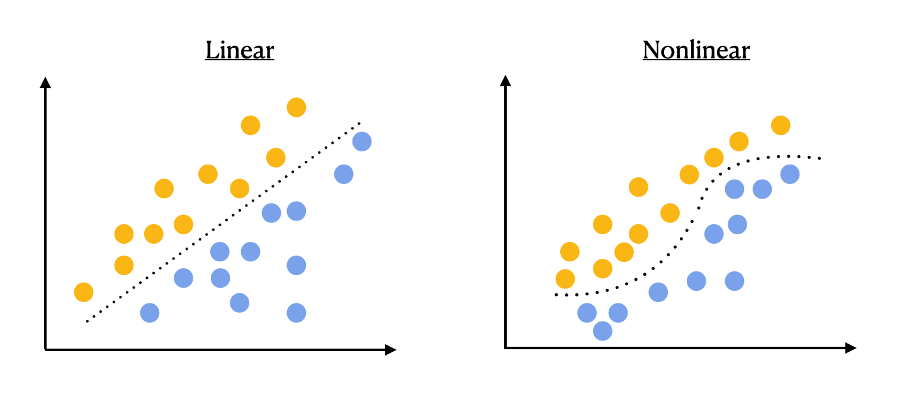
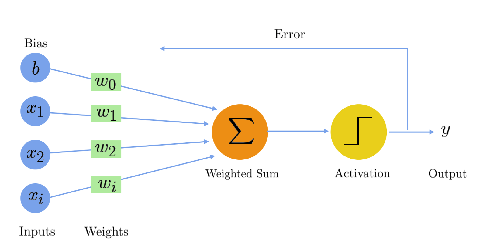
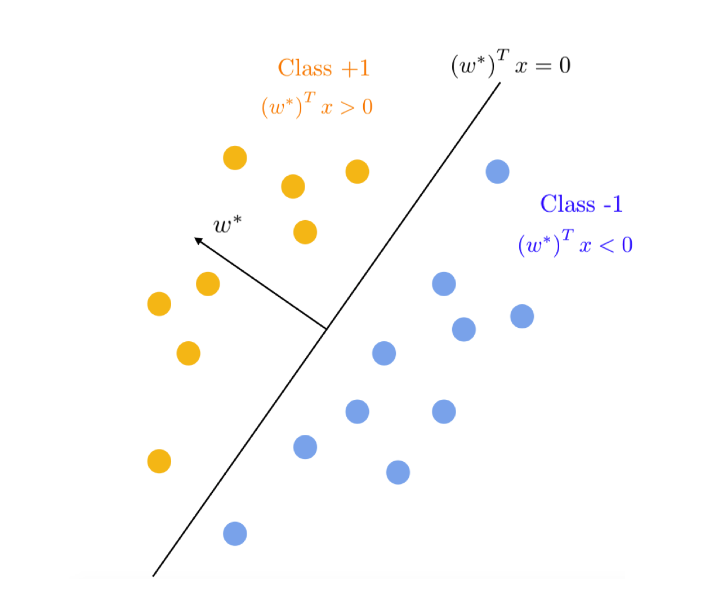
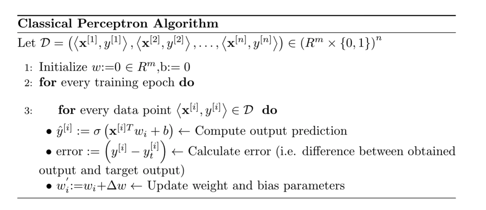
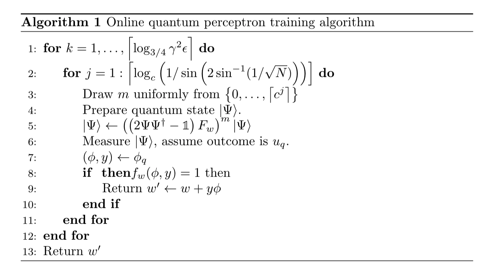
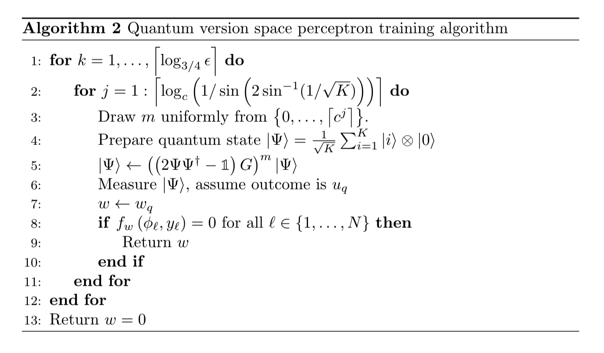

# Quantum Perceptron

**What is a Perceptron?**

The following work is an investigation into the quantum version of the classical perceptron algorithm, and is based on the previous work of N. Wiebe *et al.* @wiebe2016quantum.

However, before we can explore the idea of the quantum perceptron in a meaningful way, we must first understand the fundamentals of the classical version of the perceptron, which is what we will cover first in this chapter.

## Classical Perceptron 

The perceptron is a machine learning algorithm that can be thought of as the most basic fundamental building block of more complex artificial neural networks (ANNs), or alternatively as a very simple form of neural network in and of itself.

The perceptron is considered a linear classifier used for binary predictions. This "binary classification" is a type of supervised learning where the categories are predefined, and is used to categorize new probabilistic observations into said categories. When there are only two categories the problem is known as statistical binary classification.

The use case where the perceptron is applicable as a tool for data classification occurs when one is strictly dealing with *linearly separable* data sets, meaning there exists at least one linear hyperplane that can successfully differentiates elements of the data set into separate distinct groups.



Geometrically it is easy to see that these two sets,
[$\mathrm{A}$]{style="color: orange"} and
[$\mathrm{B}$]{style="color: blue"}, in an $n-$space would be linearly-separable only if there exists an $(n-1)$ hyperplane that separates the two sets. In the 2-dimension space presented in Figure 1, this is seen as a line separating the two set of points.

Let us also introduce the concept of linear separability using mathematical formalism.

```{definition, name="Linear Separability"}
Two sets two 
[$\mathrm{A}$]{style="color: orange"} and
[$\mathrm{B}$]{style="color: blue"} of points in an $n$-dimensional space are called absolutely linearly separable if $n+1$ real numbers $w_{1}$, $\ldots$, $w_{n+1}$ exist, such that every point $(x_{1}$, $x_{2}$, $\ldots$, $x_{n})$ in [$\mathrm{A}$]{style="color: orange"} satisfies :
$$
\sum_{i=1}^{n} w_{i} x_{i}>w_{n+1}
$$
every point [$\mathrm{B}$]{style="color: blue"} satisfies :
$$
\sum_{i=1}^{n} w_{i} x_{i}<w_{n+1}
$$
```
Now that we have developed a basic understanding of what the perceptron is and what conditions must be made in order to use it, let us investigate the specific features that allow it to carry out this task.

**How Does it Work?**

The perceptron uses a linear threshold function approach and works by "learning" a series of weights, $w_{i}$, corresponding to the input features, $x_{i}$, which are vectors of the available data set.



A dot product $\sum w_{i} x_{i}$ is computed between each input, $x_{i}$, and its associated weight ,$w_{i}$, and is subsequently passed to a pre-defined activation function $g$. This activation function can take many forms (ex: the sigmoid function, hyperbolic, step function, etc.) however, we will assume the sign function is used for the remainder of this example for simplicity.

The proccess of taking the inner product of these vectors defines the equation for our linear classifier, and can be expressed as:

$$y\left(x_{i}\right)=\operatorname{sign}\left({w}^{\top} {x}_{i}+b\right)$$

The two objects that the perceptron is required to learn are the weights, $w_{i}$, and the offset term - otherwise known as the bias- $b$. Without the bias term, the hyperplane that $w$ defines would always have to go through the origin. It is common practise to absorb $b$ into the feature vector $w$ by adding one additional constant dimension. In doing so, ${x}_{i}$ becomes
$[\begin{array}{c}{x}_{i}\\  1\end{array}]$, and
${w}$ becomes
$[\begin{array}{l}{w} \\ b\end{array}]$.\
We can then verify that their inner product will yield,
$$\left[\begin{array}{c}
{x}_{i} \\
1
\end{array}\right]^{\top}\left[\begin{array}{l}
{w} \\
b
\end{array}\right]={w}^{\top} {x}_{i}+b$$ Using this, we can simplify the above formulation of $y\left({x}_{i}\right)$ to
$$y\left({x}_{i}\right)=\operatorname{sign}\left({w}^{\top} {x}\right)$$

In any case, each pair of weights and input features are multiplied together, and then the results are summed. This is the manner in which the perceptron defines a linear decision boundary that gets used in order to classify the data.


If the summation of $g\left(\sum w_{i} x_{i}\right)$ evaluates above a particular threshold we predict the input element as belonging to one class, otherwise the prediction belongs to a different class. In other words,the decision boundary of the perceptron can be computed as:

Given training data
$\left\{\left(x_{i}, y_{i}\right): 1 \leq i \leq n\right\}$ from
distribution $\mathcal{D}$, there can be found $y= f_{w}(x)=w^{T} x$ which is
distinguished by:

\bullet   $y=+1$ if $w^{T} x>0$

\bullet  $y=-1$ if $w^{T} x<0$

where the outcome (prediction) of the classifier is defined as
$y=\operatorname{sign}\left(f_{w}(x)\right)=\operatorname{sign}\left(w^{T} x\right)$,
with the goal of the classifier being to minimize error between the target and obtained outputs.

Note: If
$y_{i}\left({w}^{\top} {x}_{i}\right)>0$, then ${x}_{i}$
is classified correctly, where 'classified correctly' means that $x_{i}$
is on the correct side of the hyperplane defined by ${w}$.

Essentially, training data gets presented to the network's inputs and the resulting outputs are computed. If an error in classifying a data point is detected, the corresponding weight, $w_{i}$, gets modified by an amount that is proportional to the product of the difference between the actual output and the desired output,
$y-y^{'}$, and the inputs, $x_{i}$.

The final step is to check if the predictions were classified correctly. If they were not, then the weights are updated using a pre-defined learning rate. This process continues for a certain number of iterations, known as "epochs." Again, the goal is to determine the weights that produce a linear decision boundary that correctly classifies the predictions.

The following pseudocode highlights the structure of the perceptron algorithm and identifies at which step in the processing schedule the error calculation and subsequent parametric updates occur.



Taking a closer look at how the step containing the calculation of the error gets used in order to adjust $w_{i}^{'}$:

$$w_{i}^{'}=w_{i}+\Delta w_{i}$$ 
$$\Delta w_{i}=\eta \cdot error \cdot x_{i}$$

where,

-   $\eta:$ learning rate

-   $x_{i}:$ the $i^{t h}$ perceptron's input

-   $error:$ the difference between the target and desired output


Notice that if $error$ and $x_{i}$ have the same sign (they are simultaneously activated), the increment is positive (the strength increases).

In an overall picture, the perceptron iteratively updates the linear boundary function (i.e. the hyperplane equation) that acts as the classifying condition between the two classes of the data, until no errors are detected and the algorithm converges. Ultimately this allows for the distinction of data points belonging on one side of the boundary or the other, and it does so by minimizing the error on the training data set provided to the algorithm.

**Note on Scaling**

An extraordinary feature of the perceptron model is that there exists upper bounds for the number of updates that need to be made during this training procedure. Specifically, if the training data is composed of unit vectors, $\phi_{i} \in \mathbb{R}^{D}$, that are separated by a margin of $\gamma$, then there exists a perceptron training algorithm that make at most $O\left(\frac{1}{r^{2}}\right)$ mistakes, *independent* of the dimension of the training vectors. In the worst case, the algorithm will need to look at all points in the training set at least once, consequently the computation complexity will be $O(N)$. The main goal of realizing the quantum version of the perceptron algorithm is to investigate if quantum procedures (i.e. Grover's search and amplitude amplification) can provide improvements both in terms of computational complexity (i.e. better than $O(N)$) and statistical efficiency (i.e. improve upon $O\left(\frac{1}{\gamma^{2}}\right)$. Given a training data set, the traditional representation is to depict the data as points in the feature space and use hyperplanes to depict the classifiers. However,as will be showcased in the following two sections, there also exists a dual representation where the hyperplanes are depicted as points and the data points are represented as hyperplanes that induce constraints on the feasible set of classifiers. Therefore, instead of only applying quantum constructs to the feature space, a version space interpretation of perceptrons will also be considered, which ends up leading to the improved scaling with $\gamma$ (version space is formally defined as the set of all possible hyperplanes that perfectly separate the data$:VS:=\left\{w \mid y_{i} \cdot w^{T}{\phi}_{i}>0 \text { for all } i\right\}$).

Now that we have developed a high level understanding of the function of the classical perceptron and to what forms of data it is applicable, we can move forward and investigate the algorithmic architecture(s) used to construct the quantum version(s) of the perceptron. However, before going further into this investigation, it will be worthwhile to briefly highlight the key differences in the main techniques used for accessing data within the supervised learning regime, as this context will become necessary for a more complete appreciation of the concepts in the proceeding sections:

**On-Line Versus Batch Learning**

**Online:**

Online learning is a method of machine learning in which data becomes available to the algorithm in a sequential order and is used to update the dependent variable of the system.

*Key Features:*

- Learning based on each data point as it is observed.

- The updates to weights $w$ happen after each data point *within* the epoch.

**Batch:**

Batch learning is a technique which generates an output by learning on the entire training data set at once.

*Key Features:*

- Learning takes place over groups, or "batches", of data. 

- Updates to the weights, $w$, only happen after each epoch.

**Grover's Search Algorithm**

   Grovers algorithm @grover1996fast, also often referred to as the "quantum search algorithm", refers to a quantum algorithm for unstructured search that successfully determines the unique input to a black box function that produces a particular output value. Specifically, the algorithm consists of two oracle steps: a phase inversion oracle step, and an amplitude amplification oracle step. Grover's search algorithm is ubiquitous in the realm of established quantum algorithms, and is used as the overarching quantum resource in both of the formulations of the quantum perceptron algorithm that will be presented in the following sections. For a more robust investigation of Grover's search, the reader is encouraged to review section 4.2 \@ref(sec:4.2) of this book, \@ref(subsec:findmin), and also section II B in @wiebe2016quantum, where specifics on how Grover's is leveraged in context of the quantum perceptron can be found.

## Quantum Perceptron: Algorithm 1 

**General Idea:**  Uses Grover’s search as a technique to more efficiently and more quickly identify misclassified data points in the data set, which in turn allows the perceptron algorithm to more quickly converge on a correct classifying hyperplane.

If we're given a set of $N$ separable training examples $\left\{\phi_{1}, \ldots, \phi_{N}\right\} \in \mathbb{R}^{D}$ with corresponding labels $\left\{y_{1}, \ldots, y_{N}\right\}, y_{i} \in\{+1,-1\}$, the goal of perceptron is to recover a hyperplane $w$ that perfectly classifies the training set. To put this formally, we want $w$ such that $y_{i} \cdot w^{T} \phi_{i}>0$ for all $i$. The rule that we'll consider for online perceptron training is, upon misclassifying a vector $(\phi, y), w \leftarrow w+y \phi$.

Earlier in our exploration of the classical perceptron algorithm, the difference between two forms of accessing data in the context of machine learning algorithm were introduced - the online and the batch style learning techniques. The key difference between these two main umbrella categories (i.e. online and batch) lies in *where* the update to the weight vectors $w$, and bias vectors $b$, occurr within the algorithms' subroutines. In the online learning regime, the update to the weight and bias vectors occurs for each and every data point within the epoch, occurring iteratively throughout every epoch, while in the batch learning regime only *one* weight and bias vector update gets implemented per epoch, which occurs after all of the data points within the epoch have been iterated over.

The main purpose of highlighting the difference between online and batch learning again in this section of the investigation is to make clear to the reader that this particular implementation of the quantum perceptron algorithm falls under the \"online learning\" umbrella category, since in this formulation of the algorithm there are multiple weight and bias vector updates that are done per epoch (i.e. one for each data point), which is the key common feature shared by online learning style algorithms.

Where the quantum version of the \"online\" perceptron differs from that of its classical analogue is rather in *how* the data points are accessed for use within each individual epoch of the algorithm. In the traditional feature space version of the online perceptron model, the training data points ("examples") are fed into the algorithm successively one by one, and an update is performed after each of these instanced in a streamlined fashion. The quantum version of the online perceptron deviates away from this mechanism of accessing the data points within an epoch in a \"one at a time\" fashion, to instead accessing the data points by sampling them uniformly from the training data distribution. Effectively, what accessing the data points in this way allows for is the use of quantum parallelism in the algorithm as a computational resource, which is achieved via the quantum superposition of states. While this \"uniform sampling\" approach is sometimes disadvantageous in a classical setting due to the possibility that some of the training data can be drawn multiple times, its use in the quantum formulation of this algorithm supersedes this draw back, as it's this very feature that allows us to sample quantum states that are in a uniform superposition
over all vectors in the training data set.

In order to prepare and deal with the training data in such a way, we can make the following assumptions about the basis vectors of the space:\

-   Without loss of generality assume that the training set consists of $N$ unit vectors, $\phi_{1}, \ldots, \phi_{N}$.

-   Define $|\Phi_{1}\rangle, \ldots, |\Phi_{N}\rangle$ to be the basis vectors whose
    indices each coincide with a $(B+1)$-bit representation of the
    corresponding $\left(\phi_{j}, y_{j}\right)$ where
    $y_{j} \in\{-1,1\}$ is the class assigned to $\phi_{j}$.

-   Let $|\Phi_{0}\rangle$ be a fixed unit vector that is chosen to represent a blank memory register.

It becomes necessary to introduce the vectors $|\Phi_{j}\rangle$ to make it clear that the quantum vector states used to represent training vectors do not live in the same vector space as the training vectors themselves. The quantum state vectors are instead chosen to occupy a larger space than the training vectors to circumvent the effect of the Heisenberg uncertainty principle, which would otherwise render it more difficult for the quantum computer to compute the class that the perceptron assigns to a training vector. It is worth noting that while encoding the training data as an exponentially long vector (which is in effect what occurs when preparing quantum states that are in a uniform superposition over all vectors in the training set), would prove inefficient in a classical computer, it is not the case when executed on a quantum computer. This is owing to the quantum computer's innate ability to store and manipulate exponentially large quantum state vectors due to the nature of it's fundamental units of information storage, qubits.

Next, in order to construct our desired online quantum perceptron, we will need to have a mechanism with which to access the training data. In this formulation of the algorithm, we assume that the data is accessed via an oracle that not only accesses the training data, but also determines whether the data is misclassified.

To elaborate, we can let {$|j\rangle: j=1: N$} be an orthonormal basis of quantum state vectors that serve as addresses for the training vectors in the database, and given an input address for the training datum, the unitary operations $U$ and $U^{\dagger}$ allow the quantum computer to access the corresponding vector. More specifically, for all $j$:

$$U|j\rangle \otimes |{\Phi_{0}}\rangle=|j\rangle \otimes |\Phi_{j}\rangle$$
$$U^{\dagger}|j\rangle \otimes |{\Phi_{j}}\rangle=|j\rangle \otimes |\Phi_{0}\rangle$$

which tells us it that, given an input address vector $|j\rangle$, the latter inverts the database access, and the former corresponds to a database access.

Note that because $U$ and $U^{\dagger}$ are linear operators, we have that $U \sum_{j=1}^{N} |j\rangle \otimes |\Phi_{0}\rangle=\sum_{j} |j\rangle \otimes |\Phi_{j}\rangle$. A quantum computer can therefore access each training vector simultaneously using a single operation, while only requiring enough memory to store one of the $|\Phi_{j}\rangle$. The resultant vector from accessing the data in this way is known as the quantum superposition of states.

The subsequent ingredient in the oracle that we need is the mechanism to test if the perceptron correctly assigns a training vector addressed by a particular $|j\rangle$. This is the instance where the Grover's search takes place, and the first step of this process is performed by a unitary transformation that flips the sign of any basis-vector that is misclassified. As a resulting feature of the linearity of this operation, a single application of this process flips the sign of any component of the quantum state vector that coincides with a misclassified training vector. Let us define an operator,  $F_{w}$, which depends on the perceptron weights $w$ and require that:

$$F_{w}|j\rangle \otimes |{\Phi_{0}}\rangle=(-1)^{f_{w}\left(\phi_{j}, y_{j}\right)}|j\rangle \otimes |\Phi_{0}\rangle$$

where $f_{w}\left(\phi_{j}\right)$ is a Boolean function that is 1 if and only if the perceptron with weights $w$ misclassifies training vector
$\phi_{j}$. We can apply $F_{w}$ by letting $\mathcal{F}_{w}$ be a unitary operation such that:

$$\mathcal{F}_{w} |\Phi_{j}\rangle=(-1)^{f_{w}\left(\phi_{j}, y_{j}\right)} |\Phi_{j}\rangle$$

$\mathcal{F}_{w}$ is easily implemented on the quantum computer using a multiply controlled phase gate and a quantum implementation of the perceptron classification algorithm, $f_{w}$. We can then write:

$$F_{w}=U^{\dagger}\left(\mathbb{1} \otimes \mathcal{F}_{w}\right) U$$

Classifying the data based on the phases (the minus signs) outputted by $F_{w}$ affords a very memory efficient training algorithm due to the fact that only one training vector is ever stored in memory during the implementation of $F_{w}$ provided above. We can then use $F_{w}$ to perform the amplitude amplification aspect of Grover's search algorithm by taking $U_{\text {targ }}=F_{w}$ and $U_{\text{init}}=2 \psi\psi^{\dagger}-\mathbb{1}$, with $\psi=|\Psi\rangle:=\frac{1}{\sqrt{N}}\sum_{j=1}^{N} |j\rangle$, to seek out training vectors that the current perceptron model misclassifies. This leads to a quadratic reduction in the number of times that the training vectors need to be accessed by $F_{w}$ (or its classical analogue). The following theorem highlights this quadratic speedup, achieved by the implementation of a quantum search for the training vectors that the perceptron misclassifies.

```{theorem}
Given a training set that consists of unit vectors $\Phi_{1}, \ldots, \Phi_{N}$ that are separated by a margin of $\gamma$ in feature space, the number of applications of $F_{w}$ needed to infer a perceptron model, $w$, such that $P\left(\exists j: f_{w}\left(\phi_{j}\right)=1\right) \leq \epsilon$ using a quantum computer is $N_{\text {quant}}$ where
$$
\Omega(\sqrt{N}) \ni N_{\text {quant}} \in O\left(\frac{\sqrt{N}}{\gamma^{2}} \log \left[\frac{1}{\epsilon \gamma^{2}}\right]\right)
$$
whereas the number of queries to \(f_{w}\) needed in the classical setting, \(N_{\text {elass }}\), where the training vectors are found by sampling uniformly from the training data is bounded by
$$
\Omega(N) \ni N_{\text {class}} \in O\left(\frac{N}{\gamma^{2}} \log \left[\frac{1}{\epsilon \gamma^{2}}\right]\right) .
$$
```

We assume in Theorem 1.1 that the training data in the classical case is accessed in a manner that is analogous to the sampling procedure used in the quantum setting. If instead the training data is supplied by a stream (as in the standard online model) then the upper bound changes to $N_{\text {class}} \in O\left(N / \gamma^{2}\right)$ because all $N$ training vectors can be deterministically checked to see if they are correctly classified by the perceptron. A quantum advantage is therefore obtained if $N \gg \log ^{2}\left(1 / \epsilon \gamma^{2}\right)$.
We need to have two technical lemmas to justify the claim in Theorem 1.1, the first of which bounds the complexity of the classical analogue to our training method:

```{lemma}
Given only the ability to sample uniformly from the training vectors, the number of queries to $f_{w}$ needed to find a training vector that the curnent perceptron model fails to classify correctly, or conclude that no such example exists, with probability $1-\epsilon \gamma^{2}$ is at most $O\left(N \log \left(1 / \epsilon \gamma^{2}\right)\right)$.
```
<br>

And the second of which proves the correctness and bounds the complexity of algorithm 1:

```{lemma}
Assuming that the training vectors $\left\{\phi_{1}, \ldots, \phi_{N}\right\}$ are unit vectors and that they are drawn from two classes separated by a maryin of $\gamma$ in feature space, Algorithm 2 will either update the perceptron weights, or conclude that the current model provides a separating hyperplane between the two classes, using a number of queries to \(F_{t}\) that is bounded above by $O\left(\sqrt{N} \log \left(1 / \epsilon \gamma^{2}\right)\right)$ with probability of failure at most $\epsilon \gamma^{2}$.
```
<br>

With the results from these lemmas, one can fully prove Theorem 1, and the reader is encouraged to view said proof on page 6. of @wiebe2016quantum

The following pseudocode can be taken as a template to implement the steps discussed above in order to construct this particular version of the quantum perceptron algorithm. 



For a detailed explanation of the upper range stated in steps 3 and 4 of the pseudocode, refer to section II B in @wiebe2016quantum.

## Quantum Perceptron: Algorithm 2

**General Idea:**  Uses Grover’s search as a means to identify the correct hyperplane in version space that perfectly separates the data points, from a set of candidate hyperplanes (i.e. task of picking a successfully separating hyperplane, selected from a set of prepared candidate hyperplanes).

The strategy for the quantum version space training algorithm is to pose the problem of determining a separating hyperplane *as* the search. Specifically, the idea is to first generate $K$ sample hyperplanes $w_{1}, \ldots, w_{K}$ from a spherical Gaussian distribution $\mathcal{N}(0, \mathbb{1})$, and given a large enough $K$, we'll be guaranteed to have at least one hyperplane amongst the samples that would lie in the version space and perfectly separate the data. As mentioned earlier and in section 4.2 \@ref(sec:4.2) of this book, Grover's algorithm can provide quadratic speedup over the classical search consequently the efficiency of the algorithm is determined by $K$. Theorem 1.2 below provides an insight on how to determine this number of hyperplanes to be sampled.

```{theorem}
Given a training set that consists of $d$-dimensional unit vectors $\Phi_{1}$, $\ldots$, $\Phi_{N}$ with labels $y_{1}$, $\ldots$, $y_{N}$ that are separated by a margin of $\gamma$ in feature space, then a $D$-dimensional vector $w$ sampled from $\mathcal{N}(0,1)$ perfectly separates the data with probability $\Theta\gamma$
```
<br>

The main consequence of Theorem 1.2 is that the expected number of samples $K$, required such that a separating hyperplane exists in the set, only needs to scale as $O\left(\frac{1}{\gamma}\right)$. Thus if amplitude amplification is used to boost the probability of finding a vector in the version space then the resulting quantum algorithm will need only $O\left(\frac{1}{\sqrt{\gamma}}\right)$ quantum steps on average.

Moving on, we can now investigate how to use Grover's algorithm to search for a successfully classifying hyperplane that lies in the version space. We can start by taking $K=2^{m}$, for positive integer $m$, then given $w_{1}, \ldots, w_{K}$ being the sampled hyperplanes, we can represent $W_{1}, \ldots, W_{K}$ to be vectors that encode a binary representation of these random perceptron vectors. In a manner akin to how we defined $|\Phi_{0}\rangle$ in the context of algorithm 1, here we define $|0\rangle$ to be a vector that represents an empty data register (i.e. zero vector). Next we define the unitary operator $V$ to generate these weights given an address vector $|j\rangle$ using the following:

$$
V|j\rangle \otimes |0\rangle=|j\rangle \otimes |W_{j}\rangle
$$
In this context we can also think of the address vector, $|j\rangle$, as representing a seed for a pseudo-random number generator that yields perceptron weights $|W_{j}\rangle$

Now using $V$ and applying the Hadamard transform to generate a superposition of the states, we can prepare the following quantum state:

$$
|\Psi\rangle:=\frac{1}{\sqrt{K}} \sum_{i=1}^{K} |i\rangle \otimes |W_{k}\rangle
$$
which corresponds to a uniform distribution over the randomly chosen $w$. Now that we've defined the initial state, $|\Psi\rangle$, in order to implement Grover's search we need to define an oracle that marks the vectors inside the version space. To do this let us define the operator $\hat{\mathcal{F}}_{\phi, y}$ via

$$
\hat{\mathcal{F}}_{\phi, y}|j\rangle \otimes |0\rangle=(-1)^{1+f_{w_{j}}(\phi, y)}|j\rangle \otimes |0\rangle
$$

This unitary operation looks at an address vector, $|j\rangle$, computes the corresponding perceptron model $|W_{j}\rangle$, flips the sign of any component of the quantum state vector that is in the half space in version space specified by $\phi$ (training set unit vectors), and then uncomputes $|W_{j}\rangle$. This process can be realized using a quantum subroutine that computes $f_{w}$ (defined in the previous section), an application of $V$ and $V^{\dagger}$, and the application of a conditional phase gate (a quantum operation that typically denoted by $Z$).

The oracle $\hat{\mathcal{F}}_{\phi, y}$ does not allow one to directly use Grover's search to rotate a quantum state vector that is outside the version space towards the version space boundary, due to the fact that it effectively only checks one of the half-space inequalities that define the version space. Nevertheless, it *can* be used to build an operation that reflects about the version space, which we will call $\hat{G}$:

$$
\hat{G}|j\rangle \otimes |0\rangle=(-1)^{1+\left(f_{w_{j}}\left(\phi_{1}, \hat{y}_{1}\right) \vee \cdots \vee f_{w_{j}}\left(\phi_{N}, y_{N}\right)\right)}|j\rangle \otimes |0\rangle
$$

The operation $\hat{G}$ can be implemented using $2N$ applications of $\hat{\mathcal{F}}_{\phi}$, as well as a sequence of $O(N)$ elementary quantum gates, and hence we cost a query to $\hat{G}$ as $O(N)$ queries to $\hat{\mathcal{F}}_{\phi, y}$. Essentially, the idea is to use these components in algorithm 2 to amplify the margin between the two classes from $\gamma$ to $\sqrt{\gamma}$. The asymptotic scaling of this algorithm is provided in the following theorem.

```{theorem}
Given a training set that consists of unit vectors $\Phi_{1}, \ldots, \Phi_{N}$ that are separated by a margin of $\gamma$ in feature space, the number of queries to $\hat{F}_{\phi, y}$ needed to infer a perceptron model with probability at least $1-\epsilon, w$, such that $w$ is in the version space using a quantum computer is $N_{\text {quant}}$ where

$$
N_{\text {quant}} \in O\left(\frac{N}{\sqrt{\gamma}} \log ^{3 / 2}\left[\frac{1}{\epsilon}\right]\right).
$$
```

The proof of the theorem follows directly from bounds on $K$ and the validity of algorithm 2, which follows from the exact same steps followed in the proof of Lemma 2 (given in the section pertaining to algorithm 1), but now with $N=K$. However, since the algorithm need is not repeated $1 / \gamma^{2}$ times in this context we can replace $\gamma$ with 1 in the proof. Thus if we wish to have a probability of failure of at most $\epsilon^{\prime}$ then the number of queries made to $\bar{G}$ is in
$$
O\left(\sqrt{K} \log \left(1 / \epsilon^{\prime}\right)\right)
$$

(please refer to the appendix in @wiebe2016quantum for further details the proof for this theorem). This also guarantees that if any of the $K$ vectors are in the version space then the probability of failing to find that vector is at most $\epsilon^{\prime}$.

Next since one query to $\hat{G}$ is costed at $N$ queries to $\hat{\mathcal{F}}_{\phi, y}$ the query complexity (in units of queries to $\hat{\mathcal{F}}_{\phi, y}$) becomes $O\left(N \sqrt{K} \log \left(1 / \epsilon^{\prime}\right)\right)$. The last remaining thing is to bound the value of $K$ needed, which can be done by Referring back to Theorem 1.2. The probability of finding a vector in the version space is $\Theta(\gamma)$, which means that there exists $\alpha>0$ such that the probability of failing to find a vector in the version space $K$ times is at most
$$
(1-\alpha \gamma)^{K} \leq e^{-\alpha \gamma K}
$$
and thus this probability is at most \(\delta\) for
$$
K \in \Omega\left(\frac{1}{\gamma} \log (1 / \delta)\right).
$$
Its sufficient to pick $K \in \Theta\left(\frac{1}{\gamma} \log (1 / \delta)\right)$ for the algorithm. The union bound implies that the probability that either none of the vectors lie in the version space or that Grover's search failing to find such an element is at most $\epsilon^{\prime}+\delta \leq \epsilon$. Therefore, it's enough to pick $\epsilon^{\prime} \in \Theta(\epsilon)$ and $\delta \in \Theta(\epsilon)$ to ensure that the total probability is at most $\epsilon$, and ergo the total number of queries made to $\hat{\mathcal{F}}_{\phi, y}$ is in $O\left(\frac{N}{\sqrt{\gamma}} \log ^{3 / 2}(1 / \epsilon)\right)$.

The classical algorithm discussed in @wiebe2016quantum claimed complexity $O(N \log (1 / \epsilon) / \gamma)$ (proven in the appendix of @wiebe2016quantum), which was argued to follow from the fact that $K \in \Theta(\log (1 / \epsilon) / \gamma)$ suffices to make the probability of *not* drawing an element of the version space at most $\epsilon$. This demonstrates a quantum advantage if $\frac{1}{\gamma} \gg \log (1 / \epsilon)$, and illustrates that quantum computing can be used to boost the effective margins of the training data. 

The following pseudocode can be used to glean the methodical steps involved in constructing this particular version of the quantum perceptron algorithm.



For a detailed explanation of the upper range stated in steps 3 and 4 of the pseudocode, refer to section II B in @wiebe2016quantum.

 It is clear from our previous discussion that, just as in the first formulation of the quantum perceptron that was given in algorithm 1, algorithm 2 also carries out Grover's search, but instead of searching for a $\phi$ that is misclassified it instead searches for a $w$ in version space.
 
 Quantum models of perceptrons therefore not only provide advantages in terms of the number of vectors that need to be queried in the training process, they also can make the perceptron much more perceptive by making training less sensitive to small margins.

