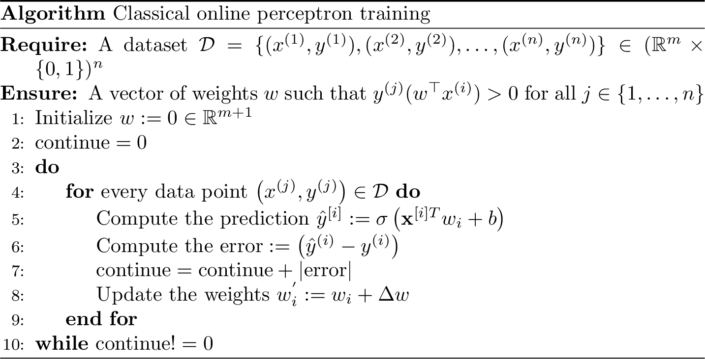
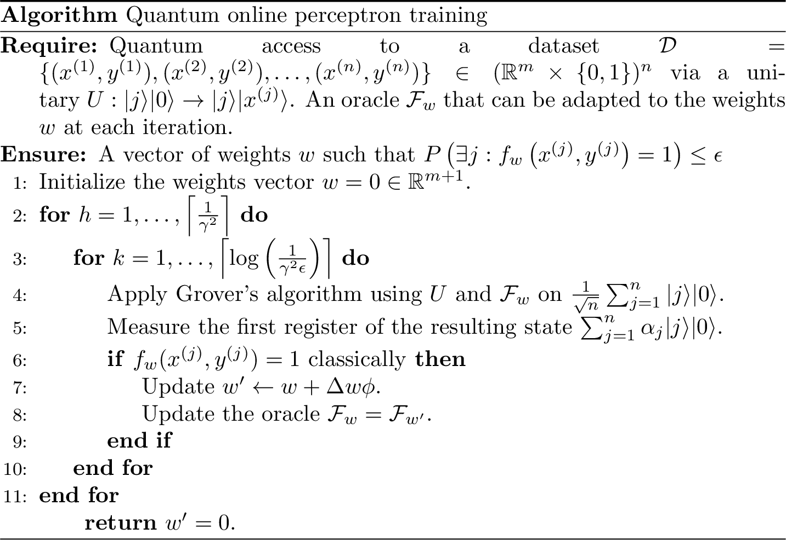
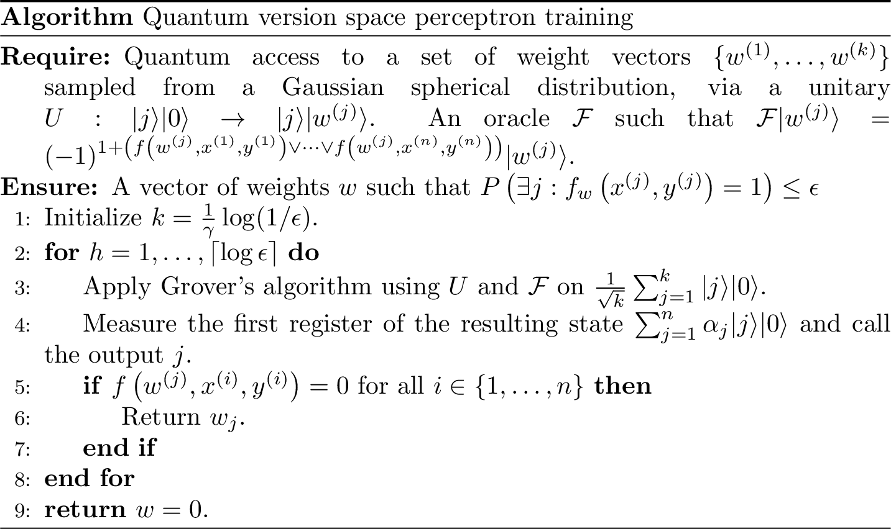
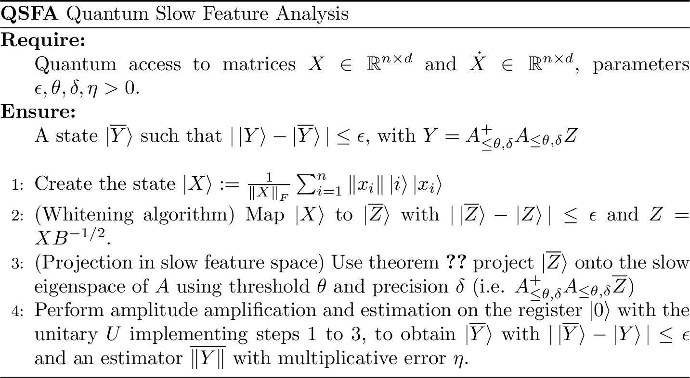

<!--  ```{r, include=FALSE} -->
<!--  options(tinytex.verbose = TRUE) -->
<!--  ``` -->

\newcommand{\norm}[1]{\left\lVert#1\right\rVert}

\newcommand{\R}{\mathbb{R}}
\newcommand{\Z}{\mathbb{Z}}
\newcommand{\Q}{\mathbb{Q}}
\newcommand{\E}{\mathbb{E}}

\newcommand{\ket}[1]{|#1\rangle}
\newcommand{\bra}[1]{\langle#1|}
\newcommand{\braket}[1]{\langle#1\rangle}

\newcommand{\be}{\begin{equation}}
\newcommand{\ee}{\end{equation}}
\newcommand{\argmax}{\arg\max}

\newcommand{\Ord}[1]{\mathcal{O}\left( #1 \right)}
\newcommand{\tOrd}[1]{\widetilde{\mathcal{O}}\left( #1 \right)}


# Preface

This is an [open source project accessible on GitHub](https://github.com/Scinawa/quantumalgorithms.org/) - only possible thanks to its many [contributors.](contributions-and-acknowledgements.html) The website is licensed under CC BY-NC-SA 4.0. We are searching for talented people and researchers to contribute: you can find a list of issues and enhancements that would improve this book further on the [issues list](https://github.com/Scinawa/quantumalgorithms.org/issues) for the GitHub repo, making recent material that keeps popping up in quantum information accessible to a larger audience.


The aim of this book is twofold:

- First, we want to bridge the gap between introductory material in quantum computation and research material.
- Secondarily, you should be able to use this book as a resource for state-of-the-art algorithms. Readers and scholars should find statements of theorems (along with their citations) and runtimes of the best quantum subroutines in literature, ready to be used in new quantum algorithms or applications.


These lecture notes were used to teach at:

- Politecnico di Milano (2019) - Quantum machine learning in practice.
- Politecnico di Milano (2021) - Applied quantum computing.

Are you using these lecture notes as support for your course? [Write us an email!](mailto://scinawa@luongo.pro)


<p style="text-align:right">
 This book is dedicated to all [cypherpunks: *civil liberties through complex mathematics*.](https://luongo.pro/cypherpunks/) </p>


## Abstract

In these lecture notes, we explore how we can leverage quantum computers and quantum algorithms for information processing. It has long been known that quantum computation can offer computational advantages with respect to classical computation, and in this place we explore more the consequences of this intuition in current domains of computer sciences.

Why are we studying quantum algorithms? Studying how to use quantum mechanical
systems is already fascinating in itself, but we argue that having faster
algorithms is not the only reason for studying quantum computing. Studying
quantum computation might also reveal profound insights into new ways to process
information. For instance, it can give us ideas on processing data
in a secure way (though, quantum cryptography is not discussed in these notes).
Understanding the computational capabilities of quantum machines
is certainly an interesting thing to do. This might lead to understanding the
computational limits of nature: what can be computed in this world? Last
but not least, because of the interplay between classical and quantum
computation, many new *classical* algorithms have been invented (i.e. the
dequantizations of quantum machine learning algorithms, the classical algorithms
for Gibbs sampling, simulations of QAOA, etc..). This, in turn,
improved our understanding of physics, and ultimately of the world itself.
<!-- As some scientists believe\footnote{A friend told me this was originally an idea -->
<!-- of Miklos Santha}, quantum computing is the occasion for Theoretical Computer -->
<!-- Science to welcome contribution from Physics. As we know, TCS has (luckly) -->
<!-- welcome many contribution from Mathematical sciences, and at the current state -->
<!-- is basically a branch of Mathematics. With quantum computing, TCS can welcome -->
<!-- also contribution from physics, perhaps going towards the direction of a -->
<!-- "Physical Computer Science". -->
Another reason for studying quantum algorithms is that quantum computers are posing
a significant challenge to the *strong* Church-Turing thesis, which says that any "reasonable"
model of computation can be *efficiently* simulated on a probabilistic Turing machine (i.e. a Turing machine which has access to randomness).
However, there are some physical processes that we do not know how to simulate efficiently on classical computers, but for which we have efficient quantum algorithms! This is strong evidence that the strong Church-Turing thesis might be false!

<!-- Algorithms are often overlooked when thinking about speed of calculations. But they deserve more credit for the performance gains than the well known Moore's Law. As we can read [here](https://www.nitrd.gov/pubs/PCAST-NITRD-report-2010.pdf), some researcher tried to quantify the performance gains for some specific problem (linear programming and mixed integer programming), and they found that in 15 years we had an improvement of a factor of 43millions: a factor of roughly 1000 was due to increased processor speed, and a factor of 43.000 was due to algorithmic improvements for the problem.  -->

You might often hear that there are only two real quantum algorithms: phase estimation and the Grover's algorithm. This is somewhat true, but it is true in the same way that we have only 12 notes in the western temperate scale, and yet Pink Floyd were able to write [The Dark Side of the Moon](https://www.youtube.com/playlist?list=OLAK5uy_l1x-JAx0w53suECoCI0YJtW6VB8DBQWRQ) (and the other musicians came up with "the rest" of the music).

The common thread of these algorithms is that they are faster than their best classical counterpart. Oftentimes, (especially for ML) the runtime will depend only [poly-logarithmically](https://en.wikipedia.org/wiki/Polylogarithmic_function) on the number of elements of the dataset, and it is usually only linear in the number of features (classical algorithms are often either linear in the number of elements and quadratic in the number of features, or depend on the number of nonzero components of the matrix and depend polynomially on other parameters of the matrix). The runtime of a quantum machine learning algorithm also often depends on characteristics of the matrix that represents the data under analysis, such as its rank, the Frobenius norm (or other matrix norms), the sparsity, the condition number, and the error we tolerate in the analysis. For this, along with an error-corrected quantum computer, we assume to have quantum access to a dataset. In other words, we assume that the data is stored in a quantum memory: the corresponding quantum version of the classical random-access memory.

We will see that, for a new QML algorithm, one often needs to make sure that the real performances of the quantum algorithms offer concrete advantages with respect to the effective runtime and the accuracy that is offered by the best classical algorithms. As we don't have access to big-enough quantum computers *yet*, we can only assess the performance of these quantum algorithms via a classical simulation.

These lecture notes should prepare the future quantum data analyst to understand the potential and limitations of quantum computers, so as to unlock new capabilities in information processing and machine learning. The hope is that this kind of technology can foster further technological advancements that benefit society and humankind, as soon as the hardware that supports this kind of computation becomes ready.

Last but not least, we will also cover important algorithms that are not necessarily related to machine learning, but are the quantum counterpart of important classical algorithms. Don't get swayed by the "lack" of exponential speedups. Remember: the square root of 365 days is a little less than 3 weeks. Besides this, big polynomial speedups, small polynomial speedups in important problems, or polynomial speedups proposing new algorithmic techniques are all much welcome in quantum computer science. All in all, quantum algorithms (to me) should be seen as a way for making **impossible things possible**. 

While reading these lecture notes you should always remember the good [Simon Martiel](https://scholar.google.fr/citations?user=upaq0vIAAAAJ&hl=en):
<p style="text-align:center">
"(quantum) Theoretical computer science is the fun part of mathematics."
</p>

To all of you, happy reading.


<!--
it would be nice to make just a preface, and put the text above this one without any heading..
https://stackoverflow.com/questions/41084020/add-a-html-block-above-each-chapter-header  -->

## Changelog

- August 2020: Migrated the old blog on bookdown
- December 2020: Moved thesis in bookdown
- January 2021: First system for typesetting algorithms, more appendix on linear algebra
- February 2021: New subroutines for estimating $\ell_1$ norms.
- March 2021: quantumalgorithms.org is proudly supported by the [Unitary Fund](https://unitary.fund/), and quantumalgorithms.org is a project of the [QOSF](https://qosf.org) mentorship program: 5 students started creating new content!
- April 2021: Mobile version working, search functionality added, q-means, finding the minimum, new algo for dimensionality reduction, and factor score ratio estimation estimation.
- June 2021: Quantum Monte Carlo algorithms, lower bounds techniques for query complexity of quantum algorithms, quantum algorithms for graph problems. The output of the mentorship program of the QOSF foundation!
- January 2022: In the past months we improved the overall quality of the website (graphics, typos) and added some content (Deutsch-Josza, Bernstein-Vazirani, swap and Hadamard tests)
- February 2022: We are happy to bring our swag (t-shirts, stickers, lanyards) to QIP. We added a whole chapter on perceptron algorithms and we doubled the chapter on quantum monte carlo algorithms with applications to finance and trace distance!
- June 2022: We are partecipating to the UnitaryHack! We also presented this work at QNLP2022 where we distributed our swag! Now the website can be compiled also with the latest version of RStudio,pandoc,bookdown.


Coming soon:

- quantum perceptrons
- quantum algorithms for dynamic programming
- quantum convolutional neural networks
- quantum random feature sampling


## Teaching using this book


- Lecture 1 - **Axioms of quantum mechanics**: Chapter \@ref(chapter-intro), section \@ref(section-axioms)
- Lecture 2 - **Quantum computer science**: oracle model, BPP vs BQP, from boolean to quantum circuits, Solovay-Kitavev, randomized algorithms, Markov Inequality, Union bound and applications. Section \@ref(measuring-complexity).
- Lecture 3 **Foundational quantum algorithms**, Section \@ref(review-famous-quantum-algos): Deutsch-Josza, Bernstein-Vazirani, Swap-test, Hadamard-test.
- Lecture 4 - **Oracles, data representation and data loaders**: Oracles for accessing the data, data representation, sparse models. Chapter \@ref(chap-classical-data-quantum-computers).
- Lecture 5 - **QFT and Grovers' algorithm**: Section \@ref(section:grover), Section \@ref(section:phaseestimation)
- Lecture 6 - **Phase estimation, amplitude amplification, counting, finding the minimum, and applications**: Beginning of Chapter \@ref(chap-toolbox).
- Lecture 7 (optional) - **More foundational quantum algorithms**: Simons's and Shor's algorithm (`#TODO`)
- Lecture 8 (optional): **Quantum perceptron models**: This is a very simple quantum machine learning algorithm that shows the applications of different techniques seen so far.  (`#TODO`, very soon!)
- Lecture 9: **Quantum numerical linear algebra pt. 1**: HHL algorithm, block-encodings and quantum singular value estimation. Mostly from Chapter \@ref(chap-svebased).
- Lecture 10: **Quantum numerical linear algebra pt. 2**: Quantum singular value transformation, Hamiltonian simulation. Theory and examples.
- Lecture 11: **Distance, inner product, trace estimation**: From Chapter \@ref(chap-toolbox), especially Section \@ref(sub:distances), (`#TODO` trace estimations).
- Lecture 12: **Quantum monte carlo algorithms and applications**: Content from Chapter \@ref(chap-montecarlo).
- Lecture 13: **Quantum machine learning pt. 1**:  QPCA and QSFA. Chapter \@ref(chap-dimensionality-reduction) Hamiltonian simulation with density matrices (`#TODO`).
- Lecture 14: **Quantum machine learning pt. 2**:   Random feature sampling (`#TODO`, to convert from .tex to markdown, check github repository).
- Lecture 15: **Classical simulation of quantum algorithms**: How to simulate a quantum circuit? (`#TODO`) How to simulate a quantum machine learning algorithm? Section \@ref(chap-QML-on-real-data).
- Lecture 16: **Lower bounds**: Adversarial and polynomial method in Chapter \@ref(chap-lowerbounds), state discrimination (missing).
- Lecture 17 (optional): **Between the qubits and me**: what do we have between the theory of our algorithms and the hardware? An overview of different hardware architectures, error correction codes, and compilation techniques. (`#TODO`).
- Lecture 18: **Quantum algorithms on graphs**: Backtracking algorithms, NP-complete problems on graphs (`#TODO`).
- Lecture 19: **Quantum optimization**: Introduction to optimization. Quantum simplex, quantum zero-sum games. (`#TODO`).
- Lecture 20: **Quantum optimization**:  Quantum SDP algorithms, quantum interior point methods, quantum branch-and-bound algorithms (`#TODO`).


```{js, echo = FALSE}
title=document.getElementById('header');
title.innerHTML = '' + title.innerHTML
```


<!--chapter:end:index.Rmd-->

# (PART) Bridging the gap {-}

# Quantum computing and quantum algorithms {#chapter-intro}

In this chapter we will introduce the notation used throughout the rest
of the lecture notes. We will extensively use linear algebra (norm of
matrices, SVD, properties of particular matrices, and so on), so the
reader is higly encouraged to skim the appendix on his/her own, so to
know the notation adopted here.

## Getting rid of physics in quantum computing

Following one of the [lectures of
Susskind](https://www.youtube.com/watch?v=8mi0PoPvLvs), we are going to
start from a "handwavy" introduction of quantum mechanics, that starts
from few considerations and lead straight to the Schrödinger equation.
With a few mathematical tricks, we are going to give an intuitive
justification of all the 4 axioms of quantum mechanics that are stated
in the next sections. The hope is that thanks to this introduction, the
reader can be gently guided from a tiny physical intuition to a greater
understanding of the **axioms of quantum mechanics**. Despite the name
"axioms of quantum mechanics" might seems (obviously) related to
physics, thanks to this formulation (which comes from [@NC02]), we could
eventually think of them as "axioms of quantum computing". As [Scott
Aaronson](https://www.youtube.com/watch?v=SJkbe4Rkv9c) rightly said, if
you are not a physicist, you need to remove physics from quantum
mechanics to understanding it!

The objective is that the reader should *not* feel the need to dig into
quantum mechanical details of quantum computers, but can comfortably sit
on top of the 4 axioms of quantum mechanics, and build (a lot) from
there.

When, at the beginning of the 20th century, physicists started to model
quantum phenomena, they observed that the dynamic of the systems had two
properties: they observed that the time and space evolution of quantum
systems is continuous (as in classical mechanics) and reversible (unlike
the classical world). They decided to formalize this concept as follows.
First, they decided to model the state of a quantum system at time $p$
as a function $\psi(p)$, and they decided to model the evolution of
$\psi(p)$ for time $t$ as an operator $U(t)$ acting on $\psi(p)$s.
Formally, the two requirements can be written as:

-   $U(\epsilon)=I-i\epsilon H$ (continuity)
-   $U^\dagger(t)U(t)=I$ (reversibility)

The first requirement reads that if we were to apply an evolution for a
small amount of time $\epsilon$, then $U$ would behave almost as the
identity, and then it will apply for a "small" amount another operator
$H$. The second requirement reads that if we "undo" the operator $U$, by
applying the transpose conjugate, we would obtain the identity, i.e. we
haven't change the state of the system. From these two requirements, we
can already derive the following observation.

$$I = U^\dagger(\epsilon)U(\epsilon)= (I+i\epsilon H)(I-i\epsilon H) = I -i \epsilon H + i \epsilon H^\dagger + O(\epsilon^2).$$
The only way for this equation to hold is for $H=H^\dagger$.

I.e. the operator $H$ should be equal to its transpose conjugate. In
mathematics, we have a name for such operators, and they are called
Hermitian operators! (More about those in the appendix!). Now we can ask
ourselves what happens when we apply $U(\epsilon)$ to a quantum state
$\psi(t)$? Well it's simple to see now:
$$U(\epsilon)\psi(t) = \psi(t+\epsilon) = \psi(t) -i \epsilon H\psi(t).$$
With a little algebra we can rewrite the previous equation as:

$$ \frac{\psi(t+\epsilon) -  \psi(t)}{\epsilon} = -i  H\psi(t).$$ Note
that the left-hand side part of this equation can be rewritten as a
derivative: $$\frac{d}{dt}\psi(t) = -i H \psi(t).$$ But this is the
well-known Schrödinger equation! Note that, as computer scientists, we
take the right to remove some physical constant ($\hbar$) out of the
equation. What should be the takeaway of these observations? Well, first
we know that the Schrödinger equation is a differential equation whose
solution is fully determined if we were to know the initial state of our
system $\psi(p)$. Formally the solution can be written as:

$$\psi(p+t)=e^{-iHt}\psi(p).$$ From this last equation we can observe
further (more on this in the appendix) that the exponential of an
Hermitian matrix $e^{-iHt}$ is *defined* through its Taylor expansion is
just a *unitary* matrix: $U(t)=e^{-itH}$. Unitary matrices are exactly
those matrices that describe isometries: applying a unitary matrix to a
vector won't change its length. From this, we see that the two quantum
states $\psi(p+t)$ and $\psi(p)$ could be taken just to be vectors of a
fixed length, which - for practicality - we take to be unit vectors.
Notation-wise, we denote unit vectors describing quantum states as
"kets", i.e. we rewrite this equation as:

$$\ket{\psi(p+t)}=U(t)\ket{\psi(p)}$$ Hopefully, this introduction
should be enough for getting a better intuition of what comes next, and
give you a "justification" for the axioms of quantum mechanics.

## Axioms of quantum mechanics {#section-axioms}

The standard formalism used in Quantum Information is the Dirac's
"bra-ket" notation, which we will introduce in this section. We also
recall here the postulates of quantum mechanics, and take this
opportunity to settle the rest of the notation and preliminaries used in
this thesis. For the postulates, we follow the standard formulation in
[@NC02].

```{proposition, name="Postulate 1"}
Associated to any isolated physical system is a complex vector space with inner product (that is, a Hilbert space) known as the state space of the system. The system is completely described by its state vector, which is a unit vector in the system's state space.
```

As quantum states are described by unit vectors, we write $\ket{\psi}$
for a unit vector $\psi \in \mathcal{H}^n$. So for a non-normalized
vector $x \in \R^n$, the normalized quantum state is represented as
$\ket{x} = \norm{x}^{-1}x = \frac{1}{\norm{x}}\sum_{i=0}^n x_i\ket{i}$.
We denote as $\{\ket{i}\}_{i\in[d]}$ the canonical (also called
computational) basis for the $d$ dimensional Hilbert space
$\mathcal{H}$. The transpose-conjugate of $\ket{x}$ is defined as
$\bra{x}$. We can think of $\ket{x}$ as a column vector, while $\bra{x}$
is a row vector, whose entries have been conjugated. In Dirac's
notation, we denote the inner product between two vector as
$\braket{x|y}$. Their outer product is denoted as
$\ket{x}\bra{y} = \sum_{i,j \in [d]}x_i y_j \ket{i}\bra{j} \in \mathcal{H}^d\otimes \mathcal{H}^d$.
The smallest quantum system is called a qubit, and is a 2 dimensional
unit vector in $\mathbb{C}^2$. A base for this vector space in quantum
notation is denoted as $\ket{0}$ and $\ket{1}$. In this case, the vector
$\ket{\varphi} = \alpha\ket{0}+\beta\ket{1}$ for
$\alpha,\beta\in \mathbb{C}$ represent a valid quantum state as long as
$|\alpha|^2 + |\beta|^2 = 1$.

```{proposition, name="Postulate 2"}
The evolution of a closed quantum system is described by a unitary transformation. That is, the state $\ket{\psi}$  of the system at time $t_1$ is related to the state $\ket{\psi}$  of the system at time $t_2$ by a unitary operator $U$ which depends only on the times $t_1$ and $t_2$.
```

A matrix $U\in \mathbb{C}^{d \times d}$ is said to be unitary if
$UU^\dagger = U^\dagger U = I$, that is, if the inverse of $U$ equal to
its conjugate transpose. From this fact it follows that unitary matrices
are norm-preserving, and thus can be used as suitable mathematical
description of a pure quantum evolution. It is a standard exercise to
see that the following are all equivalent definition of unitary matrices
[@DeWolf]:

-   $\braket{Av, Aw} = \braket{v,w}$ for all $v,w$.
-   $\norm{Av} = \norm{v}$ for all $v$
-   $\norm{Av} = 1$ if $\norm{v}=1$.
-   $U$ is a normal matrix with eigenvalues lying on the unit circle
-   $|\det(U)|=1$
-   The columns and the rows of $U$ form an orthonormal basis of
    $\mathcal{C}^d$
-   $U$ can be written as $e^{iH}$ for some Hermitian operator $H$.

```{example, name="Determinant = 1 is a necessary but not sufficient condition for being unitary."}
It is simple to see that any 2x2 diagonal matrix $A$ with entries $10$ and $1/10$ has determinant is 1, but it's not a unitary matrix: $A^\dagger A = AA^\dagger \neq I$.
```

It will be useful to recall that if we have a unitary that performs the
mapping $\ket{a_i} \mapsto \ket{b_i}$, we can have the "matrix" form of
the operator as $\sum_i \ket{b_i}\bra{a_i}$. Recall also that the Pauli
matrices are both unitary *and* Hermitian, and this fact will be useful
in many places throughout this text.

```{=html}
<!--
# TODO Introduce more information about quantum gates
# Below Postulate 3 there are some examples of things that would be pedagogically good to have in this place.
# labels: good first issue, help wanted
-->
```
<!-- $$H = \frac{X + X}{\sqrt{2}}$$ -->

<!-- Phase gate: $$S = \frac{1}{\sqrt{2}} \begin{pmatrix} -->

<!--    1 & 0 \\ -->

<!--    0 & i -->

<!--    \end{pmatrix} = \frac{1}{\sqrt{2}} (\ket{0}\bra{0} + i\ket{1}\bra{1})$$ -->

<!-- T gate, also called as "$\pi$-over-8" gate:  -->

<!-- $$T = \begin{pmatrix} -->

<!--    1 & 0 \\ -->

<!--    0 & e^{i \frac{\pi}{4}} -->

<!--    \end{pmatrix} = e^{i\frac{\pi}{8}}\begin{pmatrix} -->

<!--    e^{-i\frac{\pi}{8}} & 0 \\ -->

<!--    0 & e^{i \frac{\pi}{8}} -->

<!--    \end{pmatrix}$$ -->

<!-- $$H = \frac{1}{\sqrt{2}}[ \bra{+}\ket{0}+ \bra{-}\ket{1} ] $$ -->

<!-- $$H \ket{x} = \frac{1}{\sqrt{2}} [ \ket{0} + (-1)^x \ket{1}] $$ -->

<!-- TOCHECK -->

<!-- $$\frac{1}{\sqrt{2^n}} \sum_{x,y \in \{0,1\}^n} (-1)^{xy} \ket{y}\bra{x}  $$ -->

```{=html}
<!--
# TODO Write paragraph on controlled rotation on ancilla qubits
# In many machine learning algorithms (like HHL), we perform a controlled rotation,
# controlled on the qubits of an acilla register, that holds the binary expansion of a number
#  between 0 and 1. Each of the qubits control a rotation of $\pi \times 2^{-j}$where $j$ is the j-th qubit in the register.
# It would be good to have that written formally. (A nice introduction can be found in the thesis of Gribling Sander)
# labels: good first issue, help wanted, code
-->
```
<!-- From Near term quantum algorithms for linear systems of equations -->

```{exercise, ntqls, name="From [@huang2019near]"}
Let $k \in \{0,1\}^n$ be an arbitrary $n$-bitstring.
Let $A=(\sigma_{x}^{(1)})^{k_1} \otimes \dots \otimes (\sigma_{x}^{(n)})^{k_n}$ and $\ket{b}=\ket{0^n}$.
What is the solution to the equation $A\ket{x} =\ket{b}$
```

```{proposition, postulate3, name="Postulate 3"}
Quantum measurements are described by a collection $\{M_m\}$ of measurement operators. These are operators acting on the state space of the system being measured. The index $m$ refers to the measurement outcomes that may occur in the experiment. If the state of the quantum system is
$\ket{\psi}$ immediately before the measurement, then the probability that the result $m$ occurs is given by
$$
p(m) = \bra{\psi}M^\dagger_m M_m \ket{\psi}
$$
and the state of the system after the measurement is
$$
\frac{M_m\ket{\psi}}{\sqrt{\braket{\psi|M_m^\dagger M_m|\psi}}}
$$
The measurement operators satisfy the \emph{completeness equation}
$$
\sum_m M^\dagger _m M_m = I
$$
```

In practice, we will mostly perform projective measurements (also called
von Neumann measurements). A projective measurement is described by an
*observable*: an Hermitian operator $M$ on the state space of the system
being observed. The observable has a spectral decomposition:
$$ M = \sum_m mP_m  $$ Where $P_m$ is a projector into the eigenspace of
$M$ associated with the eigenvalue $m$. This means that the measurement
operator will satisfy the following properties:

-   $P_m$ is positive definite
-   $P_m$ is Hermitian
-   $\sum_m P_m = I$
-   $(P_m)(P_n) = \delta_{mn}(P_m)$ are orthogonal projections.

Recall that an orthogonal projector $P$ has the properties that
$P=P^{\dagger}$ and $P^2 = P$. Note that the second property derives
from the first: all positive definite operators on $\mathbb{C}$ are
Hermitian (this is not always the case for positive definite operators
on $\mathbb{R}$, as it is simple to find positive definite matrices that
are not symmetric). Projective measurements can be understood as a
special case of Postulate 3: in addition to satisfying the completeness
relation $\sum_m M_m^\dagger M_m = I$ they also are orthogonal
projectors. Given a state $\ket{\psi}$, the probability of measuring
outcome $m$ is given by:

\begin{equation}
p(m) = \bra{\psi}P_m\ket{\psi}.
(\#eq:simple-measurement-probability)
\end{equation} 

If we were to measure outcome $m$, then the state of the quantum system after the measurement would be:
$$\frac{P_m\ket{\psi}}{\sqrt{p(m)}}.$$

They have some useful properties. Just to cite one, the average value of
a projective measurement in a state $\ket{\psi}$ is defined as:
\begin{align}
    E(M)&  = \sum_m p(m)\\
& = \sum_m m \bra{\psi}P_m\ket{\psi}\\
& \bra{\psi}(\sum_m mP_m)\ket{\psi}\\
& \bra{\psi}M\ket{\psi}
\end{align} 
In practice, our projective operators will be projectors in
the computational basis, i.e. $P_m = \sum_{m \in [d]} \ket{m}\bra{m}$.
From these rules, it is simple to see that the probability that a
measurement on a state $\ket{x} = \frac{1}{\norm{x}}\sum_i x_i\ket{i}$
gives outcome $i$ is $|x_i|^2/\norm{x}^2$.

```{proposition, name="Postulate 4"}
The state space of a composite physical system is the tensor product of the state spaces of the component physical systems. Moreover, if we have systems numbered from 1 through $n$, and each state is described as $\ket{\psi_i}$, the join state of the total system is $\bigotimes_{j=1}^n \ket{\psi_i}=\ket{\psi_1}\ket{\psi_2}\dots \ket{\psi_n}$.
```

To describe together two different quantum system we use the tensor
product. The tensor product between two vectors
$\ket{y} \in \mathbb{R}^{d_1}$ and $\ket{y} \in \mathbb{R}^{d_2}$ is a
vector $\ket{z} \in \mathbb{R}^{d_1 \times d_2}$. We can use the tensor
operation to describe the joint evolution of separate quantum system.
<!-- TODO FIXME -->

Even if it's not explicitly used much in quantum algorithms, it's useful
to recall the definition of entangled pure state.

```{definition, name="Entangled state"}
A quantum state that cannot be expressed as tensor product of two quantum state is said to be entangled.
```

The same thing can be done for operators. Let $U_1$ be the unitary
describing the evolution of a quantum state $\ket{x}$ and $U_2$ the
unitary describing the evolution of a quantum state $\ket{y}$. Then
$U_1 \otimes U_2$ describes the evolution of the quantum system
$\ket{x}\otimes \ket{y}$. Note that to build a state in
$\ket{v} \in \mathcal{H}^n$ we need $\lceil \log n\rceil$ qubits, and
this fact will be extensively leveraged in our quantum algorithms.

### Review of important statements in quantum computation

Before delving into a review of quantum algorithms, we would like to
state here a few important lemmas.

```{lemma, hadamard-on-bitstring, name="Hadamard on a bitstring [@NC02]"}
Let $x \in \{0,1\}^n$ be a bitstring, and $H$ be an Hadamard gate. Then:

$$H^{\otimes n}\ket{x} = \frac{1}{\sqrt{2^n}}\sum_{z_1, \dots z_n \in \{0,1\}^n} (-1)^{x_1z_1 + x_2z_2 + \dots + x_nz_n} \ket{z_1, \dots, z_n} = \frac{1}{\sqrt{2^n}}\sum_{z\in \{0,1\}^n} (-1)^{x^Tz} \ket{z}$$
  Where $x^Tz$ is the bitwise inner product of strings in $Z_2^n$ modulo $2$.
```

## Measuring complexity of quantum algorithms {#measuring-complexity}

This section is an attempt to organize in a coherent way some
fundamental concepts in quantum computer science. The formalization of
some of these concepts comes from [@dorn2008quantum] and [@DeWolf].

There are various ways to measure the complexity of a quantum algorithm.
We denote with $T(U)$ the time complexity needed to implement $U$,
measured in terms of **number of gates** of the circuit. This is a
concept that bears some similarity with the clock rate of classical
CPUs.

We use a standard notation of $\widetilde{O}$ for hiding polylogarithmic
factors in the big-O notation of the algorithms:
$O(\log(n))=\widetilde{O}(1)$.

```{definition, quantum-oracle-access, name="Quantum query or oracle access to a function"}
Let $\mathcal{H}$ be a finite-dimensional Hilbert space with basis $\{0,1\}^{n}$. Given $f:\{0,1\}^n\to\{0,1\}^m$, we say that we have quantum query access to $f$ if we have access to a unitary operator $U_f$ on $\mathcal{H}\otimes\mathbb{C}^{2^n}$ such that $U\ket{x}\ket{b} = \ket{x}\ket{b \oplus f(x)}$ for any bit string $b\in\{0,1\}^m$. One application of $U_f$ costs $T_f$ operations.
```

```{definition, quantum-computation, name="Quantum computation in the query model"}
Let $O_x$ be a unitary operator that encodes the input of our computation, and acts in a non-trivial way on its associated Hilbert space.
A quantum computation with $T$ queries to an oracle $O_x : \ket{i,b,z} \mapsto \ket{i,b \oplus x_i, z}$ is a sequence of unitary transformations:

$$U_TO_xU_{T-1}O_x \dots U_1O_xU_0$$
 
  Where each $U_t$ is a unitary that does not depend on the input of the algorithm. The output of the computation is obtained by measuring the rightmost register (by convention).
```

Note that the second register holds the XOR of the $i$-th component of
the input with the previous state of the register (i.e. the b). This is
to make the computation reversible. Importantly, the definition
\@ref(def:quantum-oracle-access) is just an example of function for
which we can have query access. We can assume query access to unitaries
creating various kind of quantum states as output. We will see many
examples of oracles as definition \@ref(def:qram),
\@ref(def:oracle-access-adjacencymatrix),
\@ref(def:oracle-access-adjacencylist), and \@ref(def:KP-trees).

This is the so-called query model, or oracle model of computation. The
important thing here is the last statement of
\@ref(def:quantum-oracle-access) about the cost of applying $U_f$ is
$O(1)$. There are multiple reasons for working in this model. First, it
is often the case that queries to these oracles are actually efficient
(as we will see in many example), so the query complexity is actually
equivalent (up to multiplicative polylogarithmic factors) to the depth
of the quantum circuit that is going to be executed. Another reason is
that in the oracle model is relatively simple to prove lower bounds and
results about the complexity of an algorithm in terms of the number of
queries to an oracle that encodes the input of the problem. It is
customary, for complex results in quantum algorithms to separate the
study of the query complexity of the problem and the depth of the
quantum circuit which is executed on the real hardware. We formalize
more this difference in the following definitions.

```{definition, query-complexity, name="Query complexity"}
The quantum query complexity of a quantum algorithm $\mathcal{A}$ is the number of queries to a black-box made by $\mathcal{A}$ in order to compute $f$.
```

If we just care about the **relativized** complexity, we might limit
ourselves to compare two algorithms that solve the same problem in terms
of the number of queries to a given oracle, we might observe that one is
faster than the other. This is a **relativized** speedup. The oppositive
is an **absolute** speedup, i.e. when we also take into account the
complexity of the operations that are **not** queries to an oracle. In
the case of quantum algorithms, these might simply be the gate depth of
the circuit.

```{definition, circuit-complexity, name="Circuit complexity or time complexity"}
The quantum circuit complexity (or time complexity) of a quantum algorithm $\mathcal{A}$ is the depth of the quantum circuit implementing $\mathcal{A}$.
```

Quantum computing is not the only place where we measure the complexity
in terms of query to an oracle. In fact, it's sufficient to do a few
["queries"](https://www.cs.rutgers.edu/~sa1497/courses/cs514-s20/lec3.pdf)
(pun intended) on your search engine to realize that in many
computational models we have adopted this measure of computational
complexity.

**Note that the query complexity of an algorithm is a lower bound on the
gate complexity of the quantum circuit.** It is often simpler to study
first the query complexity of a quantum algorithm and then study the
time complexity. For most quantum algorithms (but not all!) the time
complexity coincides with the query complexity, up to a logarithmic
factor. Note that, if we find a way to have an oracle whose depth (i.e.
circuit complexity) is only (poly)logarithmic in the input size, then
the query complexity and the gate complexity coincide up to a negligible
polylogarithmic factor. There are some exceptions. Most notably, there
is a quantum algorithm for the important *hidden subgroup problem* with
only polynomial query complexity, while the classical counterpart has a
query complexity that is exponential in the input size. Nevertheless,
the overall time complexity of the quantum algorithm is (to date) still
exponential, and polynomial-time quantum algorithms are known only for a
few specializations of the problem.

We will clarify better some definitions that are used to describe the
probabilistic behavior of an algorithm:

```{definition, error-behavior, name="Kind of randomized algorithms"}
Let $f : \{0,1\}^N \mapsto \{0,1\}$ be a Boolean function. An algorithm computes $f$:

-  **exactly** if the outputs equals $f(x)$ with probability 1 for all $x \in\{0,1\}^N$
- with **zero error** if it is allowed to give the answer "UNDEFINED" with probability smaller than $1/2$ (but if the output is $0$ or $1$ it must be correct)
- with **bounded error** if the output equals $f(x)$ with probability greater than $2/3$ for all $x\in \{0,1\}^N$.

```

A bounded error (quantum or classical) algorithm that fails with
probability $1/3$ (or any other constant smaller than $1/2$) is meant to
fail *in the worst-case*. We do not expect the algorithm to fail in the
average case, i.e. for most of the inputs (see Appendix of [@DeWolf]).

If a (quantum or classical) algorithm is said to output the right answer
in **expected** (oftain said "in expectation") running time $T$, we can
quickly create another algorithm that has **worst-case** guarantees on
the runtime. This is obtained using the Markov's inequality, i.e.
theorem \@ref(thm:markov) as follows. Run the algorithm for $kT$ steps,
i.e.. stop the execution after $kT$ steps if it hasn't terminated
already. If $X$ is the random variable of the runtime of the computation
(so $\mathbb{E}[X]=T$), then:

$$Pr\left[X > kT \right] \leq \frac{1}{k} $$ So with probability
$\geq 1-\frac{1}{k}$ we will have the output of the algorithm.

<!-- TODO: ONE SIDE BOUNDED ERROR IS MISSING -->

## Review of famous quantum algorithms {#review-famous-quantum-algos}

In this chapter we will explore some introductory quantum algorithms.
Some of them are not particularly related to data analysis or machine
learning, but given their potential to help us better understand the
model of quantum computation that we adopt, we decided it was important
to report them here. Others will prove to be really useful subroutines
for the quantum machine learning practitioner.

### Deutsch-Josza

```{definition, name="Constant function"}
A function $f :\{0,1\}^n \mapsto \{0,1\}$ is constant if $f(x)=0 \forall x \in \{0,1\}^n$ or $f(x)=1 \forall x \in \{0,1\}^n$.
```

```{definition, name="Balanced function"}
A function $f :\{0,1\}^n \mapsto \{0,1\}$ is balanced if $f(x)=0$ for half of the inputs and $f(x)=1$ for the other half.
```

```{theorem, name="Deutsch-Josza [@deutsch1992rapid]"}
Assume to have quantum access (as definition \@ref(def:quantum-oracle-access) ) to a unitary $U_f$ that computes the function $f :\{0,1\}^n \mapsto \{0,1\}$, which we are promised to be either constant or balanced. There is a quantum algorithm that decides which is the case with probabiliy $1$, using $U_f$ only once and using $O(\log(n))$ other gates.
```

```{proof}
We start our quantum computer initializing $n$ qubit as $\ket{0}$ state follwed by a single ancilla qubit initialized in state $\ket{1}$, which we will use for the phase-kickback. Then, we apply the Hadamard transform on each of them. Mathematically, we are performing the following mapping:

\begin{equation}
\ket{0}^{\otimes n}\ket{1} \mapsto \left(\frac{1}{\sqrt{2^n}}\sum_{x\in\{0,1\}^n} \ket{x} \right)\ket{-}
\end{equation}
Now we apply $U_f$ using the first register as input and the ancilla register as output. Our quantum computer is now in the state
$$\left(\frac{1}{\sqrt{2^n}}\sum_{x\in\{0,1\}^n}(-1)^{f(x)}\ket{x} \right)\ket{-}$$
Now we apply $n$ Hadamard gates to the $n$ qubits in the first registers. Recalling lemma \@ref(lem:hadamard-on-bitstring), this gives the state

$$\left(\frac{1}{2^n} \sum_{x\in\{0,1\}^n}(-1)^{f(x)} \sum_{j \in \{0,1\}^n }(-1)^{xj} \ket{j} \right) \ket{+} = \left(\frac{1}{2^n} \sum_{x\in\{0,1\}^n}\sum_{j \in \{0,1\}^n} (-1)^{f(x)+ xj} \ket{j} \right)\ket{+}$$

In this state, note that the normalization factor has changed from $\frac{1}{\sqrt{2^n}}$ to $\frac{1}{2^n}$, and recall that $(-1)^{xj}$ is read as $(-1)^{ \sum_{p} x_pj_p \text{mod}2 }$.
The key idea of the proof of this algorithm lies in asking the right question to the previous state: what is the probability of measuring the state $\ket{0}^n$ in the first register? The answer to this question will conclude the proof of this theorem. Before looking at the probability, observe that the amplitude of the state $\ket{j=0}$ we will see that it is just $\frac{1}{2^n}\sum_{x}(-1)^{f(x)}$, as $x^Tj=0$ if $j=0_1\dots 0_n$, for all $x$. Then,

\begin{equation}
\frac{1}{2^n} \sum_{i \in \{0,1\}^n } (-1)^f(x) = \begin{cases}
      1 & \text{if } f(x)=0 \forall x   \\
      -1 & \text{if } f(x)=1 \forall x  \\
      0 & \text{if } f(x) \text{is balanced}
      \end{cases}
      \end{equation}


To conclude, reckon that if the function $f$ is constant (first two cases), we will measure $\ket{0}^{\otimes n}$ with probability $1$, and if the function is balanced, we will measure some bitstring of $n$ bits that is different than the string $0_1\dots 0_n$.

```

It's simple to see that if we want to solve this problem with a
classical *deterministic* algorithm, we need exactly $2^n/2 + 1$
queries. However, with the usage of a randomized algorithm we can
drastically reduce the number of queries by admitting a small
probability of failure.

```{exercise}
Can you think of an efficient randomized classical algorithm for solving this problem? Perhaps you can use the tools in the Appendix for randomized algorithms.
```

We now turn our attention to the first learning problem of this book.
This is rarely stressed that the following algorithm can be interpreted
as a learning algorithm.

### Bernstein-Vazirani

```{theorem, name="Bernstein-Vazirani"}
Assume to have quantum access (as definition \@ref(def:quantum-oracle-access) )  to a unitary $U_f$ that computes the function $f :\{0,1\}^n \mapsto \{0,1\}$, which computes $f_a(x) = (x,a) = ( \sum_i^n x_i a_i )\mod 2$ for a secret string $a \in \{0,1\}^n$.  There is a quantum algorithm that learns $a$ with probability $1$, using $U_f$ only once and $O(\log(n))$ other gates.
```

```{proof}
The algorithm follows exactly the same steps as the Deutsch-Josza algorithm. The proof is slightly different, and start by noting that, after the application of the oracle $U_f$, the register of our quantum computer is in the following state:


  $$\left(\frac{1}{2^n} \sum_{x\in\{0,1\}^n}(-1)^{f(x)}  \ket{x} \right) \ket{+} = \left(\frac{1}{2^n} \sum_{x\in\{0,1\}^n} (-1)^{a^T x}\ket{x} \right)\ket{+}$$

Now we resort again to Lemma \ref(lem:hadamard-on-bitstring), and we use the fact that the Hadamard it is also a self-adjoint operator (i.e. it is the inverse of itself: $H^2 = I$). Thus applying $n$ Hadamard gates to the first register leads to the state $\ket{a}$ deterministically.

```

```{=html}
<!-- TODO
add proof of the lower bounds for the runtime of classical algorithms.
-->
```
```{exercise}
Can you think of an efficient randomized classical algorithm for solving Berstain-Vazirani problem? You can use the tools in the Appendix for randomized algorithms.
```

Other material for learning about Deutsch-Josza and Bernstein-Vazirani
algorithms are the lecture notes of Ronald de Wolf that you can find
[here](https://homepages.cwi.nl/~rdewolf/qcnotes.pdf).

```{r, echo=FALSE, fig.cap="Expect to see here Simon's algorithm - [Contribute here!](https://github.com/scinaw/quantumalgorithms.org)"}
knitr::include_graphics("images/wip.png")
```

### Hadamard test

Let $U$ be a unitary acting on $n$ qubits, and $\ket{\psi}$ a quantum
state on $n$ qubit (generated by another unitary $V$). We also require
to be able to apply the controlled version of the unitary $U$. Then, the
Hadamard test is a quantum circuit that we can use to estimate the value
of $\braket{\psi| U \psi}$. The circuit is very simple, it consists in a
Hadamard gate applied on an ancilla qubit, the controlled application of
the unitary $U$ and another Hadamard gate.

The initial operation leads to
$(H\otimes V) \ket{0}\ket{0} = \ket{+}\ket{\psi}$, then we have:
$$
\begin{aligned}
\ket{\psi_{\text{final}}} & =(H\otimes I)(cU )\ket{+}\ket{\psi} = (H\otimes I)\frac{1}{\sqrt{2}}\left(\ket{0}\ket{\psi}+\ket{1}U\ket{\psi} \right) \\
 & =\frac{1}{2}\left(\ket{0}\left(\ket{\psi} + U\ket{\psi} \right) + \ket{1}\left(\ket{\psi} - U\ket{\psi} \right) \right)
\end{aligned}
$$

<!-- \begin{equation} -->
<!-- \ket{\psi_{\rm{final}}} & =(H\otimes I)(cU )\ket{+}\ket{\psi} = (H\otimes I)\frac{1}{\sqrt{2}}\left(\ket{0}\ket{\psi}+\ket{1}U\ket{\psi} \right) \\ -->
<!--  & =\frac{1}{2}\left(\ket{0}\left(\ket{\psi} + U\ket{\psi} \right) + \ket{1}\left(\ket{\psi} - U\ket{\psi} \right) \right) -->
<!-- \end{equation} -->


Note that the last state could be written equivalently, by just
factoring out the $\ket{\psi}$ state as
$\ket{\psi_{\text{final}}}=\frac{1}{2}\left(\ket{0}(I+U)\ket{\psi} + \ket{1}(I-U)\ket{\psi} \right)$.
The probability of measuring $0$ in the first qubit is: 

\begin{align}
p(0)= & \norm{\frac{1}{2}(I+U)\ket{\psi} }_2^2 = \frac{1}{4} \left(\bra{\psi} + \bra{\psi}U^\dagger \right)\left(\ket{\psi} + U\ket{\psi} \right) \\
=& \frac{2+\braket{\psi(U+U^\dagger)\psi}}{4} = \frac{2+2\text{Re}(\braket{\psi|U|\psi})}{4}
\end{align}

<!-- EXPLAIN WHY REAL PART! -->

Where we used Postulate \@ref(prp:postulate3) with the observable
$\ket{0}\bra{0}\otimes I$.The probability of measuring $1$ in the first
register follows trivially.

```{exercise}
Can you tell what is the expected value of the observable $Z$ of the ancilla qubit? Remember that the possible outcome of the observable $Z$ are $\{+1, -1\}$. 
```

<!-- Solution: it's just $\braket{\psi U \psi}$ -->

However, we might be interested in the imaginary part of
$\braket{\psi|U\psi}$. To estimate that, we need to slightly change the
circuit. After the first Hadamard gate, we apply on the ancilla qubit a
Phase gate, which gives to the state $\ket{1}$ a phase of $-i$. To get
the intuition behind this, let's recall that the imaginary part of a
complex number $z=(a+ib)$ is defined as:
$\text{Im}(z)= \frac{z-z^\ast}{2i}=\frac{i(z-z^\ast)}{-2}= \frac{-2b}{-2} =b$,
where after the definition, we just complicated the series of equations
by multiplying the numerator and denominator by $i$, a trick that we
will use later. The rest of the circuit of the Hadamard test stays the
same. The evolution of our state in the quantum computer is the
following:


\begin{align}
\ket{\psi_{\text{final}}}& =(H\otimes I)(cU )\left( \ket{0} - i\ket{1}\right)\ket{\psi} = (H\otimes I)\frac{1}{\sqrt{2}}\left(\ket{0}\ket{\psi}-i\ket{1}U\ket{\psi} \right) \\
 & = \frac{1}{2}\left(\ket{0}\left(\ket{\psi} -iU\ket{\psi} \right) + \ket{1}\left(\ket{\psi} + i U\ket{\psi} \right) \right)
\end{align}

The probability of measuring $0$ is given by the following equation.


\begin{align}
p(0)=\frac{1}{4}\left(\bra{\psi}+iU\bra{\psi} \right)\left(\ket{\psi}-iU\ket{\psi} \right) = \frac{1}{4} \left(2 - i\braket{\psi|U|\psi} + i \braket{\psi|U^\dagger|\psi} \right)
\end{align}


Note that when taking the conjugate of our state, we changed the sign of
$i$. We now have only to convince ourselves that
$-i\braket{\psi|U|\psi} + i \braket{\psi|U^\dagger|\psi} = i\braket{\psi(U^\dagger -U)\psi}$
is indeed the real number corresponding to
$2\text{Im}(\braket{\psi| U|\psi})$, and thus the whole equation can be a
probability.

```{exercise}
Can you check if the $S$ gate that we do after the first Hadamard can be performed before the last Hadamard gate instead?
```

### Modified Hadamard test

In this section we complicate a little the results obtained in the
previous one, by finding the number of samples that we need to draw out
of a circuit in order to estimate the expected value or the probability
of interested with a certain level of accuracy and with a certain
probability.

```{theorem, modified-hadamard-test-no-amplification, name="Modified Hadamard test (no amplitude amplification)"}
Assume to have access to a unitary $U_1$ that produces a state $U_1 \ket{0} = \ket{\psi_1}$ and a unitary $U_2$ that produces a state $\ket{\psi_2}$, where $\ket{\psi_1},\ket{\psi_2} \in \mathbb{R}^N$ for $N=2^n, n\in\mathbb{N}$. There is a quantum algorithm that allows to estimate the quantity $\braket{\psi_1|\psi_2}$ with additive precision $\epsilon$ using controlled applications of $U_1$ and $U_2$ $O(\frac{\log(1/\delta)}{\epsilon_2})$ times, with probability $1-\delta$
```

```{proof}
Create a state $\ket{0}\ket{0}\ket{0}$ where the first register is just an ancilla qubit, and the second and third register have $n$ qubits. Then, apply an Hadamard gate to the first qubit, so to obtain $\ket{+}\ket{0}\ket{0}$. Then, controlled on the first register being $0$, we apply the unitary $U_1$, and controlled on the register being $1$, we apply the unitary $U_2$. Then, we apply again the Hadamard gate on the ancilla qubit. The state that we obtain is the following:


\begin{align}
(H\otimes I ) \frac{1}{\sqrt{2}}\left( \ket{0}\ket{\psi_1} + \ket{1}\ket{\psi_2} \right) \\
 = \frac{1}{2}\left(\ket{0}(\ket{\psi_1} + \ket{\psi_2}) +  \ket{1}(\ket{\psi_1} - \ket{\psi_2})  \right)
\end{align}


Again, now it is easy to state that the probability of measuring $0$ is:

\begin{equation}
p(0)=\frac{2+2\text{Re}[\braket{\psi_1|\psi_2}]}{4}
\end{equation}

We conclude the proof by recalling the Chernoff bound in theorem \@ref(thm:chernoff-bound2), as we did for the proof of the swap test.

```

<!-- TODO add circuit for complex part of inner product.-->

Can you think of the reasons that might lead one to prefer the swap test
over the Hadamard test, or vice versa? At the end of the day, they are
both computing the same thing? For instance, note that for the Hadamard
test, we are requiring the ability to call the *controlled* version of
the unitaries $U_1$, and $U_2$, while for the swap test, we can just
trat them as black-box: these can be quantum states that we obtain from
a quantum process, or that we obtain from a quantum communication
channel.

### Swap test

The swap test was originally proposed in [@buhrman2001quantum], in the
context of quantum fingerprinting, but it has been quickly extended to
many other context. For us, the swap test is a way to obtain an estimate
of an inner product between two quantum states. The difference between
the swap test and the Hadamard test is that in this case we don't assume
to have access to the unitary creating the states, hance we cannot
perform controlled operations on this unitary. You can think that we
receive the states from a third-party, i.e. via a communication
protocol.

```{theorem, swap-test-no-amplification, name="Swap test (no amplitude amplification)"}
Assume to have access to a unitary $U_1$ that produces a state $U_1 \ket{0} = \ket{\psi_1}$ and a unitary $U_2$ that produces a state $\ket{\psi_2}$, where $\ket{\psi_1},\ket{\psi_2} \in \mathbb{R}^N$ for $N=2^n, n\in\mathbb{N}$. There is a quantum algorithm that allows to estimate the quantity $|\braket{\psi_1|\psi_2}|^2$ with additive precision $\epsilon$ using $U_1$ and $U_2$ $O(\frac{\log(1/\delta)}{\epsilon_2})$ times with probability $1-\delta$
```

```{proof}
Create a state $\ket{0}\ket{0}\ket{0}$ where the first register is just an ancilla qubit, and the second and third register have $n$ qubits. Then, apply an Hadamard gate to the first qubit, so to obtain $\ket{+}\ket{0}\ket{0}$. Then, apply $U_1$ and $U_2$ to the second and third register, and then apply a controlled swap gate controlled on the ancilla qubit, targeting the two registers. More precisely, we apply $n$ controlled swap gates, each controlling a single qubit of the second and third register. Thus, we obtain the state:
  
  \begin{equation}
\frac{1}{\sqrt{2}}\left[\ket{0}(\ket{\psi_1}\ket{\psi_2}) + \ket{1}(\ket{\psi_2}\ket{\psi_1})  \right] 
\end{equation}

  we now apply another Hadamard gate on the ancilla qubit, so to obtain the following state:

\begin{align}
\ket{\phi}=& \frac{1}{\sqrt{2}}\left[\frac{1}{\sqrt{2}}\left(\ket{0}(\ket{\psi_1}\ket{\psi_2}) + \ket{1}(\ket{\psi_1}\ket{\psi_2})\right) + \frac{1}{\sqrt{2}}\left(\ket{1}(\ket{\psi_2}\ket{\psi_1}) - \ket{0}(\ket{\psi_2}\ket{\psi_1}) \right)  \right] \\
 =& \frac{1}{2}\left[\ket{0}\left(\ket{\psi_1}\ket{\psi_2}) + \ket{\psi_2}\ket{\psi_1} \right) +                          \ket{1}\left(\ket{\psi_1}\ket{\psi_2}) - \ket{\psi_2}\ket{\psi_1}\right)\right]
\end{align}

Now we consider the probability of measuring $0$ and $1$ in the ancilla qubit. More in detail, we want to estimate $p(0)=\bra{\phi}M_0\ket{\phi}$. For this, we recall our Postulate \@ref(prp:postulate3), and more precisely equation \@ref(eq:simple-measurement-probability), with $M_0=\ket{0}\bra{0}\otimes I$, where $I$ is the identiy operator over $n$ qubits. It is simple to see that $p(0)=\frac{2-2|\braket{\psi_1|\psi_2}|^2}{4}$.

By repeating this measurement $O(\log(1/\delta)/\epsilon^2)$ times, duly following the statement of the Chernoff bound in theorem \@ref(thm:chernoff-bound2), we have that the number of samples needed to obtain an error $\epsilon$ with probability $1-\delta$ is $t=\frac{\log(1/\delta)}{2\epsilon^2}$. Once we have obtained an estimate of $p(0)$, we can estiamte the sought-after quantity of interest as $|\braket{\psi_1|\psi_2}|^2 = 1-2p(0)$.
```

```{exercise, name="Obtain the absolute value of the inner product"}
In the previous theorem we obtain an estimate of $|\braket{\psi_1|\psi_2}|^2$ with a certain error $\epsilon$. If we just take the square root of that number, what is the error in the estimation of $|\braket{\psi_1|\psi_2}|$? You are encouraged to read the section in the appendix \@ref(error-prop) on error propagation.
```

<!-- ## Exercises -->

```{=html}
<!--
# TODO Add exercise on rewriting the swap test
# It's done in the draft/distances.Rmd but the images needs to be worked out properly.
# labels: good first issue, help wanted
-->
```

<!--chapter:end:intro.Rmd-->


# Classical data in quantum computers {#chap-classical-data-quantum-computers}

```{r, echo=FALSE, fig.align = 'center', fig.width=10, fig.cap="This section is heavily work in progress. In this [TODO list](https://github.com/Scinawa/quantumalgorithms.org/issues/70) you can see the improvements of this Chapter in the following months."}
knitr::include_graphics("images/wip.png")
```

In this chapter we will discuss the problem of manipulating classical information (numbers, vectors, matrices, and functions) into our quantum computer. More precisely, after describing possible ways of storing information into quantum states, we discuss the problem of loading and retrieving data from quantum computer. In other words, we are just studying the I/O interface of our quantum computer.

We size the opportunity of discussing classical data in quantum computers to step back, and show you [all the possible combinations](https://indico.desy.de/event/26672/contributions/60982/attachments/39512/49045/qml_maria.pdf) of quantum and classical data and algorithms. This book is mostly interested in classical and quantum data processed by quantum computer. What is quantum data? ( Actually, no one knows, but it is often something that you hear at conferences. No.. I am kidding!) Quantum data is supposed to be quantum states that is generated by a generic quantum process, which could be another quantum circuit, a quantum channel (i.e. communication from quantum internet) or any density matrix that you receive from experiments.

```{r, echo=FALSE, fig.width=10, fig.cap="We can have four combinations between classica and quantum data, and classical and quantum computers. As you can imagine, in these pages we will focus on quantum algorithms on classical data, with some detours on quantum algorithms on quantum data. "}
knitr::include_graphics("algpseudocode/typesofdata-1.png")
```

## Representing data in quantum computers

We begin our journey into quantum algorithms by understanding how we can represent and store data as a quantum state. This problem is of paramount importance, because knowing what is the best way of encoding data in a quantum computer might pave the way for intuitions in solving our problems. On the contrary, using the wrong encoding might prevent you from reasoning about the right algorithm design, and obtaining the desired advantages in the implementation of your algorithm. As it has been well-said: *"In order to use the strengths of quantum mechanics without being confined by classical ideas of data encoding, finding "genuinely quantum" ways of representing and extracting information could become vital for the future of quantum machine learning".* [@schuld2015introduction]. There are two fundamental ways of encoding information in a quantum state: the *amplitude* encoding and the *binary* encoding. In amplitude encoding we store your data in the amplitudes of a quantum state, therefore we can encode $n$ real values (or better, some fixed point precision approximation of a real number) using $O(\lceil \log n\rceil )$ qubits. In the binary (or digital) encoding you store a bit in the state of a qubit. Each encoding allows to process the data in different ways, unlocking different possibilities. As tacit convention that is used in literature - and throughout this book - we often use Greek letters inside kets to represent generically quantum states $\ket{\psi}, \ket{\phi}, \ket{\varphi}$, etc..., and use Latin letters to represent quantum registers holding classical data interpreted as bitstrings. The precision that we can use for specifying the *amplitude* of a quantum state might be limited - in practice - by the precision of our quantum computer in manipulating quantum states (i.e. development in techniques in quantum metrology and sensing). Techniques that use a certain precision in the amplitude of a state might suffer of initial technical limitations of the hardware. The precision in the manipulation could be measured, for instance, by the fidelity, but discussing this subject is out of scope for this work.

### Numbers and quantum arithmetics {#sec:numbers}

Number can be stored as binary encoding: each bit of a number is encoded in the state of a single qubit. Let's start with the most simple scalar: an integer. Let $x \in \mathbb{N}$. To represent it on a quantum computer, we consider the binary expansion of $x$ as a list of $m$ bits, and we set the state of the $i$-th qubit as the value of the $i$-th bit of $x$:


\begin{equation}
\ket{x} = \bigotimes_{i=0}^{m} \ket{x_i}
\end{equation}

Eventually, we can use one more qubit for the sign. In most of the cases, we want to work also with non-integer numbers. Real numbers can be approximated with decimal numbers with a certain bits of precision. For this, we need a bit to store the sign, some bits to store the integer part, and some other bits to store the decimal part. This is more precisely stated in the following definition.

```{definition, fixed-point-encoding, name="Fixed-point encoding of real numbers[@rebentrost2021quantum]"}
Let $c_1,c_2$ be positive integers, and $a\in\{0,1\}^{c_1}$, $b \in \{0,1\}^{c_2}$, and $s \in \{0,1\}$ be bit strings. Define the rational number as:
\begin{equation}
    \mathcal{Q}(a,b,s):= 
    (-1)^s
    \left(2^{c_1-1}a_{c_1}+ \dots + 2a_2 + a_1 + \frac{1}{2}b_1 + \dots + \frac{1}{2^{c_2}}b_{c_2} \right) \in [-R,R],
\end{equation}
where $R := 2^{c_1}-2^{-c_2}$. If $c_1,c_2$ are clear from the context, we can use the shorthand notation for a number $z:=(a,b,s)$ and write  $\mathcal{Q}(z)$ instead of $\mathcal{Q}(a,b,s)$. Given an $n$-dimensional vector $v \in (\{0,1\}^{c_1} \times \{0,1\}^{c_2} \times \{0,1\})^n$
the notation $\mathcal{Q}(v)$ means an $n$-dimensional vector whose $j$-th component is $\mathcal{Q}(v_j)$, for $j \in[n]$. 
```

It might seem complicated, but it is really the (almost) only thing that a reasonable person might come up with when expressing numbers as (qu)bits with fixed-point precision. In most of the algorithms we implicitly assume this (or equivalent) models. Stating clearly how to express numbers on a quantum computer as fixed point precision is important: we want to work a model where we can represent numbers with enough precision so that numerical errors in the computation are negligible and will not impact the final output of our algorithm. The choice of values for $c_1$ and $c_2$ in the previous definition depends on the problem and algorithm. For the purposes of optimizing the quantum circuit, these constants can be changed dynamically in various steps of the computation (for instance, if at some point we need to work with numbers between $0$ and $1$ we can neglect the $c_1$ bits needed to represent the integer part of a number). While analyzing how error propagates and accumulates throughout the operations in the quantum circuit is essential to ensure a correct final result, this analysis is often done numerically (via simulations, which we will discuss in Chapter \@ref(chap:QML-on-real-data) ), or when implementing the algorithm on real hardware. In principle, we could also think of having [floating point](https://en.wikipedia.org/wiki/IEEE_754) representation of numbers in our quantum computer. However, it is believed that the circuital overhead in the computation is not worth the trouble.

When programming quantum algorithms, it is very common to use subroutines to perform arithmetic on numbers, and we will discuss these procedures in later sections of this work. We avoid the analysis of such details by using the quantum arithmetic model as in Definition \@ref{def:defQArith}. Recall that any Boolean circuit can be made reversible, and any reversible computation can be realized with a circuit involving negation and three-bit Toffoli gates. Such a circuit can be turned into a quantum circuit with single-qubit NOT gates and three-qubit Toffoli gates. Since most of the boolean circuits for arithmetic operations operate with a number of gates of $O(\text{poly}(c_1,c_2))$ this implies a number of quantum gates of $O(\text{poly}(c_1,c_2))$ for the corresponding quantum circuit.

```{definition, defQArith, name="Quantum arithmetic model"}
Given $c_1, c_2 \in \mathbb{N}$ specifying fixed-point precision numbers as in Definition  \@ref(def:fixed-point-encoding), we say we use a quantum arithmetic model of computation if the four arithmetic operations can be performed in constant time in a quantum computer.
```

Most often than not, quantum algorithms are not taking into account in the complexity of their algorithm the cost for performing operations described in their arithmetic model. In fact, they somehow don't even define a quantum arithmetic model, leaving that implicit. However, when estimating the resources needed to run an algorithm on a quantum computer, specifying these values become important. For a resource estimation for problems in quantum computational finance that takes into account the cost of arithmetic operations in fixed-point precision we refer to [@chakrabarti2021threshold].

<!-- TODO add pointer on section on quantum artihmetics -->

### Vectors and matrices {#subsec-stateprep-matrices}

Representing vectors and matrices in quantum computers is the best way to understand the amplitude encoding. We can represent a vector $x \in \mathbb{R}^{2^n}$ as the following quantum state:


\begin{equation}
\ket{x} = \frac{1}{{\left \lVert x \right \rVert}}\sum_{i=0}^{2^n-1}x_i\ket{i} = \|x\|^{-1}x
\end{equation}

To represent a vector of size $2^n$, for some integer $n$, we just need $n$ qubits: we encode each component of the classical vector in the amplitudes of a pure state. In fact, we are just building an object representing $\ell_2$-normalized version of the vector $x$. Note that, in the quantum state in the previous equation we are somehow "losing" the information on the norm of the vector $x$: however we will see how this is not a problem when we work with more than one vector. This idea can be generalized to matrices: let $X \in \mathbb{R}^{n \times d}$, a matrix of $n$ rows of length $d$. We will encode them using $\lceil log(d) \rceil +\lceil log(n) \rceil$ qubits. Let $x(i)$ be the $i$-th row of $X$.


\begin{equation}
\frac{1}{\sqrt{\sum_{i=1}^n {\left \lVert x(i) \right \rVert}^2 }} \sum_{i=1}^n {\left \lVert x(i) \right \rVert}\ket{i}\ket{x(i)}
  (\#eq:matrix-state1)
\end{equation}


\begin{equation}\frac{1}{\sqrt{\sum_{i,j=1}^{n,d} |X_{ij}|^2}} \sum_{i,j=1}^{n,d} X_{ij}\ket{i}\ket{j}
  (\#eq:matrix-state2)
\end{equation}


```{exercise}
Check that Equation \@ref(eq:matrix-state1) and \@ref(eq:matrix-state2) are in fact equivalent?
```

<!-- ### Other models -->

<!-- Another interesting model for encoding a graph is the following.  -->

<!-- A graph $G=(V,E)$ be encoded as a quantum state $\ket{G}$ such that: -->

<!-- $$K_G^V\ket{G} = \ket{G} \forall v \in V$$ where -->

<!-- $K_G^v = X_v\prod_{u \in N(v)}Z_u$, and $X_u$ and $Z_u$ are the Pauli -->

<!-- operators on $u$. To work in this model, take as many -->

<!-- qubits in state $\ket{+}$ as nodes in the graph, and apply controlled -->

<!-- $Z$ rotation between qubits representing adjacent nodes. There are some -->

<!-- algorithms that use this state as input. For a more detailed description, look at [@zhao2016fast], which also gives very nice algorithms that might be useful in graph problems. -->

## Access models {#sec:quantum-memory-models}

```{r, echo=FALSE, fig.width=6, fig.cap="", }
knitr::include_graphics("images/wip.png")
```

Now we focus on how to input classical data in quantum computers. As discussed in the Section \@ref(measuring-complexity) of the previous chapter, in quantum computing we often work in a **oracle model**, also called **black-box model** of quantum computation. This section is devoted to the formalization and implementation of some of the oracles that are commonly used to load classical data (numbers, vectors, matrices). The word "oracle", (a word referencing concepts in complexity theory), is used to imply that an application of the oracle has $O(1)$ cost, i.e. that at first sight, we do not care about the cost of implementing the oracle in our algorithm. A synonym of quantum oracle model is **quantum query model**, which stress the fact that we can use this oracle to perform queries. A query to an oracle is any unitary that performs the mapping:


\begin{equation}
\ket{i}\ket{0}\mapsto \ket{i}\ket{x_i},
(\#eq:querytooracle)
\end{equation}

where the $x_i$ could be a binary encoding or amplitude encoding of something. In the following image we have schematized two different kinds of access model that are commonly used in literature. In the first case we use a binary encoding (for numbers), in the second one we use an amplitude encoding (for vectors and matrices).

```{r, echo=FALSE, fig.width=6, fig.cap="This table describes different types of oracles. An oracle for numbers gives you quantum access to elements in a list of numbers. This oracle can be implemented in at least two ways: either with a QRAM, or with particular circuits. An oracle for getting amplitude encoding is usually called quantum sampling access, needs a quantum oracle for numbers to be implemented.", }
knitr::include_graphics("images/oracle-models.png")
```

An oracle for numbers gives you quantum access to elements in a list of numbers, as we describe in Section \@ref(sec:numbers). This oracle can be implemented in at least two ways: either with a QRAM (see Section \@ref(subsec:qram-model), or with particular circuits (see next Section \@ref(sec:accessmodel-circuits) ). An oracle for getting amplitude encoding, which is more and more often called quantum sampling access for reasons that will be evident later (see Section \@ref(subsec-stateprep-matrices) ) needs a quantum oracle for numbers to be implemented."

## Implementations

### Quantum memory models and the QRAM {#subsec:qram-model}

#### The QRAM
Along with a fully fledged quantum computer, it is often common to assume that we access to a quantum memory, i.e. a classical data structure that store classical information, but that is able to answer queries in quantum superposition. This model is commonly called the **QRAM model** (and is a kind of query model). There is a catch. As we will see in greater details soon, the task of building the data structure classically requires time that is linear (up to polylogarithmic factors) in the dimension of the data (this observation is better detailed in definition \@ref(def:QRAM-model) ). If we want to have quantum access to a dense matrix $M \in \mathbb{R}^{n \times d}$ the preprocessing time *mush* be at least $O(nd \log (nd))$, as we need to do some computation to create this data structure. To stress more the fact that we are linear in the effective number of elements contained in the matrix (which can often be sparse) can write that the runtime for the preprocessing is $O(\norm{A}_0\log(nd))$. The name QRAM is meant to evoke the way classical RAM works, by addressing the data in memory using a tree structure. Note that sometimes, QRAM goes under the name of QROM, as actually it is not something that can be written during the runtime of the quantum algorithm, but just queried, i.e. read. Furthermore, a QRAM is said to be *efficient* if can be updated by adding, deleting, or modifying an entry in polylogarithmic time w.r.t the size of the data it is storing. Using the following definition, we can better define the computational model we are working with. Remember that assuming to have access to a large QRAM in your algorithms is something that is often associated with more long-term quantum algorithms, so it is a good idea to limit as much as possible the dependence on QRAM on your quantum algorithms.

<!-- In the data structure one can write down the real entries $m_{ij}$ with some precision $\delta$ using $\log 1/\delta$ bits. -->

```{definition, qram, name="Quantum Random Access Memory [@giovannetti2008quantum]"}
A quantum random access memory is a device that stores indexed data $(i,x_i)$ for $i \in [n]$ and $x_i \in \R$ (eventually truncated with some bits of precision). It allows query in the form $\ket{i}\ket{0}\mapsto \ket{i}\ket{x_i}$, and has circuit depth $O(polylog(n))$.
```

We say that a dataset is efficiently loaded in the QRAM, if the size of the data structure is linear in the dimension and number of data points and the time to enter/update/delete an element is polylogarithmic in the dimension and number of data points. More formally, we have the following definition (the formalization is taken from [@kerenidis2017quantumsquares] but that's folklore knowledge in quantum algorithms).

```{definition, QRAM-model, name="QRAM model"}
An algorithm in the QRAM data structure model that processes a data-set of size $m$ has two steps:

 * A pre-processing step with complexity $\widetilde{O}(m)$ that constructs efficient QRAM data structures for storing the data.
 * A computational step where the quantum algorithm has access to the QRAM data structures constructed in step 1.

The complexity of the algorithm in this model is measured by the cost for step 2.
```

Equipped with this definition we will see how we can load all sorts of data in the quantum computer. For example, we can formalize what it means to have quantum query access to a vector $x \in \mathbb{R}^N$ stored in the QRAM.

```{definition, quantum-query-access-vector, name="Quantum query access to a vector stored in the QRAM"}
Given $x \in (\{0,1\}^m)^N$, we say that we have quantum query access to $x$ stored in the QRAM if we have access to a unitary operator $U_x$ such that $U_x\ket{i}\ket{b} = \ket{i}\ket{b \oplus x_i}$ for any bit string $b\in\{0,1\}^m$. One application of $U_x$ costs $O(1)$ operations.
```

Other common names for this oralce is "QRAM access", or we simply say that "$x$ is in the QRAM". Note that this definition is very similar to Definition \@ref(def:quantum-oracle-access). The difference is that in the case of most boolean functions we know how to build an efficient classical (and thus quantum) boolean circuit for calculating the function's value. If we have just a list of numbers, we need to resort to a particular hardware device, akin to a classical memory, which further allows query in superposition. Most importantly, when using this oracle in our algorithm, we consider the cost of a query to a data structure of size $N$ to be $O(polylog(N))$. We will see in Section \@ref(sec:qramarchitectures) how, even if the number of quantum gates is $N$, they can be arranged and managed in a way such that the depth and the execution time sill remains polylogarithmic.

#### The QRAG

Another gate that is standard (but less frequent) in literature is the Quantum Random Access Gate. This gate was introduced in the paper of [@ambainis2007quantumdistinctness]. Given a quantum state that holds a string $z$ of bits (or word of $m$ bits), this gate swaps an $m$-bit target register $\ket{b}$ with the $i$-th position of the string $z_i$.

```{definition, qrag, name="Quantum Random Access Gate"}
Given $x \in (\{0,1\}^m)^N$ we say that we have access to a quantum random access gate if we have a unitary operator $U_x$ such that $U_x \ket{i}\ket{b}\ket{x}= \ket{i}\ket{z_i}\ket{z_0,z_1,\dots,z_{i-1},b,z_{i+1}, \dots z_M}$. 
```

It is natural to ask if this model is more or less powerful than a QRAM model. It turns out that with a QRAG you can have a QRAM. This is the sketch of the proof. Set $b=0$ in the second quantum register, and adding another ancillary register, we have:

$$U_x \ket{i}\ket{0}\ket{0}\ket{x}= \ket{i}\ket{0}\ket{z_i}\ket{z_0,z_1,\dots,z_{i-1},b,z_{i+1}, \dots z_M}$$ now we copy with a CNOT the register $z_i$ in an ancilla register. $$\ket{i}\ket{0}\ket{z_i}\ket{z_0,z_1,\dots,z_{i-1},b,z_{i+1}, \dots z_M} \mapsto \ket{i}\ket{z_i}\ket{z_i}\ket{z_0,z_1,\dots,z_{i-1},b,z_{i+1}, \dots z_M}$$

and lastly we undo the query to the QRAG gate. 

### Circuits {#sec:accessmodel-circuits}

There are two cases when we can ease our requirements on having quantum access to a particular hardware device (the QRAM). If we have knowledge about the structure of the mapping, we can just build a circuit to perform $\ket{i}\ket{0}\mapsto \ket{i}\ket{x_i}$. We will see two cases. The first one is when we have an analytic formula for $x_i$, i.e. $x_i = f(i)$ for a function $f$ that we know. The second is when most of the $x_i$ are $0$, so we can leverage the sparsity to keep track of a limited amount of entries.

#### Functions

If we have a function that maps $x_i = f(i)$ we can create a circuit for getting query access to the list of $x_i$ on a quantum computer, as we briefly anticipated in Section \@ref(measuring-complexity). Before discussing how to use this idea for data, we will recap a few concepts in quantum computing, which are useful to put things into perspective. The idea of creating a quantum circuit from a classical boolean function is relatively simple and can be found in standard texts in quantum computation ([@NC02] or the this section on the Lecture notes of [Dave Bacon](https://courses.cs.washington.edu/courses/cse599d/06wi/lecturenotes6.pdf)). There is a simple theoretical trick that we can use to see that for any (potentially irreversible) boolean circuit there is a reversible version for it. This observation is used to show that non-reversible circuits are *not* more powerful than reversible circuits. To recall, a reversible boolean circuit is just bijection between domain and image of the function. Let $f : \{0,1\}^m \mapsto \{0,1\}^n$ be a boolean function (which we assume is surjective, i.e. the range of $f$ is the whole $\{0,1\}^n$). We can build a circuit $f' : \{0,1\}^{m+n} \mapsto \{0,1\}^{m+n}$ by adding some ancilla qubits, as it is a necessary condition for reversibility that the dimension of the domain matches the dimension of the range of the function. We define $f'$ as the function performing the mapping $(x, y) \mapsto (x, y \oplus f(x))$. It is simple to see by applying twice $f'$ that the function is reversible (check it!).

Now that we have shown that it is possible to obtain a reversible circuit from any classical circuit, we can ask: what is an (rather inefficient) way of getting a quantum circuit? Porting some code (or circuit) from two similar level of abstraction is often called *transpiling*. Again, this is quite straightforward (Section 1.4.1 [@NC02]). Every boolean circuit can be rewritten in any set of universal gates, and as we know, the NAND port is universal for classical computation. It is simple to see (check the exercise) that we can use a Toffoli gate to simulate a NAND gate, so this gives us a way to obtain a quantm circuit out of a boolean circuit made of NAND gates. With these two steps we described a way of obtaining a quantum circuit from any boolean function $f$.

```{exercise, name="Toffoli as NAND"}
Can you prove that a Toffoli gate, along with an ancilla qubit, can be used to obtain a quantum version of the NAND gate?
```

However, an application of the quantum circuit for $f$, will result in a garbage register of some unwanted qubits. To get rid of them we can use this trick:


\begin{equation}
\ket{x}\ket{0}\ket{0}\ket{0} \mapsto \ket{x}\ket{f(x)}\ket{k(f, x)}\ket{0}\mapsto \ket{x}\ket{f(x)}\ket{k(f, x)}\ket{f(x)} \mapsto \ket{x}\ket{f(x)}
\end{equation}

Let's explain what we did here. In the first step we apply the circuit that computes $f'$. In the second step we perform a controlled NOT operation (controlled on the third and targetting the fourth register), and in the last step we undo the application of $f'$, thus obtaining the state $\ket{x}\ket{f(x)}$ with no garbage register.

Importantly, the techniques described in the previous paragraph are far from being practical, and are only relvant didactically. The task of obtaining an efficient quantum circuit from a boolean function is called "oracle synthesis". Oracle synthesis is far from being a problem of only theoretical interest, and it has received a lot of attention in past years [@soeken2018epfl] [@schmitt2021boolean] [@shende2006synthesis]. Today software implementations can be easily found online in most of the quantum programming languages/library. For this problem we can consider different scenarios, as we might have access to the function in form of reversible Boolean functions, non-reversible Boolean function, or the description of a classical circuit. The problem of oracle syntheses is a particular case of quantum circuit synthesis (Table 2.2 of [@de2020methods] ) and is a domain of active ongoing research.

<!-- TODO better: can we expand the section with more technical results on quantum compilations?  -->

<!-- TODO better, what is a probabilitic classical circuit, cite more updated results on this -->

<!-- TODO better: explain before why there is a garbage register? because we are using quantum gates to build f'?  -->

Long story short, if we want to prove the runtime of a quantum algorithm in terms of gate complexity (and not only number of queries to an oracle computing $f$) we need to keep track of the gate complexity of the quantum circuits we use. For this we can use the following theorem.

```{theorem, name="[@buhrman2001time] version from [@bausch2021quantum]"}
For a probabilistic classical circuit with runtime $T(n)$ and space requirement $S(n)$ on an input of length $n$ there exists a quantum algorithm that runs in time $O(T(n)^{\log_2(3)}$ and requires $O(S(n)\log(T(n))$ qubits.
```

What if we want to use a quantum circuit to have quantum access to a vector of data? It turns out that we can do that, but the simplest circuit that we can come up with, has a depth that is linear in the length of the vector. This circuit (which sometimes goes under the name QROM [@hann2021resilience] or multiplexer, is as follow:

```{r, echo=FALSE, fig.width=3, fig.cap="This is the multiplexer circuit for the list of values x=[1,1,0,1]. Indeed, if we initialize the first two qubits with zeros, the output of the previous circuit will be a 1 in the third register, and so on.", }
knitr::include_graphics("images/multiplexer.png")
```

The idea of the circuit is the following: controlled on the index register being in the state $\ket{0}$, we write (using CNOTS) in the output register the value of our vector in position $x_0$, controlled in the index register being $\ket{1}$, we write on the output register the value of our vector in position $x_1$, etc.. This will result in a circuit with a depth that is linear in the length of the vector that we are accessing, however this circuit won't require any ancilla qubit. We will discuss more some hybrid architecture that allows a tradeoff between depth and ancilla qubits in Section \@ref(sec:qramarchitectures).

#### Sparse access model {#subsec:sparse-access-model}

The sparse access model is often used to work with matrices and graphs. Sparse matrices are very common in quantum computing and quantum physics, so it is important to formalize a quantum access for sparse matrices. This model is sometimes called in literature "sparse access" to a matrix, as sparsity is often the key to obtain an efficient circuit for encoding such structures without a QRAM. Of course, with a vector or a matrix stored in a QRAM, we can also have efficient (i.e. in time $O(\log(n))$ if the matrix is of size $n \times n$) query access to a matrix or a vector, even if they are not sparse. It is simple to see how we can generalize query access to a list or a vector to work with matrices by introducing another index register to the input of our oracle. For this reason, this sparse access is also called quite commonly "query access".

```{definition, oracle-access-adjacencymatrix, name="Query access to a matrix"}
Let $V \in \mathbb{R}^{n \times d}$. There is a data structure to store $V$, (where each entry is stored with some finite bits of precision) such that, a quantum algorithm with access to the data structure can perform $\ket{i}\ket{j}\ket{z} \to \ket{i}\ket{j}\ket{z \oplus v_{ij}}$ for $i \in [n], j \in [d]$.
```

A matrix can be accessed also with another oracle.

```{definition, oracle-access-adjacencylist,  name="Oracle access in adjacency list model"}
Let $V \in \mathbb{R}^{n \times d}$, there is an oracle that allows to perform the mappings:

- $\ket{i}\mapsto\ket{i}\ket{d(i)}$ where $d(i)$ is the number of non-zero entries in row $i$, for $i \in [n]$, and
- $\ket{i,l}\mapsto\ket{i,l,\nu(i,l)}$, where $\nu(i,l)$ is the $l$-th nonzero entry of the $i$-th row of $V$, for $l \leq d(i)$.

```

The previous definition is also called *adiacency array* model. The emphasis is on the word *array*, contrary to the adjacency list model in classical algorithms (where we usually need to go through all the list of adjacency nodes for a given node, while here we can query the list as an array, and thus use superposition) [@Durr2004].

It's important to recall that for Definition \@ref(def:oracle-access-adjacencymatrix) and \@ref(def:oracle-access-adjacencylist) we could use a QRAM, but we also expect **not** to use a QRAM, as there might be other efficient circuit for performing those mapping. For instance, when working with graphs (remember that a generic weighted and directed graph $G=(V,E)$ can be seen as its adjacency matrix $A\in \mathbb{R}^{|E| \times |E|}$), many algorithms call Definition \@ref(def:oracle-access-adjacencymatrix) **vertex-pair-query**, and the two mappings in Definition \@ref(def:oracle-access-adjacencylist) as **degree query** and **neighbor query**. When we have access to both queries, we call that **quantum general graph model** [@hamoudi2018quantum]. This is usually the case in all the literature for quantum algorithms for Hamiltonian simulation, graphs, or algorithms on sparse matrices.

The interested reader can watch [here](http://www.ipam.ucla.edu/abstract/?tid=17251&pcode=QL2022) how to create block-encodings from sparse access.

### Quantum sampling access {#q-sampling-access}

Let's suppose now that we want to have an oracle that can be used to create quantum states proportional to a set of vectors that we have. In other words, we are considering an amplitude encoding of vectors, as discussed in Section \@ref(subsec-stateprep-matrices). We can have two similar models, that we call both *quantum sampling access*. This name comes from the fact that measuring the output state can be interpreted as sampling from a probability distribution. Historically, it was first discussed the procedure to create quantum state proportional to (discretized) probability distribution, and then this idea was reused in the context of creating quantum states proportional to vectors (the generalization to matrices follows very simply). We treat first the case where we want to create quantum sampling access to rows of a matrix, as it is much simpler to understand.

#### Sampling access to vectors and matrices

Let's recall that for a matrix $X \in \mathbb{R}^{n \times d}$ (where we assume that $n$ and $d$ are powers of $2$, otherwise we can just consider the matrix padded with zeros) with rows $x_i$, want to create the state

\begin{equation}
\frac{1}{\sqrt{\sum_{i=1}^n {\left \lVert x_i \right \rVert}^2 }} \sum_{i=1}^n {\left \lVert x_i \right \rVert}\ket{i}\ket{x_i}
  (\#eq:matrix-state)
\end{equation}

We will do it using two mappings:


\begin{equation}
\ket{i}\mapsto \ket{i}\ket{x_i}
\end{equation}

\begin{equation}
\ket{0}\mapsto \ket{N_X}
\end{equation}

where $N_X$ is the vector of $\ell_2$ norms of the rows of the matrix $X$, i.e. $\ket{N_X}=\frac{1}{\|X\|_F} \sum_{i=0}^n \|x_i\| \ket{i}$. Note that these two quantum states are just amplitude encodings of vectors of size $d$ and a vector of size $n$. It is very simple to see that if we are given two unitaries performing these two mappings, we can obtain equation \@ref(eq:matrix-state) by applying the two unitaries sequentially:


\begin{equation}
\ket{0}\ket{0}\mapsto\ket{N_X}\ket{0}\mapsto \frac{1}{\|X\|_F} \sum_{i=1}^n {\left \lVert x_i \right \rVert}\ket{i}\ket{x_i}
\end{equation}

This reduces our problem to create an amplitude encoding of a given vector. In the PhD thesis of Prakash [@Prakash:EECS-2014-211] we can find the first procedure to efficiently create superpositions corresponding to vectors, and the generalization on how to do this for the rows of the matrices, i.e. encoding the values of the components of a matrix' row in the amplitudes of a quantum state. This this data structure, which sometimes could go under the name KP-trees [@rebentrost2018quantum], but is more and more often called **quantum sampling access**, assumes and extends definition \@ref(def:qram). Confusingly, in some papers both are called QRAM, and both rely on two (different) tree data structure for their construction. One is a hardware circuit arranged as a tree that allows to perform the mapping in \@ref(def:qram), the other is a classical data structure arranged as a tree that stores the partial norms of the rows of the matrix, which we will discuss now. We will use the following as definition, but this is actually a theorem. For the proof, we refer to [@Prakash:EECS-2014-211] and the appendix A of [@KP16], and the proof of Theorem 1 of [@CGJ18].

```{definition, KP-trees,  name="Quantum access to matrices using KP-trees - Quantum sampling access [@KP16]"}
Let $V \in \mathbb{R}^{n \times d}$, there is a data structure (sometimes called KP-trees) to store the rows of $V$ such that,

-  The time to insert, update or delete a single entry $v_{ij}$ is $O(\log^{2}(n))$.
- A quantum algorithm with access to the data structure can perform the following unitaries in time $O(\log^{2}n)$.
  - $\ket{i}\ket{0} \to \ket{i}\ket{v_{i}}  \forall i \in [n].$
  - $\ket{0} \to \sum_{i \in [n]} \norm{v_{i}}\ket{i}.$

```

The following exercise might be helpful to clarify the relation between quantum query access to a vector and quantum sampling access.

```{exercise}
Suppose you have quantum access to a vector $x = [x_1, \dots, x_N]$, where each $x_i \in [0,1]$. What is the cost of creating quantum sampling access to $x$, i.e. the cost of preparing the state $\frac{1}{Z}\sum_{i=1}^N x_i \ket{i}$. Hint: query the state in superposition and perform a controlled rotation. Can you improve the cost using amplitude amplification? What if $x_i \in [0, B]$ for a $B > 1$?
```

#### Sampling access to a probability distribution

We start with a very simple idea of state preparation, that can be traced back to two pages paper by Lov Grover and Terry Rudolph [@Grover2002]. There, the authors discussed how to efficiently create quantum states proportional to functions satisfying certain integrability condition. Let $p$ be an (efficiently integrable, in a sense that we will define more precisely very soon) probability distribution. We want to create the state


\begin{equation}
\ket{\psi} = \sum_{i\in \{0,1\}^n} \sqrt{p_i}\ket{i}
\end{equation}

where the value of $p_i$ is obtained from discretizing the distribution $p_i$. (the case when $p$ is discrete can be solved with the circuits described in the previous section). We discretize the sample space $\Omega$ (check Definition \@ref(def:measure-space) ) in $N$ intervals, so that we can identify the samples $\omega$ of our random variable with the set $[N]$.

##### The problem with Grover-Rudolph.

Creating quantum sample access to a probability distribution is a task often used to obtain quadratic speedups. A recent work [@herbert2021no] stressed the fact that the time to prepare the oracle used to create $\ket{\psi}$ might cancel the benefits of the speedup in term of query complexity. Mitigating this problem is currently active area of research.

Let's define $\mu$ as the mean of a probability distribution $p(x)$ and $\widehat{\mu}=\mathbb{E(x)}$ be an estimate of $\mu$. The error of choice for this kind of problem (which comes from applications that we will see in Section \@ref(chap-montecarlo) ) is called the Root Mean Square Error (RMSE):


\begin{equation}
\widehat{\epsilon} = \sqrt{\mathbb{E}(\widehat{\mu}- \mu)}
\end{equation}

<!-- ##### TODO Possible mitigations. -->

## Block encodings

In this section we discuss another kind of model for working with a matrix in a quantum computer. More precisely, we want to encode a matrix into a unitary (for which we have a quantum circuit). As it will become clear in the next chapters, being able to perform such encoding unlocks many possibilities in terms of new quantum algorithms.

```{definition, name="Block encodings"}
Let $A \in \mathbb{R}^{N \times N}$ be a square matrix for $N = 2^n$ for $n\in\mathbb{N}$, and let $\alpha \geq 1$. For $\epsilon > 0$, we say that a $(n+a)$-qubit unitary $U_A$ is a $(\alpha, a, \epsilon)$-block-encoding of $A$ if

$$\| A - \alpha ( \bra{0} \otimes I)U_A (\ket{0} \otimes I) \| \leq \epsilon$$

```

Note an important (but simple) thing. An $(\alpha, a, \epsilon)$-block encoding of $A$ is just a $(1, a, \epsilon)$-block-encoding of $A/\alpha$.

<!-- Often, we do not want to take into account the number of qubits $a$ we need to create the block-encoding (because these are expected to be negligible in some hardware implementation). Thus, it's possible to find in literature the definition of block-encoding using the notation $(\alpha, \epsilon)$ only. Moreover, some access models give us a $(\alpha, 0)$-block-encoding, so we might also refer to $U_A$ to a $\alpha$-block-encoding.  -->

We report this result from [@gilyen2019quantum].

```{definition, name="Block encoding from sparse access [@CGJ18]"}
Let $A \in \mathbb{C}^{2^w \times 2^w}$ be a matrix that is $s_r$-row-sparse and $s_c$-column-sparse, and each element of $A$ has abolute value at most $1$. Suppose that we have access to the following sparse access oracles acting on two $(w+1)$ qubit registers:

  $$O_r: \ket{i}\ket{k} \mapsto \ket{i}\ket{r_{ik}} \forall i \in [2^w] - 1, k \in [s_r], \text{and}$$

  $$O_c: \ket{l}\ket{j} \mapsto \ket{c_lj}\ket{j} \forall l \in [s_c], j \in [2^w]-1, \text{where}$$

$r_{ij}$ is the index of the $j$-th non-zero entry of the $i$-th row of $A$, or if there are less than $i$ non-zero entries, than it is $j+2^w$, and similarly $c_ij$ is the index for the $i$-th non-zero entry of the $j-th$ column of $A$, or if there are less than $j$ non-zero entries, than it is $i+2^w$. Additionally assume that we have access to an oracle $O_A$ that returns the entries of $A$ in binary description:
  $$O_A : \ket{i}\ket{j}\ket{0}^{\otimes b} \mapsto \ket{i}\ket{j}\ket{a_{ij}} \forall i,j \in [2^w]-1 \text{where}$$

  $a_{ij}$ is a $b$-bit description of the $ij$-matrix element of $A$. Then we can implement a $(\sqrt{s_rs_c}, w+3, \epsilon)$-block-encoding of $A$ with a single use of $O_r$, $O_c$, two uses of $O_A$ and additionally using $O(w + \log^{2.5(\frac{s_rs_c}{\epsilon})})$ one and two qubit gates while using $O(b,\log^{2.5}\frac{s_rs_c}{\epsilon})$ ancilla qubits.

```

The previous theorems can be read more simply as: "under reasonable assumptions (**quantum general graph model** for rows and for columns - see previous section), we can build $(\sqrt{s_rs_c}, w+3, \epsilon)$-block-encodings of matrices $A$ with circuit complexity of $O(\log^{2.5(\frac{s_rs_c}{\epsilon})})$ gates and constant queries to the oracles".

Now we turn our attention to another way of creating block-encodings, namely leveraging the quantum data structure that we discussed in Section \@ref(q-sampling-access). In the following, we use the shortcut notation to define the matrix $A^{(p)}$ to be a matrix where each entry $A^{(p)}_{ij} = (A_{ij})^p$.

```{definition, mu,  name="Possible parameterization of μ for the KP-trees"}
For $s_{p}(A) = \max_{i \in [n]} \sum_{j \in [d]} A_{ij}^{p}$, we chose $\mu_p(A)$ to be:
$$\mu_p(A)=\min_{p\in [0,1]} (\norm{A}_{F}, \sqrt{s_{2p}(A)s_{(1-2p)}(A^{T})}).$$
```

```{lemma, kp-block-encodings, name="Block encodings from quantum data structures [@CGJ18]"}
Let $A\in\mathbb{C}^{M\times N}$, and $\overline{A}\in\mathbb{C}^{(M+N)\times (M+N)}$ be the symmetrized matrix defined as
$$\overline{A}=\left[\begin{array}{cc}0 & A\\ A^\dagger & 0 \end{array}\right].$$


 - Fix $p\in [0,1]$. If $A\in\mathbb{C}^{M\times N}$, and $A^{(p)}$ and $(A^{(1-p)})^\dagger$ are both stored in quantum-accessible data structures with sufficient precision, then there exist unitaries $U_R$ and $U_L$ that can be implemented in time $O\left(polylog(MN/\epsilon)\right)$ such that
$U_R^\dagger U_L$ is a $(\mu_p(A),\lceil\log (N+M+1)\rceil,\epsilon)$-block-encoding of $\overline{A}$.

- On the other hand, if $A$ is stored in a quantum-accessible data structure with sufficient precision, then there exist unitaries $U_R$ and $U_L$ that can be implemented in time $O(polylog(MN)/\epsilon)$ such that $U_R^\dagger U_L$ is a $(\|A\|_F,\lceil\log(M+N)\rceil,\epsilon)$-block-encoding of $\overline{A}$.

```

The second point of the previous theorem is just our good old Definition \@ref(def:KP-trees).


<!-- Recently, the data structure has been extended to allow space for some improvements in the runtime of the algorithms [@kerenidis2017quantumsquares]. Let $A/\mu = P \circ Q$ a decomposition of the matrix $A$, where the norm of the rows of $P$ and the columns of $Q$ are at most $1$, and the symbol $\circ$ is the Hadamard product. In the original formulation, the factorization chosen corresponded to a choice of $\mu=\|A\|_F$.
It will become clear in the next sections how the value of $\mu(A)$ will become a factor in the runtime of our quantum algorithm, so having a small value of $\mu$ will directly leads to faster quantum algorithms.
In [@kerenidis2017quantumsquares], they provided such efficient factorization for various choices of $\mu$. In the following we explicitly define a class of functions $\mu$, parameterized by $p \in [0,1]$, that will prove to be very useful in governing the runtime of the quantum algorithms. -->

<!-- The original definition of QRAM, where $\mu(A)=\|A\|_F$ corresponds to the factorization $A/\|A\|_F = P \circ Q$ where we have $p_{ij} = \frac{a_{ij}}{\norm{a_i}}$ and $q_{ij}=\frac{\norm{a_i}}{\norm{A}_F}$. For the generalized choice of $\mu$ in definition @ref(def:mu), it is necessary to store two quantum accessible data structures, that respectively store the rows and the columns of a function of $A$. Instead of storing $a_{ij}$ (along with the sign, which is stored separately), we store $sgn(a_{ij})a_{ij}^p$ and $a^{1-p}_{ij}$. The different terms in the minimum in the definition of $\mu(A)$ correspond to different choices for the data structure for storing $A$.  Note that in the worst case, $\mu(A) \leq \norm{A}_{F} \leq \sqrt{d}$ as we assume that $\norm{A}=1$. Having a small value for $\mu(A)$ is very important, as this value will appear in the runtime of the quantum algorithms. In this thesis we always assume to have quantum access to matrices which are normalized such that $\norm{A} \leq 1$. -->

<!-- For details on how to use quantum access to this data structure and proving theorem @ref(def:KP-trees), the reader is referred to [@KP16] (Appendix) for the original proof, and [@kerenidis2017quantumsquares] (theorem 4.4) for details on the choices of $\mu(A)$. More explicit proofs for the creation of quantum states with choices of $\mu$ different than the Frobenius norm can be found in [@CGJ18] (Lemma 25) and  [@gilyen2019quantum]. -->

## Importance of quantum memory models

To grasp the importance of this model we have to discuss the bottlenecks of doing data analysis on massive datasets in current classical architectures. When the data that needs to be processed surpass the size of the available memory, the dataset can only be analyzed with algorithms whose runtime is almost linear with respect to the size of the dataset. Super-linear computations (like most algorithms based on linear-algebra, which are qubic in the worst case) are too expensive from a computational point of view, as the size of the data is too big to fit in live memory. Under this settings, quantum computers can offer significant advantages. In fact, the runtime of the whole process of performing a data analysis on a matrix $A$ using quantum computers is given by the time of the preprocessing and constructing quantum access to the data, plus the runtime of the quantum procedure. This means that the runtime of data analysis processing has a total computational complexity of $\tilde{O}(\norm{A}_0) + O(poly(f(A)), poly(1/\epsilon), poly(\log(mn)) )$, where $\epsilon$ the error in the approximation factor in the quantum randomized algorithm, and $f(A)$ represent some other function of the matrix that depends on properties of the data, but not on its size (for instance, $\kappa(A)$, the condition number of the matrix). This runtime represents an improvement compared to the runtime of the best classical algorithms in machine learning, which is $O(poly(\norm{A}_0) \times poly(f(A),1/\epsilon))$. As we saw, preparing quantum access to a matrix $A$ is computationally easy to implement, (it requires a single or few passes over the dataset, that we can do when we receive it, and it is can be made in parallel), and thus a quantum data analysis can be considerably faster than the classical one. Needless to say that even if the scaling of the quantum algorithm is sub-linear in the matrix size, if we consider the cost to build quantum access we "lose" the exponential gap between the classical and the quantum runtime. Nevertheless, the overall computational cost can still largely favor the quantum procedure. Moreover, the preprocessing can be made once, when the data is received.

<!-- For the choice of the data structure that leads to a value of $\mu$ equal to the Frobenius norm of the matrix under consideration, this can be done even on the fly, i.e. while receiving each of the rows of the matrix. For the choice of $\mu$ related to a $p$ norm, the construction of the data structure needs only a few passes over the dataset.  -->

The past few years saw a trend of works proposing "dequantizations" of quantum machine learning algorithms. These algorithms explored and sharpened the ingenious idea of Ewin Tang to leverage a classical data structure to perform importance sampling on input data to have classical algorithm with polylogarithmic runtimes in the size of the input. The consequence is that quantum algorithms have now (in the worst scenarios) at most a polynomial speedup compared to the classical dequantizations in the variables of interested (which, in machine larning problems is the size of the input matrix). Hoewver, these classical algorithms have much worsened dependece in other parameters (like condition number, Frobenius norm, rank, and so on) that will make them not advantageous in practice (i.e. they are slower than the fastest classical randomized algorithms [@arrazola2020quantum]). Having said that, even having a good old quadratic speedup is not something to be fussy about.

## QRAM architecures and noise resilience {#sec:qramarchitectures}

While building a QRAM is something that has nothing to deal with computer science at first sight, the reason why we discuss this subject here is twofold. First, we think it is a good idea to disseminate the knowledge on the state of the art of QRAM, as in the past few works spread (perhaps rightly) some skepticism on the feasibility of the QRAM.

Historically, we have two concrete proposed architectures for implementing a QRAM. The bucket brigade (BB), from [@giovannetti2008quantum], [@giovannetti2008architectures] and the Fanout architecture. In this document we will neglect to discuss much about the Fanout architecutre (Fig 1 and Fig 2 of [@giovannetti2008architectures] ), as it does not have many of the nice properties of the BB architecture, and thus will never be used in practice, and we will focus on the BB architecture. Hybrid architecture, interpolating between the multiplexer and the bucket-brigade architecture exists [@di2020fault], [@paler2020parallelizing], [@low2018trading], [@berry2019qubitization]. These architecture allow to move from a quantum circuit of log-depth with no ancilla qubits, to circuits with no ancilla qubits and linear depth (as we saw in Section \@ref(sec:accessmodel-circuits) with the multiplexer).

This unpretentious section is here for pinpointing a few keywords and give the reader just an intuition on how a BB QRAM works. The BB architecture (Fig 10 [@hann2019hardware], ) could be either implemented with qutrits or (as recently shown in [@hann2019hardware] ) with qubits. For now, we focus on the explanation with qutrits, as it's relatively simpler. In the QRAM terminology, we have an address register (which we previously call index register), and a bus register (which we previously called target register, which was just a empty $\ket{0}$ register).

The BB is a binary tree, where at the leaves we find the content of the memory. Each of the leaves is connected to a parent node. Each internal node (up to the root) is called a quantum router (Figure 1b of [@hann2019hardware]). Each router is a qutrit (i.e. a three level quantum system), which can be in state $\ket{0}$ (route left), $\ket{1}$ (route right), and $\ket{W}$ i.e. (wait). When we want to perform a query, we prepare and index register with the address of the memory cell that we want to query, and we set all the router registers to $\ket{W}$. Then, the first qubit of the address register is used to change the state of the root of the tree from $\ket{W}$ to either $\ket{0}$ or $\ket{1}$. Then, the second address register is routed left or right, conditioned on the state of the quantum router in the root. Then, the state of this router in the first layer is changed according to the value of the second qubit of the address register, from $\ket{W}$ to either $\ket{0}$ or $\ket{1}$. This process of changing the state of the routers and routing the qubits of the address register is repeated until the last layers of the tree. Now, all the qubits of the bus register are routed untill the chosen leaf, and the value of the memory is copied in the bus register. Note that, as the value of the target register is a classical value, to perform a copy is simply necessary to apply a CNOT gate (and thus we do not violate the no-cloning theorem).

We are left to study the impact of errors in our QRAM. Studying a realistic error model of the BB architecture has been a topic of research for long time. Among the first works, [@arunachalam2015robustness] gave initial, but rather pessimistic results, under a not-so-realistic error model, with some resource estimations that can be found in [@di2020fault]. More recently, a series of works by which (IMHO) culminated in [@hann2019hardware] and [@hann2021practicality] (accessible [here](https://www.proquest.com/openview/c5caf76bb490e4d3abbeca2cea16b450/1?pq-origsite=gscholar&cbl=18750&diss=y)) shed more light on the noise resilience of QRAM of the bucket brigate architecture. The results presented there are much more postive, and we report some of the conclusions here. As already discussed, the metric of choice to show how much a quantum procedure prepares a state close to another desired state is the fidelity $F$, with the infidelity defined as $1-F$. The infidelity of the bucket brigade, for an addressable memory of size $N$ (and thus with $\log N$ layers in the tree), where $\epsilon$ is the probability of an error per time step, and $T$ is the time required to perform a query, scales as:

\begin{equation}
1-F \approx \sum_{l=1}^{\log N} (2^{-l}) \epsilon T2^{l} = \epsilon T \log N
(\#eq:qramfidelity)
\end{equation}

```{exercise}
Can you recall from calcolus what is the value of $\sum_{l=1}^{\log N} l$
```

The time required to perform a query, owing to the tree structure of the BB is $T=O(\log N)$. This can be seen trivially from the fact that $T \approx \sum_{l=0}^{\log N -1 } l = \frac{1}{2}(\log N)(\log N +1)$, but can be decreased to $O(\log N)$ using simple tricks (Appendix A of [@hann2019hardware]). This leaves us with the sought-after scaling of the infidelity of $\widetilde{O}(\epsilon)$ where we are hiding in the asymptotic notation the terms that are polylogarithmic in $N$. The error that happen with probability $\epsilon$ can be modelled with Kraus operators makes this error analysis general and realistic (Appendix C [@hann2019hardware]), and is confirmed by simulations. For a proof of Equation \@ref(eq:qramfidelity) see Section 3 and Appendix D of [@hann2019hardware].

P.s. beware of "fake" QRAMs! There are some "random access quantum memories", which are memories for quantum data that do not allow to address the memory cells in superposition. For the sake of clarity, we won't discuss these results here.

## Working with classical probability distributions

We have 4 ways of working with classical probability distributions in a quantum computer:

-   Purified query access
-   Sample access
-   Query access to a frequency vector of a distribution
-   Drawing samples classically and perform some computation on a quantum computer

Let's start with a formal definition of the frequency vector model.

```{definition, query-access-frequency-vector, name="Quantum query access to a probability distribution in the frequency vector model"}
Let $p=(p_1, p_2, \dots p_n)$ be a probability distribution on $\{1, 2, \dots, n\}$, and let $n\geq S \in \mathbb{N}$ be such that there is a set of indices $S_i \subseteq [S]$ for which $p_i = \frac{\left|S_i\right|}{S}.$
We have quantum access to a probability distribution in the frequency vector model if there is an quantum oracle that, for $\forall s \in [S_i]$ performs the mapping $O_p \ket{s} \mapsto \ket{s}\ket{i}$.

```

## Retrieving data

In order to retrieve information from a quantum computer, we are going to use some efficient procedures that allow to reconstruct classically the information stored in a quantum state. These procedures can be thought of as ways of sampling from a pure state $\ket{x}$. The idea for an efficient quantum tomography is that we want to minimize the number of times that the sate $\ket{x}$ is created.

Most of the quantum algorithms discussed here will work with pure quantum states. We assume to have access to the unitary that creates the quantum state that we would like to retrieve, and that we have access to the unitary that creates the state (and that we can control it). Under these conditions, the process of performing tomography is greatly simplified. According to the different error guarantees that we require, we can chose among two procedures.

```{theorem, tomelle2, name="Vector state tomography with L2 guarantees [@KP18]"}
Given access to unitary $U$ such that $U\ket{0} = \ket{x}$ and its controlled version in time $T(U)$, there is a tomography algorithm with time complexity $O(T(U) \frac{ d \log d  }{\epsilon^{2}})$ that produces unit vector $\widetilde{x} \in \R^{d}$ such that $\norm{\widetilde{x}  - \ket{x} }_{2} \leq \epsilon$ with probability at least $(1-1/poly(d))$.
```

```{theorem, tomellinfinity, name="Vector state tomography with L∞ guarantees [@jonal2019convolutional]"}
Given access to unitary $U$ such that $U\ket{0} = \ket{x}$ and its controlled version in time $T(U)$, there is a tomography algorithm with time complexity $O(T(U) \frac{ \log d  }{\epsilon^{2}})$ that produces unit vector $\widetilde{x} \in \R^{d}$ such that $\norm{\widetilde{x}  - \ket{x} }_{\ell_\infty} \leq \epsilon$ with probability at least $(1-1/poly(d))$.
```

Note that in both kinds of tomography, dependence on the error in the denominator is quadratic, and this is because of the Hoeffding inequality, i.e. lemma \@ref(lem:Hoeffding). Another remark on the hypothesis of the algorithms for tomography is that they require a unitary $U$ such that $U\ket{0}\mapsto\ket{x}$ for the $\ket{x}$ in question. Oftentimes, due to the random error in the quantum subroutines used inside the algorithms, this state $\ket{x}$ might slightly change every time.

```{exercise}
Can you obtain $\ell_2$ tomography with error $\epsilon$ on a $d$ dimensional state if you have have only access to an algorithm that perform $\ell_\infty$ tomography with error $\epsilon^\ast$ on the same state? (I.e. what should you set the value of $\epsilon^{\ast}$?).
```

### Denisty matrices

Much of the current literature in quantum tomography is directed towards reconstructing a classical description of density matrices. This problem is considerably harder than reconstructing a pure state.

```{theorem, efficientquantumtomography,  name="Efficient quantum tomography [@o2016efficient]"}
An unknown rank-r mixed state $\rho \in \mathbb{C}^{d \times d}$ can be estimated to error $\epsilon$ in Frobenius distance using $n = O(d/\epsilon^2)$ copies, or to error $\epsilon$ in trace distance using $n=O(rd/\epsilon^2)$ copies.
```

Different techniques have been recently developed in [@zhang2020efficient]. There, the authors used the assumption on doing tomography on a state $\ket{x}$ that is in the row space of a rank $r$ matrix $A$ for which we have quantum access. They propose an algorithm to obtain the classical description of the coefficients $x_i$ in the base spanned by the rows $\{A_{i}\}_{i=0}^r$of $A$, so that $\ket{x} = \sum_i^r x_i \ket{A_i}$. This requires $\tilde O(poly(r))$ copies of the output states and $\tilde{O}(poly(r), \kappa^r)$ queries to input oracles. While this procedure has the benefit of not being linear in the output dimension of the final state, the high dependence on the rank might hide the advantages compared to the previous quantum tomography procedures. For completeness, the result is as follows.

```{theorem, tomography-trick, name="Improved quantum tomography [@zhang2020efficient]"}
For the state $\ket{v}$ lies in the row space of a matrix $A \in \R^{n \times d}$ with rank $r$ and condition number $\kappa(A)$, the classical form of $\ket{v}$ can be obtained by using $O(r^3\epsilon^2)$ queries to the state $\ket{v}$, $O(r^{11}\kappa^{5r}\epsilon^{-2}\log(1/\delta))$ queries to QRAM oracles of $A$ and $O(r^2)$ additional inner product operations between rows, such that the $\ell_2$ norm error is bounded in $\epsilon$ with probability at least $1-\delta$.
```

<!--chapter:end:data.Rmd-->

# Classical machine learning {#chap-machinelearning}

```{r, echo=FALSE, fig.width=6, fig.cap="", }
knitr::include_graphics("images/wip.png")
```

Machine learning, also called narrow artificial intelligence, has been defined as ``the study of computer algorithms that allow computer programs to automatically improve through experience [@mitchell1997machine]. Machine learning is often divided into supervised and unsupervised methods. We use supervised learning when the dataset is supervised, i.e. when the dataset consist of pairs of input objects (usually vectors) and a desired output value (called the supervised signal), which can be a label or a number. In case the output is a label the supervised problem is said to be called classification, and we call regression the other case. Supervised learning can be thought of as the task of learning a mapping or a function form pairs of input and output. When the dataset in unsupervised, the problem is called clustering, and consist in finding hidden structure of the process that has generated the dataset. Computationally, much of the machine learning algorithms can be described by operations on vectors and matrices. For instance, many machine learning algorithms are reduced to computing the eigenvectors of matrices obtained from the data. In the last 15 years machine learning has been applied in all the sectors of information technology. In this chapter, we review and introduce some classical machine learning. Special emphasis is put on formalizing the connection between the machine learning problems and their linear-algebraic formulation.


The dataset that we manipulate in this work are represented by a matrix $V \in \mathbb{R}^{n \times d}$, i.e. each row can be thought as a vector $v_i \in \mathbb{R}^{d}$ for $i \in [n]$ that represents a single data point. We denote as $V_k$ the optimal rank $k$ approximation of $V$, that is  $V_{k} = \sum_{i=0}^k \sigma_i u_i v_i^T$, where $u_i, v_i$ are the row and column singular vectors respectively and the sum is over the largest $k$ singular values $\sigma_{i}$.  We denote as $V_{\geq \tau}$ the matrix  $\sum_{i=0}^\ell \sigma_i u_i v_i^T$ where $\sigma_\ell$ is the smallest singular value which is greater than $\tau$.
 For a matrix $M$ and a vector $x$, we define as $M^{+}_{\leq \theta, \delta}M_{\leq \theta, \delta} x$ the projection of $x$ onto the space spanned by the singular vectors of $M$ whose corresponding singular values are smaller than $\theta$, and some subset of singular vectors whose corresponding singular values are in the interval $[\theta, (1+\delta)\theta]$.


## Supervised learning
Supervised (or predictive) machine learning is the part of machine learning that deals with supervised datasets, i.e. data where each sample $x_i$ comes along with supervised information, i.e. a piece of data $y_i$. It helps the intuition thinking that the supervised information comes from a stochastic process that maps vectors $x_i$ to vectors $y_i$. The goal is to model the mapping on the whole input space $\mathcal{X}$ to the output space $\mathcal{Y}$ given a set of input-output pairs $D=\{(x_i, y_i) \}_{i=0}^n$. Usually, the input space is a subset of $\R^d$, and the output space is usually either $\R$ or a finite set $K$ of small cardinality. It is practical, for the sake of exposition to consider the training set organized into a matrix $X \in \R^{n \times d}$ and the matrix $Y \in R^n$ or $Y \in [K]^n$. The components of a vector $x_i$, i.e. a row of $X$ are called \emph{features, attributes, or covariates}. The matrix $X$ is called \emph{design matrix}, or simply the dataset. The vector $y_i$ is called the \emph{response variable}. If the response variable is categorical (or nominal), the problem is known as classification, or pattern recognition. If the response variable is real-valued we interpret this problem as learning a function $f : \R^d \mapsto \R$ and we call this problem regression. Different assumptions on the structure of $f$ lead to different machine learning models. Each model can be trained (or fitted) with different algorithms.

## Unsupervised learning
Unsupervised learning [@murphy2012machine], which sometimes goes under the name of knowledge discovery, is the part of machine learning that deals with understanding unlabeled data. In the dataset $D=\{x_i\}_{i=0}^n$ we don't have anymore any supervised information. In this case, it is common to understand the structure of the process generating the samples by formalizing a \emph{density estimation} problem: we want to learn the parameters $\theta$ of a function $p(x_i|\theta)$ that models the distribution of the process that has generated the samples. The importance of unsupervised learning lies in the stunning similarity with human and animal learning. Furthermore, most of the dataset that we have are unsupervised, as it is costly to provide supervised information from experts or humans. The most common example of unsupervised learning is clustering, where we want to partition into groups a given dataset. As an example, imagine having a set comprising of images of cats and dogs, without knowing which image is a cat or which is a dog. An unsupervised learning algorithm is supposed to learn how to split the dataset correctly, by understanding the characteristics and features that allows discriminating between images of different kinds. Just to name a few of the more concrete examples, in astronomy, clustering is often used to discover new kinds of stars, in biology, it is used to find new kinds of cells, in cybersecurity, to perform anomaly detection, and so on.

We refer to the number of clusters in the dataset with a letter $K$. The first goal in clustering is to understand the right number of different groups in the data (which might not be known a-priori). The second goal is to estimate which cluster each point $x_i$ belongs to. We define $z_i$ for $z_i \in [K]$ as the cluster to which point $x_i$ is assigned to. The value of $z_i$ is often called \emph{hidden} or \emph{latent variable}. Unsupervised learning can be seen as the task of guessing the value of the hidden variable, by computing $z_i = \arg\max_k p(z_i = k| x_i, \theta)$. For this, an unsupervised learning algorithm has to model (implicitly or explicitly) the joint probability distribution $p(x,y)$.

While latent variables have extensive applications, in this thesis we will focus on the case where latent variables are used to represent a discrete latent state (as in clustering).


## Generative and discriminative models
There is another insightful way of organizing machine learning models. They can either be _generative_ or _discriminative_. A discriminative model learns just the mapping $p(y|x)$, and provides a way to classify points (i.e. infer the value of $y_i$), without actually knowing ``how'' the point $x_i$ has been generated. Examples of such models are: k-nearest neighbors, Logistic regression, Support Vector Machines, Decision Trees, Random Forest, Neural Networks, and so on. Examples of such models are the QFDC, QSFA in Chapter \@ref(section:qsfa). On the other way, generative models output a model for the joint probability distribution $p(x,y)$. This is similar to the unsupervised learning case, but in this cases the dependence on $y$ (which can be a hidden variable) is made explicit. In general, discriminative models make fewer assumptions, as generative models often need to do some assumption on the structure of $p(x)$. Such generative models are one of the most promising approaches to unsupervised problems. The goal of a generative model is to learn a probability distribution that is most likely to have generated the data collected in a training set. Fitting the model consists of learning the parameters of a probability distribution $p$ in a certain parameterized family, that best describes our vectors $x_i, y_i$. In case the data is unsupervised, generative models learn the probability distribution $p(x_i)$ assuming the existence of some hidden variables $z_i$. Examples of such models in this thesis are q-means and GMM, i.e. chapter \@ref{chap-q-means} and \@ref{chap-qem}. A possible way to fit a generative model is to formulate the problem of finding the parameters of the family of distribution as an optimization problem. This is often done using the so-called maximum likelihood estimation (MLE). One can think of the \emph{likelihood} as the function that we use to measure how good a model is for explaining a given dataset. For a given machine learning model with parameters $\gamma$, the likelihood of our data set $X$ is the probability that the data have been generated by the model with parameters $\gamma$, assuming each point is independent and identically distributed. We think of the likelihood as a function of $\gamma$, holding the dataset $X$ fixed. For $p(x_i|\gamma)$ the probability that a point $x_i$ comes from model $\gamma$, the likelihood is defined as:

\begin{equation}\label{eq:likelihood}
	L(\gamma;X) := \prod_{i =1}^n p(x_i | \gamma)
\end{equation}

From this formula, we can see that in order to find the best parameters $\gamma^*$ of our model we need to solve an optimization problem. For numerical and analytical reasons, instead of maximizing the likelihood $L$, it is common practice to find the best model by maximizing the _log-likelihood_ function $\ell(\gamma;X) = \log L(\gamma;X) = \sum_{i=1}^n \log p(x_i|\gamma).$ In this context, we want to find the model that maximizes the log-likelihood:
\begin{equation}
\gamma^*_{ML} := \argmax_{\gamma}  \sum_{i=1}^n \log p(x_i|\gamma).
\end{equation}

The procedure to calculate the log-likelihood depends on the specific algorithm used to model the data. A possible solution would be to use a gradient-based optimization algorithm on $\ell$. It is often the case that, due to the indented landscape of the likelihood function, gradient-based techniques often do not perform well. Therefore, it is common to find other strategies to find do maximum likelihood estimation. One of which is the Expectation-Maximization (EM) algorithm, detailed in chapter \@ref(chap-qem).

## Dimensionality reduction
 Dimensionality reduction (DR), a technique used both in supervised and unsupervised learning, refers to the procedure by which the dimension of the input data is reduced while retaining most of the meaningful information contained therein. It is often a necessary step when trying to solve practical problems in machine learning and there are many techniques for performing it. For instance, it is used to decrease the variance of a model, since it can lead to models with a fewer number of parameters, and it might just reduce the noise in the data. It is also necessary when the runtime of the algorithm has polynomial dependence on the number of features, as it is often the case for nowadays datasets. In the context of big data analysis, by removing features that carry low information (like features that are strictly proportional to other features, or features for which the data contains too little information), it is possible to optimize the storage space. It can be also used for data visualization. Most importantly, supervised algorithms often suffer from the \emph{curse of dimensionality}: by allowing large dimensionality of data, the informative power of the data points in the training set decreases, thus leading to a degradation in classification performances. One solution to improve the accuracy would be to increase the number of elements in the training set, but this is not always possible nor desirable, so the common route is to decrease the dimension of the data.  Mathematically, the idea of the dimensionality reduction algorithms is to map vectors from a high dimensional space $\mathcal{X}$ to a low dimensional space  $\mathcal{Y}$, such that the most meaningful information (according to some criteria) is preserved. Of course, understanding which criterion to use is far from trivial.

The choice of the right DR algorithm depends on the nature of the data as well as on the type of algorithm that will be applied after the dimensionality reduction.  A very well-known DR algorithm is the Principal Component Analysis (PCA), which projects the data points onto the subspace spanned by the eigenvectors associated to the $k$ largest eigenvalues of the covariance matrix of the data. In this way, the projection holds ``most of the information'' of the dataset. It is possible to show [@murphy2012machine] that for a subspace of dimension $k$, this choice of eigenvectors minimizes the reconstruction error, i.e. the distance between the original and the projected vectors. However, PCA is not always the best choice of dimensionality reduction. PCA projects the data into the subspace along which the data has more variance. This does not take into consideration the information that different points might belong to different classes, and there are cases in which PCA can worsen the performance of the classifier. Other methods, like Fisher Linear Discriminant and Slow Feature Analysis take into account the variance of every single class of points. Indeed, FLD projects the data in a subspace trying to maximize the distance between points belonging to different clusters and minimizing the distance between points belonging to the same cluster, thus preserving or increasing the accuracy.


## Generalized eigenvalue problems in machine learning
Here we review the connection between the so-called Generalized Eigenvalue Problem (GEP) and some models in machine learning. In classical literature, this is a well-known subject [@ghojogh2019eigenvalue], [@de2005eigenproblems], [@borga1997unified].

```{definition, gep, name="Generalized Eigenvalue Problem"}
Generalized Eigenvalue Problem]\label{gep}
 Let $A,B \in \mathbb{R}^{d \times d}$ be two SPD matrices. The GEP is defined as:
$$AW = BW\Lambda$$
The columns $w_i \in \mathbb{R}^d$ of $W$ and the values $\lambda_i = \Lambda_{ii} \in \mathbb{R}$ of the diagonal matrix $\Lambda$ are the so-called generalized eigenvector and eigenvalues.
```

The generalized eigenvalue problem is denoted by $(A,B)$  (note that the order in the pair matters). As is evident, the canonical eigenvalue problem is a special case of the GEP where $B=I$. In this work, we will often consider the case when matrices $A$ and $B$ consist of expectation values from stochastic processes, that is, these are covariance matrices of some sort. Furthermore, while $A$ can be symmetric semi-positive definite, we require $B$ to be invertible, and thus symmetric positive definite. The GEP is related to the so-called \emph{Raylight quotient}: a variational extremum problem related to the ratio of two quadratic forms involving matrix $A$ and $B$:


\begin{equation}
\rho(w):=\frac{w^TAw}{w^TBw}
(\#eq:raylight)
\end{equation}

There many different optimization problems that can be reduced to a GEP, which we report here for completeness [@de2005eigenproblems], [@ghojogh2019eigenvalue]. One can see that the norm of $w$ does not change the value of the optimization problem. Therefore, we can impose an additional constraint on $w$. In this way, we can reformulate the problem as a constrained optimization problem, without losing any solution. This constraint is $w^TBw=1$. We will describe the relation between Equation \@ref(eq:raylight) and Equation in definition \@ref(def:gep).
(To appear)
<!-- ### Optimization Form 1 (Vector form) -->
<!-- For $\phi \in \R^d$ -->

<!-- \begin{subequations}\label{eq:opt1} -->
<!--     \begin{alignat}{2} -->
<!--     &\!\max_{\phi}        &\qquad& w^TAw\\ -->
<!--     &\text{subject to} &      &w^TBw =1 -->
<!--     \end{alignat} -->
<!--     \end{subequations} -->

<!-- We can reduce the optimization problem \ref{eq:opt1} to the GEP using Lagrangian multipliers. The Lagrangian equation associated to this optimization problem is $\mathcal{L} = w^TAw - \lambda (w^TBw - 1)$. Equating the derivative of the Lagrangian to $0$ gives:  -->

<!-- \begin{align} -->
<!--     \frac{\partial \mathcal{L}}{\partial w} = 2Aw - 2\lambda B w = 0  -->
<!--     \mapsto 2Aw = 2\lambda Bw \mapsto Aw = \lambda Bw.  -->
<!-- \end{align} -->

<!-- This can be generalized to multiple vectors $w_i$, and expressed in Matrix form, as follows: -->

<!-- \paragraph{Optimization Form 1 (Matrix form)} -->
<!-- For $W \in \R^{d \times d}$.  -->

<!-- \begin{subequations}\label{eq:opt2} -->
<!--     \begin{alignat}{2} -->
<!--     &\!\max_{w}        &\qquad& Tr[W^TAW]\\ -->
<!--     &\text{subject to} &      &W^TBW =  I -->
<!--     \end{alignat} -->
<!--     \end{subequations} -->

<!-- There is a dual formulation to this problem, that consists in minimizing the Frobenius norm of a matrix. This formulation occurs often as the dual formulation of the previous optimization problems. For instance, instead of maximizing correlation, one would like to minimize some error.  -->

<!-- \paragraph{Optimization Form 2 (Vector Form)} -->

<!-- For $w \in \R^d$, and a matrix $X\in\R^{d \times n}$.  -->

<!-- \begin{subequations}\label{eq:opt2a} -->
<!--     \begin{alignat}{2} -->
<!--     &\!\min_{w}        &\qquad& \|X - w w^TX\|^2_F = Tr[X^TX - XX^Tww^T]\\ -->
<!--     &\text{subject to} &      &w^TBw =1  -->
<!--     \end{alignat} -->
<!--     \end{subequations} -->
<!--  This is the GEP $(XX^T, B)$. -->


<!--  \paragraph{Optimization Form 2 (Matrix Form)} -->

<!--  For $w \in \R^d$, and a matrix $X\in\R^{d \times n}$. -->

<!--  \begin{subequations}\label{eq:opt2b} -->
<!--      \begin{alignat}{2} -->
<!--      &\!\min_{W}        &\qquad& \|X - W WTX\|^2_F = Tr[X^TX - XX^TWW^T]\\ -->
<!--      &\text{subject to} &      &W^TBW =1 -->
<!--      \end{alignat} -->
<!--      \end{subequations} -->
<!--   This is the GEP $(XX^T, B)$. -->


<!--   \paragraph{Classical algorithms} -->
<!--   Computationally, fast algorithms for solving the GEP have been proposed through the years \cite{ge2016efficient,sun2009least,borga1997unified}. In general, a simple-but-dirty solution would be to left multiply both sides of Equation \ref{eq:gep} by $B^{-1}$, and re-conduct this to the canonical eigenvalue problem. Unfortunately, this solution suffers often from problems of numerical instability and is rarely the preferred solution. It is well-known that symmetric eigenvalue problems are more stable to numerical errors. For this, a slightly more intricate solution, but computationally more expensive, consist of making the matrix $A$ symmetric: more stable to perturbations and numerical errors \cite{generalizeeigenvalueproblem}. Other classical randomized algorithms for solving the GEP exist. Among the best classical algorithms, we cite \cite{ge2016efficient}, where they propose an algorithm to extract the top $k$ solutions of a GEP in time $O(\frac{kz\sqrt{\kappa}}{\rho}\log(1/\epsilon)\log(k\kappa/\rho)))$ -->
<!--   where $z$ is $\|A\|_0 + \|B\|_0$, $\kappa$ is the biggest condition number between $\kappa(A)$ and $\kappa(B)$, and $\rho$ is the relative eigenvalue gap, i.e. $1-\frac{|\lambda_k+1|}{|\lambda_{k}|}$. These algorithms might not give the best possible runtime in all the machine learning models described below. In fact, according to the definition of the matrices $A$ and $B$, other algorithms for extracting the generalized eigenvectors might be used instead. We will see that quantum computers might lead to better runtimes, by removing the dependence on the size of the two matrices (it becomes polylogarithmic), albeit with a worsening in the other parameters. For this kind of runtimes, the price that we have to pay is a preprocessing step, detailed in the previous chapter. We conclude this section with a useful observation from classical literature.  -->

<!--   \begin{lemma}[\cite{ge2016efficient}]\label{lemma:geptrick} -->
<!-- Let $(w_i, \sigma_i)$, be an eigenpairs of the symmetric matrix  $B^{-1/2}AB^{-1/2}$. Then $B^{-1/2}w_i$ is an eigenvector of $B^{-1}A$ with eigenvalue $\sigma_i$. -->
<!-- \end{lemma} -->
<!-- \begin{proof} -->
<!-- The proof follows from noting that: -->
<!-- $$B^{-1}A(B^{-1/2}w_i) = B^{-1/2}(B^{-1/2}AB^{-1/2})w_i = \sigma_iB^{-1/2}w_i$$ -->
<!-- \end{proof} -->


<!-- % \subsection{Kerenl Supervised PCA} -->

<!-- % Kernel Supervised PCA \cite{barshan2011supervised} is.. -->


<!-- % The optimization problem underlying SPCA is the following: -->

<!-- % \begin{subequations} -->
<!-- %     \begin{alignat}{2} -->
<!-- %     &\!\max_{x}        &\qquad& Tr[W^TK_xHK_yHK_xW]\\ -->
<!-- %     &\text{subject to} &      & W^TK_x W = I  -->
<!-- %     \end{alignat} -->
<!-- %     \end{subequations} -->

<!-- % In this case, the matrix $K_x$ and $K_y$ is defined as ... \ale{TODO}. -->
<!-- % The matrix $H=I-(1/n)11^T$ is the centering matrix, and the columns of $W$ span the kernel SPCA subspace.  -->

<!-- % Following the Optimization Form 2, i.e. Eq. \ref{eq:opt2}, the solution to this  optimization problem is given the following GEP: -->
<!-- % \be -->
<!-- % K_xHK_yHK_xW = K_xW\Lambda -->
<!-- % \ee -->
<!-- % which we know is the GEP $(K_xHK_yHK_xW, K_x)$. The solutions to the GEP are the columns of $W$.  -->


<!-- \subsection{Slow Feature Analysis - SFA} -->
<!-- SFA is a dimensionality reduction algorithm, better detailed in chapter \ref{chap:qsfa}. Here, for consistency, we report the definition of the optimization problem, as stated in [@Berkes2005pattern]. -->
<!-- For a dataset consisting in a set of $n$ different $d$-dimensional vectors represented by the matrix  $X^{n\times d}$, along with their labels $l_i \in [k]$, stored in a matrix $L \in [K]^{n}$. Given a training set $X,L$ of $k$ different classes, we expect to learn $k-1$ functions $g_j(x_i)$ with $j \in [k-1]$ whose output $ y_i = [g_1(x(i)) \cdots g_{k-1}(x_i) ]$ is constant and similar for the training samples of the same class. More formally, for $a$ a the normalization factor defined as:  $\sum_{k=1}^{K} {\binom{ T_k }{2}}.$ we want to minimize for all $j$:  -->
<!-- \begin{equation} -->
<!-- \Delta_j = \Delta(y_j) =  \frac{1}{a} \sum_{k=1}^K \sum_{\substack{s,t \in T_k \\ s<t}} (g_j(\bm x^{(k)}(s)) - g_j(\bm x^{(k)}(t)) )^2  -->
<!-- \end{equation}  -->
<!-- with  the following constraints:  -->
<!-- \begin{enumerate} -->
<!-- \item $\frac{1}{N} \sum_{k=1}^{K}\sum_{i=1}^{T_k} g_j(\bm x^{(k)}(i)) = 0 \quad  \forall j \in [K-1] $ -->
<!-- \item $\frac{1}{N} \sum_{k=1}^{K}\sum_{i=1}^{T_k} g_j(\bm x^{(k)}(i))^2 = 1 \quad  \forall j \in [K-1]$ -->
<!-- \item $ \frac{1}{N} \sum_{k=1}^{K}\sum_{i=1}^{T_k} g_j(\bm x(i)^{(k)})g_v(\bm x(i)^{(k)}) = 0 \quad \forall v < j \in [K-1]  $ -->
<!-- \end{enumerate} -->


<!-- Define $B=X^TX$ as the covariance matrix and $A=\dot{X}^T\dot{X}$ is the derivative covariance matrix. This matrix $\dot{X}\in \mathbb{R}^{m \times d}$ is obtained by taking the pairwise difference between vectors that belongs to \emph{the same} class. This is a kind of "derivative" between random pairs of elements in the dataset. The solution consist in  computing the $K-1$ eigenvector of the Generalized Eigenvalue Problem (GEP): -->
<!-- \begin{equation}\label{eq:gepsfa} -->
<!--     AW=BW\Lambda -->
<!-- \end{equation}  -->
<!-- The objective function that we want to minimize in this case is given by: -->

<!-- \begin{equation}\label{objfunctionsfa} -->
<!--     \min J_{SFA}(w) := \frac{w^TAw}{w^TBw} -->
<!-- \end{equation}  -->


<!--  Solving this problem consists in making the matrix $B$ the identity, i.e. whitening the data. A dataset is said to be whitened when the covariance matrix of the data is the identity. In practice we multiplied by $X^{-1/2}$ and redefined $A$ accordingly, by computing the covariance matrices of the whitened derivatives vectors.  -->

<!-- While the original formulation of SFA is about finding vectors that represent the directions of slowly varying features, in the context of supervised learning these vectors represent the subspace that maximally separates different clusters. It has been shown that solving the optimization problem upon which SFA is based is equivalent to other dimensionality reduction algorithms, like Laplacian Eigenmaps [@sprekeler2011relation] and Fisher Linear  Discriminant [@klampfl2009replacing], thus a quantum algorithm for SFA also provides algorithms for Laplacian Eigenmaps and Fisher Linear Discriminant.  -->

<!-- \subsection{Linear Discriminant Analysis - LDA} -->
<!-- Linear Discriminant Analysis is an unsupervised dimensionality reduction algorithm. LDA is known to be optimal in the sense that it projects the data in the subspace that minimize the distance between points of the same cluster and maximize the distance between points that belongs to different clusters. Sometimes the name LDA is used as a synonym for Fisher Discriminant Analysis, but we reserve the name FDA for the case when there are only two classes. \\ -->

<!-- For $n$ labeled points $(x_i, y_i)$ for $x_i \in \mathbb{R}^d$ and $y_i \in [K]$ we defined $\mu_j = \frac{1}{|S_j|}\sum_{i\in S_j}x_i$ and $\mu = \frac{1}{n}\sum_{i\in X}x_i $ -->
<!-- The matrix $S_W$ is the so called within class covariance matrix, and the matrix $S_B$ is the between-class covariance matrix. They are defined as: -->

<!-- \begin{align} -->
<!--     S_W:= \sum_{j \in [K]} \sum_{i \in [|S_j|]} (x-\mu_c)(x-\mu_c)^T \\ -->
<!-- S_B := \sum_{j\in [K]} |S_j|(\mu_c - \mu)(\mu_c - \mu)^T -->
<!-- \end{align} -->


<!-- The optimization problem that we are trying to solve with LDA is: -->

<!-- \begin{equation}\label{objfunctionlda} -->
<!--  \max J_{FLD}(w) := \frac{w^TS_Bw}{w^TS_Ww} -->
<!-- \end{equation}  -->


<!-- Note that for very small $\alpha$, the contribution of $S_B$ to $A$ can be neglected, making $A \approx \frac{2}{N} S_W$. The GEP formulation of LDA is therefore -->


<!-- $$ S_b w = \lambda S_w  w$$ -->
<!-- but instead of taking the smallest eigenvalues, we select the eigenvectors corresponding to the biggest eigenvalues. -->


<!-- \subsection{Canonical Correlation Analysis - CCA} -->
<!-- Canonical Correlation Analysis (CCA) is an algorithm for  finding correlations between two different representations of the same data. Geometrically, the problem of finding correlations can be reduced to the problem of finding basis vectors for two sets of variables such that the correlation between the projections of the variables into the new basis vectors is mutually maximized [@hardoon2004canonical]. A tutorial on CCA can be found in [@wang2018finding]. The input of the CCA problem is a dataset that consists of tuples of vectors $\{ (x_i, y_i) \}_{i=0}^n$ where $x_i \in \mathbb{R}^{d_1}$ and $y_i \in \mathbb{R}^{d_2}$. Assuming the data is normalized in order to have zero mean and unit variance on each component, the sample covariance matrices of the data are $\Sigma_X = \frac{1}{n}X^TX$ and $\Sigma_Y=\frac{1}{n}Y^TY$. We define the cross-covariance matrix $\Sigma_{XY}$ as $X^TY$, and analogously $\Sigma_{YX}$ as $Y^TX$ (sometimes these matrices are called in literature cross-scatter matrix).  -->

<!-- The problem solved by CCA is the problem of finding the features $w_x,w_y$ such that the directions $Xw_x$ and $Yw_y$ in the column space of $X$ and $Y$ have a minimal angle between each other:  -->

<!-- $${w_x, w_y} =\arg\max_{w_x, w_y} cos((Xw_x, Yw_y)) $$ -->
<!-- $$= \arg\max_{w_x, w_y} \frac{(Xw_x)^T(Yw_y)}{\sqrt{(Xw_x)^T(Xw_x)}\sqrt{(Yw_y)(Yw_y)}} $$ -->
<!-- % $$= \arg\max_{w_x, w_y} \frac{w^T_x S_{XY}w_y}{\sqrt{w_x^\Sigma_Xw_x}\sqrt{w_y^T\Sigma_Yw_y}} $$ -->

<!-- $$ = \arg\max_{w_x, w_y} \frac{w_x^T \Sigma_{XY} w_y}{\sqrt{w^T_x S_{XX}w_x}\sqrt{w_y^TS_{YY}w_y}} $$ -->

<!-- Again, we can see that the solution is independent on the norm of the weight vectors $w_x,w_y$. Thus, we can solve the optimization problem with a constraint on the value of the norms of the weight vectors, i.e that $w_x^T\Sigma_{XX}w_x=1$ and $w_y^T\Sigma_{YY}w_y=1$.  We thus have formulated a constraint optimization problem:  -->

<!-- \be -->
<!-- {w_x, w_y} = \arg\max_{w_x, w_y} \norm{Xw_w, Yw_y}^2   -->
<!-- \text{such that} \norm{Xw_x}^2 = \norm{Yw_y}^2 = 1 -->
<!-- \ee -->

<!-- We reformulate this optimiation problem using Lagrangian multipliers:  -->
<!-- $$ \mathcal{L}(w_x, w_y, \lambda_x, \lambda_y) = w_x^T\Sigma_{XY}w_y - \lambda_xw^T_x\Sigma_{XX}w_x - \lambda_yw_y^T\Sigma_{YY}w_y $$  -->

<!-- Taking derivatives with respect to $w_x$ and $w_y$, and setting the equations to $0$ gives the following systems of equations: -->

<!-- $$ -->
<!-- \begin{cases} -->
<!--     \Sigma_{XY}w_y = \lambda_x \Sigma_{XX}w_x\\ -->
<!--     \Sigma_{YX}w_x = \lambda_y \Sigma_{YY}w_y\\ -->
<!--   \end{cases}    -->
<!-- $$ -->

<!-- As $\lambda_xw^T_x\Sigma_{XX}w_x = w_x^T\Sigma_{XY}w_y = w^T_y\Sigma_{YX}w_x = \lambda_yw_y^T\Sigma_{YY}w_y$, and as $w_x^T\Sigma_{XX}w_x=w^T_y\Sigma_{YY}w_y = 1$ we can observe that the two eigenvalues $\lambda_x$ and $\lambda_y$ are identical, and we denote them just with $\lambda$. -->

<!-- \be -->
<!-- \begin{cases}\label{eq:systemCCA} -->
<!--     \Sigma_{XY}w_y = \lambda \Sigma_{XX}w_x\\ -->
<!--     \Sigma_{YX}w_x = \lambda \Sigma_{YY}w_y\\ -->
<!--   \end{cases}    -->
<!-- \ee -->

<!-- These system of equation represent the following GEP [@de2005eigenproblems], [@hardoon2004canonical}, in a form that makes explicit both $w_x$ and $w_y$ in a single equation: -->

<!-- \be\label{gep:cca} -->
<!-- \begin{pmatrix} -->
<!--     0 & \Sigma_{XY}\\ -->
<!--     \Sigma_{YX} & 0 -->
<!--     \end{pmatrix} -->
<!--     \begin{pmatrix} -->
<!--         w_x\\ -->
<!--         w_y -->
<!--         \end{pmatrix} = \lambda \begin{pmatrix} -->
<!--             \Sigma_{XX} & 0\\ -->
<!--             0 & \Sigma_{YY} -->
<!--             \end{pmatrix}\begin{pmatrix} -->
<!--                 w_x\\ -->
<!--                 w_y -->
<!--                 \end{pmatrix}  -->
<!-- \ee -->

<!-- As we know, this GEP can be restated as a canonical eigenvalue problem: -->

<!-- \be -->
<!-- \begin{pmatrix}\label{gep:cca-canonical} -->
<!--     0 & \Sigma_{XX}^{-1}\Sigma_{XY}\\ -->
<!--     \Sigma_{YY}^{-1}\Sigma_{YX} & 0 -->
<!--     \end{pmatrix} -->
<!--     \begin{pmatrix} -->
<!--         w_x\\ -->
<!--         w_y -->
<!--         \end{pmatrix} = \lambda \begin{pmatrix} -->
<!--                 w_x\\ -->
<!--                 w_y -->
<!--                 \end{pmatrix}  -->
<!-- \ee -->

<!-- This can be made symmetric by setting the vectors $v_x = \Sigma_{XX}^{1/2}w_x$ and $v_y = \Sigma_{YY}^{1/2}w_y$ -->

<!-- \be -->
<!-- \begin{pmatrix} -->
<!--     0 & \Sigma_{XX}^{-1/2}\Sigma_{XY}\Sigma_{YY}^{1/2}\\ -->
<!--     \Sigma_{YY}^{-1/2}\Sigma_{YX}\Sigma_{XX}^{-1/2} & 0 -->
<!--     \end{pmatrix} -->
<!--     \begin{pmatrix} -->
<!--         v_x\\ -->
<!--         v_y -->
<!--         \end{pmatrix} = \lambda \begin{pmatrix} -->
<!--                 v_x\\ -->
<!--                 v_y -->
<!--                 \end{pmatrix}  -->
<!-- \ee -->


<!-- There is an alternative formulation of the GEP for CCA. Recalling that we assume the matrix $\Sigma_{YY}^{-1}$ is invertible, we can express $w_y$ in the first equation of the system of equations \ref{eq:systemCCA} as  -->
<!-- \be -->
<!-- \label{eq:findw_y} -->
<!--  w_y = \frac{\Sigma_{YY}^{-1}\Sigma_{YX}w_x}{\lambda} -->
<!--  \ee -->

<!-- Via substitution in the linear system, i.e. in Equation \ref{eq:systemCCA}, we can express the singular vectors $w_x$ as solutions of the following GEP: -->

<!-- \be\label{eq:gepCCA-real} -->
<!-- \Sigma_{XY}\Sigma_{YY}^{-1}\Sigma_{YX}w_x = \lambda^2\Sigma_{XX}w_x -->
<!-- \ee -->

<!-- Then, we are able to use Equation \ref{eq:findw_y} to find the corresponding $w_y$. Again, using the fact that $\Sigma_{XX}$ is invertible, we can reconduct this GEP to a symmetric eigenvalue problem by recalling that we can define $\Sigma_{XX}$ as  $\Sigma_{XX}=\Sigma_{XX}^{1/2}\Sigma_{XX}^{1/2}$. This is the approach preferred in [@hardoon2004canonical], [@bach2005probabilistic]. The solution of the CCA can be also expressed using SVD, as discovered Halay in 1957 [@healy1957rotation], and suggested again Ewerbring and others in 1990 [@ewerbring1990canonical]. First, we consider the SVD of -->
<!-- \be -->
<!-- \Sigma_{XX}\Sigma_{XY}^{-1}\Sigma_{YY} = U\Sigma V^T -->
<!-- \ee  -->
<!-- The singular values of $\Sigma$ correspond to the canonical correlation. The matrices of canonical correlation $W_x$ and $W_y$ are obtained as: -->
<!-- $$ W_x = \Sigma_{XX}^{-1/2}U \:\:\:\text{and}\:\: W_y = \Sigma_{YY}^{-1/2}V$$.  -->


<!-- % We might want to compute $\sum_{i\in [k]} \sigma_i$ where $\sigma_i$ are the canonical correlations. We can do this by... -->


<!-- % \subsection{Laplacian Eigenmaps} -->


<!-- % \subsection{Indipendent Component Analysis} -->


<!-- \subsection{Gaussian Information Bottleneck Method - GIBM} -->
<!-- The Information Bottleneck Method (IBM) is a general and powerful model of learning, that has its foundation in information theory. The IBM has been originally proposed as a way to extract the relevant information from a random variable $\mathcal{X}$, with respect to another random variable $\mathcal{Y}$, while compressing $\mathcal{X}$ as much as possible. With such a broad formulation, the IBM can be applied to both supervised and unsupervised problems (as the $\mathcal{Y}$ can be just thought as being a hidden variable for the unsupervised case). -->
<!-- The compressed representation that we extract from $\mathcal{X}$ can be thought as of another random variable, that we can call $T$. It can be shown that $T$ is an approximation of a minimal sufficient statistic of $\mathcal{X}$ w.r.t. $\mathcal{Y}$.  -->

<!-- \begin{definition}[Sufficient Statistics \cite{fisher1922mathematical, hafez2019information}].\label{def:suffstat} -->
<!-- Let $Y\in \mathcal{Y}$ be an unknown parameter and $X\in \mathcal{X}$ be a random variable with conditional probability distribution function $p(x|y)$. Given a function $f:\mathcal{X} \to \mathcal{S}$, the random variable $S=f(X)$  -->
<!-- is called a sufficient statistic for $Y$ if: -->
<!-- % -->
<!-- \begin{equation} -->
<!-- \begin{split} -->
<!-- \forall & x \in \mathcal{X},y \in \mathcal{Y}: \\ &P(X=x|Y=y,S=s)=P(X=x|S=s). -->
<!-- \end{split} -->
<!-- \end{equation} -->

<!-- \end{definition} -->
<!-- The meaning of definition \ref{def:suffstat} is that $S$ captures all the information about $Y$ that is available in $X$. As a consequence, we can state the following theorem: -->

<!-- \begin{theorem}\label{thm:suffstat} -->
<!-- Let $S$ be a probabilistic function of $X$. Then $S$ is a sufficient statistic for $Y$ if and only if: -->
<!-- $$I(S;Y) = I(X;Y)$$ -->

<!-- \end{theorem} -->
<!-- Here, $I(X;Y)$ denotes the mutual information between the random variable $X$ and the random variable $Y$. It is simple to note that, according to this definition, the identity function makes the random variable $X$ a sufficient statistic for $Y$. To make something useful out of this definition, we should introduce a way of compressing information contained in $X$. For this, comes to our aid the definition of minimal sufficient statistic.  -->


<!-- \begin{definition} -->
<!-- (Minimal Sufficient Statistic) A sufficient statistic $S$ is said to be minimal if it is a function of all other sufficient statistics, i.e.: -->
<!-- \begin{equation} -->
<!-- \forall T;\: T\: \text{is sufficient statistic}\: \Rightarrow \exists\: g; S=g(T). -->
<!-- \end{equation} -->
<!-- \end{definition} -->

<!-- The relation between minimal sufficient statistics and information theory is stated in the following theorem:  -->

<!-- \begin{theorem}[\cite{hafez2019information}] -->
<!-- Let $X$ be a sample drawn from a distribution function that is determined by the random variable $Y$. The statistic $S$ is an MSS for $Y$ if and only if it is a solution of the optimization process -->
<!-- \begin{equation} -->
<!-- \label{eq:MSS_IT_Formulation} -->
<!-- \min_{T: \text{is sufficient statistic}} I(X;T). -->
<!-- \end{equation} -->
<!-- Using theorem \ref{thm:suffstat} we can restate the previous optimization problem as  -->
<!-- \begin{equation} -->
<!-- \label{eq:MSS_IT2} -->
<!-- \min_{T: I(T;Y) = I(X;Y)} I(X;T). -->
<!-- \end{equation} -->

<!-- \end{theorem}  -->


<!-- The goal of the IBM is to find a compressed representation of $X$ that preserves as much information as possible about the random variable $Y$. In this sense, $T$ is a minimal sufficient statistic for random variable $X$ and $Y$. The trade-off is obtained using a Lagrangian multiplier which we call $\beta$. Note that we are interested in the stochastic maps from $X$ to $T$ and $T$ to $Y$. -->
<!-- Using theorem \ref{thm:suffstat}, we can restate the previous theorem as:  -->


<!-- \begin{definition}[Information Bottleneck] -->
<!-- \begin{equation} -->
<!--     \min_{p(\tilde{x}|x)} I(\tilde{X}; X) - \beta I(\tilde{X} ; Y) -->
<!-- \end{equation} -->
<!-- \end{definition} -->
<!-- The first term is meant to measure the compression, and the second term is meant to measure the relevance of the sufficient statistic $T$ with respect to $Y$. In the IBM, $T$ is meant to be a representation of $X$ in a ``meaningful semantic space''. The Lagrangian multiplier $\beta \in [0, \infty)$ decides the trade-off representation and compression.  Surprisingly enough, the parameter $\beta$ allows one to train models that are explicit with respect to the bias/variance trade-off. This optimization problem is closely related to the Rate-Distortion theorem of Shannon, which described the trade-off between compression and resilience to errors in a channel. For further information, we refer to \cite{tishby2000information,slonim2002information}. Far from being just a theoretical tool to analyze learning, the IBM has been used to solve a stack of problems in machine learning \cite{hsu2006video, slonim2000document}. According to the problem under consideration, the IB can be computed via a plethora of different algorithms \cite{slonim2002information,}. -->
<!-- There is one case where the solution of the IB can be computed analytically: under the assumption that the random variables $X,Y$ are jointly multivariate Gaussian distributions. Let the cross-covariance matrices be defined as usual, i.e. $\Sigma_{XY}:=X^TY$ and $\Sigma_{YX}:=Y^TX$, where we assume that the matrices $X$ and $Y$ are scaled to have features with zero means and unit variance. We also define the conditional covariance, or canonical correlation matrix as: $\Sigma_{X|Y} = \Sigma_X - \Sigma_{XY}\Sigma_Y^{-1}\Sigma_{YX}$. In the Gaussian Information Bottleneck, we need to access the left singular vectors of: -->
<!-- $$A = \Sigma_{X|Y}\Sigma_X^{-1} $$ -->
<!-- The number of eigenvectors to extract is a function specified by a trade-off parameter $\beta$.  -->

<!-- It is straightforward to see that GIB and CCA are two ways of looking at the same problem. Recall the GEP problem of CCA  in Equation \ref{eq:gepCCA-real} is: -->

<!-- \be\label{eq:gepCCA-real2} -->
<!-- \Sigma_{XY}\Sigma_{YY}^{-1}\Sigma_{YX}w_x = \lambda^2\Sigma_{XX}w_x -->
<!-- \ee -->

<!-- The matrix $A$ is defined as $I - \Sigma_{XY}\Sigma_Y^{-1}\Sigma_{YX}\Sigma_{XX}^{-1}$. Adding or removing the identity matrix from another matrix will only shift its spectrum, so we can consider the left singular vectors of  $\Sigma_{XY}\Sigma_Y^{-1}\Sigma_{YX}\Sigma_{XX}^{-1}$. Taking the transpose of this matrix, we see that this is exactly the same matrix of the GEP in Equation \ref{eq:gepCCA-real2}.  -->


<!-- % \begin{align} -->
<!-- %     \beta_i = \frac{1}{(1-\lambda_i)} \\ -->
<!-- %     a_i = \sqrt{\frac{\beta_i^c(1-\lambda_i)-1}{\lambda_i r_i}} \\ -->
<!-- %     r_i = v_i^T\Sigma_Xv_i  -->
<!-- % \end{align} -->


<!-- % Remarkably, even under assumption of gaussinity it is possible to .. -->
<!-- % \begin{theorem} -->

<!-- % \end{theorem} -->

<!-- % \subsubsection{Robust Information Bottleneck} -->

<!-- % In the excellent work of Pensia et al. \cite{pensia2019extracting}, the authors proposed a formulation of GIBM Robust to adversarial attacks.  -->

<!-- % \textcolor{red}{And \href{https://users.cecs.anu.edu.au/~sgould/papers/argmin-TR-2016.pdf}{here's} a paper that helps us get a smooth linear approximation to the argmin function.} -->

<!-- % We will see that also with quantum algorithms you can fit a model that is resistant to adversarial attacks -->

<!-- % For this, they defined \emph{relevance} using the \emph{statistical Fisher information}, which is defined as  -->

<!-- % They chose to measure the sensitivity of the representation of $T$ to changes in $X$ using the (statistical) Fisher information $\Phi(T | X)$, given below:  -->
<!-- % \begin{equation} -->
<!-- % \Phi(T|X) = \int_{\cal X} \left( \int_{\cal T} \left\|\nabla_x \log p_{T|X}(t|x)\right\|_2^2 p_{T|X}(t|x) dt \right) p_X(x) dx := \int_{\cal X} \Phi(T | X = x) p_X(x) dx. -->
<!-- % \end{equation} -->
<!-- % The function $\Phi(T|X=x)$ should be read as the sensitivity of the distribution of $p_{T|X}(\cdot | x)$ to changes at the point $x$.  -->

<!-- % For the case where the matrix $\Sigma_x$ is a multiple of the identity -->

<!-- % \begin{theorem*} -->
<!-- %     \label{ThmInfoId} -->
<!-- %     Suppose $\Sigma_x = \sigma_x^2 I$. Let $B = (\Sigma_y - \Sigma_{yx} \Sigma_x^{-1} \Sigma_{xy})^{-1/2} \Sigma_{yx} \Sigma_x^{-1}$, and let $B = V \Lambda W^\top $ be the SVD. Let $\Lambda = \diag(\ell_1, \dots, \ell_k)$, where the diagonal elements are sorted in decreasing order. For each $i \le k$, define -->
<!-- %     \begin{equation} -->
<!-- %     \label{EqnUniv} -->
<!-- %     d_i = \arg\min_{d \in [0,1]} \left\{\frac{1}{2} \log\left(\frac{\sigma_x^2 d}{\ell_i} + 1\right) - \frac{\gamma}{2} \log d + \frac{\beta}{\sigma_x^2 d}\right\}, -->
<!-- %     \end{equation} -->
<!-- %     and let $D = \diag(d_1, \dots, d_k)$. -->
<!-- %     Let $\hat{U}$ be the permutation matrix which sorts the diagonal entries of $D$ in increasing order, and let $U = W \hat{U}^\top $. The optimal feature map is then given by $T = \frac{1}{\sigma_x} (D^{-1} - I)^{1/2} U^\top  X + \epsilon$, where $\epsilon \sim N(0, I_k)$. -->
<!-- %     \end{theorem*} -->


## How to evaluate a classifier


Practitioners in quantum machine learning should not only build their skills in quantum algorithms, and having some basic notions of statistics and data science won’t hurt. In the following the see some
ways to evaluate a classifier. What does it means in practice? Imagine you have a medical test that is able to tell if a patient is sick or not. You might want to consider the behavior of your classier with respect to the following parameters: the cost of identifying a sick patient as healthy is high, and the cost of identifying a healthy patient as sick. For example, if the patient is a zombie and it
contaminates all the rest of the humanity you want to minimize the occurrences of the first case, while if the cure for “zombiness” is lethal for a human patient, you want to minimize the occurrences of the second case. With P and N we count the number of patients tested Positively or Negatively. This is formalized in the following definitions, which consists in statistics to be calculated on the test
set of a data analysis.

-   **TP True positives (statistical power)** : are those labeled as
    sick that are actually sick.

-   **FP False positives (type I error)**: are those labeled as sick but
    that actually are healthy

-   **FN False negatives (type II error)** : are those labeled as
    healthy but that are actually sick.

-   **TN True negative**: are those labeled as healthy that are healthy.

Given this simple intuition, we can take a binary classifier and imagine
to do an experiment over a data set. Then we can measure:

-   **True Positive Rate (TPR) = Recall = Sensitivity**: is the ratio of
    correctly identified elements among all the elements identified as
    sick. It answer the question: “how are we good at detecting sick
    people?”.
    $$\frac{  TP }{ TP +  FN}  + \frac{TP }{P} \simeq  P(test=1|sick=1)$$
    This is an estimator of the probability of a positive test given a
    sick individual.

-   **True Negative Rate (TNR) = Specificity** is a measure that tells
    you how many are labeled as healthy but that are actually sick.
    $$\frac{ TN }{ TN +  FP}  = p(test = 0 |  sick =0)$$ How many
    healthy patients will test negatively to the test? How are we good
    at avoiding false alarms?

-   **False Positive Rate = Fallout**
    $$FPR = \frac{  FP }{ FP +  TN }  = 1 - TNR$$

-   **False Negative Rate = Miss Rate**
    $$FNR = \frac{  FN }{ FN +  TP } = 1 - TPR$$

-   **Precision, Positive Predictive Value (PPV)**:
    $$\frac{ TP }{ TP + FP} \simeq p(sick=1 | positive=1)$$ How many
    positive to the test are actually sick?

-   **$F_1$ score** is a more compressed index of performance which is a
    possible measure of performance of a binary classifier. Is simply
    the harmonic mean of Precision and Sensitivity:
    $$F_1 = 2\frac{Precision \times Sensitivity }{Precision + Sensitivity }$$

-   **Receiver Operating Characteristic (ROC)** Evaluate the TRP and FPR
    at all the scores returned by a classifier by changing a parameter.
    It is a plot of the true positive rate against the false positive
    rate for the different possible value (cutpoints) of a test or
    experiment.

-   The **confusion matrix** generalize these 4 combination of (TP TN FP
    FN) to multiple classes: is a $l \times l$ where at row $i$ and
    column $j$ you have the number of elements from the class$i$ that
    have been classified as elements of class $j$.

Other links:
[here](https://uberpython.wordpress.com/2012/01/01/precision-recall-sensitivity-and-specificity/)

<!--chapter:end:classical.Rmd-->

# A useful toolbox {#chap-toolbox}


## Phase estimation {#section:phaseestimation}

In this section we report the theorems for the subroutines that are often used to create new quantum algorithms. Often, we report multiple formulations, so that the working quantum algorithm researcher can pick the best version for them.


```{theorem, phase-estimation, name="Phase estimation [@Kitaev1995QuantumProblem]"}
Let $U$ be a unitary operator with eigenvectors $\ket{v_j}$ and eigenvalues $e^{i \theta_j}$ for $\theta_j \in [-\pi, \pi]$, i.e. we have $U\ket{v_j} = e^{i \theta_j}\ket{v_j}$ for $j \in [n]$. For a precision parameter $\epsilon > 0$, there exists a quantum algorithm that runs in time $O(\frac{T(U)\log(n)}{\epsilon}))$ and with probability $1 - 1/poly(n)$ maps a state $\ket{\phi_i} = \sum_{j \in [n]} \alpha_j\ket{v_j}$ to the state $\sum_{j \in [n]} \alpha_j \ket{v_j}\ket{\bar{\theta_j}}$ such that $|\bar{\theta}_j - \theta_j| < \epsilon$ for all $j \in [n]$.
```


```{theorem, phase-estimation-errors, name="Error and probability of failure of phase estimation [@NC02] Section 5.2 and [@nannicini2019fast]"}
Let $0.a=a_1, \dots a_q$ be the output of phase estimation when applied to an eigenstate with phase $\phi$. If we use $q+\lceil\log(2+\frac{1}{2\delta})\rceil$ qubits of precision, the first $q$ bits of $a$ will be accurate with probability at least $1-\delta$, i.e. $$Pr[|\phi - \sum_{j=1}^q a_j2^{-j}| \leq 2^{-q}] \geq 1-\delta$$
```


While the standard implementation of phase estimation is based on the quantum Fourier transform (QFT) circuit [@NC02], there have been various improvements [@ahmadi2010quantum] which try to soften the dependence on the QFT circuit, while retaining the accuracy guarantees offered by the QFT in estimating the angles $\theta_j$.

Note that the same algorithm described in theorem \@ref(thm:phase-estimation) can be made ''consistent'', in the sense of [@ta2013inverting] and [@A12]. While in the original formulation of phase estimation two different runs might return different estimates for $\overline{\theta}_j$, with a consistent phase estimation this estimate is fixed, with high probability. This means that the error between two different runs of phase estimation is almost deterministic.


<!-- % We also describe another simple method of getting such consistent phase estimation, which is to combine phase estimation estimates that are obtained for two different precision values. Let us assume that the  -->
<!-- % eigenvalues for the unitary $U$ are $e^{2\pi i \theta_{i}}$ for $\theta_{i} \in [0, 1]$. First, we perform phase estimation with precision $\frac{1}{N_{1}}$ where $N_{1}=2^{l}$ is a power  -->
<!-- % of $2$. We repeat this procedure $O(\log N/\theta^{2})$ times and output the median estimate. If the value being estimated  -->
<!-- % is $\frac{\lambda + \alpha }{2^{l}}$ for $\lambda \in \Z$ and $\alpha \in [0,1]$ and $|\alpha - 1/2 | \geq \theta'$ for an explicit constant $\theta'$ (depending on $\theta$) then  -->
<!-- % with probability at least $1-1/\text{poly}(N)$ the median estimate will be unique and will equal to $1/2^{l}$ times the closest integer to $(\lambda+ \alpha)$.  -->
<!-- % In order to also produce a consistent estimate for the eigenvalues for the cases where the above procedure fails, we perform a second phase estimation with precision $2/3N_{1}$.  -->
<!-- % We repeat this procedure as above for $O(\log N/\theta^{2})$ iterations and taking the median estimate. The second procedure fails to produce a consistent estimate only  -->
<!-- % for eigenvalues $\frac{\lambda + \alpha }{2^{l}}$ for $\lambda \in \Z$ and $\alpha \in [0,1]$ and $|\alpha - 1/3 | \leq \theta'$ or $|\alpha - 2/3 | \leq \theta'$ for a suitable constant  -->
<!-- % $\theta'$. Since the cases where the two procedures fail are mutually exclusive, one of them succeeds with probability $1-1/\text{poly}(N)$. The estimate produced  -->
<!-- % by the phase estimation procedure is therefore deterministic with very high probability. In order to complete this proof sketch, we would have to give explicit values of the constants $\theta$ and $\theta'$  -->
<!-- % and the success probability, using the known distribution of outcomes for phase estimation.  -->


## Grover's algorithm, amplitude games {#section:grover}

<!-- TODO: with high probability? how many other gates? -->

```{theorem, grover, name="Grover's algorithm"}
Let $N=2^n$ for $n>0$.
Given quantum oracle access $O_x: \ket{i}\mapsto\ket{i}\ket{x_i}$ to a vector $x=\{0,1\}^N$ where only one element of $x$ is 1, there is a quantum algorithm that finds the index of that element
using $O_x$ only $O(\sqrt{N})$ times.
```

This problem can be generalized to the case where there are multiple elements "marked" as good solutions. If we know the number of solutions in advance, the algorithm can be modified such that it fails with probability 0.


Amplitude amplification and amplitude estimation are two of the workhorses of quantum algorithms.

```{theorem, thm-ampest-orig, name="Amplitude estimation, [@brassard2002quantum]"}
Given a quantum algorithm $$A:\ket{0} \to \sqrt{p}\ket{y,1} + \sqrt{1-p}\ket{G,0}$$ where $\ket{G}$ is some garbage state, then the amplitude estimation algorithm, using exactly $P$ iterations of the algorithm $A$ for any positive integer $P$, outputs $\tilde{p}$ $(0 \le \tilde p \le 1)$ such that
	$$
	|\tilde{p}-p|\le 2\pi \frac{\sqrt{p(1-p)}}{P}+\left(\frac{\pi}{P}\right)^2
	$$
	with probability at least $8/\pi^2$.
	If $p=0$ then $\tilde{p}=0$ with certainty, and if $p=1$ and $P$ is even, then $\tilde{p}=1$ with certainty.
```

```{theorem, thm-ampest-orig-precise, name="Amplitude estimation [@brassard2002quantum], formulation of [@montanaro2015quantum]"}
There is a quantum algorithm called amplitude estimation which takes as input one copy of a quantum state $\ket{\psi}$, a unitary transformation $U=2\ket{\psi}\bra{\psi}-I$, a unitary transformation $V=I-2P$ for some projector $P$, and an integer $t$. The algorithm outputs $\tilde{a}$, an estimate of $a=\braket{\psi|P|\psi}$, such that:
  $$|\tilde{a}-a| \leq 2\pi\frac{\sqrt{a(1-a)}}{t} + \frac{\pi^2}{t^2}$$
with probability at least $8/\pi^2$, using $U$ and $V$ $t$ times each. If $a=0$ then $\tilde{a}=0$ with certainty, and if $a=1$ and $t$ is even, then $\tilde{a}=1$ with certainty.
```

In the original version of the Grover's algorithm we assume to know the number of marked elements, and therefore we can derive the correct number of iterations. Later on, a fixed-point version of amplitude amplification was proposed [@brassard2002quantum]  [@grover2005fixed], which was then optimized in [@yoder2014fixed]. These versions do not require to know the number of iterations in advance. These results foundamentally leverage the observation reprted in Proposition \@ref(prp:qesa-observation).

Recently, various researches worked on improvements of amplitude estimation by getting rid of the part of the original algorithm that performed the phase estimation (i.e. the Quantum Fourier Transform [@NC02]) [@grinko2019iterative], [@aaronson2020quantum]. As the QFT is not a NISQ subroutine, these results bring more hope to apply these algorithms in useful scenarios in the first quantum computers.

Perhaps a simpler formulation, which hides the complexity of the low-level implementation of the algorithm, and is thus more suitable to be used in quantum algorithms for machine learning is the following:

```{lemma, amp-amp-est-simple, name="Amplitude amplification and estimation [@kerenidis2017quantumsquares]" }
If there is a unitary operator $U$ such that $U\ket{0}^{l}= \ket{\phi} = \sin(\theta) \ket{x, 0} + \cos(\theta) \ket{G, 0^\bot}$ then  $\sin^{2}(\theta)$ can be estimated to multiplicative error $\eta$ in time $O(\frac{T(U)}{\eta \sin(\theta)})$ and $\ket{x}$ can be generated in expected time $O(\frac{T(U)}{\sin (\theta)})$ where $T(U)$ is the time to implement $U$.
```


```{theorem, variable-time-search, name="Variable Time Search [@ambainis2012variable]"}
Let $\mathcal A_1, \ldots, \mathcal A_n$ be quantum algorithms that return true or false and run in unknown times $T_1, \ldots, T_n$, respectively.
Suppose that each $\mathcal A_i$ outputs the correct answer with probability at least $2/3$.
Then there exists a quantum algorithm with success probability at least $2/3$ that checks whether at least one of $\mathcal A_i$ returns true and runs in time
$$\widetilde O\left(\sqrt{T_1^2+\ldots+T_n^2}\right).$$
```


<!-- TODO add Fixed-point quantum search with an optimal number of queries
exact amplitude amplification -->
<!-- TODO add oblivious amplitude amplification -->


### Example: estimating average and variance of a function

Albeit the ideas treated in this post are somehow well-digested in the mind of many quantum algorithms developers, this example is very useful to get a practical understanding of amplitude estimation. Notably, much more precise and involved discussion around this topic can be found in chapter \@ref(chap-montecarlo).

Suppose we have a random variable $X$ described by a certain probability distribution over $N$ different outcomes, and a function $f: \{0,\cdots N\} \to [0,1]$ defined over this distribution. How can we use quantum computers to evaluate some properties of $f$ such as expected value and variance faster than classical computers?

Let's start by translating into the quantum realm these two mathematical objects. The probability distribution is (surprise surprise) represented in our quantum computer by a quantum state over $n=\lceil \log N \rceil$ qubits.
$$\ket{\psi} = \sum_{i=0}^{N-1} \sqrt{p_i} \ket{i} $$
where the probability of measuring the state $\ket{i}$ is $p_i,$ for $p_i \in [0, 1]$. Basically, each bases of the Hilbert space represent an outcome of the random variable.

The quantization of the function $f$ is represented by a linear operator $F$ acting on a new ancilla qubit  (here on the right) as:

$$ F: \ket{i}\ket{0} \to \ket{i}\left(\sqrt{1-f(i)}\ket{0} + \sqrt{f(i)}\ket{1}\right) $$

If we apply $F$ with $\ket{\psi}$ as input state we get:

$$ \sum_{i=0}^{N-1} \sqrt{1-f(i)}\sqrt{p_i}\ket{i}\ket{0} + \sum_{i=0}^{N-1} \sqrt{f(i)}\sqrt{p_i}\ket{i}\ket{1} $$

Observe that the probability of measuring $\ket{1}$ in the ancilla qubit is $\sum_{i=0}^{N-1}p_if(i)$, which is $E[f(X)]$.
By sampling the ancilla qubit we won't get any speedup compared to a classical randomized algorithm with oracle access to the function, but applying [amplitude estimation](https://arxiv.org/abs/quant-ph/0005055) [@brassard2002quantum] to the ancilla qubit on the right, we can get an estimate of $E[F(X)]$ with precision $\epsilon$, quadratically faster than a classical computer: in only $O(\frac{1}{\epsilon})$ queries to $f$.

Finally, observe that:

-  if we chose $f(i)=\frac{i}{N-1}$ we are able to estimate $E[\frac{X}{N-1}]$ (which, since we know $N$ gives us an estimate of the expected value $E[X]$)
- if we chose $f(i)=\frac{i^2}{(N-1)^2}$ instead, we can estimate $E[X^2]$ and using this along with the previous choice of $f$ we can estimate the variance of $X$: $E[X^2] - E[X]^2$.

```{exercise}
Can you prove the previous two points?
```


We will see in Chapter \@ref(chap-montecarlo) why in many real-world cases this is not the best way of estimating $\mathbb{E}(f(X))$.

## Finding the minimum {#subsec:findmin}

We now want to show an algorithm that finds the minimum among $N$ unsorted values $u_{j\in[N]}$. As the Grover's algorithm, we work in the oracle model, so we assume to have quantum access to a the vector $u$. Without loss of generality we can take $N=2^n$, but if the length of our list is not a power of 2, we can just pad the rest of the elements in the list with zeroes. The statement of the theorem is the following.


```{lemma, find-minimum-orig, name="Quantum minimum finding [@durr1996quantum]"}
Given quantum access to a vector $u \in [0,1]^N$ via the operation $\ket j \ket{\bar 0} \to \ket j \ket{ u_j}$ on $\Ord{\log N}$ qubits, where $u_j$ is encoded to additive accuracy $\Ord{1/N}$. Then, we can find the minimum $u_{\min} = \min_{j\in[N]}  u_j$ with success probability $1-\delta$ with $\Ord{\sqrt N \log \left (\frac{1}{\delta}\right) }$ queries and $\tOrd{\sqrt N  \log \left( \frac{1}{\delta}\right )}$ quantum gates.
```

Another formulation is the following:
```{theorem, finding-minimum-2, name="Quantum Minimum Finding [@durr1996quantum] formulation of [@ambainis2019quantum]"}
Let $a_1, \ldots, a_n$ be integers, accessed by a procedure $\mathcal P$.
There exists a quantum algorithm that finds $\min_{i=1}^n \{a_i\}$ with success probability at least $2/3$ using $O(\sqrt n)$ applications of $\mathcal P$.
```


This algorithm utilizes a subroutine called quantum exponential searching algorithm (QESA), which is again composed of amplitude amplification (Grover) and amplitude estimation.  For simplicity, we assume those values are distinct. The general idea is marking indices of values below a chosen threshold, returning and picking one of them as the new threshold with equal probability. After some iterations, it is expected to yield the lowest value. Note that the step of marking lower values is taken as an oracle with gate complexity of $O(1)$. We first present to algorithm and keep the explanation for later.


```{r, min-finding, fig.cap="Finding the minimum", echo=FALSE}
knitr::include_graphics("algpseudocode/min-finding.png")
```


```{r, qesa, fig.cap="Quantum Exponential Searching Algorithm", echo=FALSE}
knitr::include_graphics("algpseudocode/qesa.png")
```


In the basic Grover's algorithm with one solution, $m = CI\left(\frac{\pi}{4}\sqrt{N}\right)$ iterations give the true output with error probability at most $1/N$ for $N \gg 1$, where $CI(x)$ is the closest integer to $x$. The result can be generalized in the case of $t \ll N$ solutions that the error rate is reduced to at most $t/N$ after exactly $m = CI\left(\frac{\pi-2\arcsin{\sqrt{t/N}}}{4\arcsin{\sqrt{t/N}}}\right) = \left \lfloor \frac{\pi}{4\arcsin{\sqrt{t/N}}} \right \rfloor$ iterations (and thus oracle calls), with an upper bound $m \leq \frac{\pi}{4}\sqrt{\frac{N}{t}}$. However, a problem arises when we have to amplify amplitudes corresponding to values below the threshold. In practice, the number of candidates is unknown and varies for each threshold. QESA is a generalized algorithm to find a solution for unknown $t$ with probability at least $1/4$ in $O(\sqrt{N/t})$, which is motivated by the following observation.


```{proposition, qesa-observation, name="Quantum Exponential Searching Algorithm [@boyer1998tight]"}
Let $t$ be the (unknown) number of solutions and let $\theta$ be such that $\sin^2{\theta} = t/N$. Let $m$ be an arbitrary positive integer. Let $k$ be an integer chosen at random according to the uniform distribution between $0$ and $m − 1$. If we observe the register after applying $k$ iterations of Grover’s algorithm starting from the initial state $\sum_{i}\frac{1}{\sqrt{N}}|i\rangle$, the probability of obtaining a solution is exactly $P_m = \frac{1}{2} - \frac{\sin{(4m\theta)}}{4m\sin{(2\theta)}}$.
In particular, $P_m \geq 1/4$ when $m \geq 1/\sin{(2\theta)}$.
```


As QESA is expected to be done in $O(\sqrt{N/t})$ queries, one can deduce that the expected number of queries for the minimum-finding algorithm with success probability at least $1/2$ is $O(\sqrt{N})$. Repeating the algorithm $c$ times increases the success probability to $1-1/2^c$. In terms of quantum gates, the Grover part and the initialization part use $O(\sqrt{N})$ and $O(\log{N})$ respectively.


## Quantum linear algebra {#subsec:linearalgebra}

In our algorithms, we will also use subroutines for quantum linear algebra. From the first work of \cite{HarrowHassidim2009HHL} (known in the literature as HHL algorithm) that proposed a quantum algorithm for matrix inversion, a lot of progress has been made. In this section, we briefly recall some of the results in quantum linear algebra. We conclude by citing the state-of-the art techniques for performing not only matrix inversion and matrix multiplication, but also for applying a certain class of functions to the singular values of a matrix. A notable result after HHL was the ability to perform a quantum version of the singular value decomposition. This idea is detailed in the following theorem.


```{theorem, sve-theorem, name="Singular Value Estimation [@kerenidis2017quantumsquares]"}
Let $M \in \mathbb{R}^{n \times d}$  be a matrix with singular value decomposition $M =\sum_{i} \sigma_i u_i v_i^T$ for which we have quantum access. Let $\varepsilon > 0$ the precision parameter. There is an algorithm with running time $\tilde{O}(\mu(M)/\varepsilon)$ that performs the mapping $\sum_{i} \alpha_i \ket{v_i} \to \sum_{i}\alpha_i \ket{v_i}  \ket{\tilde{\sigma}_i}$, where $| \tilde{\sigma_i} - \sigma_i | \leq \varepsilon$ for all $i$ with probability at least $1-1/poly(n)$.
```

Recall that quantum access to a matrix is defined in theorem \@ref(def:KP-trees), and the parameter $\mu$ is defined in definition \@ref(def:mu).
The relevance of theorem \@ref(thm:sve-theorem) for quantum machine learning is the following: if we are able to estimate the singular values of a matrix, then we can perform a conditional rotation controlled by these singular values and hence perform a variety of linear algebraic operations, including matrix inversion, matrix multiplication or projection onto a subspace. Based on this result, quantum linear algebra was done using the theorem stated below.

``` {theorem, matrix-algebra-sve, nome="(OLD) Quantum linear algebra"}
Let $M := \sum_{i} \sigma_iu_iv_i^T \in \mathbb{R}^{d \times d}$ such that $\norm{M}_2 = 1$, and a vector $x \in \mathbb{R}^d$ for which we have quantum access. There exist quantum algorithms that with probability at least $1-1/poly(d)$ return

- a state $\ket{z}$ such that $| \ket{z} - \ket{Mx}| \leq \epsilon$ in time $\tilde{O}(\kappa^2(M)\mu(M)/\epsilon)$
- a state $\ket{z}$ such that $|\ket{z} - \ket{M^{-1}x}| \leq \epsilon$ in time $\tilde{O}(\kappa^2(M)\mu(M)/\epsilon)$
- a state $\ket{M_{\leq \theta, \delta}^+M_{\leq \theta, \delta}x}$  in time $\tilde{O}(\frac{ \mu(M) \norm{x}}{\delta \theta \norm{M^{+}_{\leq \theta, \delta}M_{\leq \theta, \delta}x}})$

One can also get estimates of the norms with multiplicative error $\eta$ by increasing the running time by a factor $1/\eta$.
```

Recall that we denote as $V_{\geq \tau}$ the matrix  $\sum_{i=0}^\ell \sigma_i u_i v_i^T$ where $\sigma_\ell$ is the smallest singular value which is greater than $\tau$.
 For a matrix $M$ and a vector $x$, we define as $M^{+}_{\leq \theta, \delta}M_{\leq \theta, \delta} x$ the projection of $x$ onto the space spanned by the singular vectors of $M$ whose corresponding singular values are smaller than $\theta$, and some subset of singular vectors whose corresponding singular values are in the interval $[\theta, (1+\delta)\theta]$.

<!--
# TODO Finalize draft of algorithm and proof for linear algebra with SVE
# It commented - but its there - the original latex coming from the paper of gradient descent
# for the algo and the proof of the linear system of equation.
# It should be integrated with the proof of projection is subspace.
# I have already an algorithm encompassing all the three cases in my notes.
# label:
-->


<!--  ```{r, svd-linalg, fig.cap="Finding the minimum", echo=FALSE} -->
<!--  knitr::include_graphics("algpseudocode/min-finding.png") -->
<!--  ``` -->


<!-- We next analyze the correctness and provide the running time for the above algorithm. -->


<!-- \begin{theorem} \label{lqmat} -->
<!-- Parts (i) and (ii) of Algorithm \ref{qmat} produce as output a -->
<!-- state $\ket{z}$ such that -->
<!--  $\norm{ \ket{\mathcal{A}x} - \ket{z}} \leq \delta$ in expected time -->
<!--   $\widetilde{O}(\frac{\kappa^{2}(A) \mu(A)}{ \delta }  )$ for $\mathcal{A}= A$ and $\mathcal{A}= A^{-1}$ respectively. -->
<!--   \end{theorem} -->


<!-- {proof} -->
<!-- We first analyze matrix multiplication. The unnormalized solution state is $Ax= \sum_{i} \beta_{i} \lambda_{i} v_{i}$, while the unnormalized output of step 1 of the algorithm which performs SVE to precision $\epsilon_{1}$ is $z= \sum_{i} ( \lambda_{i} \pm  \widetilde{\epsilon}_{i}) \beta_{i} v_{i}$ such that $|\widetilde{\epsilon}_{i}| \leq \epsilon_{1}$ for all $i$. As the $v_{i}$ are orthonormal, we have  -->
<!--   $\norm{ Ax - z} \leq \epsilon_{1} \norm{x}$ and by Claim  \ref{unnorm}, we have $\norm{ \ket{Ax} - \ket{z}} \leq \frac{\sqrt{2}\epsilon_{1}\norm{x}}{\norm{Ax}}\leq \sqrt{2} \epsilon_{1} \kappa(A)$.  -->


<!-- We next analyze linear systems. The unnormalized solution state is $A^{-1}x= \sum_{i} \frac{\beta_{i}}{\lambda_{i}} v_{i}$. %where $\norm{\beta}=1$.  -->
<!-- The unnormalized output is $z= \sum_{i} \frac{\beta_{i}}{\lambda_{i} \pm \tilde{\epsilon}_{i}} v_{i}$ for $|\widetilde{\epsilon}_{i}| \leq \epsilon_{1}$. We have -->
<!-- the bound   -->
<!-- \begin{eqnarray*} -->
<!-- \norm{ A^{-1} x - z}^{2} & \leq  & \sum_{i} \beta_{i}^{2} \en{ \frac{1}{\lambda_{i}} - \frac{1}{ \lambda_{i} \pm \tilde{\epsilon}_{i}} }^{2} \leq \epsilon_{1}^{2} \sum_{i} \frac{\beta_{i}^{2}}{\lambda_{i}^{2} (\lambda_{i} - \epsilon_{1})^{2} } \leq \frac{\epsilon_{1}^{2} \kappa^{2}(A) \norm{A^{-1} x}^{2}}{ (1-\kappa(A) \epsilon_{1})^{2}} \\ -->
<!-- & \leq & 4\epsilon_{1}^{2} \kappa^{2}(A) \norm{A^{-1} x}^{2} -->
<!-- \end{eqnarray*} -->
<!-- assuming  -->
<!-- that $\kappa(A) \epsilon_{1} \leq 1/2$.  Applying Claim  \ref{unnorm} we obtain $\norm{ \ket{A^{-1} x} -\ket{ z}} \leq  2\sqrt{2}\kappa(A) \epsilon_{1}$ for $\kappa(A) \epsilon_{1} \leq 1/2$.  -->

<!-- We can therefore use the SVE algorithm with precision $\epsilon_{1} = \frac{\delta} { \kappa(A)} $ for both cases to obtain a solution state $\norm{ \ket{\mathcal{A}x} - \ket{z}} \leq \delta$. The success probability for step 2 of the algorithm is $\frac{1}{\kappa^{2}(A)}$ for both matrix multiplication and matrix inversion. We apply Amplitude Amplification as in theorem \ref{tampa} with the unitary $V$ that represents the first two steps of the algorithm to obtain an expected running time $\widetilde{O}(\frac{\kappa^2 (A) \mu(A)}{ \delta } )$.  -->
<!-- ``` -->


For a symmetric matrix $M \in \mathbb{R}^{d\times d}$ with spectral norm $\|M\|=1$ for which we have quantum access, the running time of these algorithms depends on the condition number $\kappa(M)$ of the matrix, that can be replaced by $\kappa_\tau(M)$, a condition threshold where we keep only the singular values bigger than $\tau$, and the parameter $\mu(M)$, a matrix dependent parameter defined in definition \@ref(def:mu).  The running time also depends logarithmically on the relative error $\epsilon$ of the final outcome state. Recall that these linear algebra procedures above can also be applied to any rectangular matrix $V \in \mathbb{R}^{n \times d}$ by considering instead the symmetric matrix

$$ \overline{V} = \left ( \begin{matrix}
0  &V \\
V^{T} &0 \\
\end{matrix}  \right ).$$


## Linear combination of unitaries

We continue our journey in quantum linear algebra by discussing the state-of-the-art technique beneath quantum linear algebra.

The research of quantum algorithms for machine learning has always used techniques developed in other areas of quantum algorithms. Among the many, we cite quantum algorithms for Hamiltonian simulation and quantum random walks. In fact, using quantum random walks, it is possible to decrease the dependence on the error parameter, from polynomial to $\text{polylog}(1/\epsilon)$ [@childs2012hamiltonian]. Stemming from the research in Hamiltonian simulation [@berry2015hamiltonian], [@low2019hamiltonian], [@berry2015simulating], [@low2017hamiltonian],[@subramanian2019implementing], these techniques have been further optimized, pushing them to the limit of almost optimal time and query complexity. Significant progress in the direction of quantum algorithms for linear algebra was the so-called LCU, or linear combination of unitaries [@childs2012hamiltonian], which again was developed in the context of the Hamiltonian simulation problem.


```{lemma, lcu, name="Linear combination of unitaries [@Childs2015]"}
Let $M = \sum_{i} \alpha_i U_i$ be a linear combination of unitaries $U_i$ with $\alpha_i >0$ for all $i$. Let $V$ be any operator that satisfies $V\ket{0^{\otimes m}} := \frac{1}{\sqrt{\alpha}}\sum_i \sqrt{\alpha_i}\ket{i}$, where $\alpha := \sum_i \alpha_i$.
Then $W := V^{\dagger}UV$ satisfies
\begin{equation}
W\ket{0^{\otimes m}}\ket{\psi} =\frac{1}{\alpha}\ket{0^{\otimes m}}M\ket{\psi} + \ket{\Psi^\perp}
\end{equation}
for all states $\ket{\psi}$, where $U := \sum_i \ket{i}\bra{i} \otimes U_i$ and $(\ket{0^{\otimes m}}\bra{0^{\otimes m}} \otimes I)\ket{\Psi^\perp}=0$.
```


## Singular value transformation {#subsec:svt}

In recent years a new framework for performing operations on matrices with a quantum computer was developed, which can be found in works [@CGJ18], [@gilyen2019quantum]. We now briefly go through the machinery behind these results, as it will be used throughout this thesis.

```{definition, def-block-encoding, name="Block encoding of a matrix"}
Let $A\in \mathbb{C}^{2^s \times 2^s}$. We say that a unitary $U \in \mathbb{C}^{(s+a)\times(s+a)}$ is a ($\alpha, a, \epsilon)$ block encoding of $A$ if:
$$\norm{A - \alpha (\bra{0}^a \otimes I )U( \ket{0}^a \otimes I)  } \leq \epsilon$$
```

We will see that having quantum access to a matrix $A\in\mathbb{C}^{2^w \times 2^w}$, as described in the setting of theorem \@ref(def:qram), it is possible to implement a $(\mu(A), w+2, \text{polylog}(\epsilon))$ block-encoding of $A$ \footnote{This $\text{polylog}(\epsilon)$ in the block encoding is due to approximation error that one commits when creating quantum access to the classical data structures, i.e. is the approximation that derives from truncating a number $n \in \mathbb{R}$ (which rerepsent an entry of the matrix) up to a certain precision $\epsilon$ lemma 25 of [@CGJ18].}. Given matrix $U$ which is a $(\alpha, a, \delta)$ block encoding of $A$, and a matrix $V$ which is a $(\beta, b, \epsilon)$ block encoding of $B$, it is simple to obtain a $(\alpha\beta, a+b, \alpha\epsilon+\beta\delta)$ block encoding of $AB$.

For practical purposes, having a block encoding of a matrix $A$, allows one to manipulate its spectra using polynomial approximation of analytic functions.
In the following theorem, the notation $P_{\Re}(A)$ means that we apply the polynomial $P$ to the singular values of the matrix $A$, i.e. $P_{\Re}(A) = \sum_i^r P(\sigma_i)u_iv_i^T$.


```{theorem, SVT, name="Polynomial eigenvalue transformation of arbitrary parity [@gilyen2019quantum]"}
Suppose that $U$ is an $(\alpha,a,\epsilon)$-block encoding of the Hermitian matrix $A$. If $\delta\geq 0$ and $P_{\Re}\in\mathbb{R}[x]$ is a degree-$d$ polynomial satisfying that:

-  for all $x\in[-1,1]$, $| P_{\Re}(x)|\leq \frac{1}{2}$.

Then there is a quantum circuit $\tilde{U}$, which is an $(1,a+2,4d\sqrt{\epsilon/\alpha}+\delta)$-encoding of 	$P_{\mathcal{R}}(A/\alpha)$, and consists of $d$ applications of $U$ and $U^\dagger$ gates, a single application of controlled-$U$ and $O((a+1)d)$ other one- and two-qubit gates. Moreover we can compute a description of such a circuit with a classical computer in time $O(\text{poly}d,\log(1/\delta))$.
```


For instance, matrix inversion can be seen as the problem of implementing the singular value transformation of $x \mapsto 1/x$. For this, one needs to get a polynomial approximation of the function $1/x$. While this might seem a simple task, there are small complications. First, one usually does not consider the whole interval $[-1, 1]$. In practice, one excludes the subset of the domain where the function has singularities (i.e. for $1/x$ is around zero). Then, it is preferable to pick a polynomial of a small degree (and small coefficients), as the depth of the circuit depends linearly on the degree of the polynomial.

Given a $(\alpha, a, \epsilon)$-block encoding for a matrix $A$ and a quantum state $\ket{b}$, we can obtain a good approximation of $A\ket{b}/\norm{Ab}$ by first creating the state $\ket{0^a,b}$ and then applying the block encoding of $A$ to it. Then, we can amplify the part of the subspace associated with the state $\ket{0}^{\otimes a}A\ket{b}$. Differently, one might use advanced amplification techniques and reach a similar result. This concept is detailed in the following lemma.

```{lemma, applicationBE, name="Applying a block-encoded matrix to a quantum state [@CGJ18]"}
Fix any $\varepsilon \in (0,1/2)$. Let $A \in \mathbb{C}^{N \times N}$ such that $\norm{A}\leq 1$ and $\ket{b}$ a normalized vector in $\mathbb{C}^N$, such that $\norm{A\ket{b}} \geq \gamma$. Suppose that $\ket{b}$ can be generated in complexity $T_b$ and there is a $(\alpha, a, \epsilon)$-block encoding of $A$ for some $\alpha \geq 1$, with $\epsilon \leq \varepsilon\gamma/2$, that can be implemented in cost $T_A$. Then there is a quantum algorithm with complexity
$$O\left(min(\frac{\alpha(T_A + T_b)}{\gamma}, \frac{\alpha T_A\log(1/\epsilon)+T_B}{\gamma})\right) $$
that terminates with success probability at least $2/3$, and upon success generates the state $A\ket{b}/\norm{A\ket{b}}$ to precision $\varepsilon$.
```

For sake of completeness, we briefly discuss how to prove the first upper bound. Generating $\ket{b}$ and applying the block encoding of $A$ to it, we create a state that is $(\epsilon/\alpha)$-close to:
$$\ket{0}^{\otimes a}(\frac{1}{\alpha}A\ket{b}) + \ket{0^\perp} $$
From the hypothesis, we know that $\norm{\frac{1}{\alpha}A\ket{b} } \geq \gamma/\alpha$. We can use $O(\alpha/\gamma)$ calls to amplitude amplification on the initial register being $\ket{0}^{\otimes a}$, to get $\frac{\epsilon}{\gamma}$ close to $\ket{0}^{\otimes a}\frac{A\ket{b}}{\norm{A}\ket{b}}$. The second upper bound is shown by other techniques based on amplitude amplification of singular values of block encoded matrices (i.e. \cite[lemma 47]{CGJ18}, \cite[theorem 2,8]{low2017hamiltonian}).

Regarding the usage of block-encodings for solving with a quantum computer a linear system of equations (i.e. multiplying a quantum state by the inverse of a matrix, and creating a state $\ket{x}$ proportional to $A^{-1}\ket{b}$) we can proceed in an analogous way. First, we need to create block encoding access to $A^{-1}$. Using the following lemma, (where they denoted with $\kappa$ the condition number of $A$) we can implement negative powers of Hermitian matrices.


```{lemma, negative-powers, name="Implementing negative powers of Hermitian matrices [@CGJ18] lemma 9" }
Let $c \in (0,\infty), \kappa \geq 2$, and let $A$ be an Hermitian matrix such that $I/\kappa \leq A \leq I$. Suppose that $\delta = o(\epsilon/( \kappa^{1+c}(1+c) \log^3\frac{k^{1+c}}{\epsilon}))$ and $U$ is an $(\alpha,a,\delta)$-block encoding of $A$ that can be implemented using $T_U$ gates. Then, for any $\epsilon$, we can implement a unitary $\tilde{U}$ that is a $(2\kappa^c, a, \epsilon)$-block encoding of $H^{-c}$ in cost:
	$$O\left(\alpha \kappa(a+T_U)(1+c)\log^2(\frac{k^{1+c}}{\epsilon})\right)$$
```


Nevertheless, the algorithm that emerges by using the previous lemma has a quadratic dependence on $\kappa$. To decrease it to an algorithm linear in $\kappa$ the authors used variable time amplitude amplifications[@ambainis2012variable]. Hence, we can restate the theorem  \@ref(thm:matrix-algebra-sve), with the improved runtimes, as follows.


```{theorem, qla, name="Quantum linear algebra [@CGJ18],[@gilyen2019quantum]"}
Let $M := \sum_{i} \sigma_iu_iv_i^T \in \mathbb{R}^{d \times d}$ such that $\norm{M}_2 =1$, and a vector $x \in \mathbb{R}^d$ for which we have quantum access in time $T_\chi$. There exist quantum algorithms that with probability at least $1-1/poly(d)$ return

- a state $\ket{z}$ such that $| \ket{z} - \ket{Mx}| \leq \epsilon$ in time $\tilde{O}(\kappa(M)(\mu(M)+T_\chi)\log(1/\epsilon))$
- a state $\ket{z}$ such that $|\ket{z} - \ket{M^{-1}x}| \leq \epsilon$ in time $\tilde{O}(\kappa(M)(\mu(M)+T_\chi)\log(1/\epsilon))$
- a state $\ket{M_{\leq \theta, \delta}^+M_{\leq \theta, \delta}x}$  in time $\tilde{O}(T_\chi \frac{ \mu(M) \norm{x}}{\delta \theta \norm{M^{+}_{\leq \theta, \delta}M_{\leq \theta, \delta}x}})$

One can also get estimates of the norms with multiplicative error $\eta$ by increasing the running time by a factor $1/\eta$.
```

Another important advantage of the new methods is that it provides easy ways to manipulate sums or products of matrices.

```{theorem, qlap, name="Quantum linear algebra for products [@CGJ18],[@gilyen2019quantum]"}
Let $M_1, M_2 \in \mathbb{R}^{d \times d}$ such that $\norm{M_1}_2= \norm{M_2}_2 =1$, $M=M_1M_2$,
	 and a vector $x \in \mathbb{R}^d$ for which we have quantum access. There exist quantum algorithms that with probability at least $1-1/poly(d)$ return

- a state $\ket{z}$ such that $| \ket{z} - \ket{Mx}| \leq \epsilon$ in time $\tilde{O}(\kappa(M)(\mu(M_1)+\mu(M_2))\log(1/\epsilon))$
- a state $\ket{z}$ such that $|\ket{z} - \ket{M^{-1}x}| \leq \epsilon$ in time $\tilde{O}(\kappa(M)(\mu(M_1)+\mu(M_2))\log(1/\epsilon))$
-  a state $\ket{M_{\leq \theta, \delta}^+M_{\leq \theta, \delta}x}$  in time $\tilde{O}(\frac{ (\mu(M_1)+\mu(M_2)) \norm{x}}{\delta \theta \norm{M^{+}_{\leq \theta, \delta}M_{\leq \theta, \delta}x}})$

One can also get estimates of the norms with multiplicative error $\eta$ by increasing the running time by a factor $1/\eta$.
```

More generally, applying a matrix $M$ which is the product of $k$ matrices, i.e. $M=M_1\dots M_k$ will result in a runtime of $\kappa(M)(\sum_i^k \mu(M_i) )\log(1/\epsilon)$ factors in the runtime.


## Distances, inner products, norms, and quadratic forms {#sub:distances}


In this section, we report two lemmas that can be used to estimate the inner products, distances, and quadratic forms between vectors. The lemma \@ref(lem:innerproductestimation) has been developed in the work [@kerenidis2019qmeans]. The lemma \@ref(lem:qsp-l1norm) and the other lemmas for inner product estimation in the query model come from [@hamoudi2020quantum].

### Inner products and quadratic forms with KP-trees

We can rephrase this theorem saying that we have quantum access to the matrices, but for simplicity we keep the original formulation.

```{lemma, innerproductestimation, name="Distance and Inner Products Estimation [@kerenidis2019qmeans]"}
Assume for a matrix $V \in \mathbb{R}^{n \times d}$ and a matrix $C \in \mathbb{R}^{k \times d}$ that the following unitaries
$\ket{i}\ket{0} \mapsto \ket{i}\ket{v_i}$, and $\ket{j}\ket{0} \mapsto \ket{j}\ket{c_j}$
can be performed in time $T$ and the norms of the vectors are known. For any $\Delta > 0$ and $\epsilon>0$, there exists a quantum algorithm that  computes

- $\ket{i}\ket{j}\ket{0}  \mapsto   \ket{i}\ket{j}\ket{\overline{d^2(v_i,c_j)}}$ where $|\overline{d^{2}(v_i,c_j)}-d^{2}(v_i,c_j)| \leqslant  \epsilon$ w.p. $\geq 1-2\Delta$
- $\ket{i}\ket{j}\ket{0}  \mapsto   \ket{i}\ket{j}\ket{\overline{(v_i,c_j)}}$ where  $|\overline{(v_i,c_j)}-(v_i,c_j)| \leqslant  \epsilon$ w.p. $\geq  1-2\Delta$

in time $\widetilde{O}\left(\frac{ \norm{v_i}\norm{c_j} T \log(1/\Delta)}{ \epsilon}\right)$.
```


```{proof}
Let us start by describing a procedure to estimate the square $\ell_2$ distance between the normalized vectors $\ket{v_i}$ and $\ket{c_j}$. We start with the initial state
 $$
 \ket{\phi_{ij}} := \ket{i} \ket{j} \frac{1}{\sqrt{2}}(\ket{0}+	\ket{1})\ket{0}
 $$

 Then, we query the state preparation oracle controlled on the third register to perform the mappings
 $\ket{i}\ket{j}\ket{0}\ket{0} \mapsto \ket{i}\ket{j}\ket{0}\ket{v_i}$ and $\ket{i}\ket{j}\ket{1}\ket{0} \mapsto \ket{i}\ket{j}\ket{1}\ket{c_j}$.
 The state after this is given by,
$$
 \frac{1}{\sqrt{2}}\left( \ket{i}\ket{j}\ket{0}\ket{v_i} + \ket{i}\ket{j}\ket{1}\ket{c_j}\right)
$$
Finally, we apply an Hadamard gate on the the third register to obtain,
$$\ket{i}\ket{j}\left( \frac{1}{2}\ket{0}\left(\ket{v_i} + \ket{c_j}\right) + \frac{1}{2}\ket{1}\left(\ket{v_i} -\ket{c_j}\right)\right)$$
The probability of obtaining $\ket{1}$ when the third register is measured is,
$$ p_{ij} =  \frac{1}{4}(2 - 2\braket{v_i}{c_j}) =  \frac{1}{4} d^2(\ket{v_i}, \ket{c_j}) =  \frac{1 - \langle v_i | c_j\rangle}{2}$$
which is proportional to the square distance between the two normalized vectors.

We can rewrite $\ket{1}\left(\ket{v_i} - \ket{c_j}\right)$ as $\ket{y_{ij},1}$ (by swapping the registers), and hence we have the final mapping
\begin{equation}
 A: \ket{i}\ket{j} \ket{0} \mapsto \ket{i}\ket{j}(\sqrt{p_{ij}}\ket{y_{ij},1}+\sqrt{1-p_{ij}}\ket{G_{ij},0})
(\#eq:QDE)
\end{equation}

 where the probability $p_{ij}$ is proportional to the square distance between the normalized vectors and $G_{ij}$ is a garbage state. Note that the running time of $A$ is $T_A=\tilde{O}(T)$.

Now that we know how to apply the transformation described in Equation \@ref(eq:QDE), we can use known techniques to conclude our subroutine to perform the distance estimation within additive error $\epsilon$ with high probability. The method uses two tools, amplitude estimation, and the median evaluation lemma \@ref(lem:median) from [@wiebe2018quantum], which is a quantum version of the well-known powering-lemma \@ref(lem:powering-lemma).

First, using amplitude estimation (theorem \@ref(thm:thm-ampest-orig) ) with the unitary $A$ defined in Equation \@ref(eq:QDE), we can create a unitary operation that maps
$$
\mathcal{U}: \ket{i}\ket{j}  \ket{0} \mapsto \ket{i}\ket{j} \left( \sqrt{\alpha}  \ket{ \overline{p_{ij}}, G, 1} + \sqrt{ (1-\alpha ) }\ket{G', 0}  \right)
$$
 where $G, G'$ are garbage registers, $|\overline{p_{ij}} - p_{ij}  |  \leq \epsilon$ and $\alpha \geq 8/\pi^2$.
 The unitary $\mathcal{U}$ requires $P$ iterations of $A$ with $P=O(1/\epsilon)$. Amplitude estimation thus takes time $T_{\mathcal{U}} = \widetilde{O}(T/\epsilon)$. We can now apply theorem \@ref(lem:median) for the unitary $\mathcal{U}$ to obtain a quantum state $\ket{\Psi_{ij}}$ such that,

$$\|\ket{\Psi_{ij}}-\ket{0}^{\otimes L}\ket{\overline{p_{ij}}, G}\|_2\le \sqrt{2\Delta}$$

The running time of the procedure is $O( T_{\mathcal{U}} \ln(1/\Delta)) = \widetilde{O}( \frac{T }{\epsilon}\log (1/\Delta)  )$.

Note that we can easily multiply the value $\overline{p_{ij}}$ by 4 in order to have the estimator of the square distance of the normalized vectors or compute $1-2\overline{p_{ij}}$ for the normalized inner product. Last, the garbage state does not cause any problem in calculating the minimum in the next step, after which this step is uncomputed.
The running time of the procedure is thus
$O( T_{\mathcal{U}} \ln(1/\Delta)) = O( \frac{T }{\epsilon}\log (1/\Delta)  )$.
The last step is to show how to estimate the square distance or the inner product of the unnormalized vectors. Since we know the norms of the vectors, we can simply multiply the estimator of the normalized inner product with the product of the two norms to get an estimate for the inner product of the unnormalized vectors and a similar calculation works for the distance. Note that the absolute error $\epsilon$ now becomes $\epsilon \norm{v_i}\norm{c_j}$ and hence if we want to have in the end an absolute error $\epsilon$ this will incur a factor of $\norm{v_i}\norm{c_j}$ in the running time. This concludes the proof of the lemma.
```


It is relatively simple to extend the previous algorithm to one that computes an estimate of a quadratic form. We will consider the case where we have quantum access to a matrix $A$ and compute the quadratic forms $v^TAv$ and $v^TA^{-1}v$. The extension to the case when we have two different vectors, i.e. $v^TAu$ and $v^TA^{-1}u$ is trivial.


```{lemma, quadratic-forms, name="Estimation of quadratic forms"}
Assume to have quantum access to a symmetric positive definite matrix $A \in \mathbb{R}^{n \times n}$ such that $\norm{A}\leq 1$, and to a matrix $V \in \mathbb{R}^{n \times d}$. For $\epsilon > 0$, there is a quantum algorithm that performs the mapping $\ket{i}\ket{0} \mapsto \ket{i}\ket{\overline{s_i}}$, for $|s_i - \overline{s_i}| \leq \epsilon$, where $s_i$ is either:

- $(\ket{v_i},A\ket{v_i})$ in time $O(\frac{\mu(A)}{\epsilon})$
-  $(\ket{v_i},A^{-1}\ket{v_i})$ in time $O(\frac{\mu(A)\kappa(A)}{\epsilon})$

The algorithm can return an estimate of $\overline{(v_i, Av_i)}$ such that $\overline{(v_i, Av_i)} - (v_i, Av_i) \leq \epsilon$ using quantum access to the norm of the rows of $V$ by increasing the runtime by a factor of $\norm{v_i}^2$.
```

```{proof}
We analyze first the case where we want to compute the quadratic form with $A$, and after the case for $A^{-1}$. Recall that the matrix $A$ can be decomposed in an orthonormal basis $\ket{u_i}$. We can use theorem \@ref(thm:qla) to perform the following mapping:

\begin{align}
	\ket{i}\ket{v_i}\ket{0} = \ket{i}\frac{1}{N_i}\sum_j^n \alpha_{ij}\ket{u_j}\ket{0} \mapsto \ket{i}\frac{1}{N_i} \sum_i^n \Big(\lambda_i\alpha_{ij}\ket{u_i,0}+ \sqrt{1-\gamma^2}\ket{G,1} \Big) =\\
	\ket{i} \Big(\norm{Av_i}\ket{Av_i,0}+\sqrt{1-\gamma^2}\ket{G,1} \Big)
	=\ket{i}\ket{\psi_i},
\end{align}


where $N_i = \sqrt{\sum_j^n \alpha_{ij}^2}$.
We define $\ket{\phi_i} = \ket{v_i,0}$. Using controlled operations, we can then create the state:

\begin{equation}\label{eq:quadatic A}
\frac{1}{2}\ket{i}\left(\ket{0}(\ket{\phi_i}+\ket{\psi_i}) + \ket{1}(\ket{\phi_i}-\ket{\psi_i})   \right)
\end{equation}


It is simple to check that, for a given register $\ket{i}$, the probability of measuring $0$ is:
$$p_i(0) = \frac{1+\norm{Av_i}\braket{Av_i|v_i}}{2}$$

We analyze the case where we want to compute the quadratic form for $A^{-1}$. For a $C = O(1/\kappa(A))$, we create instead the state:
\begin{align}\label{eq:quadatic A minus 1}
\ket{i}\frac{1}{\sqrt{\sum_i^n \alpha_i^2}} \sum_i^n \Big(\frac{C}{\lambda_i}\alpha_i\ket{v_i,0} + \sqrt{1-\gamma^2}\ket{G,1} \Big) = \ket{i}\ket{\psi_i}
\end{align}


\begin{equation}
U_2 \ket{i}\ket{0} \mapsto \frac{1}{2}\ket{i} \left(\sqrt{\alpha}\ket{p_i(0),y_i,0} + \sqrt{1-\alpha}\ket{G_i,1} \right)
\end{equation}

and estimate $p_i(0)$ such that $|p_i(0) - \overline{p_i(0)}| < \epsilon$ for the case of $v_i^TAv_i$ and we choose a precision $\epsilon/C$ for the case of $v_i^TA^{-1}v_i$ to get the same accuracy. Amplitude estimation theorem, i.e. theorem \@ref(thm:ampest_orig) fails with probability $\leq \frac{8}{\pi^2}$. The runtime of this procedure is given by combining the runtime of creating the state $\ket{\psi_i}$, amplitude estimation, and the median lemma. Since the error in the matrix multiplication step is negligible, and assuming quantum access to the vectors is polylogarithmic, the final runtime is $O(\log(1/\delta)\mu(A)\log(1/\epsilon_2) / \epsilon)$, with an additional factor $\kappa(A)$ for the case of the quadratic form of $A^{-1}$.


Note that if we want to estimate a quadratic form of two unnormalized vectors, we can just multiply this result by their norms. Note also that the absolute error $\epsilon$ now becomes relative w.r.t the norms, i.e. $\epsilon \norm{v_i}^2$.  If we want to obtain an absolute error $\epsilon'$, as in the case with normalized unit vectors, we have to run amplitude estimation with precision $\epsilon'=O(\epsilon/\norm{v_i}^2)$.
		To conclude, this subroutine succeeds with probability $1-\gamma$ and requires time $O(\frac{\mu(A) \log (1/\gamma) \log (1/\epsilon_?)}{\epsilon_1})$, with an additional factor of $\kappa(A)$ if we were to consider the quadratic form for $A^{-1}$, and an additional factor of $\norm{v_i}^2$ if we were to consider the non-normalized vectors $v_i$. This concludes the proof of the lemma.
```
<!--
# TODO Fix and check epsilons in the proof for quandratic forms
# (it was epsilonmult) what is the correct epsilon to put in the log?
-->


Note that this algorithm can be extended by using another index register to query for other vectors from another matrix $W$, for which we have quantum access. This extends the capabilities to estimating inner products in the form $\ket{i}\ket{j}\ket{w_i^TA v_i}$.


### Inner product and l1-norm estimation with query access

```{lemma, qsp-l1norm, name="Quantum state preparation and norm estimation"}
Let $\eta >0$. Given a non-zero vector $u \in [0,1]^N$, with $\max_j u_j = 1$. Given quantum access to $u$ via the operation $\ket j \ket{\bar 0} \to \ket j \ket{ u_j}$ on $O(\log N + \log 1/ \eta)$ qubits, where $u_j$ is encoded to additive accuracy $\eta$. Then:

- There exists a unitary operator that prepares the state $\frac{1}{\sqrt{N}}  \sum_{j=1}^N \ket j  \left( \sqrt{ u_j } \ket{0} + \sqrt{1- u_j} \ket{1} \right)$ with two queries and number of gates $O(\log N + \log 1/\eta)$. Denote this unitary by $U_\chi$.
- Let $\epsilon >0$ such that $\eta \leq \epsilon/ (2N)$ and $\delta \in (0,1)$. There exists a quantum algorithm that  provides an estimate $\Gamma_u$ of the $\ell_1$-norm $\Vert u \Vert_1$  such that $\left \vert \Vert u \Vert_1 - \Gamma_u\right \vert \leq \epsilon \Vert u \Vert_1$, with probability at least $1-\delta$. The algorithm requires $O(\frac{\sqrt{ N}}{\epsilon} \log(1/\delta))$  queries and $\widetilde{O}(\frac{\sqrt{ N }}{\epsilon} \log\left (1/\delta\right))$ gates.
- Let  $\xi \in (0,1]$ such that $\eta \leq \xi /4N$ and $\delta \in(0,1)$. An approximation $\ket{ \tilde p} =  \sum_{j=1}^N   \sqrt{ \tilde p_j }\ket j$ to the state $\ket{u} := \sum_{j=1}^N   \sqrt{ \frac{u_j}{\Vert u \Vert_1}}\ket j$ can be prepared with probability $1-\delta$, using $O(\sqrt{N} \log (1/\delta))$ calls to the unitary of (i) and $\widetilde{O}(\sqrt{N} \log (1/\xi)\log \left (1/\delta \right))$  gates. The approximation in $\ell_1$-norm of the probabilities is $\left \Vert   \tilde p -  \frac{u}{\Vert u\Vert_1} \right\Vert_1 \leq \xi$.

```
<!-- TODO: fix cite Brassard2002, Apeldoorn2017, and put it as in our book.bib
also add the notation used in this theorems, or standardize it with therest of the document, or add it briefly here..
-->

```{proof}
For the first point,  prepare a uniform superposition of all $\ket j$ with $O(\log N)$ Hadamard gates. With the quantum query access, perform
$$\frac{1}{\sqrt{N}} \sum_{j=1}^N \ket {j} \ket {\bar 0} \to \frac{1}{\sqrt{N}}  \sum_{j=1}^N \ket j  \ket{ u_j} \ket { 0}$$
 $$\to \frac{1}{\sqrt{N}}  \sum_{j=1}^N \ket j  \ket{ u_j}  \left( \sqrt{ u_j} \ket{0} + \sqrt{1-u_j } \ket{1} \right).$$

 The steps consist of an oracle query and a controlled rotation. The rotation is well-defined as $u_j \leq 1$ and costs $O( \log 1/\eta)$ gates. Then uncompute the data register $\ket{u_j}$ with another oracle query.

For part 2, define a unitary $\mathcal U = U_\chi \left(\mathbb{1} - 2 \ket{\bar 0}\bra{\bar 0}\right) \left(U_\chi\right)^\dagger$, with $U_\chi$ from part 1, and here $\mathbb{1}$ is the identiy matrix. Define another unitary by $\mathcal V = \mathbb {1}-2 \mathbb{1} \otimes \ket{0} \bra{0}$.
 Using $K$ applications of $\mathcal U$ and $\mathcal V$, amplitude estimation \@ref(thm:thm-ampest-orig) allows to provide an estimate $\tilde a$ of the quantity $a = \frac{\Vert u \Vert_1}{N}$  to accuracy
$\vert \tilde{a} - a \vert \leq 2 \pi \frac{\sqrt{a(1-a)} }{K}+ \frac{\pi^2}{K^2}$.
Following the idea in [@van2020quantum] (of dividing the elements that we are summing using amplitude estimation by their maximum, that we can find using the finding the minimum subroutine), take $K> \frac{6 \pi }{\epsilon} \sqrt{ N}$, which obtains
  \begin{align}
 \left| \tilde a - a \right|
  &\leq& \frac{\pi}{K}\left( 2\sqrt{a}+ \frac{\pi}{K} \right)
  < \frac{\epsilon}{6 }  \sqrt{ \frac{1}{N }  } \left( 2\sqrt{a}+  \frac{\epsilon }{6}\sqrt{ \frac{1}{N } } \right) \nonumber \\
  &\leq&  \frac{\epsilon}{6 }  \sqrt{ \frac{1}{N}  }  \left( 3 \sqrt{a} \right)
  = \frac{\epsilon \sqrt{\Vert u \Vert_1} }{2 N}.
 \end{align}
Since $\Vert u \Vert_1 \geq 1$ by assumption, we have $\left| \tilde{a} - a \right| \leq \frac{\epsilon \Vert u \Vert_1 }{2 N}$.

Also, there is an inaccuracy arising from the additive error $\eta$ of each $u_j$. As it was assumed that
 $\eta\leq \epsilon / (2N)$,  the overall multiplicative error $\epsilon$ is obtained for the estimation.
 For performing a single run of amplitude estimation with $K$ steps,
 we require
 $O(K) =O(\frac{\sqrt{ N }}{\epsilon} )$
 queries to the oracles and
 $O\left(\frac{\sqrt{ N }}{\epsilon} \left(\log N + \log (N / \epsilon)  \right) \right)$
 gates.


  For part 3, rewrite the state from part 1
 as
 \begin{align}
 \sqrt{ \frac{{\Vert  u \Vert_1} }{N}}  \sum_{j=1}^N&    \sqrt{ \frac{u_j  }{{\Vert  u \Vert_1}}} \ket j \ket{0}  +  \sqrt{1-\frac{{\Vert  u \Vert_1}}{N }}  \sum_{j=1}^N  \sqrt{\frac{1- u_j }{N -{\Vert  u \Vert_1}} } \ket j \ket{1}.\nonumber
 \end{align}
 Now amplify the $\ket 0$ part using Amplitude Amplification [@brassard2002quantum] via the exponential search technique without knowledge of the normalization, to prepare
 $\sum_{j=1}^N \ket j   \sqrt{ \frac{u_j}{\Vert u \Vert_1}}$ with success probability $1-\delta$.
 The amplification requires $O(\sqrt{ \frac{N }{ \Vert u \Vert_1}}\log (1/\delta))= O(\sqrt N \log (1/\delta))$ calls to the unitary of part 1, as ${\Vert u \Vert_1} \geq 1$. The gate complexity derives from the gate complexity of part 1.


Denote the  $\eta$-additive approximation to $u_j$ by $\tilde u_j$,
and evaluate the $\ell_1$-distance of the probabilities.
 First, $\left \vert \Vert u\Vert_1 - \Vert \tilde u\Vert_1\right \vert \leq N \eta$.
 One obtains $\left \Vert   \tilde p -  \frac{u}{\Vert u\Vert_1} \right \Vert_1 =\left \Vert  \frac{\tilde u}{{\Vert \tilde u\Vert_1}}  -  \frac{u}{\Vert u\Vert_1} \right \Vert_1 \leq \sum_j \left \vert \frac{\tilde u_j}{{\Vert \tilde  u\Vert_1}}  -  \frac{u_j}{{\Vert \tilde u\Vert_1}} \right \vert + \sum_j \left \vert \frac{ u_j}{{\Vert \tilde u\Vert_1}}  -  \frac{u_j}{\Vert u\Vert_1}\right \vert  \leq \frac{N \eta} {{\Vert \tilde u\Vert_1}} + \frac{ N \eta } {{\Vert \tilde u\Vert_1}}$.

 We also obtain $$\frac{1}{ {\Vert \tilde u\Vert_1} } \leq \frac{1}{ \Vert u\Vert_1 -N\eta } \leq \frac{2}{ \Vert u\Vert_1}$$ for $\eta \leq  \Vert u\Vert_1 / 2 N.$$
Since $\eta \leq \Vert u\Vert_1 \xi/(4N)$, the distance is $\left \Vert   \tilde p -  \frac{u}{\Vert u\Vert_1} \right \Vert_1 \leq \xi$ as desired.

```


```{lemma, inner-product-relative, name="Quantum inner product estimation with relative accuracy"}
Let $\epsilon,\delta \in(0,1)$.
Given quantum access to two vectors $u,v \in [0,1]^N$, where $u_j$ and $v_j$ are encoded to additive accuracy $\eta= O{1/N}$. Then, an estimate $I$ for the inner product can be provided such that $\vert I - u\cdot v /\Vert u\Vert_1 \vert \leq \epsilon\  u\cdot v /\Vert u\Vert_1$ with success probability $1-\delta$.
This estimate is obtained with $O\left(\frac{ \sqrt{N} }{\epsilon} \log \left (\frac{1}{\delta} \right )\right)$ queries and $\widetilde{O}\left(\frac{ \sqrt{N} }{\epsilon} \log \left (\frac{1}{\delta} \right )  \right)$ quantum gates.
```
```{proof}
Via lemma \@ref(lem:find-minimum-orig), determine $u_{\max}$ with success probability $1-\delta$ with $O\left(\sqrt N \log \frac{1}{\delta}\right)$ queries and $\widetilde{O}\left(\sqrt N \log \left( \frac{1}{\delta}\right )\right)$ quantum gates.

Apply  lemma \@ref(lem:qsp-l1norm) with the vector $\frac{u}{ u_{\max}}$ to obtain an estimate $\Gamma_u$ of the norm $\left \Vert  \frac{ u}{ u_{\max}} \right \Vert_1$ to relative accuracy $\epsilon_u= \epsilon/2$ with success probability $1-\delta$.

This estimation takes $O(\frac{ \sqrt{N} }{\epsilon} \log \left (\frac{1}{\delta} \right )  )$ queries and $\widetilde{O}(\frac{ \sqrt{N} }{\epsilon} \log \left (\frac{1}{\delta} \right )  )$ quantum gates.

 Define the vector $z$ with $z_j = u_j v_j$.
Via lemma \@ref(lem:find-minimum-orig), determine $z_{\max}$ with success probability $1-\delta$ with $O\left(\sqrt N \log \frac{1}{\delta}\right)$ queries and $\widetilde{O}\left(\sqrt N \log \left( \frac{1}{\delta}\right )\right)$ quantum gates.
 If $z_{\max} = 0$ up to numerical accuracy, the estimate is $I = 0$ and we are done.
 Otherwise,
 apply  lemma \@ref(lem:qsp-l1norm) with the vector $\frac{ z}{ z_{\max}}$ to obtain an estimate $\Gamma_z$ of the norm $\left \Vert  \frac{ z}{ z_{\max}} \right \Vert_1$ to relative accuracy $\epsilon_z = \epsilon/2$ with success probability $1-\delta$.
 This estimation takes $O\left(\frac{ \sqrt{N} }{\epsilon} \log \left (\frac{1}{\delta} \right )  \right)$ queries and $\widetilde{O}\left(\frac{ \sqrt{N} }{\epsilon} \log \left (\frac{1}{\delta} \right)  \right)$ quantum gates.

With lemma \@ref(lem:ratio-relative-general), which gives a nice bound for the ratio between two relative errors, we have
 \begin{align}
 \left \vert \frac{\Gamma_z}{\Gamma_u} - \frac{u_{\max}}{z_{\max}}\frac{u\cdot v}{\Vert u\Vert_1} \right \vert &\leq& \frac{u_{\max}}{z_{\max}} \frac{u\cdot v }{\Vert u\Vert_1 } \frac{\epsilon_z + \epsilon_u}{ (1-\epsilon_u)} \\
 &\leq& 2\epsilon \frac{u_{\max}}{z_{\max}} \frac{u\cdot v }{\Vert u\Vert_1 },
 \end{align}
 since $\epsilon_u < 1/2$.
 Set
 \begin{align}
 I= \frac{z_{\max}}{u_{\max}} \frac{\Gamma_z}{\Gamma_u},
 \end{align}
 and we have $\vert I - u\cdot v /\Vert u\Vert_1 \vert \leq 2\epsilon\  u\cdot v /\Vert u\Vert_1$.
The total success probability of  the four probabilistic steps is at least $1-4\delta$ via a union bound (theorem \@ref(thm:unionbound)). Choosing $\epsilon \to \epsilon/2$ and $\delta \to \delta/4$ leads to the result.
```


```{lemma, inner-product-additive, name="Quantum inner product estimation with additive accuracy"}
 Let $\epsilon,\delta \in(0,1)$.
 Given quantum access to a non-zero vector $u \in [0,1]^N$ and another vector $v \in [-1,1]^N$, where $u_j$ and $v_j$ are encoded to additive accuracy $\eta= O{1/N}$. Then,
 an estimate $I$ for the inner product can be provided such that $\vert I - u\cdot v / \Vert u\Vert_1 \vert \leq \epsilon$ with success probability $1-\delta$.
 This estimate is obtained with $O\left(\frac{ \sqrt{N} }{\epsilon} \log \left (\frac{1}{\delta} \right )  \right)$ queries and $\widetilde{O}\left(\frac{ \sqrt{N} }{\epsilon} \log \left (\frac{1}{\delta} \right )  \right)$ quantum gates.
```

Note that as a byproduct, the value $u_{\max}$ and an estimate of $\Vert u /u_{\max} \Vert_1$ with relative accuracy $\epsilon$ can be provided with probability at least $1-\delta$.

```{proof}
Via lemma \@ref(lem:find-minimum-orig), determine $\Vert u\Vert_{\max}$ with success probability $1-\delta$ with $O\left(\sqrt N \log \frac{1}{\delta}\right)$ queries and $\widetilde{O}\left(\sqrt N  \log \left( \frac{1}{ \eta}\right) \log \left( \frac{1}{\delta}\right )\right)$ quantum gates.
Apply  lemma \@ref(lem:qsp-l1norm) with the vector $\frac{u}{ u_{\max}}$ to obtain an estimate $\Gamma_u$ of the norm $\left \Vert  \frac{ u}{ u_{\max}} \right \Vert_1$ to relative accuracy $\epsilon_u= \epsilon/2$ with success probability $1-\delta$.

This estimation takes $O\left(\frac{ \sqrt{N} }{\epsilon} \log \left (\frac{1}{\delta} \right )  \right)$ queries and $\widetilde{O}\left(\frac{ \sqrt{N} }{\epsilon} \log \left (\frac{1}{\delta} \right )  \right)$ quantum gates.

Similarily, consider the vector $z$ with elements $z_j := u_j \left (v_j+3\right) \in [0,4]$.
Determine $\Vert z\Vert_{\max}$ with success probability $1-\delta$ with $O\left(\sqrt N \log \frac{1}{\delta}\right)$ queries and $\widetilde{O}\left(\sqrt N  \log \left( \frac{1}{\delta}\right )\right)$ quantum gates.
Apply  lemma \@ref(lem:qsp-l1norm) with the vector $z/ z_{\max}$ to obtain an estimate $\Gamma_z$ of the norm $\Vert z/ z_{\max} \Vert_1$ to relative accuracy $\epsilon_z =  \epsilon/2$ with success probability $1-\delta$.


This estimation takes $O\left(\frac{ \sqrt{N} }{\epsilon} \log \left (\frac{1}{\delta} \right )  \right)$ queries and $\widetilde{O}\left(\frac{ \sqrt{N} }{\epsilon} \log \left (\frac{1}{\delta} \right )  \right)$.

It takes some steps to see that the exact quantities are related via
\begin{align}
\frac{u\cdot v}{\Vert u\Vert_1}  = \frac{z_{\max} }{u_{\max} } \frac{ \Vert \frac{z}{ z_{\max}} \Vert_1 } { \Vert \frac{ u}{ u_{\max}} \Vert_1}  - 3.
\end{align}
 Considering the estimator $I = \frac{z_{\max} }{u_{\max} } \frac{ \Gamma_z } { \Gamma_u}  - 3$, from lemma \@ref(lem:ratio-relative-general), we have
\begin{align}
\left  \vert I -  \frac{u\cdot v}{ \Vert u\Vert_1 } \right \vert &=& \frac{z_{\max} }{u_{\max} } \left \vert   \frac{ \Gamma_z } { \Gamma_u} - \frac{ \Vert \frac{z}{ z_{\max}} \Vert_1 } { \Vert \frac{ u}{ u_{\max}} \Vert_1}  \right \vert \\ &\leq&
\frac{ \epsilon_u + \epsilon_{z}}{1-  \epsilon_u}  \frac{ \Vert z \Vert_1 } { \Vert u\Vert_1} \leq 8 \epsilon. \nonumber
\end{align}

In the last steps we have used the observation that
\begin{align}
\frac{ \Vert z \Vert_1 } { \Vert u\Vert_1} \equiv \frac{\sum_j u_j  (v_j+3)}{\sum_j u_j } \leq\frac{4 \sum_j  u_j }{\sum_j u_j } = 4,
\end{align}
and $\epsilon_u < 1/2$.
All steps together take $O\left(\frac{\sqrt N}{\epsilon} \log \frac{1}{\delta}\right)$ queries and $\widetilde{O}\left(\frac{\sqrt N}{\epsilon}  \log \left( \frac{1}{\delta}\right )\right)$ gates.
The total success probability of all the probabilistic steps is at least $1-4\delta$ via a union bound. Choosing $\epsilon \to \epsilon/8$ and $\delta \to \delta/4$ leads to the result.

```


## Hamiltonian simulation

These notes based on Childs' [Lecture notes](https://www.cs.umd.edu/~amchilds/qa/), i.e. [@ChildsLectureNotes], Section 5

### Introduction to Hamiltonians

The only way possible to start a chapter on Hamiltonian simulation would
be to start from the work of Feynman, who had the first intuition on the
power of quantum mechanics for simulating physics with computers. We
know that the Hamiltonian dynamics of a closed quantum system, weather
its evolution changes with time or not is given by the
Schr<span>ö</span>dinger equation:

$$\frac{d}{dt}\ket{\psi(t)} = H(t)\ket{\psi(t)}$$

Given the initial conditions of the system (i.e. $\ket{\psi(0)}$ ) is
it possible to know the state of the system at time $t: \ket{\psi(t)} = e^{-i (H_1t/m)}\ket{\psi(0)}$.

As you can imagine, classical computers are supposed to struggle to simulate the process that builds $\ket{\psi(t)}$, since this equation describes the dynamics of any quantum system, and we don’t think classical computers can simulate that efficiently for any general Hamiltonian $H$. But we understood that quantum computers can help to simulate the dynamics of another quantum system.

Why we might want to do that?

An example would be the following. Imagine you are a quantum machine learning scientist, and you have just found a new mapping between an optimization problem and an Hamiltonian
dynamics, and you want to use quantum computer to perform the optimization [@otterbach2017unsupervised]. You expect a quantum computers to run the Hamiltonian simulation for you, and then sample useful information from the resulting quantum sate. This result might be fed again into your classical algorithm to perform ML related task, in a virtuous cycle of hybrid quantum-classical computation, which we will discuss more in another chapter.

Another example, perhaps more akin to the original scope of Hamiltonian simulation, is related to quantum chemistry. Imagine that are a chemist, and you have developed a hypothesis for the Hamiltonian dynamics of a chemical compound. Now you want to run some experiments to see if the formula behaves according to the experiments (and you cannot simulate numerically the experiment). Or maybe you are testing the properties of complex compounds you don’t want to synthesize.

We can formulate the problem of Hamiltonian simulation in this way:

```{definition, ham-sim-problem, name="Hamiltonian simulation problem"}
Given a state $\ket{\psi(0)}$ and an Hamiltonian $H$, obtain a state $\overline{\ket{\psi(t)}}$ such that $\|\overline{\ket{\psi(t)}}-e^{-iHt}\ket{\psi(0)}\| \leq \epsilon$ in some norm.
```
(Note that also this problem can be reformulated in the context of density matrices, where usually the trace norm is used as a distance between quantum states).


This leads us to the definition of efficiently simulable Hamiltonian:


```{definition, ham-sim-def, name="Hamiltonian simulation"}
Given a state $\ket{\psi(0)}$ and an Hamiltonian $H$ acting on $n$ qubits, we say $H$ can be efficiently simulated if, $\forall t \geq 0, \forall \epsilon \geq 0$ there is a quantum circuit $U$ such that $\| U - e^{-iHt}\| < \epsilon$ using a number of gates that is polynomial in $n,t, 1/\epsilon$.
```

<!-- In the following, we suppose to have a quantum computer and quantum -->
<!-- access to the Hamiltonian $H$. Te importance of this problem might not -->
<!-- be immediately clear to a computer scientist. But if we think that every -->
<!-- quantum circuit is described by an Hamiltonian dynamic, being able to -->
<!-- simulate an Hamiltonian is like being able to run virtual machines in -->
<!-- our computer (This example actually came from a talk at IHP by Toby -->
<!-- Cubitt!). Remember that there’s a theorem (No Fast-forward theorem) that says that for an -->
<!-- Hamiltonian simulation problem, the number of gates is $\omega{t}$. -->
<!-- But concretely? What does it means to simulate an Hamiltonian of a -->
<!-- physical system? Let’s take the Hamiltonian of a particle in a -->
<!-- potential: $$H = \frac{p^2}{2m} + V(x)$$ We want to know the position of -->
<!-- the particle at time $t$ and therefore we have to compute -->
<!-- $e^{-iHt}\ket{\psi(0)}$ -->

<!-- ### Some Hamiltonians we know to simulate efficiently -->

<!-- -   Hamiltonians that represent the dynamic of a quantum circuits (more -->
<!--     formally, where you only admit local interactions between a constant -->
<!--     number of qubits). This result is due to the famous Solovay-Kitaev theorem (more about it before the References in this page). -->

<!-- -   Suppose you know how to efficiently change base of reference with a unitary $U$. Then, if the Hamiltonian can be efficiently applied that base, also -->
<!--     $UHU$ can be efficiently applied. Proof: -->
<!--     $e^{-iUHU^\dagger t} = Ue^{-iH t}U^\dagger $. -->

<!-- -   If $H$ is diagonal in the computational basis and we can compute -->
<!--     efficiently $\braket{a||H|a}$ for a basis element $a$. By linearity: -->
<!--     $$\ket{a,0} \to \ket{a, d(a)} \to e^{-itd(a)} \otimes I \ket{a,d(a)t} \to e^{-itd(a)}\ket{a,0} = e^{-itH}\ket{a,0}$$ -->

<!--     (In general: if we know how to calculate the eigenvalues, we can -->
<!--     apply an Hamiltonian efficiently.) -->

<!-- -   The sum of two efficiently simulable Hamiltonians is efficiently -->
<!--     simulable using Lie product formula -->
<!--     $$e^{-i (H_1 + H_2) t} = lim_{m \to \infty} ( e^{-i (H_1t/m)} + e^{-i (H_2t/m) t}   )^m$$ -->
<!--     We chose $m$ such that -->
<!--     $$|| e^{-i (H_1 + H_2) t} - ( e^{-i (H_1t/m)} + e^{-i (H_2t/m) t}   )^m || \leq$$ -->
<!--     and this gives $m=(vt^2/\varepsilon)$ and -->
<!--     $v=\max{ ||H_1||, ||H_2||}$. Using higher order approximation is -->
<!--     possible to reduce the dependency on $t$ to $O(t^1+\delta)$ for a -->
<!--     chosen $\delta$. (wtf!) -->

<!-- -   This facts can be used to show that the sum of polynomially many -->
<!--     efficiently simulable Hamiltonians is simulable efficiently. -->

<!-- -   The commutator $[H_1, H_2]$ of two efficiently simulable Hamiltonian -->
<!--     can be computed efficiently because: -->
<!--     $$e^{-i[H_1, H_2]t} = lim_{m\to \infty} (e^{-iH_1\sqrt[]{t/m}}e^{-iH_2\sqrt[]{t/m}}e^{H_1\sqrt[]{t/m}}e^{H_1\sqrt[]{t/m}})^m$$ -->
<!--     which we believe, without having idea on how to check it. :/ -->

<!-- -   If the Hamiltonian is sparse, it can be efficiently simulated. The -->
<!--     idea is to pre-compute a edge-coloring of the graph represented by -->
<!--     the adjacency matrix of the sparse Hamiltonian. (For each $H$ you -->
<!--     can consider a graph $G=(V, E)$ such that its adjacency matrix $A$ -->
<!--     is $a_{ij}=1$ if $H_{ij} \neq 0$ ). -->

<!-- Recalling the example of a particle in a potential energy: its momentum -->
<!-- $$\frac{p^2}{2m}$$ is diagonal in the fourier basis (and we know how to -->
<!-- do a QFT), and the potential $V(x)$ is diagonal in the computational -->
<!-- basis, thus this Hamiltonian is easy to simulate. -->

<!-- *Exercise/open problem*: do we know any algorithm that might benefit the -->
<!-- efficient simulation of $[H_1, H_2]$? Childs in Childs (n.d.) claims he -->
<!-- is not aware of any algorithm that uses that. -->

<!--chapter:end:toolbox.Rmd-->

# (PART) Quantum Machine Learning {-}


# Quantum perceptron

<div style="text-align: right"> Contributors: Armando Bellante, Samantha Buck </div>
<br>


```{r, echo=FALSE, fig.width=10, fig.align = 'center', fig.cap="This section is a work in progress"}
knitr::include_graphics("images/wip.png")
```


The following chapter is an investigation into the quantum version of the classical perceptron algorithm, and is based on the previous works of [@kapoor2016quantum]

The chapter is organized as follows: we first introduce the fundamentals of the classical version of the perceptron, then we present the online quantum perceptron algorithm and the version space quantum perceptron algorithm. <!--, and finally the state-of-the-art results. -->

## Classical perceptron

The perceptron is a machine learning algorithm that can be thought of as the most basic fundamental building block of more complex artificial neural networks (ANNs), or alternatively as a very simple form of neural network in and of itself.

The perceptron is a linear classifier used for binary predictions: its goal is to classify incoming data in one of two given categories. Like in any supervised learning tasks, the classifier is trained using a dataset of couples data points-labels and its goal is to generalize to previously unseen data points.

Unlike more complex learners, the textbook perceptron can only deal with *linearly separable* datasets. A dataset is said to be linearly separable if there exists at least one hyperplane that can successfully separate the elements of the dataset into distinct groups.

<!--  -->

Two sets,
[$\mathrm{A}$]{style="color: orange"} and
[$\mathrm{B}$]{style="color: blue"}, in an $n-$space are linearly separable only if there exists an $(n-1)$ hyperplane that shatters the two sets. In a 2-dimension space, the hyperplane is a line. In a 3D space it is a plane, and so on. (Note that in 2D, for instance, it could not be a curve! The linearity of this classifier make it so that you can only shatter the sets  using hyperplanes. One could overcome this limitation by introducing kernels in the perceptron formulation or by projecting the data in a space, via "feature engineering", so that they are linearly separable in the new space.)

Let us introduce the concept of linear separability using proper mathematical formalism.

```{definition, name="Linear Separability"}
Two sets
[$\mathrm{A}$]{style="color: orange"} and
[$\mathrm{B}$]{style="color: blue"} of points in an $n$-dimensional space are called absolutely linearly separable if $n+1$ real numbers $w_{1}$, $\ldots$, $w_{n}, b$ exist, such that every point $(x_{1}$, $x_{2}$, $\ldots$, $x_{n})$ in [$\mathrm{A}$]{style="color: orange"} satisfies :
\begin{equation}
\sum_{i=1}^{n} w_{i} x_{i}>b
\end{equation}
every point [$\mathrm{B}$]{style="color: blue"} satisfies :
\begin{equation}
\sum_{i=1}^{n} w_{i} x_{i}<b
\end{equation}
```

The general equation of the separation hyperplane would then be $\sum_{i=1}^n w_ix_i + b = 0$. 
The numbers $w_i$ and $b$ are often referred to as weights and bias respectively.
Without the bias term, the hyperplane that $w$ defines would always have to go through the origin.
It is common practise to absorb $b$ into the vector $w$ by adding one additional constant dimension to the data points and the weigths vector. 
In doing so, ${x}$ becomes
$[\begin{array}{c}{x}\\  1\end{array}]$, and
${w}$ becomes
$[\begin{array}{l}{w} \\ b\end{array}]$.\
We can then verify that their inner product will yield,
\begin{equation}
\left[\begin{array}{c}
{x} \\
1
\end{array}\right]^{\top}\left[\begin{array}{l}
{w} \\
b
\end{array}\right]={w}^{\top} {x}+b
\end{equation}
From now on, we will write $x$ and $w$ assuming the bias is included in this way.

We will soon focus on how the perceptron learns the weights $w_{i}$ and $b$. 
However, assume for a while that the perceptron knows these numbers (i.e., it has been trained) and only needs to use them to classify the incoming data points in one of the two classes.

<!--  -->

Given a data point $x$, its coordinates $x_{i}$ are weighted in a sum $\sum w_{i} x_{i}$ and this result is passed to one "neuron" that has an activation function $g$.
The output of this activation function $y=g(\sum w_{i} x_{i})$ is a binary value that represents one of the two possible classes.
In general, the activation function can take many forms (ex: the sigmoid function, hyperbolic, step function, etc.) and return whichever couple of values (e.g., \{0,1\}, \{-1,1\}).
For the remainder of this chapter, we will assume the sign function is used. 

In other words, given a data point $x$ and the weights $w$, the perceptron classifies the point in the following way:

\begin{equation}
y\left(x\right)=\operatorname{sign}\left({w}^{\top} {x}\right)
\end{equation}

where $y(x)=-1$ means that the sample belongs to one class and $y(x)=+1$ means it belongs to the other, by a matter of convention.

The hyperplane identified by the weigths $w$ is also called decision boundary as, using the sign activation function, the position of the data points w.r.t. it determines the output class.

<!--  -->

### Training the perceptron

In this book, we focus only on the *online training* algorithm, as this is handy for our quantum algorithms.
We invite the interested reader to read more about the *batch training*.

The perceptron, like we *should* do, learns from its own errors but it also need somewhere to start from.
Its training process happens in the following way.
We initiate the perceptron with some random weights, feed it with many training couples data point-label, and let it shot its guess for each point.
If the guess is correct, nothing happens. If the guess is wrong, the weights need to be updated.

Using the sign function, and considering a couple data point-label ($x^{(i)}$, $y^{(i)}$) from the training set, the perceptron classifies the point correctly if
$y^{(i)}\left({w}^{\top} {x}^{(i)}\right)>0$ (this is because the class $y^{(i)}$ has been encoded using values in $\{-1,+1\}$).

If a classification error is detected, the weights get modified by an amount that is proportional to the input $x^{(i)}$.
This process continues for a certain number of iterations, known as "epochs." 
In the online learning regime, which is the one we investigate in this chapter, the update to the weight and bias vectors occurs for each and every misclassified data point iteratively throughout every epoch.
During an epoch, each training data point is considered once. 
The training ends when there are no misclassified points in one epoch.
We remind the reader that the training goal is to determine the weights that produce a linear decision boundary that correctly classifies the predictions.

The following pseudocode highlights the structure of the perceptron algorithm and identifies at which step in the processing schedule the error calculation and subsequent parametric updates occur.




The update is computed by adding the amount $\Delta w_{i}=\eta \cdot error \cdot x^{(i)}$ to the weights $w$, where $\eta$ is a learning rate end $error = w^{\top}x-y^{(i)}$.
Notice that if $error$ and $x^{(i)}_j$ have the same sign, the increment of $w_j$ is positive (the strength increases) and otherwise decreases.

To sum up in an overall picture, the perceptron iteratively updates the linear boundary function (i.e., the hyperplane equation) that acts as the classifying condition between the two classes of the data, until no errors are detected and the algorithm converges. The training happens by minimizing the error on the training data set provided to the algorithm.
Ultimately the identification of the weights allows for the distinction of data points belonging on one side of the boundary or the other.

Of course, if the data were not linearly separable, the training algorithm would run forever.
The online training requires the existence of a margin between the two classes.

```{definition, name="Margin of a dataset"}
Let $\{(x^{(1)}, y^{(1)}), (x^{(2)}, y^{(2)}), \dots, (x^{(n)}, y^{(n)})\}$
a dataset of $n$ couples data points-labels, with $x^{(i)} \in \R^m$ and $y^{(i)} \in \{-1,+1\}$ for all $i \in [n]$.
We define the margin of this dataset as:
\begin{equation}
\gamma = \max_{q \in \R^{m}} \min_{i \in [n]} \frac{y^{(i)}q^{\top}x^{(i)}}{\|q\|\|x^{(i)}\|}.
\end{equation}
```
It naturally follows that a dataset is linearly separable if and only if its margin is different from $0$.

<!--
**Note on Scaling**

An extraordinary feature of the perceptron model is that there exists upper bounds for the number of updates that need to be made during this training procedure. Specifically, if the training data is composed of unit vectors, $\phi_{i} \in \mathbb{R}^{D}$, that are separated by a margin of $\gamma$, then there exists a perceptron training algorithm that make at most $O\left(\frac{1}{r^{2}}\right)$ mistakes, *independent* of the dimension of the training vectors. In the worst case, the algorithm will need to look at all points in the training set at least once, consequently the computation complexity will be $O(N)$. The main goal of realizing the quantum version of the perceptron algorithm is to investigate if quantum procedures (i.e., Grover's search and amplitude amplification) can provide improvements both in terms of computational complexity (i.e., better than $O(N)$) and statistical efficiency (i.e., improve upon $O\left(\frac{1}{\gamma^{2}}\right)$.) Given a training data set, the traditional representation is to depict the data as points in the feature space and use hyperplanes to depict the classifiers. However,as will be showcased in the following two sections, there also exists a dual representation where the hyperplanes are depicted as points and the data points are represented as hyperplanes that induce constraints on the feasible set of classifiers. Therefore, instead of only applying quantum constructs to the feature space, a version space interpretation of perceptrons will also be considered, which ends up leading to the improved scaling with $\gamma$ (version space is formally defined as the set of all possible hyperplanes that perfectly separate the data$:VS:=\left\{w \mid y_{i} \cdot w^{T}{\phi}_{i}>0 \text { for all } i\right\}$).


Now that we have developed a high level understanding of the function of the classical perceptron and to what forms of data it is applicable, we can move forward and investigate the algorithmic architectures used to construct the quantum versions of the perceptron. 
-->

<!--However, before going further into this investigation, it will be worthwhile to briefly highlight the key differences in the main techniques used for accessing data within the supervised learning regime, as this context will become necessary for a more complete appreciation of the concepts in the proceeding sections:

**Online versus batch learning**

**Online:**

Online learning is a method of machine learning in which data becomes available to the algorithm in a sequential order and is used to update the dependent variable of the system.

*Key Features:*

- Learning based on each data point as it is observed.

- The updates to weights $w$ happen after each data point *within* the epoch.

**Batch:**

Batch learning is a technique which generates an output by learning on the entire training data set at once.

*Key Features:*

- Learning takes place over groups, or "batches", of data.

- Updates to the weights, $w$, only happen after each epoch.
<!--
**Grover's Search Algorithm**

   Grovers algorithm @grover1996fast, also often referred to as the "quantum search algorithm", refers to a quantum algorithm for unstructured search that successfully determines the unique input to a black box function that produces a particular output value. Specifically, the algorithm consists of two oracle steps: a phase inversion oracle step, and an amplitude amplification oracle step. Grover's search algorithm is ubiquitous in the realm of established quantum algorithms, and is used as the overarching quantum resource in both of the formulations of the quantum perceptron algorithm that will be presented in the following sections. For a more robust investigation of Grover's search, the reader is encouraged to review section 4.2 \@ref(sec:4.2) of this book, \@ref(subsec:findmin), and also section II B in [@kapoor2016quantum], where specifics on how Grover's is leveraged in context of the quantum perceptron can be found.
-->

## Online quantum perceptron

**General Idea:**  Uses Grover’s search to more efficiently search for misclassified data points in the data set. This allows the perceptron algorithm to more quickly converge on a correct classifying hyperplane.

<!--
If we're given a set of $N$ separable training examples $\left\{\phi_{1}, \ldots, \phi_{N}\right\} \in \mathbb{R}^{D}$ with corresponding labels $\left\{y_{1}, \ldots, y_{N}\right\}, y_{i} \in\{+1,-1\}$, the goal of perceptron is to recover a hyperplane $w$ that perfectly classifies the training set. To put this formally, we want $w$ such that $y_{i} \cdot w^{T} \phi_{i}>0$ for all $i$. The rule that we'll consider for online perceptron training is, upon misclassifying a vector $(\phi, y), w \leftarrow w+y \phi$.

<!--
Earlier in our exploration of the classical perceptron algorithm, the difference between two forms of accessing data in the context of machine learning algorithm were introduced - the online and the batch style learning techniques. The key difference between these two main umbrella categories (i.e. online and batch) lies in *where* the update to the weight vectors $w$, and bias vectors $b$, occurr within the algorithms' subroutines. In the online learning regime, the update to the weight and bias vectors occurs for each and every data point within the epoch, occurring iteratively throughout every epoch, while in the batch learning regime only *one* weight and bias vector update gets implemented per epoch, which occurs after all of the data points within the epoch have been iterated over.

The main purpose of highlighting the difference between online and batch learning again in this section of the investigation is to make clear to the reader that this particular implementation of the quantum perceptron algorithm falls under the \"online learning\" umbrella category, since in this formulation of the algorithm there are multiple weight and bias vector updates that are done per epoch (i.e. one for each data point), which is the key common feature shared by online learning style algorithms.
-->

Where the quantum version of the online perceptron differs from that of its classical analogue is in *how* the data points are accessed for use within each individual epoch and in the number of times the perceptron needs to be used to classify the data points.
In the classical version of the online perceptron, the training points are fed into the classification algorithm successively one by one, and a weight update is performed every time a point is misclassified.
Imagine we have $n$ data points and only the last ones of the epoch get misclassified: this requires $O(n)$ evaluations of the classification function before the weights can be updated. 
The quantum version of the online perceptron deviates away from this mechanism of accessing the data points within an epoch in a \"one at a time\" fashion and lowers the number of time we need to call the classification function.
The idea is to access the data points in superposition in a quantum state and apply the classification function to this state, so to apply the classification function linearly to all the data points at once, searching for the misclassified one.

Assume we have a dataset of $\{x^{(1)}, \ldots, x^{(N)}\}$ vectors and $\{y^{(1)}, \ldots, y^{(N)}\}$ labels.
Without loss of generality, we assume that the training set consists of *unit* vectors and one-bit labels.
Furthermore, we assume that the $\{x^{(1)}, \ldots, x^{(N)}\}$ vectors can be classically represented using $B$ bits.
Then, with $|x^{(1)}\rangle, \ldots, |x^{(n)}\rangle$ we denote the $(B+1)$-bit representations of the data vectors, followed by the label bit.
Note that each state $|x^{(j)}\rangle$ corresponds to a state of the computational basis of the $(B+1)$-dimensional Hilbert space.

Next, in order to construct our desired online quantum perceptron, we will need to have a mechanism with which to access the training data. 
We assume that the data is accessible via the following oracle $U$.

\begin{align}
U|j\rangle|{0}\rangle=|j\rangle|x^{(j)}\rangle\\
U^{\dagger}|j\rangle|{x^{(j)}}\rangle=|j\rangle|0\rangle
\end{align}

As we discussed in previous chapters, because $U$ and $U^{\dagger}$ are linear operators, we have that $U \frac{1}{\sqrt{n}}\sum_{j=1}^{n} |j\rangle|0\rangle=\frac{1}{\sqrt{n}}\sum_{j=1}^n |j\rangle|x^{(j)}\rangle$. A quantum computer can therefore access each training vector simultaneously using a single operation, while only requiring enough memory to store one of the $|x^{(j)}\rangle$.

Next, we need a mechanism to test if a given weight configuration $w$, correctly classifies a data point.
First of all, we need to build a quantum circuit that implements the Boolean function $f: \left(w,x^{(j)}, y^{(j)}\right) \mapsto \{0,1\}$, where $f\left(w, x^{(j)}, y^{(j)}\right)$ is $1$ if and only if the perceptron with weights $w$ misclassifies the training sample $(x^{(j)}, y^{(j)})$. This circuit needs to adapt to the current weight configuration $w$, which can be either "hardcoded" in the circuit (and the circuit would need to be updated everytime the vector changes) or be given as an input via use of extra qubits.
Given access to such circuit, then we can define an operator, $\mathcal{F_w}$:
\begin{equation}
\mathcal{F_w} |x^{(j)}\rangle=(-1)^{f(w, x^{(j)}, y^{(j)})} |x^{(j)}\rangle.
\end{equation}
$\mathcal{F}_{w}$ is easily implemented on a quantum computer using a multiply controlled phase gate and a quantum implementation of the perceptron classification algorithm $f_{w}$. 

<!--
We can use this operator on 

\begin{equation}
F_{w}|j\rangle|{0}\rangle=(-1)^{f_{w}(x^{(j)}, y^{(j)})}|j\rangle |0\rangle
\end{equation}

We can apply build $F_{w}$ as 
\begin{equation}
F_{w}=U^{\dagger}\left(\mathbb{I} \otimes \mathcal{F}_{w}\right) U,
\end{equation}
where is $\mathcal{F}_{w}$ be a unitary operation such that:

\begin{equation}
\mathcal{F}_{w} |x^{(j)}\rangle=(-1)^{f_{w}(x^{(j)}, y^{(j)})} |x^{(j)}\rangle.
\end{equation}

$\mathcal{F}_{w}$ is easily implemented on a quantum computer using a multiply controlled phase gate and a quantum implementation of the perceptron classification algorithm $f_{w}$. 
-->

Now, we can use the unitary $\mathcal{F}_{w}$ as an oracle for Grover's algorithm (see Section \@ref(section:grover)).
This allows for a quadratic reduction in the number of times that the training vectors need to be accessed by the classification function.

The following pseudocode sums up the online quantum perceptron algorithm.


This algorithm gives birth to the following theorem, which formalizes the quadratic speedup.

```{theorem, thm-perceptron, name="Online quantum perceptron [@kapoor2016quantum]"}
Given a training set that consists of unit vectors $\{x^{(1)}, \ldots, x^{(n)}\}$ and labels $\{y^{(1)}, \ldots, y^{(n)}\}$, with margin $\gamma$, the number of applications of $f$ needed to learn the weights $w$ such that $P\left(\exists j: f_{w}\left(x^{(j)}, y^{(j)}\right)=1\right) \leq \epsilon$ using a quantum computer is $n_{\text {quant}}$ where
\begin{equation}
\Omega(\sqrt{n}) \ni n_{\text {quant}} \in O\left(\frac{\sqrt{n}}{\gamma^{2}} \log \left(\frac{1}{\epsilon \gamma^{2}}\right)\right)
\end{equation}
whereas the number of queries to \(f\) needed in the classical setting, \(n_{\text {class }}\), where the training vectors are found by sampling uniformly from the training data is bounded by
\begin{equation}
\Omega(n) \ni n_{\text {class}} \in O\left(\frac{n}{\gamma^{2}} \log \left(\frac{1}{\epsilon \gamma^{2}}\right)\right) .
\end{equation}
```
Note that if the training data is supplied as a stream (as in the standard online model), then the upper bound for the classical model changes to $n_{\text {class}} \in O\left(n / \gamma^{2}\right)$ because all $n$ training vectors can be deterministically checked to see if they are correctly classified by the perceptron. A quantum advantage is therefore obtained if $n \gg \log ^{2}\left(1 / \epsilon \gamma^{2}\right)$. (see [@kapoor2016quantum] for a better explaination.)

Theorem \@ref(thm:thm-perceptron) can easily be proved using Grover's theorem (with exponential search, since we do not know the exact number of answers to the search problem. i.e., multiple data points can be misclassified) and two lemmas.

```{lemma}
Given only the ability to sample uniformly from the training vectors, the number of queries to $f_{w}$ needed to find a training vector that the curnent perceptron model fails to classify correctly, or conclude that no such example exists, with probability $1-\epsilon \gamma^{2}$ is at most $O\left(n \log \left(1 / \epsilon \gamma^{2}\right)\right)$.
```
<br>

```{lemma}
Assuming that the training vectors $\{x^{(1)}, \ldots, x^{(n)}\}$ are unit vectors and that they are drawn from two classes separated by a maryin of $\gamma$ in feature space, the online quantum perceptron algorithm will either update the perceptron weights, or conclude that the current model provides a separating hyperplane between the two classes, using a number of queries to \(f_{w}\) that is bounded above by $O\left(\sqrt{n} \log \left(1 / \epsilon \gamma^{2}\right)\right)$ with probability of failure at most $\epsilon \gamma^{2}$.
```
<br>

The interested reader is encouraged consult the appendix of [@kapoor2016quantum] for proofs of those lemmas.
Furthermore, Novikoff’s theorem states that the $1/\gamma^2$ is an upper bound in the number of times the algorithms described in these lemmas need to be applied, which is the reason for the first line of the algorithm and the $1/\gamma^2$ term in the runtime.

## Version space quantum perceptron

**General idea:** Discretize the space in which weight vectors live and use Grover's search algorithm to find one vector that correctly classifies all the data points. Instead of searching among the data points, we are searching among weight vectors.

The key of the version space training algorithm is to search, among the possible weight vectors, one that correctly shatters the data points. Instead of iterating over the data points to update a weight vector, we will iterate over a discrete set of weight vectors to search a good one. The reason why this algorithm is called version space quantum perceptron lies in the space where the weight vector live, which is referred to as the version space.

```{theorem, version-space}
Given a training set with margin $\gamma$, a weight vector $w$ sampled from a spherical gaussian distribution $\mathcal{N}(0,1)$ perfectly separates the data with probability $\Theta(\gamma)$.
```
<br>

The main idea is to sample $k$ sample hyperplanes $w^{(1)}, \ldots, w^{(k)}$ from a spherical Gaussian distribution $\mathcal{N}(0, \mathbb{1})$ such that $k$ is large enough to guarantee us that there is at least one good weight vector.
Theorem \@ref(thm:version-space) tells us that the expected number of samples $k$ scales as $O(1/\gamma)$, and classically we would need to test all the $n$ data points for at least $O(1/\gamma)$ different vectors, with a cost $\Omega(n/\gamma)$.
By exploiting the power of Grover's search we can have a quadratic speedup on $k$ and achieve $O(n/\sqrt{\gamma})$.

Like in the previous case, to use Grover, we need one unitary $U$ that creates the weight vectors among which we search and one oracle $\mathcal{F}$ that modifies the phase of the correct weight vectors.

The oracle $U$ must do the following job:
\begin{equation}
U|j\rangle |0\rangle=|j\rangle |w^{(j)}\rangle
\end{equation}
for $j \in \{1, \ldots, k\}$, giving access to the $k$ sampled weight vectors.
Clearly $U$ is a linear operator and can be used with indexes in superposition, to give access to all the weight vectors simultaneously $U\frac{1}{\sqrt{k}} \sum_{j=1}^{k} |j\rangle |0\rangle =\frac{1}{\sqrt{k}} \sum_{j=1}^{k} |j\rangle |w^{(j)}\rangle$.

On the other hand, the oracle $\mathcal{F}$ should perform the following operation:
\begin{equation}
\mathcal{F}|w^{(j)}\rangle=(-1)^{1+\left(f\left(w^{(j)},x^{(1)}, y^{(1)}\right) \vee \cdots \vee f\left(w^{(j)},x^{(n)}, y^{(n)}\right)\right)}|w^{(j)}\rangle.
\end{equation}
Here $f\left(w^{(j)}, x^{(i)}, y^{(i)}\right)$ works as in the quantum online perceptron algorithm: returns $1$ if the data sample $(x^{(i)}, y^{(i)})$ is not correctly predicted by the weight $w^{(j)}$. 
Basically, $1+\left(f\left(w^{(j)},x^{(1)}, y^{(1)}\right) \vee \cdots \vee f\left(w^{(j)},x^{(n)}, y^{(n)}\right)\right)$ returns $1$ if the vector $w^{(j)}$ correctly classifies all the data points and $0$ if there exists a training sample that is not correctly classified.
Similarly to the previous case, this circuit can be built by "hardcoding" the knowledge of the data samples in each of the $n$ functions or by creating one flexible function that accepts the vector and the points as input (by using additional qubits for the data points). This operation can be implemented with $O(n)$ queries to $f$.

Once we have the oracles $U$ and $\mathcal{F}$, we can sum up the algorithm in pseudocode.



The following theorem formalizes the runtime of the algorithm.
```{theorem, quantum-version-space, name="Version space quantum perceptron [@kapoor2016quantum]"}
Given a training set that consists of unit vectors $x^{(1)}, \ldots, x^{(n)}$ and labels $y^{(1)}, \ldots, y^{(n)}$, separated by a margin of $\gamma$, the number of queries to $f$ needed to infer a perceptron model $w$, with probability at least $1-\epsilon$, using a quantum computer is $O\left(\frac{n}{\sqrt{\gamma}} \log \left(\frac{1}{\epsilon}\right)\right)$.
```

The proof of this theorem is straightforward from the statement of Grover's algorithm and some statistics to bound the failure probability.

<!--
## Improved version space quantum perceptron
There is an algorithm with runtime...

## Generalization bounds

-->

<!--chapter:end:perceptron.Rmd-->

# SVE-based quantum algorithms {#chap-svebased}

In the following section, we will cover some quantum algorithms based on singular value estimation. Some of them are here just because they are simple enough to have a good pedagogical value, while some of them we believe will be really useful in performing data analysis.


## Estimation of the spectral norm and the condition number

<!--
# TODO Estimation of spectral norm and condition number from quantum access
# Let's understand properly the procedure from quantum gradient descent paper
# labels: help wanted,
-->
We will elaborate more on this result soon. For the moment, we report the main statement.

```{theorem, spectral-norm-estimation, name="Spectral norm estimation"}
Let there be quantum access to the matrix $A \in \R ^{n\times m}$, and let $\epsilon>0$ be a precision parameter. There exists a quantum algorithm that estimates $\|A\|$ to error $\epsilon\|A\|_F$ in time $\widetilde{O}\left(\frac{\log(1/\epsilon)}{\epsilon}\frac{\|A\|_F}{\|A\|}\right)$.
```

<!-- ```{proof}
TODO!
```
-->

## Explained variance {#sec-explainedvariance}

<!--
# TODO Add algos for estimating variance
# From Armando's thesis!
# labels: help wanted, enhancement
-->
The content of this section is extracted [@bellante2021quantum]. 

Let $A = U\Sigma V^T$ be the singluar value decomposition of a matrix $A \in \mathbb{R}^{n \times m}$. We call *factor scores* of $A$, and denote them with $\lambda_i = \sigma_i^2$, the squares of its singular values. Similarly, we call *factor score ratios* the relative magnitudes of the factor scores $\lambda^{(i)} = \frac{\lambda_i}{\sum_j^{rank(A)} \lambda_j} = \frac{\sigma_i^2}{\sum_j^{rank(A)}\sigma_j^2}$. The factor score ratios are a measure of the amount of variance explained by the singular values.

We state here some nice examples of SVE algorithms: the first  allows us to assess whether a few singular values/factor scores explain most of the variance of the matrix (as it is the case in many visualization algorithms e.g. PCA, CA, etc.); the second one allows computing the cumulative sum of the factor score ratios associated to singular values grater or equal than a certain threshold; the third one is a modified version of the spectral norm estimation result and allows us to define a threshold for the smallest singular value such that the the sum of the above explains more than a given percentage of the total variance; finally, the last two algorithms allow retrieving a classical description of the singular vectors that correspond to the most relevant singular values.
The main intuition behind these algorithms is that it is possible to create the state
$\sum_{i}^{r} \sqrt{\lambda^{(i)}} \ket{u_i}\ket{v_i}\ket{\overline{\sigma}_i}$.

The first algorithm uses a parameter $\gamma$ to control how big a factor score ratio should be for the corresponding singular value/factor score to be measured.
If we choose $\gamma$ bigger than the least factor scores ratio of interest, only the biggest singular values/factor scores will be likely to be measured.

```{theorem, factor-score-estimation, name="Quantum factor score ratio estimation"}
Let there be quantum access to a matrix $A \in \R^{n \times m}$, with singular value decomposition $A = \sum_i\sigma_i u_i v^T_i$ and $\sigma_{max} \leq 1$. Let $\gamma, \epsilon$ be precision parameters. There exists a quantum algorithm that, in time $\widetilde{O}\left(\frac{1}{\gamma^2}\frac{\mu(A)}{\epsilon}\right)$, estimates:

- the factor score ratios $\lambda^{(i)}$, such that $\|\lambda^{(i)} - \overline{\lambda}^{(i)}\| \leq \gamma$, with high probability;
- the correspondent singular values $\sigma_i$, such that $\|\sigma_i - \overline{\sigma}_i\| \leq \epsilon$, with probability at least $1-1/\text{poly}(n)$;
- the correspondent factor scores $\lambda_i$, such that $\|\lambda_i - \overline{\lambda}_i\| \leq 2\epsilon$, with probability at least $1-1/\text{poly}(n)$.

```

```{proof}
We provide an algorithm that satisfies the above guarantees. As a first step, one creates the state
$$\ket{A} = \frac{1}{\|A\|_F}\sum_i^n\sum_j^m a_{ij}\ket{i}\ket{j} = \frac{1}{\sum_j^r \sigma_j^2}\sum_i^r \sigma_i \ket{u_i}\ket{v_i}.$$
This step costs $\widetilde{O}(1)$, assuming that the data are stored in an adeguate data structure.
From this state we apply SVE in time $\widetilde{O}(\mu(A)/\epsilon)$
$$\ket{A'} = \frac{1}{\sum_j^r \sigma_j^2}\sum_i^r \sigma_i \ket{u_i}\ket{v_i}\ket{\overline{\sigma}_i}$$
encoding the singular values with absolute precision $\epsilon$.
If we ignore the first two registers, we have the state $\ket{A''} = \sum_i^r \sqrt{\lambda^{(i)}}\ket{\overline{\sigma}_i}$, from which we can measure the singular values (and factor scores) with probability equal to their factor score ratios.
To evaluate the number $S$ of measurements needed on $\ket{A''}$ to satisfy the guarantees of the theorem, we can model the measurement process as performing $r$ Bernoulli trials: one for each $\overline{\lambda}^{(i)}$, so that if we measure $\overline{\sigma}_i$ it is a success for the $i^{th}$ Bernoulli trial and a failure for all the others.
We use the estimator
$\overline{\lambda}^{(i)} = \frac{\zeta_{\overline{\sigma}_i}}{S}$,
where $\zeta_{\overline{\sigma}_i}$ is the number of times $\overline{\sigma}_i$ appears in the measurements and $S$ is the number of total measurements.
Given a confidence level $z$ and an absolute error $\gamma$, it is possible to use the Wald confidence interval to determine a value for $S$ such that $\|\lambda^{(i)} - \overline{\lambda}^{(i)}\| \leq \gamma$ with confidence level $z$.
It is possible to show that $\gamma \leq \frac{z}{2\sqrt{S}}$ [@schuld2018supervised], from which we get $S=\frac{z^2}{4\gamma^2}$.
Since $z$ is a small number, we can state that the complexity of the algorithm is
$\widetilde{O}\left(\frac{1}{\gamma^2}\frac{\mu(A)}{\epsilon}\right)$.

Finally, note that the error on the factor scores is $2\epsilon$. Suppose that we run SVE with precision $\tau$.
For each $\lambda_i$, the worst estimate is
$\overline{\lambda_i} = (\sigma_i \pm \tau)^2 = \sigma_i^2 \pm 2\tau\sigma_i + \tau^2$ and since $0 \leq \sigma_i \leq 1$, we can say that the worst case is
$\sigma_i^2 + (2\tau + \tau^2)$.
Solving the equation
$2\tau + \tau^2=\epsilon$ for $\tau>0$
leads to
$\tau = \sqrt{1+\epsilon} - 1$. Finally,
$$\tau = \sqrt{1+\epsilon} - 1 = \frac{(\sqrt{1+\epsilon} - 1)(\sqrt{1+\epsilon} + 1)}{(\sqrt{1+\epsilon} + 1)} = \frac{1+\epsilon - 1} {\sqrt{1+\epsilon} + 1} = \frac{\epsilon}{\sqrt{1+\epsilon} + 1} \sim \frac {\epsilon}{2}$$
which proves the error guarantees.
```


One limitation of the algorithm used in the proof is that the Wald confidence interval is not a simultaneous confidence interval.
For this reason, it is not guaranteed that all the factor score ratios estimates are computed with precision $\gamma$ with the same confidence.
We have stated the proof using the Wald confidence interval for the sake of simplicity and because we believe that it provides good estimates in practice.
To overcome this problem it is possible to adjust the confidence level according to the number of estimated factor scores (e.g. with a Bonferroni correction) or to slightly modify the algorithm to use $\ell_\infty$ tomography (Theorem \@ref(thm:tomellinfinity)) on $\ket{A''}$.
The modified version of the algorithm still has an asymptotic run-time of $\widetilde{O}\left(\frac{1}{\gamma^2}\frac{\mu(A)}{\epsilon}\right)$, while providing that all $\|\lambda^{(i)} - \overline{\lambda}^{(i)}\| \leq \gamma$ with probability at least $1 - 1/\text{poly}(r)$, where $r$ is the rank of $A$.

Often in data representations, the cumulative sum of the factor score ratios is a measure of the quality of the representation. By modifying the above proof to leverage $\ell_\infty$ tomography, the cumulative sum can be estimated as $\|\sum_i^k \lambda^{(i)} - \sum_i^k \overline{\lambda}^{(i)}\| \leq k\epsilon$ with probability $1-1/\text{poly}(r)$.
However, a slight variation of the algorithm of Theorem \@ref(thm:spectral-norm-estimation) provides a more accurate estimation in less time, given a threshold $\theta$ for the smallest singular value to retain.

```{theorem, check-explained-variance, name="Quantum check on the factor score ratios' sum"}
Let there be efficient quantum access to the matrix $A \in \mathbb{R}^{n \times m}$, with singular value decomposition $A = \sum_i\sigma_iu_iv^T_i$. Let $\eta, \epsilon$ be precision parameters and $\theta$ be a threshold for the smallest singular value to consider.
There exists a quantum algorithm that estimates $p = \frac{\sum_{i: \overline{\sigma}_i \geq \theta} \sigma_i^2}{\sum_j^r \sigma_j^2}$, where $\|\sigma_i - \overline{\sigma}_i\| \leq \epsilon$, to relative error $\eta$ in time $\widetilde{O}\left(\frac{\mu(A)}{\epsilon}\frac{1}{\eta \sqrt{p}}\right)$.
```

```{proof}
As reported in the proof above, creating the state
$\ket{A''} = \sum_i^r \sqrt{\lambda^{(i)}}\ket{\overline{\sigma}_i}$ costs $\widetilde{O}(\mu(A)/\epsilon)$.
From this state it is possible to append a quantum register that is $\ket{0}$ if $\overline{\sigma}_i < \theta$ and $\ket{1}$ otherwhise: $\ket{\varphi} = \sum_{i: \overline{\sigma}_i \geq \theta} \sqrt{\lambda^{(i)}}\ket{\overline{\sigma}_i}\ket{0} + \sum_{j: \overline{\sigma}_j < \theta} \sqrt{\lambda^{(i)}}\ket{\overline{\sigma}_i}\ket{1}$.
The probability of measuring $\ket{0}$ is $p=\sum_{i: \overline{\sigma}_i \geq \theta} \lambda^{(i)} = \frac{\sum_{i: \overline{\sigma}_i \geq \theta}\sigma_i^2}{\sum_j^r \sigma_j^2}$. Using amplitude estimation (Lemma \@ref(lem:amp-amp-est-simple)), we can estimate $p$ in time $\widetilde{O}\left(\frac{\mu(A)}{\sqrt{p}\epsilon}\right)$.
```

Moreover, an observation on the algorithm for spectral norm estimation allows to perform a binary search of $\theta$ given the desired sum of factor score ratios.
```{theorem, explained-variance-binarysearch, name="Quantum binary search for the singular value threshold"}
Let there be efficient quantum access to the matrix $A \in \mathbb{R}^{n \times m}$. Let $p$ be the factor ratios sum to retain. The threshold $\theta$ for the smallest singular value to retain can be estimated to absolute error $\epsilon$ in time $\widetilde{O}\left(\frac{\log(1/\epsilon)\mu(A)}{\epsilon\sqrt{p}}\right)$.
```

Both these procedures are very fast. We will see that in problems such as PCA, CA, and LSA, the desired sum of factor score ratios to retain is a number in the range $p \in [1/3, 1]$ with precision up to the second decimal digit. In practice, the complexity of these last two algorithms scales as $\widetilde{O}\left(\frac{\mu(A)}{\epsilon}\right)$.

After introducing the procedures to test for the most relevant singular values, factor scores and factor score ratios of $A$, we present an efficient routine to extract the corresponding right/left singular vectors.
Additionally, this subroutine can provide an estimation of the singular values greater than $\theta$, to absolute error $\epsilon$.

```{theorem, top-k-sv-extraction, name="Top-k singular vectors extraction"}
Let there be efficient quantum access to the matrix $A \in \mathbb{R}^{n \times m}$, with singular value decomposition $A = \sum_i^r \sigma_i u_i v_i^T$ and $\sigma_{max} \leq 1$. Let $\delta > 0$ be a precision parameter for the singular vectors, $\epsilon>0$ a precision parameter for the singular values, and  $\theta>0$ be a threshold such that $A$ has $k$ singular values greater than $\theta$. Define $p=\frac{\sum_{i: \overline{\sigma}_i \geq \theta} \sigma_i^2}{\sum_j^r \sigma_j^2}$. There exist quantum algorithms that estimate:

- The top $k$ left singular vectors $u_i$ of $A$ with unit vectors $\overline{u}_i$ such that $||u_i-\overline{u}_i||_2 \leq \delta$ with probability at least $1-1/poly(n)$, in time $\widetilde{O}\left(\frac{1}{\theta}\frac{1}{\sqrt{p}}\frac{\mu(A)}{\epsilon}\frac{kn}{\delta^2}\right)$;
- The top $k$ right singular vectors  $v_i$ of $A$ with unit vectors $\overline{v}_i$ such that $||v_i-\overline{v}_i||_2 \leq \delta$ with probability at least $1-1/poly(m)$, in time $\widetilde{O}\left(\frac{1}{\theta}\frac{1}{\sqrt{p}}\frac{\mu(A)}{\epsilon}\frac{km}{\delta^2}\right)$;
- The top $k$ singular values $\sigma_i$ and factor scores $\lambda_i$ of $A$ to precision $\epsilon$ and $2\epsilon$ with probability at least $1 - 1/\text{poly}(m)$, in time $\widetilde{O}\left(\frac{1}{\theta}\frac{1}{\sqrt{p}}\frac{\mu(A)k}{\epsilon}\right)$ or any of the two above.

```

```{proof}
As reported in the proofs above, creating the state
$\ket{A'} = \sum_i^r \sqrt{\lambda^{(i)}}\ket{u_i}\ket{v_i}\ket{\overline{\sigma}_i}$ costs $\widetilde{O}(\mu(A)/\epsilon)$.
On this state we append an additional register, set to $\ket{0}$ if $\overline{\sigma}_i \geq \theta$ and to $\ket{1}$ otherwise. The cost of this operation is negligible as it only depends on the binary encoding of $\ket{\overline{\sigma}_i}$.
On this state we perform amplitude amplification (Lemma \@ref(lem:amp-amp-est-simple)) on $\ket{0}$ and obtain the state
$$\ket{\varphi} = \sum_i^k \sqrt{\lambda^{(i)}}\ket{u_i}\ket{v_i}\ket{\overline{\sigma}_i}$$
with a superposition of the $k$ most relevant singular values and vectors. Creating $\ket{\varphi}$ costs $\widetilde{O}\left(\frac{\mu(A)}{\sqrt{p}\epsilon}\right)$.
On this state we append an additional register and perform a conditional rotation
$$\frac{C}{\sum_i^k\sigma_i^2}\sum_i^k \frac{\sigma_i}{\overline{\sigma}_i} \ket{u_i}\ket{v_i}\ket{\overline{\sigma}_i}\ket{0} +\frac{1}{\sum_i^k\sigma_i^2}\sum_i^k \sqrt{1-\frac{C^2}{\overline{\sigma}_i^2}}\ket{u_i}\ket{v_i}\ket{\overline{\sigma}_i}\ket{1}$$
The constant $C$ is a normalization factor in the order of $\widetilde{O}(1/\kappa(A^{(k)}))$ where $\kappa(A^{(k)}) = \frac{\sigma_{max}}{\sigma_{min}}$
is the condition number of the low-rank ($k$-rank) matrix
$A^{(k)}$.
Since for construction
$\sigma_{max} \leq 1$ and $\sigma_{min} \geq \theta$,
we can bound the condition number
$\kappa(A^{(k)}) \leq \frac{1}{\theta}.$
From the famous work of Harrow, Hassidim and Lloyd [@HarrowHassidim2009HHL] we know that applying amplitude amplification on the state above, with the the third register being
$\ket{0}$,
would cost
$\widetilde{O}(\kappa(A^{(k)}) T(U)$, where $T(U)$ is the run-time to create the state.
In our case, the cost till this step is
$\widetilde{O}\left(\frac{1}{\theta}\frac{1}{\sqrt{p}}\frac{\mu(A)}{\epsilon}\right)$, and
amplitude amplification leaves the registers in the state
$$\frac{1}{\sqrt{\sum_{i}^k \frac{\sigma_i^2}{\overline{\sigma}_i^2}}}\sum_i^k\frac{\sigma_i}{\overline{\sigma}_i} \ket{u_i}\ket{v_i}\ket{\overline{\sigma}_i} \sim
    \frac{1}{\sqrt{k}}\sum_i^k \ket{u_i}\ket{v_i}\ket{\overline{\sigma}_i}
$$
where
$\overline{\sigma}_i \in [\sigma_i - \epsilon, \sigma_i + \epsilon]$
and
$\frac{\sigma_i}{\sigma_i \pm \epsilon} \rightarrow 1$
for
$\epsilon \rightarrow 0$.
The last step of the proof is to compute the time complexity of the state-vector tomography on $\frac{1}{\sqrt{k}}\sum_i^k \ket{u_i}\ket{v_i}\ket{\overline{\sigma}_i}$.
When measuring the last register of state in the computational basis and obtaining $\ket{\overline{\sigma}_i}$, the first two registers collapse in the state $\ket{u_i}\ket{v_i}$.
On $\ket{u_i}\ket{v_i}$, it is possible to perform $\ell_2$ vector-state tomography using Theorem \@ref(thm:tomelle2) either on the first register, to retrieve $\overline{u}_i$, or on the second one, to retrieve $\overline{v}_i$.
Since $u_i \in R^n$ and $v_i \in R^m$, performing state-vector tomography
on the first register
takes time
$O(\frac{n\log{n}}{\delta^2})$
and performing it on the second takes time
$O(\frac{m\log{m}}{\delta^2})$.
Using a coupon collector's argument, if the $k$ states
$\ket{\overline{\sigma}_i}$
are uniformly distributed, to get all the $k$ possible couples
$\ket{u_i}\ket{v_i}$
at least once we would need
$k\log k$
measurements on average.
This proves that it is possible to estimate all the singular values greater than $\theta$, with the guarantees above, in time $\widetilde{O}(\frac{1}{\theta}\frac{1}{\sqrt{p}}\frac{\mu(A)k}{\epsilon})$.
To perform tomography on each state-vector, one should satisfy the coupon collector the same number of times as the measurements needed by the tomography procedure.
The costs of the tomography for all the vectors $\{\overline{u}_i\}_i^k$ and $\{\overline{v}_i\}_i^k$ are
$O\left(T(U)\frac{k\log{k}\cdot n\log{n}}{\delta^2}\right)$,
and
$O\left(T(U)\frac{k\log{k}\cdot m\log{m}}{\delta^2}\right)$, where $T(U)$ is the run-time to create the state on which to perform tomography.
It easily follows that the following complexities are proven:
$\widetilde{O}\left(\frac{1}{\theta}\frac{1}{\sqrt{p}}\frac{\mu(A)}{\epsilon}\frac{kn}{\delta^2}\right), \widetilde{O}\left(\frac{1}{\theta}\frac{1}{\sqrt{p}}\frac{\mu(A)}{\epsilon}\frac{km}{\delta^2}\right).$
```
In the experiments paragraph \@ref(sec:runtime-analysis), we provide experiments that show that the coupon collector's prediction is accurate for practical $\epsilon$.

```{corollary, top-k-sv-linfty, name="Fast top-k singular vectors extraction"}
The run-times of the theorem above can be improved to $\widetilde{O}\left(\frac{1}{\theta}\frac{1}{\sqrt{p}}\frac{\mu(A)}{\epsilon}\frac{k}{\delta^2}\right)$ with estimation guarantees on the $\ell_\infty$ norms.
```
The proof of this corollary consists in a variant of the proof above that uses $\ell_\infty$ tomography (Theorem \@ref(thm:tomellinfinity)) to extract the singular vectors.

Besides $p$ being negligible, it is interesting to note that the parameter $\theta$ can be computed using:

- the procedures of Theorems \@ref(thm:factor-score-estimation) and \@ref(thm:check-explained-variance);
- the binary search of Theorem \@ref(thm:explained-variance-binarysearch);
- the available literature on the type of data stored in the input matrix $A$.

About the latter, for instance, the experiments of [@KL18] on the run-time parameters of the polynomial expansions of the MNIST dataset support this expectation:
even though in qSFA they keep the $k$ smallest singular values and refer to $\theta$ as the biggest singular value to retain, this value does not vary much when the the dimensionality of their dataset grows.
In the experiments chapter, we observe similar $\theta$s in different datasets for image classification.
Note that, given a vector with $d$ non-zero entries, performing $\ell_\infty$ tomography with error $\frac{\delta}{\sqrt{d}}$ provides the same guarantees of $\ell_2$ tomography with error $\delta$.
In practice, this result implies that the extraction of the singular vectors, with $\ell_2$ guarantees, can be faster if we can assume some prior assumptions on their sparseness: $\widetilde{O}\left(\frac{1}{\theta}\frac{1}{\sqrt{p}}\frac{\mu(A)}{\epsilon}\frac{kd}{\delta^2}\right)$.


## Singular value estimation of a product of two matrices
This is an example of an algorithm that has been superseded by recent development in singular value transformation. Nevertheless, it is a non-trivial way of using SVE, which a nice mathematical error analysis.


```{theorem, sve-product, name="SVE of product of matrices"}
Assume to have quantum access to matrices $P \in \mathbb{R}^{d\times d}$ and $Q \in \mathbb{R}^{d \times d}$. Define $W=PQ = U\Sigma V^T$  and $\epsilon > 0$ an error parameter. There is a quantum algorithm that with probability at least $1-poly(d)$ performs the mapping $\sum_{i}\alpha\ket{v_i} \to \sum_{i}\alpha_i\ket{v_i}\ket{\overline{\sigma_i}}$ where $\overline{\sigma_i}$	is an approximation of the eigenvalues $\sigma_i$ of $W$ such that $|\sigma_i - \overline{\sigma}_i | \leq \epsilon$, in time $\tilde{O}\left(\frac{ ( \kappa(P) + \kappa(Q) ) (\mu(P)+\mu(Q))}{\varepsilon}\right)$.
```

```{proof}
We start by noting that for each singular value $\sigma_{i}$ of $W$ there is a corresponding eigenvalue  $e^{-i\sigma_i}$ of the unitary matrix $e^{-iW}$. Also, we note that we know how to multiply by $W$ by applying theorem \@ref(thm:matrix-algebra-sve) sequentially with $Q$ and $P$. This will allow us to approximately apply the unitary $U=e^{-iW}$. The last step will consist of the application of phase estimation to estimate the eigenvalues of $U$ and hence the singular values of $W$. Note that we need $W$ to be a symmetric matrix because of the Hamiltonian simulation part. In case $W$ is not symmetric, we redefine it as
$$
W  =
\begin{bmatrix}
    0 & PQ\\
    (PQ)^T & 0
\end{bmatrix}
$$
Note we have $W=M_1M_2$ for the matrices $M_1, M_2$ stored in QRAM and defined as

$$
M_1 = \begin{bmatrix}
    P & 0\\
    0 & Q^T
\end{bmatrix},
M_2 = \begin{bmatrix}
    0 & Q\\
    P^T & 0
\end{bmatrix}.
$$


We now show how to approximately apply $U=e^{-iW}$ efficiently. Note that for a symmetric matrix $W$ we have $W=V\Sigma V^T$ and using the Taylor expansion of the exponential function we have

$$U = e^{-iW} = \sum_{j=0}^{\infty} \frac{(-iW)^j}{j!} =   V \sum_{j=0}^{\infty} \frac{(-i\Sigma)^j}{j!} V^T$$

With $\widetilde{U}$ we denote our first approximation of $U$, where we truncate the sum after $\ell$ terms.

$$\widetilde{U} = \sum_{j=0}^{\ell} \frac{(-iW)^j}{j!} =   V \sum_{j=0}^{\ell} \frac{(-i\Sigma)^j}{j!} V^T$$

We want to chose $\ell$ such that $\norm{U - \widetilde{U}} < \epsilon/4$. We have:

\begin{eqnarray*}
\norm{U - \widetilde{U}} & \leq & || \sum_{j=0}^{\infty} \frac{(-iW)^j}{j!} - \sum_{j=0}^{\ell} \frac{(-iW)^j}{j!}   ||  \leq
|| \sum_{j={\ell+1}}^{\infty} \frac{(-iW)^j}{j!} || \leq \sum_{j={\ell+1}}^{\infty}  || \frac{(-iW)^j}{j!} || \leq \sum_{j={\ell+1}}^{\infty}  \frac{1}{j!} \\
& \leq & \sum_{j={\ell+1}}^{\infty}  \frac{1}{2^{j-1}} \leq 2^{-\ell +1}
\end{eqnarray*}

where we used triangle inequality and that $\norm{W^j}\leq 1$. Choosing $\ell = O(\log 1/ \varepsilon)$ makes the error less than $\epsilon/4$.
%We can approximate a positive series where the term $a_n$ satisfy the following two conditions: $0 \leq a_n \leq Kr^n$ with $K>0, 0<r<1$ by expressing the error as the geometric series $\frac{Kr^{N+1}}{1-r}$. In our case $K=1$ and $r=1/2$. For a given $\epsilon$ we have to find $\ell$ such that $\frac{(\frac{1}{2})^{\ell+1}}{1-(\frac{1}{2})} \leq \epsilon$. By taking $\ell = O(\log 1/\epsilon)$ we can easily satisfy the error guarantee.

In fact, we cannot apply $\widetilde{U}$ exactly but only approximately, since we need to multiply with the matrices $W^j, j\in[\ell]$ and we do so by using the matrix multiplication algorithm for the matrices $M_1$ and $M_2$. For each of these matrices, we use an error of $\frac{\epsilon}{8 \ell}$ which gives an error for $W$ of $\frac{\epsilon}{4 \ell}$ and an error for $W^j$ of at most $\frac{\epsilon}{4}$. The running time for multiplying with each $W^j$ is at most $O(\ell ( \kappa(M_1)\mu(M_1) \log( 8\ell/\epsilon) + \kappa(M_2)\mu(M_2) \log( 8\ell/\epsilon)  ))$ by multiplying sequentially. Hence, we will try to apply the unitary ${U}$ by using the Taylor expansion up to level $\ell$ and approximating each $W^j, j\in [\ell]$ in the sum through our matrix multiplication procedure that gives error at most $\frac{\epsilon}{4}$.


In order to apply $U$ on a state $\ket{x} = \sum_{i} \alpha_i \ket{v_i}$, let's assume $\ell+1$ is a power of two and define $N_l = \sum_{j=0}^l (\frac{(-i)^j}{j!})^2$. We start with the state
$$\frac{1}{\sqrt{N_l}}\sum_{j=0}^l \frac{-i^j}{j!}\ket{j}\ket{x}$$

Controlled on the first register we use our matrix multiplication procedure to multiply with the corresponding power of $W$ and get a state at most $\epsilon/4$ away from the state

$$\frac{1}{\sqrt{N_l}}\sum_{j=0}^l \frac{-i^j}{j!}\ket{j}\ket{W^jx}.$$

We then perform a Hadamard on the first register and get a state  $\epsilon/4$ away from the state

$$\frac{1}{\sqrt{\ell}} \ket{0} \left( \frac{1}{\sqrt{N'}} \sum_{j=0}^l \frac{-i^j}{j!} \ket{W^jx}\right) + \ket{0^\bot} \ket{G}$$


where $N'$ just normalizes the state in the parenthesis. Note that after the Hadamard on the first register, the amplitude corresponding to each $\ket{i}$ is the first register is the same. We use this procedure inside an amplitude amplification procedure to increase the amplitude $1/\sqrt{\ell}$ of $\ket{0}$ to be close to 1, by incurring a factor $\sqrt{\ell}$ in the running time. The outcome will be a state  $\epsilon/4$ away from the state

$$\left( \frac{1}{\sqrt{N'}} \sum_{j=0}^l \frac{-i^j}{j!} \ket{W^jx}\right) = \ket{\tilde{U}x}$$
which is the application of $\widetilde{U}$. Since $\norm{U - \widetilde{U}} \leq \epsilon/4$, we have that the above procedure applies a unitary $\overline{U}$ such that $\norm{U - \overline{U}} \leq \epsilon/2$. Note that the running time of this procedure is given by the amplitude amplification and the time to multiply with $W^j$, hence we have that the running time is

$$O(\ell^{3/2} ( \kappa(M_1)\mu(M_1) \log( 8\ell/\epsilon) + \kappa(M_2)\mu(M_2) \log( 8\ell/\epsilon)  )$$

Now that we know how to apply $\overline{U}$, we can perform phase estimation on it with error $\epsilon/2$. This provides an algorithm for estimating the singular values of $W$ with overall error of $\epsilon$. The final running time is

$$O(\frac{\ell^{3/2}}{\epsilon} ( \kappa(M_1)\mu(M_1) \log( 8\ell/\epsilon) + \kappa(M_2)\mu(M_2) \log( 8\ell/\epsilon)  )$$


We have $\mu(M_1)=\mu(M_2)= \mu(P)+\mu(Q)$ and $\kappa(M_1)=\kappa(M_2) = \frac{max \{ \lambda^{P}_{max}, \lambda^{Q}_{max}  \}}{ min \{ \lambda^{P}_{min}, \lambda^{Q}_{min}  \}} \leq \kappa(P)+\kappa(Q)$, and since $\ell=O(\log 1/\epsilon)$the running time can be simplified to


$$\tilde{O}(\frac{ ( \kappa(P) + \kappa(Q))(\mu(P)+\mu(Q))}{\epsilon} ).$$
```

## Log-determinant
A very simple example of the utility of the SVE subroutines is to estimate quantities associated to a given matrix. In this case we are going to study the log-determinant. As the name sais, this is just the logarithm of the determinant of a (symmetric positive definite) SPD matrix.

```{definition, log-determinant, name="Log-determinant of an SPD matrix"}
Let $A\in \mathbb{R}^{n \times n}$ be a SPD matrix with singular value decomposition $A=U\Sigma V^T$. The log-determinant of $A$ is defined as:
  $$\log\det(A)=\log(\prod_i^n \sigma_i) = \sum_i^n \log(\sigma_i)$$
```

Please keep in mind that this is *not* the fastest algorithm for estimating the log-determinant (we will see that in the appropriate chapter on spectral sums), but it's worth mentioning here because it perhaps the first thing one would try to do in order to estimate this quantity. It also is a good example of the power of quantum singular value estimation, and checking the correctness of this proof might be a good exercise to learn more some mathematical tricks that are very useful to upper bound quantities that appear in the error analysis or the runtime analysis of algorithms.


```{r, algo-logdet-sve, fig.cap="SVE based algorithm to estimatethe log-determinant of a matrix", echo=FALSE}
knitr::include_graphics("algpseudocode/logdet-sve.png")
```

```{theorem, logdet-sve, name="SVE based algorithm for log-determinant"}
Assuming to have quantum access to an SPD matrix $A$, the algorithm in figure \@ref(fig:algo-logdet-sve) returns
$\overline{\log\det(A)}$ such that $|\overline{\log\det(A)} - \log\det(A)| < \epsilon |\log\det(A)|$ in time
$\widetilde{O}(\mu \kappa^3/\epsilon^2).$
```


```{proof}
We can rewrite the quantum state encoding the representation of $A$ (which we can create with quantum access to $A$) as follow:
\begin{equation}
|A\rangle = \frac{1}{\|A\|_F} \sum_{i,j=1}^n a_{ij}|i,j\rangle = \frac{1}{\|A\|_F} \sum_{j=1}^n \sigma_j |u_j\rangle|u_j\rangle.
\end{equation}
Starting from the state $\ket{A}$, we can apply SVE (see lemma  \@ref(thm:sve-theorem) to $\ket{A}$ up to precision $\epsilon_1$ to obtain
$$\frac{1}{\|A\|_F} \sum_{j=1}^n \sigma_j |u_j\rangle|u_j\rangle |\tilde{\sigma}_j\rangle,$$
where $|\tilde{\sigma}_j-\sigma_j|\leq \epsilon_1$.
Since $\norm{A} \leq 1$, using controlled operations, we can prepare

\begin{align}
\frac{1}{\|A\|_F} \sum_{i=1}^n \sigma_j |u_j\rangle|u_j\rangle
\ket{\tilde{\sigma}_j}
\left(
C\frac{\sqrt{-\log \tilde{\sigma}_j}}{\tilde{\sigma}_j}\ket{0}
+ \ket{0^\bot}
\right),
(\#eq:tracelogdet)
\end{align}

  where $C=\min_j \tilde{\sigma}_j/\sqrt{|\log \tilde{\sigma}_j|} \approx \sigma_{\min}/\sqrt{|\log \sigma_{\min}|}
=1/\kappa\sqrt{\log \kappa}$.
The probability of $\ket{0}$ is
$$P = -\frac{C^2}{\|A\|_F^2} \sum_{j=1}^n  \frac{\sigma_j^2}{\tilde{\sigma}_j^2} \log \tilde{\sigma}_j.$$


First, we do the error analysis.
Note that
\begin{align}
\left| \sum_{j=1}^n  \frac{\sigma_j^2}{\tilde{\sigma}_j^2} \log \tilde{\sigma}_j - \sum_{j=1}^n \log \sigma_j \right|
&\leq& \left|\sum_{j=1}^n \frac{\sigma_j^2}{\tilde{\sigma}_j^2} \log \tilde{\sigma}_j - \sum_{j=1}^n \frac{\sigma_j^2}{\tilde{\sigma}_j^2}\log \sigma_j \right|
+ \left|\sum_{j=1}^n \frac{\sigma_j^2}{\tilde{\sigma}_j^2} \log\sigma_j - \sum_{j=1}^n \log \sigma_j \right| \\
&\leq&
\sum_{j=1}^n \frac{\sigma_j^2}{\tilde{\sigma}_j^2} |\log \tilde{\sigma}_j - \log \sigma_j | +  \sum_{j=1}^n \frac{|\sigma_j^2-\tilde{\sigma}_j^2|}{\tilde{\sigma}_j^2}  |\log \sigma_j |  \\
&\leq& \sum_{j=1}^n (1 + \frac{\epsilon_1}{\tilde{\sigma}_j})^2 (\frac{\epsilon_1}{\tilde{\sigma}_j}+O(\frac{\epsilon_1^2}{\tilde{\sigma}_j^2})) + (2\kappa\epsilon_1 +\kappa^2\epsilon_1^2)
|\log\det(A)| \\
&\leq& n  (\kappa\epsilon_1+O(\kappa^2\epsilon_1^2)) + (2\kappa\epsilon_1 +\kappa^2\epsilon_1^2) |\log \det(A)| \\
&=& (n+2|\log \det(A)|) (\kappa\epsilon_1+O(\kappa^2\epsilon_1^2)).
\end{align}
In the third inequality, we use the result
that $\sigma_j\leq \tilde{\sigma}_j+\epsilon_1$.

Denote $P'$ as the $\epsilon_2$-approximation of $P$ obtained by amplitude estimation, then the above analysis shows that
$-\|A\|_F^2P'/C^2$ is an $(n+2|\log \det(A)|) (\kappa \epsilon_1 + O(\kappa^2 \epsilon_1^2)) +\epsilon_2\|A\|_F^2/C^2$
approximation of $\log\det(A)$. Note that

\begin{align}
&& (n+2|\log \det(A)|) (\kappa \epsilon_1 +
O(\kappa^2 \epsilon_1^2))
+\epsilon_2\|A\|_F^2/C^2 \\
&=&
(n+2|\log \det(A)|) (\kappa \epsilon_1 +
O(\kappa^2 \epsilon_1^2))
+\epsilon_2 \|A\|_F^2  \kappa^2\log \kappa \\
&\leq&
(n+2n\log \kappa) (\kappa \epsilon_1 +
O(\kappa^2 \epsilon_1^2))
+n\epsilon_2 \kappa^2\log \kappa \\
&=& O(n\epsilon_1\kappa\log \kappa+n\epsilon_2\kappa^2\log \kappa).
\end{align}


To make sure the above error is bounded by $n\epsilon$ it suffcies to choose
$\epsilon_1=\epsilon/\kappa\log \kappa$
and $\epsilon_2=\epsilon/\kappa^2\log \kappa$.

Now we do the runtime analysis. The runtime of the algorithm mainly comes from the using of SVE and the performing of amplitude estimation on the state in  (\@ref(eq:tracelogdet)).
Using quantum singular value estimation, the complexity to obtain the state
\@ref(eq:tracelogdet) is $\widetilde{O}(\mu /\epsilon_1)$.
The complexity to perform amplitude estimation  is $\widetilde{O}(\mu /\epsilon_1\epsilon_2)=\widetilde{O}(\mu \kappa^3(\log \kappa)^2/\epsilon^2)$.
```


<!--chapter:end:sve-based-quantum-algorithms.Rmd-->

# Quantum algorithms for Monte Carlo {#chap-montecarlo}

<div style="text-align: right"> Contributors: Michele Vischi, Alessandro Luongo </div>
<br>

In this chapter we focus on how quantum computing speeds up classical Monte Carlo techniques. 
Monte Carlo methods are ubiquitous across science and find many broad applications such as 
the evaluation of integrals and many more specific applications such as the pricing of financial derivatives, the computation of distances among probability distributions and so on. 
The essence of Monte Carlo methods is to estimate some expected value of a function $f$ of one (or more) random variable $X$, $\mathbb{E}[f(X)]$.
As already pointed out in section \@ref[sec:Loading data: quantum memory models], in the quantum setting, one needs a procedure to load data on quantum registers. In solving Monte Carlo problems, one needs access to the probability distributions pertaining to the random variables. In this chapter we will usually implicitly assume to have quantum query or oracle access to functions \@ref(def:quantum-oracle-access). We will try to state clearly whenever it is not the case or whenever we need more specific quantum access such as \@ref(def:KP-trees).

In the first part of the chapter we review the work done on the quantum speedup of Monte Carlo techniques found in this paper [@montanaro2015quantum]. Previous works (upon which [@montanaro2015quantum] is based) on the same topic can be found in [@brassard2011optimal], [@wocjan2009quantum] and [@heinrich2002quantum].
In reviewing the paper, we will focus on the most important conceptual steps, while also presenting the statements of the main theorems. 
In the second part of the chapter, we present some of the most appealing applications of Monte Carlo quantum speedup, such as option pricing [@rebentrost2018quantumfd] and the estimation of the total variation distance between probability distributions [@montanaro2015quantum]. 
Our main contributions are the statements of the theorems that allow for quantum speedup in both the option pricing and the total variation distance problems.

**Notation**
We recap the notation that we will be using in the following.
As already mentioned, the main goal of [Monte Carlo](https://www.youtube.com/watch?v=QNkfYM9qIO4) methods is to estimate the expected value $\mu$ of a randomized algorithm $A$. The idea is that we have a random variable $X$ taking values in a subset $\chi$ of $\mathbb{R}^d$, for some dimension $d$. The random variable $X$ has probability density $f$ and typically there is a function $\Phi: \chi \to \mathbb{R}_+$. Monte Carlo methods want to approximate:
\begin{equation}
    \mu = \mathbb{E}[\Phi(X)] = \int_{\chi}\Phi(x)f(x)dx
\end{equation}
They do so by producing an appropriate number $N$ of i.i.d. samples, each corresponding to an independent execution of $A$. The sample mean $\widetilde{\mu}$ is then used as an approximation of $\mu$.

We now give a general definition for the sample mean. We will use the symbol $\widetilde{\mu}$, which should not be confused with the above sample mean pertaining to the algorithm $A$.
In general, for some random variable $X_i$, for $i=1,\dots,N$ the sample mean is defined as [@MonteCarlonotes]:
\begin{equation}
    \widetilde{\mu}_N= \frac{1}{N}\sum_{i=1}^N X_i\, .
\end{equation}
The $\widetilde{\mu}_N$ is a linear combination of the random variables $X_i$, and so it is itself a random variable. In the language of statistics, the $\widetilde{\mu}_N$ is called an estimator.
Note that:

- we do not know how many samples $N$ we need to get a good estimate of $\mu$;
- even worse, we still don't know whether this procedure leads to a good estimate of $\mu$;
- if the estimate is good for some $N$ we don't know how much good it is.

  Two fundamental theorems in probability theory help the way out.
  The law of large numbers ensures that the sample mean $\widetilde{\mu}_N$ is a good approximation of $\mu$ for large enough $N$, while the central limit theorem states how close is $\widetilde{\mu}_N$ to $\mu$ for a given value of $N$.


```{theorem, law-large-numbers, name="Law of large numbers"}
Let $X_1,\dots,X_N$ be independent and identically distributed random variables. Assume that their expected value is finite and call it $\mu$.
Then, as $N$ tends to infinity:
\begin{equation}\label{media}
    \widetilde{\mu}_N = \frac{1}{N}\sum_{i=1}^N X_i \to \mu, \, (a.s),
\end{equation} 
which means that:
\begin{equation}
    P\left(\lim_{n\to\infty} \frac{1}{N}\sum_{k=1}^N X_k = \mu\right) = 1\, .
\end{equation}
```

Note that since all the $X_i$ random variables have expected value $\mu$ the expected value of the sample mean $\widetilde{\mu}_N$ is:
\begin{equation}
    \mathbb{E}[\widetilde{\mu}_N]=\frac{1}{N}\mathbb{E}[X_1+\dots+X_N] = \frac{1}{N}N\mu = \mu \, .
\end{equation}
When this happens we say that $\widetilde{\mu}_N$ is an unbiased estimator of $\mu$.
The law of large numbers tells us that $\widetilde{\mu}_N$ converges to $\mu$ for $N$ going to infinity. However in a computation we can not have $N$ going to infinity: we must choose a (eventually large but) finite $N$. How close is $\widetilde{\mu}_N$ to $\mu$ for a given value of $N$? The law of large numbers does not reply to that question [@MonteCarlonotes]. To get a first answer,  suppose that $X_i$ have finite variance and call it $\sigma^2$. The variance of the sample mean is then:
\begin{equation}
    var(\widetilde{\mu}_N) = \frac{1}{N^2} var(X_1+\dots+X_N) = \frac{1}{N^2}N\sigma^2 = \frac{\sigma^2}{N}\, .
\end{equation}
This shows that the difference of $\widetilde{\mu}_N$ from $\mu$ should be of order $\sigma/\sqrt{N}$ [@MonteCarlonotes]. 
The central limit theorem gives a more refined statement on the accuracy of the approximation [@MonteCarlonotes].

```{theorem, central-limit, name="Central limit theorem"} 
Let $X_i$ be a sequence of independent and identically distributed random variables, such that they have finite mean $\mu$ and finite variance $\sigma^2$. The random variable:
\begin{equation}
    \frac{1}{\sigma\sqrt{N}}\sum_{i=1}^N(X_i-\mu)
\end{equation}
converges in distribution to a standard normal random variable. This means that:
\begin{equation}
    \lim_{n\to\infty} P(a\le \frac{1}{\sigma\sqrt{N}}\sum_{k=1}^N(X_k-\mu) \le b) = \int_{a}^{b}\frac{1}{\sqrt{2\pi}}e^{-x^2/2}\, dx \, .
\end{equation}
```

The central limit theorem can be used to construct confidence intervals for our estimate $\widetilde{\mu}$, indeed the probability to estimate $\mu$ up to additive error $\epsilon$ is:
\begin{align}
    P(-\epsilon \le \widetilde{\mu}-\mu\le \epsilon) & = P\bigg(-\frac{\epsilon\sqrt{N}}{\sigma}\le \frac{(\widetilde{\mu}-\mu)\sqrt{N}}{\sigma}\le \frac{\epsilon\sqrt{N}}{\sigma} \bigg)\\&  \approx P(-\frac{\epsilon\sqrt{N}}{\sigma}\le Z \le \frac{\epsilon\sqrt{N}}{\sigma})\, ,
      (\#eq:cltconfidence)
\end{align}
where $Z$ is a standard normal random variable.
We can find values of $N$ such that the probability to have a good estimate $\widetilde{\mu}_N$ up to fixed additive error $\epsilon$ is almost 1. Usual values for this probability are $95\%$ or $99\%$. So for example if we want $P(-z_c\le Z \le z_c) = 0.99$ where $z_c = \epsilon\sqrt{N}/\sigma$ then $z_c =\epsilon\sqrt{N}/\sigma= 2.58$ because of the properties of the normal distribution. Estimating $\mu$ with additive error $\epsilon$ would require $N = 2.58\, \sigma^2/\epsilon^2$ samples.

You can feel the power of Monte Carlo!! All of the above does not depend on the dimension of the sample space of the random variables $X_i$, but just on the number of repetitions $N$ and on the variance $\sigma^2$.

This is amazing at first sight but we want to make two remarks.
First note we don't know the value $\mu$ because we are trying to estimate it. How can we then know the value of $\sigma^2$, and use it to construct the confidence intervals?
To address this problem we use another estimator: the sample variance. It is defined as:
\begin{equation}
    s^2 = \frac{1}{N-1}\sum_{k=1}^N(X_i-\widetilde{\mu})^2
\end{equation}
where the prefactor is chosen in such a way so that $\mathbb{E}[s^2]=\sigma^2$, i.e. $s^2$ is an unbiased estimator.
One can prove that confidence intervals for $\mu$ can be built as above but with $\sigma$ replaced by $s$ [@MonteCarlonotes].

Second we highlight the main flaw of the Monte Carlo procedure. 
We saw that estimating $\mu$ up to additive error $\epsilon$ with $99\%$ success probability requires $n = O(\sigma^2/\epsilon^2)$ repetitions, independently on the dimension of the sample space. This is remarkable but not so efficient. It means that if we want to maintain the confidence at $99\%$ and we want to decrease the additive error $\epsilon$ by a factor of $10$ we need to increase the number of iteration by a factor of $10^2$.
Imagine if we want to estimate $\mu$ up to four digits. We would need to run $A$ more than $100$ million times [@montanaro2015quantum].


## Monte Carlo with quantum computing
Here is where quantum computing comes to help. The number of uses of $A$ can be reduced almost quadratically beyond the classical bound [@montanaro2015quantum]. The result is based on amplitude estimation.

We first show the quadratic advantage for an algorithm $A$ whose output is bounded between 0 and 1. This speedup will be smartly used to speedup more general classes of algorithms. This section is also meant to give insights on why quantum speedup happens in the first place.

Now we will make use of the notation introduced at the beginning of the chapter.
Without loss of generality, we assume that $A$ is a quantum algorithm operated on an $n$ qubit quantum register, whose initial state is the $\ket{0^{\otimes n}}$ state. We assume that $A$ makes no measurements until the end of the algorithm, when $k \leq n$ qubits are measured in the computational basis. The outcome of the measurement $x \in \{0,1\}^k$ is then plugged in a function $\Phi :\{0,1\}^k \to [0,1]$. We call $\nu(A)$ the random variable representing the output of $A$. Our aim is to find an estimate of $\mathbb{E}[\nu(A)]$. As usual, we also assume to have access to the inverse of the unitary part of the algorithm\footnote{This is needed to run amplitude estimation}, which we write as $A^{-1}$.

<!-- QUI ANCORA CASO GENERALE, QUINDI NON TRA 0 E 1.  -->

The algorithm $A$, as a classical randomized algorithm, is built in such a way that when we run it k times, we get some random $\Phi(x_1),\dots, \Phi(x_k)$ with probabilities $|\alpha_{x_i}|^2$ (for some, in general, complex $\alpha_{x_i}$).

<!-- $A\ket{0} = \sum_{i \in \Omega} \sqrt{p_i}\ket{i} =\sum_{i \in \{0,1\}^n}  \sqrt{p_i}\ket{i}$ -->

That is to say values of the random variable $\nu(A)$ are distributed according to the probabilities $p_x = |\alpha_x|^2$. We will see that with quantum computers, there is a smarter way to estimate $\mathbb{E}[\nu(A)]$, instead of repeatedly sampling from $A$? Using a quantum computer we can assume that $A$ is now a quantum algorithm (by taking the classical circuit, making it reversible, and then obtaining a quantum circuit for it). Then, we can use various tricks to encode the value of $\nu(A)$ in the amplitude of a quantum register, and then estimate it using amplitude estimation. 

## Bounded output

In this section we will show a direct application of the amplitude estimation theorem, and we will formulate everything using the notation found in [@montanaro2015quantum].
The procedure when the output of $A$ is bounded between $0$ and $1$ is the following. Instead of doing the measurement at the end of the circuit, we add an ancillary qubit and perform the unitary operation $W$ on $k+1$ qubits defined as follows:
\begin{equation}
    W|x\rangle|0\rangle = |x\rangle(\sqrt{1-\Phi(x)}|0\rangle+\sqrt{\Phi(x)}|1\rangle)
\end{equation}

<!-- SISTEMARE DA QUI -->
This is a controlled operation which in general requires to first encode $\Phi(x)$ in a register. This is done by performing $k$ subsequent controlled rotations for some specific angle on the $k+1$th qubit for each of the $k$ controlling qubits. Then it is easy to rotate back the $k$ register to $\ket{x}$ (more on this can be found in [@duan2020survey]).
<!-- A QUI. --> 

Assuming that we know how to do $W$, when $A$ is run with its final measurement replaced with operation $W$, we would formally end up in a state of the form:
\begin{equation}
    |\psi\rangle=(I \otimes W)(A\otimes I)|0^n\rangle|0\rangle=\sum_x \alpha_x|\psi_x\rangle|x\rangle(\sqrt{1-\Phi(x)}|0\rangle+\sqrt{\Phi(x)}|1\rangle)\, . (\#eq:psistate)
\end{equation}
Why is this state useful? 

When the sum over $x$ is developed, it turns out that $|\psi\rangle$ is such that it can be viewed as a superposition of two orthogonal states. A "good" state, $|\Psi_G\rangle$ which is a superposition of all the states in the expansion whose qubit sequence ends up with a $1$ (i.e. the ancilla qubit is in state $\ket{1}$ and a "bad" state $|\Psi_B\rangle$, which is a superposition of all the other states. Unfortunately there is no ugly state, otherwise we would have been screening a spaghetti western cult.
The good and bad states are orthogonal to each other and thus they can be viewed as spanning two orthogonal sub-spaces in the Hilbert space, which without fantasy we'll call good and bad sub-spaces.

Projecting $|\psi\rangle$ onto the good subspace is equivalent to find the amplitude of the good state, which for construction is the expected value of $\nu(A)$ (exaclty what we wanted!!). Indeed calling $P$ the projector onto the good subspace, which is in our case $P= I \otimes |1\rangle\langle 1|$, we have that:
\begin{equation}
\langle \psi|P|\psi\rangle = \sum_x |\alpha_x|^2\Phi(x) =\mathbb{E}[\nu(A)]\,.
\end{equation}

Notice that the bound on the output of $A$ between $0$ and $1$ and the form of the operation $W$ leads to a normalized state $|\psi\rangle$. This means that we can write:
\begin{equation}
    |\psi\rangle = \sin{\theta}|\Psi_G\rangle + \cos{\theta}|\Psi_B\rangle
    \end{equation}
for some angle $\theta$. We can restate our problem as follows: we want to estimate the amplitude squared of the good state, i.e. $\sin^2(\theta)$. Indeed we created a circuit that create a state where the expected value of $\nu(A)$ is now encoded in that amplitude of the quantum state, more specifically it is encoded in the probability of measuring $1$ in an ancilla qubit. The latter is estimated with amplitude estimation, see theorem \@ref(thm:thm-ampest-orig). This algorithm actually returns an estimate of the angle $\theta$ for which we can derive an estimate of $\sin^2(\theta)$, which in turns return the expectation of the random variable $\mathbb{E}[\nu(A)]$. 


Let's recap how to use this algorithm. Amplitude estimation takes as input a unitary operator on $n+1$ qubits such that:
\begin{equation}
    |\psi\rangle = \sqrt{1-a}|\Psi_B\rangle\ket{0} + \sqrt{a}|\Psi_G\rangle\ket{1}
    \end{equation}
The final qubit acts as a label to distinguish good states from bad states.

Then it applies for a number of times $t$ the following sequence of projections: first apply $V=I-2P$ where $P$ is some projector and then $U=2|\psi\rangle\langle\psi|-I$. The form of $P$ depends in general on the good state (in our case $P = I\otimes |1\rangle\langle 1|$). The projector $U$ could be seen as a reflection through $|\psi\rangle$ and $V$ as a reflection through the bad state $|\Psi_B\rangle$ in a plane spanned by the good and the bad states [@DeWolf]. The output of amplitude estimation is an estimate $\widetilde{a}$ of $a = \langle \psi|P|\psi\rangle = \sin^2(\theta)$.

$U$ can also be written as $AS_0A^{-1}$ where $S_0$ changes the phase from $+1$ to $-1$ of all the basis states but the $|0^n\rangle$ state. This is why before we required to have access to the inverse of $A$.
$V$ is instead the operation of changing the phase of all the basis states of the good sub-space from $+1$ to $-1$.
This operation is usually done by setting a target qubit to $1/\sqrt{2}(|0\rangle-|1\rangle)$ as we have:
\begin{equation}
    U_f |x\rangle1/\sqrt{2}\bigg(\frac{|0\rangle-|1\rangle}{\sqrt{2}}\bigg) = (-1)^{f(x)}|x\rangle\bigg(\frac{|0\rangle-|1\rangle}{\sqrt{2}}\bigg)
\end{equation}
for any function $f(x)$ with binary values $0$ or $1$. The target qubit will always be just one and applying $U_f$ is an eigenstate. So we can ignore its presence and consider $U_f$ as acting only on the first register.
<!-- A QUI  -->

<!-- %Monte Carlo methods approximate expectations of functions of random variables f(X). X is distributed according to some probability distribution p. If we calculate the expected value through the sample mean for a number of times and we compute the expected value of the result, we will get the expected value of f(X). -->
<!-- %The sample mean converges in probability to the expected value of f(X). Monte Carlo estimator are unbiased and consistent -->
<!-- ALE BETTER, CITATION MISSING..  -->

<!-- . The variance of the sample mean 1/n times the variance of f(X). The variance of f(X) is a constant. We need to assume that the variance is finite for the consistency property (Weak law of large number). -->

<!-- %The f(X) is a one dimensional quantity so the approximation is valid also for high dimensional X. -->

<!-- %Where to apply MonteCarlo: approximate the number pi.  -->

<!-- %Area of geometrical figures  -->

<!-- \textbf{Powering Lemma} -->
<!-- Let $M$ be a classical or quantum algorithm which aims to estimate some quantity $\mu$, and whose output $\widetilde{\mu}$ satisfies $|\mu-\widetilde{\mu}\le \epsilon$ except with probability $\gamma$, for some fixed $\gamma < 1/2$. Then, for any $\delta > 0$, it suffices to repeat $M$ $O(\log(1/\delta))$ times and take the median to obtain an estimate which is accurate to within $\epsilon$ with probability at least $1-\delta$. -->


<!-- BASTA CHE LO CITI... -->
<!-- \textbf{Amplitude Estimation} There is a quantum algorithm called amplitude estimation which takes as input one copy of a quantum state $|\psi\rangle$, a unitary transformation $U=2|\psi\rangle\langle\psi|-I$, a unitary transformation $V= I-2P$ for some projector $P$, and an integer $t$. The algorithm outputs $\widetilde{a}$, an estimate of $a = \langle \psi|P|\psi\rangle$, such that: -->
<!-- \begin{equation} -->
<!--     |\widetilde{a}-a|\le 2\pi \frac{\sqrt{a(1-a)}}{t}+\frac{\pi^2}{t^2} -->
<!-- \end{equation} -->
<!-- with probability at least $8/\pi^2$, using $U$ and $V$ $t$ times each. -->
<!-- The success probability $8/\pi^2$ is improved to $1-\delta$ for any $\delta>0$ using the powering lemma at the cost of an $O(\log(1/\delta)$ multiplicative factor. -->


We are then ready to state the quantum algorithm to estimate $\mathbb{E}[\nu(A)]$ when the output of $A$ is bounded between $0$ and $1$.
```{r, quantum-montecarlo-01, fig.cap="Quantum algorithm for Monte Carlo (bounded variables). A makes no measurement until the end of the algorithm and its final measurement is a measurement of the last k qubits in the computational basis.", echo=FALSE} 
knitr::include_graphics("algpseudocode/quantum-montecarlo-01.png")
```


Applying amplitude estimation together with the powering lemma \@ref(lem:powering-lemma), one can prove the following theorem valid for algorithm \@ref(fig:quantum-montecarlo-01).

```{theorem, quantumbounded01, name="Quantum Monte Carlo with bounded output"}
Let $|\psi\rangle$ as in Eq.\@ref(eq:psistate) and set $U=2|\psi\rangle\langle\psi|-I$. Algorithm in figure \@ref(fig:quantum-montecarlo-01) uses $O(\log(1/\delta))$ copies of $|\psi\rangle = A|0^n\rangle$, uses $U$ $O(t\log(1/\delta))$ times, and outputs an estimate $\widetilde{\mu}$ such that 
\begin{equation*}
|\widetilde{\mu}-\mathbb{E}[\nu(A)]|\leq C\bigg(\frac{\sqrt{\mathbb{E}[\nu(A)]}}{t}+\frac{1}{t^2}\bigg)
\end{equation*}
with probability at least $1-\delta$, where $C$ is a universal constant. In particular for any fixed $\delta>0$ and any $\epsilon$ such that $0\leq \epsilon \leq 1$, to produce an estimate $\widetilde{\mu}$ such that with probability at least $1-\delta$, $|\widetilde{\mu}-\mathbb{E}[\nu(A)]|\leq \epsilon\mathbb{E}[\nu(A)]$ it suffices to take $t=O(1/(\epsilon\sqrt{\mathbb{E}[\nu(A)]}))$. To achieve  $|\widetilde{\mu}-\mathbb{E}[\nu(A)]|\leq \epsilon$ with probability at least $1-\delta$ it suffices to take $t=O(1/\epsilon)$.
```

We already described the main idea to get quantum speedup: encode the expected value of $\nu(A)$ in a suitably defined amplitude of the quantum register and then estimate it. The error bound of theorem \@ref(thm:quantumbounded01) is the error bound of the amplitude estimation algorithm \@ref(thm:thm-ampest-orig). The same applies to the success probability which, in this \@ref(thm:thm-ampest-orig) formulation of the amplitude estimation theorem, is $8/\pi^2$. This can be improved to $1-\delta$ with the powering lemma \@ref(lem:powering-lemma). That is why, for example, $U$ is used $O(t\log(1/\delta))$ times: $t$ times by amplitude estimation which is repeated $\log(1/\delta)$ to apply the powering lemma. To get the absolute error to $\epsilon$ we just need to set $t=O(1/\epsilon)$, and to obtain a relative error we set $t=O(1/(\epsilon\sqrt{\mathbb{E}[\nu(A)]}))$. 


## Bounded $\ell_2$ norm

The algorithm described by theorem \@ref(thm:quantumbounded01) is limited by the requirement of having an output value bounded between $0$ and $1$. We want more. We want a quantum algorithm to compute the expected value of any random variable. We start by relaxing the requirement of having bounded output, and just requiring bounded $\ell_2$ norm.

To arrive at this result, the first step is to show quantum speedup for the class of algorithms whose output value is positive and has bounded $l_2$ norm. This means that there is a bound on $\|\nu(A)\|_2 = \sqrt{\mathbb{E}[\nu(A)^2]}$. 
The key idea is the following: given an algorithm $A$ belonging to this class, we consider its possible output value as the sum of numbers belonging to intervals of the type $[0,1)$, $[1,2)$, $[2,4)$, $[4,8)$ and so on. Notice that besides the first interval ($[0,1]$), all the others can be compactly written as $[2^{l-1},2^{l}]$ for $l=1,...,k$. If we divide all of these intervals by $2^l$ we would get $k$ intervals bounded between $0$ and $1$ (actually $1/2$ and $1$). In this way we can apply algorithm \@ref(thm:quantumbounded01) for the interval $[0,1]$ and for all these other $k$ intervals. If we multiply each of the $k$ estimates we get by $2^l$ (for $l=1,...,k$ ) and add them together with the estimate for the $[0,1]$ interval, we would get an estimate for $\mathbb{E}[\nu(A)]$.

You may have noticed that the index $l$ goes from $1$ to $k$ and wondered what is this $k$? If not, we wonder for you. Set for example $k=2$ and imagine that the expected value of the algorithm is $16$. Surely we can not obtain $16$ as a sum of three numbers in the intervals $[0,1]$, $[1,2]$, $[2,4]$. So how must $k$ be chosen? And even if $k$ is chosen properly, how we can be sure that what is left in this approximation is negligible? We will see in a moment that assuming a bound on the $l_2$ norm of $\nu(A)$ gives us a way to solve this problem elegantly.

Before going on, we introduce a useful notation. Given any algorithm $A$ we write as $A_{<x}$, $A_{x,y}$, $A_{\geq y}$ the algorithms defined by executing $A$ to produce a value $\nu(A)$ and:

 - $A_{<x}$: if $\nu(A)<x$, output $\nu(A)$ otherwise output 0;
 - $A_{x,y}$: if $x\leq\nu(A)<y$, output $\nu(A)$ otherwise output 0;
 - $A_{\geq y}$: if $\nu(A)\geq y$, output $\nu(A)$ otherwise output 0.

Moreover whenever we have an algorithm $A$ and a function $f:\mathbb{R}\to\mathbb{R}$, we write as $f(A)$ the algorithm produced by evaluating $\nu(A)$ and then computing $f(\nu(A))$.

We can now state the second quantum algorithm which estimates the mean value of $\nu(A)$ with bounded $\ell_2$ norm.

 
```{r, quantum-montecarlo-bounded-norm, fig.cap="Quantum algorithm for Monte Carlo (bounded l2 norm)", echo=FALSE}
knitr::include_graphics("algpseudocode/quantum-montecarlo-bounded-norm.png")
```

One can prove the following theorem.
```{theorem, quantum-monte-carlo-boundedl2, name="Quantum algorithms with bounded $ell_2$ norm"}
Let $|\psi\rangle$ as in Eq.\@ref(eq:psistate), $U = |\psi\rangle\langle \psi|-1$. Algorithm in figure \@ref(fig:quantum-montecarlo-bounded-norm) uses $O(\log(1/\epsilon)\log\log(1/\epsilon))$ copies of $|\psi\rangle$, uses $U$ $O((1/\epsilon)\log^{3/2}(1/\epsilon)\log\log(1/\epsilon))$ times, and estimates $\mathbb{E}[\nu(A)]$ up to additive error $\epsilon(||\nu(A)||+1)^2$ with probability at least $4/5$.
```

We will give here a sketch of the proof for this theorem. The curious can check it on [@montanaro2015quantum]. The resource bounds follow from the resource bounds of algorithm \@ref(thm:quantumbounded01), multiplied by the number of times we use it. Indeed $\delta =\Omega(1/log(1/\epsilon))$ and we are using algorithm \@ref(thm:quantumbounded01) $O(\log(1/\epsilon))$ times. So the overall number of copies of $\ket{\psi}$ in all of the uses of algorithm \@ref(thm:quantumbounded01) is $O(\log(1/\epsilon)\log\log(1/\epsilon))$ and the total number of uses of $U$ is $O((1/\epsilon)\log^{3/2}(1/\epsilon)\log\log(1/\epsilon))$.

To estimate the total error (supposing that every use of algorithm in theorem \@ref(thm:quantumbounded01) succeed) we write:
\begin{equation}
\mathbb{E}[\nu(A)] = \mathbb[\nu(A_{0,1})]+\sum_{l=1}^k 2^l \mathbb{E}[\nu(A_{2^{l-1},2^l})/2^l]+\mathbb{E}[\nu(A_{\geq 2^k})]\, .
\end{equation}

Now substituting this expression in the one for the error and using the triangle inequality we have that:
\begin{equation}
|\widetilde{\mu}-\mathbb{E}[\nu(A)]|\leq |\widetilde{\mu}_0-\mathbb{E}[\nu(A_{0,1})]|+\sum_{l=1}^k 2^l|\widetilde{\mu}_l-\mathbb{E}[\nu(A_{2^{l-1},2^l})/2^l]|+\mathbb{E}[\nu(A_{\geq 2^k})]\, .
\end{equation}

You can see that the last term is a term that we did not estimate with \@ref(thm:quantumbounded01). This is exactly the leftover we were talking about some lines above. What the last equation says is that when choosing $k$ as in algorithm \@ref(fig:quantum-montecarlo-bounded-norm), this term is bounded by the $l_2$ norm squared of $\nu(A)$. Indeed denoting with $p(x)$ the probability that $A$ outputs $x$ we have that:
\begin{equation}
\mathbb{E}[\nu(A_{\geq 2^k})]= \sum_{x\geq 2^k}p(x)x \leq \frac{1}{2^k}\sum_x p(x)x^2 = \frac{\|\nu(A)\|^2}{2^k}, .
\end{equation}

Getting the error bound of theorem \@ref(thm:quantum-monte-carlo-boundedl2) is not really interesting from the conceptual point of view. It is just a matter of math and the usage of previous results. 
Indeed, using the error bound obtained for algorithm in theorem  \@ref(thm:quantumbounded01) for $|\widetilde{\mu}_0-\mathbb{E}[\nu(A_{0,1})]|$ and all the $|\widetilde{\mu}_l-\mathbb{E}[\nu(A_{2^{l-1},2^l})/2^l]|$, Cauchy-Schwartz, and other techqnieus ( refer to [@montanaro2015quantum] for the full calculations), one could finally write that:
\begin{equation}
|\widetilde{\mu}-\mathbb{E}[\nu(A)]|= \epsilon\bigg(\frac{C}{D}\bigg(1+\frac{5}{D}+2||\nu(A)||_2\bigg) +||\nu(A)||^2_2\bigg)
\end{equation}
which for a sufficiently large constant $D$ is upper bounded by $\epsilon(||\nu(A)||_2+1)^2$. Here $C$ another constant that comes from the error bound of algorithm of theorem \@ref(thm:quantumbounded01), wich in turns comes from the constant factors of amplitude estimation. 

Finally we comment on the success probability: it is at least $4/5$, when one uses the union bound, i.e. theorem \@ref(thm:unionbound) on the success probability of all the uses of theorem \@ref(thm:quantumbounded01). Note that we can exploit the powering lemma to increase this success probability up to $1-\delta$ for any $\delta$, by repeating this algorithm $O(\log(1/\delta)$ times and taking the median.


## Bounded variance
We are ready to demonstrate quantum speedup for the most general case: algorithms whose random output have bounded variance. In this case one obtains quantum speedup combining the classical Chebyeshev inequality and the use of quantum speedup of algorithm \@ref(fig:quantum-montecarlo-bounded-norm).
For clarity, we recall that the bound on the variance of $\nu(A)$ means that $Var(\nu(A))= \mathbb{E}[\left(\nu(A)-\mathbb{E}[\nu(A)]\right)^2]\leq \sigma^2$.

To get to our desired result, we will also need to scale and shift the random variables of interest.
Starting with a random variable $X$ distributed according to some distribution with mean $\mu_x$ and standard deviation $\sigma_x$, whenever we scale the random variable by a factor $\lambda$, we obtain a random variable $Z = \lambda X$ with a new distribution with mean $\mu_z=\lambda\mu_x$ and standard deviation $\sigma_z= \lambda\sigma_x$.
When we shift the random variable by a scalar $k$, we obtain a random variable $Z= X+k$ with a new distribution with mean $\mu_z=\mu_x+k$ and standard deviation $\sigma_z = \sigma_x$.

The first step of our algorithm is to run the algorithm $A'=A/\sigma$ obtained by scaling $A$ with $\lambda = 1/\sigma$. For what we said above $\nu(A')$ will be a random variable with mean and standard deviation bounded by $\mu' \leq \mu/\sigma$ and $\sigma' \leq 1$ respectively. Having a standard deviation of order unity means that the output $\widetilde{m}$ of a run of algorithm $A'$ is with high probability pretty close to the actual mean $\mu'$. This is because of Chebyeshev inequality, i.e. theorem  \@ref(thm:chebyshev):

\begin{equation}
P(|\nu(A')-\mu'|\geq 3) \leq \frac{1}{9}\, .
\end{equation}
Therefore we can assume with high confidence that $|\widetilde{m}-\mu'|\leq 3$.
The second step is to consider algorithm $B$, which is produced by executing $A'$ and shift it by subtracting $\widetilde{m}$. 
The random variable $\nu(B)$ has a bound on the $\ell_2$ norm. Indeed:
\begin{equation}
\begin{split}
||\nu(B)||_2 &= \mathbb{E}[\nu(B)^2]^{1/2}=\mathbb{E}[((\nu(A')-\mu')+(\mu'-\widetilde{m}))^2]^{1/2}\\
&\leq \mathbb{E}[(\nu(A')-\mu')^2]^{1/2}+\mathbb{E}[(\mu'-\widetilde{m})^2]^{1/2} = \sigma'+\mathbb{E}[(\mu'-\widetilde{m})^2]^{1/2}\leq 4 \\
\end{split}
\end{equation}
This bound can also be stated as $||\nu(B)/4||_2 \leq 1$.

This means that the expected value of $\nu(B)/4$ could be estimated with algorithm \@ref(fig:quantum-montecarlo-bounded-norm). Actually algorithm \@ref(fig:quantum-montecarlo-bounded-norm) also requires a positive $\nu(B)\geq 0$. We will estimate $\mathbb{E}[\nu(B_{\geq 0})/4]$ and $\mathbb{E}[\nu(-B_{< 0})/4]$ using algorithm \@ref(fig:quantum-montecarlo-bounded-norm) with accuracy $\epsilon/(32\sigma)$ and failure probability $1/9$. Notice that both $\nu(B_{\geq 0})/4$ and $\nu(-B_{\leq 0})/4$ are positive and the bound $||\nu(B)/4||_2\leq 1$ implies $||\nu(B_{<0})/4||_2\leq 1$ and $||\nu(B_{\geq 0})/4||_2\leq 1$.

```{r, quantum-montecarlo-bounded-var, fig.cap="Quantum algorithm for Monte Carlo with bounded variance (absolute error)", echo=FALSE}
knitr::include_graphics("algpseudocode/quantum-montecarlo-bounded-var.png")
```
This algorithm has a quadratic speedup over the classical Monte Carlo method.
```{theorem, quantum-monte-carlo-variance1, name="Quantum Monte Carlo with bounded variance - additive error"}
Let $|\psi\rangle$ as in Eq.\@ref(eq:psistate), $U=2|\psi\rangle\langle\psi|-I$. Algorithm \@ref(fig:quantum-montecarlo-bounded-var) uses $O(\log(\sigma/\epsilon)\log\log(\sigma/\epsilon))$ copies of $\ket{\psi}$, uses $U$ $O((\sigma/\epsilon)\log^{3/2}(\sigma/\epsilon)\log\log(\sigma/\epsilon))$ times and estimates $\mathbb{E}[\nu(A)]$ up to additive error $\epsilon$ with success probability at least $2/3$.
```

The additive error for this theorem is $\epsilon$ because we required accuracy $\epsilon/32\sigma$ for both uses of algorithm \@ref(fig:quantum-montecarlo-bounded-norm). Indeed, this implies that both the estimates we would get are accurate up to $(\epsilon/32\sigma)(||\nu(B_{\geq 0}/4)||_2+1)^2 \leq (\epsilon/32\sigma)(1+1)^2 = \epsilon/8\sigma$. Now we just multiply by a $4$ factor the estimates of $\mathbb{E}[\nu(B_{\geq 0})/4]$ and $\mathbb{E}[\nu(B_{< 0})/4]$ to get the estimates of $\mathbb{E}[\nu(B_{\geq 0})]$ and $\mathbb{E}[\nu(B_{< 0})]$. The error then gets $4\epsilon/8\sigma =\epsilon/2\sigma$. Combining these two errors, one has a total additive error for the estimate of $A'$ given by $\epsilon/\sigma$. Since $A=\sigma A'$ the error for $A$ is exactly $\epsilon = \sigma (\epsilon/\sigma)$.

The success probability is at least $2/3$ when using the union bound (theorem \@ref(thm:unionbound) ) on the success probability of the uses of algorithm \@ref(fig:quantum-montecarlo-bounded-norm) and the success probability for $\widetilde{m}$ to be close to $\mu'$. Also in this case we can exploit the powering lemma to increase this probability up to $1-\delta$ for any $\delta$ by repeating this algorithm $O(\log(1/\delta)$ times and take the median.

<!-- b -->
<!-- ```{theorem, quantum-monte-carlo-variance2, name=""} -->
<!-- Let $\ket{\psi} = A\ket{0^n}$, $U=2|\psi\rangle\langle\psi|-I$. Algorithm uses $O(B+log(1/\epsilon)\log\log(1/\epsilon))$ copies of $\ket{\psi}$, uses $U$ $O((B/\epsilon)\log^{3/2}(B/\epsilon)\log\log(B/\epsilon))$ times, and outputs an estimate $\widetilde{\mu}$ such that -->
<!-- \begin{equation} -->
<!-- P(|\widetilde{\mu}-\mathbb{E}[\nu(A)]|\geq \epsilon \mathbb{E}[\nu(A)])\leq 1/4. -->
<!-- \end{equation} -->
<!-- ``` -->
<!-- a -->

## Applications

We have developed some tools that show how Monte Carlo methods can run faster in a quantum computer than in a classical computer. As it happens for most of the algorithm found in this book, all of the above is an advantage at the level of the mathematical formulation of the algorithm and it is detached from the problem at hand. Indeed, Monte Carlo methods are used to compute the expectation value of a function of random variables. A little more effort is needed to formulate a specific problem that is currently solved by classical Monte Carlo methods and to exploit the quantum speedup. When a problem is identified, one need to adapt the general quantum algorithms that we described above to the peculiar form of the problem. As we have already highlighted, two main ingredients are required: the creation of a quantum state distributed according to the right probability distribution, and a query to an oracle function, what we called $\nu$, in order to perform amplitude estimation.

### Pricing of financial derivatives
A wide usage of Monte Carlo methods is devoted to the problem of pricing of financial derivatives. Through the financial market, buyers and sellers exchange so called financial market instruments. These can be divided into two species. The "underlying" such as stocks, bonds, commodities etc., and their "derivatives". These are usually claims that, for example, promise some payment in the future contingent on an underlying stock's behavior.
An example of a derivative is a contract agreeing to pay off the difference between a stock price and some agreed future price.
Given our ignorance on the dynamics of price of stocks, we can model it as a random process. This randomness filters through to the price of derivatives, they appear to be random too, so that a certain amount of risk seems to be involved when agreeing on some derivative. But still, math is a powerful tool and can suggest a way to cope with this randomness.
Sometimes math can give us nice analytic solutions, sometimes we need to use approximate solutions. Monte Carlo integration is such a technique for the pricing of financial derivatives.
<!--Financial derivatives, such as options, are contracts that are valid for a pre-determined period of time. Their value at the expiration date is called the payoff. The goal of option pricing is to estimate the option payoff at the expiration date in the future and then discount that value to determine its worth today. The discounted payoff is called the fair value and indicates the amount of money one should pay to enter the option contract today, making it worthwhile receiving the payoff value at the expiration date. The option payoff depends on one or more assets, that follow a stochastic process.--> 
We consider a stock driven by a single Brownian motion, and the European call option [@rebentrost2018quantumfd].
One of the simplest framework to model option pricing is the so called Black-Scholes-Merton (BSM) model. 
This model considers a single benchmark asset ("stock"), the price of which is driven by a Brownian motion. In addition, it assumes a risk-free investment into a bank account ("bond").

A Brownian motion $W_t$ is a stochastic process characterized by the following properties:
1) $W_0=0$;
2) $W_t$ is continuous;
3) $W_t$ has independent increments;
4) $W_t-W_s\sim N(0,t-s)$ for $t>s$.
Here $N(\mu,\sigma)$ is the normal distribution with mean $\mu$ and standard deviation $\sigma$. We denote by $\mathbb{P}$ the probability measure under which $W_t$ is a Brownian motion.

In modeling our problem, we have a genuine uncertainty on the evolution of the price of the asset over time, so we model it as a stochastic process, which depends on the value of a Brownian motion.
More formally the price dynamics is governed by a stochastic differential equation:
$$ dS_t = S_t\alpha\, dt+S_t\sigma\, dW_t $$ 
where $\alpha$ is called drift, $\sigma$ volatility and $dW_t$ is a Brownian increment. $\alpha$ dictates a deterministic rate of change of the stock price over time, while the volatility $\sigma$ indicates a stochastic variation of the price.
Indicating with $S_0$ the initial stock price, the formal solution of this equation is given by:
\begin{equation}
S_t = S_0 e^{\sigma\,W_t+(\alpha-\sigma^2/2)t} 
\end{equation}
which is to say, that the value of the stock price over time is a stochastic process built out of the Brownian process $W_t$. We called this solution formal, in the sense that in it infinitely many realizations are included: at every time the stock price takes a value that depends on the value of $W_t$, which is a random variable. This leads to infinitely many different trajectories of the price over time. Of course trying to take into account all the different trajectories becomes soon an intractable task.

Among the different derivatives we consider options. We take one of the simplest option: the European call option. This option gives the owner of the option the right to buy the stock at a fixed moment in time $T\geq 0$, the maturity date,for a pre-agreed strike price $K$.

A buyer is interested in the following problem: how can he know in advance if it is convenient to enter the contract? To answer this question, we need a method to price the option payoff. This is done by defining the payoff function. For the European call option it is defined as:
\begin{equation}
f(S_T)= \max\{0,S_T-K\}\, .
\end{equation}
It clearly depends on the stock price at the maturity date $T$ only. If the strike price $K$ is lower than the stock price $S_T$ at the maturity date, their difference is the amount of money one could earn, the payoff, by buying the stock today. The last statement is not exactly correct, it comes with a little subtlety. We have to take into account that also the bond evolves over time. In our model we will make the simpplyfing assumption that the bond price follows a deterministic equation:
\begin{equqtion}
dB_t = rB_t\,dt
\end{equation}
with a constant $r$. We can informally view this equation as a formulation of the fact that as the time passes, the value of money changes. If I have 1 euro/dollar/yen now, it will have a different value in the future. But the pricing of an option must be performed in the present, or the payoff, that clearly depends on the stock price at the future time $T$, should be discounted to its present value. One need to estimate the amount of money he/she could make by entering the contract \textbf{today}. 
The discount factor in this model is just $e^{-rT}$, the inverse of the growth factor for the value of money over time $e^{rT}$. This is clear by the above equation, as its solution is given by $B_T= e^{rT}B_0$. For this reason $r$ is also called interest rate.

We are almost done, but there is another subtlety. Indeed we require that pricing should be performed under a probability measure that shall not allow for arbitrage. One can show that this measure, usually denoted by $\mathbb{Q}$, is the one for which the drift of the stock price $\alpha$ is equal to the interest rate $r$. This may sound a little confusing, so instead of going into all the details of arbitrage, we will just comment on the main property that $\mathbb{Q}$ satisfies, as this is sufficient to get the main idea:
\begin{equation} 
S_0 = e^{-rT}\mathbb{E}_{\mathbb{Q}}[S_T] 
\end{equation}
This is usually referred to as the Martingale property: the expectation value (under $\mathbb{Q}$) of the stock price at time $T$ multiplied by the discount factor, is the present stock price $S_0$. This means that at any time, and on average (!!), the price of the stock can not increase (decrease) above (below) the market rate $r$. Or informally we might say that the expected value of the stock price, on average (!!), will not change over time, so that there is no chance for the buyer or seller of any option to earn money out of nothing.
The price dynamics under the arbitrage probability measure is described by:

\begin{equation}
dS_t = S_t r dt +S_t\sigma d\tilde{W}_t
\end{equation}

where $\tilde{W}_t$ is again a Brownian motion under the probability measure $\mathbb{Q}$. (One can define $\tilde{W}_t$ out of $W_t$ and show that it is a Brownian motion \textit{da verificare questa cosa!}).
The whole problem of option pricing is then the evaluation of the following quantity:

\begin{equation}
\Pi = e^{-rT}\mathbb{E}_{\mathbb{Q}}[f(S_T)] 
\end{equation}

This is the expected value of the option payoff discounted to its present value under the arbitrage free probability measure. The function $f(\dot)$ is now any generic payoff function for the given option. This is in essence the BSM model.
When $f(S_T)$ is the payoff function of the European call option that we saw above, one can find an analytical solution to $\Pi$. 
Notice that this can not always be true. For complicated payoff functions or more complex asset price dynamics, analytical methods are useless and one often resorts to Monte Carlo methods, because the task is to estimate an expected value of some function of random variables.
So what can be exactly different with respect to European option?
European options' payoff function depends on the asset price at a single future time $T$. Given another such payoff function, if it is nonlinear or there are different asset prices that are assumed to be correlated, one can not find an analytical solution.
Another complication enters when the option can be claimed at different times and not just at a single future time. American options, for example, allow the buyer to exercise the option at any point in time between the option start and the option maturity. These options are priced using Monte Carlo methods. When the pricing of an option requires Monte Carlo methods, we expect to use all of the quantum machinery developed above to solve this problem in the quantum realm, speeding up the computation.

#### European option pricing
We consider a stock driven by a single Brownian motion and the European option payoff function. Even if in this case $\Pi$ has an analytical solution, we will use this case to simplify the discussion and as a first representative example.
We can write:
\begin{equation}
\Pi = e^{-rT}\mathbb{E}_{\mathbb{Q}}[v(W_T)]
\end{equation}
where $W_T$ is the Brownian motion at time $T$ and $v(x)$ is derived from the payoff function $f(x)$ ($v(x)$ plays the role of $\nu$ in the previous sections). As we saw, $W_T$ is a Gaussian random variable $N(0,T)$ with zero mean and $T$ variance, and with probability density given by:
\begin{equation}
p_T(x) = \frac{1}{\sqrt{2\pi T}}e^{-\frac{x^2}{2T}}
\end{equation}
To use our quantum algorithms, we need to prepare a state which is a superposition with the square root of these probabilities at each value $x$, which are infinitely many. In real life, we will have a finite register of qubits and we can only prepare approximately this quantum state because we can only take a finite set of values $x_i$. To do so, we take the support of the density distribution from $]-\infty,+\infty[$ to $[-x_{max},x_{max}]$ and discretize this interval with $2^{n}$ points, where $n$ is the integer number of qubits. We can define the discretization points as $x_j:= -x_{max}+j\Delta x$, with $\Delta x= 2x_{max}/(2^n-1)$ and $j = 0,\dots, (2^n-1)$. We then define the probabilities $p_j= p_T(x_j)/C$ where the normalization $C = \sum_{j=0}^{2^n-1}p_{T}(x_j)$ is required so to have $2^n$ probabilities that sum up to 1. Through an oracle that gives us quantum sampling access \@ref(q-sampling-access) to the probability distribution, we can run a quantum circuit $G$ such that we can prepare:
\begin{equation}
G\ket{0^n} = \sum_{j=0}^{2^n-1}\sqrt{p_j}\ket{j}
\end{equation}
<!-- this algorithm runs in $O(n)$ steps, provided that there is a method to efficiently sample the integrals $\int_{a}^{b}p_{T}(x)dx$ for any $a,b$. This can be efficiently sampled for a Gaussian distribution associated with $W_T$.-->
Note that we are implicitly identifying $\ket{j}$ with $\ket{x_j}$, the circuit $G$ prepares the superposition state, and thus it plays the role of $A$ found in the previous sections.

Having the right superposition state, we need to compute the function and perform the controlled rotation. For the European call option, the payoff function is:
\begin{equation}
v_{euro}(x)=\max \{0,S_0 e^{\sigma x+(r-1/2\sigma^2)T}-K \}
\end{equation}
At the discretization points of the Brownian motion we set $v(j):=v_{euro}(x_j)$.
One can find a binary approximation to this function over $n$ bits, i.e. $\tilde{v}(j):\{0,1\}^n \to \{0,1\}^n$, because remember that now $j$ is a sequence of $n$ bits, and we need $\tilde{v}(j)$ to be encoded as a binary expansion in a quantum register, thus to be another sequence of bits. We can then implement the operation:
\begin{equation}
\ket{j}\ket{0^n}\to \ket{j}\ket{\tilde{v}(j)}
\end{equation}

thanks to an auxiliary register of $n$ qubits, initialized in the state $\ket{0^n}$. Using the arithmetic model \@ref(def:fixed-point-encoding), we can then apply the controlled rotation $W$ to a further ancillary qubit to end up with:
\begin{equation}
\ket{j}\ket{\tilde{v}(j)} \to \ket{j}\ket{\tilde{v}(j)}\bigg(\sqrt{1-\tilde{v}(j)}\ket{0}+\sqrt{\tilde{v}(j)}\ket{1}\bigg)
\end{equation}
Now we can inverse the circuit that got us from $\ket{j}\ket{0^n}$ to $\ket{j}\ket{\tilde{v}(j)}$ so that the auxiliary register goes back to $\ket{0^n}$ and we can omit it. Probably you have seen this in many other places, and you will use this fact again.

Note that now, since we discretized the probability distribution and we approximated the function to $\tilde{v}$, an estimate $\hat{\mu}$ of the option price is already characterized by an error $\nu$, that can be shown to be $O(2^{-n})$ [@rebentrost2018quantumfd]. This makes sense, as the more qubits we have, the better the approximation will be.

Everything is set up to apply theorem \@ref(thm:quantum-monte-carlo-variance1), except for the fact that we need to show that the payoff function have bounded variance. One can show that the European call option has bounded variance $\mathbb{V}_{\mathbb{Q}}[f(S_T)]\leq \lambda^2$, where $\lambda^2 = O(poly(S_0,e^{rT},e^{\sigma^2 T},K))$.
Thus we know that through theorem \@ref(thm:quantum-monte-carlo-variance1), using $O(\log(\lambda/\epsilon)\log\log(\lambda/\epsilon))$ copies of the state $\ket{\psi} = (\mathbb{I}\otimes W)(G\otimes\mathbb{I})\ket{0^n}\ket{0}$ and $O((\lambda/\epsilon)\log^{3/2}(\lambda/\epsilon)\log\log(\lambda/\epsilon))$ applications of $U = 2\ket{\psi}\bra{\psi}-I$ to provide an estimate for $\mu$ up to additive error $\epsilon$ with success probability at least $2/3$. As usual, the success probability can be increased to $1-\delta$ for any $\delta$ by taking $O(\log(1/\delta))$ repetitions \@ref(lem:powering-lemma).
The total error is then 
\begin{equation}
|\hat{\mu}-\mathbb{E}_{\mathbb{Q}}[f(S_T)]|\leq \epsilon+\nu 
\end{equation}

which takes into account the additive error $\epsilon$ from theorem \@ref(thm:quantum-monte-carlo-variance1) and the discretization error $\nu$. Discounting $\hat{\mu}$ then retrieves an estimation of the option price $\hat{\Pi}$ up to additive error $\nu+\epsilon$.

#### Asian option pricing

As we already pointed out, the European call option can be priced analytically in the BSM framework, and thus Monte Carlo methods are not required. 
Another type of option is the so called Asian option, whose payoff depends on the average asset price before the maturity date. The payoff function for an Asian call option is defined as:
\begin{equation}
f(A_T) = \max\{0,A_T-K\} 
\end{equation}
where $K$ is the strike price and $T$ is the maturity date. The definition of $A_T$ is not unique. Arithmetic mean Asian option value is defined via:
\begin{equation}
A_T^{arith} =\frac{1}{L}\sum_{l=1}^L S_{t_l} 
\end{equation}
while the geometric mean option value is defined via:
\begin{equation}
A_T^{geo} =\exp\frac{1}{L}\sum_{l=1}^L \log{S_{t_l}} 
\end{equation}
for predefined time points $0<t_1< \ldots <t_L\leq T$ with $L\geq 1$. Note that if you develop the summation in the geometric mean, and use the facts that $a\log{x}= \log{x^a}$ and $\exp{\log{x}}= x$, one retrives the more common definition of the geometric mean $A_T^{geo}= \bigg(\prod_{l=1}^L S_{t_l}\bigg)^{1/L}$.
We assume in the following that all adjacent time points are separated by the interval $\Delta t$, i.e. $t_{l+1}-t_{l} = \Delta t = T/L$ for all $l= 1,\dots,L-1$.
Analogously to the European option, we assume to have quantum sampling access \@ref(q-sampling-access) to a state that corresponds to the Gaussian distribution with variance $\Delta t$:

\begin{align}
\ket{p_{\Delta t}} = G\ket{0^m} = \sum_{j=0}^{2^m-1}\sqrt{p_{\Delta t}(x_j)}\ket{j}
\end{align}

where now $m$ is the number of discrete points over which one can define a value for the stock price.
The above state has $m$ qubits and it can be prepared thanks to suitable quantum sampling access \@ref(q-sampling-access).
With such a state we performed the first key step to apply Monte Carlo techniques in the quantum regime: we stored the right probability distribution in the amplitudes of the qubit register for a given time $t_i$. Indeed for a given $i$, the stock price is distributed according to a normal random variable with variance $\Delta t$. We want to prepare the product of such states for every $t_i$ with $i=1,\dots,L$. 
To do so, we use $L$ registers of $m$ qubits and prepare the state $\ket{p_{\Delta t}}$ in each register:
\begin{equation}
\ket{p} = \ket{p_{\Delta t}}\dots\ket{p_{\Delta t}}
\end{equation}
Next we define the operation:
\begin{equation}
\ket{j_1,\dots,j_L}\ket{0}\to \ket{j_1,\dots,j_L}\ket{A(S_{t_1}(x_{j_1}),\dots,S_{t_L}(x_{j_L}))}
\end{equation}
here $A(S_{t_1}(x_{j_1}),\dots,S_{t_L}(x_{j_L}))$ is the average stock price corresponding to the path $x_{j_1}, \dots x_{j_L}$.
If you wonder why to introduce such operation, consider a state $\ket{j_1,\dots,j_L}$. This is associated to the following stock price path: at time $t_1$ the stock price is $S_{t_1}(x_{j_1})$, at time $t_2$ the stock price is $S_{t_2}(x_{j_2})$ and so on (with their corresponding probabilities). To this stock price path is associated the corresponding average value $A(S_{t_1}(x_{j_1}),\dots,S_{t_L}(x_{j_L}))$.
In this way, when using such operation on the state $\ket{p}$ we will get a superposition in which the ancillary registers encode the averages associated to any possible stock price path. Since we want an estimate of the mean of these averages, we should be not surprised anymore.

To be able to apply such a transformation, each index $j$ is mapped to its corresponding point $x_j$ via $x_j = -x_{max}+j\Delta x$. Starting from the known $S_0$, we can compute the stock price at each time point by iteration:
\begin{equation}
S_{t_{l+1}}(x) = S_{t_l}e^{\sigma x+(r-\sigma^2/2)\Delta t}
\end{equation}
Notice that we embedded the values of $\sigma$ and $r$ in the circuit.
In this way we can get a state where the label $\ket{j_1,\dots,j_L}$ is associated to the corresponding stock price path 
\begin{equation}
\ket{j_1,\dots,j_L}\ket{S_{t_1}(x_{j_1}),\dots,S_{t_L}(x_{j_L})}
\end{equation}
Now the average can be computed in a sequential manner. What we mean is that we can implement the step:
\begin{equation}
\begin{split}
&\ket{j_1,\dots,j_L}\ket{S_{t_l}(x_{j_l})}\ket{A(S_{t_1}(x_{j_1}),\dots,S_{t_l}(x_{j_l}))}\to \\ &\ket{j_1,\dots,j_L}\ket{S_{t_{l+1}}(x_{j_{l+1}})}\ket{A(S_{t_1}(x_{j_1}),\dots,S_{t_{l+1}}(x_{j_{l+1}}))}
\end{split}
\end{equation}
these steps are repeated until the final time $t_L$ is reached and $A(S_{t_1}(x_{j_1}),\dots,S_{t_L}(x_{j_L}))$ is stored in a register of qubits. Then we just reverse the quantum operation in the ancillary registers storing the intermediate steps, so that ancillary registers go back to an all $\ket{0}$ product state.

Applying these operations to the product state prepared before one finally gets:
\begin{equation}
\sum_{j_1,\dots,j_L =0}^{2^m-1}\sqrt{p_{j_1,\dots,j_L}}\ket{j_1,\dots,j_L}\ket{A(S_{t_1}(x_{j_1}),\dots,S_{t_L}(x_{j_L}))} 
\end{equation}
where $\sqrt{p_{j_1,\dots,j_L}} =\sqrt{p_{\Delta t}(x_1)}\dots \sqrt{p_{\Delta t}(x_L)}$.
Now we can use append an ancillary qubit in $\ket{0}$ state and apply the controlled rotation encoding the value of the payoff function on the $\ket{1}$ subspace. Using theorem \@ref(thm:quantum-monte-carlo-variance1) on this state gives the expectation value that we want.

Notice that we are allowed to use theorem \@ref(thm:quantum-monte-carlo-variance1): Asian options have a bounded variance (the arithmetic mean upper bounds the geometric mean) and it is upper bounded by the expected maximum of the stock price $\max\{S_{t_1},\dots,S_{t_L}\}$. The variance of this maximum can be bounded. We thus get a quantum algorithms for the pricing of Asian option that needs $N$ queries for accuracy $\epsilon$, while, as we explained at the beginning of the chapter, classical Monte Carlo methods would need $N^2$ samples to get the same accuracy $\epsilon$.

Note that the algorithms that we presented to price European and Asian options have a running time that depends on a bound on the variance of this variables. Of course if the bound is tight, this means that we can have an optimal running time. As we will see there exist a quantum algorithm to estimate the expectation value of random variables that does not require to know beforehand a bound on the variance.


<!--### Trace distance 
Another application of the quantum speedup of classical Monte Carlo techniques is in the estimation of the total variation distance between probability distributions. In this problem, we are given two probability spaces $([n],\mathcal{F},p)$, $([n],\mathcal{F},q)$ and the ability to sample $n$ elements from two unknown probability distributions $p$ and $q$, and we would like to estimate their distance up to additive error $\epsilon$. Note that we consider probability distributions defined on sample spaces of the form $[n]$ where $n\in \mathbb{N}$. We will clarify this choice in a moment.
There exists a quantum algorithm solving this problem using $O(\sqrt{n}/\epsilon^8)$ samples [@bravyi2011quantum], while no classical algorithm can achieve sub-linear dependence on $n$. We refer the reader to [@bravyi2011quantum] for the proof. We want to show that by using the quantum mean estimation algorithm \@ref(thm:quantumbounded01), we obtain a quantum algorithm for estimating the total variation distance running in time $O(\sqrt{n}/\epsilon^{5/2})$, thus improving the running time of the algorithm in [@bravyi2011quantum] for small enough $\epsilon$.

To start, we need a definition of a distance between probability distributions.
The total variation distance is one, and it is usually defined as:
\begin{equation}
||p-q|| = \max\{|p(A)-q(A)|: A\subset [n]\}
\end{equation}
We recall that for a subset $A$ of the sample space $[n]$, $p(A)$ is defined as $p(A)=\sum_k p(k)$ such that $k\in A$. We can see that a way to calculate the total variation distance is to compute $|p(A)-q(A)|$ for every subset $A$ of $[n]$, and then compare the results. This gets exponentially large in $n$. However, the total variation distance can be shown to be equal to [@bravyi2011quantum]:
\begin{equation}
\frac{1}{2}||p-q||_1 = \frac{1}{2}\sum_{x\in [n]}|p(x)-q(x)|
\end{equation}
This reduces the required number of comparisons. Still, classically it is not possible to estimate $||p-q||$ using $O(n^{\alpha})$ samples with $\alpha < 1$. In the quantum setting the dependence on $n$ can be improved quadratically. 

Before proceeding, we want to motivate the choice of sample space $[n]$. This has to do with the formulation of the problem and the access that we can have to the unknown distributions $p$ and $q$ in the quantum setting.

Suppose that $p$ is some unknown distribution on an $n$-element set $[n]$ and let $s$ be a specified integer. We shall assume that $p$ is represented by an oracle $O_p :[s]\to [n]$ such that the probability $p_i$ of any element $i\in [n]$ is proportional to the number of elements in the pre-image of $i$, that is, the number of inputs $l \in[s]$ such that $O_p(l)=i$. One can sample from $p$ by querying the oracle $O_p$ on a random input $l\in[s]$ drawn from the uniform distribution.

More formally, let $D_n$ be the set of probabilities $p=(p_1,\dots,p_n)$ where each probability $p_i$ of any element $i\in[n]$ is a rational number. An oracle $O:[s]\to [n]$ generates a distribution $p\in D_n$ iff for all $i\in[n]$ the probability $p_i$ equals the fraction of inputs $l\in[s]$ such that $O(l)=i$:
\begin{equation}
p_i = \frac{1}{s}|\{l\in s : O(l) = i\}| 
\end{equation}
By definition any map $O:[s]\to [n]$ generates some distribution $p\in D_n$.
This is an oracle or query access (classical!!) to a probability distribution. In the quantum setting, given any classical oracle $O$ we can define a quantum oracle $\hat{O}$.
In the quantum setting we assume to have standard query oracle of definition:
\begin{equation}
\hat{O_p}\ket{s}\otimes \ket{0} =\ket{s}\otimes \ket{O_p(s)}
\end{equation}
This is the query or oracle access that we require on the probability distributions.
Then having query access to two probability distributions $p$ and $q$, one can show quantum speedup in the estimation of the total variation distance. The result is obtained with the following theorem proved in [@bravyi2011quantum].
```{theorem, quantum-vardist-Bravyi, name="Bravyi, Harrow and Hassidim theorem [@bravyi2011quantum] for total variational distance estimation"}
Assume to have quantum access to a frequency vector as in Oracle \ref(def:oracle-frequency) to two probability distributions $p$ and $q$. For $\epsilon,\delta >0$ there exists a quantum algorithm that estimates $1/2||p-q||_1$ up to additive error $\epsilon$, with success probability of $1-\delta$, using $O(\sqrt{n}/(\epsilon^8\delta^5))$ samples.
```

We can see that the number of required samples depends on the accuracy that we want for the estimation and on the success probability. The smaller the accuracy that we require, the more samples we need to use (the same reasoning applies to the success probability). We can improve the dependence of this algorithm on $\epsilon$ and $\delta$.

In particular by using theorem \@ref(thm:quantumbounded01), we can get an estimate for the mean output value of the following subroutine, which is the same used in [@bravyi2011quantum]:
<!-- # ```{r, subroutine-variational-distance, fig.cap="Subroutine to estimate the total variational distance between $p$ and $q$", echo=FALSE} -->
<!-- # knitr::include_graphics("algpseudocode/subroutine-variational-distance.png") -->
<!-- # ``` -->
<!--Why is this subroutine of any use for our purposes?
To answer that, first notice that if we have query access to $p$ and $q$, we also have query access to $r =1/2(p+q)$, as if we can sample $i$ from both $p$ and $q$ then by choosing randomly between these two options we can also sample $i$ from $r$ [@bravyi2011quantum].
Second, notice that if the estimates $\tilde{p}(x)$, $\tilde{q}(x)$ were precisely accurate, the expected output of the subroutine would be:
\begin{equation}
E := \sum_{x\in [n]}\bigg(\frac{p(x)+q(x)}{2}\bigg)\frac{|p(x)-q(x)|}{p(x)+q(x)} = \frac{1}{2}\sum_{x\in [n]}|p(x)-q(x)| = \frac{1}{2}||p-q||_1
\end{equation}
so that estimating the mean value $E$, gives an estimate for the total variation distance between $p$ and $q$. 
The subroutine has an output bounded between $0$ and $1$, and this suggests that we can use theorem \@ref(thm:quantumbounded01). Indeed by defining $d(x) = \frac{|p(x)-q(x)|}{p(x)+q(x)}$, this function has value in $0\leq d(x) \leq 1$ and thus
\begin{align}
& 0\leq \sum_{x\in [n]}\bigg(\frac{p(x)+q(x)}{2}\bigg)d(x) \leq \sum_{x\in [n]}\bigg(\frac{p(x)+q(x)}{2}\bigg)\\
&0\leq \frac{1}{2}\sum_{x\in [n]}p(x)+\sum_{x\in [n]}q(x)\leq 1
\end{align}


When $\tilde{p}(x)$ and $\tilde{q}(x)$ are not precisely accurate, we can give a bound of how far the expected output $\tilde{E}$ is from $E$.
\begin{equation}
|\tilde{E}-E| \leq \sum_{x, r(x)\leq \epsilon/n}r(x)\mathbb{E}[|\tilde{d}(x)-d(x)|]
\end{equation}
where $\tilde{d}(x)$ is the same as $d(x)$ with every quantity replaced by the approximate expression. Notice that $\tilde{d}(x)$ is a vector that represents a random variable. We can split the sample set $[n]$ into "small" and "large" parts according to whether $r(x)\leq \epsilon/n$. Then:
\begin{equation}
\begin{split}
&|\tilde{E}-E| \leq \sum_{x, r(x)\leq \epsilon/n}r(x)\mathbb{E}[|\tilde{d}(x)-d(x)|] +\sum_{x, r(x)\geq \epsilon/n}r(x)\mathbb{E}[|\tilde{d}(x)-d(x)|]\\
&|\tilde{E}-E| \leq \epsilon +\sum_{x, r(x)\geq \epsilon/n}r(x)\mathbb{E}[|\tilde{d}(x)-d(x)|]
\end{split}
\end{equation}
using again the fact that $0\leq d(x),\tilde{d}(x)\leq 1$. Using amplitude estimation, for any $\delta_1 >0$ we have:
\begin{equation}
|\tilde{p}(x)-p(x)|\leq 2\pi\frac{\sqrt{p(x)}}{t}+\frac{\pi^2}{t^2}
\end{equation}
except with probability at most $\delta_1$ and using $O(t \log(1/\delta_1))$ samples from $p$. If $t\geq 4\pi/(\eta\sqrt{p(x)+q(x)})$ for some $0\leq \eta \leq 1$, this implies that:
\begin{equation}
|\tilde{p}(x)-p(x)|\leq 2\pi\frac{\eta\sqrt{p(x)}\sqrt{p(x)+q(x)}}{4\pi}+\frac{\pi^2\eta^2(p(x)+q(x))}{16\pi^2} \leq \eta (p(x)+q(x))
\end{equation}
except with probability at most $\delta_1$. A similar claim holds for $|\tilde{q}(x)-q(x)|$.

By this result, we have that for any $x$ for which $t\geq 4\pi/(\eta\sqrt{p(x)+q(x)})$ we have that $|\tilde{d}(x)-d(x)|\leq 5\eta$.
We fix $t = 10\sqrt{2}\pi\sqrt{n}\epsilon^{-3/2}$. In this way for all $x$ such that $p(x)+q(x)\geq 2\epsilon/n$ or equivalently $\sqrt{n}/\sqrt{2}\epsilon^{-1/2}\geq 1/(p(x)+q(x)$, we have that $t= 10\sqrt{2}\pi\sqrt{n}\epsilon^{-3/2}\geq 4\pi/(\eta\sqrt{p(x)+q(x)})$ with $\eta = \epsilon/5$. In this way for all such $x$ we have that $|\tilde{d}(x)-d(x)|\leq \epsilon$ except with probability at most $2\delta_1$. This means that if we take the expected value of $\mathbb{E}[|\tilde{d}(x)-d(x)]$ for all $x$ such that $r(x)\geq \epsilon/n$ we have that:
\begin{equation} 
\mathbb{E}[|\tilde{d}(x)-d(x)]\leq 2\delta_1+(1-2\delta_1)\epsilon\leq 2\delta_1+\epsilon 
\end{equation}

Indeed the expected value of this quantity is lower than the probability that is bigger than $\epsilon$ which is $2\delta_1$ times the maximum value of $|\tilde{d}(x)-d(x)|$ which is $1$, and the probability of success $1-2\delta_1$ times $\epsilon$.
If one chooses $\delta_1 = \epsilon$ one has that:
\begin{equation}
|\tilde{E}-E|\leq \epsilon + 3\epsilon\sum_{x, r(x)\geq \epsilon/n}r(x)\leq 4\epsilon
\end{equation}
since $r(x)$ is a probability distribution and integrates to $1$ over the whole sample space.
Thus for any $\epsilon$ it suffices to use $O(\sqrt{n}\epsilon^{-3/2}\log(1/\epsilon))$ samples to achieve $|\tilde{E}-E|\leq \epsilon/2$ when we average over different runs of the subroutine. This is what is performed in [@bravyi2011quantum]. The total number of samples used through this procedure is the number of samples used for having enough precise $\tilde{p}(x)$ and $\tilde{q}(x)$ times the different runs of the subroutine consumed to get accuracy $\epsilon$. In [@bravyi2011quantum] the total number of samples is $O(\sqrt{n}/(\epsilon^8\delta^5))$.

However, we can be smarter. Since, as we observed previously, the output of the subroutine is bounded between $0$ and $1$ instead of running it multiple times and then take the average, we can use theorem \@ref(thm:quantumbounded01) with $O((1/\epsilon)\log{1/\delta})$ repetitions to estimate $E$ up to additive error $\epsilon/2$ with failure probability $\delta$.
We can state the above in the following theorem for the trace distance:
```{theorem, quantum-vardist-ashley, name="Quantum trace distance estimation with frequency vector"}
Assume to have quantum access to a frequency vector, as in Oracle \ref(def:oracle-frequency), to two probability distributions $p$ and $q$. For $\epsilon,\delta >0$ there is a quantum algorithm that estimates $1/2||p-q||_1$ up to additive error $\epsilon$, with success probability of $1-\delta$, using $O((\sqrt{n}/\epsilon^{5/2})\log(1/\epsilon)\log(1/\delta))$ samples.
```
The overall complexity is $O((\sqrt{n}/\epsilon^{5/2})\log(1/\epsilon)\log(1/\delta))$. For small enough $\epsilon$ and $\delta$ this is a substantial improvement on the $O(\sqrt{n}/(\epsilon^8\delta^5))$ complexity found in [@bravyi2011quantum].-->


<!--chapter:end:montecarlo.Rmd-->

# Dimensionality reduction {#chap-dimensionality-reduction}

<div style="text-align: right"> Contributors: Alessandro Luongo, Armando Bellante</div>
<br>

```{r, echo=FALSE, fig.cap="", }
knitr::include_graphics("images/wip.png")
```

We devote this chapter to the study of quantum algorithms for dimensionality reduction. We first delve into unsupervised methods, and then look at the supervised case. In both case we discuss two main subroutines. In one case we can use quantum computers to fit a machine learning model. This means that we can obtain, from a quantum computer, a classical description of the machine learning model (i.e. a set of vectors). In the second case we can imagine using a quantum computer to perform the mapping from an original feature space to the dimensionality-reduced feature space. 


## Unsupervised algorithms
In this section we describe three algorithms: the QPCA, QCA and QLSA. These algorithms are mainly from [@bellante2021quantum], which solves in a single framework many of these eigenvalue problems that appears in fitting some simple machine learning models. 


### Quantum PCA {#sec:qpca}
Principal component analysis is a widely-used multivariate statistical method for continuous variables that finds many applications in machine learning, ranging from outlier detection to dimensionality reduction and data visualization.
Consider a matrix $A \in \mathbb{R}^{n \times m}$ that stores information about $n$ data points using $m$ coordinates (e.g. think of $n$ images described through $m$ pixels each), its *principal components* are the set of orthogonal vectors along which the variance of the data points is maximized.
The goal of PCA is to compute the principal components, with the amount of variance they capture, and rotate the data-points to make the axis coincide with the principal components.
During the process it is possible to perform dimensionality reduction and reduce the number of variables taken into account, i.e. reducing $A \in \mathbb{R}^{n \times m}$ to $A \in \mathbb{R}^{n \times k}$ where $k\leq m$, and express the original data in terms of fewer latent variables that account for the majority of the variance of the original data.
If it is possible to find a few latent variables that retain a large amount of variance of the original variables, it is possible to use PCA to visualize even high dimensional datasets.

##### Connection to Singular Value Decomposition
The model of PCA is closely related to the singular value decomposition of the data matrix $A$, shifted to row mean 0.
The principal components coincide with the right singular vectors $v_i$.
The factor scores $\lambda_i = \sigma_i^2$ represent the amount of variance along each of them and the factor score ratios $\lambda^{(i)}=\frac{\lambda_i}{\sum_j^r\lambda_j}$ express the percentage of the variance retained.
For datasets with $0$ mean, the transformation consists in a rotation along the principal components: $Y = AV = U\Sigma V^TV = U\Sigma  \in \mathbb{R}^{n \times m}$.
Therefore, the data points in the new subspace can be computed using the left singular vectors and the singular values of $A$.
When performing dimensionality reduction it suffice to use only the top $k$ singular values and vectors $Y^{(k)} = AV^{(k)} = U\Sigma V^TV^{(k)} = U^{(k)}\Sigma^{(k)}  \in \mathbb{R}^{n \times m}$.

##### Quantum algorithms for PCA
Using the procedures from section \@ref(sec:explainedvariance) it is possible to extract the model for principal component analysis.
Theorems \@ref(thm:factor-score-estimation), \@ref(thm:check-explained-variance), \@ref(thm:explained-variance-binarysearch) allow to retrieve information on the factor scores and on the factor score ratios, while Theorem \@ref(thm:top-k-sv-extraction) allows extracting the principal components.
The run-time of the model extraction is the sum of the run-times of the theorems: $\widetilde{O}\left(\left( \frac{1}{\gamma^2} + \frac{km}{\theta\delta^2}\right)\frac{\mu(A)}{\epsilon}\right)$.
The model comes with the following guarantees:
$\|\sigma_i - \overline{\sigma}_i\| \leq \frac{\epsilon}{2}$;
$\|\lambda_i - \overline{\lambda}_i\| \leq \epsilon$;
$\|\lambda^{(i)} - \overline{\lambda}^{(i)}\| \leq \gamma$;
$\|v_i - \overline{v}_i\| \leq \delta$ for $i \in \{0,k-1\}$.
This run-time is generally smaller than the number of elements of the input data matrix, providing polynomial speed-ups on the best classical routines for non-sparse matrices.
In writing the time complexity of the routines, we omitted the term $\frac{1}{\sqrt{p}}$ because usually the amount of variance to retain $p$ is chosen to be a number greater than 0.5  (generally in the order of 0.8/0.9).

When performing dimensionality reduction, the goal is to obtain the matrix $Y=U\Sigma \in \mathbb{R}^{n\times k}$, where $U \in \mathbb{R}^{n \times k}$ and $\Sigma \in \mathbb{R}^{k \times k}$ are composed respectively by the top $k$ left singular vectors and singular values.
When this is the case, the user might want to extract the top $k$ $u_i$ and $\sigma_i$ rather than the principal components, to avoid matrix multiplication.
For this reason, we provide a lemma to bound the error on the retrieved mode. For sake of completeness, the error bound is also stated for $V\Sigma$.

```{lemma, accuracyUSeVS, name="Accuracy of qPCA's representation (classical)"}
Let $A \in \mathbb{R}^{n \times m}$ be a matrix with $\sigma_{max} \leq 1$. Given some approximate procedures to retrieve estimates $\overline{\sigma}_i$ of the singular values $\sigma_i$ such that
    $\|\sigma_i - \overline{\sigma}_i\| \leq \epsilon$ and unit estimates $\overline{u}_i$ of the left singular vectors $u_i$ such that $\|\overline{u}_i - u_i\|_2 \leq \delta$, the error on $U\Sigma$ can be bounded as $\|U\Sigma - \overline{U}\overline{\Sigma}\|_F \leq \sqrt{k}(\epsilon+\delta)$. Similarly, $\| V\Sigma - \overline{V}\overline{\Sigma}\|_F \leq \sqrt{k}(\epsilon+\delta)$.
```

```{proof}
The first step of the proof consists in bounding the error on the columns of the matrices: $||\overline{\sigma_i}\overline{u}_i - \sigma_i u_i||$.

$$\|\overline{\sigma}_i \overline{u}_i - \sigma_i u_i\| \leq \|(\sigma_i \pm \epsilon)\overline{u}_i - \sigma_i u_i\| = \|\sigma_i (\overline{u}_i - u_i) \pm \epsilon\overline{u}_i \|$$
Because of the triangular inequality,
$\|\sigma_i (\overline{u}_i - u_i) \pm \epsilon\overline{u}_i \| \leq \sigma_i\|\overline{u}_i - u_i\| +  \epsilon\|\overline{u}_i \|$. Also by hypothesis,  $\|(\overline{u}_i - u_i)\| \leq \delta$ and $||\overline{u}_i|| = 1$ . Thus,
$\sigma_i\| \overline{u}_i - u_i\| +  \epsilon\|\overline{u}_i \| \leq \sigma_i \delta + \epsilon$.
From the error bound on the columns and the fact that $f(x) = \sqrt{x}$ is an increasing monotone function, it is possible to prove the error bound on the matrices:
$$\|\overline{U}\overline{\Sigma} - U\Sigma\|_F = \sqrt{\sum_i^n\sum_j^k \| \overline{\sigma}_j\overline{u}_{ij} - \sigma_j u_{ij}  \|^2} = \sqrt{\sum_j^k \left( \| \overline{\sigma}_j\overline{u}_j - \sigma_j u_j \| \right)^2} $$
$$\leq \sqrt{\sum_j^k \left( \epsilon + \delta\sigma_j \right)^2} \leq
\sqrt{k \left( \epsilon + \delta\sigma_{max} \right)^2} \leq
\sqrt{k}(\epsilon + \delta\|A\|)$$

Finally, since $\sigma_{max} \leq 1$, we get that $\|\overline{U}\overline{\Sigma} - U\Sigma\|_F \leq \sqrt{k}(\epsilon + \delta)$.
```

The fact that the matrix has been normalized to have a spectral norm smaller than one is usually not relevant for the final applications of PCA.
However, if one desires to represent transformation of the not-normalized matrix $A$, the error bounds become the ones of the lemma below.
```{lemma, unnormalizeUSeVS, name="Non-normalized accuracy of qPCA's representation (classical)"}
    The estimated representations of the lemma above, for the not-normalized matrix $A$, are
    $\|A\|\overline{U}\overline{\Sigma}$
    and
    $\|A\|\overline{V}\overline{\Sigma}$.
    The error bounds become $\left|\left|||A||U\Sigma - ||A||\overline{U}\overline{\Sigma}\right|\right|_F \leq \sqrt{k}||A||(\epsilon+\delta)$ and $\left|\left|||A||V\Sigma - ||A||\overline{V}\overline{\Sigma}\right|\right|_F \leq \sqrt{k}||A||(\epsilon+\delta)$
```
```{proof}
Firstly, it is easy to see that to get the desired data representations it suffices to multiply the output matrix by $\|A\|$.
Indeed, in our quantum memory, the singular values of the non-normalized matrix are scaled by a factor $\frac{1}{\|A\|}$, while the singular vectors remain the same.
To prove the bounds, we can just multiply both sides of the inequalities from Lemma \@ref(lem:accuracyUSeVS) by $||A||$, which is a positive quantity:
$$\norm{\|A\|\overline{U}\overline{\Sigma} - ||A||U\Sigma}_F \leq \sqrt{k}\|A\|(\epsilon + \delta), \norm{\|A\|\overline{V}\overline{\Sigma} - \|A\|V\Sigma}_F \leq \sqrt{k}\|A\|(\epsilon + \delta).$$
```

Based on Lemma \@ref(lem:applicationBE), we also provide algorithms to produce quantum states proportional to the data representation in the new feature space.
After $V^{(k)} \in \mathbb{R}^{m\times k}$ has been extracted, these routines create the new data points in almost constant time and are therefore useful when these states are used in a quantum machine learning pipeline.

```{corollary, qpca-vector, name="qPCA: vector dimensionality reduction"}
Let $\xi$ be a precision parameter. Let there be efficient quantum access to the top $k$ right singular vectors $\overline{V}^{(k)} \in \mathbb{R}^{m \times k}$ of a matrix $A = U \Sigma V^T \in \mathbb{R}^{n \times m}$, such that $\|V^{(k)} - \overline{V}^{(k)}\| \leq \frac{\xi}{\sqrt{2}}$.
Given efficient quantum access to a row $a_i$ of $A$, the quantum state $\ket{\overline{y}_{i}} = \frac{1}{\|\overline{y}_i\|}\sum_i^k \overline{y}_k \ket{i}$, proportional to its projection onto the PCA space, can be created in time $\widetilde{O}\left(\frac{\|a_i\|}{\|\overline{y}_i\|}\right)$ with probability at least $1-1/\text{poly}(m)$ and precision $\|\ket{y_i} - \ket{\overline{y}_i}\| \leq \frac{\|a_i\|}{\|\overline{y}_i\|}\xi$. 
An estimate of $\|\overline{y}_i\|$, to relative error $\eta$, can be computed in $\widetilde{O}(1/\eta)$.
```

```{proof}
In the proof we use $V$ to denote the matrix $V^{(k)} \in \R^{m\times k}$.
Given a vector $a_i$, its projection onto the k-dimensional PCA space of $A$ is $y_i^T = a_i^T V$, or equivalently $y_i = V^Ta_i$.
Note that $\|y_i\| = \|V^Ta_i\|$.
It is possible to use Lemma \@ref(lem:applicationBE) to multiply the quantum state $\ket{a_i}$ by $V^T$, appropriately padded with 0s to be a square $\R^{m\times m}$ matrix.
Lemma  \@ref(lem:applicationBE) states that it is possible to create an approximation $\ket{\overline{y}_i}$ of the state $\ket{y_i} = \ket{V^Ta_i}$ in time $\widetilde{O}\left(\frac{\mu(V^T)\log(1/\epsilon)}{\gamma}\right)$ with probability $1-1/\text{poly}(m)$, such that $\|\ket{y_i} - \ket{\overline{y}_i}\| \leq \epsilon$.
Since $V^T$ has rows with unit $\ell_2$ norm, we can use a result from Theorem IV.1 of [@KP17] to prepare efficient quantum access to it with $\mu(V^T)=1$.
Choosing the parameter as $\gamma = \|V^Ta_i\|/\|a_i\|$, we get a run-time of $\widetilde{O}(\frac{\|a_i\|}{\|y_i\|}\log(1/\epsilon))$.
We can consider the term $\log(1/\epsilon)$ to be negligible, as, for instance, an error $\epsilon = 10^{-17}$ would not be relevant in practice, while accounting for a factor $17$ in the run-time.
We conclude that the state $\ket{y_i}$ can be created in time $\widetilde{O}\left(\frac{\|a_i\|}{\|y_i\|}\right)$ with probability $1-1/\text{poly}(m)$ and that its norm can be estimated to relative error $\eta$ in time $\widetilde{O}\left(\frac{\|a_i\|}{\|y_i\|}\frac{1}{\eta}\right)$.

For what concerns the error, we start by bounding $\|y_i - \overline{y}_i\|$ and use Lemma \@ref(lem:kereclaim) to bound the error on the quantum states.
We assume to have estimates $\overline{v}_i$ of the columns of $V$ such that $\|v_i - \overline{v}_i\| \leq \delta$.

$$\| V - \overline{V} \|_F =
    \sqrt{\sum_i^n\sum_j^k \left(v_{ij} - \overline{v}_{ij} \right)^2}
     \leq
    \sqrt{k}\delta$$

Considering that
$\|y_i - \overline{y}_i\| = \|a_i^TV^{(k)} - a_i^T\overline{V}^{(k)}\| \leq
\|a_i\|\sqrt{k}\delta$,
we can use Lemma \@ref(lem:kereclaim) to state

$$\|\ket{y_i} - \ket{\overline{y}_i}\| \leq \frac{\|a_i\|}{\|y_i\|}\sqrt{2k}\delta = \frac{\|a_i\|}{\|y_i\|}\xi.$$
We can set $\delta = \frac{\xi}{\sqrt{2k}}$ and require $\| V - \overline{V} \|_F \leq \frac{\xi}{\sqrt{2}}$.
```

This result also holds when $a_i$ is an new data point, not necessarily stored in $A$.
Note that $\frac{\|y_i\|}{\|a_i\|}$ is expected to be close to $1$, as it is the percentage of support of $a_i$ on the new feature space spanned by $V^{(k)}$.
We formalize this better using Definition \@ref(def:pca-representable) below.

```{corollary, qpca-matrix, name="qPCA: matrix dimensionality reduction"}
Let $\xi$ be a precision parameter and $p$ be the amount of variance retained after the dimensionality reduction. Let there be efficient quantum access to $A= U\Sigma V^T \in \R^{n \times m}$ and to its top k right singular vectors $\overline{V}^{(k)} \in \R^{m \times k}$, such that $\|V^{(k)} - \overline{V}^{(k)}\| \leq \frac{\xi\sqrt{p}}{\sqrt{2}}$. There exists a quantum algorithm that, with probability at least $1-1/\text{poly}(m)$, creates the state $\ket{\overline{Y}} = \frac{1}{\|Y\|_F}\sum_i^n \|y_{i,\cdot}\|\ket{i}\ket{y_{i,\cdot}}$, proportional to the projection of $A$ in the PCA subspace, with error $\|\ket{Y} - \ket{\overline{Y}}\| \leq \xi$ in time $\widetilde{O}(1/\sqrt{p})$. An estimate of $\|\overline{Y}\|_F$, to relative error $\eta$, can be computed in $\widetilde{O}(\frac{1}{\sqrt{p}\eta})$.
```

```{proof}
In the proof we use $V$ to denote the matrix $V^{(k)} \in \R^{m\times k}$.
Using the same reasoning as the proof above and giving a closer look at the proof of Lemma \@ref(lem:applicationBE) (Lemma 24 [@CGJ18]), we see that it is possible to create the state $\ket{0}(\overline{V}^T\ket{a_i}) + \ket{0_\perp}$ in time $\widetilde{O}(1)$ and that the term $\widetilde{\frac{1}{\gamma}}$ is introduced to boost the probability of getting the right state.
If we apply Lemma \@ref(lem:applicationBE) without the amplitude amplification step to the superposition of the rows of $A$, we obtain the following mapping in time $\widetilde{O}(1)$:
\begin{align}
    \ket{A} = \frac{1}{\|A\|_F} \sum_i^n \|a_{i,\cdot}\|\ket{i} \ket{a_{i,\cdot}} \mapsto
    \frac{1}{\|A\|_F} \sum_i^n (\|y_{i,\cdot}\|\ket{0}\ket{i}\ket{y_{i,\cdot}} +  \|y_{i,\cdot\perp}\|\ket{0_\perp}),
\end{align}
where $\|y_{i,\cdot\perp}\|$ are normalization factors.
Keeping in mind that $\|A\|_F = \sqrt{\sum_i^r \sigma_i^2}$ and $\|Y\|_F = \sqrt{\sum_i^n \|y_{i,\cdot}\|^2} = \sqrt{\sum_i^k \sigma_i^2}$, we see that the amount of explained variance is $p = \frac{\sum_i^k \sigma_i^2}{\sum_j^r \sigma_j^2}=\left(\frac{\|Y\|_F}{\|A\|_F}\right)^2$.
The probability of obtaining $\ket{Y} = \frac{1}{\|Y\|_F} \sum_i^n \|y_{i,\cdot}\|\ket{i}\ket{y_{i,\cdot}}$ is $p = \frac{\|Y\|_F^2}{\|A\|_F^2} = \frac{\sum_i^n \|y_{i,\cdot}\|^2}{\|A\|_F^2}$.
We conclude that, using $\widetilde{O}(1/\sqrt{p})$ rounds of amplitude amplification, we obtain $\ket{Y}$ with proability $1-1/\text{poly}(m)$ (\@ref(lem:amp-amp-est-simple)).

Considering that
$\|Y - \overline{Y}\| = \|AV^{(k)} - A\overline{V}^{(k)}\| \leq
\|A\|\sqrt{k}\delta$,
we can use Lemma \@ref(lem:kereclaim) to state
\begin{align}
    \|\ket{Y} - \ket{\overline{Y}}\| \leq
    \frac{\|A\|_F}{\|Y\|_F}\sqrt{2k}\delta = \xi.
\end{align}
We can set $\delta = \frac{\xi}{\sqrt{2k}}\frac{\|Y\|_F}{\|A\|_F} = \frac{\xi\sqrt{p}}{\sqrt{2k}}$, so we require $\| V - \overline{V} \|_F \leq \frac{\xi\sqrt{p}}{\sqrt{2}}$.
```

The error requirements of the two corollary propagate to the run-time of the model extraction in the following way.

```{corollary, qpca-fitting, name="qPCA: fitting time"}
Let $\epsilon$ be a precision parameter and $p=\frac{\sum_{i: \overline{\sigma}_i \geq \theta} \sigma_i^2}{\sum_j^r \sigma_j^2}$ the amount of variance to retain, where $\|\sigma_i - \overline{\sigma}_i\|\leq \epsilon$.
Given efficient quantum access to a matrix $A \in \R^{n \times m}$, the run-time to extract $V^{(k)} \in \R^{m \times k}$ for corollaries \@ref(cor:qpca-vector), \@ref{cor:qpca:matrix} is $\widetilde{O}\left(\frac{\mu(A)k^2m}{\theta\epsilon\xi^2}\right)$.
```

We state the proof for Corollary \@ref(cor:qpca-matrix), as its error is more demanding than the one of Corollary \@ref(cor:qpca-vector). This way, the proof stands for both cases.
```{proof}
The procedure to train the model consists in using Theorem \@ref(thm:explained-variance-binarysearch) to extract the threshold $\theta$, given the amount of variance to retain $p$, and to leverage Theorem \@ref(thm:top-k-sv-extraction) to extract the $k$ right singular vectors that compose $V \in \R^{m \times k}$.
The run-time of Theorem \@ref(thm:explained-variance-binarysearch) is smaller than the one of Theorem \@ref(thm:top-k-sv-extraction), so we can focus on the last one.
From the proof of Corollary \@ref(cor:qpca-matrix), we know that to have $\|V - \overline{V} \|_F \leq \frac{\xi\sqrt{p}}{\sqrt{2}}$ we need $\|v_i - \overline{v}_i\| \leq \frac{\xi\sqrt{p}}{\sqrt{2k}}$.
Substituting $\delta = \frac{\xi\sqrt{p}}{\sqrt{2k}}$ in the run-time of Theorem \@ref(thm:top-k-sv-extraction), we get $\widetilde{O}(\frac{\mu{A}k^2m}{p^{3/2}\theta\epsilon\xi^2})$.
If we consider that $p$ to be a reasonable number (e.g., at least grater than 0.05), we can consider it a constant factor that is independent from the input's size.
The asymptotic run-time is proved to be $\widetilde{O}(\frac{\mu{A}k^2m}{\theta\epsilon\xi^2})$.
```

We see that is the algorithm is training the model for Corollary \@ref(cor:qpca-matrix), the run-time has a dependency on $1/p^{3/2}$, but this term is constant and independent from the size of the input dataset.
With this additional $1/p^{3/2}$ cost, the error of Corollary \@ref(cor:qpca-vector) drops to $\xi$ for every row of the matrix and generally decreases in case of new  data points.

```{definition, pca-representable, name="PCA-representable data"}
A set of $n$ data points described by $m$ coordinates, represented through a matrix $A=\sum_i^r\sigma_i u_iv_i^T \in \R^{n \times m}$
is said to be PCA-representable if there exists $p \in [\frac{1}{2},1], \varepsilon \in [0, 1/2], \beta \in [p-\varepsilon, p+\varepsilon], \alpha \in [0,1]$ such that:
- $\exists k \in O(1)$ such that $\frac{\sum_i^k \sigma^2_i}{\sum_i^m \sigma^2_i}= p$
- for at least $\alpha n$ points $a_i$ it holds $\frac{\norm{y_i}}{\norm{a_i}} \geq \beta$, where $\norm{y_i} = \sqrt{\sum_i^k |\braket{a_i|v_j}|^2} \norm{a_i}$.
```

Thanks to the this statement, it is possible to bound the run-time of Corollary \@ref(cor:qpca-vector) with a certain probability.

```{lemma, qpca-vector-repr, name="qPCA on PCA-representable datasets"}
Let $a_i$ be a row of $A \in  \R^{n\times d}$. Then, the runtime of Corollary \@ref(cor:qpca-vector) is $\frac{\norm{a_i}}{\norm{\overline{y}_i}} = \frac{1}{\beta} = O(1)$ with probability greater than $\alpha$.
```

It is known that, in practical machine learning datasets, $\alpha$ is a number fairly close to one.
We have tested the value of $\rho$ for the MNIST dataset, the interested reader can read more about it in the section about the experiments. Using the same framework and proof techniques, it is possible to produce similar results for the representations of Correspondence Analysis and Latent Semantic Analysis, that are introduced in the next two sections.

*Remark:* Note that Theorem 1 from [@yu2019quantumdatacompression] propose a lower bound for a quantity similar to $\alpha$. However, their result seems to be a loose bound: using their notation and setting $\eta=1, \theta=1$ they bound this quantity with $0$, while a tight bound should be $1$.

### Quantum Correspondence Analysis {#section:qca}
Correspondence analysis is a multivariate statistical tool, from the family of *factor analysis* methods, used to explore relationships among categorical variables.
Consider two random variables $X$ and $Y$ with possible outcomes in $\{x_1, \cdots, x_n\}$ and $\{y_1, \cdots, y_m\}$ respectively, the model of Correspondence Analysis allows to represent the outcomes as vectors in two related Euclidean spaces.
These spaces can be used for analysis purposes in data visualization, exploration and in other unsupervised machine learning tasks.

##### Connection to Singular Value Decomposition
Given a contingency table for $X$ and $Y$, it is possible to compute the matrix $A = D_X^{-1/2}(\hat{P}_{X,Y} - \hat{p}_X\hat{p}_Y^T)D_Y^{-1/2} \in \R ^{n \times m}$, where $\hat{P}_{X,Y} \in \R^{n \times m}$ is the estimated matrix of joint probabilities, $\hat{p}_X \in R^n$ and $\hat{p}_X \in \R^m$ are the vectors of marginal probabilities, and $D_X^{-1/2} = diag(\hat{p}_X)$, $D_Y^{-1/2} = diag(\hat{p}_Y)$.
The computation of $A$ can be done in time proportional to the number of non zero entries of the contingency table.
The singular value decomposition of $A$ is strictly related to the model of correspondence analysis [@greenacre1984corranalysis], [@hsu2019correspondence].
The vector space for $X$ is $D_X^{-1/2}U \in \R^{n\times k}$, while the one for $Y$ is $D_Y^{-1/2}V\in \R^{m\times k}$.
Note that these spaces are not affected by the normalization of $A$.
Like in PCA, it is possible to choose only a subset of the orthogonal factors as coordinates for the representation.
Factor scores and factor score ratios measure of how much ``correspondence'' is captured by the respective orthogonal factor, giving an estimate of the quality of the representation.

##### Quantum algorithms for CA
Similarly to what we have already discussed, it is possible to extract the model for CA by creating quantum access to the matrix $A$ and using Theorems \@ref(thm:factor-score-estimation), \@ref(thm:check-explained-variance), and \@ref(thm:top-k-sv-extraction) to extract the orthogonal factors, the factor scores and the factor score ratios in time $\widetilde{O}\left(\left( \frac{1}{\gamma^2} + \frac{k(n+m)}{\theta\delta^2}\right)\frac{\mu(A)}{\epsilon}\right)$.
We provide a theoretical bound for the data representations in Lemma \@ref(lem:accuracyDUeDV).

```{lemma, accuracyDUeDV, name="Accuracy of qCA's representation (classical)"}
Let $A \in \R^{n \times m}$ be a matrix. Given some approximate procedures to retrieve unit estimates $\overline{u}_i$  of the left singular vectors $u_i$ such that $\|\overline{u}_i - u_i\| \leq \delta$,
 the error on $D_{X}^{-1/2}U$ can be bounded as  $\left|\left| D_{X}^{-1/2}U- D_{X}^{-1/2}\overline{U}\right|\right|_F \leq \|D_{X}^{-1/2}\|_F\sqrt{k}\delta$.
Similarly, $\left|\left|D_{Y}^{-1/2}V - D_{Y}^{-1/2}\overline{V}\right|\right|_F \leq \|D_{Y}^{-1/2}\|_F\sqrt{k}\delta.$
```


```{proof}
$$\left|\left|D_X^{-1/2}\overline{U} - D_X^{-1/2}U\right|\right|_F \leq \|D_X^{-1/2}\|_F\left|\left|\overline{U} - U\right|\right|_F \leq \|D_X^{-1/2}\|_F\sqrt{k}\delta.$$
```

Note that CA's representation does is independent of the scaling of the singular vectors, so the normalization of the dataset does not affect the representation in any way.

### Quantum Latent Semantic Analysis {#section:qlsa}
Latent semantic analysis is a data representation method to represent words and text documents as vectors in Euclidean spaces so that it is possible to make comparisons among terms, among documents and between terms and documents.
The representation spaces of LSA automatically model synonymy and polysemy [@deerwester1990indexing], and their applications in machine learning range from topic modeling to document clustering and retrieval.

##### Connection to Singular Value Decomposition
The input of LSA is a contingency table of $n$ words and $m$ documents $A \in \R^{n \times m}$.
Inner products of rows $AA^T=U\Sigma ^2U^T$ express the distances between words.
Inner products of columns $A^TA=V\Sigma ^2V^T$ express the distances between documents.
The $a_{ij}$ element of $A=U\Sigma V^T$ expresses the distance between word $i$ and document $j$.
With this definitions it is possible to compute:
- a space for words comparisons $U\Sigma  \in \R^{n\times k}$;
- a space for documents comparisons $V\Sigma  \in \R^{m\times k}$;
- two spaces for words and documents comparisons $U\Sigma ^{1/2} \in \R^{n\times k}$ and $V\Sigma ^{1/2} \in \R^{m\times k}$.
When using LSA for latent semantic indexing, one wishes to represent the query as a vector in the document comparison space.
The new vector is computed in the following way $v_q^T = x_q^TU\Sigma ^{-1}$, where $x_q \in \R^{n}$ is obtained using the same criteria used to store a document in $A$.
The orthogonal factors used to compare documents can be seen as latent topics whose importance is proportional to the corresponding factor score ratios.

##### Quantum algorithms for LSA
As previously discussed, the cost of model extraction is $\widetilde{O}\left(\left( \frac{1}{\gamma^2} + \frac{k(n+m)}{\theta\delta^2}\right)\frac{\mu(A)}{\epsilon}\right)$.
In some applications, such as document retrieval, the data analyst maintains a fixed number of singular values and vectors, regardless of the factor score ratios.
In [@deerwester1990indexing], $k=100$ is found to be a good number for document indexing.
Similarly, we believe that it is possible to empirically determine a threshold $\theta$ to use in practice.
Determining such threshold would reduce the complexity of model computation to the one of Theorem \@ref(thm:top-k-sv-extraction): $\widetilde{O}\left( \frac{k(n+m)}{\theta\delta^2}\frac{\mu(A)}{\epsilon}\right)$.

For what concerns the error bounds on the retrieved data representation models, we already know from Lemma \@ref(lem:accuracyUSeVS) that it is possible to retrieve an approximation $\overline{U\Sigma }$ and $\overline{V\Sigma }$ with precision $\sqrt{k}(\delta + \epsilon)$, where $\delta$ is the precision on the singular vectors and $\epsilon$ the precision on the singular values.
To provide bounds on the estimations of $U\Sigma ^{1/2}$, $V\Sigma ^{1/2}$, and $U\Sigma ^{-1}$ we introduce Lemma \@ref(lem:accuracyUS12eVS12) and Lemma \@ref{lem:accuracyUE-1eVE-1}.

```{lemma, accuracyUS12eVS12, name="Accuracy of qLSA's representations (classical)"}
Let $A \in \R^{n \times m}$ be a matrix with $\sigma_{max} \leq 1$. Given some approximate procedures to retrieve estimates $\overline{\sigma}_i$ of the singular values $\sigma_i$ such that $\|\overline{\sigma}_i - \sigma_i\| \leq \epsilon$ and unitary estimates $\overline{u}_i$ of the left singular vectors $u_i$ such that $\|\overline{u}_i - u_i\| \leq \delta$, the error on $U\Sigma ^{1/2}$ can be bounded as $\left|\left| U\Sigma ^{1/2} - \overline{U}\overline{\Sigma }^{1/2} \right|\right|_F \leq \sqrt{k}\left(\delta + \frac{1}{2\sqrt{\theta}}\right)$.
Similarly, $\left|\left| V\Sigma ^{1/2} - \overline{V}\overline{\Sigma }^{1/2} \right|\right|_F \leq \sqrt{k}\left(\delta + \frac{1}{2\sqrt{\theta}}\right)$.
```

<!-- We prove this result for $\|\overline{U}\overline{\Sigma }^{1/2} - U\Sigma ^{1/2}\|_F$. -->

```{proof}
We start by bounding $\|\sqrt{\overline{\sigma}_i} - \sqrt{\sigma_i}\|$. Let's define $\epsilon = \gamma \sigma_i$ as a relative error:
$$ \|\sqrt{\sigma_i + \epsilon} - \sqrt{\sigma_i}\| = \|\sqrt{\sigma_i + \gamma \sigma_i} - \sqrt{\sigma_i}\| = \|\sqrt{\sigma_i}(\sqrt{1 + \gamma} - 1)\| =$$
$$ \sqrt{\sigma_i}\left\lVert\frac{(\sqrt{1 + \gamma} - 1)(\sqrt{1 + \gamma} + 1)}{\sqrt{1 + \gamma} + 1}\right\rVert = \sqrt{\sigma_i}\left\lVert\frac{\gamma + 1 - 1}{\sqrt{1 + \gamma} + 1}\right\rVert \leq \sqrt{\sigma_i}\frac{\gamma}{2}.$$

By definition $\gamma = \frac{\epsilon}{\sigma_i}$ and we know that $\sigma_{min} \geq \theta$:
$$ \|\sqrt{\overline{\sigma}_i} - \sqrt{\sigma_i}\| \leq \frac{\sqrt{\sigma_i}}{\sigma_1}\frac{\epsilon}{2} = \frac{\epsilon}{2\sqrt{\sigma_i}} \leq \frac{\epsilon}{2\sqrt{\theta}}. $$

Using the bound on the square roots, we can bound the columns of $\overline{U}\overline{\Sigma }^{1/2}$:
$$ \left\lVert\sqrt{\overline{\sigma_i}}\overline{u}_i - \sqrt{\sigma_i}u_i\right\rVert \leq \left\lVert\left(\sqrt{\sigma_i} + \frac{\epsilon}{2\sqrt{\theta}}\right)\overline{u}_i - \sqrt{\sigma_i}u_i\right\rVert = $$
$$ \left\lVert\sqrt{\sigma_i}(\overline{u}_i - u_i) +  \frac{\epsilon}{2\sqrt{\theta}}\overline{u}_i\right\rVert \leq  \sqrt{\sigma_i}\delta + \frac{\epsilon}{2\sqrt{\theta}} \leq \delta\sqrt{\|A\|} + \frac{\epsilon}{2\sqrt{\theta}}. $$

From the error bound on the columns we derive the bound on the matrices:
$$ \left\lVert\overline{U}\overline{\Sigma }^{1/2} - U\Sigma ^{1/2}\right\rVert_F = \sqrt{\sum_j^k \left( \left\lVert \sqrt{\overline{\sigma}_j}\overline{u}_j - \sqrt{\sigma_j} u_j \right\rVert \right)^2} \leq \sqrt{k}\left(\delta\sqrt{\|A\|} + \frac{\epsilon}{2\sqrt{\theta}}\right). $$

Finally, since $\sigma_{max} \leq 1$, we get that $\|\overline{U}\overline{\Sigma }^{1/2} - U\Sigma ^{1/}\|_F \leq \sqrt{k}(\delta + \frac{\epsilon}{2\sqrt{\theta}})$.
```

```{lemma, accuracyUE-1eVE-1, name="Accuracy of qLSA's representation for new document queries (classical)"}
Let $A \in \R^{n \times m}$ be a matrix. Given some approximate procedures to retrieve estimates $\overline{\sigma}_i$ of the singular values $\sigma_i$ such that $|\overline{\sigma}_i - \sigma_i| \leq \epsilon$ and unitary estimates $\overline{u}_i$ of the left singular vectors $u_i$ such that $\|\overline{u}_i - u_i\| \leq \delta$, the error on $U\Sigma ^{-1}$ can be bounded as $\left|\left| U\Sigma ^{-1} - \overline{U}\overline{\Sigma }^{-1} \right|\right|_F \leq \sqrt{k}\left(\frac{\delta}{\theta} + \frac{\epsilon}{\theta^2 - \theta\epsilon}\right)$.
Similarly, $\left|\left| V\Sigma ^{-1} - \overline{V}\overline{\Sigma }^{-1} \right|\right|_F \leq \sqrt{k}(\frac{\delta}{\theta} + \frac{\epsilon}{\theta^2 - \theta\epsilon})$.
```

```{proof}
We start by bounding $\| \frac{1}{\overline{\sigma_i}} - \frac{1}{\sigma_i}\|$, knowing that $\sigma_{min} \geq \theta$ and $\epsilon < \theta$:
$$ \left|\left|\frac{1}{\overline{\sigma}_i} - \frac{1}{\sigma_i}\right|\right| \leq \left|\left|\frac{1}{\sigma_i - \epsilon} - \frac{1}{\sigma_i}\right|\right| \leq \frac{\epsilon}{\theta^2 - \theta\epsilon}. $$

From the bound on the inverses, we can obtain the bound on the columns of $\overline{U}\overline{\Sigma }^{-1}$:
$$ \norm{\frac{1}{\overline{\sigma_i}}\overline{u}_i - \frac{1}{\sigma_i}u_i} \leq \norm{\left(\frac{1}{\sigma_i} \pm \frac{\epsilon}{\theta^2 - \theta\epsilon}\right)\overline{u}_i - \frac{1}{\sigma_i}u_i} \leq \frac{1}{\sigma_i}\delta + \frac{\epsilon}{\theta^2 - \theta\epsilon} \leq \frac{\delta}{\theta} + \frac{\epsilon}{\theta^2 - \theta\epsilon}. $$

To end the proof, we can compute the bound on the matrices:
$$ \norm{\overline{U}\overline{\Sigma }^{-1} - U\Sigma ^{-1}}_F = \sqrt{\sum_j^k \left( \norm{\frac{1}{\overline{\sigma}}_j\overline{u}_{j} - \frac{1}{\sigma_j} u_{j} } \right)^2} \leq \sqrt{k}\left(\frac{\delta}{\theta} + \frac{\epsilon}{\theta^2 - \theta\epsilon}\right). $$
```

As for qPCA, we provide the bounds in case we want to undo data normalization step. The proofs for these lemmas proceeds like the one of Lemma \@ref(lem:unnormalizeUSeVS).

```{lemma, nonnorm-accuracyUE12eVE12, name="Non-normalized accuracy of qLSA's representations (classical)"}
The estimated representations of Lemma \@ref(lem:accuracyUS12eVS12), for the not-normalized matrix $A$, are $\sqrt{\|A\|}~\overline{U}\overline{\Sigma }^{1/2}$ and   $\sqrt{\|A\|}~\overline{V}\overline{\Sigma }^{1/2}$. The error bounds become $\left|\left|\sqrt{\|A\|}~\overline{U}\overline{\Sigma }^{1/2} - \sqrt{\|A\|}U\Sigma ^{1/2}\right|\right|_F \leq \sqrt{k\|A\|}(\epsilon+\delta)$ and $\left|\left|\sqrt{\|A\|}~\overline{V}\overline{\Sigma }^{1/2} - \sqrt{\|A\|}V\Sigma ^{1/2}\right|\right|_F \leq \sqrt{k\|A\|}(\epsilon+\delta)$.
```

```{lemma, nonnorm-accuracyUE-1eVE-1, name="Non-normalized accuracy of qLSA's representation for new document queries (classical)"}
The estimated representations of Lemma \@ref(lem:accuracyUE-1eVE-1), for the not-normalized matrix $A$, are $\frac{1}{||A||}\overline{U}\overline{\Sigma }^{-1}$ and $\frac{1}{||A||}\overline{V}\overline{\Sigma }^{-1}.$ The error bounds become $\left|\left|\frac{1}{||A||}\overline{U}\overline{\Sigma }^{-1} - \frac{1}{||A||}U\Sigma ^{1/2}\right|\right| \leq \frac{\sqrt{k}}{||A||}\left(\frac{\delta}{\theta} + \frac{\epsilon}{\theta^2 - \theta\epsilon}\right)$ and $\left|\left|\frac{1}{||A||}\overline{V}\overline{\Sigma }^{-1} - \frac{1}{||A||}V\Sigma ^{1/2}\right|\right| \leq \frac{\sqrt{k}}{||A||}\left(\frac{\delta}{\theta} + \frac{\epsilon}{\theta^2 - \theta\epsilon}\right)$.
```


## Supervised algorithms

### Quantum Slow Feature Analysis {#section:qsfa}
Slow Feature Analysis (SFA) is a dimensionality reduction technique proposed in the context of computational neurosciences as a way to model part of the visual cortex of humans. In the last decades, it has been applied in various areas of machine learning. In this chapter we propose a quantum algorithm for slow feature analysis, and detail its application for performing dimensionality reduction on a real dataset. We also simulate the random error that the quantum algorithms might incur. We show that, despite the error caused by the algorithm, the estimate of the model that we obtain is good enough to reach high accuracy on a standard dataset widely used as benchmark in machine learning. Before providing more details on this result, we give a brief description of dimensionality reduction and introduce the model of slow feature analysis in this context.


SFA has been shown to model a kind of neuron (called complex cell) situated in the cortical layer in the primary visual cortex (called V1) [@berkes2005rich]. SFA can be used in machine learning as a DR algorithm, and it has been successfully applied to enhance the performance of classifiers [@zhang2012slow], [@Berkes2005pattern]. SFA was originally proposed as an \emph{online, nonlinear, and unsupervised  algorithm} [@wiskott1999learning]. Its task was to learn slowly varying features from generic input signals that vary rapidly over time [@Berkes2005pattern] [@wiskott1999learning]. SFA has been motivated by the  \emph{temporal slowness principle}, that postulates that
while the primary sensory receptors (like the retinal receptors in an animal's eye) are sensitive to very small changes in the environment and thus vary on a very fast time scale, the internal representation of the environment in the brain varies on a much slower time scale. The slowness principle is a hypothesis for the functional organization of the visual cortex and possibly other sensory areas of the brain [@scholarpedia2017SFA] and it has been introduced as a way to model the transformation invariance in natural image sequences [@zhang2012slow]. SFA is an algorithm that formalizes the slowness principle as a nonlinear optimization problem. In [@blaschke2004independent, sprekeler2014extension], SFA has been used to do nonlinear blind source separation. Although SFA has been developed in the context of computational neurosciences, there have been many applications of the algorithm to solve ML related tasks. A prominent advantage of SFA compared to other algorithms is that it is almost hyperparameter-free. The only parameters to chose are in the preprocessing of the data, e.g. the initial PCA dimension and the nonlinear expansion that consists of a choice of a polynomial of (usually low) degree $p$. Another advantage is that it is guaranteed to find the optimal solution within the considered function space [@escalante2012slow]. For a detailed description of the algorithm, we suggest [@Sprekeler2008understandingframework]. With appropriate preprocessing, SFA can be used in conjunction to a supervised algorithm to acquire classification capabilities. For instance it has been used for pattern recognition to classify images of digits in the famous MNIST database [@Berkes2005pattern]. SFA can be adapted to be used to solve complex tasks in supervised learning, like face and human action recognition [@Gu2013supervised] , [@zhang2012slow [@sun2014deepsfaactionrecognition].

We can use SFA for classification in the following way. One can think of the training set a set of vectors $x_i \in \mathbb{R}^d , i \in n$. Each $x_i$ belongs to one of $K$ different classes. A class $T_k$ has $|T_k|$ vectors in it. The goal is to learn $K-1$ functions $g_j( x_i), j \in [K-1]$ such that the output $y_i = [g_1( x_i), \cdots , g_{K-1}(  x_i )]$ is very similar for the training samples of the same class and largely different for samples of different classes. Once these functions are learned, they are used to map the training set in a low dimensional vector space. When a new data point arrive, it is mapped to the same vector space, where classification can be done with higher accuracy. SFA projects the data points onto the subspace spanned by the eigenvectors associated to the $k$ smallest eigenvalues of the derivative covariance matrix of the data, which we define in the next section.

#### The SFA model

Now we introduce the optimization problem in its most general form as it is commonly stated for classification [@Berkes2005pattern].  Let $a=\sum_{k=1}^{K} {\binom{ |T_k| }{2}}.$
\noindent
For all $j \in [K-1]$, minimize:
$$\Delta(y_j) =  \frac{1}{a} \sum_{k=1}^K \sum_{\substack{s,t \in T_k \\ s<t}} \left( g_j( x_s) - g_j( x_t) \right)^2$$
with  the following constraints:

- $\frac{1}{n} \sum_{k=1}^{K}\sum_{i\in T_k} g_j( x_i) = 0 \quad  \forall j \in [K-1]$
- $\frac{1}{n} \sum_{k=1}^{K}\sum_{i \in T_k} g_j( x_i)^2 = 1 \quad  \forall j \in [K-1]$
- $\frac{1}{n} \sum_{k=1}^{K}\sum_{i \in T_k} g_j( x_i)g_v( x_i) = 0 \quad \forall v < j$


The minimization of the delta values $\Delta(y_j)$ encodes the requirement on the output signal to vary  "as slow as possible", and thus the delta values are our measure of slowness. They are the average of the square of the first order derivative (over time) of the $j$-th component of the output signal $y_t$. The first requirement states that the average over time of each component of the signal should be zero, and it is stated just for convenience, such that the other two requirements take a simple form. The second requirement asks for the variance over time of each component of the signal to be $1$. It is equivalent to saying that each signal should carry some information and avoid the trivial solution $g_j(\cdot) = 0$. The third requirement is to say that we want the signals to be decorrelated with each other. This also introduces an order, such that the first signal is the slowest, the second signal is the second slowest and so on. The first and the second constraint also avoid the trivial solution $y_i = 0$. Intuitively, the decorrelation constraint forces different functions $g_j$ to encode different ``aspects'' of the input, maximizing the information carried by the output signal.


In order for the minimization problem to be computationally feasible at scale, the $g_j$'s are restricted to be  linear functions $w_j$ such that the output signal becomes $y_i = [w_1^T x_i, \cdots  w_{K-1}^T x_i ]^T$ or else $Y=XW$, where $X \in \mathbb{R}^{n \times d}$ is the matrix with rows the input samples and $W \in \mathbb{R}^{d \times (K-1)}$ the matrix that maps the input matrix $X$ into a lower dimensional output $Y \in \mathbb{R}^{n \times (K-1)}$. In case it is needed to capture nonlinear relations in the dataset, one performs a standard nonlinear polynomial expansion on the input data as preprocessing. Usually, a polynomial expansion of degree $2$ or $3$ is chosen. For example we can take:

$$x=[x_1, x_2, x_3] \to \left[x_1^2, x_1x_2, x_1x_3, x_2^2, x_2x_3, x_3^2,x_1, x_2, x_3 \right].$$

The choice of the nonlinear expansion is important for using SFA in machine learning contexts. If it is a low dimensional expansion, it might not solve the task with high accuracy, while if the dimension is too high, it might overfit the training data, and therefore not generalize properly to test data. This technique also goes under the name of polynomial kernel.

We also need to satisfy the constraint on the average of the signal being zero and have unit variance. This is not a strong requirement, since it can be enforced beforehand, by preprocessing the dataset. This requires only linear time with respect to the dimensions of the data, and in practice consist in removing the mean and scale the components by their variance. Namely, we assume that the $j$-th component of the $i$-th vector in the dataset satisfies the condition:

<!-- % $$ x_j(i) := \frac{\tilde{x}_j(i) - E_i[\tilde{x}_j(i)] }{ \sqrt{ E_i [ ( \tilde{x}_j (i) - E_i[\tilde{x}_j(i)] )^2 ] } }, $$ -->


$$(x_i)_j := \frac{ (\tilde{x}_i)_j - E[(\tilde{x}_i)_j] }{ \sqrt{ E [ ( ( \tilde{x}_i)_j - E[( \tilde{x}_i)_j] )^2 ] } },$$

where with $\tilde{x}(i)$ we define a raw signal with arbitrary mean and variance, $E[\tilde x_j(i)]$ the expected value of a single component of the vectors. This allows us to rewrite the minimization problem including the constraints of zero mean and unit variance. We can restate the definition of the delta function as a generalized eigenvalue problem:

<!--
TODO
the the GEP in Optimization Form \@ref(eq:opt1):
once the section on GEP is ready remember to cite the right equation.
-->

\begin{equation}\label{delta}
\Delta(y_j) = \frac{ w^T_j A  w_j}{  w_j^T B  w_j} ,
\end{equation}

where the matrix $B$ is called the sample covariance matrix and defined as:

\begin{equation} \label{defB}
B:= \frac{1}{n}\sum_{i \in [n]} x_i x_i^T = X^T X
\end{equation}

and the matrix $A$ is called the sample derivative covariance matrix and defined as:

\begin{equation} \label{defA}
A := \frac{1}{a} \sum_{k=1}^K         \sum_{\substack{i, i' \in T_k \\ i < i'}} (  x_i -  x_{i'} )(  x_i -  x_{i'} )^T = \frac{1}{a} \sum_{k=1}^K    \dot{X_k}^T \dot{X_k} :=  \dot{X}^T \dot{X}.
\end{equation}

Note also, that we can approximate the matrix $A$ by subsampling from all possible pairs $(x_i, x_{i'})$ from each class and this is indeed what happens in practice.

#####  Slowly varying signals
We formalize the concept of slowly varying signals. While this won't have any utility in the classical algorithm, it will allow us to bound nicely the runtime of the quantum algorithm, in the case when the data has ``structure'' that can be extracted by the SFA algorithm. In general, a slow signal is a signal that change slowly over time. This concept is formalized in the context of SFA by requiring that the whitened signal can be reconstructed without too much error from the projection on a few slow feature vectors. Formally, for a given $K$, and a set of slow feature vectors $w_1 \dots w_{K-1}$, we define a slowly varying signal as follows.


```{definition, slowlyvarying, name="Slowly varying signal"}
Let $X \in \mathbb{R}^{n \times d}$ and $Y \in [K]^{n}$ be a dataset and its labels. Let the rows $x_i$ of $X$ have whitened representation $z_i$. For the $K-1$ slow feature vectors $w_j, j \in [K]$, let $y_i$ be the slow feature representation of $x_i$. We say that $X$ is $\gamma_K$-slow if:
$$\frac{\sum_{i=0}^n \norm{z_i}}{\sum_{i=0}^n \norm{y_i}} \leq \gamma_{K}$$
```

If we use SFA for doing dimensionality reduction in the context of supervised learning, a dataset is slowly varying if all the elements in the same class are similar to each other. In this way, by projecting the original images in the subspace spanned by a small number of slow feature vectors, we can reconstruct most of the information of the original dataset. We stress that this assumption is not needed for the quantum algorithm to work, but instead it will only be useful to give guarantees on the runtime of the algorithm.


#####  The SFA algorithm
The SFA algorithm basically provides a solution to the generalized eigenvalue problem $AW=\Lambda BW$ and outputs the eigenvectors corresponding to the smallest eigenvalues. As we said we assume that the data has been normalized and polynomially expanded.

The first step of the algorithm is to whiten the data. This will reduce the problem into a normal eigenvalue problem; the second step is to perform PCA in order to find the eigenvalues and eigenvectors. We refer to  [@escalante2012slow] for a more complete description.

######  Step 1: Whitening the data
Recall that $X \in \mathbb{R}^{n \times d}, A,B \in \mathbb{R}^{d \times d}$. We now show how to whiten the data by right multiplying with the matrix $B^{-1/2} = [ (X^TX)]^{-1/2}$. Then, the input matrix becomes $Z=XB^{-1/2}$ and the covariance matrix of the whitened data $Z^TZ$ is thus the identity.

```{lemma}
Let $Z:=XB^{-1/2} $ be the matrix of whitened data. Then $Z^TZ = I$.% and $B^{-1/2}$ is symmetric.
```
```{proof}
Let $X=U\Sigma V^T$. We defined $B=V\Sigma^{2}V^T$. As $Z=U\Sigma V^T(V\Sigma^{-1}V^T)=UIV$
It follows that $Z^TZ=I$.
```

As in the classical algorithm, we will whiten the data by left-applying the whitening matrix $B^{-1/2}$. We will use matrix multiplication algorithms to create a state $\ket{Z}$ proportional to the whitened data.

######  Step 2: Projection in slow feature space

The second step of SFA consists of outputting the $K-1$ ``slowest'' eigenvectors of the derivative covariance matrix of the whitened data $A :=\dot{Z}^T\dot{Z}$, where $\dot{Z}$ is defined similar to $\dot{X}$ by using the whitened samples instead of the original ones. Note that taking the derivatives of the whitened data is equal to whitening the derivatives.

```{lemma, commutingderivatives}
Let $A = \dot{Z}^T\dot{Z}$. Then $A = (B^{-1/2})^T \dot{X}^T \dot{X}B^{-1/2}$.
```

```{proof}
\begin{eqnarray*}
A & = & \dot{Z}^T\dot{Z} = \frac{1}{a} \sum_{k=1}^K         \sum_{\substack{i, i' \in T_k \\ i < i'}} (z_i -  z_{i'} )(  z_i -  z_{i'} )^T \\
& = & (B^{-1/2})^T   \frac{1}{a} \sum_{k=1}^K         \sum_{\substack{i, i' \in T_k \\ i < i'}} ( x_i - x_{_i'} )(x_i - x_{i'} )^T  B^{-1/2} \\
& = & (B^{-1/2})^T  \dot{X}^T \dot{X} B^{-1/2}
\end{eqnarray*}
```

This observation allow us to whiten the data with a quantum procedure. Recall that the matrix $A$ is usually approximated with a small fraction of all the possible derivatives, roughly linear (and not quadratic) on the number of data points. In our case we take the number of rows of the derivative matrix to be just double the number of data points, and in the experiment we show that this does not compromise the accuracy.


<!-- \begin{algorithm}[ht] -->
<!-- 	\floatname{algorithm}{SFA - Algorithm}  -->
<!-- 	\caption{(Classical) Slow Feature Analysis}\label{alg_classical_sfa} -->
<!-- 	\begin{algorithmic}[1] -->
<!-- 		\Require -->
<!-- 		\Statex Input $X \in \mathbb{R}^{n \times d}$ (normalized and polynomially expanded), and $K < d \in \mathbb{N}$ -->
<!-- 		\Ensure -->
<!-- 		\Statex $Y=ZW$, where $Z=XB^{-1/2}$ is the whitened input signal, and $W \in \mathbb{R}^{d \times (K-1)}$ are the $K-1$ eigenvectors of the matrix $A=\dot{Z}^T \dot{Z}$ corresponding to the smallest eigenvalues -->
<!-- 		\Statex  -->
<!-- %		\State \ale{Normalize the vector's component to $0$ mean and variance $1$ : -->
<!-- %		 $$ \bm x_i(t) := \frac{\tilde{\bm x}_i(t) - \langle \tilde{\bm x_i} \rangle }{ \sqrt{ \langle ( \tilde{\bm x (t)}_i - \langle \tilde{\bm x}_i \rangle )^2 \rangle } } $$ -->
<!-- %		} -->
<!-- %		\State \ale{ Apply a nonlinear expansion $h$, bringing each vector $\bm x(t)$ to a higher dimensional space $\bm e(t) = h(\bm x(t))$. \ale{Call $E$ the matrix of polynomially expanded vectors.} -->
<!-- %		} -->
<!-- 		\State Whiten the signal: $Z := X B^{-1/2}$, and create $\dot{Z}$ from $Z$. -->
<!-- 		\State Perform PCA on the derivative covariance matrix $A=\dot{Z}^T\dot{Z}$ of the whitened data. -->
<!-- 		\State Return $Y = ZW$, the projection of whitened data onto $W$, the $K-1$ slowest eigenvectors of $A$ -->

<!-- 	\end{algorithmic} -->
<!-- \end{algorithm}  -->


#### Quantum Slow Feature Analysis {#sec:qsfa}
We are finally ready to put forward a quantum procedure for SFA. Specifically, we want to map the input matrix $X$ to the output matrix $Y=XW$, and then we will see how to estimate classically the slow feature vectors $W \in\mathbb{R}^{(K-1)\times d}$. For this, we assume to have quantum access to the matrices $X$ and $\dot{X}$, as in definition \@ref(def:KP-trees). We start by describing a circuit that approximately performs the unitary $U_{QSFA} : \ket{X}\to \ket{Y}$ where $\ket{X}$ is the quantum state we obtain by having quantum access to $X$, the dataset, and $\ket{Y} :=  \frac{1}{\norm{Y}_F} \sum_{i=0}^n\norm{y_i}\ket{i}\ket{y_i}$.
 As the classical algorithm, QSFA is divided in two parts. In the first step we whiten the data, i.e. we map the state $\ket{X}$ to the state $\ket{Z}=\ket{XB^{-1/2}}$, and in the second step we approximately project $\ket{Z}$ onto the subspace spanned by the smallest eigenvectors of the whitened derivative covariance matrix $A=\dot{Z}^T\dot{Z}$.


#### Step 1: Whitening the data

Recall that $X = \sum_i \sigma_i u_iv_i^T \in \mathbb{R}^{n\times d},$ and $A,B \in \mathbb{R}^{d \times d}$. We now show how to whiten the data having quantum access to the matrix $X$.  As $B^{-1/2}$ is a symmetric matrix with eigenvectors the column singular vectors of $X$ and eigenvalues equal to $1/|\sigma_i|$. Using quantum linear algebra procedure, i.e. theorem \@ref(thm:qla), we can multiply with $B^{-1/2}$ our state $\ket{X}$. Thus, we have the following corollary.


```{corollary, whitening, name="Whitening algorithm"}
Assume to have quantum access to $X = \sum_i \sigma_i u_iv_i^T \in \mathbb{R}^{n\times d}$, as in theorem \@ref(def:KP-trees).
Let $Z = XB^{-1/2}$ the matrix of whitened data. There exists a quantum algorithm that produces as output a state $\ket{\bar{Z}}$ such that $| \ket{\bar{Z}} - \ket{Z}| \leq \varepsilon$ in expected time $\tilde{O}(\kappa(X)\mu(X) \log{1/\varepsilon}))$.
```
#### Step 2: Projection in slow feature space


The previous Corollary gives a way to build quantum access to the rows of the whitened matrix  $Z$, up to some error $\epsilon$. Now we want to project this state onto the subspace  spanned by the eigenvectors associated to the $K-1$ ``slowest'' eigenvectors of the whitened derivative covariance matrix $A :=\dot{Z}^T\dot{Z}$, where
$\dot{Z}$ is the whitened derivative matrix $\dot{Z} = \dot{X}B^{-1/2}$. Let $\theta$ a threshold value and $\delta$ a precision parameter, that governs the error we tolerate in the projection threshold.
Recall that $A_{\leq \theta, \delta}$ we denote a projection of the matrix $A$ onto the vector subspace spanned by the union of the singular vectors associated to singular values that are smaller than $\theta$ and some subset of singular vectors whose corresponding singular values are in the interval $[\theta, (1+\delta) \theta]$.


To perform the projection, we will need a threshold for the eigenvalues that will give us the subspace of the $K-1$ slowest eigenvectors. A priori, we don't know the appropriate threshold value, and thus it must be found experimentally through binary search since it depends on the distribution of singular values of the matrix representing the dataset.  We can now describe and analyse the entire QSFA algorithm.


As in the previous section, we note that the eigenvalues of $A_{\dot{Z}}$ are the squares of the singular values of $\dot{Z}$, and the two matrices share the same column space: $\dot{Z} = U\Sigma V^T$, and $A_{\dot{Z}} = V\Sigma^2 V^T$. Claim \@ref(lem:commutingderivatives) tells us that whitening the derivatives of the signal is equal to taking the derivatives of the whitened data.  theorem \@ref(thm:qlap) provides exactly the procedure for accessing the rows of $\dot{Z}$, since we know how to multiply with $\dot{X}$ and with $B^{-1/2}$.


```{theorem, qsfa, name="QSFA algorithm"}
Assume to have quantum access to $X = \sum_i \sigma_i u_iv_i^T \in \mathbb{R}^{n\times d}$ and its derivative matrix
 $\dot{X} \in \mathbb{R}^{n \log n \times d}$. Let $\epsilon, \theta, \delta, \eta >0$.
 There exists a quantum algorithm that produces as output a state $\ket{\overline{Y}}$ with
 $| \ket{\overline{Y}} - \ket{A^+_{\leq \theta, \delta}A_{\leq \theta, \delta} Z} | \leq \epsilon$
 in time
$$\tilde{O}\left(  \frac{ ( \kappa(X) + \kappa(\dot{X})) ( \mu({X})+ \mu(\dot{X}) ) }{\delta\theta}  \gamma_{K-1} \right)$$

and an estimator $\overline{\norm{Y}}$ with $| \overline{\norm{Y}} - \norm{Y} | \leq \eta \norm{Y}$
 with an additional $1/\eta$ factor.
```

```{proof}
QSFA consists of two steps. The first step is the whitening, which can be performed in time $\tilde{O}(\kappa(X)\mu(X)\log(1/\epsilon))$ and provide the state $\ket{\overline{Z}}$ using Corollary \@ref(cor:whitening). It is simple to verify that creating a state $\ket{Z}$ of whitened data such that $Z^TZ = I$ can be done using quantum access just to the matrix $X$, as $Z=XB^{-1/2}$. The second step is the projection of whitened data in the slow feature space, which is spanned by the eigenvectors of $A=\dot{Z}^T\dot{Z}$. This matrix shares the same right eigenvectors of $\dot{X}B^{-1/2}$, which is simple to check that we can efficiently access using the QRAM constructions of $X$ and $\dot{X}$. Using the algorithm for quantum linear algebra, i.e. theorem \@ref(thm:qlap), we know that the projection (without the amplitude amplification) takes time equal to the ratio $\mu(X) +\mu(\dot{X})$ over the threshold parameter, in other words it takes time $\tilde{O}( \frac{(\mu({X})+ \mu(\dot{X}) }{\delta \theta})$. Finally, the amplitude amplification and estimation depends on the size of the projection of $\ket{\overline{Z}}$ onto the slow eigenspace of $A$, more precisely it corresponds to the factor $O(\frac{\norm{\overline{Z}}}{ \norm{A^+_{\leq \theta, \kappa}A_{\leq \theta, \kappa} \overline{Z} }})$, which is roughly the same if we look at $Z$ instead of $\overline{Z}$. Note also that $Z$ is the whitened data, which means that each whitened vector should look roughly the same on each direction. This implies that the ratio should be proportional to the ratio of the dimension of the whitened data over the dimension of the output signal. 	The final runtime of the algorithm is:

$$\tilde{O}\left(  \left( \kappa(X)\mu(X)\log (1/\varepsilon) + \frac{ ( \kappa(X) + \kappa(\dot{X})) ( \mu({X})+ \mu(\dot{X}) ) }{\delta\theta} \right)
 \frac{\norm{Z}}{ \norm{A^+_{\leq \theta, \delta}A_{\leq \theta, \delta} {Z} }} \right)$$
Note that the last ratio in this runtime was defined as $\gamma_{K-1}$ in definition \@ref(def:slowlyvarying). From this, the runtime in the statement of the theorem follows.
```


```{r, qsfa-algo, fig.cap="Quantum algorithm for Slow Feature Analysis", echo=FALSE} 

```

<!--chapter:end:dimensionality-reduction.Rmd-->

# q-means {#chap-q-means}

<div style="text-align: right"> Contributors: Alessandro Luongo - based on work [@kerenidis2019qmeans] </div>
<br>


In this section we detail a quantum algorithm for unsupervised learning, which can be seen as the quantum version of the well known k-means algorithm. This algorithm is one of the simplest, yet most commonly used clustering algorithms. We first introduce the classical algorithm, then propose a definition of the k-mean model that makes is robust to error in the model. Then, we explain how to derive a quantum version of the k-means algorithm and show its performance on experimental data.


## The k-means algorithm
The $k$-means algorithm was introduced in [@lloyd1982least], and is extensively used for unsupervised problems. The inputs to $k$-means algorithm are vectors $x_{i} \in \R^{d}$ for $i \in [n]$. These points must be partitioned in $k$ subsets according to a similarity measure,  which in k-means is the Euclidean distance between points. The output of the $k$-means algorithm is a list of $k$ cluster centers, which are called *centroids*. The algorithm starts by selecting $k$ initial centroids randomly or using efficient heuristics like the $k$-means++ [@arthur2007k]. It then alternates between two steps: (i) Each data point is assigned the label of the closest centroid. (ii) Each centroid is updated to be the average of the data points assigned to the corresponding cluster. These two steps are repeated until convergence, that is, until the change in the centroids during one iteration is sufficiently small.


More precisely, we are given a dataset $X$ of vectors $x_{i} \in \R^{d}$ for $i \in [n]$. At step $t$, we denote the $k$ clusters by the sets $C_j^t$ for $j \in [k]$, and each corresponding centroid by the vector $c_{j}^{t}$. At each iteration, the data points $x_i$ are assigned to a cluster $C_j^t$ such that $C_1^t \cup C_2^t \cdots \cup C_K^t = V$ and $C_i^t \cap C_l^t = \emptyset$ for $i \neq l$. Let $d(x_{i}, c_{j}^{t})$ be the Euclidean distance between vectors $x_{i}$ and $c_{j}^{t}$.  The first step of the algorithm assigns each $x_{i}$ a label $\ell(x_{i})^t$ corresponding to the closest centroid, that is
$$\ell(x_{i})^{t} = \text{argmin}_{j \in [k]}(d(x_{i}, c_{j}^{t})).$$ The centroids are then updated, $c_{j}^{t+1} = \frac{1}{ |C_{j}^t|} \sum_{i \in C_{j}^t } x_{i},$
so that the new centroid is the average of all points that have been assigned to the cluster in this iteration. We say that we have converged if for a small threshold $\tau$ (which might be data dependent) we have:
$$\frac{1}{k}\sum_{j=1}^{k}{d(c_{j}^{t},c_{j}^{t-1}}) \leqslant \tau.$$
The loss function that this algorithm aims to minimize is the RSS (residual sums of squares), the sum of the squared distances between points and the centroid of their cluster.
$$ \text{RSS} := \sum_{j \in [k]}\sum_{i\in C_j} d(c_j, x_i)^2$$
As the RSS decrease at each iteration of the $k$-means algorithm, the algorithm therefore converges to a local minimum for the RSS. The number of iterations $T$ for convergence depends on the data and the number of clusters.  A single iteration has complexity of $O(kn d)$ since the $n$ vectors of dimension $d$ have to be compared to each of the $k$ centroids. The centroids obtained at time $t$ are stored in the matrix $C^t \in \R^{k \times d}$, such that the $j^{th}$ row $c_{j}^{t}$ for $j\in [k]$ represents the centroid of the cluster $\mathcal{C}_j^t$.


From a computational complexity point of view, we recall that it is NP-hard to find a clustering that achieves the global  minimum for the RSS. There are classical clustering algorithms based on optimizing different loss functions, however the k-means algorithm uses the RSS as the objective function.
The algorithm can be super-polynomial in the worst case (the number of iterations is $2^{\omega(\sqrt{n})}$  [@arthur2006slow]),
but the number of iterations is usually small in practice. The $k$-means algorithm with a suitable heuristic like $k$-means++ ( described later on ) to initialize the centroids finds a clustering such that the value for the RSS objective function is within a multiplicative $O(\log n)$ factor of the minimum value [@arthur2007k].


### $\delta-$k-means

We now consider a $\delta$-robust version of the $k$-means in which we introduce some noise. The noise affects the algorithms in both of the steps of k-means: label assignment and centroid estimation.

- Let $c^{*}_i$ be the closest centroid to the data point $x_i$. Then, the set of possible labels $L_{\delta}(x_i)$ for $x_i$ is defined as follows:
$$L_{\delta}(x_i)  =  \{c_p  : | d^2(c^*_i, x_i ) - d^2(c_p, x_i) | \leq \delta \: \}$$
The assignment rule selects arbitrarily a cluster label from the set $L_{\delta}(x_i)$.
-  We add $\delta/2$ noise during the calculation of the centroid. Let $\mathcal{C}_j^{t+1}$ be the set of points which have been labeled by $j$ in the previous step. For $\delta$-k-means we pick a centroid $c^{t+1}_j $ with the property that:
$$\norm{ c^{t+1}_j - \frac{1}{|\mathcal{C}^{t+1}_j|}\sum_{x_i \in \mathcal{C}^{t+1}_j} x_i} < \frac{\delta}{2}.$$


One way to see this is to perturb the centroid with some noise.

Let us add two remarks on the $\delta$-$k$-means. First, for a dataset that is expected to have clusterable data, and for a small $\delta$, the number of vectors on the boundary that risk to be misclassified in each step, that is the vectors for which $|L_{\delta}(x_i)|>1$ is typically much smaller compared to the vectors that are close to a unique centroid. Second, we also increase by $\delta/2$  the convergence threshold from the $k$-means algorithm. All in all, $\delta$-$k$-means is able to find a clustering that is robust when the data points and the centroids are perturbed with some noise of magnitude $O(\delta)$.
As we will see in this work, $q$-means is the quantum equivalent of $\delta$-$k$-means.


## The $q$-means algorithm

The $q$-means algorithm is given as Algorithm \@ref(fig:q-means-algo). At a high level, it follows the same steps as the classical $k$-means algorithm (and the EM algorithm for GMM), where we now use quantum subroutines for distance estimation, finding the minimum value among a set of elements, matrix multiplication for obtaining the new centroids as quantum states, and efficient tomography. First, we pick some random initial points, using the quantum version of a classical techniques (like the $k$-means$++$ idea  [@arthur2007k], for which we give a quantum algorithm later ). Then, in Steps 1 and 2 all data points are assigned to a cluster. In Steps 3 and 4 we update the centroids of the clusters and retrieve the information classically. The process is repeated until convergence.


```{r, q-means-algo, fig.cap="The q-means algorithm", echo=FALSE}
knitr::include_graphics("algpseudocode/qmeans.png")
```


### Step 1: Centroid distance estimation

The first step of the algorithm estimates the square distance between data points and clusters using a quantum procedure.

```{theorem, dist-centroids, name="Centroid Distance estimation"}
Let a data matrix $V \in \mathbb{R}^{n \times d}$ and a centroid matrix $C \in \mathbb{R}^{k \times d}$ be stored in QRAM, such that the following unitaries $\ket{i}\ket{0} \mapsto \ket{i}\ket{x_i}$, and $\ket{j}\ket{0} \mapsto \ket{j}\ket{c_j}$ can be performed in time $O(\log (nd))$ and the norms of the vectors are known.
For any $\Delta > 0$ and $\epsilon_1>0$, there exists a quantum algorithm that performs the mapping
$$\frac{1}{\sqrt{n}}\sum_{i=1}^{n}  \ket{i} \otimes_{j \in [k]} ( \ket{j}\ket{0}) \mapsto\ \frac{1}{\sqrt{n}}\sum_{i=1}^{n}  \ket{i} \otimes_{j \in [k]}(\ket{j}\ket{\overline{d^2(x_i,c_j)}}),$$
where $|\overline{d^{2}(x_i,c_j)}-d^{2}(x_i,c_j)| \leqslant  \epsilon_1$ with probability at least $1-2\Delta$, in time $\widetilde{O}\left(k \frac{ \eta}{\epsilon_1} \log(1/\Delta) \right)$ where $\eta=\max_{i}(\norm{x_i}^2)$.
```


The proof of the theorem follows rather straightforwardly from lemma \@ref(lem:innerproductestimation). In fact one just needs to apply the distance estimation procedure $k$ times. Note also that the norms of the centroids are always smaller than the maximum norm of a data point which gives us the factor $\eta.$


### Step 2: Cluster assignment
At the end of Step 1, we have coherently estimated the square distance between each point in the dataset and the $k$ centroids in separate registers. We can now select the index $j$ that corresponds to the centroid closest to the given data point, written as $\ell(x_{i}) = \text{argmin}_{j \in [k]}(d(x_{i}, c_{j}))$.
As taking the square of a number is a monotone function, we do not need to compute the square root of the distance in order to find $\ell(x_{i})$.

```{lemma, circuit-minimum, name="Circuit for finding the minimum of $k$ registers"}
Given $k$ different $\log p$-bit registers $\otimes_{j \in [k]} \ket{a_j}$, there is a quantum circuit $U_{min}$ that maps in time ${O}(k \log p)$
	$$(\otimes_{j \in [p]} \ket{a_j})\ket{0} \to (\otimes_{j \in [k]}\ket{a_j})\ket{\text{argmin}(a_j)}.$$
```

```{proof}
We append an additional register for the result that is initialized to $\ket{1}$. We then repeat the following operation for $2\leq j \leq k$, we compare registers $1$ and $j$, if the value in register $j$ is smaller we swap registers $1$ and $j$ and update the result register to $j$. The cost of the procedure is ${O}(k \log p)$.
```
The cost of finding the minimum is $\widetilde{O}(k)$ in step 2 of the $q$-means algorithm, while we also need to uncompute the distances by repeating Step 1.
Once we apply the minimum finding lemma \@ref(lem:circuit-minimum) and undo the computation we obtain the state
\begin{equation}
\ket{\psi^t} := \frac{1}{\sqrt{N}}\sum_{i=1}^{n} \ket{i} \ket{ \ell^t(x_{i})}.
  (\#eq:labels)
\end{equation}


### Step 3: Centroid state creation
The previous step gave us the state $\ket{\psi^t}= \frac{1}{\sqrt{N}}\sum_{i=1}^{n} \ket{i} \ket{ \ell^t(x_{i})}$.
The first register of this state stores the index of the data points while the second register stores the label for the data point in the current iteration.
Given these states, we need to find the new centroids  $\ket{c_j^{t+1}}$, which are the average of the data points having the same label.

Let $\chi_{j}^{t} \in \R^{N}$ be the characteristic vector for cluster $j \in [k]$ at iteration $t$ scaled to unit $\ell_{1}$ norm, that is $(\chi_{j}^{t})_{i} = \frac{1}{  |C_{j}^{t}|}$ if $i\in \mathcal{C}_{j}$ and $0$ if $i \not \in \mathcal{C}_{j}$. The creation of the quantum states corresponding to the centroids is based on the
following simple claim.


```{proposition}
Let $\chi_{j}^{t} \in \R^{N}$ be the scaled characteristic vector for $\mathcal{C}_{j}$ at iteration $t$ and $X \in\R^{n\times d}$ be the data matrix, then $c_{j}^{t+1} = X^{T} \chi_{j}^{t}$.
```
```{proof}
The $k$-means update rule for the centroids is given by $c_{j}^{t+1} = \frac{1}{ |C_{j}^{t}|} \sum_{i \in C_{j} } x_{i}$. As the columns of $X^{T}$ are the vectors $x_{i}$, this can be rewritten as
$c_{j}^{t+1} = X^{T} \chi_{j}^{t}$.
```


The above claim allows us to compute the updated centroids $c_{j}^{t+1}$ using quantum linear algebra operations.
In fact, the state $\ket{\psi^t}$ can be written as a weighted superposition of the characteristic vectors of the clusters.
\begin{align*}
   \ket{\psi^t} = \sum_{j=1}^{k}\sqrt{\frac{|C_{j}|}{N}} \left( \frac{1}{ \sqrt{ |C_{j}|} }  \sum_{i\in \mathcal{C}_j}\ket{i}\right)\ket{j} = \sum_{j=1}^{k}\sqrt{\frac{|C_{j}|}{N}}
  \ket{\chi_{j}^{t} } \ket{j}
\end{align*}

By measuring the last register, we can sample from the states $\ket{\chi_{j}^{t} }$ for $j \in [k]$, with probability proportional to the size of the cluster. We assume here that all $k$ clusters are non-vanishing, in other words they have size $\Omega(n/k)$.
Given the ability to create the states $\ket{\chi_{j}^{t} }$ and given that the matrix $V$ is stored in QRAM, we can now perform quantum matrix multiplication by $X^T$ to recover an approximation of the state $\ket{X^T\chi_{j}}=\ket{c_{j}^{t+1}}$ with error $\epsilon_2$, as stated in theorem \@ref(thm:qla). Note that the error $\epsilon_2$ only appears inside a logarithm. The same theorem allows us to get an estimate of the norm $\norm{X^T\chi_{j}^{t}}=\norm{c_{j}^{t+1}}$ with relative error $\epsilon_3$. For this, we also need an estimate of the size of each cluster, namely the norms $\norm{\chi_{j}}$. We already have this, since the measurements of the last register give us this estimate, and since the number of measurements made is large compared to $k$ (they depend on $d$), the error from this source is negligible compared to other errors.

 The running time of this step is derived from theorem \@ref(thm:qla) where the time to prepare the state $\ket{\chi_{j}^{t}}$ is the time of Steps 1 and 2. Note that we do not have to add an extra $k$ factor due to the sampling, since we can run the matrix multiplication procedures in parallel for all $j$ so that every time we measure a random $\ket{\chi_{j}^{t}}$ we perform one more step of the corresponding matrix multiplication. Assuming that all clusters have size $\Omega(N/k)$ we will have an extra factor of $O(\log k)$ in the running time by a standard coupon collector argument.  We set the error on the matrix multiplication to be $\epsilon_2 \ll \frac{{\epsilon_4}^2}{d\log d}$ as we need to call the unitary that builds $c^{t+1}_j$ for $O(\frac{d\log d}{{\epsilon_4}^2})$ times. We will see that this does not increase the runtime of the algorithm, as the dependence of the runtime for matrix multiplication is logarithmic in the error.


### Step 4: Centroid update

In Step 4, we need to go from quantum states corresponding to the centroids, to a classical description of the centroids in order to perform the update step. For this, we will apply the $\ell_2$ vector state tomography algorithm, i.e theorem \@ref(thm:tomelle2), on the states $\ket{c_{j}^{t+1}}$ that we create in Step 3.
Note that for each $j \in [k]$ we will need to invoke the unitary that creates the states $\ket{c_{j}^{t+1}}$ a total of $O(\frac{d \log d}{\epsilon_4^{2}})$ times for achieving $\norm{\ket{c_j} - \ket{\overline{c_j}}} < \epsilon_4$. Hence, for performing the tomography of all clusters, we will invoke the unitary $O(\frac{k (\log k) d(\log d)}{\epsilon_4^{2}})$ times where the $O(k\log k)$ term is the time to get a copy of each centroid state.

The vector state tomography gives us a classical estimate of the unit norm centroids within error $\epsilon_4$, that is $\norm{\ket{c_j} - \ket{\overline{c_j}}} < \epsilon_4$. Using the approximation of the norms $\norm{c_{j}}$ with relative error $\epsilon_3$ from Step 3, we can combine these estimates to recover the centroids as vectors. The analysis is described in the following proposition:

```{proposition, epsiloncentroid}
Let $\epsilon_4$ be the error we commit in estimating $\ket{c_j}$ such that $\norm{ \ket{c_j} - \ket{\overline{c_j}}} < \epsilon_4$, and $\epsilon_3$ the error we commit in the estimating the norms,  $|\norm{c_j} - \overline{\norm{c_j}}| \leq \epsilon_3 \norm{c_{j}}$. Then $\norm{\overline{c_j} - c_j} \leq \sqrt{\eta} (\epsilon_3 +  \epsilon_4) = \epsilon_{centroid}$.
```

```{proof}
We can rewrite $\norm{c_j - \overline{c_j}}$ as $\norm{ \norm{c_j}\ket{c_j} - \overline{\norm{c_j}}\ket{\overline{c_j}}}$. It follows from triangle inequality that:
$$\norm{\overline{\norm{c_j}}\ket{\overline{c_j}} - \norm{c_j}\ket{c_j}}  \leq \norm{\overline{\norm{c_j}}\ket{\overline{c_j}} -  \norm{c_j}\ket{\overline{c_j}}} + \norm{\norm{c_j}\ket{\overline{c_j}} -  \norm{c_j}\ket{c_j}}$$
We have the upper bound $\norm{c_{j}} \leq \sqrt{\eta}$.
Using the bounds for the error we have from tomography and norm estimation, we can upper bound the first term by $\sqrt{\eta} \epsilon_3$ and the second term by $\sqrt{\eta} \epsilon_4$. The claim follows.
```

#### Tomography on approximately pure states
Let us make a remark about the ability to use theorem \@ref(thm:tomelle2) to perform tomography in our case.
The updated centroids will be recovered in Step 4 using the vector state tomography algorithm in theorem \@ref(thm:tomelle2) on the composition of the unitary that prepares $\ket{\psi^{t}}$ and the unitary that multiplies the first register of $\ket{\psi^t}$ by the matrix $V^{T}$. The input of the tomography algorithm requires a unitary $U$ such that $U\ket{0} = \ket{x}$ for a fixed quantum state $\ket{x}$. However, the labels $\ell(x_{i})$ are not deterministic due to errors in distance estimation, hence the composed unitary $U$ as defined above therefore does not produce a fixed pure state $\ket{x}$. Nevertheless, two different runs of the same unitary returns a quantum state which we can think of a mixed state that is a good approximation of a pure state. (Remark that in this notes we never discussed nor defined mixed states, but it's simple to get an idea of what they are by searching online, or looking at [@NC02]$).

We therefore need a procedure that finds labels $\ell(x_{i})$ that are a deterministic function of $x_{i}$ and the centroids $c_{j}$ for $j \in [k]$. One solution is to change the update rule of the $\delta$-$k$-means algorithm to the following: Let $\ell(x_{i})= j$ if $\overline{d(x_{i}, c_{j})}   < \overline{d(x_{i}, c_{j'})} - 2\delta$ for $j' \neq j$ where we discard the points to which no label can be assigned. This assignment rule ensures that if the second register is measured and found to be in state $\ket{j}$, then the first register contains a uniform superposition of points from cluster $j$ that are $\delta$ far from the cluster boundary (and possibly a few points that are $\delta$ close to the cluster boundary). Note that this simulates exactly the $\delta$-$k$-means update rule while discarding some of the data points close to the cluster boundary. The $k$-means centroids are robust under such perturbations, so we expect this assignment rule to produce good results in practice.

A better solution is to use consistent phase estimation instead of the usual phase estimation for the distance estimation step , which can be found in \cite{ta2013inverting, A12}, and we briefly discussed in section \@ref(section:phaseestimation)
The distance estimates are generated by the phase estimation algorithm applied to a certain unitary in the amplitude estimation step. The usual phase estimation algorithm does not produce a deterministic answer and instead for each eigenvalue $\lambda$ outputs with high probability one of two possible estimates $\overline{\lambda}$ such that $|\lambda - \overline{\lambda}|\leq \epsilon$.
Instead, here as in some other applications we need the consistent phase estimation algorithm that with high probability outputs a deterministic estimate such that $|\lambda - \overline{\lambda}|\leq \epsilon$.

For what follows, we assume that indeed the state in Equation \@ref(eq:labels) is almost a pure state, meaning that when we repeat the procedure we get the same state with very high probability.


### Initialization of $q$-means++
Before running $k$-means, one usually chooses the first $k$ centroids by using the $k$-means++ technique from [@arthur2007k]. A first centroid is chosen uniformly at random and we compute its distance to all points of the dataset. Then we sample one point with a weighted probability distribution corresponding to their squared distance to the centroid. We repeat the previous step with this new point as centroid, until $k$ centroids have been chosen.

A quantum analogue, $q$-means++, can be implemented efficiently using the distance subroutine, Lemma \@ref(lem:innerproductestimation). Starting with a random index $i$ we compute the following state in time $\tilde{O}(\frac{\eta}{\epsilon_1})$:
$$\ket{i}\frac{1}{\sqrt{n}}\sum_{j=0}^{n-1}\ket{j}\ket{d(x_i,x_j)}$$
Where $x_i$ is the initial centroid. We can then convert the distance register as amplitudes using a controlled rotation after a simple arithmetic circuit.
$$\ket{i}\frac{1}{\sqrt{n}}\sum_{j=0}^{n-1}\ket{j}\ket{d(x_i,x_j)}\left(\frac{d(x_i,x_j)}{2\eta}\ket{0} + \beta\ket{1}\right)$$
Each distance has been normalized by $2\eta \geq max_{i,j}(d(x_i,x_j))$ to be a valid amplitude. After undoing the distance computation subroutine in the second register, we perform an amplitude amplification on $\ket{0}$. This creates the state
$$\ket{++}:=\frac{1}{Z}\sum_{j=0}^{n-1} d(x_i, x_j)\ket{j}$$
where $Z$ is the normalization factor $\sqrt{\sum_{j=0}^{n-1}d^2(x_i, x_j)}$. We can sample a value $j$ that will represent the next centroid chosen for iteration $t=0$. To create the state $\ket{++}$ we need to perform amplitude amplification, and repeat $O(1/\sqrt{P(0)})$ times the distance estimation procedure, with $P(0)$ being the probability of measuring $\ket{0}$. Since $P(0)=\frac{1}{n}\left(\sum \frac{d(x_i,x_j)}{2\eta} \right)^2$
$$\frac{1}{\sqrt{P(0)}} = \frac{2\eta}{\sqrt{\frac{1}{N}\left(\sum d^2(x_i,x_j) \right)^2}}\leq \frac{2\eta}{\sqrt{\frac{1}{N}\sum d^2(x_i,x_j) }}$$

In the end we repeat $k-1$ times this circuit, for a total time of $\tilde{O}(k\frac{4\eta^2}{\epsilon_1 \sqrt{\mathbb{E}(d^2(x_i,x_j))}})$. In order to be adapt this initialization subroutine with $\delta$-k-means algorithm, it suffice to pick $\epsilon_1 < \delta/2$.


## Analysis {#section:q-means-analysis}
We provide the theorem of the running time and accuracy of the $q$-means algorithm.


```{theorem, q-means, name="q-means iteration"}
For a data matrix $X \in \mathbb{R}^{n \times d}$ for which we have quantum access, and parameter $\delta >0$, the q-means algorithm with high probability outputs centroids consistent with the classical $\delta$-$k$-means algorithm, in time
$$\widetilde{O}\left(    k d \frac{\eta}{\delta^2}\kappa(X)(\mu(X) + k \frac{\eta}{\delta}) + k^2 \frac{\eta^{1.5}}{\delta^2} \kappa(V)\mu(V)
\right)$$
 per iteration.
```

We prove the theorem in the next two sections.

### Error analysis
In this section we determine the error parameters in the different steps of the quantum algorithm so that the quantum algorithm behaves the same as the classical $\delta$-$k$-means. More precisely, we will determine the values of the errors $\epsilon_1, \epsilon_2, \epsilon_3,\epsilon_4$ in terms of $\delta$. In this way, the cluster assignment of all data points made by the $q$-means algorithm is consistent with a classical run of the $\delta$-$k$-means algorithm, and also that the centroids computed by the $q$-means after each iteration are again consistent with centroids that can be returned by the $\delta$-$k$-means algorithm.

The cluster assignment in $q$-means happens in two steps. The first step estimates the square distances between all points and all centroids. The error in this procedure is of the form
$$|\overline{d^2(c_j,x_i)} - d^2(c_j,x_i) | < \epsilon_1.$$
for a point $x_i$ and a centroid $c_j$.

The second step finds the minimum of these distances without adding any error. For the $q$-means to output a cluster assignment consistent with the $\delta$-$k$-means algorithm, we require that:
$$\forall j \in [k], \quad | \overline{d^2(c_j,x_i) } - d^2(c_j,x_i)  | \leq \frac{\delta}{2}$$
which implies that no centroid with distance more than $\delta$ above the minimum distance can be chosen by the $q$-means algorithm as the label. Thus we need to take $\epsilon_1 < \delta/2$.

After the cluster assignment of the $q$-means (which happens in superposition), we update the clusters, by first performing a matrix multiplication to create the centroid states and estimate their norms, and then a tomography to get a classical description of the centroids.
The error in this part is $\epsilon_{centroids}$, as defined in Claim \@ref(prp:epsiloncentroid), namely:

$$\norm{\overline{c}_{j} - c_j} \leq \epsilon_{centroid}  = \sqrt{\eta} (\epsilon_3 + \epsilon_4).$$

Again, for ensuring that the $q$-means is consistent with the classical $\delta$-$k$-means algorithm we take
$\epsilon_3 < \frac{\delta}{4\sqrt{\eta}}$ and $\epsilon_4 < \frac{\delta}{4\sqrt{\eta}}$. Note also that we have ignored the error $\epsilon_2$ that we can easily deal with, since it only appears in a logarithmic factor in the runtime.


### Runtime analysis
As the classical algorithm, the runtime of $q$-means depends linearly on the number of iterations, so here we analyze the cost of a single step. The cost of tomography for the $k$ centroid vectors is $O(\frac{kd \log k \log d}{{\epsilon_4}^{2}})$ times the cost of preparation of a single centroid state $\ket{c_{j}^{t}}$.
A single copy of $\ket{c_{j}^{t}}$ is prepared applying the matrix multiplication by $V^{T}$ procedure on the state $\ket{\chi_{j}^{t}}$ obtained using square distance estimation. The time required for preparing a single copy of $\ket{c_{j}^{t}}$ is $O( \kappa(V) (\mu(V) + T_{\chi}) \log (1/\epsilon_{2}))$ by  theorem \@ref(thm:qla) where $T_{\chi}$ is the time for preparing $\ket{\chi_{j}^{t}}$.  The time $T_{\chi}$  is $\widetilde{O}\left(\frac{k\eta\log(\Delta^{-1})\log(n d)}{ \epsilon_1}\right)= \widetilde{O}(\frac{k\eta} { \epsilon_1} )$ by lemma \@ref(lem:innerproductestimation). The cost of norm estimation for $k$ different centroids is independent of the tomography cost and is $\widetilde{O}( \frac{k T_{\chi} \kappa(V) \mu(V) }{\epsilon_{3}} )$.
Combining together all these costs and suppressing all the logarithmic factors we have a total running time of:

\begin{equation}
 \widetilde{O} \left( kd \frac{1 }{ \epsilon_4^{2}}  \kappa(X) (  \mu(X) +  k \frac{\eta} { \epsilon_1} ) + k^{2} \frac{ \eta }{\epsilon_{3} \epsilon_{1} } \kappa(X) \mu(X) \right)
\end{equation}

The analysis in the previous section shows that we can take $\epsilon_1 = \delta/2$, $\epsilon_3 = \frac{\delta}{4\sqrt{\eta}}$ and $\epsilon_4 = \frac{\delta}{4\sqrt{\eta}}$.
Substituting these values in the above running time, it follows that the running time of the $q$-means algorithm is:
$$\widetilde{O} \left(  k d  \frac{\eta}{\delta^2} \kappa(V) \left( \mu(V) + k \frac{ \eta}{\delta} \right) + k^{2}\frac{ \eta^{1.5} }{ \delta^2} \kappa(V) \mu(V) \right).$$

This completes the proof of the theorem.


A few concluding remarks regarding the running time of $q$-means. For dataset where the number of points is much bigger compared to the other parameters, the running time for the $q$-means algorithm is an improvement compared to the classical $k$-means algorithm. For instance, for most problems in data analysis, $k$ is eventually small ($<100$). The number of features $d\leq n$ in most situations, and it can eventually be reduced by applying a quantum dimensionality reduction algorithm first (which have running time polylogarithmic in $d$). To sum up, $q$-means has the same output as the classical $\delta$-$k$-means algorithm (which approximates $k$-means), it conserves the same number of iterations, but has a running time only polylogarithmic in $n$, giving an exponential speedup with respect to the size of the dataset.


<!--chapter:end:q-means.Rmd-->

# Quantum Expectation-Maximization {#chap-qem}

In this chapter we discuss the quantum version of Expectation-Maximization (EM). EM is an iterative algorithm that have been broadly used (and re-discovered) in many part of machine learning and statistics. As is common in machine learning literature, we introduce the Expectation-Maximization algorithm by using it to fit Gaussian mixture models (GMM). As the name hints, a Gaussian mixture model is a way of describing a probability density function as a combination of different Gaussian distributions. GMM, and in general all the mixture models, are a popular generative model in machine learning.


## Expectation-Maximization for GMM
The intuition behind mixture models is to model complicated distributions by using a group of simpler (usually [uni-modal](https://en.wikipedia.org/wiki/Unimodality)) distributions. In this setting, the purpose of the learning algorithm is to model the data by fitting the joint probability distribution which most likely have generated our samples. It might not be surprising thinking that, given a sufficiently large number of mixture components, it is possible to approximate any density defined in $\mathbb{R}^d$ [@murphy2012machine]. In this section we describe formally GMM, which is a popular mixture model used to solve unsupervised classification problems. Then we propose the first quantum algorithm to fit a GMM with a quantum computer. While there are many classical algorithms that can be used to fit a mixture of Gaussians (which we detail later), this quantum algorithm resemble as much as possible Expectation-Maximization: a iterative method to find (local) maxima of maximum likelihood and maximum a posteriori optimization problems, especially used in unsupervised settings.


Recall that in the unsupervised case, we are given a training set of unlabeled vectors $v_1 \cdots v_n \in \mathbb{R}^d$ which we represent as rows of a matrix $V \in \mathbb{R}^{n \times d}$. 	Let $y_i \in [k]$ one of the $k$ possible labels for a point $v_i$. We posit that for a GMM the joint probability distribution of the data $p(v_i, y_i)=p(v_i | y_i)p(y_i)$, is defined as follow: $y_i \sim \text{Multinomial}(\theta)$ for $\theta \in \mathbb{R}^{k-1}$,  and $p(v_i|y_i = j) \sim \mathcal{N}(\mu_j, \Sigma_j)$. The $\theta_j$ are the *mixing weights*, i.e. the probabilities that $y_i = j$, and $\mathcal{N}(\mu_j, \Sigma_j)$ is the Gaussian distribution centered in $\mu_j \in \mathbb{R}^d$ with covariance matrix $\Sigma_j \in \mathbb{R}^{d \times d}$.

Note that the variables $y_i$ are unobserved, and thus are called *latent* variables. There is a simple interpretation for this model. We assume the data is created by first selecting an index $j \in [k]$ by sampling according to Multinomial($\theta)$, and then a vector $v_i$ is sampled from $\mathcal{N}(\mu_j, \Sigma_j)$. Fitting a GMM to a dataset reduces to finding an assignment for the parameters:

$$\gamma = (\theta, \vec{\mu}, \vec{\Sigma}) = (\theta, \mu_1, \cdots, \mu_k, \Sigma_1, \cdots, \Sigma_k)$$


<!-- \begin{equation} -->
<!-- \widehat{\gamma} = (\widehat \theta, \widehat{\vec{\mu}}, \widehat{\vec{\Sigma}} ) = (\widehat{\theta}, \widehat{\mu_1}, \cdots \widehat{\mu_k}, \widehat{\Sigma_1} \cdots \widehat{\Sigma_k} ) -->
<!-- \end{equation} -->

that best maximize the log-likelihood (defined in Section \@ref(chap-machinelearning)) for a given dataset. Note that while a $\mu_j$ represents a vector, we define $\vec{\mu}$ as the vector of vectors $\mu_j$, and the same goes for $\vec{\Sigma}$. We will now see how the log-likelihood is defined for a GMM. We use the letter $\phi$ to represent our *base distribution*, which in this case is the probability density function of a Gaussian $\mathcal{N}(\mu, \Sigma)$:
	\begin{equation}
		\phi(x|\mu, \Sigma) = \frac{1}{(2\pi)^{d/2} |\Sigma|^{1/2}}\exp\left(-\frac{1}{2}(x-\mu)^T\Sigma^{-1}(x-\mu)\right)
		(\#eq:gaussian)
	\end{equation}

With this formulation, a GMM is expressed as:
\begin{equation}
p(v) = \sum_{j=1}^k \theta_j \phi(v; \mu_j, \Sigma_j)
\end{equation}
where $\theta_j$ are the *mixing weights* of the multinomial distribution such
that $\sum_{j=1}^k \theta_j = 1$.	The probability for an observation $v_i$ to be assigned to the component $j$ is given by:

\begin{align}
r_{ij} = 	p(y_i = j | v_i ; \theta, \mu, \Sigma)  = \frac{\theta_j \phi(v_i; \mu_j, \Sigma_j )}{\sum_{l=1}^k \theta_l \phi(v_i; \mu_l, \Sigma_l)}. (\#eq:resp)
\end{align}

This value is called *responsibility*, and corresponds to the posterior probability of
the sample $i$ being assigned label $j$ by the current model.
More generally, for any base distribution in the mixture, the responsibility of the $i$-th vector in cluster $j$ can be written as [@murphy2012machine]:
\begin{equation}
	r_{ij} = \frac{p(y_i = j ; \gamma)p(v_i|y_i=j;\gamma) }{\sum_{j'=1}^k p(y_i = j' ; \gamma)p(v_i|y_i=j';\gamma)}
(\#eq:responsibility2)
\end{equation}


As anticipated, to find the best parameters of our generative model, we maximize the log-likelihood of the data. To conclude, for GMM, the likelihood is given by the following formula [@ng2012cs229]:

\begin{equation}
\ell(\gamma;V) = \ell(\theta, \vec \mu, \vec \Sigma;V) = \sum_{i=1}^n \log p(v_i\: ; \: \theta, \vec \mu, \vec \Sigma) = \sum_{i=1}^n \log \sum_{y_i = 1 }^k p(v_i|y_i\: ; \: \vec \mu, \vec  \Sigma)p(y_i;\theta) (\#eq:loglike)
\end{equation}

Alas, it is seldom possible to solve maximum likelihood estimation analytically	(i.e. by finding the zeroes of the derivatives of Equation \@ref(eq:loglike), and this is one of those cases. Expectation-Maximization is an iterative algorithm that solves numerically the optimization problem of ML estimation. To complicate things, the likelihood function for GMM is not convex, and thus we might find some local minima [@friedman2001elements]. Note that the algorithm used to fit GMM can return a local minimum which might be different than $\gamma^*$: the model that represents the global optimum of the likelihood function.

## Expectation-Maximization
The intuition behind EM is simple. If we were to know the latent variable $y_i$, then the log-likelihood for GMM would be:

\begin{equation}
\ell(\gamma;V) = \sum_{i=1}^n \log p(v_i \: |\: y_i; \vec \mu, \vec \Sigma) + \log p(y_i; \theta)
\end{equation}

This formula can be easily maximized with respect to the parameters $\theta, \vec{\mu}$,
and $\vec{\Sigma}$. In the Expectation step we calculate the missing variables $y_i$,
given a guess of the parameters $(\theta, \vec \mu, \vec \Sigma )$ of the model.
Then, in the Maximization step, we use the estimate of the latent variables
obtained in the Expectation step to update the estimate of the parameters.
While in the Expectation step we calculate a lower bound on the likelihood, in the Maximization step we maximize it. Since at each iteration the likelihood can
only increase, the algorithm is guaranteed to converge, albeit possibly to a local optimum
(see [@friedman2001elements] for the proof).
During the Expectation step all the responsibilities are
calculated, while in the Maximization step we update our estimate on the
parameters $\gamma^{t+1} = (\theta^{t+1}, \vec \mu^{t+1}, \vec \Sigma^{t+1} )$.

Again, note that the $\gamma^{t+1}$ might never converge to the global optimum $\gamma^* = \argmax_{\gamma} \ell (\gamma; V)$: since Equation \@ref(eq:loglike) is non-convex, any randomized algorithm can get stuck in local minima.


The stopping criterion for GMM is usually a threshold on the increment of the log-likelihood: if the log-likelihood changes less than a threshold between two iterations, then the algorithm stops. Notice that, since the value of the log-likelihood significantly depends on the amount of data points in the training sets, it is often preferable to adopt a scale-free stopping criterion, which does not depend on the number of samples. For instance, in the toolkit scikit-learn [@scikit-learn] the stopping criterion is given by a tolerance on the average increment of the log-probability, which is chosen to be smaller than a certain $\epsilon_\tau$, say $10^{-3}$. More precisely, the stopping criterion is $| \mathbb{E}[ \log p(v_i;\gamma^{t})] - \mathbb{E}[\log p(v_i;\gamma^{t+1})] | < \epsilon_\tau$ which we can estimate as $| \frac{1}{n}\sum_{i=1}^n \log p(v_i;\gamma^{t}) -\frac{1}{n}\sum_{i=1}^n \log p(v_i;\gamma^{t+1})| < \epsilon_\tau$.


```{r, classical-em, fig.cap="Classical Expectation-Maximization for Gaussian mixture models", echo=FALSE}
knitr::include_graphics("algpseudocode/cem.png")
```


### Initialization strategies for EM {#sec:initialization}
Unlike k-means clustering, choosing a good set of initial parameters for a mixture of Gaussian is by no means trivial, and in multivariate context is known that the solution is problem-dependent. There are plenty of proposed techniques, and here we describe a few of them. Fortunately, these initialization strategies can be directly translated into quantum subroutines without impacting the overall running time of the quantum algorithm.

The simplest technique is called *random EM*, and consists in selecting initial points at random from the dataset as centroids, and sample the dataset to estimate the covariance matrix of the data. Then these estimates are used as the starting configuration of the model, and we may repeat the random sampling until we get satisfactory results.


A more standard technique borrows directly the initialization strategy of k-means++,  proposed in [@arthur2007k], and extends it to make an initial guess for the covariance matrices and the mixing weights. The initial guess for the centroids is selected by sampling from a suitable, easy to calculate distribution. This heuristic works as following: Let $c_0$ be a randomly selected point of the dataset, as first centroid. The other $k-1$ centroids are selected by selecting a vector $v_i$ with probability proportional to $d^2(v_i, \mu_{l(v_i)})$, where $\mu_{l(v_i)}$ is the previously selected centroid that is the closest to $v_i$ in $\ell_2$ distance.
These centroids are then used as initial centroids for a round of k-means algorithm to obtain $\mu_1^0 \cdots \mu_j^0$. Then, the covariance matrices can be initialized as $\Sigma_j^0 := \frac{1}{|\mathcal{C}_j|} \sum_{i \in \mathcal{C}_j } (v_i - \mu_j)(v_i - \mu_j)^T$, where $\mathcal{C}_j$ is the set of samples in the training set that have been assigned to the cluster $j$ in the previous round of k-means. The mixing weights are estimated as $\mathcal{C}_j/{n}$. Eventually $\Sigma_j^0$ is regularized to be a PSD matrix.

There are other possible choices for parameter initialization in EM, for instance, based on *Hierarchical Agglomerative Clustering (HAC)* and the *CEM* algorithm. In CEM we run one step of EM, but with a so-called classification step between E and M. The classification step consists in a hard-clustering after computing the initial conditional probabilities (in the E step). The M step then calculates the initial guess of the parameters [@celeux1992classification]. In the small EM initialization method we run EM with a different choice of initial parameters using some of the previous strategies. The difference here is that we repeat the EM algorithm for a few numbers of iterations, and we keep iterating from the choice of parameters that returned the best partial results. For an overview and comparison of different initialization techniques, we refer to [@blomer2013simple] [@biernacki2003choosing].


#### Special cases of GMM
What we presented in the previous section is the most general model of GMM. For simple datasets, it is common to assume some restrictions on the covariance matrices of the mixtures. The translation into a quantum version of the model should be straightforward. We distinguish between these cases:

- *Soft k-means*. This algorithm is often presented as a generalization of k-means, but it can actually be seen as special case of EM for GMM - albeit with a different assignment rule. In soft $k$-means, the assignment function is replaced by a softmax function with \emph{stiffness} parameter $\beta$. This $\beta$ represents the covariance of the clusters. It is assumed to be equal for all the clusters, and for all dimensions of the feature space. Gaussian Mixtures with constant covariance matrix (i.e. $\Sigma_j = \beta I$ for $\beta \in \mathbb{R}$) can be interpreted as a kind of soft or fuzzy version of k-means clustering. The probability of a point in the feature space being assigned to a certain cluster $j$ is:
$$r_{ij}=\frac{e^{-\beta \norm{x_i - \mu_i}^2}}{\sum_{l=1}^k e^{-\beta \norm{x_i - \mu_l}^2  }}$$
where $\beta>0$ is the stiffness parameter. This is the case where all the Gaussians have the same diagonal covariance matrix, which is uniform in all directions.
- *Spherical.* In this model, each component has its own covariance matrix, but the variance is uniform in all the directions, thus reducing the covariance matrix to a multiple of the identity matrix (i.e. $\Sigma_j = \sigma_j^2 I$ for $\sigma_j \in \mathbb{R}$).
- *Diagonal.* As the name suggests, in this special case the covariance matrix of the distributions is a diagonal matrix, but different Gaussians might have different diagonal covariance matrices.
- *Tied.* In this model, the Gaussians share the same covariance matrix, without having further restriction on the Gaussian.
- *Full.* This is the most general case, where each of the components of the mixture have a different, SDP, covariance matrix.


### Dataset assumptions in GMM {#dataset-assumption}
We make explicit an assumption on the dataset, namely that all elements of the mixture contribute proportionally to the total responsibility:

\begin{equation}
\frac{\sum_{i=1}^n r_{ij}}{\sum_{i=1}^n r_{il}} = \Theta(1) \quad \forall j,l \in [k]
(\#eq:assump)
\end{equation}

This is equivalent to assuming that $\theta_j/\theta_l = \Theta(1) \quad \forall j,l \in [k]$. This resembles the assumption of ``well-clusterability'' in q-means, which we saw in the previous chapter.
The algorithm can be used even in cases where this assumption does not hold. In this case, the running time will include a factor as in Eq. \@ref(eq:assump) which for simplicity we have taken as constant in what follows. Note that classical algorithms would also find it difficult to fit the data in certain cases, for example when some of the clusters are very small. In fact, it is known (and not surprising) that if the statistical distance between the probability density function of two different Gaussian distributions is smaller than $1/2$, then we can not tell for a point $v$ from which Gaussian distribution it belongs to, even if we knew the parameters [@moitra2018algorithmic]. Only for convenience in the analysis, we also assume the dataset as being normalized such that the shortest vector has norm $1$ and define $\eta:=max_i \norm{v_i}^2$ to be the maximum norm squared of a vector in the dataset.


#### EM and other mixture models
Expectation-Maximization is widely used for fitting mixture models in machine learning [@murphy2012machine]. Most mixture models use a base distribution in the exponential family: Poisson [@church1995poisson] (when the observations are a mixture of random counts with a fixed rate of occurrences), Binomial and Multinomial (when the observations have 2 or multiple possible outcomes, like answers in a survey or a vote) and log-normal [@dexter1972packing], exponential (when samples have a latent variable that represents a failure of a certain kind, which is often modeled by the exponential distribution) [@ghitany1994exponential], Dirichlet multinomial [@yin2014dirichlet], and others.

Besides fitting mixture models based on the exponential family, the EM algorithm has several other applications. It has been used to fit mixtures of experts, mixtures of the student T distribution (which does not belong to  the exponential family, and can be fitted with EM using [@liu1995ml]) and for factor analysis, probit regression, and learning Hidden Markov Models [@murphy2012machine].


TODO check in the paper if these are the correct versions.

```{theorem, name="Multivariate mean-value theorem [@rudin1964principles]"}
Let $U$ be an open set of $\mathbb{R}^d$. For a differentiable functions $f : U \mapsto \mathbb{R}$ it holds that  $\forall x,y \in U, \exists c$ such that  $f(x) - f(y) = \nabla f(c) \cdot (x-y)$.
```


```{proof}
Define $h : [0,1] \mapsto U$ where $h(t) = x+t(y-x)$. We can define a new function  $g(t) := f \circ h = f(x+t(y-x))$. Note that both functions are differentiable, and so its their composition. Therefore, we can compute the derivative of $g$ using the chain rule: $g'=(f \circ h)' = (f' \circ h)h'$. This gives:
	   $$g'(t) = (\nabla f(h(t)), h'(t)) = (f(x+t(y-a)), y-x)$$
	Because of the one-dimensional Mean Value theorem applied to $g'(t)$, we have that $\exists t_0$ such that $g(1) - g(0) = f(y) - f(x) = g'(t_0) = (f(x+t_0(y-x)), y-x)$. Setting $c=x +t_0(y-x)$, we have that $f(y) - f(x) = \nabla f(c) \cdot (y-x)$.
```


```{theorem, softmax, name="Componentwise *softmax* function is Lipschitz continuous"}
For $d>2$, let $\sigma_j : \R^d \mapsto (0,1)$ be the softmax function defined as $\sigma_j(v) = \frac{e^{v_j}}{\sum_{l=1}^de^{v_l}}$. Then $\sigma_j$ is Lipschitz continuous, with $K \leq \sqrt{2}$.
```

```{proof}
We need to find the $K$ such that for all $x,y \in \R^d$, we have that  $\norm{\sigma_j(y) - \sigma_j(x)} \leq K\norm{y-x}$. Observing that $\sigma_j$ is differentiable and that if we apply Cauchy-Schwarz to the statement of the mean-value-theorem we derive that $ \forall x,y \in U, \: \exists c$ such that  $\norm{f(x) - f(y)} \leq \norm{\nabla f(c)}_F \norm{x-y}$.
		So to show Lipschitz continuity it is enough to select $K \leq\norm{\nabla \sigma_j}_F^{*} = \max_{c \in \R^d} \norm{\nabla \sigma_j(c)}$.
The partial derivatives $\frac{d \sigma_j(v)}{d v_i}$ are $\sigma_j(v)(1-\sigma_j(v))$ if $i=j$ and $-\sigma_i(v)\sigma_j(v)$ otherwise.
So $\norm{\nabla \sigma_j}_F^2 = \sum_{i=1}^{d-1} (-\sigma(v)_i\sigma_j(v))^2 + \sigma_j(v)^2(1-\sigma_j(v))^2  \leq \sum_{i=1}^{d-1} \sigma(v)_i\sigma_j(v) + \sigma_j(v)(1-\sigma_j(v)) \leq \sigma_j(v) \sum_{i=0}^{d-1} \sigma_i(v) + 1 - \sigma_j(v) \leq 2\sigma_j(v) \leq 2$.
In our case we can deduce that:	$\norm{\sigma_j(y) - \sigma_j(x)} \leq \sqrt{2} \norm{y-x}$ so $K\leq \sqrt{2}$.

```


## Quantum Expectation-Maximization for GMM {#section:quantum-gmm}
In this section, we present a quantum Expectation-Maximization algorithm to fit a GMM. The algorithm can also be adapted to fit other mixtures models where the probability distributions belong to the exponential family. As the GMM is both intuitive and one of the most widely used mixture models, our results are presented for the GMM case.

#### An approximate version of GMM
Here we define an approximate version of GMM, that we fit with QEM algorithm. The difference between this formalization and the original GMM is simple. Here we make explicit in the model the approximation error introduced during the iterations of the training algorithm.

```{definition, approxgmm, name="Approximate GMM"}
Let $\gamma^{t}=(\theta^{t}, \vec{\mu}^{t}, \vec{\Sigma}^{t}) = (\theta^{t}, \mu^{t}_1 \cdots \mu^{t}_k, \Sigma^{t}_1 \cdots \Sigma^{t}_k)$   a model fitted by the standard EM algorithm from $\gamma^{0}$ an initial guess of the parameters, i.e. $\gamma^{t}$ is the error-free model that standard EM would have returned after $t$ iterations. Starting from the same choice of initial parameters $\gamma^{0}$, fitting a GMM with the QEM algorithm with $\Delta=(\delta_\theta, \delta_\mu)$ means returning a model $\overline{\gamma}^{t} = (\overline{\theta}^{t}, \overline{\vec \mu}^{t}, \overline{\vec \Sigma}^{t})$ such that:

-  $\norm{\overline{\theta}^{t} - \theta^{t}} < \delta_\theta$,
-  $\norm{\overline{\mu_j}^{t} - \mu_j^{t}} < \delta_\mu$\: for all $j \in [k]$,
- $\norm{\overline{\Sigma_j}^{t} - \Sigma_j^{t}}  \leq \delta_\mu\sqrt{\eta}$ \: for all $j \in [k]$.

```

#### Quantum access to the mixture model
Here we explain how to load into a quantum computer a GMM and a dataset represented by a matrix $V$. This is needed for a quantum computer to be able to work with a machine learning model. The definition of quantum access to other kind of models is analogous. For ease of exposure, we define what does it means to have quantum access to a GMM and its dataset. This definition is basically an extension of theorem \@ref(def:KP-trees).

```{definition, quantumaccess-GMM, name="Quantum access to a GMM"}
We say that we have quantum access to a GMM of a dataset $V \in \R^{n\times d}$ and model parameters $\theta_j \in \mathbb{R}$, $\mu_{j} \in \R^{d}, \Sigma_{j} \in \R^{d\times d}$ for all $j\in [k]$  if we can perform in time  $O(\text{polylog}(d))$ the following mappings:

-  $\ket{j} \ket{0} \mapsto \ket{j}\ket{\mu_j}$,
- $\ket{j} \ket{i} \ket{0} \mapsto \ket{j} \ket{i}\ket{\sigma_i^j}$ for $i \in [d]$ where $\sigma_i^{j} $ is the $i$-th rows of $\Sigma_j \in \mathbb{R}^{d \times d}$,
- $\ket{i}\ket{0}\mapsto\ket{i}\ket{v_i}$ for all $i \in [n]$,
- $\ket{i}\ket{0}\ket{0}\mapsto\ket{i}\ket{\text{vec}[v_iv_i^T]} = \ket{i}\ket{v_i}\ket{v_i}$ for $i \in [n]$,
- $\ket{j} \ket{0}\mapsto \ket{j}\ket{\theta_j}$.

```


<!-- % %At the end of this section we describe a subroutine useful to evaluate the log-likelihood of a given model, and therefore can be used as test for the stopping criteria.  -->
<!-- % %We begin by defining what it means for a quantum computer to have access to a GMM.  -->


```{r, quantum-em, fig.cap="Classical Expectation-Maximization for Gaussian mixture models", echo=FALSE}
knitr::include_graphics("algpseudocode/qem.png")
```


#### Quantum initialization strategies {#qheuristics}

For the initialization of $\gamma^0$ in the quantum algorithm we can use the same initialization strategies as in classical machine learning. For instance, we can use the classical **random EM** initialization strategy for QEM.

A quantum initialization strategy can also be given using the **k-means++** initializion strategy, which we discuss in Chapter \@ref(chap-q-means). It returns $k$ initial guesses for the centroids $c_1^0 \cdots c_k^0$ consistent with the classical algorithm in time $\left(k^2 \frac{2\eta^{1.5}}{\epsilon\sqrt{\mathbb{E}(d^2(v_i, v_j))}}\right)$, where $\mathbb{E}(d^2(v_i, v_j))$ is the average squared distance between two points of the dataset, and $\epsilon$ is the tolerance in the distance estimation. From there, we can perform a full round of q-means algorithm and get an estimate for $\mu_1^0 \cdots \mu_k^0$. With q-means and the new centroids store in the QRAM we can create the state
\begin{equation}
	\ket{\psi^0} := \frac{1}{\sqrt{n}}\sum_{i=1}^{n} \ket{i} \ket{ l(v_{i})}.(\#eq:new-labels)
	\end{equation}
Where $l(v_i)$ is the label of the closest centroid to the $i$-th point. By sampling $S \in O(d)$ points from this state we get two things. First, from the frequency $f_j$ of the second register we can have an guess of $\theta_j^0 \leftarrow |\mathcal{C}_j|/n \sim f_j/S$. Then, from the first register we can estimate $\Sigma_j^0 \leftarrow \frac{}{}\sum_{i\in S}(v_i - \mu_j^0)(v_i - \mu_j^0)^T$. Sampling $O(d)$ points and creating the state in Equation \@ref(eq:new-labels) takes time $\widetilde{O}(dk\eta)$ by theorem \@ref(lem:innerproductestimation) and the minimum finding procedure, i.e. lemma \@ref(lem:find-minimum-orig).

Techniques illustrated in [@miyahara2019expectation] can also be used to quantize the CEM algorithm which needs a hard-clustering step. Among the different possible approaches, the **random** and the **small EM** greatly benefit from a faster algorithm, as we can spend more time exploring the space of the parameters by starting from different initial seeds, and thus avoid local minima of the likelihood.


### Expectation
In this step of the quantum algorithm we are just showing how to compute efficiently the responsibilities as a quantum state. First, we compute the responsibilities in a quantum register, and then we show how to put them as amplitudes of a quantum state. At each iteration of Quantum Expectation-Maximization (specifically, in the Expectation step), we assume to have quantum access to the determinant of the covariance matrices. In the next Chapters we will also detail quantum algorithms for the problem of computing the log-determinant. From the error analysis we will see that the cost of comping the log-determinant of the covariance matrices (even with classical algorithms) is smaller than the cost of the other quantum step, we can discard the cost of computing the log-determinant in the analysis of the quantum algorithms. Thus, we do not explicitly write the time to compute the determinant from now on in the algorithm and when we say that we update $\Sigma$ we include an update on the estimate of $\log(\det(\Sigma))$ as well. Classical algorithms often depend linearly on $nnz(\Sigma) {|\log(\det(\Sigma))|}$, which can be upper bounded by $\widetilde{O}(d^2)$, where $d$ is the dimension of the covariance matrix. Note that it is often the case that GMM is run with diagonal covariance matrix, thus making the estimation of the determinant trivial.


```{lemma, gaussian, name="Quantum Gaussian Evaluation"}
Suppose we have  stored in the QRAM a matrix $V \in \mathbb{R}^{n \times d}$, the centroid $\mu \in \mathbb{R}^d$ and a SPD covariance matrix $\Sigma \in \mathbb{R}^{d \times d}$ of a multivariate Gaussian distribution $\phi(v | \mu, \Sigma)$, such that $\norm{\Sigma} \leq 1$. Also assume to have an absolute $\epsilon_1/2$ estimate for $\log(\det(\Sigma))$. Then for $\epsilon_1>0$, there exists a quantum algorithm that with probability $1-\gamma$ performs the mapping $U_{G, \epsilon_1 } : \ket{i} \ket{0} \to \ket{i}\ket{\overline{s_i}}$  such that $|s_i - \overline{s_i}| < \epsilon_{1}$, where $s_i = - \frac{1}{2} ((v_i-\mu)^T\Sigma^{-1}(v_i-\mu) + d \log 2\pi + \log (det(\Sigma)))$  is the exponent for the Gaussian probability density function in Equation \@ref(eq:gaussian). The running time of the algorithm is,
$$T_{G,\epsilon_1} = O\left(\frac{\kappa(\Sigma)\mu(\Sigma) \log (1/\gamma) }{\epsilon_1}\eta \right).$$
```


```{proof}
We use quantum linear algebra and inner product estimation to estimate the quadratic form $(v_i-\mu)^T\Sigma^{-1}(v_i-\mu)$ to error $\epsilon_{1}$. We decompose the quadratic form as $v_i^T\Sigma^{-1}v_i - 2v_i^T\Sigma^{-1}\mu + \mu^T\Sigma^{-1}\mu$ and separately approximate each term in the sum to error $\epsilon_{1}/8$ using lemma \@ref(lem:quadratic-forms). The runtime for this operation is $O(\frac{\mu(\Sigma)\kappa(\Sigma)\eta}{\epsilon_1})$. With this, we obtain an estimate for $\frac{1}{2} ((v_i-\mu)^T\Sigma^{-1}(v_i-\mu)$ within error $\epsilon_{1}$. Recall that (through  the algorithm in lemma \ref{lemma: absolute error logdet} we also have an estimate of the log-determinant to error $\epsilon_1/2$. With these factors, we obtain an approximation for $- \frac{1}{2} ((v_i-\mu)^T\Sigma^{-1}(v_i-\mu) + d \log 2\pi + \log (\det(\Sigma)))$ within error $\epsilon_{1}$.
```


Using controlled operations it is simple to extend the previous theorem to work with multiple Gaussians distributions $(\mu_j,\Sigma_j)$. That is, we can control on a register $\ket{j}$ to do $\ket{j}\ket{i} \ket{0} \mapsto \ket{j}\ket{i}\ket{\phi(v_i|\mu_j,\Sigma_j)}$. In the next lemma we will see how to obtain the responsibilities $r_{ij}$ using the previous theorem and standard quantum circuits for doing arithmetic, controlled rotations, and amplitude amplification. The lemma is stated in a general way, to be used with any probability distributions that belong to an exponential family.

```{lemma, respsoftmaxed, name="Error in the responsibilities of the exponential family"}
Let $v_i \in \R^{n}$ be a vector, and let $\{ p(v_i | \nu_j)\}_{j=1}^k$ be a set of $k$ probability distributions in the exponential family, defined as $p(v_i | \nu_j):=h_j(v_i)exp\{o_j(\nu_j)^TT_j(v_i) - A_j(\nu_j)\}$. Then, if we have estimates for each exponent with error $\epsilon$, then we can compute each $r_{ij}$ such that $|\overline{r_{ij}} - r_{ij}| \leq \sqrt{2k}\epsilon$ for $j \in [k]$.
```

```{proof}
The proof follows from rewriting the responsibility of Equation \@ref(eq:resp) and \@ref(eq:responsibility2) as:
\begin{equation}
			r_{ij}  := \frac{h_j(v_i)\exp \{ o_j(\nu_j)^TT(v_i) - A_j(\nu_j)  \  + \log \theta_j \}}{\sum\limits_{l=1}^k h_l(v_i)\exp \{ o_l(\nu_l)^TT(v_i) - A_l(\nu_l)  \  + \log \theta_l \} }
\end{equation}

In this form, it is clear that the responsibilities can be seen a softmax function, and we can use theorem \@ref(thm:softmax) to bound the error in computing this value.
		%Note that in this case the error in $\log \theta_j$ is also relative, so it will not impact the whole error in the exponent.

Let $T_i \in \mathbb{R}^k$ be the vector of the exponent, that is $t_{ij} = o_j(\nu_j)^TT(v_i) - A_j(\nu_j)  + \log \theta_j$. In an analogous way we define $\overline{T_i}$ the vector where each component is the estimate with error $\epsilon$. The error in the responsibility is defined as $|r_{ij} - \overline{r_{ij}}| = |\sigma_j(T_i) - \sigma_j(\overline{T_i}) |$. Because the function $\sigma_j$ is Lipschitz continuous, as we proved in theorem \@ref(thm:softmax) with a Lipschitz constant $K\leq \sqrt{2}$, we have that, $|  \sigma_j(T_i) - \sigma_j(\overline{T_i})  | \leq \sqrt{2} \norm{T_i - \overline{T_i}}$. The result follows as $\norm{T_i - \overline{T_i}} < \sqrt{k}\epsilon$.
```

	The next lemma provides a quantum algorithm for calculating the responsibilities for the particular case of a Gaussian mixture model.

```{lemma, responsibility, name="Calculating responsibilities"}
Suppose we have quantum access to a GMM with parameters $\gamma^{t}=(\theta^{t}, \vec \mu^{t}, \vec \Sigma^{t})$. There are quantum algorithms that can:

-  Perform the mapping $\ket{i}\ket{j}\ket{0} \mapsto \ket{i}\ket{j}\ket{\overline{r_{ij}}}$ such that $|\overline{r_{ij}} - r_{ij}| \leq \epsilon_1$ with probability $1-\gamma$ in time:
			$$T_{R_1,\epsilon_1} =  \widetilde{O}(k^{1.5} \times T_{G,\epsilon_1})$$
- For a given $j \in [k]$, construct state $\ket{\overline{R_j}}$ such that $\norm{\ket{\overline{R_j}} - \frac{1}{\sqrt{Z_j}}\sum\limits_{i=0}^n r_{ij}\ket{i}} < \epsilon_1$ where $Z_j=\sum\limits_{i=0}^n r_{ij}^2$ with high probability in time:
			$$T_{R_2,\epsilon_1} = \widetilde{O}(k^{2} \times T_{R_1,\epsilon_1})$$

```


```{proof}
For the first statement, we start by recalling the definition of responsibility: $r_{ij} = \frac{\theta_j \phi(v_i; \mu_j, \Sigma_j )}{\sum_{l=1}^k \theta_l \phi(v_i; \mu_l, \Sigma_l)}$. With the aid of $U_{G, \epsilon_1}$ of lemma \@ref(lem:gaussian) we can estimate $\log (\phi(v_i|\mu_j, \Sigma_j))$ for all $j$ up to additive error $\epsilon_1$, and then using the current estimate of $\theta^t$,  we can calculate the responsibilities create the state,
		$$\frac{1}{\sqrt{n}} \sum_{i=0}^{n} \ket{i} \Big( \bigotimes_{j=1}^k \ket{j}\ket{ \overline{ \log (\phi(v_i|\mu_j, \Sigma_j) }} \Big) \otimes  \ket{\overline{r_{ij}} }.$$
The estimate $\overline{r_{ij}}$ is computed by evaluating a weighted softmax function with arguments $\overline{ \log (\phi(v_i|\mu_j, \Sigma_j) }$ for $j\in [k]$. The estimates $\overline{ \log (\phi(v_i|\mu_j, \Sigma_j) }$ are then uncomputed.
		The runtime of the procedure is given by calling $k$ times lemma \@ref(lem:gaussian) for Gaussian estimation (the runtime for arithmetic operations to calculate the responsibilities are absorbed).

Let us analyze the error in the estimation of $r_{ij}$. The responsibility $r_{ij}$ is a softmax function with arguments $\log (\phi(v_i|\mu_j, \Sigma_j))$ that are computed up to error $\epsilon_1$ using lemma \@ref(lem:gaussian). As the softmax function has a Lipschitz constant $K\leq \sqrt{2}$ by lemma \@ref(lem:respsoftmaxed), we choose precision for lemma \@ref(lem:gaussian) to be $\epsilon_1/\sqrt{2k}$ to get the guarantee $|\overline{r_{ij}} - r_{ij} | \leq \epsilon_1$. Thus, the total cost of this step is $T_{R_1,\epsilon_1} = k^{1.5} T_{G,\epsilon_1}$.


We we see how to encode this information in the amplitudes, as stated in the second claim of the lemma. We estimate the responsibilities $r_{ij}$ to some precision $\epsilon$ and perform a controlled rotation on an ancillary qubit to obtain,

\begin{equation}\label{postselectme}
			\frac{1}{\sqrt{n}} \ket{j} \sum_{i=0}^{n} \ket{i} \ket{\overline{r_{ij}}}\Big(\overline{r_{ij}}\ket{0} + \sqrt{1-\overline{r_{ij}}^2  }\ket{1}\Big).
\end{equation}

We then undo the circuit on the second register and perform amplitude amplification on the rightmost auxiliary qubit being $\ket{0}$ to get  $\ket{\overline{R_j}}:=\frac{1}{\norm{\overline{R_j} }}\sum_{i=0}^n \overline{r_{ij}}\ket{i}$. The runtime for amplitude amplification on this task is $O(T_{R_1,\epsilon} \cdot \frac{\sqrt{n}}{ \;\norm{\overline{R_j} } \; })$.

Let us analyze the precision $\epsilon$ required to prepare $\ket{\overline{R_j}}$ such that $\norm{\ket{R_j} - \ket{\overline{R_j}}} \leq \epsilon_{1}$. As we have estimates $|r_{ij}-\overline{r_{ij}}|<\epsilon$ for all $i, j$, the $\ell_{2}$-norm error $\norm{ R_j - \overline{R_{j}}} = \sqrt{\sum_{i=0}^n | r_{ij} -  \overline{r_{ij}} |^2 }< \sqrt{n}\epsilon$.

Applying Claim \@ref(lem:kereclaim), the error for the normalized vector $\ket{R_j}$ can be bounded as $\norm{\ket{R_j} - \ket{\overline{R_j}}} < \frac{\sqrt{2n}\epsilon}{\norm{R_j}}$. By the Cauchy-Schwarz inequality we have that $\norm{R_j} \geq  \frac{\sum_i^n r_{ij}}{\sqrt{n}}$. We can use this to obtain a bound $\frac{\sqrt{n}}{\norm{R_j}}<\frac{\sqrt{n}}{\sum_i r_{ij}}\sqrt{n} = O(k)$, using the dataset assumptions in section \@ref(dataset-assumption). If we choose $\epsilon$ such that $\frac{\sqrt{2n}\epsilon}{\norm{R_j}} < \epsilon_1$, that is $\epsilon \leq \epsilon_1/k$ then our runtime becomes $T_{R_2,\epsilon_1} := \widetilde{O}(k^{2} \times T_{R_1,\epsilon_1})$.
```


### Maximization
Now we need to get a new estimate for the parameters of our model. This is the idea: at each iteration we recover the new parameters from the quantum algorithms as quantum states, and then by performing tomography we can update the QRAM that gives us quantum access to the GMM for the next iteration. In these sections we will show how.

#### Updating mixing weights $\theta$

```{lemma, theta, name="Computing mixing weights"}
We assume quantum access to a GMM with parameters $\gamma^{t}$ and let $\delta_\theta > 0$ be a precision parameter. There exists an algorithm that estimates $\overline{\theta}^{t+1} \in \mathbb{R}^k$ such that $\norm{\overline{\theta}^{t+1}-\theta^{t+1}}\leq \delta_\theta$ in time
$$T_\theta = O\left(k^{3.5} \eta^{1.5} \frac{ \kappa(\Sigma)\mu(\Sigma) }{\delta_\theta^2}  \right)$$
```

```{proof}
An estimate of $\theta^{t+1}_j$ can be recovered from the following operations. First, we use lemma \@ref(lem:responsibility) (part 1) to compute the responsibilities to error $\epsilon_1$, and then perform the following mapping, which consists of a controlled rotation on an auxiliary qubit:

$$\frac{1}{\sqrt{nk}}\sum_{\substack{i =1 \\j =1}}^{n,k}\ket{i}\ket{j}\ket{\overline{r_{ij}}^{t} } \mapsto  \frac{1}{\sqrt{nk}}\sum_{\substack{i =1 \\j =1}}^{n,k}\ket{i}\ket{j}\Big( \sqrt{\overline{r_{ij}}^{t}}\ket{0} + \sqrt{1-\overline{r_{ij}}^{t}}\ket{1} \Big)$$

The previous operation has a cost of $T_{R_1,\epsilon_1}$, and the probability of getting $\ket{0}$ is $p(0) = \frac{1}{nk} \sum_{i=1}^{n}\sum_{j=1}^k r_{ij}^{t} = \frac{1}{k}$. Now observe that, by definition, $\theta_j^{t+1} = \frac{1}{n}\sum_{i=1}^n r^{t}_{ij}$.

Let $Z_j = \sum_{i=1}^n \overline{r_{ij}}^{t}$ and define state $\ket{\sqrt{R_j}} = \left(\frac{1}{\sqrt{Z_j}} \sum_{i=1}^n \sqrt{ \overline{r_{ij}}^{t} }\ket{i}\right)\ket{j}$.
After amplitude amplification on $\ket{0}$ we have the state,

\begin{align}\label{eq:theta}
		\ket{\sqrt{R}} &:= \frac{1}{\sqrt{n}} \sum_{\substack{i =1 \\j =1}}^{n,k} \sqrt{  \overline{r_{ij}}^{t}  }\ket{i}\ket{j}\nonumber \\
		&= \sum_{j=1}^k\sqrt{\frac{Z_j}{n}} \left(\frac{1}{\sqrt{Z_j}} \sum_{i=1}^n \sqrt{ \overline{r_{ij}}^{t} }\ket{i} \right) \ket{j}   \nonumber\\
		&=  \sum_{j=1}^k\sqrt{\overline{\theta_j}^{t+1} }\ket{\sqrt{R_j}}\ket{j}. %\ket{j} =  \sum_{j=1}^k\sqrt{\overline{\theta_j^{t+1}} }\ket{j}\ket{\sqrt{G_j}}. %\sum_{j=1}^k\sqrt{\frac{Z_j}{n}}\ket{\sqrt{R_j}}\ket{j}
\end{align}

The probability of obtaining outcome $\ket{j}$ if the second register is measured in the standard basis is $p(j)=\overline{\theta_j}^{t+1}$. An estimate for $\theta_j^{t+1}$ with precision $\epsilon$ can be obtained by either sampling  the last register, or by performing amplitude estimation. In this case, we can estimate each of the values $\theta^{t+1}_j$ for $j \in [k]$. Sampling requires $O(\epsilon^{-2})$ samples to get epsilon accuracy on $\theta$ (by the Chernoff bounds), but does not incur any dependence on $k$. As the number of cluster $k$ is relatively small compared to $1/\epsilon$, we chose to do amplitude estimation to estimate all $\theta^{t+1}_j$ for $j \in [k]$ to error $\epsilon/\sqrt{k}$ in time,

\begin{equation} T_\theta := O\left(k\cdot \frac{\sqrt{k}T_{R_1,\epsilon_1}}{\epsilon} \right).
\end{equation}

We analyze the error in this procedure. The error introduced by the estimation of responsibility in lemma \@ref(lem:responsibility) is  $|\overline{\theta_j}^{t+1} - \theta_j^{t+1}|
= \frac{1}{n} \sum_i | \overline{r_{ij}}^{t} - r_{ij}^{t}| \leq \epsilon_{1}$ for all $j \in [k]$, pushing the error on the vector $\theta^{t+1} \in \R^k$ up to $\norm{ \overline{\theta}^{t+1} - \theta^{t+1} }  \leq \sqrt{k}  \epsilon_{1}$.

The total error in $\ell_{2}$ norm due to amplitude estimation is at most $\epsilon$ as it estimates each coordinate of $\overline{\theta_j}^{t+1}$ to error $\epsilon/\sqrt{k}$. As the errors sums up additively, we can use the triangle inequality to bound them. The total error is at most $\epsilon  + \sqrt{k}\epsilon_1$. As we require the final error to be upper bounded by $\norm{\overline{\theta}^{t+1} - \theta^{t+1}} < \delta_\theta$, we choose parameters 	$\sqrt{k}\epsilon_1 < \delta_\theta/2  \Rightarrow \epsilon_1 < \frac{\delta_\theta}{2\sqrt{k}}$ and $\epsilon < \delta_\theta/2$. With these parameters, the overall running time of the quantum procedure is
$T_\theta = O(k^{1.5} \frac{T_{R_1,\epsilon_1}}{\epsilon}) = O\left(k^{3.5} \frac{ \eta^{1.5}\cdot \kappa^2(\Sigma)\mu(\Sigma) }{\delta_\theta^2}  \right)$.
```


#### Updating the centroids $\mu_j$
We use quantum linear algebra to transform the uniform superposition of responsibilities of the $j$-th mixture into the new centroid of the $j$-th Gaussian. Let $R_j^{t} \in \R^{n}$ be the vector of responsibilities for a Gaussian $j$ at iteration $t$. The following claim relates the vectors  $R_j^{t}$ to the centroids $\mu_j^{t+1}$.

```{lemma, centroid-claim}
Let $R_j^t \in \mathbb{R}^n$ be the vector of responsibilities of the points for the Gaussian $j$ at time $t$, i.e. $(R_j^t)_{i} = r_{ij}^{t}$. Then $\mu_j^{t+1} \leftarrow \frac{\sum_{i=1}^n r^{t}_{ij} v_i }{ \sum_{i=1}^n r^{t}_{ij}} = \frac{V^T R^t_j}{n\theta_j}$.
```
The proof is straightforward.


```{lemma, centroids, name="Computing new centroids"}
We assume we have quantum access to a GMM with parameters $\gamma^{t}$. For a precision parameter $\delta_\mu > 0$, there is a quantum algorithm that calculates $\{ \overline{\mu_j}^{t+1} \}_{j=1}^k$ such that for all $j\in [k]$ $\norm{\overline{\mu_j}^{t+1} -\mu_j^{t+1}}\leq \delta_\mu$  in time
$$ T_\mu = \widetilde{O}\left(    \frac{k d\eta \kappa(V) (\mu(V) + k^{3.5}\eta^{1.5}\kappa(\Sigma)\mu(\Sigma))}{\delta_{\mu}^3}  \right)$$
```

```{proof}
A new centroid $\mu_j^{t+1}$ is estimated by first creating an approximation of the state $\ket{R_j^t}$ up to error $\epsilon_1$ in the $\ell_{2}$-norm using part 2 of lemma \@ref(lem:responsibility). Then, we use the quantum linear algebra algorithms in theorem \@ref(thm:qla) to multiply $R_j$ by $V^T$, and obtain a state $\ket{\overline{\mu_j}^{t+1}}$ along with an estimate for the norm $\norm{V^TR_j^t} = \norm{\overline{\mu_j}^{t+1}}$ with error $\epsilon_3$. The last step of the algorithm consists in estimating the unit vector $\ket{\overline{\mu_j}^{t+1}}$ with precision $\epsilon_4$, using $\ell_2$ tomography. The tomography depends linearly on $d$, which we expect to be bigger than the precision required by the norm estimation. Thus, we assume that the runtime of the norm estimation is absorbed by the runtime of tomography. We obtain a final runtime of $\widetilde{O}\left( k  \frac{d}{\epsilon_4^2} \cdot  \kappa(V) \left( \mu(V) + T_{R_2,\epsilon_1} \right)  \right)$.

We now analyze the total error in the estimation of the new centroids. In order to satisfy the condition of the robust GMM of definition \@ref(def:approxgmm), we want the error on the centroids to be bounded by $\delta_{\mu}$. For this, Claim \@ref(lem:quattrocinque) help us choose the parameters such that $\sqrt{\eta}(\epsilon_{tom}+\epsilon_{norm})=\delta_\mu$. Since the error $\epsilon_2$ for quantum linear algebra appears as a logarithmic factor in the running time, we can choose $\epsilon_2 \ll\epsilon_4$ without affecting the runtime.

```

<!-- Let $\overline{\mu}$ be the classical unit vector obtained after quantum tomography, and $\widehat{\ket{\mu}}$ be the state produced by the quantum linear algebra procedure starting with an approximation of $\ket{R_j^t}$. -->
<!-- Using the triangle inequality we have $\norm{\ket{\mu} - \overline{\mu} } < \norm{ \overline{\mu} - \widehat{\ket{\mu}}} + \norm{\widehat{\ket{\mu}} - \ket{\mu}} < \epsilon_4 + \epsilon_1 < \epsilon_{tom} < \delta_{\mu}/2\sqrt{\eta}$. -->
<!-- The errors for the norm estimation procedure can be bounded similarly as $| \norm{\mu} - \overline{\norm{\mu}} | < | \norm{\mu} - \widehat{\norm{\mu}} | + | \overline{\norm{\mu}} - \widehat{\norm{\mu}} |  <  \epsilon_3 + \epsilon_1 < \epsilon_{norm} \leq \delta_{\mu}/2\sqrt{\eta}$. We therefore choose parameters  $\epsilon_4 = \epsilon_1  = \epsilon_3 \leq \delta_{\mu}/4\sqrt{\eta}$. Again, as the amplitude estimation step we use for estimating the norms does not depends on $d$, which is expected to dominate the other parameters, we omit the cost for the amplitude estimation step. We have the more concise expression for the running time of: -->
<!-- \begin{equation} -->
<!-- 	\widetilde{O}\left(    \frac{k d\eta \kappa(V) (\mu(V) + k^{3.5}\eta^{1.5}\kappa(\Sigma)\mu(\Sigma))}{\delta_{\mu}^3}  \right) -->
<!-- \end{equation} -->


```{lemma, sigma, name="Computing covariance matrices"}
We assume we have quantum access to a GMM with parameters $\gamma^{t}$. We also have computed estimates $\overline{\mu_j}^{t+1}$ of all centroids such that $\norm{ \overline{\mu_j}^{t+1} - \mu_j^{t+1}  }\leq \delta_\mu$ for precision parameter $\delta_\mu > 0$. Then, there exists a quantum algorithm that outputs estimates for the new covariance matrices $\{ \overline{\Sigma}^{t+1}_j \}_{j=1}^k$ such that $\norm{\Sigma_j^{t+1}- \overline{\Sigma}^{t+1}_j}_F \leq  \delta_\mu\sqrt{\eta}$ with high probability, in time,
	$$
	T_\Sigma := \widetilde{O} \Big( \frac{kd^2 \eta\kappa(V)(\mu(V')+\eta^{2.5}k^{3.5}\kappa(\Sigma)\mu(\Sigma))}{\delta_{\mu}^3} \Big)
	$$
```

```{proof}
It is simple to check, that the update rule of the covariance matrix during the maximization step can be reduced to [@murphy2012machine] Exercise 11.2.

\begin{align}\Sigma_j^{t+1} \leftarrow \frac{\sum_{i=1}^n r_{ij}  (v_i - \mu_j^{t+1})(v_i - \mu_j^{t+1})^T}{\sum_{i=1}^n r_{ij}} & = \frac{\sum_{i=1}^n r_{ij}v_iv_i^T }{n\theta_j} - \mu_j^{t+1}(\mu_j^{t+1})^T \\
		&=\Sigma_j'- \mu_j^{t+1}(\mu_j^{t+1})^T
		(\#eq:covmat)
\end{align}

First, let's note that we can use the previously obtained estimates of the centroids to compute the outer product $\mu_j^{t+1} (\mu_j^{t+1})^T$ with error $\delta_\mu \norm{ \mu} \leq \delta_\mu \sqrt{\eta}$. The error in the estimates of the centroids is $\overline{\mu} = \mu + e$ where $e$ is a vector of norm $\delta_\mu$. Therefore $\norm{\mu \mu^T - \overline{\mu}\:\overline{\mu}^T} < 2\sqrt{\eta}\delta_\mu + \delta_\mu^2 \leq 3\sqrt{\eta}\delta_\mu$. Because of this, we allow an error of $\sqrt{\eta}\delta_\mu$ also for the term $\Sigma'_j$.
Now we discuss the procedure for estimating $\Sigma_j'$. We estimate $\ket{\text{vec}[\Sigma_j']}$ and $\norm{\text{vec}[\Sigma_j']}$. To do it, we start by using quantum access to the norms and part 1 of lemma \@ref(lem:responsibility). With them, for a cluster $j$, we start by creating the state $\ket{j}\frac{1}{\sqrt{n}}\sum_i \ket{i}\ket{r_{ij}}$, Then, we use quantum access to the norms to store them into another register $\ket{j}\frac{1}{\sqrt{n}}\sum_i \ket{i}\ket{r_{ij}}\ket{\norm{v_i}}$. Using an ancilla qubit we can obtain perform a rotation, controlled on the responsibilities and the norm, and obtain the following state:

$$\ket{j}\frac{1}{\sqrt{n}}\sum_i^n \ket{i}\ket{r_{ij}}\ket{\norm{v_i}}\left(\frac{r_{ij}\norm{v_i}}{\sqrt{\eta}} \ket{0} + \gamma\ket{1} \right)$$
We undo the unitary that created the responsibilities in the second register and the query on the norm on the third register, and we perform amplitude amplification on the ancilla qubit being zero. The resulting state can be obtained in time $O(R_{R_1,\epsilon_1}\frac{\sqrt{n\eta}}{\norm{V_R}})$, where $\norm{V_R}$ is $\sqrt{\sum_i r_{ij}^2\norm{v_i}^2}$. Successively, we query the QRAM for the vectors $v_i$ and we obtain the following state:
\begin{equation}
\frac{1}{V_R}\sum_i r_{ij}\norm{v_i}\ket{i}\ket{v_i}
\end{equation}
On which we can apply quantum linear algebra subroutine, multiplying the first register with the matrix $V^T$. This will lead us to the desired state $\ket{\Sigma_j'}$, along with an estimate of its norm.

As the runtime for the norm estimation $\frac{\kappa(V)(\mu(V) + T_{R_2,\epsilon_1}))\log(1/\epsilon_{mult})}{\epsilon_{norms}}$ does not depend on $d$, we consider it smaller than the runtime for performing tomography. Thus, the runtime for this operation is:
		$$O(\frac{d^2\log d}{\epsilon^2_{tom}}\kappa(V)(\mu(V) + T_{R_2, \epsilon_1}))\log(1/\epsilon_{mult})).$$

Let's analyze the error of this procedure. We want a matrix $\overline{\Sigma_j'}$ that is $\sqrt{\eta}\delta_\mu$-close to the correct one: $\norm{\overline{\Sigma_j'} - \Sigma'_j}_F = \norm{\text{vec}\overline{[\Sigma_j']} - \text{vec}[\Sigma'_j]}_2 < \sqrt{\eta}\delta_\mu$. Again, the error due to matrix multiplication can be taken as small as necessary, since is inside a logarithm. From Claim \@ref(lem:quattrocinque), we just need to fix the error of tomography and norm estimation such that 		$\eta(\epsilon_{unit} + \epsilon_{norms}) < \sqrt{\eta}\delta_{\mu}$ where we have used $\eta$ as an upper bound on $\norm{\Sigma_j}_F$.  For the unit vectors, we require
		$\norm{\ket{\Sigma'_j} - \overline{\ket{\Sigma'_j}} } \leq \norm{ \overline{\ket{\Sigma'_j}} - \widehat{\ket{\Sigma'_j}}} + \norm{\widehat{\ket{\Sigma'_j}} - \ket{\Sigma'_j}} < \epsilon_4 + \epsilon_1 \leq \eta\epsilon_{unit} \leq \frac{\delta_{\mu}\sqrt{\eta}}{2}$, where
		$\overline{\ket{\Sigma'_j}}$ is the error due to tomography and $\widehat{\ket{\Sigma'_j}}$ is the error due to the responsibilities in lemma \@ref(lem:responsibility). For this inequality to be true, we choose $\epsilon_4 = \epsilon_1 < \frac{\delta_\mu/\sqrt{\eta}}{4}$.


The same argument applies to estimating the norm $\norm{\Sigma_j'}$ with relative error :
		$|\norm{\Sigma'_j} - \overline{\norm{\Sigma'_j}} |  \leq  | \overline{\norm{\Sigma'_j}} - \widehat{\norm{\Sigma'_j}}| + |\widehat{\norm{\Sigma'_j}} - \norm{\Sigma'_j}| < \epsilon + \epsilon_1 \leq \delta_{\mu}/2\sqrt{\eta}$ (where here $\epsilon$ is the error of the amplitude estimation step used in theorem \@ref(thm:qla) and $\epsilon_1$ is the error in calling lemma \@ref(lem:responsibility). Again, we choose $\epsilon=\epsilon_1 \leq \frac{\delta_\mu/\sqrt{\eta}}{4}$.

Since the tomography is more costly than the amplitude estimation step, we can disregard the runtime for the norm estimation step. As this operation is repeated $k$ times for the $k$ different covariance matrices, the total runtime of the whole algorithm is given by $\widetilde{O} \Big( \frac{kd^2 \eta\kappa(V)(\mu(V)+\eta^2k^{3.5}\kappa(\Sigma)\mu(\Sigma))}{\delta_{\mu}^3} \Big)$.
Let us also recall that for each of new computed covariance matrices, we use lemma \@ref(lemma: absolute-error-logdet) to compute an estimate for their log-determinant and this time can be absorbed in the time $T_\Sigma$.

```

<!--
TODO Fix log-det citations in QEM-GMM work
-->


#### Quantum estimation of log-likelihood
Now we are going to show how it is possible to get an estimate of the log-likelihood using a quantum procedure. A good estimate of the log-likelihood is crucial, as it is used as stopping criteria for the quantum algorithm. Recall that the log-likelihood is defined as:
	$$\ell(\gamma;V)  = \sum_{i =1}^n \log \sum_{j \in [k]} \theta_j\phi(v_i; \mu_j, \Sigma_j) = \sum_{i=1}^n  \log p(v_i; \gamma)$$

Classically, we stop to iterate the EM algorithm when $|\ell(\gamma^{t}; V) - \ell(\gamma^{t+1}; V)|< n\epsilon$, or equivalently, we can set a tolerance on the average increase of the $\log$ of the probability: $| \mathbb{E}[ \log p(v_i ; \gamma^t)] -  \mathbb{E}[ \log p(v_i ; \gamma^{t+1})] |< \epsilon$.
In the quantum algorithm it is more practical to estimate 	$\mathbb{E}[ p(v_i ; \gamma^t)] = \frac{1}{n}\sum_{i=1}^n  p(v_i; \gamma)$.  From this we can estimate an upper bound on the $\log$-likelihood (with the help of the  the Jensen inequality) as:
$$n \log \mathbb{E}[p(v_i)] = \sum_{i=1}^n \log \mathbb{E}[p(v_i)] \geq \sum_{i=1}^n \log p(v_i) = \ell(\gamma; V)$$.


```{lemma, likelihoodestimation, name="Quantum estimation of likelihood"}
We assume we have quantum access to a GMM with parameters $\gamma^{t}$. For $\epsilon_\tau > 0$, there exists a quantum algorithm that estimates  $\mathbb{E}[p(v_i  ; \gamma^{t} )]$ with absolute error $\epsilon_\tau$  in time
		$$T_\ell = \widetilde{O}\left( k^{1.5}\eta^{1.5}  \frac{\kappa(\Sigma)\mu(\Sigma)}{\epsilon_\tau^2} \right)$$
```


```{proof}
We obtain the likelihood from the ability to compute the value of a Gaussian distribution and quantum arithmetic. Using the mapping of lemma \@ref(lem:gaussian) with precision $\epsilon_1$, we can compute $\phi(v_i|\mu_j, \Sigma_j)$ for all the Gaussians.  We can build the state $\ket{i} \bigotimes_{j=0}^{k-1} \ket{j}\ket{\overline{p(v_i|j;\gamma_j)}}$. Then, by knowing $\theta$, and by using quantum arithmetic we can compute in a register the probability of a point belonging to the mixture of Gaussian's: $p(v_i; \gamma)  = \sum_{j\in[k]} \theta_j p(v_i|j;\gamma )$ (note that this operation require undoing the previous steps). for simplicity, we now drop the notation for the model $\gamma$ and write $p(v_i)$ instead of $p(v_i; \gamma)$. Doing the previous calculations in a quantum computer, leads to the creation of the state $\ket{i}\ket{p(v_i)}$. To get an estimate of $\mathbb{E}[p(v_i)]$, we perform the mapping $\ket{i}\ket{p(v_i)}\mapsto \ket{i}\left( \sqrt{p(v_i)|}\ket{0} + \sqrt{1 - p(v_i)}\ket{1} \right)$ and estimate $p(\ket{0}) \simeq \mathbb{E}[p(v_i)]$ with amplitude estimation on the ancilla qubit being zero.

To get a $\epsilon_\tau$-estimate of $p(0)$ we need to decide the precision parameter we use for estimating $\overline{p(v_i|j;\gamma)}$ and the precision required by amplitude estimation.	Let $\overline{p(0)}$ be the $\epsilon_1$-error introduced by using lemma \@ref(lem:gaussian) and $\widehat{p(0)}$ the error introduced by amplitude estimation. Using triangle inequality we set $\norm{p(0) - \widehat{p(0)}} < \norm{\widehat{p(0)} - \overline{p(0)}} + \norm{\overline{p(0)} - p(0)} < \epsilon_\tau$.

To have $| p(0) - \widehat{p(0)}| < \epsilon_\tau$, we should set $\epsilon_1$ such that $| \overline{p(0)} - p(0) | < \epsilon_\tau/4$, and we set the error in amplitude estimation and in the estimation of the probabilities to be $\epsilon_\tau/2$. The runtime of this procedure is therefore:
		$$\widetilde{O}\left(k \cdot T_{G,\epsilon_\tau} \cdot \frac{1}{\epsilon_\tau \sqrt{p(0)}}\right) = \widetilde{O}\left(k^{1.5}\eta^{1.5} \cdot \frac{\kappa(\Sigma)\mu(\Sigma)}{\epsilon_\tau^2 }\right)$$

```


#### Analysis of Quantum Expectation-Maximizaiton
```{theorem, qgmm, name="Quantum Expectation-Maximization for Gaussian mixture models"}
We assume we have quantum access to a GMM with parameters $\gamma^t$. For parameters $\delta_\theta, \delta_\mu, \epsilon_\tau > 0$, the running time of one iteration of the Quantum Expectation-Maximization (QEM) algorithm is

 $$O( T_\theta + T_\mu + T_\Sigma + T_\ell),$$

 for

- $T_\theta  = \widetilde{O}\left(k^{3.5} \eta^{1.5} \frac{ \kappa^2(\Sigma)\mu(\Sigma) }{\delta_\theta^2}  \right)$
- $T_\mu = \widetilde{O}\left(    \frac{k d\eta \kappa(V) (\mu(V) + k^{3.5}\eta^{1.5}\kappa^2(\Sigma)\mu(\Sigma))}{\delta_{\mu}^3}  \right)$
- $T_\Sigma = \widetilde{O} \Big( \frac{kd^2 \eta\kappa^2(V)(\mu(V')+\eta^2k^{3.5}\kappa^2(\Sigma)\mu(\Sigma))}{\delta_{\mu}^3} \Big)$
- $T_\ell = \widetilde{O}\left( k^{1.5}\eta^{1.5}  \frac{\kappa^2(\Sigma)\mu(\Sigma)}{\epsilon_\tau^2} \right)$

For the range of parameters of interest, the running time is dominated by $T_\Sigma$.
```

The proof follows directly from the previous lemmas. Note that the cost of the whole algorithm is given by repeating the Estimation and the Maximization steps several times, until the threshold on the log-likelihood is reached. Note also that the expression of the runtime can be simplified from the observation that the cost of performing tomography on the covariance matrices $\Sigma_j$ dominates the cost.


<!--
TODO See if it makes sense to add MAP version of GMM
-->


<!-- \subsection{Quantum MAP estimate of GMM} -->
<!-- Maximum likelihood is not the only way to estimate the parameters of a model, and in certain cases might not even be the best one. For instance, in high-dimensional spaces, it is standard practice for ML estimates to overfit.  -->
<!-- Moreover, it is often the case that we have prior information on the distribution of the parameters, and we would like our models to take this information into account. These issues are often addressed using a Bayesian approach, i.e. by using a so-called Maximum a posteriori estimate (MAP) of a model \cite[Section 14.4.2.8]{murphy2012machine}. MAP estimates work by assuming the existence of a \emph{prior} distribution over the parameters $\gamma$. The posterior distribution we use as objective function to maximize comes from the Bayes' rule applied on the likelihood, which gives the posterior as a product of the likelihood and the prior, normalized by the evidence. More simply, we use the Bayes' rule on the likelihood function, as $p(\gamma;V) = \frac{p(V;\gamma)p(\gamma)}{p(V)}$. This allows us to treat the model $\gamma$ as a random variable, and derive from the ML estimate a MAP estimate: -->

<!-- \begin{equation}\label{mapestimate} -->
<!-- \gamma^*_{MAP} = \argmax_\gamma \sum_{i=1}^{n} \log p(\gamma | v_i) -->
<!-- \end{equation} -->

<!-- Among the advantages of a MAP estimate over ML is that it avoids overfitting by having a kind of regularization effect on the model \cite[Section 6.5]{murphy2012machine}. Another feature consists in injecting into a maximum likelihood model some external information, perhaps from domain experts.  -->
<!-- This advantage comes at the cost of requiring ``good'' prior information on the problem, which might be non-trivial. In terms of labelling, a MAP estimates correspond to a \emph{hard clustering}, where the label of the point $v_i$ is decided according to the following rule: -->
<!-- \begin{equation}\label{argmaxmap} -->
<!-- y_i = \argmax_j r_{ij} = \argmax_j \log p(v_i|y_i = j;\gamma) + \log p(y_i = j ;\gamma)  \end{equation} -->

<!-- Deriving the previous expression is straightforward using the Bayes' rule, and by noting that the softmax is rank-preserving, and we can discard the denominator of $r_{ij}$ - since it does not depend on $\gamma$ - and it is shared among all the other responsibilities of the points $v_i$. Thus, from Equation \ref{mapestimate} we can conveniently derive Equation \ref{argmaxmap} as a proxy for the label. Fitting a model with MAP estimate is commonly done via the EM algorithm as well. The Expectation step of EM remains unchanged, but the update rules of the Maximization step are slightly different. In this work we only discuss the GMM case, for the other cases the interested reader is encouraged to see the relevant literature.  For GMM, the prior on the mixing weight is often modeled using the Dirichlet distribution, that is $\theta_j \sim \text{Dir}(\vec \alpha)$. For the rest of parameters, we assume that the conjugate prior is of the form $p(\mu_j, \Sigma_j) = NIW(\mu_j, \Sigma_j | \vec m_0, \iota_0, \nu_0, \vec S_0)$, where $\text{NIW}(\mu_j, \Sigma_j)$ is the Normal-inverse-Wishart distribution. The probability density function of the NIW is the product between a multivariate normal $\phi(\mu|m_0, \frac{1}{\iota} \Sigma)$ and a inverse Wishart distribution $\mathcal{W}^{-1}(\Sigma|\vec S_0, \nu_0)$. NIW has as support vectors $\mu$ with mean $\mu_0$ and covariance matrices $\frac{1}{\iota}\Sigma$ where $\Sigma$ is a random variable with inverse Wishart distribution over positive definite matrices. NIW is often the distribution of choice in these cases, as is the conjugate prior of a multivariate normal distribution with unknown mean and covariance matrix.  -->
<!-- A shorthand notation, let's define $r_j = n\theta_j = \sum_{i=1}^n r_{ij}$. As in [@murphy2012machine], we also denote with $\overline{x_j}^{t+1}$ and $\overline{S_j}^{t+1}$ the maximum likelihood estimate of the parameters $(\mu_j^{t+1})_{ML}$ and $(\Sigma_j^{t+1})_{ML}$. For MAP, the update rules are the following:  -->

<!-- \begin{equation} -->
<!-- \theta_j^{t+1} \leftarrow \frac{r_j +\alpha_j-1}{n + \sum_j \alpha_j - k} -->
<!-- \end{equation} -->


<!-- \begin{equation} -->
<!-- \mu_j^{t+1} \leftarrow \frac{r_j \overline{x_j}^{t+1} + \iota_0 \vec m_0 }{r_j + \iota_0} -->
<!-- \end{equation} -->


<!-- \begin{equation} -->
<!-- \Sigma^{t+1}_j \leftarrow \frac{\vec S_0 + \overline{S_j}^{t+1}+ \frac{\iota_0r_j}{\iota_0+r_j} ( \overline{x_j}^{t+1} - \vec m_0)( \overline{x_j}^{t+1} - \vec m_0)^T }{\nu_0 + r_k + d + 2} -->
<!-- \end{equation} -->

<!-- Where the matrix $\vec S_0$ is defined as: -->

<!-- \begin{equation} -->
<!-- \vec S_0 := \frac{1}{k^{1/d}} Diag(s_1^2, \cdots, s_d^2), -->
<!-- \end{equation} -->


<!-- where each value $s_j$ is computed as $s_j := \frac{1}{n}\sum_{i=1}^n (x_{ij} - \sum_{i=1}^n x_{ij}))^2$ which is the pooled variance for each of the dimension $j$. For more information on the advantages, disadvantages, and common choice of parameters of a MAP estimate, we refer the interested reader to [@murphy2012machine]. Using the QEM algorithm to fit a MAP estimate is straightforward, since once the ML estimate of the parameter is recovered from the quantum procedures, the update rules can be computed classically. -->

<!-- \begin{corollary}[QEM for MAP estimates of GMM]\label{th:qmap} -->
<!-- 	We assume we have quantum access to a GMM with parameters $\gamma^t$. For parameters $\delta_\theta, \delta_\mu, \epsilon_\tau > 0$, the running time of one iteration of the quantum maximum a posteriori (QMAP) algorithm is  -->

<!-- $$O(T_\theta + T_\mu + T_\Sigma + T_\ell),$$ -->

<!-- for -->
<!-- \begin{eqnarray*} -->
<!-- 	%T_{Det,\beta} & = & \widetilde{O} \left( \beta^{-2}\kappa(\Sigma)\log(1/\delta)nnz(\Sigma) {|\log(\det(\Sigma))|} \right) -->
<!-- 	%\\  -->
<!-- T_\theta  & = & \widetilde{O}\left(k^{3.5} \eta^{1.5} \frac{ \kappa(\Sigma)\mu(\Sigma) }{\delta_\theta^2}  \right) -->
<!-- \\ -->
<!--  T_\mu & = & \widetilde{O}\left(    \frac{k d\eta \kappa(V) (\mu(V) + k^{3.5}\eta^{1.5}\kappa(\Sigma)\mu(\Sigma))}{\delta_{\mu}^3}  \right) -->
<!--  \\ -->
<!--  T_\Sigma & = & \widetilde{O} \Big( \frac{kd^2 \eta\kappa^2(V)(\mu(V')+\eta^{2.5}k^{3.5}\kappa(\Sigma)\mu(\Sigma))}{\delta_{\mu}^3} \Big)	 -->
<!-- \\ -->
<!--  T_\ell & = & \widetilde{O}\left( k^{1.5}\eta^{1.5}  \frac{\kappa(\Sigma)\mu(\Sigma)}{\epsilon_{tau}^2} \right) -->
<!--  \end{eqnarray*} -->
<!-- % where $\beta = \min \{\frac{\delta_\theta}{2\sqrt{k}}, \frac{\delta_\mu}{2\sqrt{\eta}} \}$. -->
<!-- For the range of parameters of interest, the running time is dominated by $T_\Sigma$. -->
<!-- \end{corollary} -->


<!--chapter:end:qem.Rmd-->

# QML on real datasets {#chap-QML-on-real-data}

In this chapter, we discuss how to have a better idea on the performance of our algorithms on real dataset. This is very important, as the runtime of the algorithms we discuss here depends on the characteristics of the dataset, which might scale badly by increasing the size of the dataset. It's our duty to see if this is the case. In the worst case, this might be due for each single dataset that we analyze. It this section we discuss two main approaches. We could either start by proving some properties of a dataset that we know is well-suitable to be analyzed by a certain algorithm. The idea is the following: if (quantum or classical) data analysis works well for a certain dataset, it might be because the
algorithms that exploits certain structure in the dataset possess. We can exploit this intuition to prove some properties of the dataset that are expected to be analyzed by that algorithm. For example, this is the case for section \@ref(qmeans-datasetassumption), where we exploit the "cloud" structure of dataset that we often cluster using k-means (or q-means).

Secondly, we might just verify experimentally that the scaling of these parameters is favourable (they are small, they don't grow by increasing the number of features and the number of samples, and so on..), and that the error introduced by the quantum procedures won't perturb the quality of the data anaysis (in fact we will see that some noise might help regularizing the model, improving the classification accuracy).

## Theoretical considerations

### Modelling well-clusterable datasets {#qmeans-datasetassumption}

In this section, we define a model for the dataset in order to provide a tight analysis on the running time of our clustering algorithm. Thanks to this assumption, we can provide tighter bounds for its running time. Recall that for q-means we consider that the dataset $V$ is normalized so that for all $i \in [N]$, we have $1 \leq \norm{v_{i}}$, and we define the parameter $\eta = \max_i{\norm{v_i}^2}$. We will also assume that the number $k$ is the "right" number of clusters, meaning that we assume each cluster has at least some $\Omega(N/k)$ data points.

We now introduce the notion of a *well-clusterable* dataset. The definition aims to capture some properties that we can expect from datasets that can be clustered efficiently using a k-means algorithm. This notion of a well-clusterable dataset shares some similarity with the assumptions made in [@drineas2002competitive], but there are also some differences specific to the clustering problem.


```{definition,  wcdataset, name="Well-clusterable dataset"}
A data matrix $V \in \R^{n\times d}$ with rows $v_{i} \in \R^{d}, i \in [n]$ is said to be well-clusterable if there exist constants $\xi, \beta>0$, $\lambda \in [0,1]$, $\eta \leq 1$, and cluster centroids $c_i$ for $i\in [k]$ such that:

- (separation of cluster centroids): $d(c_i, c_j) \geq \xi \quad \forall i,j \in[k]  $
- (proximity to cluster centroid): At least $\lambda n$ points $v_i$ in the dataset satisfy $d(v_i, c_{l(v_i)}) \leq \beta$ where $c_{l(v_i)}$ is the centroid nearest to $v_{i}$.
- (Intra-cluster smaller than inter-cluster square distances):
 The following inequality is satisfied $$4\sqrt{\eta} \sqrt{ \lambda \beta^{2} + (1-\lambda) 4\eta} \leq \xi^{2} - 2\sqrt{\eta} \beta.$$


```

Intuitively, the assumptions guarantee that most of the data can be easily assigned to one of $k$ clusters, since these points are close to the centroids, and the centroids are sufficiently far from each other. The exact inequality comes from the error analysis, but in spirit it says that $\xi^2$ should be bigger than a quantity that depends on $\beta$ and the maximum norm $\eta$.

 We now show that a well-clusterable dataset has a good rank-$k$ approximation where $k$ is the number of clusters. This result will later be used for giving tight upper bounds on the running time of the quantum algorithm for well-clusterable datasets. As we said, one can easily construct such datasets by picking $k$ well separated vectors to serve as cluster centers and then each point in the cluster is sampled from a Gaussian distribution with small variance centered on the centroid of the cluster.


```{lemma, low-rank}
Let $V_{k}$ be the optimal $k$-rank approximation for a well-clusterable data matrix $V$, then $\norm{V-V_{k}}_{F}^2  \leq (  \lambda \beta^2 +(1-\lambda)4\eta)\norm{V}^2_F$.
```

```{proof}
Let $W \in \R^{n\times d}$ be the matrix with row $w_{i} = c_{l(v_i)}$, where $c_{l(v_i)}$ is the centroid closest to $v_i$.
The matrix $W$ has rank at most $k$ as it has exactly $k$ distinct rows. As $V_k$ is the optimal
rank-$k$ approximation to $V$, we have $\norm{V-V_{k}}_{F}^{2} \leq \norm{V-W}_F^2$. It therefore suffices to upper bound $\norm{V-W}_F^2$.
Using the fact that $V$ is  well-clusterable, we have
    $$\norm{V-W}_F^2 = \sum_{ij} (v_{ij} - w_{ij})^2 = \sum_{i} d(v_i, c_{l(v_i)})^2 \leq \lambda n \beta^2 + (1-\lambda)n4\eta,$$
where we used Definition \@ref(def:wcdataset) to say that for a $\lambda n$ fraction of the
points $d(v_i, c_{l(v_i)})^2 \leq \beta^{2}$ and for the remaining points $d(v_i, c_{l(v_i)})^2 \leq 4\eta$.
Also, as all $v_{i}$ have norm at least $1$ we have $n \leq \norm{V}_F$, implying that
$\norm{V-V_k}^{2} \leq  \norm{V-W}_F^2 \leq ( \lambda \beta^2 +(1-\lambda)4\eta)\norm{V}_F^2$.
```


The running time of the quantum linear algebra routines for the data matrix $V$ in Theorem \@ref(thm:qla) depend on the parameters $\mu(V)$ and $\kappa(V)$. We establish bounds on both of these parameters using the fact that $V$ is well-clusterable

```{lemma, mu-of-well-clusterable}
Let $V$ be a well-clusterable data matrix, then $\mu(V):= \frac{\norm{V}_{F}}{\norm{V}} = O(\sqrt{k})$.
```

```{proof}
We show that when we rescale $V$ so that $\norm{V} = 1$, then we have $\norm{V}_{F}= O(\sqrt{k})$ for the rescaled matrix.
From the triangle inequality we have that
$\norm{V}_F \leq \norm{V-V_k}_F + \norm{V_k}_F$.
Using the fact that $\norm{V_k}_F^2 = \sum_{i \in [k]} \sigma_i^2 \leq k$ and lemma \@ref(lem:low-rank), we have,
$$\norm{V}_F \leq \sqrt{ (\lambda\beta^2+(1-\lambda)4\eta)} \norm{V}_F + \sqrt{k}$$
Rearranging, we have that
$\norm{V}_F \leq \frac{\sqrt{k}}{1-\sqrt{(\lambda\beta^2+(1-\lambda)4\eta)}} = O(\sqrt{k})$.
```


We next show that if we use a condition threshold $\kappa_\tau(V)$ instead of the true condition number $\kappa(V)$, that is we consider
the matrix $V_{\geq \tau} = \sum_{\sigma_{i} \geq \tau} \sigma_{i} u_{i} v_{i}^{T}$ by discarding the smaller singular values $\sigma_{i} < \tau$, the resulting matrix remains close to the original one, i.e. we have that $\norm{V - V_{\geq \tau}}_F$ is bounded.

```{lemma, kappa}
Let $V$ be a matrix with a rank-$k$ approximation given by $\norm{V- V_{k}}_{F}\leq \epsilon' \norm{V}_{F}$ and let $\tau = \frac{\epsilon_{\tau}}{\sqrt{k}}\norm{V}_F$, then $\norm{V- V_{\geq \tau}}_{F}\leq (\epsilon' + \epsilon_{\tau}) \norm{V}_{F}$.
```

```{proof}
Let $l$ be the smallest index such that $\sigma_{l} \geq \tau$, so that we have $\norm{V-V_{\geq \tau}}_F = \norm{V-V_l}_F$.
We split the argument into two cases depending on whether $l$ is smaller or greater than $k$.

-  If $l \geq k$ then $\norm{V-V_l}_F \leq \norm{V-V_k}_F \leq  \epsilon' \norm{V}_F$.
-  If $l < k$ then, $\norm{V-V_l}_F \leq \norm{V-V_k}_F + \norm{V_k-V_l}_F \leq  \epsilon' \norm{V}_F + \sqrt{\sum_{i=l+1}^k \sigma_i^2}$. As each $\sigma_{i} < \tau$ and the sum is over at most $k$ indices, we have the upper bound  $(\epsilon' + \epsilon_{\tau}) \norm{V}_F$.

```

The reason the notion of well-clusterable dataset was defined, was to be able to provide some strong guarantees for the clustering of most points in the dataset. Note that the clustering problem in the worst case is NP-hard and we only expect to have good results for datasets that have some good property. Intuitively, we should only expect $k$-means to work when the dataset can actually be clusterd in $k$ clusters. We show next that for a well-clusterable dataset $V$, there is a constant $\delta$ that can be computed in terms of the parameters in Definition \@ref(def:wcdataset) such that the $\delta$-$k$-means clusters correctly most of the data points.

```{lemma, distcentroid}
Let $V$ be a well-clusterable data matrix. Then, for at least $\lambda n$ data points $v_i$, we have
$$\min_{j\neq \ell(i)}(d^2(v_i,c_j)-d^2(v_i,c_{\ell(i)}))\geq \xi^2 - 2\sqrt{\eta}\beta$$
which implies that a $\delta$-$k$-means algorithm with any $\delta < \xi^2 - 2\sqrt{\eta}\beta$ will cluster these points correctly.
```

```{proof}
By Definition \@ref(def:wcdataset), we know that for a well-clusterable dataset $V$, we have that $d(v_i, c_{l(v_i)}) \leq \beta$ for at least $\lambda n$ data points and where $c_{l(v_{i})}$ is the centroid closest to $v_{i}$. Further, the distance between each pair of the $k$ centroids satisfies the bounds $2\sqrt{\eta} \geq d(c_i, c_j) \geq \xi$. By the triangle inequality, we have $d(v_i,c_j) \geq d(c_j,c_{\ell(i)})-d(v_i,c_{\ell(i)})$. Squaring both sides of the inequality and rearranging,
$$d^2(v_i,c_j) - d^2(v_i,c_{\ell(i)})\geq d^2(c_j,c_{\ell(i)})  - 2d(c_j,c_{\ell(i)})d(v_i,c_{\ell(i)}))$$
Substituting the bounds on the distances implied by the well-clusterability assumption, we obtain $d^2(v_i,c_j)-d^2(v_i,c_{\ell(i)}) \geq \xi^2 - 2\sqrt{\eta} \beta$. This implies that as long as we pick $\delta <  \xi^2 - 2\sqrt{\eta}\beta$, these points are assigned to the correct cluster, since all other centroids are more than $\delta$ further away than the correct centroid.
```


## Experiments
The experiments bypassed the construction of the quantum circuit and directly performed the noisy linear algebraic operations carried out by the quantum algorithm. The simulations are carried out on datasets that are considered the standard benchmark of new machine learning algorithms, inserting the same kind of errors that we expect to have in the real execution on the quantum hardware. In the experiments, we aim to study the robustness of data analysis to the noise introduced by the quantum algorithm, study the scaling of the runtime algorithm on real data and thus understand which datasets can be analyzed efficiently by quantum computers. The experiments are aimed at finding if the impact of noise in the quantum algorithms decreases significantly the accuracy in the data analysis, and if the impact of the error parameters in the runtime does prevent quantum speedups for large datasets.

### Datasets

#### MNIST
MNIST [@lecun1998mnist] is probably the most used dataset in image classification.
It is a collection of $60000$ training plus $10000$ testing images of $28 \times 28 = 784$ pixels.
Each image is a black and white handwritten digit between 0 and 9 and it is paired with a label that specifies the digit.
Since the images are black and white, they are represented as arrays of 784 values that encode the lightness of each pixel.
The dataset, excluding the labels, can be encoded in a matrix of size $70000 \times 784$.

#### Fashon-MNIST
Fashion MNIST [@xiao2017] is a recent dataset for benchmarking in image classification.
Like the MNIST, it is a collection of 70000 images composed of $28 \times 28 = 784$ pixels.
Each image represents a black and white fashion item among {T-shirt/top, Trouser, Pullover, Dress, Coat, Sandal, Shirt, Sneaker, Bag, Ankle boot}.
Each image is paired with a label that specifies the item represented in the image.
Since the images are black and white, they are represented as arrays of 784 values that encode the lightness of each pixel.
The dataset, excluding the labels, can be encoded in a matrix of size $70000 \times 784$.

#### CIFAR-10
CIFAR-10 [@krizhevsky2009learning] is another widely used dataset for benchmarking image classification.
It contains $60000$ colored images of $32 \times 32$ pixel, with the values for each of the 3 RGB colors.
Each image represents an object among {airplane, automobile, bird, cat, deer, dog, frog, horse, ship, truck} and is paired with the appropriate label.
When the images are reshaped to unroll the three channels in a single vector, the resulting size of the dataset is $60000 \times 3072$.

#### Research Paper
Research Paper [@researchpaper] is a dataset for text classification, available on Kaggle.
It contains 2507 titles of papers together with the labels of the venue where they have been published.
The labels are {WWW, INFOCOM, ISCAS, SIGGRAPH, VLDB}.
We pre-process the titles to compute a contingency table of $papers \times words$: the value of the $i^{th}-j^{th}$ cell is the number of times that the $j^{th}$ word is contained in the $i^{th}$ title.
We remove the English stop-words, the words that appear in only one document, and the words that appear in more than half the documents.
The result is a contingency table of size $2507 \times 2010$.

#### VoxForge Dataset

### q-means

<!-- We would like to assert the capability of the quantum algorithm to provide accurate classification results, by simulations on a number of datasets. However, since neither quantum simulators nor quantum computers large enough to test $q$-means are available currently, we tested the equivalent classical implementation of $\delta$-$k$-means. For implementing the $\delta$-$k$-means, we changed the assignment step of the $k$-means algorithm to select a random centroid among those that are $\delta$-close to the closest centroid and added $\delta/2$ error to the updated clusters. -->

<!-- We benchmarked our $q$-means algorithm on two datasets: a synthetic dataset of gaussian clusters, and the MNIST. To measure and compare the accuracy of our clustering algorithm, we ran the $k$-means and the $\delta$-$k$-means algorithms for different values of $\delta$ on a training dataset and then we compared the accuracy of the classification on a test set, containing data points on which the algorithms have not been trained, using a number of widely-used performance measures. -->


<!-- #### Gaussian clusters dataset -->
<!-- We describe numerical simulations of the $\delta$-$k$-means algorithm on a synthetic dataset made of several clusters formed by random gaussian distributions. These clusters are naturally well suited for clustering by construction, close to what we defined to be a well-clusterable dataset in Definition \@ref(def:wcdataset) of Section \@ref(datasetassumption). Doing so, we can start by comparing $k$-means and $\delta$-$k$-means algorithms on high accuracy results, even though this may not be the case on real-world datasets. Without loss of generality, we preprocessed the data so that the minimum norm in the dataset is $1$, in which case $\eta = 4$. This is why we defined $\eta$ as a maximum instead of the ratio of the maximum over the minimum which is really the interesting quantity. Note that the running time basically depends on the ratio $\eta/\delta$. -->

<!-- We present a simulation where $20.000$ points in a feature space of dimension $10$ form $4$ Gaussian clusters with standard deviation $2.5$, that we can see in Figure \ref{gaussian-cluster-1}.  The condition number of dataset is calculated to be $5.06$. We ran $k$-means and $\delta$-$k$-means for $7$ different values of $\delta$ to understand when the $\delta$-$k$-means becomes less accurate. -->


<!-- \begin{figure}  -->
<!-- \centering -->
<!-- \includegraphics[width=103mm, height=68mm] {gaussian}  -->
<!-- \captionsetup{justification=raggedright, margin=1cm} -->
<!-- \caption{Representation of $4$ Gaussian clusters of $10$ dimensions in a 3D space spanned by the first three PCA dimensions.}\label{gaussian-cluster-1} -->
<!-- \end{figure}  -->


<!-- In Figure \ref{results-gaussian-cluster-1} we can see that until $\eta/\delta = 3$ (for $\delta=1.2$), the $\delta$-$k$-means algorithm converges on this dataset. We can now make some remarks about the impact of $\delta$ on the efficiency. It seems natural that for small values of $\delta$ both algorithms are equivalent. For higher values of $\delta$, we observed a late start in the evolution of the accuracy, witnessing random assignments for points on the clusters' boundaries. However, the accuracy still reaches $100$\% in a few more steps. The increase in the number of steps is a tradeoff with the parameter $\eta/\delta$.  -->

<!-- \begin{figure}  [H]  -->
<!-- \centering -->
<!-- \includegraphics[width=102mm, height=68mm] {gaussianclustering}  -->
<!-- \captionsetup{justification=raggedright, margin=1cm} -->
<!-- \caption{Accuracy evolution during $k$-means and $\delta$-$k$-means on well-clusterable Gaussians for $5$ values of $\delta$. All versions converged to a 100\% accuracy in few steps.}\label{results-gaussian-cluster-1} -->
<!-- \end{figure}  -->


#### MNIST pre-processing
From this raw data we first performed some dimensionality reduction processing, then we normalized the data such that the minimum norm is one. Note that, if we were doing $q$-means with a quantum computer, we could use efficient quantum procedures equivalent to Linear Discriminant Analysis, such as [@KL18], or other quantum dimensionality reduction algorithms like [@lloyd2014quantum] [@cong2015quantum].

As preprocessing of the data, we first performed a Principal Component Analysis (PCA), retaining data projected in a subspace of dimension 40. After normalization, the value of $\eta$ was 8.25 (maximum norm of 2.87), and the condition number was 4.53. Figure \ref{mnist-results-1} represents the evolution of the accuracy during the $k$-means and $\delta$-$k$-means for $4$ different values of $\delta$. In this numerical experiment, we can see that for values of the parameter $\eta/\delta$ of order 20, both $k$-means and $\delta$-$k$-means reached a similar, yet low accuracy in the classification in the same number of steps. It is important to notice that the MNIST dataset, without other preprocessing than dimensionality reduction, is known not to be well-clusterable under the $k$-means algorithm.


<!-- \begin{figure} [H] -->
<!-- \centering -->
<!-- \includegraphics[width=101mm, height=69mm] {mnistpca1.png}  -->
<!-- \captionsetup{justification=raggedright, margin=0.5cm} -->
<!-- \caption{Accuracy evolution on the MNIST dataset under $k$-means and $\delta$-$k$-means for $4$ different values of $\delta$. Data has been preprocessed by a PCA to 40 dimensions. All versions converge in the same number of steps, with a drop in the accuracy while $\delta$ increases. The apparent difference in the number of steps until convergence is just due to the stopping condition for $k$-means and $\delta$-$k$-means.} \label{mnist-results-1}  -->
<!-- \end{figure}  -->


<!-- On top of the accuracy measure (ACC), the authors of q-menas also evaluated the performance of $q$-means against many other metrics, reported in Table \@ref(tablecomparison). More detailed information about these metrics can be found in [@scklearncompare], [@friedman2001elements]. We introduce a specific measure of error, the Root Mean Square Error of Centroids (RMSEC), which a direct comparison between the centroids predicted by the k-means algorithm and the ones predicted by the $\delta$-$k$-means. It is a way to know how far the centroids are predicted. Note that this metric can only be applied to the training set. For all these measures, except RMSEC, a bigger value is better. Our simulations show that $\delta$-$k$-means, and thus the $q$-means, even for values of $\delta$ (between $0.2-0.5$) achieves similar performance to $k$-means, and in most cases the difference is on the third decimal point. -->


Table: (\#tab:tablecomparison) A sample of results collected from the same experiments as in Figure \@ref(mnist-results-1). Different metrics are presented for the train set and the test set. ACC: accuracy. HOM: homogeneity. COMP: completeness. V-M: v-measure. AMI: adjusted mutual information. ARI: adjusted rand index. RMSEC: Root Mean Square Error of Centroids.

| Algo                                              | Dataset | ACC   | HOM   | COMP  | V-M   | AMI   | ARI   | RMSEC |
|---------------------------------------------------|---------|-------|-------|-------|-------|-------|-------|-------|
| k-means                                           | Train   | 0.582 | 0.488 | 0.523 | 0.505 | 0.389 | 0.488 | 0     |
|                                                   | Test    | 0.592 | 0.500 | 0.535 | 0.517 | 0.404 | 0.499 | -     |
| $\delta$-$k$-means, $\delta=0.2$                  | Train   | 0.580 | 0.488 | 0.523 | 0.505 | 0.387 | 0.488 | 0.009 |
|                                                   | Test    | 0.591 | 0.499 | 0.535 | 0.516 | 0.404 | 0.498 | -     |
| $\delta$-$k$-means, $\delta=0.3$                  | Train   | 0.577 | 0.481 | 0.517 | 0.498 | 0.379 | 0.481 | 0.019 |
|                                                   | Test    | 0.589 | 0.494 | 0.530 | 0.511 | 0.396 | 0.493 | -     |
| $\delta$-$k$-means, $\delta=0.4$                  | Train   | 0.573 | 0.464 | 0.526 | 0.493 | 0.377 | 0.464 | 0.020 |
|                                                   | Test    | 0.585 | 0.492 | 0.527 | 0.509 | 0.394 | 0.491 | -     |
| $\delta$-$k$-means, $\delta=0.5$                  | Train   | 0.573 | 0.459 | 0.522 | 0.488 | 0.371 | 0.459 | 0.034 |
|                                                   | Test    | 0.584 | 0.487 | 0.523 | 0.505 | 0.389 | 0.487 | -     |


<!-- \begin{table}[H] -->
<!-- \centering -->
<!-- \begin{tabular}{|c|c|c|c|c|c|c|c|c|} -->
<!-- \hline -->
<!-- Algo                                  & Dataset & ACC   & HOM   & COMP  & V-M   & AMI   & ARI   & RMSEC \\ \hline -->
<!-- \multirow{2}{*}{k-means}              & Train   & 0.582 & 0.488 & 0.523 & 0.505 & 0.389 & 0.488 & 0     \\ \cline{2-9} -->
<!--                                       & Test    & 0.592 & 0.500 & 0.535 & 0.517 & 0.404 & 0.499 & -     \\ \hline -->
<!-- \multirow{2}{*}{$\delta$-$k$-means, $\delta=0.2$} & Train   & 0.580 & 0.488 & 0.523 & 0.505 & 0.387 & 0.488 & 0.009 \\ \cline{2-9} -->
<!--                                       & Test    & 0.591 & 0.499 & 0.535 & 0.516 & 0.404 & 0.498 & -     \\ \hline -->
<!-- \multirow{2}{*}{$\delta$-$k$-means, $\delta=0.3$} & Train   & 0.577 & 0.481 & 0.517 & 0.498 & 0.379 & 0.481 & 0.019 \\ \cline{2-9} -->
<!--                                       & Test    & 0.589 & 0.494 & 0.530 & 0.511 & 0.396 & 0.493 & -     \\ \hline -->
<!-- \multirow{2}{*}{$\delta$-$k$-means, $\delta=0.4$} & Train   & 0.573 & 0.464 & 0.526 & 0.493 & 0.377 & 0.464 & 0.020 \\ \cline{2-9} -->
<!--                                       & Test    & 0.585 & 0.492 & 0.527 & 0.509 & 0.394 & 0.491 & -     \\ \hline -->
<!-- \multirow{2}{*}{$\delta$-$k$-means, $\delta=0.5$} & Train   & 0.573 & 0.459 & 0.522 & 0.488 & 0.371 & 0.459 & 0.034 \\ \cline{2-9} -->
<!--                                       & Test    & 0.584 & 0.487 & 0.523 & 0.505 & 0.389 & 0.487 & -     \\ \hline -->
<!-- \end{tabular} -->
<!-- \caption{A sample of results collected from the same experiments as in Figure \ref{mnist-results-1}. Different metrics are presented for the train set and the test set. ACC: accuracy. HOM: homogeneity. COMP: completeness. V-M: v-measure. AMI: adjusted mutual information. ARI: adjusted rand index. RMSEC: Root Mean Square Error of Centroids.} -->
<!-- \label{tablecomparison} -->
<!-- \end{table} -->


<!-- These experiments have been repeated several times and each of them presented a similar behavior despite the random initialization of the centroids. -->


<!-- ```{r, qmeans-pca, fig.cap="Classical Expectation-Maximization for Gaussian mixture models", echo=FALSE} -->
<!-- knitr::include_graphics("images/mnistpca2.png") -->
<!-- knitr::include_graphics("images/mnistpca3.png") -->
<!-- knitr::include_graphics("images/mnistpca4.png") -->
<!-- ``` -->


<!-- \begin{figure}[htbp] -->
<!-- \centering -->
<!-- \begin{minipage}{0.3\textwidth} -->
<!--   \centering -->
<!-- \includegraphics[width=50mm, height=35mm]{mnistpca2} -->
<!-- \subcaption[second caption.]{}\label{fig:1a} -->
<!-- \end{minipage}% -->
<!-- \begin{minipage}{0.3\textwidth} -->
<!--   \centering -->
<!-- \includegraphics[width=50mm, height=35mm]{mnistpca3.png} -->
<!-- \subcaption[third caption.]{}\label{fig:1b} -->
<!-- \end{minipage} -->
<!-- \begin{minipage}{0.3\textwidth} -->
<!--   \centering -->
<!-- \includegraphics[width=50mm, height=35mm]{mnistpca4.png} -->
<!-- \subcaption[third caption.]{}\label{fig:1c} -->
<!-- \end{minipage} -->
<!-- \captionsetup{justification=raggedright, margin=1cm} -->
<!-- \caption{Three accuracy evolutions on the MNIST dataset under $k$-means and $\delta$-$k$-means for $4$ different values of $\delta$. Each different behavior is due to the random initialization of the centroids} \label{fig:1} -->
<!-- \end{figure} -->

<!-- Finally, we present a last experiment with the MNIST dataset with a different data preprocessing. In order to reach higher accuracy in the clustering, we replace the previous dimensionality reduction by a Linear Discriminant Analysis (LDA). Note that a LDA is a supervised process that uses the labels (here, the digits) to project points in a well chosen lower dimensional subspace. Thus this preprocessing cannot be applied in practice in unsupervised machine learning. However, for the sake of benchmarking, by doing so $k$-means is able to reach a 87\% accuracy, therefore it allows us to compare $k$-means and $\delta$-$k$-means on a real and almost well-clusterable dataset. In the following, the MNIST dataset is reduced to 9 dimensions. The results in Figure \ref{mnist-results-2} show that $\delta$-$k$-means converges to the same accuracy than $k$-means even for values of $\eta/\delta$ down to $16$. In some other cases, $\delta$-$k$-means shows a faster convergence, due to random fluctuations that can help escape faster from a temporary equilibrium of the clusters. -->

<!-- \begin{figure} [H] -->
<!-- \centering -->
<!-- \includegraphics[width=101mm, height=69mm] {mnistlda.png}  -->
<!-- \captionsetup{justification=raggedright, margin=0.5cm} -->
<!-- \caption{Accuracy evolution on the MNIST dataset under $k$-means and $\delta$-$k$-means for $4$ different values of $\delta$. Data has been preprocessed to 9 dimensions with a LDA reduction. All versions of  $\delta$-$k$-means converge to the same accuracy than $k$-means in the same number of steps.} \label{mnist-results-2}  -->
<!-- \end{figure}  -->

<!-- \begin{table}[H] -->
<!-- \centering -->
<!-- \begin{tabular}{|c|c|c|c|c|c|c|c|c|} -->
<!-- \hline -->
<!-- Algo                                   & Dataset & ACC   & HOM   & COMP  & V-M   & AMI   & ARI   & RMSEC \\ \hline -->
<!-- \multirow{2}{*}{k-means}               & Train   & 0.868 & 0.736 & 0.737 & 0.737 & 0.735 & 0.736 & 0     \\ \cline{2-9}  -->
<!--                                        & Test    & 0.891 & 0.772 & 0.773 & 0.773 & 0.776 & 0.771 & -     \\ \hline -->
<!-- \multirow{2}{*}{q-means, $\delta=0.2$} & Train   & 0.868 & 0.737 & 0.738 & 0.738 & 0.736 & 0.737 & 0.031 \\ \cline{2-9}  -->
<!--                                        & Test    & 0.891 & 0.774 & 0.775 & 0.775 & 0.777 & 0.774 & -     \\ \hline -->
<!-- \multirow{2}{*}{q-means, $\delta=0.3$} & Train   & 0.869 & 0.737 & 0.739 & 0.738 & 0.736 & 0.737 & 0.049 \\ \cline{2-9}  -->
<!--                                        & Test    & 0.890 & 0.772 & 0.774 & 0.773 & 0.775 & 0.772 & -     \\ \hline -->
<!-- \multirow{2}{*}{q-means, $\delta=0.4$} & Train   & 0.865 & 0.733 & 0.735 & 0.734 & 0.730 & 0.733 & 0.064  \\ \cline{2-9}  -->
<!--                                        & Test    & 0.889 & 0.770 & 0.771 & 0.770 & 0.773 & 0.769 & -     \\ \hline -->
<!-- \multirow{2}{*}{q-means, $\delta=0.5$} & Train   & 0.866 & 0.733 & 0.735 & 0.734 & 0.731 & 0.733 & 0.079 \\ \cline{2-9}  -->
<!--                                        & Test    & 0.884 & 0.764 & 0.766 & 0.765 & 0.764 & 0.764 & -     \\ \hline -->
<!-- \end{tabular} -->
<!-- \caption{A sample of results collected from the same experiments as in Figure \ref{mnist-results-2}. Different metrics are presented for the train set and the test set. ACC: accuracy. HOM: homogeneity. COMP: completeness. V-M: v-measure. AMI: adjusted mutual information. ARI: adjusted rand index. RMSEC: Root Mean Square Error of Centroids.}  -->
<!-- \label{tablecomparison} -->
<!-- \end{table} -->


<!-- The authors remarked that the values of $\eta/\delta$ in their experiment remained between 3 and 20. Moreover, the parameter $\eta$, which is the maximum square norm of the points, provides a worst case guarantee for the algorithm, while one can expect that the running time in practice will scale with the average square norm of the points. For the MNIST dataset after PCA, this value is 2.65 whereas $\eta = 8.3$. -->

<!-- In conclusion, the simulations show that the convergence of $\delta$-$k$-means is almost the same as the regular $k$-means algorithms for large enough values of $\delta$. This provides evidence that the $q$-means algorithm will have as good performance as the classical $k$-means, and its running time will be significantly lower for large datasets. -->


### QSFA

### QEM

In this section, we discuss again Quantum Expectation-Maximization algorithm, and we present the results of some experiments on real datasets to estimate its runtime. We will also show some bound on the value of the parameters that governs it, like $\kappa(\Sigma)$, $\kappa(V)$, $\mu(\Sigma)$, $\mu(V)$, $\delta_\theta$, and $\delta_\mu$, and we give heuristic for dealing with the condition number. As we already have done, we can put a threshold on the condition number of the matrices $\Sigma_j$, by discarding singular values which are smaller than a certain threshold. This might decrease the runtime of the algorithm without impacting its performances. This is indeed done often in classical machine learning models, since discarding the eigenvalues smaller than a certain threshold might even improve upon the metric under consideration (i.e. often the accuracy), by acting as a form of regularization (look at Section 6.5 of [@murphy2012machine]). This in practice is equivalent to limiting the eccentricity of the Gaussians. We can do similar considerations for putting a threshold on the condition number of the dataset $\kappa(V)$. Recall that the value of the condition number of the matrix $V$ is approximately  $1/\min( \{\theta_1,\cdots, \theta_k\}\cup \{ d_{st}(\mathcal{N}(\mu_i, \Sigma_i), \mathcal{N}(\mu_j, \Sigma_j)) | i\neq j \in [k] \})$, where $d_{st}$ is the statistical distance between two Gaussian distributions [@kalai2012disentangling]. We have some choice in picking the definition for $\mu$: in previous experiments it has been found that choosing the maximum $\ell_1$ norm of the rows of $V$ lead to values of $\mu(V)$ around $10$ for the MNIST dataset, as we saw on the experiments of QSFA, PCA and q-means. Because of the way $\mu$ is defined, its value will not increase significantly as we add vectors to the training set. In case the matrix $V$ can be clustered with high-enough accuracy by distance-based algorithms like k-means, it has been showed that the Frobenius norm of the matrix is proportional to $\sqrt{k}$, that is, the rank of the matrix depends on the number of different classes contained in the data. Given that EM is just a more powerful extension of k-means, we can rely on similar observations too. Usually, the number of features $d$ is much more than the number of components in the mixture, i.e. $d \gg k$, so we expect $d^2$ to dominate the $k^{3.5}$ term in the cost needed to estimate the mixing weights, thus making $T_\Sigma$ the leading term in the runtime. We expect this cost to be be mitigated by using $\ell_\infty$ form of tomography but we defer further experiment for future research.

As we said, the quantum running time saves the factor that depends on the number of samples and introduces a number of other parameters. Using our experimental results we can see that when the number of samples is large enough one can expect the quantum running time to be faster than the classical one.

   To estimate the runtime of the algorithm, we need to gauge the value of the parameters $\delta_\mu$ and $\delta_\theta$, such that they are small enough so that the likelihood is perturbed less than $\epsilon_\tau$, but big enough to have a fast algorithm. We have reasons to believe that on well-clusterable data, the value of these parameters will be large enough, such as not to impact dramatically the runtime. A quantum version of k-means algorithm has already been simulated on the MNIST dataset under similar assumptions [@kerenidis2019qmeans]. The experiment concluded that, for datasets that are expected to be clustered nicely by this kind of clustering algorithms, the value of the parameters $\delta_\mu$ did not decrease by increasing the number of samples nor the number of features. There, the value of $\delta_\mu$ (which in their case was called just $\delta$) has been kept between $0.2$ and $0.5$, while retaining a classification accuracy comparable to the classical k-means algorithm. We expect similar behaviour in the GMM case, namely that for large datasets the impact on the runtime of the errors $(\delta_\mu, \delta_\theta)$ does not cancel out the exponential gain in the dependence on the number of samples, and we discuss more about this in the next paragraph. The value of $\epsilon_\tau$ is usually (for instance in scikit-learn [@scikit-learn] ) chosen to be $10^{-3}$. We will see that the value of $\eta$ has always been 10 on average, with a maximum of 105 in the experiments.

<!--     \begin{table}[h] -->
<!--         \centering -->

<!--         \begin{tabular}{c|c|c|c|c|} -->
<!--         \cline{2-5} -->
<!--  & \multicolumn{2}{c|}{MAP}  & \multicolumn{2}{c|}{ML}   \\ \cline{2-5}  -->
<!--      & avg          & max        & avg         & max         \\ \hline -->
<!--         \multicolumn{1}{|c|}{$\norm{\Sigma}_2$}                & 0.22         & 2.45       & 1.31        & 3.44        \\ \hline -->
<!--         \multicolumn{1}{|c|}{$|\log \det(\Sigma)|$}                                 & 58.56        & 70.08      & 14.56       & 92.3        \\ \hline -->
<!--         \multicolumn{1}{|c|}{$\kappa^*(\Sigma)$} & 4.21         & 50         & 15.57       & 50          \\ \hline -->
<!--         \multicolumn{1}{|c|}{$\mu(\Sigma)$}                       & 3.82         & 4.35       & 2.54        & 3.67        \\ \hline -->
<!--         \multicolumn{1}{|c|}{$\mu(V)$}                                           & 2.14         & 2.79       & 2.14        & 2.79        \\ \hline -->
<!--         \multicolumn{1}{|c|}{$\kappa(V)$}                                        & 23.82        & 40.38      & 23.82       & 40.38       \\ \hline -->
<!--         \end{tabular} -->
<!--             \caption{We estimate some of the parameters of the VoxForge [@voxforge] dataset.  Each model is the result of the best of 3 different initializations of the EM algorithm. The first and the second rows are the maximum singular values of all the covariance matrices, and the absolute value of the log-determinant. The column $\kappa^*(\Sigma)$ shows the condition number after the smallest singular values have been discarded.}        \label{tab:results} -->

<!--         \end{table} -->


### QPCA
These experiment are extracted from [@bellante2021quantum]. This section shows several experiments on the MNIST, Fashion MNIST, CIFAR-10 and Research Papers datasets.
In all the experiments, the datasets have been shifted to row mean $0$ and normalized so that $\sigma_{max} \leq 1$.

##### Explained variance distribution
First, we explore the distribution of the factor score ratios in the MNIST, Fashion MNIST, CIFAR-10 and Research Papers datasets, showing that a small number of singular values is indeed able to explain a great amount of the variance of the data.
For all the four datasets, we compute the singular values and their factor score ratios and we plot them.
The results of Figure \@ref(fig:sv-distrib) show a rapid decrease of the factor score ratios in all the datasets, confirming the expectations.

```{r, sv-distrib, echo=FALSE, out.width="33%", fig.ncol=2, fig.show='hold', fig.cap="Explained variance distribution in datasets for machine learning. In order: MNIST, Fashion MNIST, CIFAR 10, Research Papers.", fig.subcap= c("MNIST.", "Fashion MNIST.", "CIFAR 10.", "Research Papers.")}
knitr::include_graphics("images/experiments/qpca/svdistribution/MNIST_sv_distribution.png")
knitr::include_graphics("images/experiments/qpca/svdistribution/Fashion_MNIST_sv_distribution.png")
knitr::include_graphics("images/experiments/qpca/svdistribution/CIFAR_sv_distribution.png")
knitr::include_graphics("images/experiments/qpca/svdistribution/ResearchPaper_sv_distribution.png")
```

#### Image classification with quantum PCA
To provide the reader with a clearer view of the algorithms in Sections \@ref(sec:explainedvariance), \@ref(sec:qpca) and their use in machine learning, we provide experiments on quantum PCA for image classification.
We perform PCA on the three datasets for image classification (MNIST, Fashion MNIST and CIFAR 10) and classify them with a K-Nearest Neighbors.
First, we simulate the extraction of the singular values and the percentage of variance explained by the principal components (top $k$ factor score ratios' sum) using the procedure from Theorem \@ref(thm:factor-score-estimation).
Then, we study the error of the model extraction, using Lemma \@ref(lem:accuracyUSeVS), by introducing errors on the Frobenius norm of the representation to see how this affects the accuracy.


##### Estimating the number of principal components
We simulate Theorem \@ref(thm:factor-score-estimation) to decide the number of principal components needed to retain 0.85 of the total variance.
For each dataset, we classically compute the singular values with an exact classical algorithm and simulate the quantum state $\frac{1}{\sqrt{\sum_j^r \sigma_j^2}} \sum_i^r \sigma_i\ket{\sigma_i}$
to emulate the measurement process.
After initializing the random object with the correct probabilities, we measure it $\frac{1}{\gamma^2} = 1000$ times and estimate the factor score ratios with a frequentist approach (i.e., dividing the number of measurements of each outcome by the total number of measurements).
Measuring $1000$ times guarantees us an error of at most $\gamma=0.03$ on each factor score ratios.
To determine the number of principal components to retain, we sum the factor score ratios until the percentage of explained variance becomes greater than $0.85$.
We report the results of this experiments in Table \@ref(tab:principal-components).
We obtain good results for all the datasets, estimating no more than 3 extra principal components than needed.

Table: (\#tab:principal-components) Results of the estimation of the number of principal components to retain. The parameter $k$ is the number of components needed to retain at least $p=0.85$ of the total variance. $p$ is computed w.r.t. the estimated $k$.

| Parameter | MNIST| F-MNIST| CIFAR-10|
|:------------:|:-----------:|:------------:|:------------:|
| Estimated $k$ | 62 | 45| 55|
| Exact $k$ | 59 | 43| 55|
| Estimated $p$ | 0.8510 | 0.8510| 0.8510|
| Exact $p$ | 0.8580 | 0.8543| 0.8514|
| $\gamma$ | 0.0316 | 0.0316 | 0.0316|

The number of principal components can be further refined using Theorem \@ref(thm:check-explained-variance).
When we increase the percentage of variance to retain, the factor score ratios become smaller and the estimation worsens.
When the factor score ratios become too small to perform efficient sampling, it is possible to establish the threshold $\theta$ for the smaller singular value to retain using Theorems \@ref(thm:check-explained-variance) and \@ref(thm:explained-variance-binarysearch).
If one is interested in refining the exact number $k$ of principal components, rather than $\theta$, it is possible to obtain it using a combination of the algorithms from Theorems \@ref(thm:check-explained-variance), \@ref(thm:explained-variance-binarysearch) and the quantum counting algorithm [@brassard2002quantum] in time that scales with the square root of $k$.
Once that the number of principal components has been set, the next step is to use Theorem \@ref(thm:top-k-sv-extraction) to extract the top singular vectors.
To do so, we can retrieve the threshold $\theta$ from the previous step by checking the gap between the last singular value to retain and the first to exclude.

###### Studying the error in the data representation
We continue the experiment by checking how much error in the data representation a classifier can tolerate.
We compute the exact PCA's representation for the three datasets and a perform 10-fold Cross-validation error using a k-Nearest Neighbors with $7$ neighbors.
For each dataset we introduce error in the representation and check how the accuracy decreases.
To simulate the error, we perturb the exact representation by adding truncated Gaussian error (zero mean and unit variance, truncated on the interval $[\frac{-\xi}{\sqrt{nm}},\frac{\xi}{\sqrt{nm}}]$) to each component of the matrix.
The graph in Figure \@ref{fig:error-matrix} shows the distribution of the effective error on $2000$ approximation of a matrix $A$, such that $\|A - \overline{A}\| \leq 0.1$.
The distribution is still Gaussian, centered almost at the half of the bound.

```{r, error-matrix, echo=FALSE, out.width="50%", fig.cap="Introducing some error in the Frobenius norm of a matrix $A$. The error was introduced such that $\\|A - \\overline{A}\\| \\leq 0.01$. The figure shows the distribution of the error over $2000$ measurements."}
knitr::include_graphics("images/experiments/qpca/errordist/error_matrix_frobenious.png")
```

The results show a reasonable tolerance of the errors, we report them in two set of figures.
Figure \@ref(fig:class-bound) shows the drop of accuracy in classification as the error bound increases. Figure \@ref(fig:class-relative) shows the trend of the accuracy against the effective error of the approximation.

```{r, class-bound, echo=FALSE, out.width="33%", fig.ncol=3, fig.show='hold', fig.cap="Classification accuracy of $7$-Nearest Neighbor on three machine learning datasets after PCA's dimensionality reduction. The drop in accuracy is plotted with respect to the \\emph{bound} on the Frobenius norm of the difference between the exact data representation and its approximation. In order: MNIST, Fashion MNIST, CIFAR 10.", fig.subcap= c("MNIST.", "Fashion MNIST.", "CIFAR 10.")}
knitr::include_graphics("images/experiments/qpca/classificationbound/MNIST_Classification_Fnorm.png")
knitr::include_graphics("images/experiments/qpca/classificationbound/Fashion_MNIST_Classification_Fnorm.png")
knitr::include_graphics("images/experiments/qpca/classificationbound/CIFAR_Classification_Fnorm.png")
```

```{r, class-relative, echo=FALSE, out.width="33%", fig.ncol=3, fig.show='hold', fig.cap="Classification accuracy of $7$-Nearest Neighbor on three machine learning datasets after PCA's dimensionality reduction. The drop in accuracy is plotted with respect to the \\emph{effective} Frobenius norm of the difference between the exact data representation and its approximation. In order: MNIST, Fashion MNIST, CIFAR 10.", fig.subcap= c("MNIST.", "Fashion MNIST.", "CIFAR 10.")}
knitr::include_graphics("images/experiments/qpca/classificationrelative/MNIST_Classification_Fnorm_relative.png")
knitr::include_graphics("images/experiments/qpca/classificationrelative/Fashion_MNIST_Classification_Fnorm_relative.png")
knitr::include_graphics("images/experiments/qpca/classificationrelative/CIFAR_Classification_Fnorm_relative.png")
```

##### Analyzing the run-time parameters {#sec:runtime-analysis}
As discussed in Section \@ref(sec:qpca), the model extraction's run-time is $\widetilde{O}\left(\left( \frac{1}{\gamma^2} + \frac{kz}{\theta\sqrt{p}\delta^2}\right)\frac{\mu(A)}{\epsilon}\right)$, where $A \in \R^{n\times m}$ is PCA's input matrix, $\mu(A)$ is a parameter bounded by $\min(\|A\|_F, \|A\|_\infty)$, $k$ is the number of principal components retained, $\theta$ is the value of the last singular value retained, $\gamma$ is the precision to estimate the factor score ratios, $\epsilon$ bounds the absolute error on the estimation of the singular values, $\delta$ bounds the $\ell_2$ norm of the distance between the singular vectors and their approximation, and $z$ is either $n$, $m$ depending on whether we extract the left singular vectors, to compute the classical representation, or the right ones, to retrieve the model and allow for further quantum/classical computation.
This run-time can be further lowered using Theorem \@ref(thm:explained-variance-binarysearch) if we are not interested in the factor score ratios.
The aim of this paragraph is to show how to determine the run-time parameters for a specific dataset.
We enrich the parameters of Table \@ref(tab:principal-components) with the ones in Table \@ref(tab:supp-parameters) and we discuss how to compute them.
From the previous paragraphs it should be clear how to determine $k$, $\theta$, $\gamma$ and $p$, and
it is worth noticing again that $1/\sqrt{p} \simeq 1$.
To bound $\mu(A)$ we have computed $\|A\|_F$ and $\|A\|_\infty$.
To compute the parameter $\epsilon$ we have considered two situations: we need to allow for a correct ordering of the singular values; we need to allow for a correct thresholding.
We refer to the first as the ordering $\epsilon$ and to the second as the thresholding $\epsilon$.
To compute the first one it is sufficient to check the smallest gap between the first $k$ singular values of the dataset.
For the last one, one should check the difference between the last retained singular value and the first that is excluded.
It follows that the thresholding $\epsilon$ is always smaller than the ordering $\epsilon$.
For sake of completeness, we have run experiments to check how the Coupon Collector's problem changes as $\epsilon$ increases.
Recall that in the proof of Theorem \@ref(thm:top-k_sv_extraction) we use that
$\frac{1}{\sqrt{\sum_{i}^k \frac{\sigma_i^2}{\overline{\sigma}_i^2}}}\sum_i^k\frac{\sigma_i}{\overline{\sigma}_i} \ket{u_i}\ket{v_i}\ket{\overline{\sigma}_i} \sim \frac{1}{\sqrt{k}}\sum_i^k \ket{u_i}\ket{v_i}\ket{\overline{\sigma}_i}$ to say that the number of measurements needed to observe all the singular values is $O(k\log(k))$, and this is true only if $\epsilon$ is small enough to let the singular values distribute uniformly.
We observe that the thresholding $\epsilon$ always satisfy the Coupon Collector's scaling, and we have plotted the results of our tests in Figure \@ref(fig:coupon-collector).

```{r, coupon-collector, echo=FALSE, out.width="33%", fig.ncol=3, fig.show='hold', fig.cap="Number of measurements needed to obtain all the $k$ singular values from the quantum state $\\frac{1}{\\sqrt{\\sum_i^r\\sigma_i^2}}\\sum_i^k \\frac{\\sigma_i}{\\overline{\\sigma}_i}\\ket{\\overline{\\sigma}_i}$, where $\\|\\sigma_i - \\overline{\\sigma}_i\\| \\leq \\epsilon$, as $\\epsilon$ increases. The benchmark line is $k\\log_{2.4}(k)$. In order: MNIST, Fashion MNIST, CIFAR 10.", fig.subcap= c("MNIST.", "Fashion MNIST.", "CIFAR 10.")}
knitr::include_graphics("images/experiments/qpca/couponcollector/MNIST_Coupon_Collect62.png")
knitr::include_graphics("images/experiments/qpca/couponcollector/Fashion_MNIST_Coupon_Collect45.png")
knitr::include_graphics("images/experiments/qpca/couponcollector/CIFAR_Coupon_Collect55.png")
```

Furthermore, we have computed $\delta$ by using the fact that $\|A - \overline{A}\| \leq \sqrt{k}(\epsilon + \delta)$ (Lemma \@ref(lem:accuracyUSeVS)).
By inverting the equation and considering the thresholding $\epsilon$ we have computed an estimate for $\delta$.
In particular, we have fixed $\|A - \overline{A}\|$ to the biggest value in our experiments so that the accuracy doesn't drop more than $1\%$.

Since we have considered the values of the effective errors instead of the bounds, our estimates are pessimistic.

Table: (\#tab:supp-parameters) Run-time parameters.

| Parameter | MNIST | F-MNIST | CIFAR-10 |
|:------------:|:-----------:|:------------:|:------------:|
| Ordr. $\epsilon$ | 0.0003 | 0.0003| 0.0002|
| Thrs. $\epsilon$ | 0.0030 | 0.0009| 0.0006|
| $\|A\|_F$ | 3.2032 | 1.8551 | 1.8540|
| $\|A\|_\infty$ | 0.3730 | 0.3207 | 0.8710|
| $\theta$ | 0.1564 | 0.0776| 0.0746|
| $\delta$ | 0.1124 | 0.0106| 0.0340|

These results show that Theorem \@ref(thm:factor-score-estimation), \@ref(thm:check-explained-variance) and \@ref(thm:explained-variance-binarysearch) can already provide speed-ups on datasets as small as the MNIST.
Even though their speed-up is not exponential, they still run sub-linearly on the number of elements of the matrix even though all the elements are taken into account during the computation, offering a polynomial speed-up with respect to their traditional classical counterparts.
On the other hand, Theorem \@ref(thm:top-k-sv-extraction) requires bigger datasets.
On big low-rank datasets that maintain a good distribution of singular values, these algorithms are expected to show their full speed-up.
As a final remark, note that the parameters have similar orders of magnitude.

##### Projecting the quantum data in the new quantum feature space
To end with, we have tested the value of $\alpha$ (Definition \@ref(def:pca-representable), Lemma \@ref(lem:qpca-vector-repr)) for the MNIST dataset, fixing $\varepsilon=0$ and trying $p \in \{0.1,0.2,0.3,0.4,0.5,0.6,0.7,0.8,0.9\}$.
We have observed that $\alpha = 0.96 \pm 0.02$, confirming that the run-time of Corollary \@ref(cor:qpca-vector) can be assumed constant for the majority of the data points of a PCA-representable dataset.

<!--chapter:end:on-real-data.Rmd-->

# Quantum algorithms for graph problems {#chap-graphs}

In this chapter we are going to discuss quantum algorithms for graph theoretical problems. Initial focus of this chapter revolves around the work of [@durr2006quantum], which investigated the query complexity of problems like MINIMUM SPANNING TREE, CONNECTIVITY, STRONG CONNECTIVITY, and SINGLE SOURCE SHORTEST PATH. Classically, these problems can be solved efficiently i.e. in polynomial number of queries to the graph. In this chapter, we will see how to decrease the query complexity of the quantum algorithm further, by applying in a shrewd way amplitude amplification and related algorithms.
More specifically, in the work of [@durr2006quantum], they used three different versions of the Grover's algorithm. In particular, we state a slightly improved version here, with a quadratic improvement also in the runtime dependence on the probability of failure.

```{theorem, grover-improved, name="Grover's search algorithm, version of [@buhrman1999bounds]"}
Let $N=2^n$ for $n>0$.
Given quantum oracle access $O_x: \ket{i}\mapsto\ket{i}\ket{x_i}$ to a vector $x \in [k]^{N}$ (for a fixed $k$) and access to an oracle $O_f \ket{x} = (-1)^{f(x)}\ket{x}$ for a function $f:[k] \mapsto \{0,1\}$, If $m$ is the number of elements of the vector $x$ that are evaluated to $1$ (called marked elements), there is a quantum algorithm that succeed with probability greater than $1-\delta$ and finds an index of a marked element using $O_x$ only $O(\sqrt{N/m \log(1/\delta)})$ times.
```

In fact, note that the "standard" version of bounding the probability of failure of a quantum or classical randomized algorithm consist in repeating the algorithm a certain number of time, and use the "powering lemma" \@ref(lem:powering-lemma). This will result in an increase of the runtime that is logarithmic in $\delta$. This version of Grover's algorithm achieves a quadratic speedup in the failure probability.

Further discussions of some of the quantum algorithms for graphs can also be found in [@durr2006quantum] and also in [@dorn2008quantum].


As usual, we assume two different access to the graph: the "adjacecny matrix model" and the "adjacency array" (or list) model.

- In the adjacecy matrix model we assume to have query access to the entries of an adjacecny matrix of a graph, as in definition \@ref(def:oracle-access-adjacencymatrix).
- In the adjacency list model we assume to have query access to the an oracle that tells us the number of adjacent nodes, and an oracle that gives us the index of the adjacent nodes, as in \@ref(def:oracle-access-adjacencylist). Note that sometimes this goes under the name "adjacency array", as in the quantum case we don't have to go through the whole list of adjacent nodes, but we can index them as an array.


<!-- The problem of the minimum spanning tree problem is stated below.  -->

<!-- ```{definition, probminspantree, name="Minimum Spanning Tree"} -->
<!-- Given an undirected and weighted graph $G$ with $N$ vertices and its weighted matrix, we wish to find the edge set $E(G)$ of a minimum spanning tree of $G$ that has the smallest weight.  -->
<!-- ``` -->

<!-- Classically, this problem is solved Boruvka's algorithm [@de2019quantum, @bondy2008graphtheory]. This algorithm works because of a simple fact about connected graph as stated below. -->

<!-- ```{lemma, factingraphtheory, name="Fact in graph theory"} -->
<!-- Let $U ⊂ V$ be a set of vertices of a connected graph $G = (V,E)$ and let $e$ be a minimum weight edge of $(U × \bar U ∩ E$. Then there is a minimum spanning tree containing $e$. -->

<!-- ``` -->

<!-- ```{proof} -->
<!-- This proof requires to show there exists a spanning tree in graph $G$ such that it has minimum weight of all possible others. Firstly, the existence of a spanning tree in $G$ is clear because a connected graph automatically implies a spanning tree exists.  -->

<!-- We can prove the minimum weight edge $e$ is in the minimum spanning tree by contradiction. Assume that a minimum spanning tree does not contain $e$. This implies that $e$ must be connected to vertices that are not in $U$ so that $G$ is a disconnected graph. This is a contradiction because $G$ is already connected. Next, we need to show that there exists a minimum spanning tree contains the smallest weight. Assume all others edges in $G$ except $e$ has greater or equal weights. Because $e$ is the edge that has the minimal weight and a minimum spanning tree requires all vertices to be covered, there must be at least one spanning tree that uses $e$ as one of its edges. -->
<!-- ``` -->

<!-- ### The algorithm in the adjacency array model -->

<!-- ````{theorem, algo-mst, name="Quantum algorithm for minimum-spanning-tree"} -->
<!-- Assume to have query access to the adjacency matrix $M$ of an undirected graph $G=(V,E)$. Then the algorithm in \ref{fig:quantum-algo-mst} outputs the edge set of a minimum spanning tree of $G$ with probability at least $\frac{1}{4}. The algorithm uses $O(\sqrt{nm})$ in the array model and $O(n^{\frac{3}{2}})$ in the array model [@de2019quantum].  -->
<!-- ``` -->


<!-- ```{proof} -->

<!-- <!-- There are two inputs: the weighted matrix $\sum_{i = 0}^{i = 2m-1}\sum_{j = 0}^{j = N}{w_{ij}}$ and the list of outward edges of each vertex (the array model input) denoted as $e_{1} = {1, 2, ..., 2m-1}$. Recall we only encode the edges $2m -1$ times because each is encoded twice. In the paper, it applies two functions $f$ and $g$: -->

<!-- <!-- $f(m) -> w_{m}$ (maps each edge to its corresponding weight)\\ -->
<!-- <!-- $g(m) -> k $ (maps each edge to the spanning tree $T_{j}$ -->

<!-- <!-- From the perspective of the initialization for Find Min, it means there will be two operators acting to form the initial state. Therefore, -->

<!-- <!-- 1. Initialize:\\ -->
<!-- <!-- $W|0> = \sum_{i = 0}^{2m-1}{|e_{i}, w_{i}>}$\\ -->
<!-- <!-- $U|0> = \sum_{k = 1}^{N}|T_{j}>$ such that $|T_{j}>$ represents each spanning forest $T_{j}$\\ -->

<!-- <!-- while: $i != N$ (it has not investigated all vertices of $G$) -->

<!-- <!-- 2. Apply the Find Min subroutine using $\sum_{k = 1}^{N}|T_{j}>$ as input. Each iteration will find the smallest weighted edge for each vertex $i$ up until $N$ -->

<!-- <!-- 3. Output the edge set $E$ of a minimum spanning tree -->

<!-- <!-- ## How the Finding the Minimum subroutine is used in the Minimum Spanning Tree problem -->

<!-- <!-- In the array model, suppose there are $m_{i}$ edges coming out for vertex $i$. For each increment of $l$, apply the operator $O_{i}$ from the oracle such that\\ -->

<!-- <!-- $O_{i}|T_{j}> = \sum_{i = 1}^{k}{p_{i}|e_{i}>}$ where $p_{i}$ represents the probability amplitude such that $e_{i}$ is a minimum edge.  -->

<!-- <!-- Apply "finding the minimum value algorithm" to find the smallest possible weighted edge $e_ij$ -->

<!-- <!-- Interrupt the algorithm when it reaches $l = (l+2)c\sqrt{km}$ -->


<!-- ``` -->


<!-- WHEN THE CODE OF LATEX WITH THE ALGORITHM IS READY AND COMPILED -->
<!-- ```{r, quantum-algo-mst, fig.cap="Algorithm for graph minimum spannig trees", echo=FALSE} -->
<!-- knitr::include_graphics("algpseudocode/quantum-mst") -->
<!-- ``` -->


<!-- WHEN THE CODE OF LATEX WITH THE ALGORITHM IS READY AND COMPILED -->
<!-- ```{r, quantum-algo-mst, fig.cap="Algorithm for graph minimum spannig trees", echo=FALSE} -->
<!-- knitr::include_graphics("algpseudocode/quantum-mst") -->
<!-- ``` -->


## Connectivity

The problem of connectivity, as stated below can be seen as a special case of them minimum spanning tree problem, where all edges of $G$ carries equal weight.

```{definition, problem-connectivity, name="GRAPH CONNECTIVITY problem"}
Given an undirected graph $G=(V,E)$, decide if $G$ is connected.
```


The following algorithm has first been proposed in [@durr2006quantum], and reelaborated in [@dorn2008quantum].


```{r, quantum-algo-connectivity, fig.cap="Algorithm for graph connectivity of undirected graph in the adjacecy model", echo=FALSE}
knitr::include_graphics("algpseudocode/quantum-connectivity.png")
```


```{theorem, algo-connectivity, name="Quantum algorithm for graph conectivity (adjacency matrix model)"}
Assume that $U_A$ is a unitary that gives you query access to the adjacency matrix $M$ of an undirected graph $G=(V,E)$. Then, deciding if a graph is connected has an expected number of queries to $U_{A}$ of $\widetilde{O}(n^{3/2})$. In particular, if the graph is connected, algorithm in figure \@ref(fig:quantum-algo-connectivity) returns a spanning tree for $G$ with probability greater than $2/3$.
```


```{proof}
The whole algorithm tries to build a spanning tree for the graph. If we succeed, then the graph is connected. The algorithm start by creating a data structure that holds $n$ different connected components, one for each vertex. Then, we construct a spanning tree by finding an edge that connects any two of the connected components.

Initialize the algorithm with an empty edge set $A$ for the spanning tree $T=(V,A)$. We use theorem \@ref(thm:grover-improved) on the operator $U_A$ and the oracle $U_{f_T}$. As usual, $U_A$ is defined as $U_A : \ket{i,j,c} \mapsto \ket{i,j,c\oplus A_{ij}}$. We ecapsulate into the oracle $U_{f_T}$ the data structure that stores the connected components, so we can have a unitary implementing the function $f_T : E \mapsto \{0,1\}$:

$$f_T(e) \begin{cases}
      1 & \text{if } c(T \cup e) < c(T) \\
      0 & \text{otherwise}
      \end{cases}$$
Where $c(G)$ is the number of connected components of the graph $G$. It is basically a unitary that checks if a given edge has endpoints of 2 different connected component. Note that $U_{f_T}$ needs to compare a given edge with a whole list of edges that are currently in the list of connected components. Note that in order to work, this oracle should compare a given edge with the list of edges that are part of the spanning tree $T$. The spanning tree can grow up to size $O(n)$, so the depth of the oracle is at worst $O(n)$ (up to a polylogarithmic factors).


The runtime analysis is concluded by noting that we need to repeat the search procedure of theorem \@ref(thm:grover-improved) up to $n$ times (because when we obtain $n$ nodes in the MST we stop the algorithm). Suppose that the graph is connected. The main loop of the algorithm is repeated exactly $n-1$ times, and each search withint the loop can be done in $O(\sqrt{n^2/k})$, where $k$ is the number of valid solutions to the search problem. These solutions correspond to the edges $e$ of $G$ that are linking any two connected components. It is simple to observe that at the first iteration we have at least $k=n-1$ solutions (i.e. any edge is a good solution), and the number of solutions decreases at each iteration. The number of queries to the oracle is:

  $$\sum_{k=2}^n \sqrt{\frac{n^2}{(k-1)}} = n\sum_{k=2}^n \frac{1}{\sqrt{k-1}}$$
With Cauchy-Schwartz we can see that:

$$\sum_{k=2}^n \frac{1}{\sqrt{k-1}} = \sum_{k=1}^{n-1} \frac{1}{\sqrt{k}} \leq \sqrt{n-1}\left(\sum_{k=1}^{n-1}\frac{1}{k} \right)^{1/2} = \sqrt{n-1}\left(\gamma + \log(n-1) + \frac{1}{2(n-1)} \right)^{1/2}$$

where $\gamma$ is the Bonferroni constant, and we just interpret the second norm as a [truncated Harmonic series approximated by Taylor expansion](https://en.wikipedia.org/wiki/Harmonic_number#Approximation_using_the_Taylor_series_expansion). Thus, overall we get
$$\sum_{k=2}^n \sqrt{\frac{n^2}{k-1}} \leq n \sqrt{n-1} \left(\gamma + \log(n-1) + \frac{1}{2(n-1)} \right)^{1/2}  = O(n^{1.5}\log(n))$$

If the graph is not connected, at some point we will not be able to find any new edges, and the procedure of theorem \@ref(thm:grover-improved) will fail (we can repeat this procedure a certain number of times to be sure that there are indeed no more valid edges, leveraging the powering lemma, i.e. lemma \@ref(lem:powering-lemma)).

We need to set the failure probability of each run of theorem \@ref(thm:grover-improved).
It is simple to check that if we want the probability of failure to be bounded by $2/3$ we need to se the probability of failure for a single run of the algorithm as $\delta \geq \frac{1}{3n}$. This is relatively simple to obatin from the union bound (see exercise \@ref(exr:example-algorithm-unionbound)).

```


```{exercise, name="Improve bound of number of queries"}
Can you show that   $\sum_{k=2}^n \sqrt{\frac{n^2}{(k-1)}}=O(n^{3/2})$, i.e. without the polylogarithmic factor $\log(n)$. Or can you prove that it is not possible to remove it? [Hint](https://math.stackexchange.com/questions/3745324/upper-bound-of-sum-k-1n-frac1-sqrtk).
```


For the array model, we report the theorem of [@durr2006quantum].

````{theorem, algo-connectivity-array, name="Quantum algorithm for graph conectivity (array model)"}
Assume that $U_A$ is a unitary that gives you query access to the array model of an undirected graph $G=(V,E)$. Then, deciding if a graph is connected has an expected number of queries to $U_{M}$ of $O(n)$. In particular, algorithm \ref{fig:quantum-algo-connectivity} returns a spanning tree for $G$ if $G$ is connected, otherwise runs forever.
```


## Summary of results

A summary of the query complexities is stated below.


Problem  | Adj. Matrix | Array
------------- | ------------- | -------------
Minimum Spanning Tree  | $O(n^{3/2})$   | $O(\sqrt{nm})$
Connectivity  | $O(n^{3/2})$  | $O(n)$
Strong Connectivity  | $O(n^{3/2})$   | $\Omega(\sqrt{nm})$, $O(\sqrt{nmlog(n)})$
Single Sourced Shortest Path  |$\Omega(n^{3/2})$, $O(n^{3/2}log^{2}(n))$ | $\Omega(\sqrt{nm}log^{2}(n))$, $O(\sqrt{nm})$


<!-- # Extra -->

<!-- $sum(n/sqrt(k-1) = n + n/sqrt(2) + ... + n/sqrt(n-1)$ Because n and k must be positive numbers, we will have the following argument:$n + n/sqrt(2) + ... + n/sqrt(n-1) > 0$ -->
<!-- $nsqrt(n-1) + nsqrt(n-1)/sqrt(2) + ... + n > 0$ (multiply both sides by sqrt(n-1), this is valid because sqrt(n-1) > 0 )Now, notice the biggest term in this series is $nsqrt(n-1)$. In the big-oh notation type of proof, we only consider the largest term. We will then have the following argument:nsqrt(n-1) < nsqrt(n) = n^(3/2)Therefore, this series is in the order of $O(n^{3/2})$ -->

<!--chapter:end:graphs.Rmd-->

# Lower bounds on query complexity of quantum algorithms {#chap-lowerbounds}

<div style="text-align: right"> Contributors: Trong Duong </div>
<br>


We have discussed about several important quantum algorithms. A large portion of them is query-based, i.e. the input is given as a quantum black box $O: |\mathbf{x}\rangle |y\rangle \mapsto |\mathbf{x}\rangle |y \oplus f(x)\rangle$. In that setting, query complexity plays a key role in determining the advantage and limitation of an algorithm. This chapter will discuss how to obtain a lower bound on query complexity, i.e. the minimal number of queries an algorithm needs to make for a desired output (probably up to some error bound). In particular, we are going to look into __Polynomial method__ and __Adversary method__, along with some simple applications.


## Polynomial method

The goal of a quantum query algorithm usually involves determining entirely or partially a function $f:\{0,1\}^n \rightarrow \{0,1\}$ given via an oracle $O_f: O_f|\mathbf{x},a\rangle = |\mathbf{x},a\oplus y\rangle$, where $y \in \{0,1\}$ is the evaluation of $f$ at the input $\mathbf{x} \in \{0,1\}^n$. The oracle basically swaps $|\mathbf{x},0\rangle$ and $|\mathbf{x},1\rangle$ when $y = 1$, and does nothing when $y=0$. For a general superposition of $|\psi\rangle = \sum_{i \in [N]}\alpha_{i,0}(\mathbf{x})|i,0\rangle + \alpha_{i,1}(\mathbf{x})|i,1\rangle$, where $\alpha_{i,a}(\mathbf{x})$ is an $N$-variate polynomial in terms of $x_i$'s, the degree of $\alpha_{i,a}(\mathbf{x})$ is increased by $O_f$ by at most $1$.

$$O_f |\psi\rangle = \sum_{i\in [N]} \left[ (1-y_i) \alpha_{i,0}(\mathbf{x})  + y_i \alpha_{\mathbf{x},1}(\mathbf{x}) \right]|i,0\rangle + \left[ y_i \alpha_{i,0}(\mathbf{x}) + (1-y_i) \alpha_{i,1} (\mathbf{x}) \right] |i,1\rangle$$
A quantum algorithm typically calls an interleaved chain of unitary operators and the oracles. Those unitary operators do not depend of $\mathbf{x}$, so $O_f$'s are the only contributors to any increase in the degree of $\alpha_{i,a}(\mathbf{x})$, with an increase of at most $1$ for each call to the oracle.

The following lemmas come as consequences of the preceeding observation and the fact that $y_i^2 = y_i$.

```{lemma, poly-amplitude, name="Degree of amplitude polynomials"}
Suppose a quantum query algorithm makes $T$ call to $O_f$. Then the amplitude of every basis state is a multilinear polynomial in terms of $x_i$'s of degree at most $T$.
```


In a decision problem, one define acceptance rate $p(x)$ as the probability of obtaining the ancilla in state $1$ at the final measurement. In particular. $p(x) = \sum_{i \in [N]} |\alpha_{i,1}|^2$. By the previous lemma, one can bound the degree of the acceptance rate as a polynomial.

```{lemma, acceptance-poly, name="Degree of acceptance polynomials"}
Acceptance rate of the algorithm is a multilinear polynomial in $x_i$'s of degree at most $2T$.
```


For an error-bounded algorithm that computes $f$ with error at most $\varepsilon$, the acceptance polynomial $p(\mathbf{x})$ is called an __approximating polynomial__ of $f$ if

$$\forall \mathbf{x} \in \{0,1\}^n, |p(\mathbf{x}) - f(\mathbf{x})| \leq \varepsilon$$
As a result, if we can show a approximating polynomial of $f$ has degree at least $d$, then every quantum algorithm that computes $f$ with error at most $\varepsilon$ must make at least $d/2$ queries to the oracle. In practice we typically choose $\varepsilon = 1/3$.

To shed light on the use of polynomial method, we shall look into one of its particular applications when $f(\mathbf{x})$ is symmetric, i.e. $f$ only depends on the Hamming weight $|\mathbf{x}|$, which the number of bits $1$ in $\mathbf{x}$. The value of such $f$ is invariant under permutations of $(x_1,x_2,\dots,x_n)$. Suppose we have an approximating polynomial $p$ of $f$, consider the average $\bar{p}$ of $p$ over all input permutations $\pi(\mathbf{x})$.

$$
\bar{p}(\mathbf{x}) = \frac{1}{N!}\sum_{\pi \in S_n} p(x_{\pi(1)},x_{\pi(2)},\dots,x_{\pi(n)})
$$

A nice property of this symmetrized polynomial is that it is a uni-variate polynomial in $|x|$ that approximates $f$. Moreover, the uni-variate polynomial has a degree $d \leq \text{deg}(p)$. To see why this is the case, we observe that

$\bar{p}(\mathbf{x}) = c_0 + c_1Q_1 + c_2Q_2 + \cdots + c_dQ_d$, where $Q_1 = x_1 + x_2 + \cdots + x_n$, $Q_2 = x_1x_2 + \dots + x_1x_n + x_2x_1 + \dots + x_{n}x_{n-1}$, etc. Consider

$$Q_j = \sum_{{\substack{S\subset [N] \\|S| = j}}} \prod_{i \in S} x_i$$
If $j>|x|$, each product within the representation of $Q_j$ is equal to zero, so $Q_j = 0$. If $j \leq |x|$, there are exactly $\binom{|x|}{j}$ nonzero products within $Q_j$. Those nonzero products equal $1$, so $Q_j = \binom{|x|}{j}$. Therefore the symmetrized polynomial is
$$\bar{p}(\mathbf{x}) = c_0 + c_1\binom{|x|}{1} + \dots + c_d\binom{|x|}{d} = r(|x|)$$
Also, since $p$ approximates $f$ that only depends on $|\mathbf{x}|$, the sum over all input permutations $\bar{p}$ also approximates $f$. From all of the above, one has $\text{deg}(\bar{p}) \leq \text{deg}(p) \leq 2T$. The best lower bound for $T$ can be obtained if we find the smallest-degree $\bar{p}$. Sometimes it is not easy to access to the degree of the symmetrized polynomial without having the explicit form of the initial approximating polynomial. Rather, we can relax the lower bound for $T$ relying on the smallest-degree $p$. The following powerful theorem characterizes the degree of the smallest-degree approximating polynomial.

```{theorem, paturi-theorem, name="Paturi theorem [@paturi1992degbound]"}
Suppose $f$ is a non-constant symmetric boolean function on \{0,1\}^n and $p$ is some approximating polynomial of $f$.

Let $f_k \equiv f(\mathbf{x})$ when $|\mathbf{x}| = k$, and $\Gamma(f) \equiv \min\{|2k-n+1| : f_k \neq f_{k+1}$ for $0\leq k \leq n-1\}$.

Then $\min{\text{deg}(p)} \in \Theta(\sqrt{n(n-\Gamma(f))})$
```


A simple example is the black-box PARITY function $f(\mathbf{x}) = x_1 \oplus x_2 \oplus \dots \oplus x_n$. Symmetrizing $f$ induces a zero-error polynomial $r(x)$ such that
$$r(k) = \left\{\begin{matrix}
1, \text{ } k \text{ is even}\\
0, \text{ } k \text{ is odd}
\end{matrix}\right.$$
Note that $r(x)$ changes direction at least $n$ times, so $\text{deg}(r) \geq n$. Note that, for PARITY function, we have $\Gamma(f) = 1$ and $\min{\text{deg}(p)} \in \Theta(n)$. So $r(x)$ offers the optimal lower bound. Thus the computation of $f$ requires at least $n/2$ queries. According to this, Deutsch's algorithm is the optimal algorithm even in no-error case for $n=2$.

We will look at another example of OR function. One way to learn the function from the corresponding oracle is using the Grover's algorithm. If the input has at least one $x_i = 1$, the algorithm can find some index $j$ such that $x_j=1$ with high probability using $\Theta(\sqrt{n})$ queries. As a result, one can compute the OR function with bounded error with $\Theta(\sqrt{n})$ queries. This result agrees with Paturi's theorem with $\Gamma(f) = n-1$ and $\min{\text{deg}(p)} \in \Theta(\sqrt{n})$. We can also prove the minimum number of query calls required independently: Computing the symmetric OR function with error $\leq 1/3$ induces a uni-variate approximating polynomial $r$ such that

$$r(0) \in [0,1/3] \quad \text{and} \quad r(k) \in [2/3,1] \: \forall k\in \{1,2,\dots,n\}$$

A bound for derivatives of a polynomial can be obtained as a function of its degree according to the Markov brothers' inequality, whose statement is given as follows:

```{theorem, markov-brothers-ineq, name="Markov brothers' inequality [@markov1890ineq]"}
Given a polynomial $p$ of degree $d$ such that $|p(x)| \leq L$ for $x \in [a,b]$. Then within the domain, the first derivative of $p$ is bounded.
$$|p'(x)| \leq \frac{2d^2L}{b-a}$$
```

Applying the inequality to $r$, one have $|r'(x)| \leq \frac{2d^2}{n}$. On the other hand, $r'(x) \geq 1/3$ at some point between $0$ and $1$ by the Mean Value Theorem. Hence, $T \geq d/2 \geq \Omega(\sqrt{n})$ that gives the same lower bound for number of queries required as the previous method.

However, a similar quadratic speedup is not feasible for an exact algorithm for OR function. Assume such an algorithm exists, then it induces $r(0) = 0$ and $r(k) = 1, \: k\in \{1,2,\dots,n\}$. The univariate polynomial $r$ then has to change direction at least $n-1$ times to satisfy the constraint, making its degree at least $n$. Thus $T \geq n/2$, so the exact algorithm cannot achieve a quadratic speedup.


## Quantum adversary method

Consider a decision problem given by a function $f: \{0,1\}^n \rightarrow \{0,1\}$. An input $\mathbf{w} = (w_1,\dots,w_n) \in \{0,1\}^n$ to the function can be accessed via a phase oracle $O_{\mathbf{w}}: |i\rangle \mapsto (-1)^{w_i}|i\rangle$. This type of oracle can be obtained from the general oracle $O'_{\mathbf{w}}: |i\rangle |a\rangle \mapsto |i\rangle |a \oplus g(i)\rangle$ by setting the ancilla state $|a\rangle = |-\rangle$ and $g(i) = w_i$. This trick is often referred as _phase kickback_.

\begin{align}
\begin{matrix}
|i\rangle \left(\frac{|0\rangle - |1\rangle}{\sqrt{2}}\right) &\mapsto& |i\rangle \left(\frac{|w_i\rangle - |1\oplus w_i\rangle}{\sqrt{2}}\right) \\
 &=& \left\{\begin{matrix}
|i\rangle \left(\frac{|0\rangle - |1\rangle}{\sqrt{2}}\right), \quad  w_i=0\\
|i\rangle \left(\frac{|1\rangle - |0\rangle}{\sqrt{2}}\right), \quad w_i=1
\end{matrix}\right. \\
 &=& (-1)^{w_i} |i\rangle \left(\frac{|0\rangle - |1\rangle}{\sqrt{2}}\right)
\end{matrix}
\end{align}


Our goal is to determine $f(\mathbf{x})$ with high probability, say at least $2/3$, for a given $\mathbf{x}$ using as few $O_{\mathbf{x}}$ queries as possible. An error-bounded algorithm must accept any $\mathbf{x} \in f^{-1}(0)$ with probability $\leq 1/3$ and accept any $\mathbf{y} \in f^{-1}(1)$ with probability $\geq 2/3$.

For an arbitrary input $\mathbf{w}$, a general algorithm can be formulated as a sequence
$$U_T O_{\mathbf{w}} U_{T-1} O_{\mathbf{w}} \dots O_{\mathbf{w}} U_1 O_{\mathbf{w}} U_0$$
Denote $|\psi^t_{\mathbf{w}}\rangle$ be the state of the system after the $t$-th query to the oracle. Let $\mathbf{x} \in X \equiv \{\mathbf{x} | f(\mathbf{x}) =0 \}=f^{-1}(0)$ and $\mathbf{y} \in Y = f^{-1}(1)$. Define the _progress function_ of $\mathbf{x}$ and $\mathbf{y}$ as the inner product of their corresponding quantum state though the time period $\langle\psi^t_{\mathbf{x}} | \psi^t_{\mathbf{y}} \rangle$. Define the _progress measure_ over a subset $R$ of $X \times Y$  as

$$S(t) = \sum_{(x,y)\in R} |\langle\psi^t_{\mathbf{x}} | \psi^t_{\mathbf{y}} \rangle|$$

Observe that $\langle\psi^0_{\mathbf{x}} | \psi^0_{\mathbf{y}} \rangle = 1$ as the initial states for all inputs are necessarily the same. Also, non-oracle unitary operators $U_i$ do not alter $\langle\psi^t_{\mathbf{x}} | \psi^t_{\mathbf{y}} \rangle$. One can show $|\langle\psi^T_{\mathbf{x}} | \psi^T_{\mathbf{y}} \rangle| \leq \frac{17}{18}$ for an error-bounded algorithm. The proof is based on an inequality between total variation distance and $L_2$ norm distance.


```{definition, total-variation-distance, name="Total variation distance"}
The total variation between two probability distributions $P$ and $Q$ over a countable sample space $\Omega$ is given by

$$\begin{matrix}
d(P,Q) & \equiv & \sup_{A \subseteq \Omega} |P(A) - Q(A)| \\
 &=& \frac{1}{2} \sum_{\omega \in \Omega} |P(\omega) - Q(\omega)|
\end{matrix}$$
```


In the context of quantum measurement, the decision problem involves a $2$-outcome measurement at time $t=T$. The probability of obtaining the outcome $m \in \{0,1\}$ by a measurement of quantum states $\phi$ and $\tau$ are $|\phi_m|^2$ and $|\tau_m|^2$ respectively.

$$\begin{matrix}
\frac{1}{2} \sum_{m} ||\phi_m|^2 - |\tau_m|^2| &=& \frac{1}{2} \sum_{m} ||\phi_m| - |\tau_m|| \cdot ||\phi_m| + |\tau_m|| \\
 &\leq& \frac{1}{2} \sum_{m} |\phi_m - \tau_m| \cdot ||\phi_m| + |\tau_m|| \\
 &\leq& \frac{1}{2} \sqrt{\sum_{m} |\phi_m - \tau_m|^2} \sqrt{\sum_{m} \left(|\phi_m| + |\tau_m|\right)^2} \\
 &\leq& \sqrt{\sum_{m} |\phi_m - \tau_m|^2} = \|\phi - \tau\|_2
\end{matrix}$$

The first and second inequality come as a result of triangle inequality and Cauchy-Schwarz inequality respective. The third inequality comes from $(a+b)^2 \leq 2(a^2+b^2)$ and the fact that $\sum_{m} |\phi_m|^2 = \sum_{m} |\tau_m|^2 = 1$. Consider an error-bounded algorithm with tolerance of $1/3$, i.e. $| \langle 1| \psi^T_\mathbf{x}\rangle |^2 < 1/3$ and $| \langle 1| \psi^T_\mathbf{y}\rangle |^2 \geq 2/3$. The total variation distance, and therefore $\|\psi_\mathbf{x}^T - \psi_\mathbf{y}^T\|_2$, is at least $1/3$. Notice that the $L_2$-norm distance between two states can be written in terms of their inner product

\begin{align}
\|\psi_\mathbf{x}^T - \psi_\mathbf{y}^T\|_2^2 = \langle \psi_\mathbf{x}^T - \psi_\mathbf{y}^T | \psi_\mathbf{x}^T - \psi_\mathbf{y}^T \rangle =  2 - 2\Re{\langle \psi_\mathbf{x}^T | \psi_\mathbf{y}^T \rangle}.
\end{align}

We can assume that $\langle \psi_x^T | \psi_y^T \rangle$ is real, otherwise multiply $| \psi_y^T \rangle$ by some scalar of norm $1$ to make the inner product real. Then it follows that $|\langle \psi_x^T | \psi_y^T \rangle| \leq 17/18$. Intuitively, as the inner product is bounded above, the measurement statistics can distinguish $\mathbf{x} \in f^{-1}(0)$ and $\mathbf{y} \in f^{-1}(1)$.

However we should rather look at more than a fixed pair $\mathbf{x}, \mathbf{y}$ to obtain a meaningful result. This suggests us to look at some particular subset $R \subseteq X \times Y$.
Observe that the progress measure before and after the algorithm are $S(0) = |R|$ and $S(T) \leq \frac{17}{18}|R|$. So, if one can come up with an upper bound $\Delta$ for $|S(t) - S(t-1)|$, then the number of queries needed is $T \geq |S(T) - S(0)| / \Delta = |R|/18\Delta$. We prove the following theorem based on that idea.

```{theorem, basic-adversary, name="Basic Adversary Method [@ambainis2002adversary]"}
Let $f$ be a decision problem, $X \subseteq f^{-1}(0), Y \subseteq f^{-1}(1)$, and a _binary relation_ $R \subseteq X \times Y$. Suppose that

   1. $\forall \mathbf{x} \in X$, there are at least $m_0$ distinct $\mathbf{y} \in Y$ such that $(\mathbf{x},\mathbf{y}) \in R$

   2. $\forall \mathbf{y} \in Y$, there are at least $m_1$ distinct $\mathbf{x} \in X$ such that $(\mathbf{x},\mathbf{y}) \in R$

   3. $\forall \mathbf{x} \in X$ and $\forall i \in \{0,1,\dots,n\}$, there are at most $l_0$ distinct $\mathbf{y} \in Y$ such that $x_i \neq y_i$ and $(\mathbf{x},\mathbf{y}) \in R$

   4. $\forall \mathbf{y} \in Y$ and $\forall i \in \{0,1,\dots,n\}$, there are at most $l_1$ distinct $\mathbf{x} \in X$ such that $x_i \neq y_i$ and $(\mathbf{x},\mathbf{y}) \in R$.

Then the quantum query complexity of $f$ is $\Omega{\sqrt{\frac{m_0m_1}{l_0l_1}}}$
```
The following proof is modified from a proof for the case $l_0 = l_1 = 1$ given in the lecture note [@adversary-simple].

For each $(\mathbf{x},\mathbf{y}) \in R$, let $J_{\mathbf{x}\mathbf{y}} = \{(j_1,j_2,\dots,j_k) | x_{j_1} \neq y_{j_1}, x_{j_2} \neq y_{j_2}, \dots, x_{j_k} \neq y_{j_k}\}$. From the first assumption, $|R| \geq m_0 |X|$. The quantum states corresponding to the initial inputs right before they pass through the $t$-th oracle can be represented by

\begin{align}
|\psi_\mathbf{x}^{t-1}\rangle = \sum_{i} a_i|i\rangle \otimes |\phi_i\rangle  \\
|\psi_\mathbf{y}^{t-1}\rangle = \sum_{i} b_i|i\rangle \otimes |\chi_i\rangle \\
\Rightarrow \langle \psi_\mathbf{x}^{t-1} | \psi_\mathbf{y}^{t-1} \rangle = \sum_i a_i^* b_i \langle \phi_i | \chi_i \rangle
\end{align}

When the states pass through the $t$-th oracle, it flips the sign on each $a_i, b_i$ whenever $x_i=1$ or $y_i=1$ respectively. The overall effect on the inner product is flipping the sign of the coefficient corresponding to $\langle \phi_i | \chi_i \rangle$ when $x_i \neq y_i$. We can express the inner product at time $t$ as follows

$$\langle \psi_\mathbf{x}^{t} | \psi_\mathbf{y}^{t} \rangle = \sum_{i \notin J_{\mathbf{x}\mathbf{y}}} a_i^* b_i \langle \phi_i | \chi_i \rangle - \sum_{j \in J_{\mathbf{x}\mathbf{y}}} a_j^* b_j \langle \phi_i | \chi_i \rangle$$

The change in the inner product at two successive time is

$$\langle \psi_\mathbf{x}^{t} | \psi_\mathbf{y}^{t} \rangle - \langle \psi_\mathbf{x}^{t-1} | \psi_\mathbf{y}^{t-1} \rangle = 2  \sum_{j \in J_{\mathbf{x}\mathbf{y}}} a_i^* b_i \langle \phi_i | \chi_i \rangle$$

$$\begin{matrix}
|S(t) - S(t-1)| &=& \left| \sum_{(\mathbf{x},\mathbf{y})\in R} |\langle\psi^{t}_{\mathbf{x}} | \psi^{t}_{\mathbf{y}} \rangle| - \sum_{(\mathbf{x},\mathbf{y})\in R} |\langle\psi^{t-1}_{\mathbf{x}} | \psi^{t-1}_{\mathbf{y}} \rangle|\right| \\
 &\leq&  \sum_{(\mathbf{x},\mathbf{y})\in R} \left| \langle \psi_\mathbf{x}^{t} | \psi_\mathbf{y}^{t} \rangle - \langle \psi_\mathbf{x}^{t-1} | \psi_\mathbf{y}^{t-1} \rangle \right| \\
 &=&  \sum_{(\mathbf{x},\mathbf{y})\in R} \left| 2  \sum_{j \in J_{\mathbf{x}\mathbf{y}}} a_{j(\mathbf{x},\mathbf{y})}^* b_{j(\mathbf{x},\mathbf{y})} \langle \phi_i | \chi_i \rangle \right| \\
 &\leq& \sum_{(\mathbf{x},\mathbf{y})\in R} \sum_{j \in J_{\mathbf{x}\mathbf{y}}} 2 \left| a_{j(\mathbf{x},\mathbf{y})}^* b_{j(\mathbf{x},\mathbf{y})} \right| \\
 &\leq& \sum_{(\mathbf{x},\mathbf{y})\in R} \sum_{j \in J_{\mathbf{x}\mathbf{y}}} \sqrt{\frac{m_0 l_1}{m_1 l_0}} \left| a_{j(\mathbf{x},\mathbf{y})} \right|^2 + \sqrt{\frac{m_1 l_0}{m_0 l_1}} \left| b_{j(\mathbf{x},\mathbf{y})} \right|^2
\end{matrix}$$

The last line comes from the simple inequality $|a|^2 + |b|^2 \geq 2|ab|$. Consider the first summand in the expression above.

$$\begin{matrix}
\sum_{(\mathbf{x},\mathbf{y})\in R} \sum_{j \in J_{\mathbf{x}\mathbf{y}}} \sqrt{\frac{m_0 l_1}{m_1 l_0}} \left| a_{j(\mathbf{x},\mathbf{y})} \right|^2 &=& \sqrt{\frac{m_0 l_1}{m_1 l_0}} \sum_{\mathbf{x} \in X} \sum_{i \in [N]}  \sum_{\substack{\mathbf{y} \in Y  \\  y_i \neq x_i}} |a_{i(\mathbf{x},\mathbf{y})}|^2 \\
 &\leq& \sqrt{\frac{m_0 l_1}{m_1 l_0}} \sum_{\mathbf{x} \in X} l_0 \\
 &\leq&  \sqrt{\frac{m_0 l_1}{m_1 l_0}} \frac{|R|}{m_0} l_0 =  \sqrt{\frac{l_0 l_1}{m_0 m_1}}|R|
\end{matrix}$$

The second line comes from the third assumption and the fact that $\sum_{i\in [N]} |a_{i(\mathbf{x},\mathbf{y})}|^2 = 1$ for every $(\mathbf{x}, \mathbf{y}) \in R$. We can also derive the same bound for the second summand. The upper bound for $|S(t) - S(t-1)|$ is  $\Delta = 2 \sqrt{\frac{l_0 l_1}{m_0 m_1}}|R|$. Hence $T \geq \frac{|R|}{18\Delta} \in \Omega \left(\sqrt{\frac{m_0 m_1}{l_0 l_1}}\right)$, which is the conclusion of the theorem.

We revisit two examples of PARITY and OR functions and show the adversary method and the polynomial method give the same lower bound. Recall from the Polynomial method that one needs at least $n/2$ queries for PARITY and $\Theta(\sqrt{n})$ for OR. Let's see if the same result can be obtained with the Adversary method. The PARITY function $f$ maps binary strings with odd Hamming weight to $1$ and even Hamming weight to $0$. Let $X = f^{-1}(0), Y = f^{-1}(1),$ and $R = \{(\mathbf{x},\mathbf{y}) | d(\mathbf{x},\mathbf{y}) = 1\}$. It not difficult to see that $m_0 = m_1 = n, l_0 = l_1 = 1$ so that the function requires $\Omega(n)$ queries. The OR function $g$ maps only the all-zero sequence to $0$ and other inputs to $1$. Let $X = \{00\dots 00\} = g^{-1}(0)$ and $Y = \{\mathbf{y} | \mathbf{y} \text{ contains exactly one bit } 1\} \subset g^{-1}(1)$. Then, $m_0 = n, m_1=1, l_0 = l_1 = 1$, so we have a lower bound of $\Omega(\sqrt{n})$.


<!--chapter:end:lower-bounds.Rmd-->

# (PART) Everything else {-}


# Selected works on quantum algorithms

This is a work in progress, as the vast majority of works are not present here, yet. Obviously, feel free to write at "scinawa [at] luongo . pro" for suggestions, or open an issue on [github](https://github.com/scinawa/quantumalgorithms.org). Please understand that the aim of this section if to select relevant *quantum algorithms*. Special interested is devoted to works that can be applied for data analysis or used as other subroutines for other QML algorithms.

#### 2022 {-}
- [An efficient quantum algorithm for lattice problems achieving subexponential approximation factor](https://arxiv.org/abs/2201.13450) `#algo` `#crypto`
- [Improved quantum algorithms for linear and nonlinear differential equations](https://arxiv.org/abs/2202.01054) `#algo`
- [New Quantum Algorithms for Computing Quantum Entropies and Distances](https://arxiv.org/abs/2203.13522) `#algo`
- [Quantum machine learning with subspace states](https://arxiv.org/abs/2202.00054) `#algo`
- [A quantum algorithm for solving eigenproblem of the Laplacian matrix of a fully connected graph](https://arxiv.org/abs/2203.14451) `#algo`
- [Quantum State Preparation with Optimal Circuit Depth: Implementations and Applications](https://arxiv.org/abs/2201.11495) `#algo, #theory`
- [Quantum Meets Fine-Grained Complexity: Sublinear Time Quantum Algorithms for String Problems](https://drops.dagstuhl.de/opus/volltexte/2022/15693/) `#algo`
- [Two-level Quantum Walkers on Directed Graphs II: An Application to qRAM](https://arxiv.org/abs/2204.08709) `#algo`
- [Memory Compression with Quantum Random-Access Gates](https://arxiv.org/abs/2203.05599) 

#### 2021 {-}

- [Information-theoretic bounds on quantum advantage in machine learning](https://arxiv.org/abs/2101.02464) `#theory`
- [Noisy intermediate-scale quantum (NISQ) algorithms](https://arxiv.org/abs/2101.08448) `#review, #variational`
A massive review on the state-of-the-art quantum algorithms for NISQ architectures. It highlights the limitations, but also the wins of the variational paradigm.
- [Parallel Quantum Algorithm for Hamiltonian Simulation](https://arxiv.org/abs/2105.11889) `#algo`
- [Quantum Perceptron Revisited: Computational-Statistical Tradeoffs](https://arxiv.org/abs/2106.02496) `#algo`
- [Lower bounds for monotone arithmetic circuits via communication complexity](https://dl.acm.org/doi/abs/10.1145/3406325.3451069) `#theory`
- [Fast algorithm for quantum polar decomposition, pretty-goodmeasurements, and the Procrustes problem](https://arxiv.org/abs/2106.07634) `#algo`
- [Quantum Algorithms based on the Block-Encoding Framework for Matrix Functions by Contour Integrals](https://arxiv.org/abs/2106.08076) `#algo`
- [Classical and Quantum Algorithms for Orthogonal Neural Networks](https://arxiv.org/abs/2106.07198) `#algo`
- [Quantum Semi Non-negative Matrix Factorization](https://books.google.com.sg/books?hl=en&lr=&id=LMcpEAAAQBAJ&oi=fnd&pg=PA135&dq=Quantum+Semi+Non-negative+Matrix+Factorization&ots=2UP_f_twTu&sig=fvkK9Z4hCCQcSSkbF0HkZ23SRAs&redir_esc=y#v=onepage&q=Quantum%20Semi%20Non-negative%20Matrix%20Factorization&f=false) `#algo`
- [Quantum Algorithms based on the Block-Encoding Framework for Matrix Functions by Contour Integrals](https://arxiv.org/pdf/2106.08076.pdf)
- [Quantum Alphatron](https://arxiv.org/abs/2108.11670) `#algo`
- [Quantum SubGaussian Mean Estimator](https://arxiv.org/pdf/2108.12172.pdf) `#algo`
- [A randomized quantum algorithm for statistical phase estimation](https://arxiv.org/abs/2110.12071) `#algo`
- [Near-Optimal Quantum Algorithms for String Problems](https://arxiv.org/pdf/2110.09696.pdf) `#algo`
- [Quantum Algorithms and Lower Bounds for Linear Regression with Norm Constraints](https://arxiv.org/pdf/2110.13086.pdf) `#algo`
- [Dequantizing the Quantum Singular Value Transformation: Hardness and Applications to Quantum Chemistry and the Quantum PCP Conjecture](https://arxiv.org/abs/2111.09079) `#algo`
- [A randomized quantum algorithm for statistical phase estimation](https://arxiv.org/abs/2110.12071) `#algo`
- [Nearly Optimal Quantum Algorithm for Estimating Multiple Expectation Values](https://arxiv.org/abs/2111.09283) `#algo`
- [Quantum Algorithms for Reinforcement Learning with a Generative Model](https://arxiv.org/abs/2112.08451) `#algo` `#qrl` `#qmc` 
- [Quantum Monte-Carlo Integration: The Full Advantage in Minimal Circuit Depth](https://arxiv.org/abs/2105.09100) `#algo` `#qmc`
- [Near-Optimal Quantum Algorithms for Multivariate Mean Estimation](https://arxiv.org/abs/2111.09787) `#algo` `#qmc`
- [Quantum algorithms for multivariate Monte Carlo estimation](https://arxiv.org/abs/2107.03410) `#algo` `#qmc` 
- [Quantum Sub-Gaussian Mean Estimator](https://arxiv.org/abs/2108.12172) `#algo` `#qmc`
- [Quantum algorithm for stochastic optimal stopping problems](https://arxiv.org/abs/2111.15332) `#qfinance` `#algo`
- [Quantum Machine Learning For Classical Data](https://arxiv.org/abs/2105.03684) `#thesis`
- [Quantum algorithms for anomaly detection using amplitude estimation](https://arxiv.org/pdf/2109.13820.pdf) `#algo`
- [Two-level Quantum Walkers on Directed Graphs I: Universal Quantum Computing](https://arxiv.org/abs/2112.08119) `#algo`

#### 2020 {-}

- [Variational Quantum Algorithms](https://scirate.com/arxiv/2012.09265) `#review`
- [Circuit-centric Quantum Classifier](https://arxiv.org/pdf/1804.00633) `#variational`
- [Quantum polar decomposition algorithm](https://arxiv.org/abs/2006.00841) `#algo`
- [The power of quantum neural networks](https://arxiv.org/abs/2011.00027) `#variational`
- [Robust quantum minimum finding with an application to hypothesis selection](https://arxiv.org/abs/2003.11777) `#algo`
- [Quantum exploration algorithms for multi-armed bandits](https://arxiv.org/abs/2007.07049) `#algo`
- [Sublinear classical and quantum algorithms for general matrix games](https://arxiv.org/pdf/2012.06519.pdf) `#algo`


#### 2019 {-}

- [Quantum Language Processing](https://arxiv.org/pdf/1902.05162.pdf) `#NLP`
- [A Quantum Search Decoder for Natural Language Processing](https://arxiv.org/pdf/1909.05023.pdf) `#NLP`
- [Quantum and Classical Algorithms for Approximate Submodular Function Minimization](https://arxiv.org/abs/1907.05378) `#algo`
- [Quantum algorithms for zero-sum games](https://arxiv.org/abs/1904.03180) `#algo`
- [Practical implementation of a quantum backtracking algorithm](https://arxiv.org/abs/1908.11291) `#experiment`
- [Quantum speedup of branch-and-bound algorithms](https://arxiv.org/abs/1906.10375) `#algo`
- [The Quantum Version Of Classification Decision Tree Constructing Algorithm C5.0](https://arxiv.org/pdf/1907.06840.pdf) `#algo`
- [Sublinear quantum algorithms for training linear and kernel-based classifiers](http://proceedings.mlr.press/v97/li19b/li19b.pdf) `#algo`
- [Quantum Algorithms for Classical Probability Distributions](https://arxiv.org/pdf/1904.02192.pdf) `#algo` `#qmc`


#### 2018 {-}

- [Continuous-variable quantum neural networks](https://arxiv.org/pdf/1806.06871.pdf)
A work presented at TQC2018 that exploit deep similarities between the mathematical formulation of NN and photinics
- [Classification with quantum neural networks on near term processors](https://arxiv.org/pdf/1802.06002.pdf)   `#variational`
- [Artificial Quantum Neural Network: quantum neurons, logical elements and tests of convolutional nets.](https://arxiv.org/pdf/1806.09664.pdf)
A new approach to qnn \o/. This skips complitely the unitary and gate based quantum computation
Also here the model is mean to be trained by classical optimization.
- [Optimizing quantum optimization algorithmsvia faster quantum gradient computation](https://arxiv.org/pdf/1711.00465.pdf) `#algo`
- [Quantum Statistical Inference](https://arxiv.org/pdf/1812.04877.pdf) `#phdthesis, #algo`
A PhD thesis on QML and other aspects of quantum information. With focus on Gaussian Processes, Quantum Bayesian Deep Learning (and other resources about causality and correlations..).
- [Troubling Trends in Machine Learning Scholarship](https://arxiv.org/pdf/1807.03341.pdf) `#opinion-paper`
Is a self-autocritic of the ML community on the way they are doing science now. I think this might be relevant as well for the QML practicioner.
- [Quantum machine learning for data scientits](https://arxiv.org/pdf/1804.10068.pdf) `#review`  `#tutorial`
This is a very nice review of some of the most known qml algorithms.
- [Quantum algorithm implementations for beginners](https://arxiv.org/pdf/1804.03719.pdf) `#review` `#tutorial`
- [Quantum linear systems algorithms: a primer](https://arxiv.org/abs/1802.08227) `#review`
- [Quantum singular value transformation and beyond: exponential improvements for quantum matrix arithmetics](https://arxiv.org/abs/1806.01838) `#algo`
- [The power of block-encoded matrix powers: improved regression techniques via faster Hamiltonian simulation](https://arxiv.org/abs/1804.01973) `#algo`
- [Applying quantum algorithms to constraint satisfaction problems](https://arxiv.org/abs/1810.05582) `#resource-estimation`
- [Quantum Chebyshev's Inequality and Applications](https://arxiv.org/abs/1807.06456) `#qmc`


<!-- - [Quantum Algorithms for Classification](http://www.youtube.com/watch?v=KTVtMKo3g80) `#video`  -->
<!-- <br> -->
<!-- [](http://www.youtube.com/watch?v=KTVtMKo3g80 "Quantum Algorithms for Classification")  -->


#### 2017 {-}

- [Implementing a distance based classifier with a quantum interference circuit](https://arxiv.org/abs/1703.10793)  `#algo`
- [Quantum SDP solvers: Large speed-ups, optimality, and applications to quantum learning](https://arxiv.org/pdf/1710.02581) `#algo`
- [Quantum machine learning for quantum anomaly detection](https://arxiv.org/abs/1710.07405) `#algo`
Here the authors used previous technique to perform anomaly detection. Basically they project the data on the 1-dimensional subspace of the covariance matrix of the data. In this way anomalies are supposed to lie furhter away from the rest of the dataset.
- [ Quantum machine learning: a classical perspective](https://arxiv.org/pdf/1707.08561.pdf): `#review` `#quantum learning theory`
- [Quantum Neuron: an elementary building block for machine learning on quantum computers](https://arxiv.org/pdf/1711.11240.pdf)
In the paper the authors were able to implement a neuron based on a thing called RUC-circuit (repeat until success), which allowed them to capture the nonlinearity of the sigmoid used often in the classical neuron as activation function. It is not very clear to me how to use this model to solve a problem in a data analysis.
- [Quantum speedup of Monte Carlo methods](https://arxiv.org/abs/1504.06987) `#algo`
- [Improved quantum backtracking algorithms using effective resistance estimates](https://arxiv.org/abs/1711.05295) `#algo`


#### 2016 {-}
- [Quantum Discriminant Analysis for Dimensionality Reduction and Classification](https://iopscience.iop.org/article/10.1088/1367-2630/18/7/073011)  `#algo`
Here the authors wrote two different algorithm, one for dimensionality reduction and the second for classification, with the same capabilities
- [An efficient quantum algorithm for spectral estimation](https://arxiv.org/abs/1609.08170) `#algo`
- [Quantum Recommendation Systems](https://arxiv.org/pdf/1603.08675.pdf) `#algo`
It is where you can learn about QRAM and quantum singular value estimation.

#### 2015 {-}

- [Advances in quantum machine learning]( https://arxiv.org/pdf/1512.02900.pdf ) `#implementations`,  `#review`
It cover things up to 2015, so here you can find descriptions of Neural Networks, Bayesian Networks, HHL, PCA, Quantum Nearest Centroid, Quantum k-Nearest Neighbour, and others.
-[Quantum walk speedup of backtracking algorithms](https://arxiv.org/abs/1509.02374) `#algo`


- [Quantum algorithms for topological and geometric analysis of data]() `#algo`

#### 2014 {-}

- [Quantum Algorithms for Nearest-Neighbor Methods for Supervised and Unsupervised Learning]() `#algo`
This paper offer two approaches for calculating distances between vectors.
The idea for k-NN is to calculate distances between the test point and the training set in superposition and then use amplitude amplification tecniques to find the minimum, thus getting a quadratic speedup.
- [Quantum support vector machine for big data classification](https://arxiv.org/abs/1307.0471) `#algo`
This was one of the first example on how to use HHL-like algorithms in order to get something useful out of them.
- [Improved Quantum Algorithm for Triangle Finding via Combinatorial Arguments](https://arxiv.org/abs/1407.0085) `#algo`


- [Quantum Principal Component Analysis](https://arxiv.org/abs/1307.0401)  `#algo`
The authors discovered how partial application of the swap test are sufficient to transform a quantum state $\sigma$ into $U\sigma U^\dagger$ where $U=e^{-i\rho}$ given the ability to create multiples copies of $\rho$.
This work uses a particular access model of the data (sample complexity), which can be obtained from a QRAM


#### 2013 {-}
- [Quantum algorithms for supervised and unsupervised machine learning](https://arxiv.org/pdf/1307.0411.pdf) `#algo`
This explain how to use swap test in order to calculate distances. Then it shows how this swap-test-for-distances can be used to do NearestCentroid and k-Means with adiabatic quantum computation
- [Exponential improvement in precision for simulating sparse Hamiltonians](https://arxiv.org/abs/1312.1414) `#algo`


#### 2010 {-}
- [Variable time amplitude amplification and a faster quantum algorithm for solving systems of linear equations](https://arxiv.org/abs/1010.4458) `#algo`


#### 2009 {-}
- [Quantum algorithms for linear systems of equations](https://arxiv.org/abs/0811.3171) `#algo`


#### 2005 {-}
- [Fast quantum algorithm for numerical gradient estimation](https://arxiv.org/abs/quant-ph/0405146) `#algo`


#### 1999 {-}
- [The quantum query complexity of approximating the median and related statistics](https://arxiv.org/pdf/quant-ph/9804066.pdf) `#algo`

#### 1996 {-}
- [A fast quantum mechanical algorithm for estimating the median](https://arxiv.org/abs/quant-ph/9607024) `#algo`

<!--chapter:end:selected-works.Rmd-->

# (APPENDIX) Appendix {-}

# Math and linear algebra

## Norms, distances, trace, inequalities

Take a look at [this](https://www.math.usm.edu/lambers/mat610/sum10/lecture2.pdf), and [this](http://www-math.mit.edu/~djk/calculus_beginners/chapter03/section03.html).

Just remember that for a complez number $z$, $z\overline{z} = a^2 + b^2= |z|^2$, and $\frac{1}{z} = \frac{\overline{z}}{\overline{z}z}$, and the conjugation is the mapping $z = (a+ib) \mapsto \overline{z} = (a-ib)$.


```{definition, name="Inner product"}
A function $f: A \times B \mapsto \mathbb{C}$ is called an inner product $(a,b) \mapsto z$ if:

-  $(a,b+c) = (a,b)+(a,c)$ (and respectively for $(a+c,b)$ )
-  $(a,\alpha b) = \alpha (a,b)$

```


```{definition, name="Norm"}
A function $f : \mathbb{R}^d \mapsto \mathbb{R}$ is called a norm if:

- $\|x\| \geq 0 \forall x \in \mathbb{R}^{d}$, also $\|x\|=0$ iff $x=0$ (positive definiteness)
- $\|\alpha x\| = \alpha \|x\| \forall x \in \mathbb{R}^{d}$ and $\forall \alpha \in \mathbb{R}$ (positively homogeneous)
- $\|x\|-\|y\| \leq  \|x + y\| \leq \|x\| + \|y\|$ (triangle inequality).

```


Note that along with triangle inequality you might also need to know the [reverse triangle inequality](https://www.quora.com/What-is-an-intuitive-explanation-of-the-reverse-triangle-inequality)

The triangle inequality is basically the [subadditivity](https://en.wikipedia.org/wiki/Subadditivity) property of the norm. It is simople to see that norms are **not** linear operators.


```{theorem, name="Cauchy(-Bunyakovsky)-Schwarz"}
$$|(x,y)| \leq \|x\| \|y\|$$
```

```{proof}
Note that by taking the square on both sides we get: $(x,y)^2 \leq (x,x)(y,y)$.
Substituting $(x,y)=\|x\| \|y\| cos(\theta)$, we get:
$$|\|x\|^2\|y\|^2 cos^2(\theta) | \leq (x,x)(y,y)$$
The inequality follows from noting that $|cos(\theta)|$ is always $\leq 1$.
```

```{remark}
It is simple to see - using Cauchy-Schwarz - that for a vector $x$ we have that:
$$\|x\|_1 \leq \sqrt{n} \|x\|_2 $$
```


<!-- \paragraph{Matrix norms} -->
<!-- \begin{itemize} -->
<!--     \item All properties of vector norms .. -->
<!-- \item Submultiplicativity -->
<!--     \item  -->
<!-- \end{itemize} -->

We will use the following matrix norms:

- $\|A\|_0$ as the number of non-zero elements of the matrix $A$,
- $\|A\|_1 = \max\limits_{1 \leq j \leq n} \sum_{i=0}^n |a_{ij}|$ is the maximum among the sum of the absolute value along the columns of the matrix,
- $\|A\|_2 = \|A\| = \sigma_1$ is the biggest singular value of the matrix,
- $\|A\|_\infty = \max\limits_{1 \leq i \leq m} \sum_{j=0}^n  |a_{ij}|$ is the maximum among the sum of the absolute values along the rows of the matrix,
- $\norm{A}_{\max}$ is the maximal element of the matrix in absolute value.
- $\norm{A}_F$ is the Frobenius norm of the matrix, defined as $\sqrt{\sum_{ij}a_{ij}^2}$

Note that for symmetric matrices, $\|A\|_\infty = \|A\|_1$.


<!-- from dequantization of qsfa -->
```{exercise, name="bound error on product of matrices"}
Suppose that $\|A - \overline{A}\|_F \leq \epsilon \|A\|_F$.
Bound $\|A^TA - \overline{A}^T\overline{A}\|_F$
```

<!-- ```{proof} -->
<!-- $$A^TA + \overline{A}^TA - \overline{A}^TA  - \overline{A}^T\overline{A}=$$ -->
<!-- $$( A^TA + \overline{A}^TA - \overline{A}^TA  - \overline{A}^T\overline{A}=$$ -->
<!-- ``` -->


```{definition, distance, name="Distance"}
A function $f : \mathbb{R}^d \times \mathbb{R}^d \mapsto \mathbb{R}$ is called a distance if:

- $d(x,y) \geq 0$
- $d(x,y) = 0$ iif $x=y$
- $d(x,y)=d(y,x)$
- $d(x,z) \leq d(x,y) + d(y,z)$

```


```{definition, convexity-concavity, name="Convex and concave function"}
A function $f$ defined on a convex vector space $D$ is said to be *concave* if, $\forall \lambda \in [0,1]$, and $\forall x,y \in D$:

$$f\left( (1-\alpha)x + \alpha y \right)  \geq (1-\alpha) f(x) + \alpha f(y)$$
Conversely, a function $f$ defined on a convex vector space $D$ is said to be *convex* if, $\forall \lambda \in [0,1]$, and $\forall x,y \in D$:
$$f\left( (1-\alpha)x + \alpha y \right)  \leq (1-\alpha) f(x) + \alpha f(y)$$

```

#### Properties of the trace operator

- $Tr[A+B] = Tr[A] + Tr[B]$
- $Tr[A\otimes B] = Tr[A]Tr[B]$
- $Tr_1[A\otimes B] = Tr[A]B$
- $Tr[\ket{a}\bra{b}] = \braket{a|b}$
- $Tr[AB] = \langle A, B \rangle$

where inner product between matrices is basically defined pointwise as $\sum_{ij}a_{ij}b_{ij}$

```{exercise}
 Can you show that the last identity is true?
```

#### Properties of tensor product

Given two liner maps $V_1 : W_1 \mapsto V_1$ and $V_2 : W_2 \mapsto V_2$ we define the tensor product as the linear map:
$$V_1 \otimes V_2 : V_1 \otimes V_2 \mapsto W_1 \otimes W_2 $$

- $\alpha v \otimes w = v \otimes \alpha w = \alpha(v \otimes w)$
- $( v_1 + v_2) \otimes w = (v_1 \otimes w) + (v_2 \otimes w)$ (and the symmetric of it)
- $\ket{\psi_1}\bra{\phi_1} \otimes \ket{\psi_2}\bra{\phi_2} = \ket{\psi_1}\ket{\psi_2} \otimes \bra{\phi_1}\bra{\phi_2}$ <!-- improve, check.. -->

When a basis is decided for representing linear maps between vector spaces, the tensor product becomes the Kroeneker product.


#### Useful inequalities

```{r, amgm-images, fig.cap="AMGM inequality from wikipedia and twitter", echo=FALSE}
knitr::include_graphics("images/amgm1.png")
knitr::include_graphics("images/amgm2.png")

```


```{theorem, binomial-theorem, name="Binomial theorem"}
$$(a+b)^n = \sum_{k=0}^n {n \choose k} a^kb^{n-k}$$
```


## Linear algebra

### Eigenvalues, eigenvectors and eigendecomposition of a matrix

Real matrices are important tools in Machine Learning as they allow to comfortably represent data and describe the operations to perform during an algorithm. Eigenvectors and eigenvalues are fundamental linear algebra concepts that provide important information about a matrix.

```{definition, name="Eigenvalues and Eigenvectors (Section 6.1 page 289 from [@linearalgebragilbert] )"}
Let $A$ be a $\mathbb{R}^{n\times n}$ square matrix, $q \in \mathbb{R}^{n}$ a non-zero vector and $\lambda$ a scalar. If the following equation is satisfied
$$Aq = \lambda q,$$
then $q$ is said to be an eigenvector of matrix $A$ and $\lambda$ is its associated eigenvalue.
```

To have a geometric insight into what eigenvectors and eigenvalues are, we can think of any matrix as a linear transformation in the $\mathbb{R}^n$ space. Under this light, we can say that the eigenvectors of a matrix are those vectors of the space that, after the transformation, lie on their original direction and only get their magnitude scaled by a certain factor: the eigenvalue.

The eigenvalues reveal interesting properties of a matrix. For example, the trace of a matrix (i.e. the sum of the element along the main diagonal of a square matrix) is the sum of its eigenvalues
$$Tr[A] = \sum_i^{n}\lambda_i,$$
and its determinant is equal to the product of the eigenvalues (Section 6.1 page 294 from [@linearalgebragilbert])
$$det(A) = \prod_i^{n}\lambda_i.$$

Moreover, a matrix $A$ with  eigenvalues $\{\lambda_1, ..., \lambda_k\}$ has an inverse only if all the eigenvalues are not zero. The inverse has eigenvalues $\{\frac{1}{\lambda_1}, ..., \frac{1}{\lambda_k}\}$.

Generally, one eigenvalue can be associated with multiple eigenvectors. There might be a set of vectors $E(\lambda) \subseteq \mathbb{R}^n$ such that for all those vectors $q \in E(\lambda): Aq = \lambda q$. That is why for each eigenvalue we talk about an eigenspace.

```{definition, eigenspace, name="Eigenspace (Definition 7.1.5 page 108 [@scapellato])"}
Let $A$ be a $\mathbb{R}^{n\times n}$ square matrix and $\lambda$ be an eigenvalue of $A$. The eigenspace of $A$ related to $\lambda$ is the space defined over the set of vectors $E(\lambda) = \{ x: Ax = \lambda x\}$.
```

For each eigenspace, through the Gram-Schmidt procedure, starting from linearly independent vectors it is possible to identify a set of orthogonal eigenvectors that constitute a basis for the space. The basis that spans the space where all the eigenvectors of a matrix lie is called eigenbasis.

```{definition, name="Eigenbasis"}
A basis for the space where all the eigenvectors of a matrix lie is called eigenbasis.
```

An important result is that vectors in different eigenspaces are linearly independent.

```{lemma, name="Linear independence of eigenvectors (Lemma 7.2.3 page 112 from [@scapellato]"}

The set of vectors obtained by the union of the bases of the eigenspaces of a matrix is linearly independent.
```
This means that if the sum of the dimensions of the eigenspaces $\sum_i dim(E(\lambda_i))$ equals $n$, it is possible to find $n$ eigenvectors of $A$ that form a basis for the $\mathbb{R}^n$ space. If that is the case, each vector that lies in $\mathbb{R}^n$ can be written as a linear combination of the eigenvectors of $A$.
Interestingly, matrices that have $n$ linearly independent eigenvectors can be decomposed in terms of their eigenvalues and eigenvectors.

```{theorem, name="Eigendecomposition or Diagonalization"}
\cite[Section 6.2 page 304]{linearalgebragilbert}
Let $A \in \mathbb{R}^{n \times n}$ be a square matrix with $n$ linearly independent eigenvectors. Then, it is possible to decompose the matrix as
$$A = Q\Lambda Q^{-1}.$$
Where $Q \in \mathbb{R}^{n\times n}$ is an square matrix and $\Lambda \in \mathbb{R}^{n\times n}$ is a diagonal matrix. In particular, each $i^{th}$ column of $Q$ is an eigenvector of $A$ and the $i^{th}$ entry of $\Lambda$ is its associated eigenvalue.
```

The matrices that can be eigendecomposed are also said diagonalizable, as in practice the theorem above states that such matrices are similar to diagonal matrices. Unfortunately, not all the square matrices have enough independent eigenvectors to be diagonalized. The Spectral Theorem provides us with a set of matrices that can always be eigendecomposed.

```{theorem, spectral-theorem, name="Spectral theorem"}
\cite[Spectral Theorem page 339]{linearalgebragilbert}
Every symmetric matrix is diagonalizable $A = Q\Lambda Q^{-1}$. Furthermore, its eigenvalues are real and it is possible to choose the columns of $Q$ so that it is an orthogonal matrix.
```
Recall that a matrix $Q$ is said to be orthogonal if $QQ^T=Q^TQ = \mathbb{I}$, therefore $Q^{-1} = Q^T$.
The Spectral theorem, together with the fact that matrices like $A^TA$ and $AA^T$ are symmetric, will come in handy in later discussions.

Being able to eigendecompose a matrix allows performing some computations faster than otherwise. Some examples of operations that gain speed-ups from the eigendecomposed representation are matrix inversion and matrix exponentiation. Indeed, if we have a matrix $A=Q\Lambda Q^{-1}$ its inverse can be computed as $A^{-1}=Q\Lambda^{-1}Q^{-1}$
where $\Lambda^{-1} = diag([\frac{1}{\lambda_1}, ... \frac{1}{\lambda_n}])$. It is easy to check that this matrix is the inverse of $A$:
$$AA^{-1} = (Q\Lambda Q^{-1})(Q\Lambda^{-1}Q^{-1}) = Q\Lambda\Lambda^{-1}Q^{-1} = QQ^{-1} = \mathbb{I}$$
$$A^{-1}A = (Q\Lambda^{-1}Q^{-1})(Q\Lambda Q^{-1}) = Q\Lambda^{-1}\Lambda Q^{-1} = QQ^{-1} = \mathbb{I}.$$
At the same time, the eigendecomposition of a matrix allows performing matrix exponentiation much faster than through the usual matrix multiplication. In fact, it is true that $A^p = Q\Lambda^pQ^{-1}$.
For instance,
$$A^3 = (Q\Lambda Q^{-1})(Q\Lambda Q^{-1})(Q\Lambda Q^{-1}) = Q\Lambda(Q^{-1}Q)\Lambda(Q^{-1}Q)\Lambda Q^{-1} = Q\Lambda\Lambda\Lambda Q^{-1} = Q\Lambda^3Q^{-1}.$$
Computing big matrix powers such as $A^{100}$, with its eigendecomposed representation, only takes two matrix multiplications instead of a hundred.

Traditionally, the computational effort of performing the eigendecomposition of a $\mathbb{R}^{n \times n}$ matrix is in the order of $O(n^3)$ and may become prohibitive for large matrices \cite{partridge1997fastpca}.


### Singular value decomposition
<!--
# TODO Adjust citations and labels
-->
Eigenvalues and eigenvectors can be computed only on square matrices. Moreover, not all matrices can be eigendecomposed. For this reason, we introduce the concepts of singular values and singular vectors, that are closely related to the ones of eigenvalues and eigenvectors, and offer a decomposition for all the kind of matrices.

```{theorem, svd, name="Singular Value Decomposition (Sections 7.1, 7.2 from [@linearalgebragilbert])"}
\cite[Sections 7.1, 7.2]{linearalgebragilbert}
Any matrix $A \in \mathbb{R}^{n \times n}$ can be decomposed as
$$A = U\Sigma V^T$$
where $U \in \mathbb{R}^{n\times r}$ and $V \in \mathbb{R}^{m\times r}$ are orthogonal matrices and $\Sigma  \in \mathbb{R}^{r\times r}$ is a diagonal matrix. In particular, each $i^{th}$ column of $U$ and $V$ are respectively called left and right singular vectors of $A$ and the $i^{th}$ entry of $\Sigma$ is their associated singular value. Furthermore, $r$ is a natural number smaller then $m$ and $n$.
```

Another (equivaloent) definition of SVD is the following:
$$A=(U, U_0)\begin{pmatrix}
	\Sigma & 0 \\
	0 & 0
	\end{pmatrix} (V, V_0)^T.$$
The matrix $\Sigma$ is a diagonal matrix with $\Sigma_{ii}=\sigma_i$ being the singular values (which we assume to be sorted $\sigma_1 \geq \dots \geq \sigma_n$).

The matrices $(U, U_0)$ and $(V, V_0)$ are unitary matrices, which contain a basis for the column and the row space (respectively $U$ and $V$) and the left null-space and right null-space (respectively $U_0$ and $V_0$). Oftentimes, it is simpler to define the SVD of a matrix by simply discarding the left and right null spaces, as $A=U\Sigma V^T$, where $U,V$ are orthogonal matrices and
$\Sigma \in \mathbb{R}^{r \times r}$ is a diagonal matrix with real elements, as we did in Theorem \@ref{thm:svd}.


Similarly to how eigenvalues and eigenvectors have been defined previously, for each pair of left-right singular vector, and the associated singular value, the following equation stands:
$$Av = \sigma u.$$

If we consider the Singular Value Decomposition (SVD) under a geometric perspective, we can see any linear transformation as the result of a rotation, a scaling, and another rotation. Indeed, if we compute the product between a matrix $A \in \mathbb{R}^{n\times m}$ and a vector $x \in \mathbb{R}^m$
$$Ax = U\Sigma V^Tx = (U(\Sigma (V^Tx))).$$
$U$ and $V^T$, being orthogonal matrices, only rotate the vector without changing its magnitude, while $\Sigma$, being a diagonal matrix, alters its length.


It is interesting to note that the singular values of $A$ - denoted as $\{\sigma_1,..., \sigma_r\}$ - are the square roots $\{\sqrt{\lambda_1},..., \sqrt{\lambda_r}\}$ of the eigenvalues of $AA^T$ (or $A^TA$) and that the left and right singular vectors of $A$ - denoted as $\{u_1, ..., u_r\}$ and $\{v_1, ..., v_r\}$ - are respectively the eigenvectors of $AA^T$ and $A^TA$.

The fact that each matrix can be decomposed in terms of its singular vectors and singular values, as in the theorem above, makes the relationship between singular values - singular vectors of a matrix and eigenvalues - eigenvectors of its products with the transpose clearer:
$$AA^T = (U\Sigma V^T)(U\Sigma V^T)^T = U\Sigma V^TV\Sigma U^T = U\Sigma ^2U^T;$$
$$A^TA =
(U\Sigma V^T)^T(U\Sigma V^T) =
V\Sigma U^TU\Sigma V^T = V\Sigma ^2V^T.$$

Note that the matrices $AA^T$ and $A^TA$ are symmetric matrices and so, for the Spectral theorem, we can always find an eigendecomposition. Moreover, note that they have positive eigenvalues: being the square roots of real positive eigenvalues, the singular values of a real matrix are always real positive numbers.

As the left and right singular vectors are eigenvectors of symmetric matrices, they can be chosen to be orthogonal as well. In particular, the left singular vectors of a matrix span the row space of the matrix, and the right singular vectors span the column space.

```{definition, column_row_space, name="Column (row) Space (Definition 8.1 page 192 [@schlesinger])"}
 \cite[Definition 8.1 page 192]{schlesinger} Let $A$ be a $\mathbb{R}^{n\times m}$ matrix. The column (row) space of $A$ is the space spanned by the column (row) vectors of $A$. Its dimension is equal to the number of linearly independent columns (rows) of $A$.
```

The number $r$ of singular values and singular vectors of a matrix is its rank.

```{definition, rank, name="Rank of a matrix (Definition 8.3, Proposition 8.4 page 193-194 from [@schlesinger]) "}
The rank of a matrix is the number of linearly independent rows/columns of the matrix. If the matrix belongs to the $\mathbb{R}^{n\times m}$ space, the rank is less or equal than $min(n,m)$. A matrix is said to be full rank if its rank is equal to $min(n,m)$.
```


The dimension of the null-space is the number of linearly-dependent columns. For a rank $k$ matrix, the Moore-Penrose pseudo-inverse is defined as $\sum_{i}^k \frac{1}{\sigma_i}u_i v_i^T$. Another relevant property of SVD is that the nonzero singular values and the corresponding singular vectors are the nonzero eigenvalues and eigenvectors of the matrix
$\begin{pmatrix}
	0 & A \\
	A^T & 0
	\end{pmatrix}$:

$$ \begin{pmatrix}
	0 & A \\
	A^T & 0
	\end{pmatrix} \begin{pmatrix}
	u_i \\
	v_i
	\end{pmatrix} .
	= s_i \begin{pmatrix}
	u_i \\
	v_i
	\end{pmatrix}
	$$

With $s(A)$ or simply with $s$   we denote the sparsity, that is, the maximum number of non-zero elements of the rows.


### Singular vectors for data representation
<!--
# TODO Adjust citations and labels
-->
Singular values and singular vectors provide important information about matrices and allow to speed up certain kind of calculations. Many data analysis algorithms, such as Principal Component Analysis, Correspondence Analysis, and Latent Semantic Analysis that will be further investigated in the following sections, are based on the singular value decomposition of a matrix.

To begin with, the SVD representation of a matrix allows us to better understand some matrix norms, like the spectral norm and the Frobenius norm.
```{definition, spectral_norm, name="$l_2$ (or Spectral) norm (Section 11.2 page 518, [@linearalgebragilbert])"}
 Let $A  \in \mathbb{R}^{n\times m}$ be a matrix. The $l_2$ norm of $A$ is defined as $||A ||_2 = max_{x }\frac{||A x ||}{||x ||}$.
```


It is pretty easy to see that
$$||A ||_2 = \sigma_{max}$$
Where $\sigma_{max}$ is the greatest singular value of $A$. In particular, if we consider again the matrix $A =U \Sigma V ^T$ as a linear transformation, we see that $U$ and $V ^T$ only rotate vectors $||U x ||=||x ||$, $||V x ||=||x ||$ while $\Sigma$ changes their magnitude $||\Sigma x || \leq \sigma_{max}||x ||$. For this reason, the $l_2$ Norm of a matrix is also referred to as the Spectral Norm. During the rest of the work we will also use the notation $||A ||$ to refer to the Spectral Norm.

Another important matrix norm that benefits from SVD is the Frobenius norm, defined in the following way.
```{definition, name="Frobenius norm"}

 \cite[Section 11.2 page 518]{linearalgebragilbert} \label{Def:frobenius_norm} Let $A  \in \mathbb{R}^{n\times m}$ be a matrix. The Frobenius norm of $A$ is defined as $||A ||_F = \sqrt{\sum_i^n\sum_j^m a_{ij}^2}$.
```


It can be shown that also this norm is related to the singular values.
```{proposition}
\label{frobenius_singular_values} \label{Prop:frobenius_singular_values}
The Frobenius norm of a matrix $A  \in \mathbb{R}^{n\times m}$ is equal to the square root of the sum of squares of its singular values.
$$||A ||_F = \sqrt{\sum_i^r \sigma_{i}^2}$$
```


```{proof}
$$||A ||_F = \sqrt{\sum_i^n\sum_j^na_{ij}^2} = \sqrt{Tr[A A ^T]} = \sqrt{Tr[(U \Sigma V ^T)(U \Sigma V )^T]} =$$ $$\sqrt{Tr[U \Sigma V ^TV \Sigma U ^T]} = \sqrt{Tr[U \Sigma \Sigma U ^T]} = \sqrt{Tr[U \Sigma ^2U ^T]} = \sqrt{\sum_{i=1}^{n}\sigma^2}$$
From the cyclic property of the trace $Tr[A B ] = Tr[B A ]$ it follows that $Tr[U \Sigma ^2U ^T] = Tr[U ^TU \Sigma ^2] = Tr[\Sigma ^2]$, which is the sum of the squares of the singular values $\sum_{i=1}^{n}\sigma^2$.
```


Another interesting result about the SVD of a matrix is known as the Eckart–Young–Mirsky theorem.
```{theorem, eckart-young-mirsky, name="Best F-Norm Low Rank Approximation"}
 \cite{eckart1936approximation}\cite{mirsky1960symmetric} \label{Theo:eckart-young-mirsky}
Let $A  \in \mathbb{R}^{n \times m}$ be a matrix of rank $r$ and singular value decomposition $A  = U \Sigma V ^T$. The matrix $A ^{(k)} = U ^{(k)}\Sigma ^{(k)}V ^{(k)T}$ of rank $k \leq r$, obtained by zeroing the smallest $r-k$ singular values of $A$, is the best rank-k approximation of $A$.
 Equivalently, $A _k = argmin_{B :rank(B )=k}(\|A  - B  \|_F)$.
 Furthermore, $min_{B :rank(B )=k}(\|A  - B  \|_F) = \sqrt{\sum_{i=k+1}^r{\sigma_i}}$.
```


To get a clearer understanding of this result, we could rewrite $A  = U \Sigma V ^T = \sum_i^r\sigma_iu _iv _i^T$ and notice that matrix $A$ is the sum of $r$ matrices $u _iv _i^T$ each scaled by a scalar $\sigma_i$.

In practice, SVD decomposes matrix $A$ in matrices of rank one, ordered by importance according to the magnitude of the singular values: the smaller the $\sigma_i$, the smaller is the contribution that the rank-1 matrix gives to the reconstruction of $A$.
When the smallest singular values are set to 0, we still reconstruct a big part of the original matrix, and in practical cases, we will see that matrices can be approximated with a relatively small number of singular values.


Unfortunately though, calculating the singular vectors and singular values of a matrix is a computationally intensive task. Indeed, for a matrix $A  \in \mathbb{R}^{n\times m}$ the cost of the exact SVD is $O\left( min(n^2m, nm^2) \right)$. Recently, there have been developed approximate methods that compute the Eckart-Young-Mirsky approximations of matrices in
time $O(knm)$, where k is the rank of the output matrix \cite{partridge1997fastpca}, or in times that scale super-linearly on the desired rank and one dimension of the input matrix \cite{bhojanapalli2014tighter}.

## Useful theorems around linear algebra

- [Gershgorin circle theorem](https://en.wikipedia.org/wiki/Gershgorin_circle_theorem)
- [Perron-Frobenius theorem](https://en.wikipedia.org/wiki/Perron%E2%80%93Frobenius_theorem)
- [Sherman-Morrison formula](https://en.wikipedia.org/wiki/Sherman%E2%80%93Morrison_formula)
-


## Inequalities


```{theorem, bernoulli, name="Bernoulli inequalities, [From here](https://en.wikipedia.org/wiki/Bernoulli%27s_inequality#Related_inequalities)"}

- Bernoulli inequality:  for $\forall n \in \mathbb{N}, x\geq -1$ $$(1+x)^n \geq 1+nx$$ (Reader, check what happens if $n$ even or odd!)

- Generalized bernoully inequality: $\forall r \in \mathbb{R} \geq 1$ or $r \leq 0$, and $x\geq -1$ $$(1+x)^r \geq 1+rx$$.
 For $0 \leq r\leq 1$, $$(1+x)^r \leq 1+rx$$

- Related inequality: for any $x,r \in \mathbb{R}$, and $r>0>$: $$(1+x)^r \leq e^{rx}$$

```

```{theorem, jensen, name="Jensen inequality"}
Let $X$ be a random variable with $\mathbb{E}|X| \leq \infty$ and $g : \mathbb{R}\to \mathbb{R}$ a real continious convex function. Then
$$g(\mathbb{E}[X]) \leq \mathbb{E}[g(X)].$$

```

A [mnemonic trick](https://math.stackexchange.com/questions/2364116/how-to-remember-which-function-is-concave-and-which-one-is-convex) to remember the difference between convex and concave. Conv*EX* ends with *EX*, as the word *EX*ponential, [which is convex](https://math.stackexchange.com/questions/702241/how-to-prove-that-ex-is-convex).


```{theorem, ljapunov, name="Ljapunov's inequality"}
For any real $0 \leq p \leq q$ and any real random variable, $\|X\|_p \leq \|X\|_q$.
```

```{theorem, holder, name="Hölder's inequality"}
Let $p,q>1$ that satisfy $\frac{1}{p} + \frac{1}{q} = 1$. If $\|X\|_p \leq \infty$ and $\|X\|_q$ then
$$\mathbb{E}[|XY|] \leq \|X\|_p \dot \|X\|_q.$$

```

```{theorem, minkowski, name="Minkowski's inequality"}
Let $p>1$, $\|X\|_p \leq \infty$ and $\|Y\|_p \leq \infty$. Then:
$$\|X+Y\|_p \leq \|X\|_p + \|Y\|_p.$$
```

<!-- add cite to bristol's lecture notes on martingales -->


### Trigonometry
Always have in mind the following Taylor expansion:

```{theorem, taylor-exponential, name="Taylor expansion of exponential function"}
$$e^{x} = \sum_{k=0}^\infty \frac{x^k}{k!}$$
  Note that this series is convergent for all $x$
```

From that, it is easy to derive that:
$$e^{\pm ix}= cos (x) \pm i sin(x) $$
```{theorem, name="Nunzio's version of Euler's identity"}
For $\tau = 2\pi$,

$$e^{i\tau} = 1 $$
```

Because of this, we can rewrite $\sin$ and $\cos$ as:
$$\cos(x) = \frac{e^{ix} + e^{-ix}}{2}$$
$$\sin(x)= \frac{e^{ix} - e^{-ix}}{2i}$$

Note that we can do a similar thing of \@ref{thm:taylor-exponential} for matrices. In this case, we *define* the exponential of a matrix via it's Taylor expansion:

$$e^A = \sum_{k=0}^\infty \frac{A^k}{k!}$$
The matrix exponential has the following nice properties [@symmetryquantum]:

- $(e^A)^\dagger = e^{A^\dagger}$
- $e^{A\otimes I} = e^A \otimes I$
- if $[A,B] = 0$, then $e^Ae^B = e^{A+B}$.
- $Ue^AU^\dagger = e^{UAU\dagger}$
- $det(e^A)= e^{Tr[A]}$


#### Useful equalities in trigonometry

$$sin(a)cos(b) =  \frac{1}{2}(sin(a+b)+sin(a-b)) = 1/2(sin(a+b)-sin(b-a) )$$

```{exercise}
Derive an expression for $\cos(a+b)$.
```
```{proof}
Recall that $e^x = cos(x)+isin(x)$,
$$e^{A+B} = cos(a+b)+isin(a+b) = e^Ae^B = (cos(a)+isin(a))(cos(b)+isin(b))$$
$$cos(a+b)+isin(a+b) = cos(a)cos(b) + cos(a)+isin(b)+isin(a)cos(b) - sin(b)sin(a)$$
$$cos(a+b)+isin(a+b) = cos(a)cos(b) + cos(a)isin(b)+isin(a)cos(b) - sin(b)sin(a)$$
  From this, it follows
```

# Series

<!--
# TODO Finish section on series (geometric, telescopic, and so on.. )
# This should be a straight-to-the point section on series, with specific focus on CS.
# These series pops up very often in the analysis of algorithms so having them here is really helpful.
# Ask scinawa the notes he already have on this.
# labels: good first issue, help wanted
-->

<!-- The geometric series is a series with a constant ratio between successive terms. The term $r$ is called the *common ratio* and the term $a$ is the first element of the series.  -->

<!-- The sum of the geometric series is a power series for the function $f(x)=\frac{1}{1-x}$. In sum notation we can write $\frac{1}{1-x}=\sum_{n=0}^\infty x^n$.  -->

<!-- Note that this equal symbol is valid only under certain conditions, i.e. that $x$ is within the convergence ratio of the series expansion.  -->

<!-- ```{theorem} -->
<!-- \textcolor{red}{when $|x|\leq 1$?}. Let $|x|\leq 1$. Then,  -->
<!-- $$s= \sum_{k=0}^{n-1} ax^k = a\frac{1-x^{n}}{1-x} $$  -->
<!-- ``` -->

<!-- ```{proof} -->
<!-- \begin{itemize} -->
<!-- \item Start:  -->
<!--     $$s = a+ax+ax^2\dots ax^{n} $$ -->
<!--     \item Multiply by $x$ on both sides: -->
<!--     $$xs = ax+ax^2 \dots ax^{n+1} $$ -->
<!--     \item Subtract $xs$ from $s$: -->
<!--     $$s - xs = a- ax^n $$ -->
<!--     $$ s(1-x) = (a-ax^n) $$ -->
<!--     \item Conclude that: -->
<!--     $$ s = \frac{(a-ax^n)}{(1-x)} = a(\frac{1-x^n}{1-x})$$ -->
<!-- \end{itemize} -->
<!-- ``` -->

<!-- \textbf{Remark} -->
<!-- If $n \to \infty$ than $x^n = 0$ and ...  we have the most common version of  -->
<!-- $$\frac{1}{1-x} $$ -->

<!-- Also, TOADD: $\frac{1}{x-a} = ?$ -->

<!-- <!-- Perhaps include the beautiful image of wikipedia of the geometric series! -->

<!-- So, if we wanted to find the Taylor series of $\frac{1}{x}$ we would only need to find some way of representing the new function via the old one. This can be done by changing $x$ to $(1-x)$ in the sum. So our new series is $\frac{1}{1-(1-x)}=\frac{1}{x}=\sum_{n=0}^\infty (1-x)^n$. -->


<!-- - $\frac{1}{x} = \sum_n^\infty (-1)^n (-1 + x)^n$ -->
<!-- - $\frac{1}{x-1} = -1 -x -x^2 -x^3 = \sum_n^\infty -x^n$ -->
<!-- - $\frac{1}{x+1} = 1 -x + x^2 - x^3 + x^4  =$ -->
<!-- - $\frac{1}{1-x} = \sum_n x^n$ -->
<!-- - $\frac{1}{1+x} = 1 - x + x^2 \dots = t\sum_n (-1)^n x^n$ -->


<!-- #### Telescopic series -->


# Probability


## Measure theory


```{definition, sigma-algebra, name="Sigma algebra"}
Let $\Omega$ be a set, and $\Sigma$ be a subset of the power set of $\Omega$ (or equivalently a collection of subsets of $X$). Then $\Sigma$ is a $\sigma$-algebra if:

- $\emptyset\in \Sigma$,
- $\Sigma$ is closed under countable union,
- $\forall S \in \Sigma, \overline{S} \in \Sigma$.

```

Observe that thanks to de Morgan's law, we can equivalently define the sigma algebra to be closed under countable intersection. Oftentimes, it's common to conflate $\Sigma$ and $(\Omega, \Sigma)$, and call both $\sigma$-algebra.

```{definition, measurable-space, name="Measurable space"}
Let $\Omega$ be a set, and $\Sigma$ a $\sigma$-algebra. The tuple $(\Omega, \Sigma)$ is a measurable space (or Borel space).
```


```{definition, measurable-function, name="Measurable function"}
Let $(\Omega, \Sigma)$, and $(Y, T)$ two different measurable space. A function $f : \Omega \mapsto Y$ is said to be measurable if for every $E \in T$:
  $$f^{-1}(E):=\{x \in \Omega | f(x) \in E \} \in \Sigma$$
```
A measurable function is a function between the underlying sets of two measurable spaces that preserves the structure of the spaces: the preimage of any measurable set is measurable. This is in [direct analogy](https://en.wikipedia.org/wiki/Measurable_function) to the definition that a continuous function between topological spaces preserves the topological structure: the preimage of any open set is open.


<!-- https://ece.iisc.ac.in/~parimal/2015/proofs/lecture-17.pdf -->
```{definition, continious-function, name="Continious function"}
Let $(X, \mathbb{X}), (Y, \mathbb{Y})$ two topological spaces. Let $f$ be a function between two topological spaces $f : X \mapsto Y$ is said to be continious if the inverse image of every open subset of $Y$ is open in $X$. In other words, if $V  \in \mathbb{Y}$, then its inverse image $f^{-1}(V) \in \mathbb{X}$
```


```{definition, measure-space, name="Measure space"}
The tuple $(\Omega, \Sigma, \mathbb{P})$ is a measure space if:

- $(\Omega, \Sigma)$ is a measurable space.
- $\mu(E)$ is a measure on $(\Omega, \Sigma)$:
  - $\mu : \Sigma \mapsto \mathbb{R}+\{-\infty, +\infty\}$
  - non-negativity: $\mu(E) \geq 0 \forall E \in \Sigma$
  - Null empty set $\mu(\emptyset )= 0$
  - Coutable additivity (or $\sigma$-additivity): for all countable collections $\{E_k \}_{k=1}^\infty$ of pariwise disjoint sets in $\Sigma$,
  $$\mu \left(\cup_{k=1}^\infty E_k\right) = \sum_{k=1}^\infty \mu(E_k)$$

```


```{definition, probability-space, name="Probability space"}
The tuple $(\Omega, \Sigma, \mathbb{P})$ is a probability space if:

- $(\Omega, \Sigma)$ is a $\sigma$-algebra  ($\Omega$ is the set of *outcomes* of the experiment, and $\Sigma$ is the set of *events*)
- $\mathbb{P}$ is a measurable function:
  - $\mathbb{P} : \Sigma \mapsto [0,1]$
  - Null empty set.
  - $\mu$ is countably additive.
 - $\mathbb{P}(\Omega)=1$

```
I.e. a probability space is a measure space where the measurable function on $\Omega$ is $1$.


```{definition, name="Complete probability space"}
For $B \subset \Sigma$ s.t. $\mathbb{P}(B)=0$, a $(\Omega, \Sigma, \mathbb{P})$ probability space is complete if $\forall A \subset B$, $A \in \Sigma$.
```


```{definition, equivalence-prob-measure, name="Equivalence between probability measures"}
Let $(\Omega, \Sigma, \mathbb{P}), (\Omega, \Sigma, \mathbb{Q})$ two probability space with the same $\Omega$ and $\Sigma$. We say that $\mathbb{P}$ and $\mathbb{Q}$ are equivalent iif for every $A \in \Sigma$,  $\mathbb{P}(A)=0 \Leftrightarrow \mathbb{Q}(A)=0$.
```
It basically means that the two measures agree on the possible and impossible events (even if it is pretty strange to call them equivalent).


```{definition, random-variable, name="Random variable"}
A (real-valued) random variable on a probability space $(\Omega, \Sigma, \mathbb{P})$ is a measurable function $X: \Omega \mapsto \mathbb{R}$.
```


<!-- - Joint probability of two events $P(a \cap b) = P(a,b) = P(a|b|)P(a)$ -->
<!-- - Marginal probability $p(a) = \sum_b p(a,b) = \sum_b p(a|b)p(b)$ -->
<!-- - Union of two events $p(a \cup b)$ -->
<!-- - Sum rule -->
<!-- - Rule of total probability  -->
<!-- - Conditional probability -->
<!-- - Bayes' Theorem: $$ p(A=a | B=b) = \frac{p(A=a|B=b)}{p(B=b)} = \frac{p(A=a)p(B=b|A=a)}{\sum_{a'} p(A=a')p(B=b|A=a')}$$ -->

Remember [that](https://www.johnmyleswhite.com/notebook/2013/03/22/modes-medians-and-means-an-unifying-perspective/), for a list of numbers $x_1, x_n$,

- The mode can be defined as $\arg\min_x \sum_i |x_i - x|^0$
- The median can be defined as $\arg\min_x \sum_i |x_i - x|^1$
- The mean can be defined as $\arg\min_x \sum_i |x_i - x|^2$.


#### Union bound

The union bound is used to show that the probability of union fo some finte or countable set of events is less than some value.

<span id="unionbound"> </span>

```{theorem, unionbound, name="Union bound"}
$\forall$ events $A_1 \dots A_n \in \Sigma$:
$$P(\cup_{i=1}^n A_i) \leq \sum_{i=1}^n P(A_i)$$
```


<!-- ```{proof} -->
<!-- It would be nice to have a proof by induction here, which is the standard proof for showing the union bound, based on the axioms of probability theory.  -->
<!-- ``` -->

```{exercise}
In Erdős–Rényi graphs $G(n,p)$, (that is, a graph with $n$ nodes with probability $p$ that each of the two nodes are connected). We define the event $B_n$ as the event where a graph $G(n,p)$ has at least one isolated node. Show that $P(B_n) \leq n(1-p)^{n-1}$.
```
```{proof}
Let $A_i, i\in[n]$ the event that node $i$ is isoldated. Its probability, from the definition of $G(n,p)$ is $(1-p)^{n-1}$, because there might be an edge with probability $p$ with other $n-1$ nods. From this, applying directly the union bonund we obtain an upper bound on the probability that there is at least one isoldated node is in the graph:
$$P(B_n) = P(\cup_{i=1}^n A_i) \leq \sum_i P(A_i) \leq nP(A_i) = n(1-p)^{n-1}$$
```

```{exercise, example-algorithm-unionbound}
Suppose we run 4 times a randomized algorithm, with success probability $1-\delta$. Can you bound the probability that we never fail using the union bound?
```

```{proof}
Let $f_i$ the event that we fail running our algorithm at time $i$.
We know that the failure probability $f_i$ is $\delta$ for all $i \in [4]$. Thanks to the union bound we can bound the probability that we fail at least once:
$P(\cup_i^k f_i ) \leq \sum_i^4 \delta = 4\delta$.
It follows that the have 4 success in a row is *lower* bounded by $1-4\delta$.

Note that we could have also bypassed the union bound and compute this quantity analitically, as the probability of getting 4 success in a row would be $(1-\delta)^4$, which we can compute with the binomial theorem \@ref(thm:binomial-theorem).
```


<!-- Maybe we can be more precise in this exercise, by saying the interpretation of the values of difference between the analytic formula and the bound. Also we should say that the union bound might give "probabilities" bigger than one (i.e. if $\delta < 1/4$ in this case). Overall, I'm not satisfied with the level of clarity of this example, but i think it's nice to have. -->

<span id="variance"> </span>
```{definition, variance, name="Variance"}
\begin{align}
\operatorname{Var}(X) &= \operatorname{E}\left[(X - \operatorname{E}[X])^2\right] \\[4pt]
&= \operatorname{E}\left[X^2 - 2X\operatorname{E}[X] + \operatorname{E}[X]^2\right] \\[4pt]
&= \operatorname{E}\left[X^2\right] - 2\operatorname{E}[X]\operatorname{E}[X] + \operatorname{E}[X]^2 \\[4pt]
&= \operatorname{E}\left[X^2 \right] - \operatorname{E}[X]^2
\end{align}
```

```{exercise}
How can we express the variance as expectation of quantum states? What quantum algorithm might we run to estimate the variance of a random variable $M$?
  $$\braket{\psi|M^2|\psi} - (\braket{\psi|M|\psi})^2 $$
  Discuss.
```


```{definition, expofamily, name="Exponential Family [@murphy2012machine]"}
A probability density function or probability mass function $p(v|\nu)$ for $v = (v_1, \cdots, v_m) \in \mathcal{V}^m$, where $\mathcal{V} \subseteq \mathbb{R}$, is a $\sigma$-algebra over a set $X$ 	$\nu \in \mathbb{R}^p$ is said to be in the exponential family if it can be written as:
 $$p(v|\nu) := 	h(v)\exp \{ o(\nu)^TT(v) - A(\nu) \}$$
 where:

- $\nu \in \mathbb{R}^p$ is called the \emph{canonical or natural} parameter of the family,
- $o(\nu)$ is a function of $\nu$  (which often is just the identity function),
- $T(v)$  is the vector of sufficient statistics: a function that holds all the information the data $v$ holds with respect to the unknown parameters,
- $A(\nu)$ is the cumulant generating function, or log-partition function, which acts as a normalization factor,
- $h(v) > 0$ is the \emph{base measure} which is a non-informative prior and de-facto is scaling constant.

```


#### Bias-variance tradeoff
[Here](http://fourier.eng.hmc.edu/e176/lectures/probability/node9.html) is a nice reference to understand the bias-variance tradeoff


### Boosting probabilities with "median lemma" (or powering lemma )

In this section we discuss the following, widely known result in CS. It's used not only in writing algorithms, but also in complexity theory.

```{lemma, powering-lemma, name="Powering lemma [@jerrum1986random]"}
Let $\mathcal{A}$ be a quantum or classical algorithm which aims to estimate some quantity $\mu$, and whose output $\widetilde{\mu}$ satisfies $|\mu-\widetilde{\mu} |\leq \epsilon$ except with probability $\gamma$, for some fixed $\gamma \leq 1/2$. Then, for any $\gamma > 0$ it suffices to repeat $\mathcal{A}$ $O(\log 1/\delta)$ times and take the median to obtain an estimate which is accurate to within $\epsilon$ with probability at least $1-\delta$.
```


<!-- Suppose the following Lemma: -->
<!-- ```{theorem} -->
<!-- There exist an algorithm $A$ output $\overline{\mu}$ that estimates $\mu$ with probability $1/16$ with error $\epsilon m$. That is: -->
<!-- $$P[ |\mu - \overline{\mu} | \leq m \epsilon ] \geq \frac{1}{16}  $$ -->
<!-- ``` -->

<!-- Using the median trick, we can boost the probablity of success like this: -->
<!-- ```{theorem, name="[@betterupperboundSDP"} -->
<!-- There exist an algorithm $A'$ that estimates $\mu$ with probability $1-\delta$ with error $\epsilon m$. It is obtained by repeating $O(\log(1/\delta)$ the algorithm $A$.  -->
<!-- ``` -->

<!-- ``` -->
<!-- Let's pick the median of $K=O(\log(1/\delta)$ repetitions. Let's $F_i$ for $i \in [K]$ the output of previous algorithm. Let $z_K$ denote the median.  -->
<!-- $$Pr(|z_k - \mu| \geq \epsilon m) = Pr(z_k - \geq \epsilon m + \mu ) + Pr(z_k  \leq  \mu - \epsilon m )$$ -->

<!-- We can upper bound the first term as: \textcolor{red}{detail better why first passage} -->
<!-- \begin{align*} -->
<!--   (*) &\leq  \sum_{I \subseteq [K]: |I| \geq K/2} \prod_{i \in I} \mathrm{Pr}\big( (F)_i \geq \epsilon m + \mu \big) \\ -->
<!--       &\leq  (|\{I \subseteq [K]: |I| \geq K/2 \}| ) \left(\frac{1}{16}\right)^{K/2} \\ -->
<!--       &=  2^{K-1}\left(\frac{1}{4}\right)^K \\ -->
<!--       &\leq \frac{1}{2}\textcolor{red}{\left(\frac{1}{2}\right)^{\log_2(1/\delta)}} = \frac{1}{2} \delta. -->
<!-- \end{align*} -->
<!-- Analogously, one can show that $Pr\big( z_K \leq   - \epsilon m  + \mu \big) \leq \frac{1}{2} \delta$. Hence -->
<!-- \[\mathrm{Pr}\big(|z_K - \mu| \geq \epsilon m\big) \leq \delta. \] -->
<!-- ``` -->


## Markov chains
Useful resources: [here](https://www.probabilitycourse.com/chapter11/11_2_4_classification_of_states.php#:~:text=A%20Markov%20chain%20is%20said%20to%20be%20irreducible%20if%20all,always%20stay%20in%20that%20class.), [here](http://www.columbia.edu/~ww2040/4701Sum07/4701-06-Notes-MCII.pdf).

```{definition, markov-chain, name="Markov chain [@serfozo2009basics]"}
Let  $(X_t)_{t \in I}$ be a stochastic process defined over a probability space $(\Omega, \Sigma, \mathbb{P})$, for a countable set $I$, where $X_t$ are random variables on a set $\mathcal{S}$ (called state space). Then $(X_t)_{t \in I}$ is a Markov chain if, for any $j \in \mathcal{S}$ and $t \geq 0$, it holds that
$$\mathbb{P}[X_{t+1} = j | X_0, X_1, \dots X_t] = \mathbb{P}[X_{t+1} =j | X_t]$$
  and for all $j,i \in \mathcal{S}$, it holds that
$$\mathbb{P}[X_{t+1} = j | X_t = i] = p_{ij}$$,
where $p_{ij}$ is the transition probability for the Markov chain to go from state $i$ to state $j$.
```

Less formally, a Markov chain is a stochastic process with the Markov property, for which we can just use a matrix $P$ to identify its transition probability. Most of the time, we will discretize the state space $\mathcal{S}$, so we can label elements of $\mathcal{S}$ with integers $i \in [|\mathcal{S}|]$. This fact will allow us to conflate the (push-forward) measure $\mathcal{P}$ on $\mathcal{S}$ and the matrix $P$.

A state $j$ is said to be *accessible* from $i$ (written as $i \mapsto j$) if $P_{ij}^t > 0$ for some $t$, where $P^t$ is the $t$-th power of the transition matrix $P$. A communication class is an equivalence releation between states (relatively simple to prove) where two states $j,i$ are said to communicate if they are mutually accessible.


```{definition, irreducible-markov-chain, name="Irreducible markov chain [@]"}
A Markov Chain $(X_t)_{t \in I}$ is irreducible if and only if

- there exist some integer $t \in I$ such that $p^t_{ij} > 0$ for all $i,j \in \mathcal{S}$
  there exist some integer $t \in I$ such that $P[X_t =j| X_0 = i] > 0$, for all $i,j \in \mathcal{S}$
- there is only one communication class.

The previous conditions are equivalent.
```

In terms of random walks, irreducibility means that: if the graph is undirected, the graph is has only one connected component (i.e. is connected), and if the graph is directed, the graph is strongly connected.

## Distributions

<!-- ### Binomial -->
<!-- The binomial distribution with parameters n and p is the discrete probability distribution of the number of successes in a sequence of n independent experiments, each asking a ``yes and no'' question, and each with its own boolean-valued outcome: success/yes/true/one (with probability $p$) or failure/no/false/zero (with probability $q=1-p$). -->

<!-- The binomial distribution is frequently used to model the number of successes in a sample of size n drawn with replacement from a population of size N. If the sampling is carried out without replacement, the draws are not independent and so the resulting distribution is a hypergeometric distribution, not a binomial one. -->


<!-- ### Geometric  -->
<!-- When is the geometric distribution an appropriate model?\cite{wikipedia-geometric} -->
<!-- \begin{itemize} -->
<!-- \item     The phenomenon being modeled is a sequence of independent trials. -->
<!-- \item     There are only two possible outcomes for each trial, often designated success or failure. -->
<!-- \item The probability of success, p, is the same for every trial. -->
<!--     \end{itemize} -->

<!-- ### and many others! -->


[This](http://web.mit.edu/urban_or_book/www/book/chapter7/7.1.3.html) is a beautiful guide that shows you how to draw samples from a probability distribution.

## Concentration inequalities

<!--
# TODO Formalize better inequalities
# can these inequalities be formalized better? some examples are needed, and it would be nice to have different formulations, or something that gives intuition
# I would like to have a proper part on these concentration inequalities.
# This is very important in computer science and in algorithms analysiss because the runtimes and the errors are
# bounded using tools like these.
# labels: good first issue, help wanted
-->


<!--
THIS IS A NICE TUTORIAL!! Let's expand and integrate and formalize it better!
http://www.stat.rice.edu/~jrojo/PASI/lectures/TyronCMarticle.pdf -->


### Markov inequality
The Markov inequality is an *upper bound for the probability that a non-negative function of a random variable*, that is greater than or equal to a positive constant. Especially in analysis, people refer to it as Chebyshev's inequality (sometimes, calling it the *first* Chebyshev inequality, while referring to the ["usual"](https://en.wikipedia.org/wiki/Chebyshev%27s_inequality) Chebyshev's inequality as the second Chebyshev inequality or Bienaym{\'e}'s inequality).

```{theorem, markov, name="Markov inequality"}
For all non-negative random variable, and $a > 0$,  we have that:

- $Pr(X  \geq a) \leq \frac{E[X]}{a}$
- $Pr(X  \geq aE[X]) \leq \frac{1}{a}$

```

```{proof}
Observe that :
$$E[X] = P(X < a) \cdot E[X|X<a] +  P(X > a) \cdot E[X|X>a]$$
As both of these expected values are bigger than zero, (using the nonnegativity hypothesis) we have that
$$E[X] \geq P(X > a) \dot E[X|X>a] $$

Now is easy to observe that $E[X|X>a]$ is at least $a$, and by rearranging we obtain that:
$$ \frac{E[X]}{a} \geq P(X > a) $$

The second statement of the theorem follows from substitution, i.e. setting $b=aE[X]$ and using the previous statement.
```

```{theorem, coro-markov, name="Corollary of Markov inequality"}
Let $f$ be a monotone increasing (or noll) function on a space $I$, and define the random variable on $Y$.
$$ P(Y \geq b) \leq \frac{E[f(Y)]}{f(b)} $$
```


### Chebyshev inequality
This inequality tells us about the probability of finding the random variable $X$ away from the mean $E[X]$ is bounded by the variance of $X$.

```{theorem, chebyshev, name="Chebyshev inequality"}
Let $X$ be a random variable with finite mean and variance, and $\epsilon > 0$. Then:
  $$Pr[|X - E[X]| \geq \epsilon]\leq \frac{\sigma^2}{\epsilon^2}$$

Moreover, if  $k = \epsilon /\sigma$ we can replace $\epsilon$ with $k\sigma$ and obtain:

 $$Pr[|X - E[X]| \geq k\sigma]  \leq \frac{1}{k^2}$$

```

<!-- # check if linearly smaller is correct/not confusing here-->
It is very useful to see what happen when we define a new random variable $Y$ as the sample mean of $X_1 \dots X_n$ other random variables (iid) indipendent and identically distributed: $Y= \frac{1}{n}\sum_i^n X_i$. The expected value of $Y$ is the same as the expected value of $X$, but the variance is now linearly smaller in the number of samples:

$$E[Y] = \frac{1}{n} \sum_i^n E[X]$$
$$Var[Y] = \frac{1}{n^2} \sum_i^n \text{Var}[X]$$

This allows us to obtain the following bound:

```{theorem, chebyshev-mean, name="Chebyshev inequality for sample mean"}
Let $Y= \frac{1}{n}\sum_i^n X_i$. Then,

$$Pr[|Y - E[Y]| \geq \epsilon]\leq \frac{\sigma^2}{n\epsilon^2}$$
```


### (Weak) Law of large numbers

```{theorem, wlln, name="(Weak) Law of large numbers"}
Let $X_1, X_2, \dots, X_n$ be i.i.d random variables with a finite expected value $X[X_i]=\mu \leq \infty$. Then, for any $\epsilon > 0$, we have that:

$$\lim_{n\to +\infty} P\left( |\overline{X} - \mu | \geq \epsilon   \right) = 0$$

```


### Chernoff bound
<!-- From [here](https://math.mit.edu/~goemans/18310S15/chernoff-notes.pdf) and [here](http://www.stat.cmu.edu/~arinaldo/Teaching/36709/S19/Scribed_Lectures/Jan29_Tudor.pdf). -->
<!-- https://polynomiallybounded.wordpress.com/2017/05/23/how-i-remember-the-chernoff-bound/ -->

<!-- We now consider a more restricted class of random variables, i.e. the case when our random variable is obtained as the sum of *indipendent* other random variables.  -->
<!-- Central limit theorem says that, as $n \to \infty$, the value $\frac{X-\mu}{\sigma}$ approaches the standard normal distribution $N(0,1)$. Hoewver, it does not tell any information on the rate of convergence. -->
<!-- <!-- (Expand more on this..) -->
<!-- Chernoff bound is useful because some random variable are not efficiently bounded from Markov and Chebyshev.  -->
<!-- Note: to apply the Chernoff bound we require our random variable to be a sum of *indipendent* random variables.  -->


<!-- https://www.probabilitycourse.com/chapter6/6_2_3_chernoff_bounds.php -->


```{theorem, chernoff-bound, name="Chernoff bound"}
Let $X=\sum_i^n X_i$ where $X_i =1$ with probability $p_i$ and $X_i=0$ with probability $(1-p_i)$, and all $X_i$ are independent. Let $\mu=E[X] = \sum_i^n p_i$. Then:

- *Upper tail*: $P(X \geq (1+\delta)\mu) \leq e^-\frac{\delta^2}{2+\delta}\mu$ for all $\delta > 0$
- *Lower tail*: $P(X \leq (1-\delta)\mu) \leq e^{\mu\delta^2/2}$ for all $0 \leq \delta \leq 1$


```


```{theorem, chernoff-bound2, name="Chernoff bound"}
Suppose $X_1, \dots, X_t$ are independent random variables taking values in $\{0,1\}$. Let $M_t= (X_1 + \dots X_t)/t$ denote their average value. Then for any $0 < \epsilon < 1$,

- (Multiplicative) $Pr[M_t - \mu \leq -\epsilon \mu] \leq exp^{-\frac{t\mu\epsilon^2}{2}}$ and $Pr[M_t - \mu \geq \epsilon \mu] \leq exp^{-\frac{t\mu\epsilon^2}{3}}$
- (Additive)  $Pr[M_t - \mu \leq -\epsilon ] \leq exp^{-2t\epsilon^2}$ and $Pr[M_t - \mu \geq \epsilon ] \leq exp^{-2t\epsilon^2}$

```


<!-- ```{theorem, chernoff-bound-multiplicative, name="Chernoff bound multiplicative form"} -->

<!-- ``` -->


<!-- *Trick:* if not all random variables are between $0$ and $1$, we can define $Y_i=X_i/max(X_i)$ -->
<!-- <!-- (Expand more on this..) -->

<!-- # ```{exercise} -->
<!-- # estimate number of
<!-- # ``` -->


### Hoeffding inequality

```{lemma, Hoeffding, name="Hoeffding inequality"}
Let $X_1,\ldots,X_k$ be independent random variables bounded by the interval $[a, b]$. Define the empirical mean of these variables by $\overline{X} = \frac{1}{k} (X_1+\cdots+X_k)$, then
$$Pr(|\overline{X} - \mathbb{E}[X]|\leq \epsilon) \geq 1-2
	\exp\left(-\frac{2k\epsilon^2}{b-a} \right).$$
	Consequently, if $k\geq (b-a)\epsilon^{-2}\log(2/\eta)$, then
	$\overline{X}$ provides an $\epsilon$-approximation of $\mathbb{E}[X]$ with probability at least $1-\eta$.
```


<!-- # Polynomial approximations of useful functions -->

<!-- ```{lemma, poly-approx-ln, name="Polynomial approximations of logarithm [@distributional]"} -->
<!-- 		Let $\beta\in(0,1]$, $\eta\in(0,\frac{1}{2}]$ and $t\geq 1$. There exists a polynomial $\tilde{S}$ such that -->
<!-- 		$\forall x\in [\beta,1]$, $|\tilde{S}(x)-\frac{\ln(1/x)}{2\ln(2/\beta)}|\leq\eta$,	and $\,\forall x\in[-1,1]\colon -1\leq\tilde{S}(x)=\tilde{S}(-x)\leq 1$. Moreover $\text{deg}(\tilde{S})=O({\frac{1}{\beta}\log (\frac{1}{\eta} )})$. -->
<!-- ``` -->


<!-- <!-- -->
<!-- # TODO Add explaination on how to do the polynomial approximation of 1/x -->
<!-- # It mightbe cool to have the polynomial approximatoin used for ridge regression. Can we do it? -->
<!-- # labels: help wanted, enhancement -->
<!-- --> -->


<!-- # Error propagation and approximation {#error-prop} -->


<!-- This part is based on many different sources, like [@hogan2006combine], [@ku1966notes]. -->

<!-- ```{definition, absolute-error, name="Absolute error"} -->
<!-- $$|A - \overline{A} | = \epsilon_{Abs}$$ -->
<!-- ``` -->


<!-- ```{definition, relative-error, name="Relative error"} -->
<!-- $$\frac{| A - \overline{A}| }{A}  = \epsilon_R \text{ or equivalently}$$ -->
<!-- $$ A(1-\epsilon_{R}) \leq  \overline{A} \leq A(1+\epsilon_{R})$$ -->
<!-- ``` -->

<!-- Thus observe that: -->

<!-- - If (and only if) $|A| < 1$, then, $\epsilon_{Abs} \leq \epsilon_{R}$ -->
<!-- - If (and only if) $|A| > 1$, then, $\epsilon_{Abs} \geq \epsilon_{R}$ -->

<!-- We will study the relation between the two errors, often leveraging the idea of seeing what happen when we set $\epsilon_{Abs} = \epsilon_R A$. -->


<!-- Let's imagine an algorithm $\mathcal{A}$ that estimates a quantity $A$ in time $O(\text{poly}(\epsilon^{-1}))$. We would like to move from a relative to absolute precision, or vice versa. -->

<!-- ##### From absolute to relative precision -->

<!-- Suppose that we have an algorithm that in time $O(f(\frac{1}{\epsilon_{Abs}}))$ gives us $|A-\overline{A}  | \leq \epsilon_{Abs}$ for $\epsilon_{Abs} \in (0, 1]$ and we want a relative error $\epsilon_R > 0$: -->

<!-- - If $|A| < 1$, then we need to set $\epsilon_{Abs} = \epsilon_R A$. For this, we need to have a lower bound $\lambda^{-1}$ on $A$. If we have it, we can just set $\epsilon_{Abs} = \epsilon_R \lambda^{-1}$ and run our algorithm in time  $O(f(\frac{\lambda}{\epsilon_{Abs}}))$ -->

<!-- - If $|A| > 1$, If we want a relative error $\epsilon_R$, then by running the algorithm with $\epsilon_{Abs}=\epsilon_R$ we have already a relative error bound, as $\frac{|A- \overline{A}|}{A} \leq |A- \overline{A}| \leq \epsilon_{Abs}$Note that we $\epsilon_{Abs}$ is meant to stay $\in (0,1]$ as it wouldn't make sense to have a runtime of $O(\frac{1}{\epsilon_{abs}})$ for $\epsilon_{abs} > 1$. -->

<!-- <!-- TODO  --> -->
<!-- <!-- - Are there cases of algorithms with $\epsilon_{abs} > 1$? --> -->
<!-- <!-- - find examples! --> -->


<!-- ##### From relative to absolute precision -->
<!-- If we have an algorithm that in time $O(f(\frac{1}{\epsilon_{R}}))$ gives us $|A-\overline{A}  | \leq A\epsilon_{R}$ and we want an absolute $\epsilon_{Abs}$: -->


<!-- <!-- - IF $A \leq 1$, $$|A- \overline{A} | \leq \epsilon_R A \Rightarrow |A- \overline{A} | \leq \epsilon_{R} $$ because absolute error is an upper bound of the relative error. So if we use an algorithm to get a relative error estimate $\epsilon_R$ we automatically have an absolute error estimate $\epsilon_{Abs} = \epsilon_R$. If we have a lower bound $\lambda$ on $A$, than we can set the error of the algorithm $\epsilon_R = \epsilon_{Abs}$, to get the absolute precision we require. In case we have a lower bound on $A$, and we don't need a significantly precise estimate of $A$, we can speedup the algorithm by requiring  less ``dependence'' on $\epsilon_R$. We want to find $\epsilon_R' \leq \epsilon_{Abs}/A$. As we don't have an estimate for $A$ yet, we need a lower bound for $A$.  \textcolor{red}{check if true that is lower!} --> -->


<!-- <!--         \emph{Example:} Amplitude estimation output a scalar $0 \leq \widetilde{p}\leq 1$ which equal some probability $p$, such that $|p-\widetilde{p}| \leq \epsilon p$ in time $O \left(\frac{1}{\epsilon p}\right)$. We have directly an absolute error of $\epsilon$ in this estimate (which we will rarely use, as we like to multiply this estimate ad make the error scale proportionately).  --> -->


<!-- <!-- -  IF $A > 1$,  --> -->
<!-- <!--         $$|A- \overline{A} | \leq \epsilon_R A $$ --> -->
<!-- <!--         we want   --> -->
<!-- <!--          $$|A- \overline{A} | \leq \epsilon_{Abs} \text{by setting  } \epsilon_R = \frac{\epsilon_{Abs}}{\overline{A}}$$  --> -->
<!-- <!--         By running algorithm $\mathcal{A}$ with error $\epsilon'=\frac{\epsilon}{A}$, i.e. we run it once with $\epsilon_R =1/4$ error, and than. --> -->
<!-- <!--         We run it again with the improved $\epsilon_R=\frac{1}{\lambda}$, and we have a runtime of $O( \text{f}(\frac{A}{\epsilon^{-1}}))$. --> -->

<!-- <!--         \emph{Example:} We use an algorithm that gives the log-determinant (of a  matrix with spectral norm smaller than 1) with relative error $\frac{1}{4}$, so $\log\det(1-\frac{1}{4}) \leq \overline{\log\det} \leq \log\det(1+\frac{1}{4}) \Rightarrow \frac{3}{4}\leq \frac{\overline{\log\det}}{\log\det} \leq \frac{5}{4}$. Now we run it with error $\epsilon'_R =  \frac{\epsilon_{Abs}}{4\overline{\log\det}}$.  --> -->
<!-- <!--         \textcolor{red}{maybe lo devo far correre anche all'inizio con $\epsilon=\epsilon_{abs}$ invece che 1/4?} --> -->
<!-- <!--     \end{itemize} --> -->

<!-- <!-- \textbf{Exercies} --> -->
<!-- <!-- This comes from \cite[trace estimation]{sanderthesis}\cite{van2020quantum} --> -->
<!-- <!-- $$|A-B| \leq \epsilon_1 $$ --> -->
<!-- <!-- $$|C-B| \leq \epsilon_2C $$ --> -->
<!-- <!-- Can you prove that:  --> -->
<!-- <!-- $$|C-A| \leq \epsilon_2(C+\epsilon_1) + \epsilon_1 $$ --> -->


<!-- ### Propagation of error in functions of one variable -->

<!-- <!-- - https://chem.libretexts.org/Bookshelves/Analytical_Chemistry/Supplemental_Modules_(Analytical_Chemistry)/Quantifying_Nature/Significant_Digits/Propagation_of_Error --> -->
<!-- <!-- - https://foothill.edu/psme/daley/tutorials_files/10.%20Error%20Propagation.pdf --> -->
<!-- <!-- - math.jacobs-university.de/oliver/teaching/jacobs/fall2015/esm106/handouts/error-propagation.pdf --> -->
<!-- <!-- - and also \cite{hogan2006combine}. --> -->


<!-- <!-- In the following, $\Delta A$ is an absolute error.  --> -->

<!-- <!-- -  $A=\lambda B \Rightarrow \Delta A = |\lambda | \Delta B$ --> -->
<!-- <!-- -  $A = \lambda/B \Rightarrow  \Delta A =  |\lambda /B^2| \Delta B = (substitute) = |A/B|\Delta B $  --> -->
<!-- <!-- -  $A = \lambda B^\mu \Rightarrow \Delta A = |\mu \lambda B^{\mu^{-1}}|\Delta B = (substitute)= |\mu A /B | \Delta B$  --> -->
<!-- <!-- -  $A = \lambda e^{\mu B} \Rightarrow \Delta A = |\mu A| \Delta B$ (where is $\lambda$?)  --> -->
<!-- <!--     This because if  --> -->
<!-- <!--     $$A = \lambda e^{\mu B}$$ --> -->
<!-- <!--     The relative error is  --> -->
<!-- <!--     $$\frac{\Delta A }{A} = \frac{\lambda \mu e^{ \mu B} \Delta B }{\lambda e^{\mu B}} = |\mu|\Delta B$$ --> -->
<!-- <!--     so the absolute error follows from multiplying this quantity by $A$.  --> -->

<!-- <!-- -  $A = \kambda \ln (\mu B) \Rightarrow \Delta A = |\lambda/B|\Delta B$  --> -->


<!-- <!-- #### Propagation of error in function of more variables --> -->

<!-- <!-- ##### Linear combination of absolute error --> -->
<!-- <!-- Imagine we have a derived quantity based on some measures: --> -->
<!-- <!-- $$y = a+b+c $$ --> -->

<!-- <!-- We split this analysis in two cases: --> -->

<!-- <!-- If we don't have information on the nature of the error (i.e. we don't know the sign but only the magnitude. If $y = \sum_i (x_i + \epsilon_i)$, then  --> -->
<!-- <!-- $$ \delta y = \delta a+\delta b+\delta c $$ --> -->
<!-- <!-- $$ \delta y = \sum_i \left| \epsilon_i \right| = n\epsilon_{max} $$ --> -->

<!-- <!-- If we know that the error is Gaussian (i.e. maybe we have to prove something about mean and variance), and we can show than somehow they cancel each other, then: --> -->

<!-- <!-- $$\delta y=  \sqrt{\sum_i^n \epsilon_i^2} = \sqrt{n}\epsilon_{max}$$ --> -->

<!-- <!-- This often called the \emph{root mean squared error}. If these errors have a Gaussian distribution, than approx $68\%$ of the individual will lie between $y-\delta y$ and  $y+\delta y$ and $95\%$ of the individual will lie between $y-2\delta y$ and  $y+3\delta y$ --> -->


<!-- <!-- \subsection{Inverse of relative error \textcolor{blue}{[ok: - reread]} } --> -->
<!-- <!-- \begin{itemize} --> -->
<!-- <!--     \item $|A-\overline A | \leq \epsilon A$ --> -->
<!-- <!--     \end{itemize} --> -->
<!-- <!--      $$|\frac{1}{A} - \frac{1}{\overline{A}}| =| \frac{A(1+\epsilon) - A}{A^2(1+\epsilon)} | = |\frac{A\epsilon}{A^2(1+\epsilon)}| = \frac{\epsilon}{A}\frac{1}{(1+\epsilon)} \leq  \frac{\epsilon}{A}   $$ --> -->

<!-- <!-- \subsection{Inverse of absolute error} --> -->
<!-- <!-- \begin{itemize} --> -->
<!-- <!--     \item $|A-\overline A | \leq \epsilon $ --> -->
<!-- <!--     \end{itemize} --> -->

<!-- <!--     $$| \frac{1}{A} - \frac{1}{\overline{A}}| = | \frac{\overline{A} - A}{A\overline{A}} |  = |\frac{A + \epsilon - A}{A\overline{A}}|  = |\frac{\epsilon}{A(A+\epsilon)}| = |\frac{\epsilon}{A}  \frac{1}{\overline{A}} | $$ --> -->
<!-- <!--     \begin{itemize} --> -->
<!-- <!--         \item     If $A > 1$. Then:  --> -->
<!-- <!--         $$\leq | {\epsilon \over A\overline{A}}|  \leq |\frac{\epsilon}{A}| $$ --> -->
<!-- <!--         \item If $A \leq 1$. Then: --> -->
<!-- <!-- $$ \textcolor{red}{?} $$ --> -->
<!-- <!--     \end{itemize} --> -->

<!-- <!-- \textcolor{red}{check passages because they give the same result of relative error} --> -->


<!-- <!-- \subsection{Relative error of product of relative errors \textcolor{blue}{[ok: - reread]}} --> -->
<!-- <!-- \begin{itemize} --> -->
<!-- <!--     \item $|A-\overline A | \leq \epsilon_1 A$ --> -->
<!-- <!-- \item $|B-\overline B | \leq \epsilon_2 B$ --> -->
<!-- <!-- \end{itemize} --> -->

<!-- <!-- $$|AB - \overline{AB}| = |AB - AB(1+\epsilon_1)(1+\epsilon_2) | = $$ --> -->
<!-- <!-- $$|AB - AB + AB\epsilon_1 + AB\epsilon_2 +AB\epsilon_1\epsilon_2 | = AB(\epsilon_1+\epsilon_2)  $$ --> -->


<!-- <!-- \subsection{Relative error of product of absolute error \textcolor{blue}{[ok: - reread]}} --> -->
<!-- <!-- \begin{itemize} --> -->
<!-- <!--     \item $|A-\overline A | \leq \epsilon_1$ --> -->
<!-- <!-- \item $|B-\overline B | \leq \epsilon_2$ --> -->
<!-- <!-- \end{itemize} --> -->

<!-- <!-- $$\frac{|AB - \overline{AB}|}{AB} \leq ? $$  --> -->
<!-- <!-- $$|AB- (A+\epsilon_1)(B+\epsilon_2)| = | AB - AB-A\epsilon_2 -B\epsilon_1 - \epsilon_1\epsilon_2| = |-A\epsilon_2 - B\epsilon_1 + O(\epsilon_1 \epsilon_2) | \Rightarrow$$ --> -->
<!-- <!-- $$\frac{A\epsilon_2 + B\epsilon_1}{AB} = \frac{\epsilon_2}{B} + \frac{\epsilon_1}{A} $$  --> -->

<!-- <!-- \subsection{Ratio of absolute errors} --> -->
<!-- <!-- \begin{itemize} --> -->
<!-- <!--     \item $|A-\overline A | \leq \epsilon_1$ --> -->
<!-- <!-- \item $|B-\overline B | \leq \epsilon_2$ --> -->
<!-- <!-- \end{itemize} --> -->

<!-- <!-- $$ \frac{A/B - \overline{A}/\overline{B} }{A/B} $$ --> -->

<!-- <!-- \subsection{Ratio of relative errors \textcolor{blue}{[ok: - reread]}} --> -->
<!-- <!-- \begin{itemize} --> -->
<!-- <!--     \item $|A-\overline A | \leq A\epsilon_1$ --> -->
<!-- <!-- \item $|B-\overline B | \leq B\epsilon_2$ --> -->
<!-- <!-- \end{itemize} --> -->

<!-- <!-- $$\frac{\overline{A}}{\overline{B}} = \frac{A(1+\epsilon_1)}{B(1+\epsilon_2)} = \frac{A}{B} (1+\epsilon_1) \frac{1}{(1+\epsilon_2)} $$ --> -->

<!-- <!-- We use Taylor approx of $\frac{1}{(1+\epsilon_2)} = 1-\epsilon_2 + \epsilon_2^2 $. Therefore,  --> -->


<!-- <!-- $$ \frac{\overline{A}}{\overline{B}} = \frac{A}{B}(1+\epsilon_1)(1-\epsilon_2)  $$  --> -->
<!-- <!-- so --> -->
<!-- <!-- $$|\frac{A}{B} - \frac{\overline{A}}{\overline{B}}|  = \frac{A}{B}|(\epsilon_1+\epsilon_2)|  \leq \frac{A}{B}(\epsilon_1+\epsilon_2) $$ --> -->


<!-- This is a better formalization and proof. -->

<!-- ```{theorem, ratio-relative-simple, name="[@sanderthesis] [@van2020quantum]"} -->
<!-- Let $0 \leq \theta \leq 1$ and let $\alpha, \beta, \tilde{\alpha}, \tilde{\beta}$ be positive real numbers, such that $|\alpha - \tilde{\alpha}| \leq \alpha\theta/3$, and  $|\beta - \tilde{\beta}| \leq \beta\theta/3$. Then: -->
<!-- $$\left|\frac{\alpha}{\beta} - \frac{\tilde{\alpha}}{\tilde{\beta}} \right| \leq \theta \frac{\alpha}{\beta}$$ -->
<!-- ``` -->

<!-- ```{proof} -->
<!-- $$\left|\frac{\alpha}{\beta} - \frac{\tilde{\alpha}}{\tilde{\beta}} \right|  = \left| \frac{\alpha\tilde{\beta}- \tilde{\alpha}\beta}{\beta\tilde{\beta}}  \right| = \left| \frac{\alpha\tilde{\beta}- \tilde{\alpha}\beta+\alpha\beta - \alpha\beta}{\beta\tilde{\beta}}  \right| =$$ -->
<!-- $$\left|\frac{\alpha\beta-\tilde{\alpha}\beta}{\beta\tilde{\beta}} \right| + \alpha\left| \frac{\beta -\tilde{\beta}}{\beta\tilde{\beta}} \right| \leq$$ -->

<!-- $$\left|\frac{\alpha -\tilde \alpha}{\tilde \beta} \right| + \frac{\alpha}{\tilde\beta}\theta/3$$ -->
<!-- Using the hypotesis on $|\alpha-\widetilde{\alpha}|\leq \alpha \theta/3$, -->
<!-- $$\leq \left|\frac{1}{\tilde{\beta}} \right|\frac{\alpha\theta}{3} + \frac{\alpha}{\tilde\beta}\theta/3$$ -->
<!-- Now we can use the fact that $\tilde \beta \geq \frac{2}{3}\beta$. This comes from the fact that if we have a relative error on $\beta$, we know that $|\tilde{\beta}| \leq \beta (1+\theta)$. In our case, $\beta(1-\frac{2}{3}\theta) \leq \tilde{\beta} \leq \theta (1+\frac{1}{3}\theta)$, so in the worst case, for $\theta=1$, we can simply see that $\tilde \beta \geq \frac{2}{3}\beta$. Now can put the lower bound on the denominator, and get: -->
<!-- $$\leq \left|\frac{\alpha\theta}{3\tilde{\beta}} \right| + \frac{\alpha}{\tilde\beta}\theta/3$$ -->

<!-- ``` -->


<!-- We can have a more general version of the bound. -->
<!-- ```{lemma, ratio-relative-general, name="[@hamoudi2020quantum]"} -->
<!-- Let $\tilde a$ be an estimate of $a>0$ such that $\vert \tilde a- a \vert \leq \epsilon_a a$. -->
<!-- with $\epsilon_a \in (0,1)$. -->
<!-- Similarly, let $\tilde b$ be an estimate of $b>0$ and $\epsilon_b \in (0,1)$ such that -->
<!-- $\vert \tilde b - b \vert \leq \epsilon_b b$. -->
<!-- Then the ratio $a/b$ is estimated to relative error -->
<!-- $\left \vert \frac{\tilde a}{\tilde b} -  \frac{a}{b}  \right\vert \leq \left ( \frac{\epsilon_a + \epsilon_b}{1-\epsilon_b} \right) \frac{a}{b}$. -->
<!-- ``` -->

<!-- The proof comes directly from their work -->
<!-- ```{proof} -->
<!-- Note that -->
<!-- $b -  \tilde{b} \leq \vert \tilde{b} - b\vert \leq \epsilon_b b$, so as we said before, -->
<!-- deduce $\frac{1}{ \tilde b} \leq \frac{1}{ b (1-\epsilon_b)}$. -->

<!-- Now we can combine the previous observation: -->
<!-- \begin{align} -->
<!-- \left| \frac{\tilde a}{\tilde b} -  \frac{a}{b}  \right| = & -->
<!--   \left \vert \frac{\tilde a b - a \tilde b}{\tilde b b}  \right\vert = \left \vert \frac{\tilde a b - ab + ab - a \tilde b}{\tilde b b}  \right\vert = \left \vert \frac{\tilde a  - a}{\tilde b} + \frac{a}{\tilde b} \frac{b - \tilde b}{ b}  \right\vert   \\ -->
<!-- \leq & \left \vert \frac{\tilde a  - a}{\tilde b} \right\vert+  \frac{a}{\tilde b}  \left \vert \frac{b - \tilde b}{ b}  \right\vert \leq \frac{\epsilon_a a + \epsilon_b a }{\tilde b}   \leq  \frac{a}{b}\frac{\epsilon_a +\epsilon_b}{ (1-\epsilon_b)}. -->
<!-- \end{align} -->


<!-- ``` -->


<!-- <!-- #### General case --> -->

<!-- <!-- ```{theorem, name="mean value theorem"} --> -->
<!-- <!-- $$|f(x)- f(y)| \leq c |x-y|$$ --> -->
<!-- <!-- ``` --> -->


<!-- <!-- - \url{https://math.stackexchange.com/questions/302177/proving-the-relative-error-of-division} --> -->
<!-- <!-- - \url{https://math.stackexchange.com/questions/1153476/how-to-show-the-relative-error-of-fracx-ay-a?rq=1} --> -->
<!-- <!-- - \url{https://math.stackexchange.com/questions/3000501/relative-error-of-division/3001050#3001050} --> -->


## Useful quantum subroutines and folklore results

We will often make use of a tool developed in [@wiebe2018quantum]. It is standard technique in classical computer science to boost the success probability of a randomized algorithm by repeating it and computing some statistics in the results. For the case of quantum algorithms, in high level, we take multiple copies of the output of the amplitude estimation procedure, compute the median, and reverse the circuit in order to get rid of the garbage.


```{lemma, median, name="Median evaluation [@wiebe2018quantum]"}
Let $\mathcal{U}$ be a unitary operation that maps
$$\mathcal{U}:\ket{0^{\otimes n}}\mapsto \sqrt{a}\ket{x,1}+\sqrt{1-a} \ket{G,0}$$
for some $1/2 < a \le 1$ in time $T$. Then there exists a quantum algorithm that, for any $\Delta>0$ and for any $1/2<a_0 \le a$, produces a state $\ket{\Psi}$ such that $\|\ket{\Psi}-\ket{0^{\otimes nL}}\ket{x}\|\le \sqrt{2\Delta}$ for some integer $L$, in time
$$
2T\left\lceil\frac{\ln(1/\Delta)}{2\left(|a_0|-\frac{1}{2} \right)^2}\right\rceil.
$$
```


We will report here some simple statements from literature which now are folklore.


```{lemma, quattrocinque, name="[@kerenidis2019qmeans]"}
Let $\epsilon_b$ be the error we commit in estimating $\ket{c}$ such that $\norm{ \ket{c} - \ket{\overline{c}}} < \epsilon_b$, and $\epsilon_a$ the error we commit in the estimating the norms,  $|\norm{c} - \overline{\norm{c}}| \leq \epsilon_a \norm{c}$. Then $\norm{\overline{c} - c} \leq \sqrt{\eta} (\epsilon_a +  \epsilon_b)$.
```

```{lemma, kereclaim, name="[@kerenidis2017quantumsquares]"}
Let $\theta$ be the angle between vectors $x,y$, and assume that $\theta < \pi/2$.
Then, $\norm{x-y} \leq \epsilon$ implies $\norm{\ket{x} - \ket{y}} \leq \frac{\sqrt{2}\epsilon}{\norm{x}}$. Where $\ket{x}$ and $\ket{y}$ are two unit vectors in $\ell_2$ norm.
```


# Contributions and  acknowledgements {#appendix-contributors}

These are my first lecture notes in Quantum Machine Learning (QML) and quantum algorithms. They spurred out from my old blog, back in 2016/2017. Then, they took a more concrete form out of my Ph.D. thesis (which I made at [IRIF](https://irif.fr) with the support of [Atos](https://atos.net), which I thank), and now are in this extended form with the hope to serve the future researchers in QML. I am not an expert in the broad field of "quantum computing", and these lecture notes are an attempt (while quite prolonged over time) of collecting useful knowledge for new researcher in quantum computing. While I strive to be as precise as the lecture notes of [Ronald de Wolf](https://homepages.cwi.nl/~rdewolf/qcnotes.pdf) and [Andrew Childs](https://www.cs.umd.edu/~amchilds/qa/qa.pdf), I know this work is still far from them. Please be indulgent, and help! For instance by signaling imprecisions, errors, and things that can be made more clear.


If you want to give me any feedback, feel free to write me at "scinawa - at - luongo - dot - pro". Or contact me on [Twitter](https://twitter.com/scinawa).

In sparse order, I would like to thank [Dong Ping Zhang](www.dongpingzhang.com), [Mehdi Mhalla](http://membres-lig.imag.fr/mhalla/) , [Simon Perdrix](https://members.loria.fr/SPerdrix/), [Tommaso Fontana](https://twitter.com/zommiommy), and [Nicola](https://www.linkedin.com/in/nvitucci/) [Vitucci](https://twitter.com/nvitucci) for the initial help with the previous version of this project, and the helpful words of encouragement.


**Core team**

- Alessandro ['Scinawa'](https://twitter.com/scinawa) Luongo
- Armando ['ikiga1'](https://twitter.com/ikiga1) Bellante

**Contributors**

The [contributors](https://github.com/Scinawa/quantumalgorithms.org/graphs/contributors) to this open-source project are:

- Patrick Rebentrost
- Yassine Hamoudi
- Martin Plávala
- Trong Duong
- Filippo Miatto
- Jinge Bao
- Michele Vischi
- Adrian Lee
- Ethan Hansen
- Lei Fan

**Funding**

This website is supported by:

- [unitary.fund](https://unitary.fund).
- [Centre for Quantum Technologies](https://www.quantumlah.org/)

**Suppliers**

A big thanks to:

- [42LF](https://42lf.it) for the legal support,
- [Lorenzo Gecchelin](https://www.linkedin.com/in/gecchelinlorenzo/) for the graphics.

## License and citation

<p xmlns:dct="http://purl.org/dc/terms/" xmlns:cc="http://creativecommons.org/ns#" class="license-text">The website <a rel="cc:attributionURL" property="dct:title" href="https://quantumalgorithms.org">quantumalgorithms.org</a> by <a rel="cc:attributionURL dct:creator" property="cc:attributionName" href="https://luongo.pro">Alessandro Luongo</a> is licensed under <a rel="license" href="https://creativecommons.org/licenses/by-nc-sa/4.0">CC BY-NC-SA 4.0</a></p>


```{text}
@misc{quantumalgorithms,
title={Quantum algorithms for data analysis},
author={Luongo, Alessandro},
url={https://quantumalgorithms.org},
year={2020}
}
```


The CSS style file comes from [here](https://m-clark.github.io/data-processing-and-visualization/).

## Cookie Policy

The website [https://quantumalgorithms.org](https://quantumalgorithms.org) (the “Website”) uses cookies for the following purposes: allowing
online authentication, monitoring sessions and memorising information on specific configurations of users
accessing the server.
This document sets out detailed information on the use of cookies and similar technology, how they are used
by the Website and how to manage them.
Visitors are able to configure their own browsers so that they are alerted to the use of cookies or they may
otherwise refuse them. Browser acceptance of cookies can be disabled by changing your settings.

#### DEFINITIONS

Cookies are small strings of text (letters or numbers) that allow a web server to memorise browser
information that can be used during the same session (session cookies) or at a later stage, even days later
(persistent cookies). Cookies are memorised in accordance with the user settings by the individual browser
on the device being used (computer, tablet, smartphone).

#### TYPES OF COOKIES

There are different categories of cookies and each has its own characteristics and uses:

- Technical cookies: this type of cookie is essential for a website to function properly and they are
only used to the extent required for the transmission of communications over an electronic
communication network, or to the extent strictly necessary for the supplier of an information service
explicitly requested by the subscriber or by the user to supply that service;
- Analytical cookies: this type of cookie is used to anonymously collect and analyse the traffic to and
use of a website. Without identifying the user, they make it possible for example, to detect whether
said user has subsequently accessed the website. They also make it possible to monitor the system
and enhance the services and user experience. These cookies may be disabled without affecting the
functioning of a website.
- Profiling cookies: these are persistent cookies used to identify (anonymously and not) user
preferences and to enhance the navigation experience.
- Third-party cookies (analytical and/or profiling): these are generated by companies other than
the actual website and integrated into a website's pages, for example Google widgets (such as
Google Maps) or social plugins (Facebook, Twitter, LinkedIn, Google+, etc.).
The management of information that is collected by a "third party" is regulated by the relevant privacy
statement, which you are requested to read. For ease of reference, they are indicated in the links set out
below.

#### TYPES OF COOKIES USED

The Website uses the following type of cookies:

- Third-party analytical cookies: Google Analytics, a web traffic analysis service provided by Google
Inc. (“Google”), which makes it possible to access and analyse detailed statistics on website visitors.
The Google Analytics service has been designed to use pre-anonymised data so as to conceal the
last part of the visitor's IP address. For further information, please see https://www.google.it/policies/privacy/partners/. Users may disable Google Analytics by installing on their browser the opt-out add-on tool provided by Google (please
see https://tools.google.com/dlpage/gaoptout)


#### DURATION

Some cookies (called session cookies) remain active until a user closes their browser. Other cookies (called
persistent cookies) "survive" the closure of the browser and are available in subsequent user visits. Their
duration is set by the server when they are created: in some cases, there is a set expiry date whereas in
other cases their duration is unlimited. However, they may always be deleted using browser settings.
The majority of the cookies we use are persistent and expire 2 years from the date
when they are downloaded onto the Visitor's device.

#### MANAGEMENT

Visitors may accept or refuse cookies via their browser settings.
Content may be accessed even if cookies are completely disabled and disabling "third–party technical"
cookies will not prevent a visitor from using a website. It could however adversely impact the User's
experience (insofar as it is not possible to memorise their data for future use).
Settings can be changed for different websites and/or website applications. Moreover, the leading browsers
allow users to change their settings depending on the type of cookie:

- Firefox: https://support.mozilla.org/it/kb/Gestione%20dei%20cookie
- Internet Explorer: https://support.microsoft.com/it-it/help/17442/windows-internet-explorer-delete-manage-cookies
- Chrome: https://support.google.com/chrome/answer/95647?hl=it
- Opera: http://help.opera.com/Windows/10.00/it/cookies.html
- Safari for Mac: https://support.apple.com/kb/PH21411?viewlocale=it_IT&amp;locale=it_IT
- Safari for iOS:  http://support.apple.com/kb/HT1677?viewlocale=it_IT

Third parties are hereby informed that the use of this policy, even partial, for other websites shall be subject
to sanctions by the Italian Data Protection Authority.
This page may be accessed via the link set out in the footer of all the website's pages, pursuant to Article
122(2) of Legislative Decree 196/2003 and the simplified process for privacy information and the acquisition
of consent to the use of cookies published on the Italian Official Journal no. 126 of 3 June 2014 and the
relevant register of measures 229 dated 8 May 2014.


# References

<!--chapter:end:appendix.Rmd-->

