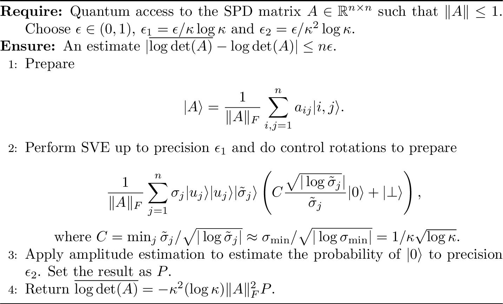

# SVE-based quantum algorithms {#chap-svebased}

In the following section, we will cover some quantum algorithms based on singular value estimation. Some of them are here just because they are simple enough to have a good pedagogical value, while some of them we believe will be really useful in performing data analysis.


## Estimation of the spectral norm and the condition number

<!--
# TODO Estimation of spectral norm and condition number from quantum access
# Let's understand properly the procedure from quantum gradient descent paper
# labels: help wanted,
-->
We will elaborate more on this result soon. For the moment, we report the main statement.

```{theorem, spectral-norm-estimation, name="Spectral norm estimation"}
Let there be quantum access to the matrix $A \in \R ^{n\times m}$, and let $\epsilon>0$ be a precision parameter. There exists a quantum algorithm that estimates $\|A\|$ to error $\epsilon\|A\|_F$ in time $\widetilde{O}\left(\frac{\log(1/\epsilon)}{\epsilon}\frac{\|A\|_F}{\|A\|}\right)$.
```

<!-- ```{proof}
TODO!
```
-->

## Explained variance {#sec-explainedvariance}

<!--
# TODO Add algos for estimating variance
# From Armando's thesis!
# labels: help wanted, enhancement
-->
The content of this section is extracted [@bellante2021quantum]. 

Let $A = U\Sigma V^T$ be the singluar value decomposition of a matrix $A \in \mathbb{R}^{n \times m}$. We call *factor scores* of $A$, and denote them with $\lambda_i = \sigma_i^2$, the squares of its singular values. Similarly, we call *factor score ratios* the relative magnitudes of the factor scores $\lambda^{(i)} = \frac{\lambda_i}{\sum_j^{rank(A)} \lambda_j} = \frac{\sigma_i^2}{\sum_j^{rank(A)}\sigma_j^2}$. The factor score ratios are a measure of the amount of variance explained by the singular values.

We state here some nice examples of SVE algorithms: the first  allows us to assess whether a few singular values/factor scores explain most of the variance of the matrix (as it is the case in many visualization algorithms e.g. PCA, CA, etc.); the second one allows computing the cumulative sum of the factor score ratios associated to singular values grater or equal than a certain threshold; the third one is a modified version of the spectral norm estimation result and allows us to define a threshold for the smallest singular value such that the the sum of the above explains more than a given percentage of the total variance; finally, the last two algorithms allow retrieving a classical description of the singular vectors that correspond to the most relevant singular values.
The main intuition behind these algorithms is that it is possible to create the state
$\sum_{i}^{r} \sqrt{\lambda^{(i)}} \ket{u_i}\ket{v_i}\ket{\overline{\sigma}_i}$.

The first algorithm uses a parameter $\gamma$ to control how big a factor score ratio should be for the corresponding singular value/factor score to be measured.
If we choose $\gamma$ bigger than the least factor scores ratio of interest, only the biggest singular values/factor scores will be likely to be measured.

```{theorem, factor-score-estimation, name="Quantum factor score ratio estimation"}
Let there be quantum access to a matrix $A \in \R^{n \times m}$, with singular value decomposition $A = \sum_i\sigma_i u_i v^T_i$ and $\sigma_{max} \leq 1$. Let $\gamma, \epsilon$ be precision parameters. There exists a quantum algorithm that, in time $\widetilde{O}\left(\frac{1}{\gamma^2}\frac{\mu(A)}{\epsilon}\right)$, estimates:

- the factor score ratios $\lambda^{(i)}$, such that $\|\lambda^{(i)} - \overline{\lambda}^{(i)}\| \leq \gamma$, with high probability;
- the correspondent singular values $\sigma_i$, such that $\|\sigma_i - \overline{\sigma}_i\| \leq \epsilon$, with probability at least $1-1/\text{poly}(n)$;
- the correspondent factor scores $\lambda_i$, such that $\|\lambda_i - \overline{\lambda}_i\| \leq 2\epsilon$, with probability at least $1-1/\text{poly}(n)$.

```

```{proof}
We provide an algorithm that satisfies the above guarantees. As a first step, one creates the state
$$\ket{A} = \frac{1}{\|A\|_F}\sum_i^n\sum_j^m a_{ij}\ket{i}\ket{j} = \frac{1}{\sum_j^r \sigma_j^2}\sum_i^r \sigma_i \ket{u_i}\ket{v_i}.$$
This step costs $\widetilde{O}(1)$, assuming that the data are stored in an adeguate data structure.
From this state we apply SVE in time $\widetilde{O}(\mu(A)/\epsilon)$
$$\ket{A'} = \frac{1}{\sum_j^r \sigma_j^2}\sum_i^r \sigma_i \ket{u_i}\ket{v_i}\ket{\overline{\sigma}_i}$$
encoding the singular values with absolute precision $\epsilon$.
If we ignore the first two registers, we have the state $\ket{A''} = \sum_i^r \sqrt{\lambda^{(i)}}\ket{\overline{\sigma}_i}$, from which we can measure the singular values (and factor scores) with probability equal to their factor score ratios.
To evaluate the number $S$ of measurements needed on $\ket{A''}$ to satisfy the guarantees of the theorem, we can model the measurement process as performing $r$ Bernoulli trials: one for each $\overline{\lambda}^{(i)}$, so that if we measure $\overline{\sigma}_i$ it is a success for the $i^{th}$ Bernoulli trial and a failure for all the others.
We use the estimator
$\overline{\lambda}^{(i)} = \frac{\zeta_{\overline{\sigma}_i}}{S}$,
where $\zeta_{\overline{\sigma}_i}$ is the number of times $\overline{\sigma}_i$ appears in the measurements and $S$ is the number of total measurements.
Given a confidence level $z$ and an absolute error $\gamma$, it is possible to use the Wald confidence interval to determine a value for $S$ such that $\|\lambda^{(i)} - \overline{\lambda}^{(i)}\| \leq \gamma$ with confidence level $z$.
It is possible to show that $\gamma \leq \frac{z}{2\sqrt{S}}$ [@schuld2018supervised], from which we get $S=\frac{z^2}{4\gamma^2}$.
Since $z$ is a small number, we can state that the complexity of the algorithm is
$\widetilde{O}\left(\frac{1}{\gamma^2}\frac{\mu(A)}{\epsilon}\right)$.

Finally, note that the error on the factor scores is $2\epsilon$. Suppose that we run SVE with precision $\tau$.
For each $\lambda_i$, the worst estimate is
$\overline{\lambda_i} = (\sigma_i \pm \tau)^2 = \sigma_i^2 \pm 2\tau\sigma_i + \tau^2$ and since $0 \leq \sigma_i \leq 1$, we can say that the worst case is
$\sigma_i^2 + (2\tau + \tau^2)$.
Solving the equation
$2\tau + \tau^2=\epsilon$ for $\tau>0$
leads to
$\tau = \sqrt{1+\epsilon} - 1$. Finally,
$$\tau = \sqrt{1+\epsilon} - 1 = \frac{(\sqrt{1+\epsilon} - 1)(\sqrt{1+\epsilon} + 1)}{(\sqrt{1+\epsilon} + 1)} = \frac{1+\epsilon - 1} {\sqrt{1+\epsilon} + 1} = \frac{\epsilon}{\sqrt{1+\epsilon} + 1} \sim \frac {\epsilon}{2}$$
which proves the error guarantees.
```


One limitation of the algorithm used in the proof is that the Wald confidence interval is not a simultaneous confidence interval.
For this reason, it is not guaranteed that all the factor score ratios estimates are computed with precision $\gamma$ with the same confidence.
We have stated the proof using the Wald confidence interval for the sake of simplicity and because we believe that it provides good estimates in practice.
To overcome this problem it is possible to adjust the confidence level according to the number of estimated factor scores (e.g. with a Bonferroni correction) or to slightly modify the algorithm to use $\ell_\infty$ tomography (Theorem \@ref(thm:tomellinfinity)) on $\ket{A''}$.
The modified version of the algorithm still has an asymptotic run-time of $\widetilde{O}\left(\frac{1}{\gamma^2}\frac{\mu(A)}{\epsilon}\right)$, while providing that all $\|\lambda^{(i)} - \overline{\lambda}^{(i)}\| \leq \gamma$ with probability at least $1 - 1/\text{poly}(r)$, where $r$ is the rank of $A$.

Often in data representations, the cumulative sum of the factor score ratios is a measure of the quality of the representation. By modifying the above proof to leverage $\ell_\infty$ tomography, the cumulative sum can be estimated as $\|\sum_i^k \lambda^{(i)} - \sum_i^k \overline{\lambda}^{(i)}\| \leq k\epsilon$ with probability $1-1/\text{poly}(r)$.
However, a slight variation of the algorithm of Theorem \@ref(thm:spectral-norm-estimation) provides a more accurate estimation in less time, given a threshold $\theta$ for the smallest singular value to retain.

```{theorem, check-explained-variance, name="Quantum check on the factor score ratios' sum"}
Let there be efficient quantum access to the matrix $A \in \mathbb{R}^{n \times m}$, with singular value decomposition $A = \sum_i\sigma_iu_iv^T_i$. Let $\eta, \epsilon$ be precision parameters and $\theta$ be a threshold for the smallest singular value to consider.
There exists a quantum algorithm that estimates $p = \frac{\sum_{i: \overline{\sigma}_i \geq \theta} \sigma_i^2}{\sum_j^r \sigma_j^2}$, where $\|\sigma_i - \overline{\sigma}_i\| \leq \epsilon$, to relative error $\eta$ in time $\widetilde{O}\left(\frac{\mu(A)}{\epsilon}\frac{1}{\eta \sqrt{p}}\right)$.
```

```{proof}
As reported in the proof above, creating the state
$\ket{A''} = \sum_i^r \sqrt{\lambda^{(i)}}\ket{\overline{\sigma}_i}$ costs $\widetilde{O}(\mu(A)/\epsilon)$.
From this state it is possible to append a quantum register that is $\ket{0}$ if $\overline{\sigma}_i < \theta$ and $\ket{1}$ otherwhise: $\ket{\varphi} = \sum_{i: \overline{\sigma}_i \geq \theta} \sqrt{\lambda^{(i)}}\ket{\overline{\sigma}_i}\ket{0} + \sum_{j: \overline{\sigma}_j < \theta} \sqrt{\lambda^{(i)}}\ket{\overline{\sigma}_i}\ket{1}$.
The probability of measuring $\ket{0}$ is $p=\sum_{i: \overline{\sigma}_i \geq \theta} \lambda^{(i)} = \frac{\sum_{i: \overline{\sigma}_i \geq \theta}\sigma_i^2}{\sum_j^r \sigma_j^2}$. Using amplitude estimation (Lemma \@ref(lem:amp-amp-est-simple)), we can estimate $p$ in time $\widetilde{O}\left(\frac{\mu(A)}{\sqrt{p}\epsilon}\right)$.
```

Moreover, an observation on the algorithm for spectral norm estimation allows to perform a binary search of $\theta$ given the desired sum of factor score ratios.
```{theorem, explained-variance-binarysearch, name="Quantum binary search for the singular value threshold"}
Let there be efficient quantum access to the matrix $A \in \mathbb{R}^{n \times m}$. Let $p$ be the factor ratios sum to retain. The threshold $\theta$ for the smallest singular value to retain can be estimated to absolute error $\epsilon$ in time $\widetilde{O}\left(\frac{\log(1/\epsilon)\mu(A)}{\epsilon\sqrt{p}}\right)$.
```

Both these procedures are very fast. We will see that in problems such as PCA, CA, and LSA, the desired sum of factor score ratios to retain is a number in the range $p \in [1/3, 1]$ with precision up to the second decimal digit. In practice, the complexity of these last two algorithms scales as $\widetilde{O}\left(\frac{\mu(A)}{\epsilon}\right)$.

After introducing the procedures to test for the most relevant singular values, factor scores and factor score ratios of $A$, we present an efficient routine to extract the corresponding right/left singular vectors.
Additionally, this subroutine can provide an estimation of the singular values greater than $\theta$, to absolute error $\epsilon$.

```{theorem, top-k-sv-extraction, name="Top-k singular vectors extraction"}
Let there be efficient quantum access to the matrix $A \in \mathbb{R}^{n \times m}$, with singular value decomposition $A = \sum_i^r \sigma_i u_i v_i^T$ and $\sigma_{max} \leq 1$. Let $\delta > 0$ be a precision parameter for the singular vectors, $\epsilon>0$ a precision parameter for the singular values, and  $\theta>0$ be a threshold such that $A$ has $k$ singular values greater than $\theta$. Define $p=\frac{\sum_{i: \overline{\sigma}_i \geq \theta} \sigma_i^2}{\sum_j^r \sigma_j^2}$. There exist quantum algorithms that estimate:

- The top $k$ left singular vectors $u_i$ of $A$ with unit vectors $\overline{u}_i$ such that $||u_i-\overline{u}_i||_2 \leq \delta$ with probability at least $1-1/poly(n)$, in time $\widetilde{O}\left(\frac{1}{\theta}\frac{1}{\sqrt{p}}\frac{\mu(A)}{\epsilon}\frac{kn}{\delta^2}\right)$;
- The top $k$ right singular vectors  $v_i$ of $A$ with unit vectors $\overline{v}_i$ such that $||v_i-\overline{v}_i||_2 \leq \delta$ with probability at least $1-1/poly(m)$, in time $\widetilde{O}\left(\frac{1}{\theta}\frac{1}{\sqrt{p}}\frac{\mu(A)}{\epsilon}\frac{km}{\delta^2}\right)$;
- The top $k$ singular values $\sigma_i$ and factor scores $\lambda_i$ of $A$ to precision $\epsilon$ and $2\epsilon$ with probability at least $1 - 1/\text{poly}(m)$, in time $\widetilde{O}\left(\frac{1}{\theta}\frac{1}{\sqrt{p}}\frac{\mu(A)k}{\epsilon}\right)$ or any of the two above.

```

```{proof}
As reported in the proofs above, creating the state
$\ket{A'} = \sum_i^r \sqrt{\lambda^{(i)}}\ket{u_i}\ket{v_i}\ket{\overline{\sigma}_i}$ costs $\widetilde{O}(\mu(A)/\epsilon)$.
On this state we append an additional register, set to $\ket{0}$ if $\overline{\sigma}_i \geq \theta$ and to $\ket{1}$ otherwise. The cost of this operation is negligible as it only depends on the binary encoding of $\ket{\overline{\sigma}_i}$.
On this state we perform amplitude amplification (Lemma \@ref(lem:amp-amp-est-simple)) on $\ket{0}$ and obtain the state
$$\ket{\varphi} = \sum_i^k \sqrt{\lambda^{(i)}}\ket{u_i}\ket{v_i}\ket{\overline{\sigma}_i}$$
with a superposition of the $k$ most relevant singular values and vectors. Creating $\ket{\varphi}$ costs $\widetilde{O}\left(\frac{\mu(A)}{\sqrt{p}\epsilon}\right)$.
On this state we append an additional register and perform a conditional rotation
$$\frac{C}{\sum_i^k\sigma_i^2}\sum_i^k \frac{\sigma_i}{\overline{\sigma}_i} \ket{u_i}\ket{v_i}\ket{\overline{\sigma}_i}\ket{0} +\frac{1}{\sum_i^k\sigma_i^2}\sum_i^k \sqrt{1-\frac{C^2}{\overline{\sigma}_i^2}}\ket{u_i}\ket{v_i}\ket{\overline{\sigma}_i}\ket{1}$$
The constant $C$ is a normalization factor in the order of $\widetilde{O}(1/\kappa(A^{(k)}))$ where $\kappa(A^{(k)}) = \frac{\sigma_{max}}{\sigma_{min}}$
is the condition number of the low-rank ($k$-rank) matrix
$A^{(k)}$.
Since for construction
$\sigma_{max} \leq 1$ and $\sigma_{min} \geq \theta$,
we can bound the condition number
$\kappa(A^{(k)}) \leq \frac{1}{\theta}.$
From the famous work of Harrow, Hassidim and Lloyd [@HarrowHassidim2009HHL] we know that applying amplitude amplification on the state above, with the the third register being
$\ket{0}$,
would cost
$\widetilde{O}(\kappa(A^{(k)}) T(U)$, where $T(U)$ is the run-time to create the state.
In our case, the cost till this step is
$\widetilde{O}\left(\frac{1}{\theta}\frac{1}{\sqrt{p}}\frac{\mu(A)}{\epsilon}\right)$, and
amplitude amplification leaves the registers in the state
$$\frac{1}{\sqrt{\sum_{i}^k \frac{\sigma_i^2}{\overline{\sigma}_i^2}}}\sum_i^k\frac{\sigma_i}{\overline{\sigma}_i} \ket{u_i}\ket{v_i}\ket{\overline{\sigma}_i} \sim
    \frac{1}{\sqrt{k}}\sum_i^k \ket{u_i}\ket{v_i}\ket{\overline{\sigma}_i}
$$
where
$\overline{\sigma}_i \in [\sigma_i - \epsilon, \sigma_i + \epsilon]$
and
$\frac{\sigma_i}{\sigma_i \pm \epsilon} \rightarrow 1$
for
$\epsilon \rightarrow 0$.
The last step of the proof is to compute the time complexity of the state-vector tomography on $\frac{1}{\sqrt{k}}\sum_i^k \ket{u_i}\ket{v_i}\ket{\overline{\sigma}_i}$.
When measuring the last register of state in the computational basis and obtaining $\ket{\overline{\sigma}_i}$, the first two registers collapse in the state $\ket{u_i}\ket{v_i}$.
On $\ket{u_i}\ket{v_i}$, it is possible to perform $\ell_2$ vector-state tomography using Theorem \@ref(thm:tomelle2) either on the first register, to retrieve $\overline{u}_i$, or on the second one, to retrieve $\overline{v}_i$.
Since $u_i \in R^n$ and $v_i \in R^m$, performing state-vector tomography
on the first register
takes time
$O(\frac{n\log{n}}{\delta^2})$
and performing it on the second takes time
$O(\frac{m\log{m}}{\delta^2})$.
Using a coupon collector's argument, if the $k$ states
$\ket{\overline{\sigma}_i}$
are uniformly distributed, to get all the $k$ possible couples
$\ket{u_i}\ket{v_i}$
at least once we would need
$k\log k$
measurements on average.
This proves that it is possible to estimate all the singular values greater than $\theta$, with the guarantees above, in time $\widetilde{O}(\frac{1}{\theta}\frac{1}{\sqrt{p}}\frac{\mu(A)k}{\epsilon})$.
To perform tomography on each state-vector, one should satisfy the coupon collector the same number of times as the measurements needed by the tomography procedure.
The costs of the tomography for all the vectors $\{\overline{u}_i\}_i^k$ and $\{\overline{v}_i\}_i^k$ are
$O\left(T(U)\frac{k\log{k}\cdot n\log{n}}{\delta^2}\right)$,
and
$O\left(T(U)\frac{k\log{k}\cdot m\log{m}}{\delta^2}\right)$, where $T(U)$ is the run-time to create the state on which to perform tomography.
It easily follows that the following complexities are proven:
$\widetilde{O}\left(\frac{1}{\theta}\frac{1}{\sqrt{p}}\frac{\mu(A)}{\epsilon}\frac{kn}{\delta^2}\right), \widetilde{O}\left(\frac{1}{\theta}\frac{1}{\sqrt{p}}\frac{\mu(A)}{\epsilon}\frac{km}{\delta^2}\right).$
```
In the experiments paragraph \@ref(sec:runtime-analysis), we provide experiments that show that the coupon collector's prediction is accurate for practical $\epsilon$.

```{corollary, top-k-sv-linfty, name="Fast top-k singular vectors extraction"}
The run-times of the theorem above can be improved to $\widetilde{O}\left(\frac{1}{\theta}\frac{1}{\sqrt{p}}\frac{\mu(A)}{\epsilon}\frac{k}{\delta^2}\right)$ with estimation guarantees on the $\ell_\infty$ norms.
```
The proof of this corollary consists in a variant of the proof above that uses $\ell_\infty$ tomography (Theorem \@ref(thm:tomellinfinity)) to extract the singular vectors.

Besides $p$ being negligible, it is interesting to note that the parameter $\theta$ can be computed using:

- the procedures of Theorems \@ref(thm:factor-score-estimation) and \@ref(thm:check-explained-variance);
- the binary search of Theorem \@ref(thm:explained-variance-binarysearch);
- the available literature on the type of data stored in the input matrix $A$.

About the latter, for instance, the experiments of [@KL18] on the run-time parameters of the polynomial expansions of the MNIST dataset support this expectation:
even though in qSFA they keep the $k$ smallest singular values and refer to $\theta$ as the biggest singular value to retain, this value does not vary much when the the dimensionality of their dataset grows.
In the experiments chapter, we observe similar $\theta$s in different datasets for image classification.
Note that, given a vector with $d$ non-zero entries, performing $\ell_\infty$ tomography with error $\frac{\delta}{\sqrt{d}}$ provides the same guarantees of $\ell_2$ tomography with error $\delta$.
In practice, this result implies that the extraction of the singular vectors, with $\ell_2$ guarantees, can be faster if we can assume some prior assumptions on their sparseness: $\widetilde{O}\left(\frac{1}{\theta}\frac{1}{\sqrt{p}}\frac{\mu(A)}{\epsilon}\frac{kd}{\delta^2}\right)$.


## Singular value estimation of a product of two matrices
This is an example of an algorithm that has been superseded by recent development in singular value transformation. Nevertheless, it is a non-trivial way of using SVE, which a nice mathematical error analysis.


```{theorem, sve-product, name="SVE of product of matrices"}
Assume to have quantum access to matrices $P \in \mathbb{R}^{d\times d}$ and $Q \in \mathbb{R}^{d \times d}$. Define $W=PQ = U\Sigma V^T$  and $\epsilon > 0$ an error parameter. There is a quantum algorithm that with probability at least $1-poly(d)$ performs the mapping $\sum_{i}\alpha\ket{v_i} \to \sum_{i}\alpha_i\ket{v_i}\ket{\overline{\sigma_i}}$ where $\overline{\sigma_i}$	is an approximation of the eigenvalues $\sigma_i$ of $W$ such that $|\sigma_i - \overline{\sigma}_i | \leq \epsilon$, in time $\tilde{O}\left(\frac{ ( \kappa(P) + \kappa(Q) ) (\mu(P)+\mu(Q))}{\varepsilon}\right)$.
```

```{proof}
We start by noting that for each singular value $\sigma_{i}$ of $W$ there is a corresponding eigenvalue  $e^{-i\sigma_i}$ of the unitary matrix $e^{-iW}$. Also, we note that we know how to multiply by $W$ by applying theorem \@ref(thm:matrix-algebra-sve) sequentially with $Q$ and $P$. This will allow us to approximately apply the unitary $U=e^{-iW}$. The last step will consist of the application of phase estimation to estimate the eigenvalues of $U$ and hence the singular values of $W$. Note that we need $W$ to be a symmetric matrix because of the Hamiltonian simulation part. In case $W$ is not symmetric, we redefine it as
$$
W  =
\begin{bmatrix}
    0 & PQ\\
    (PQ)^T & 0
\end{bmatrix}
$$
Note we have $W=M_1M_2$ for the matrices $M_1, M_2$ stored in QRAM and defined as

$$
M_1 = \begin{bmatrix}
    P & 0\\
    0 & Q^T
\end{bmatrix},
M_2 = \begin{bmatrix}
    0 & Q\\
    P^T & 0
\end{bmatrix}.
$$


We now show how to approximately apply $U=e^{-iW}$ efficiently. Note that for a symmetric matrix $W$ we have $W=V\Sigma V^T$ and using the Taylor expansion of the exponential function we have

$$U = e^{-iW} = \sum_{j=0}^{\infty} \frac{(-iW)^j}{j!} =   V \sum_{j=0}^{\infty} \frac{(-i\Sigma)^j}{j!} V^T$$

With $\widetilde{U}$ we denote our first approximation of $U$, where we truncate the sum after $\ell$ terms.

$$\widetilde{U} = \sum_{j=0}^{\ell} \frac{(-iW)^j}{j!} =   V \sum_{j=0}^{\ell} \frac{(-i\Sigma)^j}{j!} V^T$$

We want to chose $\ell$ such that $\norm{U - \widetilde{U}} < \epsilon/4$. We have:

\begin{eqnarray*}
\norm{U - \widetilde{U}} & \leq & || \sum_{j=0}^{\infty} \frac{(-iW)^j}{j!} - \sum_{j=0}^{\ell} \frac{(-iW)^j}{j!}   ||  \leq
|| \sum_{j={\ell+1}}^{\infty} \frac{(-iW)^j}{j!} || \leq \sum_{j={\ell+1}}^{\infty}  || \frac{(-iW)^j}{j!} || \leq \sum_{j={\ell+1}}^{\infty}  \frac{1}{j!} \\
& \leq & \sum_{j={\ell+1}}^{\infty}  \frac{1}{2^{j-1}} \leq 2^{-\ell +1}
\end{eqnarray*}

where we used triangle inequality and that $\norm{W^j}\leq 1$. Choosing $\ell = O(\log 1/ \varepsilon)$ makes the error less than $\epsilon/4$.
%We can approximate a positive series where the term $a_n$ satisfy the following two conditions: $0 \leq a_n \leq Kr^n$ with $K>0, 0<r<1$ by expressing the error as the geometric series $\frac{Kr^{N+1}}{1-r}$. In our case $K=1$ and $r=1/2$. For a given $\epsilon$ we have to find $\ell$ such that $\frac{(\frac{1}{2})^{\ell+1}}{1-(\frac{1}{2})} \leq \epsilon$. By taking $\ell = O(\log 1/\epsilon)$ we can easily satisfy the error guarantee.

In fact, we cannot apply $\widetilde{U}$ exactly but only approximately, since we need to multiply with the matrices $W^j, j\in[\ell]$ and we do so by using the matrix multiplication algorithm for the matrices $M_1$ and $M_2$. For each of these matrices, we use an error of $\frac{\epsilon}{8 \ell}$ which gives an error for $W$ of $\frac{\epsilon}{4 \ell}$ and an error for $W^j$ of at most $\frac{\epsilon}{4}$. The running time for multiplying with each $W^j$ is at most $O(\ell ( \kappa(M_1)\mu(M_1) \log( 8\ell/\epsilon) + \kappa(M_2)\mu(M_2) \log( 8\ell/\epsilon)  ))$ by multiplying sequentially. Hence, we will try to apply the unitary ${U}$ by using the Taylor expansion up to level $\ell$ and approximating each $W^j, j\in [\ell]$ in the sum through our matrix multiplication procedure that gives error at most $\frac{\epsilon}{4}$.


In order to apply $U$ on a state $\ket{x} = \sum_{i} \alpha_i \ket{v_i}$, let's assume $\ell+1$ is a power of two and define $N_l = \sum_{j=0}^l (\frac{(-i)^j}{j!})^2$. We start with the state
$$\frac{1}{\sqrt{N_l}}\sum_{j=0}^l \frac{-i^j}{j!}\ket{j}\ket{x}$$

Controlled on the first register we use our matrix multiplication procedure to multiply with the corresponding power of $W$ and get a state at most $\epsilon/4$ away from the state

$$\frac{1}{\sqrt{N_l}}\sum_{j=0}^l \frac{-i^j}{j!}\ket{j}\ket{W^jx}.$$

We then perform a Hadamard on the first register and get a state  $\epsilon/4$ away from the state

$$\frac{1}{\sqrt{\ell}} \ket{0} \left( \frac{1}{\sqrt{N'}} \sum_{j=0}^l \frac{-i^j}{j!} \ket{W^jx}\right) + \ket{0^\bot} \ket{G}$$


where $N'$ just normalizes the state in the parenthesis. Note that after the Hadamard on the first register, the amplitude corresponding to each $\ket{i}$ is the first register is the same. We use this procedure inside an amplitude amplification procedure to increase the amplitude $1/\sqrt{\ell}$ of $\ket{0}$ to be close to 1, by incurring a factor $\sqrt{\ell}$ in the running time. The outcome will be a state  $\epsilon/4$ away from the state

$$\left( \frac{1}{\sqrt{N'}} \sum_{j=0}^l \frac{-i^j}{j!} \ket{W^jx}\right) = \ket{\tilde{U}x}$$
which is the application of $\widetilde{U}$. Since $\norm{U - \widetilde{U}} \leq \epsilon/4$, we have that the above procedure applies a unitary $\overline{U}$ such that $\norm{U - \overline{U}} \leq \epsilon/2$. Note that the running time of this procedure is given by the amplitude amplification and the time to multiply with $W^j$, hence we have that the running time is

$$O(\ell^{3/2} ( \kappa(M_1)\mu(M_1) \log( 8\ell/\epsilon) + \kappa(M_2)\mu(M_2) \log( 8\ell/\epsilon)  )$$

Now that we know how to apply $\overline{U}$, we can perform phase estimation on it with error $\epsilon/2$. This provides an algorithm for estimating the singular values of $W$ with overall error of $\epsilon$. The final running time is

$$O(\frac{\ell^{3/2}}{\epsilon} ( \kappa(M_1)\mu(M_1) \log( 8\ell/\epsilon) + \kappa(M_2)\mu(M_2) \log( 8\ell/\epsilon)  )$$


We have $\mu(M_1)=\mu(M_2)= \mu(P)+\mu(Q)$ and $\kappa(M_1)=\kappa(M_2) = \frac{max \{ \lambda^{P}_{max}, \lambda^{Q}_{max}  \}}{ min \{ \lambda^{P}_{min}, \lambda^{Q}_{min}  \}} \leq \kappa(P)+\kappa(Q)$, and since $\ell=O(\log 1/\epsilon)$the running time can be simplified to


$$\tilde{O}(\frac{ ( \kappa(P) + \kappa(Q))(\mu(P)+\mu(Q))}{\epsilon} ).$$
```

## Example: Log-determinant

A very simple example of the utility of the SVE subroutines is to estimate quantities associated to a given matrix. In this case we are going to study the log-determinant. As the name sais, this is just the logarithm of the determinant of a (symmetric positive definite) SPD matrix.

```{definition, log-determinant, name="Log-determinant of an SPD matrix"}
Let $A\in \mathbb{R}^{n \times n}$ be a SPD matrix with singular value decomposition $A=U\Sigma V^T$. The log-determinant of $A$ is defined as:
  $$\log\det(A)=\log(\prod_i^n \sigma_i) = \sum_i^n \log(\sigma_i)$$
```

Please keep in mind that this is *not* the fastest algorithm for estimating the log-determinant (we will see that in the appropriate chapter on spectral sums), but it's worth mentioning here because it perhaps the first thing one would try to do in order to estimate this quantity. It also is a good example of the power of quantum singular value estimation, and checking the correctness of this proof might be a good exercise to learn more some mathematical tricks that are very useful to upper bound quantities that appear in the error analysis or the runtime analysis of algorithms.


```{r, algo-logdet-sve, fig.cap="SVE based algorithm to estimatethe log-determinant of a matrix", echo=FALSE}

```

```{theorem, logdet-sve, name="SVE based algorithm for log-determinant"}
Assuming to have quantum access to an SPD matrix $A$, the algorithm in figure \@ref(fig:algo-logdet-sve) returns
$\overline{\log\det(A)}$ such that $|\overline{\log\det(A)} - \log\det(A)| < \epsilon |\log\det(A)|$ in time
$\widetilde{O}(\mu \kappa^3/\epsilon^2).$
```


```{proof}
We can rewrite the quantum state encoding the representation of $A$ (which we can create with quantum access to $A$) as follow:
\begin{equation}
|A\rangle = \frac{1}{\|A\|_F} \sum_{i,j=1}^n a_{ij}|i,j\rangle = \frac{1}{\|A\|_F} \sum_{j=1}^n \sigma_j |u_j\rangle|u_j\rangle.
\end{equation}
Starting from the state $\ket{A}$, we can apply SVE (see lemma  \@ref(thm:sve-theorem) to $\ket{A}$ up to precision $\epsilon_1$ to obtain
$$\frac{1}{\|A\|_F} \sum_{j=1}^n \sigma_j |u_j\rangle|u_j\rangle |\tilde{\sigma}_j\rangle,$$
where $|\tilde{\sigma}_j-\sigma_j|\leq \epsilon_1$.
Since $\norm{A} \leq 1$, using controlled operations, we can prepare

\begin{align}
\frac{1}{\|A\|_F} \sum_{i=1}^n \sigma_j |u_j\rangle|u_j\rangle
\ket{\tilde{\sigma}_j}
\left(
C\frac{\sqrt{-\log \tilde{\sigma}_j}}{\tilde{\sigma}_j}\ket{0}
+ \ket{0^\bot}
\right),
(\#eq:tracelogdet)
\end{align}

  where $C=\min_j \tilde{\sigma}_j/\sqrt{|\log \tilde{\sigma}_j|} \approx \sigma_{\min}/\sqrt{|\log \sigma_{\min}|}
=1/\kappa\sqrt{\log \kappa}$.
The probability of $\ket{0}$ is
$$P = -\frac{C^2}{\|A\|_F^2} \sum_{j=1}^n  \frac{\sigma_j^2}{\tilde{\sigma}_j^2} \log \tilde{\sigma}_j.$$


First, we do the error analysis.
Note that
\begin{align}
\left| \sum_{j=1}^n  \frac{\sigma_j^2}{\tilde{\sigma}_j^2} \log \tilde{\sigma}_j - \sum_{j=1}^n \log \sigma_j \right|
&\leq& \left|\sum_{j=1}^n \frac{\sigma_j^2}{\tilde{\sigma}_j^2} \log \tilde{\sigma}_j - \sum_{j=1}^n \frac{\sigma_j^2}{\tilde{\sigma}_j^2}\log \sigma_j \right|
+ \left|\sum_{j=1}^n \frac{\sigma_j^2}{\tilde{\sigma}_j^2} \log\sigma_j - \sum_{j=1}^n \log \sigma_j \right| \\
&\leq&
\sum_{j=1}^n \frac{\sigma_j^2}{\tilde{\sigma}_j^2} |\log \tilde{\sigma}_j - \log \sigma_j | +  \sum_{j=1}^n \frac{|\sigma_j^2-\tilde{\sigma}_j^2|}{\tilde{\sigma}_j^2}  |\log \sigma_j |  \\
&\leq& \sum_{j=1}^n (1 + \frac{\epsilon_1}{\tilde{\sigma}_j})^2 (\frac{\epsilon_1}{\tilde{\sigma}_j}+O(\frac{\epsilon_1^2}{\tilde{\sigma}_j^2})) + (2\kappa\epsilon_1 +\kappa^2\epsilon_1^2)
|\log\det(A)| \\
&\leq& n  (\kappa\epsilon_1+O(\kappa^2\epsilon_1^2)) + (2\kappa\epsilon_1 +\kappa^2\epsilon_1^2) |\log \det(A)| \\
&=& (n+2|\log \det(A)|) (\kappa\epsilon_1+O(\kappa^2\epsilon_1^2)).
\end{align}
In the third inequality, we use the result
that $\sigma_j\leq \tilde{\sigma}_j+\epsilon_1$.

Denote $P'$ as the $\epsilon_2$-approximation of $P$ obtained by amplitude estimation, then the above analysis shows that
$-\|A\|_F^2P'/C^2$ is an $(n+2|\log \det(A)|) (\kappa \epsilon_1 + O(\kappa^2 \epsilon_1^2)) +\epsilon_2\|A\|_F^2/C^2$
approximation of $\log\det(A)$. Note that

\begin{align}
&& (n+2|\log \det(A)|) (\kappa \epsilon_1 +
O(\kappa^2 \epsilon_1^2))
+\epsilon_2\|A\|_F^2/C^2 \\
&=&
(n+2|\log \det(A)|) (\kappa \epsilon_1 +
O(\kappa^2 \epsilon_1^2))
+\epsilon_2 \|A\|_F^2  \kappa^2\log \kappa \\
&\leq&
(n+2n\log \kappa) (\kappa \epsilon_1 +
O(\kappa^2 \epsilon_1^2))
+n\epsilon_2 \kappa^2\log \kappa \\
&=& O(n\epsilon_1\kappa\log \kappa+n\epsilon_2\kappa^2\log \kappa).
\end{align}


To make sure the above error is bounded by $n\epsilon$ it suffcies to choose
$\epsilon_1=\epsilon/\kappa\log \kappa$
and $\epsilon_2=\epsilon/\kappa^2\log \kappa$.

Now we do the runtime analysis. The runtime of the algorithm mainly comes from the using of SVE and the performing of amplitude estimation on the state in  (\@ref(eq:tracelogdet)).
Using quantum singular value estimation, the complexity to obtain the state
\@ref(eq:tracelogdet) is $\widetilde{O}(\mu /\epsilon_1)$.
The complexity to perform amplitude estimation  is $\widetilde{O}(\mu /\epsilon_1\epsilon_2)=\widetilde{O}(\mu \kappa^3(\log \kappa)^2/\epsilon^2)$.
```


