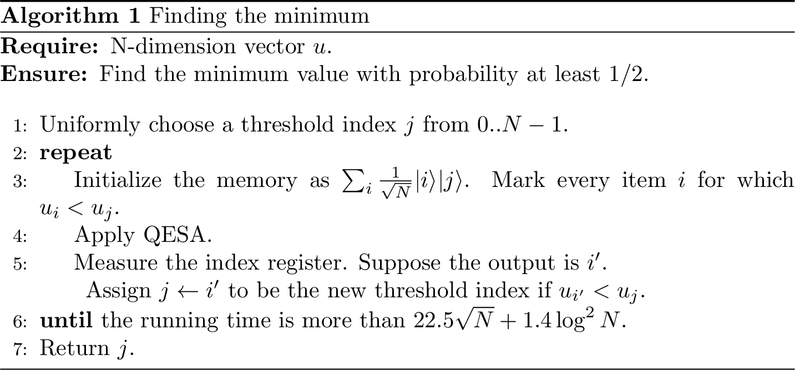
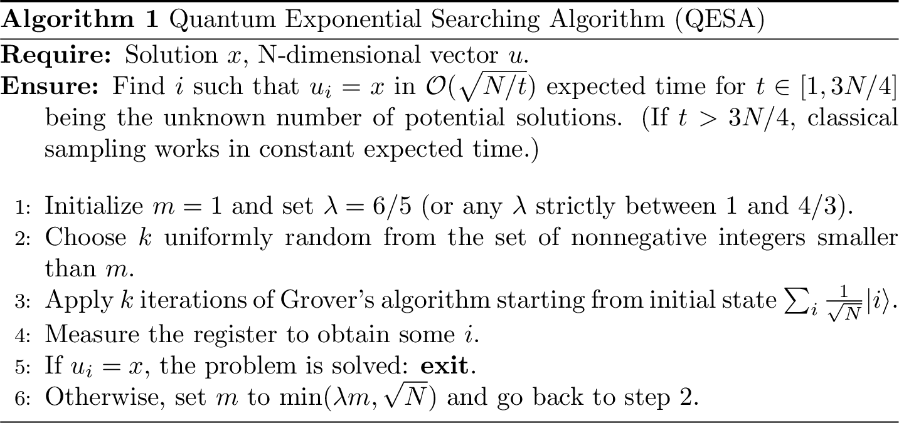

# A useful toolbox {#chap-toolbox}


## Phase estimation {#section:phaseestimation}

In this section we report the theorems for the subroutines that are often used to create new quantum algorithms. Often, we report multiple formulations, so that the working quantum algorithm researcher can pick the best version for them.


(ref:Kitaev1995QuantumProblem) [@Kitaev1995QuantumProblem]

```{theorem, phase-estimation, name="Phase estimation (ref:Kitaev1995QuantumProblem)"}
Let $U$ be a unitary operator with eigenvectors $\ket{v_j}$ and eigenvalues $e^{i \theta_j}$ for $\theta_j \in [-\pi, \pi]$, i.e. we have $U\ket{v_j} = e^{i \theta_j}\ket{v_j}$ for $j \in [n]$. For a precision parameter $\epsilon > 0$, there exists a quantum algorithm that runs in time $O(\frac{T(U)\log(n)}{\epsilon}))$ and with probability $1 - 1/poly(n)$ maps a state $\ket{\phi_i} = \sum_{j \in [n]} \alpha_j\ket{v_j}$ to the state $\sum_{j \in [n]} \alpha_j \ket{v_j}\ket{\bar{\theta_j}}$ such that $|\bar{\theta}_j - \theta_j| < \epsilon$ for all $j \in [n]$.
```

(ref:nannicini2019fast) [@nannicini2019fast]

```{theorem, phase-estimation-errors, name="Error and probability of failure of phase estimation (ref:NC02) Section 5.2 and (ref:nannicini2019fast)"}
Let $0.a=a_1, \dots a_q$ be the output of phase estimation when applied to an eigenstate with phase $\phi$. If we use $q+\lceil\log(2+\frac{1}{2\delta})\rceil$ qubits of precision, the first $q$ bits of $a$ will be accurate with probability at least $1-\delta$, i.e. $$Pr[|\phi - \sum_{j=1}^q a_j2^{-j}| \leq 2^{-q}] \geq 1-\delta$$
```


While the standard implementation of phase estimation is based on the quantum Fourier transform (QFT) circuit [@NC02], there have been various improvements [@ahmadi2010quantum] which try to soften the dependence on the QFT circuit, while retaining the accuracy guarantees offered by the QFT in estimating the angles $\theta_j$.

Note that the same algorithm described in theorem \@ref(thm:phase-estimation) can be made ''consistent'', in the sense of [@ta2013inverting] and [@A12]. While in the original formulation of phase estimation two different runs might return different estimates for $\overline{\theta}_j$, with a consistent phase estimation this estimate is fixed, with high probability. This means that the error between two different runs of phase estimation is almost deterministic.


<!-- % We also describe another simple method of getting such consistent phase estimation, which is to combine phase estimation estimates that are obtained for two different precision values. Let us assume that the  -->
<!-- % eigenvalues for the unitary $U$ are $e^{2\pi i \theta_{i}}$ for $\theta_{i} \in [0, 1]$. First, we perform phase estimation with precision $\frac{1}{N_{1}}$ where $N_{1}=2^{l}$ is a power  -->
<!-- % of $2$. We repeat this procedure $O(\log N/\theta^{2})$ times and output the median estimate. If the value being estimated  -->
<!-- % is $\frac{\lambda + \alpha }{2^{l}}$ for $\lambda \in \Z$ and $\alpha \in [0,1]$ and $|\alpha - 1/2 | \geq \theta'$ for an explicit constant $\theta'$ (depending on $\theta$) then  -->
<!-- % with probability at least $1-1/\text{poly}(N)$ the median estimate will be unique and will equal to $1/2^{l}$ times the closest integer to $(\lambda+ \alpha)$.  -->
<!-- % In order to also produce a consistent estimate for the eigenvalues for the cases where the above procedure fails, we perform a second phase estimation with precision $2/3N_{1}$.  -->
<!-- % We repeat this procedure as above for $O(\log N/\theta^{2})$ iterations and taking the median estimate. The second procedure fails to produce a consistent estimate only  -->
<!-- % for eigenvalues $\frac{\lambda + \alpha }{2^{l}}$ for $\lambda \in \Z$ and $\alpha \in [0,1]$ and $|\alpha - 1/3 | \leq \theta'$ or $|\alpha - 2/3 | \leq \theta'$ for a suitable constant  -->
<!-- % $\theta'$. Since the cases where the two procedures fail are mutually exclusive, one of them succeeds with probability $1-1/\text{poly}(N)$. The estimate produced  -->
<!-- % by the phase estimation procedure is therefore deterministic with very high probability. In order to complete this proof sketch, we would have to give explicit values of the constants $\theta$ and $\theta'$  -->
<!-- % and the success probability, using the known distribution of outcomes for phase estimation.  -->


## Grover's algorithm, amplitude games {#section:grover}

<!-- TODO: with high probability? how many other gates? -->

```{theorem, grover, name="Grover's algorithm"}
Let $N=2^n$ for $n>0$.
Given quantum oracle access $O_x: \ket{i}\mapsto\ket{i}\ket{x_i}$ to a vector $x=\{0,1\}^N$ where only one element of $x$ is 1, there is a quantum algorithm that finds the index of that element
using $O_x$ only $O(\sqrt{N})$ times.
```

This problem can be generalized to the case where there are multiple elements "marked" as good solutions. If we know the number of solutions in advance, the algorithm can be modified such that it fails with probability 0.


Amplitude amplification and amplitude estimation are two of the workhorses of quantum algorithms.


(ref:brassard2002quantum) [@nannicini2019fast]

```{theorem, thm-ampest-orig, name="Amplitude estimation, (ref:brassard2002quantum)"}
Given a quantum algorithm $$A:\ket{0} \to \sqrt{p}\ket{y,1} + \sqrt{1-p}\ket{G,0}$$ where $\ket{G}$ is some garbage state, then the amplitude estimation algorithm, using exactly $P$ iterations of the algorithm $A$ for any positive integer $P$, outputs $\tilde{p}$ $(0 \le \tilde p \le 1)$ such that
	$$
	|\tilde{p}-p|\le 2\pi \frac{\sqrt{p(1-p)}}{P}+\left(\frac{\pi}{P}\right)^2
	$$
	with probability at least $8/\pi^2$.
	If $p=0$ then $\tilde{p}=0$ with certainty, and if $p=1$ and $P$ is even, then $\tilde{p}=1$ with certainty.
```

(ref:montanaro2015quantum) [@montanaro2015quantum]

```{theorem, thm-ampest-orig-precise, name="Amplitude estimation (ref:brassard2002quantum), formulation of (ref:montanaro2015quantum)"}
There is a quantum algorithm called amplitude estimation which takes as input one copy of a quantum state $\ket{\psi}$, a unitary transformation $U=2\ket{\psi}\bra{\psi}-I$, a unitary transformation $V=I-2P$ for some projector $P$, and an integer $t$. The algorithm outputs $\tilde{a}$, an estimate of $a=\braket{\psi|P|\psi}$, such that:
  $$|\tilde{a}-a| \leq 2\pi\frac{\sqrt{a(1-a)}}{t} + \frac{\pi^2}{t^2}$$
with probability at least $8/\pi^2$, using $U$ and $V$ $t$ times each. If $a=0$ then $\tilde{a}=0$ with certainty, and if $a=1$ and $t$ is even, then $\tilde{a}=1$ with certainty.
```

In the original version of the Grover's algorithm we assume to know the number of marked elements, and therefore we can derive the correct number of iterations. Later on, a fixed-point version of amplitude amplification was proposed [@brassard2002quantum]  [@grover2005fixed], which was then optimized in [@yoder2014fixed]. These versions do not require to know the number of iterations in advance. These results foundamentally leverage the observation reprted in Proposition \@ref(prp:qesa-observation).

Recently, various researches worked on improvements of amplitude estimation by getting rid of the part of the original algorithm that performed the phase estimation (i.e. the Quantum Fourier Transform [@NC02]) [@grinko2019iterative], [@aaronson2020quantum]. As the QFT is not a NISQ subroutine, these results bring more hope to apply these algorithms in useful scenarios in the first quantum computers.

Perhaps a simpler formulation, which hides the complexity of the low-level implementation of the algorithm, and is thus more suitable to be used in quantum algorithms for machine learning is the following:

(ref:kerenidis2017quantumsquares) [@kerenidis2017quantumsquares]
 
```{lemma, amp-amp-est-simple, name="Amplitude amplification and estimation (ref:kerenidis2017quantumsquares) " }
If there is a unitary operator $U$ such that $U\ket{0}^{l}= \ket{\phi} = \sin(\theta) \ket{x, 0} + \cos(\theta) \ket{G, 0^\bot}$ then  $\sin^{2}(\theta)$ can be estimated to multiplicative error $\eta$ in time $O(\frac{T(U)}{\eta \sin(\theta)})$ and $\ket{x}$ can be generated in expected time $O(\frac{T(U)}{\sin (\theta)})$ where $T(U)$ is the time to implement $U$.
```

(ref:ambainis2012variable) [@ambainis2012variable]

```{theorem, variable-time-search, name="Variable Time Search (ref:ambainis2012variable)"}
Let $\mathcal A_1, \ldots, \mathcal A_n$ be quantum algorithms that return true or false and run in unknown times $T_1, \ldots, T_n$, respectively.
Suppose that each $\mathcal A_i$ outputs the correct answer with probability at least $2/3$.
Then there exists a quantum algorithm with success probability at least $2/3$ that checks whether at least one of $\mathcal A_i$ returns true and runs in time
$$\widetilde O\left(\sqrt{T_1^2+\ldots+T_n^2}\right).$$
```


<!-- TODO add Fixed-point quantum search with an optimal number of queries
exact amplitude amplification -->
<!-- TODO add oblivious amplitude amplification -->


### Example: estimating average and variance of a function

Albeit the ideas treated in this post are somehow well-digested in the mind of many quantum algorithms developers, this example is very useful to get a practical understanding of amplitude estimation. Notably, much more precise and involved discussion around this topic can be found in chapter \@ref(chap-montecarlo).

Suppose we have a random variable $X$ described by a certain probability distribution over $N$ different outcomes, and a function $f: \{0,\cdots N\} \to [0,1]$ defined over this distribution. How can we use quantum computers to evaluate some properties of $f$ such as expected value and variance faster than classical computers?

Let's start by translating into the quantum realm these two mathematical objects. The probability distribution is (surprise surprise) represented in our quantum computer by a quantum state over $n=\lceil \log N \rceil$ qubits.
$$\ket{\psi} = \sum_{i=0}^{N-1} \sqrt{p_i} \ket{i} $$
where the probability of measuring the state $\ket{i}$ is $p_i,$ for $p_i \in [0, 1]$. Basically, each bases of the Hilbert space represent an outcome of the random variable.

The quantization of the function $f$ is represented by a linear operator $F$ acting on a new ancilla qubit  (here on the right) as:

$$ F: \ket{i}\ket{0} \to \ket{i}\left(\sqrt{1-f(i)}\ket{0} + \sqrt{f(i)}\ket{1}\right) $$

If we apply $F$ with $\ket{\psi}$ as input state we get:

$$ \sum_{i=0}^{N-1} \sqrt{1-f(i)}\sqrt{p_i}\ket{i}\ket{0} + \sum_{i=0}^{N-1} \sqrt{f(i)}\sqrt{p_i}\ket{i}\ket{1} $$

Observe that the probability of measuring $\ket{1}$ in the ancilla qubit is $\sum_{i=0}^{N-1}p_if(i)$, which is $E[f(X)]$.
By sampling the ancilla qubit we won't get any speedup compared to a classical randomized algorithm with oracle access to the function, but applying [amplitude estimation](https://arxiv.org/abs/quant-ph/0005055) [@brassard2002quantum] to the ancilla qubit on the right, we can get an estimate of $E[F(X)]$ with precision $\epsilon$, quadratically faster than a classical computer: in only $O(\frac{1}{\epsilon})$ queries to $f$.

Finally, observe that:

-  if we chose $f(i)=\frac{i}{N-1}$ we are able to estimate $E[\frac{X}{N-1}]$ (which, since we know $N$ gives us an estimate of the expected value $E[X]$)
- if we chose $f(i)=\frac{i^2}{(N-1)^2}$ instead, we can estimate $E[X^2]$ and using this along with the previous choice of $f$ we can estimate the variance of $X$: $E[X^2] - E[X]^2$.

```{exercise}
Can you prove the previous two points?
```


We will see in Chapter \@ref(chap-montecarlo) why in many real-world cases this is not the best way of estimating $\mathbb{E}(f(X))$.

## Finding the minimum {#subsec:findmin}

We now want to show an algorithm that finds the minimum among $N$ unsorted values $u_{j\in[N]}$. As the Grover's algorithm, we work in the oracle model, so we assume to have quantum access to a the vector $u$. Without loss of generality we can take $N=2^n$, but if the length of our list is not a power of 2, we can just pad the rest of the elements in the list with zeroes. The statement of the theorem is the following.

(ref:durr1996quantum) [@durr1996quantum]

```{lemma, find-minimum-orig, name="Quantum minimum finding (ref:durr1996quantum)"}
Given quantum access to a vector $u \in [0,1]^N$ via the operation $\ket j \ket{\bar 0} \to \ket j \ket{ u_j}$ on $\Ord{\log N}$ qubits, where $u_j$ is encoded to additive accuracy $\Ord{1/N}$. Then, we can find the minimum $u_{\min} = \min_{j\in[N]}  u_j$ with success probability $1-\delta$ with $\Ord{\sqrt N \log \left (\frac{1}{\delta}\right) }$ queries and $\tOrd{\sqrt N  \log \left( \frac{1}{\delta}\right )}$ quantum gates.
```

Another formulation is the following:

(ref:ambainis2019quantum) [@ambainis2019quantum]

```{theorem, finding-minimum-2, name="Quantum Minimum Finding (ref:durr1996quantum) formulation of (ambainis2019quantum)"}
Let $a_1, \ldots, a_n$ be integers, accessed by a procedure $\mathcal P$.
There exists a quantum algorithm that finds $\min_{i=1}^n \{a_i\}$ with success probability at least $2/3$ using $O(\sqrt n)$ applications of $\mathcal P$.
```


This algorithm utilizes a subroutine called quantum exponential searching algorithm (QESA), which is again composed of amplitude amplification (Grover) and amplitude estimation.  For simplicity, we assume those values are distinct. The general idea is marking indices of values below a chosen threshold, returning and picking one of them as the new threshold with equal probability. After some iterations, it is expected to yield the lowest value. Note that the step of marking lower values is taken as an oracle with gate complexity of $O(1)$. We first present to algorithm and keep the explanation for later.


```{r, min-finding, fig.cap="Finding the minimum", echo=FALSE}

```


```{r, qesa, fig.cap="Quantum Exponential Searching Algorithm", echo=FALSE}

```


In the basic Grover's algorithm with one solution, $m = CI\left(\frac{\pi}{4}\sqrt{N}\right)$ iterations give the true output with error probability at most $1/N$ for $N \gg 1$, where $CI(x)$ is the closest integer to $x$. The result can be generalized in the case of $t \ll N$ solutions that the error rate is reduced to at most $t/N$ after exactly $m = CI\left(\frac{\pi-2\arcsin{\sqrt{t/N}}}{4\arcsin{\sqrt{t/N}}}\right) = \left \lfloor \frac{\pi}{4\arcsin{\sqrt{t/N}}} \right \rfloor$ iterations (and thus oracle calls), with an upper bound $m \leq \frac{\pi}{4}\sqrt{\frac{N}{t}}$. However, a problem arises when we have to amplify amplitudes corresponding to values below the threshold. In practice, the number of candidates is unknown and varies for each threshold. QESA is a generalized algorithm to find a solution for unknown $t$ with probability at least $1/4$ in $O(\sqrt{N/t})$, which is motivated by the following observation.


(ref:boyer1998tight) [@boyer1998tight]

```{proposition, qesa-observation, name="Quantum Exponential Searching Algorithm (ref:boyer1998tight)"}
Let $t$ be the (unknown) number of solutions and let $\theta$ be such that $\sin^2{\theta} = t/N$. Let $m$ be an arbitrary positive integer. Let $k$ be an integer chosen at random according to the uniform distribution between $0$ and $m − 1$. If we observe the register after applying $k$ iterations of Grover’s algorithm starting from the initial state $\sum_{i}\frac{1}{\sqrt{N}}|i\rangle$, the probability of obtaining a solution is exactly $P_m = \frac{1}{2} - \frac{\sin{(4m\theta)}}{4m\sin{(2\theta)}}$.
In particular, $P_m \geq 1/4$ when $m \geq 1/\sin{(2\theta)}$.
```


As QESA is expected to be done in $O(\sqrt{N/t})$ queries, one can deduce that the expected number of queries for the minimum-finding algorithm with success probability at least $1/2$ is $O(\sqrt{N})$. Repeating the algorithm $c$ times increases the success probability to $1-1/2^c$. In terms of quantum gates, the Grover part and the initialization part use $O(\sqrt{N})$ and $O(\log{N})$ respectively.


## Quantum linear algebra {#subsec:linearalgebra}

In our algorithms, we will also use subroutines for quantum linear algebra. From the first work of \cite{HarrowHassidim2009HHL} (known in the literature as HHL algorithm) that proposed a quantum algorithm for matrix inversion, a lot of progress has been made. In this section, we briefly recall some of the results in quantum linear algebra. We conclude by citing the state-of-the art techniques for performing not only matrix inversion and matrix multiplication, but also for applying a certain class of functions to the singular values of a matrix. A notable result after HHL was the ability to perform a quantum version of the singular value decomposition. This idea is detailed in the following theorem.


(ref:kerenidis2017quantumsquares) [@kerenidis2017quantumsquares]

```{theorem, sve-theorem, name="Singular Value Estimation (ref:kerenidis2017quantumsquares)"}
Let $M \in \mathbb{R}^{n \times d}$  be a matrix with singular value decomposition $M =\sum_{i} \sigma_i u_i v_i^T$ for which we have quantum access. Let $\varepsilon > 0$ the precision parameter. There is an algorithm with running time $\tilde{O}(\mu(M)/\varepsilon)$ that performs the mapping $\sum_{i} \alpha_i \ket{v_i} \to \sum_{i}\alpha_i \ket{v_i}  \ket{\tilde{\sigma}_i}$, where $| \tilde{\sigma_i} - \sigma_i | \leq \varepsilon$ for all $i$ with probability at least $1-1/poly(n)$.
```

Recall that quantum access to a matrix is defined in theorem \@ref(def:KP-trees), and the parameter $\mu$ is defined in definition \@ref(def:mu).
The relevance of theorem \@ref(thm:sve-theorem) for quantum machine learning is the following: if we are able to estimate the singular values of a matrix, then we can perform a conditional rotation controlled by these singular values and hence perform a variety of linear algebraic operations, including matrix inversion, matrix multiplication or projection onto a subspace. Based on this result, quantum linear algebra was done using the theorem stated below.

``` {theorem, matrix-algebra-sve, nome="(OLD) Quantum linear algebra"}
Let $M := \sum_{i} \sigma_iu_iv_i^T \in \mathbb{R}^{d \times d}$ such that $\norm{M}_2 = 1$, and a vector $x \in \mathbb{R}^d$ for which we have quantum access. There exist quantum algorithms that with probability at least $1-1/poly(d)$ return

- a state $\ket{z}$ such that $| \ket{z} - \ket{Mx}| \leq \epsilon$ in time $\tilde{O}(\kappa^2(M)\mu(M)/\epsilon)$
- a state $\ket{z}$ such that $|\ket{z} - \ket{M^{-1}x}| \leq \epsilon$ in time $\tilde{O}(\kappa^2(M)\mu(M)/\epsilon)$
- a state $\ket{M_{\leq \theta, \delta}^+M_{\leq \theta, \delta}x}$  in time $\tilde{O}(\frac{ \mu(M) \norm{x}}{\delta \theta \norm{M^{+}_{\leq \theta, \delta}M_{\leq \theta, \delta}x}})$

One can also get estimates of the norms with multiplicative error $\eta$ by increasing the running time by a factor $1/\eta$.
```

Recall that we denote as $V_{\geq \tau}$ the matrix  $\sum_{i=0}^\ell \sigma_i u_i v_i^T$ where $\sigma_\ell$ is the smallest singular value which is greater than $\tau$.
 For a matrix $M$ and a vector $x$, we define as $M^{+}_{\leq \theta, \delta}M_{\leq \theta, \delta} x$ the projection of $x$ onto the space spanned by the singular vectors of $M$ whose corresponding singular values are smaller than $\theta$, and some subset of singular vectors whose corresponding singular values are in the interval $[\theta, (1+\delta)\theta]$.

<!--
# TODO Finalize draft of algorithm and proof for linear algebra with SVE
# It commented - but its there - the original latex coming from the paper of gradient descent
# for the algo and the proof of the linear system of equation.
# It should be integrated with the proof of projection is subspace.
# I have already an algorithm encompassing all the three cases in my notes.
# label:
-->


<!--  ```{r, svd-linalg, fig.cap="Finding the minimum", echo=FALSE} -->
<!--   -->
<!--  ``` -->


<!-- We next analyze the correctness and provide the running time for the above algorithm. -->


<!-- \begin{theorem} \label{lqmat} -->
<!-- Parts (i) and (ii) of Algorithm \ref{qmat} produce as output a -->
<!-- state $\ket{z}$ such that -->
<!--  $\norm{ \ket{\mathcal{A}x} - \ket{z}} \leq \delta$ in expected time -->
<!--   $\widetilde{O}(\frac{\kappa^{2}(A) \mu(A)}{ \delta }  )$ for $\mathcal{A}= A$ and $\mathcal{A}= A^{-1}$ respectively. -->
<!--   \end{theorem} -->


<!-- {proof} -->
<!-- We first analyze matrix multiplication. The unnormalized solution state is $Ax= \sum_{i} \beta_{i} \lambda_{i} v_{i}$, while the unnormalized output of step 1 of the algorithm which performs SVE to precision $\epsilon_{1}$ is $z= \sum_{i} ( \lambda_{i} \pm  \widetilde{\epsilon}_{i}) \beta_{i} v_{i}$ such that $|\widetilde{\epsilon}_{i}| \leq \epsilon_{1}$ for all $i$. As the $v_{i}$ are orthonormal, we have  -->
<!--   $\norm{ Ax - z} \leq \epsilon_{1} \norm{x}$ and by Claim  \ref{unnorm}, we have $\norm{ \ket{Ax} - \ket{z}} \leq \frac{\sqrt{2}\epsilon_{1}\norm{x}}{\norm{Ax}}\leq \sqrt{2} \epsilon_{1} \kappa(A)$.  -->


<!-- We next analyze linear systems. The unnormalized solution state is $A^{-1}x= \sum_{i} \frac{\beta_{i}}{\lambda_{i}} v_{i}$. %where $\norm{\beta}=1$.  -->
<!-- The unnormalized output is $z= \sum_{i} \frac{\beta_{i}}{\lambda_{i} \pm \tilde{\epsilon}_{i}} v_{i}$ for $|\widetilde{\epsilon}_{i}| \leq \epsilon_{1}$. We have -->
<!-- the bound   -->
<!-- \begin{eqnarray*} -->
<!-- \norm{ A^{-1} x - z}^{2} & \leq  & \sum_{i} \beta_{i}^{2} \en{ \frac{1}{\lambda_{i}} - \frac{1}{ \lambda_{i} \pm \tilde{\epsilon}_{i}} }^{2} \leq \epsilon_{1}^{2} \sum_{i} \frac{\beta_{i}^{2}}{\lambda_{i}^{2} (\lambda_{i} - \epsilon_{1})^{2} } \leq \frac{\epsilon_{1}^{2} \kappa^{2}(A) \norm{A^{-1} x}^{2}}{ (1-\kappa(A) \epsilon_{1})^{2}} \\ -->
<!-- & \leq & 4\epsilon_{1}^{2} \kappa^{2}(A) \norm{A^{-1} x}^{2} -->
<!-- \end{eqnarray*} -->
<!-- assuming  -->
<!-- that $\kappa(A) \epsilon_{1} \leq 1/2$.  Applying Claim  \ref{unnorm} we obtain $\norm{ \ket{A^{-1} x} -\ket{ z}} \leq  2\sqrt{2}\kappa(A) \epsilon_{1}$ for $\kappa(A) \epsilon_{1} \leq 1/2$.  -->

<!-- We can therefore use the SVE algorithm with precision $\epsilon_{1} = \frac{\delta} { \kappa(A)} $ for both cases to obtain a solution state $\norm{ \ket{\mathcal{A}x} - \ket{z}} \leq \delta$. The success probability for step 2 of the algorithm is $\frac{1}{\kappa^{2}(A)}$ for both matrix multiplication and matrix inversion. We apply Amplitude Amplification as in theorem \ref{tampa} with the unitary $V$ that represents the first two steps of the algorithm to obtain an expected running time $\widetilde{O}(\frac{\kappa^2 (A) \mu(A)}{ \delta } )$.  -->
<!-- ``` -->


For a symmetric matrix $M \in \mathbb{R}^{d\times d}$ with spectral norm $\|M\|=1$ for which we have quantum access, the running time of these algorithms depends on the condition number $\kappa(M)$ of the matrix, that can be replaced by $\kappa_\tau(M)$, a condition threshold where we keep only the singular values bigger than $\tau$, and the parameter $\mu(M)$, a matrix dependent parameter defined in definition \@ref(def:mu).  The running time also depends logarithmically on the relative error $\epsilon$ of the final outcome state. Recall that these linear algebra procedures above can also be applied to any rectangular matrix $V \in \mathbb{R}^{n \times d}$ by considering instead the symmetric matrix

$$ \overline{V} = \left ( \begin{matrix}
0  &V \\
V^{T} &0 \\
\end{matrix}  \right ).$$


## Linear combination of unitaries

We continue our journey in quantum linear algebra by discussing the state-of-the-art technique beneath quantum linear algebra.

The research of quantum algorithms for machine learning has always used techniques developed in other areas of quantum algorithms. Among the many, we cite quantum algorithms for Hamiltonian simulation and quantum random walks. In fact, using quantum random walks, it is possible to decrease the dependence on the error parameter, from polynomial to $\text{polylog}(1/\epsilon)$ [@childs2012hamiltonian]. Stemming from the research in Hamiltonian simulation [@berry2015hamiltonian], [@low2019hamiltonian], [@berry2015simulating], [@low2017hamiltonian],[@subramanian2019implementing], these techniques have been further optimized, pushing them to the limit of almost optimal time and query complexity. Significant progress in the direction of quantum algorithms for linear algebra was the so-called LCU, or linear combination of unitaries [@childs2012hamiltonian], which again was developed in the context of the Hamiltonian simulation problem.


(ref:Childs2015) [@Childs2015]

```{lemma, lcu, name="Linear combination of unitaries (ref:Childs2015)"}
Let $M = \sum_{i} \alpha_i U_i$ be a linear combination of unitaries $U_i$ with $\alpha_i >0$ for all $i$. Let $V$ be any operator that satisfies $V\ket{0^{\otimes m}} := \frac{1}{\sqrt{\alpha}}\sum_i \sqrt{\alpha_i}\ket{i}$, where $\alpha := \sum_i \alpha_i$.
Then $W := V^{\dagger}UV$ satisfies
\begin{equation}
W\ket{0^{\otimes m}}\ket{\psi} =\frac{1}{\alpha}\ket{0^{\otimes m}}M\ket{\psi} + \ket{\Psi^\perp}
\end{equation}
for all states $\ket{\psi}$, where $U := \sum_i \ket{i}\bra{i} \otimes U_i$ and $(\ket{0^{\otimes m}}\bra{0^{\otimes m}} \otimes I)\ket{\Psi^\perp}=0$.
```


## Singular value transformation {#subsec:svt}

In recent years a new framework for performing operations on matrices with a quantum computer was developed, which can be found in works [@CGJ18], [@gilyen2019quantum]. We now briefly go through the machinery behind these results, as it will be used throughout this thesis.

```{definition, def-block-encoding, name="Block encoding of a matrix"}
Let $A\in \mathbb{C}^{2^s \times 2^s}$. We say that a unitary $U \in \mathbb{C}^{(s+a)\times(s+a)}$ is a ($\alpha, a, \epsilon)$ block encoding of $A$ if:
$$\norm{A - \alpha (\bra{0}^a \otimes I )U( \ket{0}^a \otimes I)  } \leq \epsilon$$
```

We will see that having quantum access to a matrix $A\in\mathbb{C}^{2^w \times 2^w}$, as described in the setting of theorem \@ref(def:qram), it is possible to implement a $(\mu(A), w+2, \text{polylog}(\epsilon))$ block-encoding of $A$ \footnote{This $\text{polylog}(\epsilon)$ in the block encoding is due to approximation error that one commits when creating quantum access to the classical data structures, i.e. is the approximation that derives from truncating a number $n \in \mathbb{R}$ (which rerepsent an entry of the matrix) up to a certain precision $\epsilon$ lemma 25 of [@CGJ18].}. Given matrix $U$ which is a $(\alpha, a, \delta)$ block encoding of $A$, and a matrix $V$ which is a $(\beta, b, \epsilon)$ block encoding of $B$, it is simple to obtain a $(\alpha\beta, a+b, \alpha\epsilon+\beta\delta)$ block encoding of $AB$.

For practical purposes, having a block encoding of a matrix $A$, allows one to manipulate its spectra using polynomial approximation of analytic functions.
In the following theorem, the notation $P_{\Re}(A)$ means that we apply the polynomial $P$ to the singular values of the matrix $A$, i.e. $P_{\Re}(A) = \sum_i^r P(\sigma_i)u_iv_i^T$.


(ref:gilyen2019quantum) [@gilyen2019quantum]

```{theorem, SVT, name="Polynomial eigenvalue transformation of arbitrary parity (ref:gilyen2019quantum)"}
Suppose that $U$ is an $(\alpha,a,\epsilon)$-block encoding of the Hermitian matrix $A$. If $\delta\geq 0$ and $P_{\Re}\in\mathbb{R}[x]$ is a degree-$d$ polynomial satisfying that:

-  for all $x\in[-1,1]$, $| P_{\Re}(x)|\leq \frac{1}{2}$.

Then there is a quantum circuit $\tilde{U}$, which is an $(1,a+2,4d\sqrt{\epsilon/\alpha}+\delta)$-encoding of 	$P_{\mathcal{R}}(A/\alpha)$, and consists of $d$ applications of $U$ and $U^\dagger$ gates, a single application of controlled-$U$ and $O((a+1)d)$ other one- and two-qubit gates. Moreover we can compute a description of such a circuit with a classical computer in time $O(\text{poly}d,\log(1/\delta))$.
```


For instance, matrix inversion can be seen as the problem of implementing the singular value transformation of $x \mapsto 1/x$. For this, one needs to get a polynomial approximation of the function $1/x$. While this might seem a simple task, there are small complications. First, one usually does not consider the whole interval $[-1, 1]$. In practice, one excludes the subset of the domain where the function has singularities (i.e. for $1/x$ is around zero). Then, it is preferable to pick a polynomial of a small degree (and small coefficients), as the depth of the circuit depends linearly on the degree of the polynomial.

Given a $(\alpha, a, \epsilon)$-block encoding for a matrix $A$ and a quantum state $\ket{b}$, we can obtain a good approximation of $A\ket{b}/\norm{Ab}$ by first creating the state $\ket{0^a,b}$ and then applying the block encoding of $A$ to it. Then, we can amplify the part of the subspace associated with the state $\ket{0}^{\otimes a}A\ket{b}$. Differently, one might use advanced amplification techniques and reach a similar result. This concept is detailed in the following lemma.

```{lemma, applicationBE, name="Applying a block-encoded matrix to a quantum state (ref:CGJ18)"}
Fix any $\varepsilon \in (0,1/2)$. Let $A \in \mathbb{C}^{N \times N}$ such that $\norm{A}\leq 1$ and $\ket{b}$ a normalized vector in $\mathbb{C}^N$, such that $\norm{A\ket{b}} \geq \gamma$. Suppose that $\ket{b}$ can be generated in complexity $T_b$ and there is a $(\alpha, a, \epsilon)$-block encoding of $A$ for some $\alpha \geq 1$, with $\epsilon \leq \varepsilon\gamma/2$, that can be implemented in cost $T_A$. Then there is a quantum algorithm with complexity
$$O\left(min(\frac{\alpha(T_A + T_b)}{\gamma}, \frac{\alpha T_A\log(1/\epsilon)+T_B}{\gamma})\right) $$
that terminates with success probability at least $2/3$, and upon success generates the state $A\ket{b}/\norm{A\ket{b}}$ to precision $\varepsilon$.
```

For sake of completeness, we briefly discuss how to prove the first upper bound. Generating $\ket{b}$ and applying the block encoding of $A$ to it, we create a state that is $(\epsilon/\alpha)$-close to:
$$\ket{0}^{\otimes a}(\frac{1}{\alpha}A\ket{b}) + \ket{0^\perp} $$
From the hypothesis, we know that $\norm{\frac{1}{\alpha}A\ket{b} } \geq \gamma/\alpha$. We can use $O(\alpha/\gamma)$ calls to amplitude amplification on the initial register being $\ket{0}^{\otimes a}$, to get $\frac{\epsilon}{\gamma}$ close to $\ket{0}^{\otimes a}\frac{A\ket{b}}{\norm{A}\ket{b}}$. The second upper bound is shown by other techniques based on amplitude amplification of singular values of block encoded matrices (i.e. \cite[lemma 47]{CGJ18}, \cite[theorem 2,8]{low2017hamiltonian}).

Regarding the usage of block-encodings for solving with a quantum computer a linear system of equations (i.e. multiplying a quantum state by the inverse of a matrix, and creating a state $\ket{x}$ proportional to $A^{-1}\ket{b}$) we can proceed in an analogous way. First, we need to create block encoding access to $A^{-1}$. Using the following lemma, (where they denoted with $\kappa$ the condition number of $A$) we can implement negative powers of Hermitian matrices.


```{lemma, negative-powers, name="Implementing negative powers of Hermitian matrices (ref:CGJ18) lemma 9" }
Let $c \in (0,\infty), \kappa \geq 2$, and let $A$ be an Hermitian matrix such that $I/\kappa \leq A \leq I$. Suppose that $\delta = o(\epsilon/( \kappa^{1+c}(1+c) \log^3\frac{k^{1+c}}{\epsilon}))$ and $U$ is an $(\alpha,a,\delta)$-block encoding of $A$ that can be implemented using $T_U$ gates. Then, for any $\epsilon$, we can implement a unitary $\tilde{U}$ that is a $(2\kappa^c, a, \epsilon)$-block encoding of $H^{-c}$ in cost:
	$$O\left(\alpha \kappa(a+T_U)(1+c)\log^2(\frac{k^{1+c}}{\epsilon})\right)$$
```


Nevertheless, the algorithm that emerges by using the previous lemma has a quadratic dependence on $\kappa$. To decrease it to an algorithm linear in $\kappa$ the authors used variable time amplitude amplifications[@ambainis2012variable]. Hence, we can restate the theorem  \@ref(thm:matrix-algebra-sve), with the improved runtimes, as follows.


```{theorem, qla, name="Quantum linear algebra (ref:CGJ18),(ref:gilyen2019quantum)"}
Let $M := \sum_{i} \sigma_iu_iv_i^T \in \mathbb{R}^{d \times d}$ such that $\norm{M}_2 =1$, and a vector $x \in \mathbb{R}^d$ for which we have quantum access in time $T_\chi$. There exist quantum algorithms that with probability at least $1-1/poly(d)$ return

- a state $\ket{z}$ such that $| \ket{z} - \ket{Mx}| \leq \epsilon$ in time $\tilde{O}(\kappa(M)(\mu(M)+T_\chi)\log(1/\epsilon))$
- a state $\ket{z}$ such that $|\ket{z} - \ket{M^{-1}x}| \leq \epsilon$ in time $\tilde{O}(\kappa(M)(\mu(M)+T_\chi)\log(1/\epsilon))$
- a state $\ket{M_{\leq \theta, \delta}^+M_{\leq \theta, \delta}x}$  in time $\tilde{O}(T_\chi \frac{ \mu(M) \norm{x}}{\delta \theta \norm{M^{+}_{\leq \theta, \delta}M_{\leq \theta, \delta}x}})$

One can also get estimates of the norms with multiplicative error $\eta$ by increasing the running time by a factor $1/\eta$.
```

Another important advantage of the new methods is that it provides easy ways to manipulate sums or products of matrices.

```{theorem, qlap, name="Quantum linear algebra for product of matrices (ref:CGJ18),(ref:gilyen2019quantum)"}
Let $M_1, M_2 \in \mathbb{R}^{d \times d}$ such that $\norm{M_1}_2= \norm{M_2}_2 =1$, $M=M_1M_2$,
	 and a vector $x \in \mathbb{R}^d$ for which we have quantum access. There exist quantum algorithms that with probability at least $1-1/poly(d)$ return

- a state $\ket{z}$ such that $| \ket{z} - \ket{Mx}| \leq \epsilon$ in time $\tilde{O}(\kappa(M)(\mu(M_1)+\mu(M_2))\log(1/\epsilon))$
- a state $\ket{z}$ such that $|\ket{z} - \ket{M^{-1}x}| \leq \epsilon$ in time $\tilde{O}(\kappa(M)(\mu(M_1)+\mu(M_2))\log(1/\epsilon))$
-  a state $\ket{M_{\leq \theta, \delta}^+M_{\leq \theta, \delta}x}$  in time $\tilde{O}(\frac{ (\mu(M_1)+\mu(M_2)) \norm{x}}{\delta \theta \norm{M^{+}_{\leq \theta, \delta}M_{\leq \theta, \delta}x}})$

One can also get estimates of the norms with multiplicative error $\eta$ by increasing the running time by a factor $1/\eta$.
```

More generally, applying a matrix $M$ which is the product of $k$ matrices, i.e. $M=M_1\dots M_k$ will result in a runtime of $\kappa(M)(\sum_i^k \mu(M_i) )\log(1/\epsilon)$ factors in the runtime.


## Distances, inner products, norms, and quadratic forms {#sub:distances}


In this section, we report two lemmas that can be used to estimate the inner products, distances, and quadratic forms between vectors. The lemma \@ref(lem:innerproductestimation) has been developed in the work [@kerenidis2019qmeans]. The lemma \@ref(lem:qsp-l1norm) and the other lemmas for inner product estimation in the query model come from [@hamoudi2020quantum].

### Inner products and quadratic forms with KP-trees

We can rephrase this theorem saying that we have quantum access to the matrices, but for simplicity we keep the original formulation.

(ref:kerenidis2019qmeans) [@kerenidis2019qmeans]

```{lemma, innerproductestimation, name="Distance and Inner Products Estimation (ref:kerenidis2019qmeans)"}
Assume for a matrix $V \in \mathbb{R}^{n \times d}$ and a matrix $C \in \mathbb{R}^{k \times d}$ that the following unitaries
$\ket{i}\ket{0} \mapsto \ket{i}\ket{v_i}$, and $\ket{j}\ket{0} \mapsto \ket{j}\ket{c_j}$
can be performed in time $T$ and the norms of the vectors are known. For any $\Delta > 0$ and $\epsilon>0$, there exists a quantum algorithm that  computes

- $\ket{i}\ket{j}\ket{0}  \mapsto   \ket{i}\ket{j}\ket{\overline{d^2(v_i,c_j)}}$ where $|\overline{d^{2}(v_i,c_j)}-d^{2}(v_i,c_j)| \leqslant  \epsilon$ w.p. $\geq 1-2\Delta$
- $\ket{i}\ket{j}\ket{0}  \mapsto   \ket{i}\ket{j}\ket{\overline{(v_i,c_j)}}$ where  $|\overline{(v_i,c_j)}-(v_i,c_j)| \leqslant  \epsilon$ w.p. $\geq  1-2\Delta$

in time $\widetilde{O}\left(\frac{ \norm{v_i}\norm{c_j} T \log(1/\Delta)}{ \epsilon}\right)$.
```


```{proof}
Let us start by describing a procedure to estimate the square $\ell_2$ distance between the normalized vectors $\ket{v_i}$ and $\ket{c_j}$. We start with the initial state
 $$
 \ket{\phi_{ij}} := \ket{i} \ket{j} \frac{1}{\sqrt{2}}(\ket{0}+	\ket{1})\ket{0}
 $$

 Then, we query the state preparation oracle controlled on the third register to perform the mappings
 $\ket{i}\ket{j}\ket{0}\ket{0} \mapsto \ket{i}\ket{j}\ket{0}\ket{v_i}$ and $\ket{i}\ket{j}\ket{1}\ket{0} \mapsto \ket{i}\ket{j}\ket{1}\ket{c_j}$.
 The state after this is given by,
$$
 \frac{1}{\sqrt{2}}\left( \ket{i}\ket{j}\ket{0}\ket{v_i} + \ket{i}\ket{j}\ket{1}\ket{c_j}\right)
$$
Finally, we apply an Hadamard gate on the the third register to obtain,
$$\ket{i}\ket{j}\left( \frac{1}{2}\ket{0}\left(\ket{v_i} + \ket{c_j}\right) + \frac{1}{2}\ket{1}\left(\ket{v_i} -\ket{c_j}\right)\right)$$
The probability of obtaining $\ket{1}$ when the third register is measured is,
$$ p_{ij} =  \frac{1}{4}(2 - 2\braket{v_i}{c_j}) =  \frac{1}{4} d^2(\ket{v_i}, \ket{c_j}) =  \frac{1 - \langle v_i | c_j\rangle}{2}$$
which is proportional to the square distance between the two normalized vectors.

We can rewrite $\ket{1}\left(\ket{v_i} - \ket{c_j}\right)$ as $\ket{y_{ij},1}$ (by swapping the registers), and hence we have the final mapping
\begin{equation}
 A: \ket{i}\ket{j} \ket{0} \mapsto \ket{i}\ket{j}(\sqrt{p_{ij}}\ket{y_{ij},1}+\sqrt{1-p_{ij}}\ket{G_{ij},0})
(\#eq:QDE)
\end{equation}

 where the probability $p_{ij}$ is proportional to the square distance between the normalized vectors and $G_{ij}$ is a garbage state. Note that the running time of $A$ is $T_A=\tilde{O}(T)$.

Now that we know how to apply the transformation described in Equation \@ref(eq:QDE), we can use known techniques to conclude our subroutine to perform the distance estimation within additive error $\epsilon$ with high probability. The method uses two tools, amplitude estimation, and the median evaluation lemma \@ref(lem:median) from [@wiebe2018quantum], which is a quantum version of the well-known powering-lemma \@ref(lem:powering-lemma).

First, using amplitude estimation (theorem \@ref(thm:thm-ampest-orig) ) with the unitary $A$ defined in Equation \@ref(eq:QDE), we can create a unitary operation that maps
$$
\mathcal{U}: \ket{i}\ket{j}  \ket{0} \mapsto \ket{i}\ket{j} \left( \sqrt{\alpha}  \ket{ \overline{p_{ij}}, G, 1} + \sqrt{ (1-\alpha ) }\ket{G', 0}  \right)
$$
 where $G, G'$ are garbage registers, $|\overline{p_{ij}} - p_{ij}  |  \leq \epsilon$ and $\alpha \geq 8/\pi^2$.
 The unitary $\mathcal{U}$ requires $P$ iterations of $A$ with $P=O(1/\epsilon)$. Amplitude estimation thus takes time $T_{\mathcal{U}} = \widetilde{O}(T/\epsilon)$. We can now apply theorem \@ref(lem:median) for the unitary $\mathcal{U}$ to obtain a quantum state $\ket{\Psi_{ij}}$ such that,

$$\|\ket{\Psi_{ij}}-\ket{0}^{\otimes L}\ket{\overline{p_{ij}}, G}\|_2\le \sqrt{2\Delta}$$

The running time of the procedure is $O( T_{\mathcal{U}} \ln(1/\Delta)) = \widetilde{O}( \frac{T }{\epsilon}\log (1/\Delta)  )$.

Note that we can easily multiply the value $\overline{p_{ij}}$ by 4 in order to have the estimator of the square distance of the normalized vectors or compute $1-2\overline{p_{ij}}$ for the normalized inner product. Last, the garbage state does not cause any problem in calculating the minimum in the next step, after which this step is uncomputed.
The running time of the procedure is thus
$O( T_{\mathcal{U}} \ln(1/\Delta)) = O( \frac{T }{\epsilon}\log (1/\Delta)  )$.
The last step is to show how to estimate the square distance or the inner product of the unnormalized vectors. Since we know the norms of the vectors, we can simply multiply the estimator of the normalized inner product with the product of the two norms to get an estimate for the inner product of the unnormalized vectors and a similar calculation works for the distance. Note that the absolute error $\epsilon$ now becomes $\epsilon \norm{v_i}\norm{c_j}$ and hence if we want to have in the end an absolute error $\epsilon$ this will incur a factor of $\norm{v_i}\norm{c_j}$ in the running time. This concludes the proof of the lemma.
```


It is relatively simple to extend the previous algorithm to one that computes an estimate of a quadratic form. We will consider the case where we have quantum access to a matrix $A$ and compute the quadratic forms $v^TAv$ and $v^TA^{-1}v$. The extension to the case when we have two different vectors, i.e. $v^TAu$ and $v^TA^{-1}u$ is trivial.


```{lemma, quadratic-forms, name="Estimation of quadratic forms"}
Assume to have quantum access to a symmetric positive definite matrix $A \in \mathbb{R}^{n \times n}$ such that $\norm{A}\leq 1$, and to a matrix $V \in \mathbb{R}^{n \times d}$. For $\epsilon > 0$, there is a quantum algorithm that performs the mapping $\ket{i}\ket{0} \mapsto \ket{i}\ket{\overline{s_i}}$, for $|s_i - \overline{s_i}| \leq \epsilon$, where $s_i$ is either:

- $(\ket{v_i},A\ket{v_i})$ in time $O(\frac{\mu(A)}{\epsilon})$
-  $(\ket{v_i},A^{-1}\ket{v_i})$ in time $O(\frac{\mu(A)\kappa(A)}{\epsilon})$

The algorithm can return an estimate of $\overline{(v_i, Av_i)}$ such that $\overline{(v_i, Av_i)} - (v_i, Av_i) \leq \epsilon$ using quantum access to the norm of the rows of $V$ by increasing the runtime by a factor of $\norm{v_i}^2$.
```

```{proof}
We analyze first the case where we want to compute the quadratic form with $A$, and after the case for $A^{-1}$. Recall that the matrix $A$ can be decomposed in an orthonormal basis $\ket{u_i}$. We can use theorem \@ref(thm:qla) to perform the following mapping:

\begin{align}
	\ket{i}\ket{v_i}\ket{0} = \ket{i}\frac{1}{N_i}\sum_j^n \alpha_{ij}\ket{u_j}\ket{0} \mapsto \ket{i}\frac{1}{N_i} \sum_i^n \Big(\lambda_i\alpha_{ij}\ket{u_i,0}+ \sqrt{1-\gamma^2}\ket{G,1} \Big) =\\
	\ket{i} \Big(\norm{Av_i}\ket{Av_i,0}+\sqrt{1-\gamma^2}\ket{G,1} \Big)
	=\ket{i}\ket{\psi_i},
\end{align}


where $N_i = \sqrt{\sum_j^n \alpha_{ij}^2}$.
We define $\ket{\phi_i} = \ket{v_i,0}$. Using controlled operations, we can then create the state:

\begin{equation}\label{eq:quadatic A}
\frac{1}{2}\ket{i}\left(\ket{0}(\ket{\phi_i}+\ket{\psi_i}) + \ket{1}(\ket{\phi_i}-\ket{\psi_i})   \right)
\end{equation}


It is simple to check that, for a given register $\ket{i}$, the probability of measuring $0$ is:
$$p_i(0) = \frac{1+\norm{Av_i}\braket{Av_i|v_i}}{2}$$

We analyze the case where we want to compute the quadratic form for $A^{-1}$. For a $C = O(1/\kappa(A))$, we create instead the state:
\begin{align}\label{eq:quadatic A minus 1}
\ket{i}\frac{1}{\sqrt{\sum_i^n \alpha_i^2}} \sum_i^n \Big(\frac{C}{\lambda_i}\alpha_i\ket{v_i,0} + \sqrt{1-\gamma^2}\ket{G,1} \Big) = \ket{i}\ket{\psi_i}
\end{align}


\begin{equation}
U_2 \ket{i}\ket{0} \mapsto \frac{1}{2}\ket{i} \left(\sqrt{\alpha}\ket{p_i(0),y_i,0} + \sqrt{1-\alpha}\ket{G_i,1} \right)
\end{equation}

and estimate $p_i(0)$ such that $|p_i(0) - \overline{p_i(0)}| < \epsilon$ for the case of $v_i^TAv_i$ and we choose a precision $\epsilon/C$ for the case of $v_i^TA^{-1}v_i$ to get the same accuracy. Amplitude estimation theorem, i.e. theorem \@ref(thm:ampest_orig) fails with probability $\leq \frac{8}{\pi^2}$. The runtime of this procedure is given by combining the runtime of creating the state $\ket{\psi_i}$, amplitude estimation, and the median lemma. Since the error in the matrix multiplication step is negligible, and assuming quantum access to the vectors is polylogarithmic, the final runtime is $O(\log(1/\delta)\mu(A)\log(1/\epsilon_2) / \epsilon)$, with an additional factor $\kappa(A)$ for the case of the quadratic form of $A^{-1}$.


Note that if we want to estimate a quadratic form of two unnormalized vectors, we can just multiply this result by their norms. Note also that the absolute error $\epsilon$ now becomes relative w.r.t the norms, i.e. $\epsilon \norm{v_i}^2$.  If we want to obtain an absolute error $\epsilon'$, as in the case with normalized unit vectors, we have to run amplitude estimation with precision $\epsilon'=O(\epsilon/\norm{v_i}^2)$.
		To conclude, this subroutine succeeds with probability $1-\gamma$ and requires time $O(\frac{\mu(A) \log (1/\gamma) \log (1/\epsilon_?)}{\epsilon_1})$, with an additional factor of $\kappa(A)$ if we were to consider the quadratic form for $A^{-1}$, and an additional factor of $\norm{v_i}^2$ if we were to consider the non-normalized vectors $v_i$. This concludes the proof of the lemma.
```
<!--
# TODO Fix and check epsilons in the proof for quandratic forms
# (it was epsilonmult) what is the correct epsilon to put in the log?
-->


Note that this algorithm can be extended by using another index register to query for other vectors from another matrix $W$, for which we have quantum access. This extends the capabilities to estimating inner products in the form $\ket{i}\ket{j}\ket{w_i^TA v_i}$.


### Inner product and l1-norm estimation with query access

```{lemma, qsp-l1norm, name="Quantum state preparation and norm estimation"}
Let $\eta >0$. Given a non-zero vector $u \in [0,1]^N$, with $\max_j u_j = 1$. Given quantum access to $u$ via the operation $\ket j \ket{\bar 0} \to \ket j \ket{ u_j}$ on $O(\log N + \log 1/ \eta)$ qubits, where $u_j$ is encoded to additive accuracy $\eta$. Then:

- There exists a unitary operator that prepares the state $\frac{1}{\sqrt{N}}  \sum_{j=1}^N \ket j  \left( \sqrt{ u_j } \ket{0} + \sqrt{1- u_j} \ket{1} \right)$ with two queries and number of gates $O(\log N + \log 1/\eta)$. Denote this unitary by $U_\chi$.
- Let $\epsilon >0$ such that $\eta \leq \epsilon/ (2N)$ and $\delta \in (0,1)$. There exists a quantum algorithm that  provides an estimate $\Gamma_u$ of the $\ell_1$-norm $\Vert u \Vert_1$  such that $\left \vert \Vert u \Vert_1 - \Gamma_u\right \vert \leq \epsilon \Vert u \Vert_1$, with probability at least $1-\delta$. The algorithm requires $O(\frac{\sqrt{ N}}{\epsilon} \log(1/\delta))$  queries and $\widetilde{O}(\frac{\sqrt{ N }}{\epsilon} \log\left (1/\delta\right))$ gates.
- Let  $\xi \in (0,1]$ such that $\eta \leq \xi /4N$ and $\delta \in(0,1)$. An approximation $\ket{ \tilde p} =  \sum_{j=1}^N   \sqrt{ \tilde p_j }\ket j$ to the state $\ket{u} := \sum_{j=1}^N   \sqrt{ \frac{u_j}{\Vert u \Vert_1}}\ket j$ can be prepared with probability $1-\delta$, using $O(\sqrt{N} \log (1/\delta))$ calls to the unitary of (i) and $\widetilde{O}(\sqrt{N} \log (1/\xi)\log \left (1/\delta \right))$  gates. The approximation in $\ell_1$-norm of the probabilities is $\left \Vert   \tilde p -  \frac{u}{\Vert u\Vert_1} \right\Vert_1 \leq \xi$.

```
<!-- TODO: fix cite Brassard2002, Apeldoorn2017, and put it as in our book.bib
also add the notation used in this theorems, or standardize it with therest of the document, or add it briefly here..
-->

```{proof}
For the first point,  prepare a uniform superposition of all $\ket j$ with $O(\log N)$ Hadamard gates. With the quantum query access, perform
$$\frac{1}{\sqrt{N}} \sum_{j=1}^N \ket {j} \ket {\bar 0} \to \frac{1}{\sqrt{N}}  \sum_{j=1}^N \ket j  \ket{ u_j} \ket { 0}$$
 $$\to \frac{1}{\sqrt{N}}  \sum_{j=1}^N \ket j  \ket{ u_j}  \left( \sqrt{ u_j} \ket{0} + \sqrt{1-u_j } \ket{1} \right).$$

 The steps consist of an oracle query and a controlled rotation. The rotation is well-defined as $u_j \leq 1$ and costs $O( \log 1/\eta)$ gates. Then uncompute the data register $\ket{u_j}$ with another oracle query.

For part 2, define a unitary $\mathcal U = U_\chi \left(\mathbb{1} - 2 \ket{\bar 0}\bra{\bar 0}\right) \left(U_\chi\right)^\dagger$, with $U_\chi$ from part 1, and here $\mathbb{1}$ is the identiy matrix. Define another unitary by $\mathcal V = \mathbb {1}-2 \mathbb{1} \otimes \ket{0} \bra{0}$.
 Using $K$ applications of $\mathcal U$ and $\mathcal V$, amplitude estimation \@ref(thm:thm-ampest-orig) allows to provide an estimate $\tilde a$ of the quantity $a = \frac{\Vert u \Vert_1}{N}$  to accuracy
$\vert \tilde{a} - a \vert \leq 2 \pi \frac{\sqrt{a(1-a)} }{K}+ \frac{\pi^2}{K^2}$.
Following the idea in [@van2020quantum] (of dividing the elements that we are summing using amplitude estimation by their maximum, that we can find using the finding the minimum subroutine), take $K> \frac{6 \pi }{\epsilon} \sqrt{ N}$, which obtains
  \begin{align}
 \left| \tilde a - a \right|
  &\leq& \frac{\pi}{K}\left( 2\sqrt{a}+ \frac{\pi}{K} \right)
  < \frac{\epsilon}{6 }  \sqrt{ \frac{1}{N }  } \left( 2\sqrt{a}+  \frac{\epsilon }{6}\sqrt{ \frac{1}{N } } \right) \nonumber \\
  &\leq&  \frac{\epsilon}{6 }  \sqrt{ \frac{1}{N}  }  \left( 3 \sqrt{a} \right)
  = \frac{\epsilon \sqrt{\Vert u \Vert_1} }{2 N}.
 \end{align}
Since $\Vert u \Vert_1 \geq 1$ by assumption, we have $\left| \tilde{a} - a \right| \leq \frac{\epsilon \Vert u \Vert_1 }{2 N}$.

Also, there is an inaccuracy arising from the additive error $\eta$ of each $u_j$. As it was assumed that
 $\eta\leq \epsilon / (2N)$,  the overall multiplicative error $\epsilon$ is obtained for the estimation.
 For performing a single run of amplitude estimation with $K$ steps,
 we require
 $O(K) =O(\frac{\sqrt{ N }}{\epsilon} )$
 queries to the oracles and
 $O\left(\frac{\sqrt{ N }}{\epsilon} \left(\log N + \log (N / \epsilon)  \right) \right)$
 gates.


  For part 3, rewrite the state from part 1
 as
 \begin{align}
 \sqrt{ \frac{{\Vert  u \Vert_1} }{N}}  \sum_{j=1}^N&    \sqrt{ \frac{u_j  }{{\Vert  u \Vert_1}}} \ket j \ket{0}  +  \sqrt{1-\frac{{\Vert  u \Vert_1}}{N }}  \sum_{j=1}^N  \sqrt{\frac{1- u_j }{N -{\Vert  u \Vert_1}} } \ket j \ket{1}.\nonumber
 \end{align}
 Now amplify the $\ket 0$ part using Amplitude Amplification [@brassard2002quantum] via the exponential search technique without knowledge of the normalization, to prepare
 $\sum_{j=1}^N \ket j   \sqrt{ \frac{u_j}{\Vert u \Vert_1}}$ with success probability $1-\delta$.
 The amplification requires $O(\sqrt{ \frac{N }{ \Vert u \Vert_1}}\log (1/\delta))= O(\sqrt N \log (1/\delta))$ calls to the unitary of part 1, as ${\Vert u \Vert_1} \geq 1$. The gate complexity derives from the gate complexity of part 1.


Denote the  $\eta$-additive approximation to $u_j$ by $\tilde u_j$,
and evaluate the $\ell_1$-distance of the probabilities.
 First, $\left \vert \Vert u\Vert_1 - \Vert \tilde u\Vert_1\right \vert \leq N \eta$.
 One obtains $\left \Vert   \tilde p -  \frac{u}{\Vert u\Vert_1} \right \Vert_1 =\left \Vert  \frac{\tilde u}{{\Vert \tilde u\Vert_1}}  -  \frac{u}{\Vert u\Vert_1} \right \Vert_1 \leq \sum_j \left \vert \frac{\tilde u_j}{{\Vert \tilde  u\Vert_1}}  -  \frac{u_j}{{\Vert \tilde u\Vert_1}} \right \vert + \sum_j \left \vert \frac{ u_j}{{\Vert \tilde u\Vert_1}}  -  \frac{u_j}{\Vert u\Vert_1}\right \vert  \leq \frac{N \eta} {{\Vert \tilde u\Vert_1}} + \frac{ N \eta } {{\Vert \tilde u\Vert_1}}$.

 We also obtain $$\frac{1}{ {\Vert \tilde u\Vert_1} } \leq \frac{1}{ \Vert u\Vert_1 -N\eta } \leq \frac{2}{ \Vert u\Vert_1}$$ for $\eta \leq  \Vert u\Vert_1 / 2 N.$$
Since $\eta \leq \Vert u\Vert_1 \xi/(4N)$, the distance is $\left \Vert   \tilde p -  \frac{u}{\Vert u\Vert_1} \right \Vert_1 \leq \xi$ as desired.

```


```{lemma, inner-product-relative, name="Quantum inner product estimation with relative accuracy"}
Let $\epsilon,\delta \in(0,1)$.
Given quantum access to two vectors $u,v \in [0,1]^N$, where $u_j$ and $v_j$ are encoded to additive accuracy $\eta= O{1/N}$. Then, an estimate $I$ for the inner product can be provided such that $\vert I - u\cdot v /\Vert u\Vert_1 \vert \leq \epsilon\  u\cdot v /\Vert u\Vert_1$ with success probability $1-\delta$.
This estimate is obtained with $O\left(\frac{ \sqrt{N} }{\epsilon} \log \left (\frac{1}{\delta} \right )\right)$ queries and $\widetilde{O}\left(\frac{ \sqrt{N} }{\epsilon} \log \left (\frac{1}{\delta} \right )  \right)$ quantum gates.
```
```{proof}
Via lemma \@ref(lem:find-minimum-orig), determine $u_{\max}$ with success probability $1-\delta$ with $O\left(\sqrt N \log \frac{1}{\delta}\right)$ queries and $\widetilde{O}\left(\sqrt N \log \left( \frac{1}{\delta}\right )\right)$ quantum gates.

Apply  lemma \@ref(lem:qsp-l1norm) with the vector $\frac{u}{ u_{\max}}$ to obtain an estimate $\Gamma_u$ of the norm $\left \Vert  \frac{ u}{ u_{\max}} \right \Vert_1$ to relative accuracy $\epsilon_u= \epsilon/2$ with success probability $1-\delta$.

This estimation takes $O(\frac{ \sqrt{N} }{\epsilon} \log \left (\frac{1}{\delta} \right )  )$ queries and $\widetilde{O}(\frac{ \sqrt{N} }{\epsilon} \log \left (\frac{1}{\delta} \right )  )$ quantum gates.

 Define the vector $z$ with $z_j = u_j v_j$.
Via lemma \@ref(lem:find-minimum-orig), determine $z_{\max}$ with success probability $1-\delta$ with $O\left(\sqrt N \log \frac{1}{\delta}\right)$ queries and $\widetilde{O}\left(\sqrt N \log \left( \frac{1}{\delta}\right )\right)$ quantum gates.
 If $z_{\max} = 0$ up to numerical accuracy, the estimate is $I = 0$ and we are done.
 Otherwise,
 apply  lemma \@ref(lem:qsp-l1norm) with the vector $\frac{ z}{ z_{\max}}$ to obtain an estimate $\Gamma_z$ of the norm $\left \Vert  \frac{ z}{ z_{\max}} \right \Vert_1$ to relative accuracy $\epsilon_z = \epsilon/2$ with success probability $1-\delta$.
 This estimation takes $O\left(\frac{ \sqrt{N} }{\epsilon} \log \left (\frac{1}{\delta} \right )  \right)$ queries and $\widetilde{O}\left(\frac{ \sqrt{N} }{\epsilon} \log \left (\frac{1}{\delta} \right)  \right)$ quantum gates.

With lemma \@ref(lem:ratio-relative-general), which gives a nice bound for the ratio between two relative errors, we have
 \begin{align}
 \left \vert \frac{\Gamma_z}{\Gamma_u} - \frac{u_{\max}}{z_{\max}}\frac{u\cdot v}{\Vert u\Vert_1} \right \vert &\leq& \frac{u_{\max}}{z_{\max}} \frac{u\cdot v }{\Vert u\Vert_1 } \frac{\epsilon_z + \epsilon_u}{ (1-\epsilon_u)} \\
 &\leq& 2\epsilon \frac{u_{\max}}{z_{\max}} \frac{u\cdot v }{\Vert u\Vert_1 },
 \end{align}
 since $\epsilon_u < 1/2$.
 Set
 \begin{align}
 I= \frac{z_{\max}}{u_{\max}} \frac{\Gamma_z}{\Gamma_u},
 \end{align}
 and we have $\vert I - u\cdot v /\Vert u\Vert_1 \vert \leq 2\epsilon\  u\cdot v /\Vert u\Vert_1$.
The total success probability of  the four probabilistic steps is at least $1-4\delta$ via a union bound (theorem \@ref(thm:unionbound)). Choosing $\epsilon \to \epsilon/2$ and $\delta \to \delta/4$ leads to the result.
```


```{lemma, inner-product-additive, name="Quantum inner product estimation with additive accuracy"}
 Let $\epsilon,\delta \in(0,1)$.
 Given quantum access to a non-zero vector $u \in [0,1]^N$ and another vector $v \in [-1,1]^N$, where $u_j$ and $v_j$ are encoded to additive accuracy $\eta= O{1/N}$. Then,
 an estimate $I$ for the inner product can be provided such that $\vert I - u\cdot v / \Vert u\Vert_1 \vert \leq \epsilon$ with success probability $1-\delta$.
 This estimate is obtained with $O\left(\frac{ \sqrt{N} }{\epsilon} \log \left (\frac{1}{\delta} \right )  \right)$ queries and $\widetilde{O}\left(\frac{ \sqrt{N} }{\epsilon} \log \left (\frac{1}{\delta} \right )  \right)$ quantum gates.
```

Note that as a byproduct, the value $u_{\max}$ and an estimate of $\Vert u /u_{\max} \Vert_1$ with relative accuracy $\epsilon$ can be provided with probability at least $1-\delta$.

```{proof}
Via lemma \@ref(lem:find-minimum-orig), determine $\Vert u\Vert_{\max}$ with success probability $1-\delta$ with $O\left(\sqrt N \log \frac{1}{\delta}\right)$ queries and $\widetilde{O}\left(\sqrt N  \log \left( \frac{1}{ \eta}\right) \log \left( \frac{1}{\delta}\right )\right)$ quantum gates.
Apply  lemma \@ref(lem:qsp-l1norm) with the vector $\frac{u}{ u_{\max}}$ to obtain an estimate $\Gamma_u$ of the norm $\left \Vert  \frac{ u}{ u_{\max}} \right \Vert_1$ to relative accuracy $\epsilon_u= \epsilon/2$ with success probability $1-\delta$.

This estimation takes $O\left(\frac{ \sqrt{N} }{\epsilon} \log \left (\frac{1}{\delta} \right )  \right)$ queries and $\widetilde{O}\left(\frac{ \sqrt{N} }{\epsilon} \log \left (\frac{1}{\delta} \right )  \right)$ quantum gates.

Similarily, consider the vector $z$ with elements $z_j := u_j \left (v_j+3\right) \in [0,4]$.
Determine $\Vert z\Vert_{\max}$ with success probability $1-\delta$ with $O\left(\sqrt N \log \frac{1}{\delta}\right)$ queries and $\widetilde{O}\left(\sqrt N  \log \left( \frac{1}{\delta}\right )\right)$ quantum gates.
Apply  lemma \@ref(lem:qsp-l1norm) with the vector $z/ z_{\max}$ to obtain an estimate $\Gamma_z$ of the norm $\Vert z/ z_{\max} \Vert_1$ to relative accuracy $\epsilon_z =  \epsilon/2$ with success probability $1-\delta$.


This estimation takes $O\left(\frac{ \sqrt{N} }{\epsilon} \log \left (\frac{1}{\delta} \right )  \right)$ queries and $\widetilde{O}\left(\frac{ \sqrt{N} }{\epsilon} \log \left (\frac{1}{\delta} \right )  \right)$.

It takes some steps to see that the exact quantities are related via
\begin{align}
\frac{u\cdot v}{\Vert u\Vert_1}  = \frac{z_{\max} }{u_{\max} } \frac{ \Vert \frac{z}{ z_{\max}} \Vert_1 } { \Vert \frac{ u}{ u_{\max}} \Vert_1}  - 3.
\end{align}
 Considering the estimator $I = \frac{z_{\max} }{u_{\max} } \frac{ \Gamma_z } { \Gamma_u}  - 3$, from lemma \@ref(lem:ratio-relative-general), we have
\begin{align}
\left  \vert I -  \frac{u\cdot v}{ \Vert u\Vert_1 } \right \vert &=& \frac{z_{\max} }{u_{\max} } \left \vert   \frac{ \Gamma_z } { \Gamma_u} - \frac{ \Vert \frac{z}{ z_{\max}} \Vert_1 } { \Vert \frac{ u}{ u_{\max}} \Vert_1}  \right \vert \\ &\leq&
\frac{ \epsilon_u + \epsilon_{z}}{1-  \epsilon_u}  \frac{ \Vert z \Vert_1 } { \Vert u\Vert_1} \leq 8 \epsilon. \nonumber
\end{align}

In the last steps we have used the observation that
\begin{align}
\frac{ \Vert z \Vert_1 } { \Vert u\Vert_1} \equiv \frac{\sum_j u_j  (v_j+3)}{\sum_j u_j } \leq\frac{4 \sum_j  u_j }{\sum_j u_j } = 4,
\end{align}
and $\epsilon_u < 1/2$.
All steps together take $O\left(\frac{\sqrt N}{\epsilon} \log \frac{1}{\delta}\right)$ queries and $\widetilde{O}\left(\frac{\sqrt N}{\epsilon}  \log \left( \frac{1}{\delta}\right )\right)$ gates.
The total success probability of all the probabilistic steps is at least $1-4\delta$ via a union bound. Choosing $\epsilon \to \epsilon/8$ and $\delta \to \delta/4$ leads to the result.

```


## Hamiltonian simulation

These notes based on Childs' [Lecture notes](https://www.cs.umd.edu/~amchilds/qa/), i.e. [@ChildsLectureNotes], Section 5

### Introduction to Hamiltonians

The only way possible to start a chapter on Hamiltonian simulation would
be to start from the work of Feynman, who had the first intuition on the
power of quantum mechanics for simulating physics with computers. We
know that the Hamiltonian dynamics of a closed quantum system, weather
its evolution changes with time or not is given by the
Schr<span>ö</span>dinger equation:

$$\frac{d}{dt}\ket{\psi(t)} = H(t)\ket{\psi(t)}$$

Given the initial conditions of the system (i.e. $\ket{\psi(0)}$ ) is
it possible to know the state of the system at time $t: \ket{\psi(t)} = e^{-i (H_1t/m)}\ket{\psi(0)}$.

As you can imagine, classical computers are supposed to struggle to simulate the process that builds $\ket{\psi(t)}$, since this equation describes the dynamics of any quantum system, and we don’t think classical computers can simulate that efficiently for any general Hamiltonian $H$. But we understood that quantum computers can help to simulate the dynamics of another quantum system.

Why we might want to do that?

An example would be the following. Imagine you are a quantum machine learning scientist, and you have just found a new mapping between an optimization problem and an Hamiltonian
dynamics, and you want to use quantum computer to perform the optimization [@otterbach2017unsupervised]. You expect a quantum computers to run the Hamiltonian simulation for you, and then sample useful information from the resulting quantum sate. This result might be fed again into your classical algorithm to perform ML related task, in a virtuous cycle of hybrid quantum-classical computation, which we will discuss more in another chapter.

Another example, perhaps more akin to the original scope of Hamiltonian simulation, is related to quantum chemistry. Imagine that are a chemist, and you have developed a hypothesis for the Hamiltonian dynamics of a chemical compound. Now you want to run some experiments to see if the formula behaves according to the experiments (and you cannot simulate numerically the experiment). Or maybe you are testing the properties of complex compounds you don’t want to synthesize.

We can formulate the problem of Hamiltonian simulation in this way:

```{definition, ham-sim-problem, name="Hamiltonian simulation problem"}
Given a state $\ket{\psi(0)}$ and an Hamiltonian $H$, obtain a state $\overline{\ket{\psi(t)}}$ such that $\|\overline{\ket{\psi(t)}}-e^{-iHt}\ket{\psi(0)}\| \leq \epsilon$ in some norm.
```
(Note that also this problem can be reformulated in the context of density matrices, where usually the trace norm is used as a distance between quantum states).


This leads us to the definition of efficiently simulable Hamiltonian:


```{definition, ham-sim-def, name="Hamiltonian simulation"}
Given a state $\ket{\psi(0)}$ and an Hamiltonian $H$ acting on $n$ qubits, we say $H$ can be efficiently simulated if, $\forall t \geq 0, \forall \epsilon \geq 0$ there is a quantum circuit $U$ such that $\| U - e^{-iHt}\| < \epsilon$ using a number of gates that is polynomial in $n,t, 1/\epsilon$.
```

<!-- In the following, we suppose to have a quantum computer and quantum -->
<!-- access to the Hamiltonian $H$. Te importance of this problem might not -->
<!-- be immediately clear to a computer scientist. But if we think that every -->
<!-- quantum circuit is described by an Hamiltonian dynamic, being able to -->
<!-- simulate an Hamiltonian is like being able to run virtual machines in -->
<!-- our computer (This example actually came from a talk at IHP by Toby -->
<!-- Cubitt!). Remember that there’s a theorem (No Fast-forward theorem) that says that for an -->
<!-- Hamiltonian simulation problem, the number of gates is $\omega{t}$. -->
<!-- But concretely? What does it means to simulate an Hamiltonian of a -->
<!-- physical system? Let’s take the Hamiltonian of a particle in a -->
<!-- potential: $$H = \frac{p^2}{2m} + V(x)$$ We want to know the position of -->
<!-- the particle at time $t$ and therefore we have to compute -->
<!-- $e^{-iHt}\ket{\psi(0)}$ -->

<!-- ### Some Hamiltonians we know to simulate efficiently -->

<!-- -   Hamiltonians that represent the dynamic of a quantum circuits (more -->
<!--     formally, where you only admit local interactions between a constant -->
<!--     number of qubits). This result is due to the famous Solovay-Kitaev theorem (more about it before the References in this page). -->

<!-- -   Suppose you know how to efficiently change base of reference with a unitary $U$. Then, if the Hamiltonian can be efficiently applied that base, also -->
<!--     $UHU$ can be efficiently applied. Proof: -->
<!--     $e^{-iUHU^\dagger t} = Ue^{-iH t}U^\dagger $. -->

<!-- -   If $H$ is diagonal in the computational basis and we can compute -->
<!--     efficiently $\braket{a||H|a}$ for a basis element $a$. By linearity: -->
<!--     $$\ket{a,0} \to \ket{a, d(a)} \to e^{-itd(a)} \otimes I \ket{a,d(a)t} \to e^{-itd(a)}\ket{a,0} = e^{-itH}\ket{a,0}$$ -->

<!--     (In general: if we know how to calculate the eigenvalues, we can -->
<!--     apply an Hamiltonian efficiently.) -->

<!-- -   The sum of two efficiently simulable Hamiltonians is efficiently -->
<!--     simulable using Lie product formula -->
<!--     $$e^{-i (H_1 + H_2) t} = lim_{m \to \infty} ( e^{-i (H_1t/m)} + e^{-i (H_2t/m) t}   )^m$$ -->
<!--     We chose $m$ such that -->
<!--     $$|| e^{-i (H_1 + H_2) t} - ( e^{-i (H_1t/m)} + e^{-i (H_2t/m) t}   )^m || \leq$$ -->
<!--     and this gives $m=(vt^2/\varepsilon)$ and -->
<!--     $v=\max{ ||H_1||, ||H_2||}$. Using higher order approximation is -->
<!--     possible to reduce the dependency on $t$ to $O(t^1+\delta)$ for a -->
<!--     chosen $\delta$. (wtf!) -->

<!-- -   This facts can be used to show that the sum of polynomially many -->
<!--     efficiently simulable Hamiltonians is simulable efficiently. -->

<!-- -   The commutator $[H_1, H_2]$ of two efficiently simulable Hamiltonian -->
<!--     can be computed efficiently because: -->
<!--     $$e^{-i[H_1, H_2]t} = lim_{m\to \infty} (e^{-iH_1\sqrt[]{t/m}}e^{-iH_2\sqrt[]{t/m}}e^{H_1\sqrt[]{t/m}}e^{H_1\sqrt[]{t/m}})^m$$ -->
<!--     which we believe, without having idea on how to check it. :/ -->

<!-- -   If the Hamiltonian is sparse, it can be efficiently simulated. The -->
<!--     idea is to pre-compute a edge-coloring of the graph represented by -->
<!--     the adjacency matrix of the sparse Hamiltonian. (For each $H$ you -->
<!--     can consider a graph $G=(V, E)$ such that its adjacency matrix $A$ -->
<!--     is $a_{ij}=1$ if $H_{ij} \neq 0$ ). -->

<!-- Recalling the example of a particle in a potential energy: its momentum -->
<!-- $$\frac{p^2}{2m}$$ is diagonal in the fourier basis (and we know how to -->
<!-- do a QFT), and the potential $V(x)$ is diagonal in the computational -->
<!-- basis, thus this Hamiltonian is easy to simulate. -->

<!-- *Exercise/open problem*: do we know any algorithm that might benefit the -->
<!-- efficient simulation of $[H_1, H_2]$? Childs in Childs (n.d.) claims he -->
<!-- is not aware of any algorithm that uses that. -->
